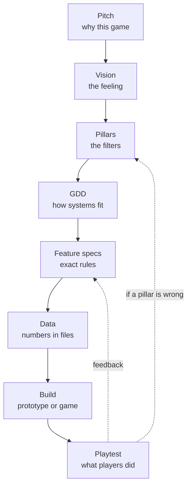

# Module 00: What game design is

- **Goal:** understand what a game designer decides, how design differs from development, which design roles exist and who owns what on a small team, how the design documents fit together, and how a decision travels from an idea to a number in a data file.
- **Prerequisites:** none.
- **Simulation:** none
- **Facts checked:** October 2026 (prices, rules and product status change; re-check before reuse)

## In short

Game design is deciding **what the player does, why it feels worth doing, and which rules produce that experience**. Development builds those rules; design specifies them and checks that they work on real people. On a big team design splits into roles (systems, combat, level, narrative, economy, UX, live and monetization). On a small team a few people wear all the hats, so the useful habit is to name **who owns each decision**. Design writing is a hierarchy, from a one-page pitch down to data tables, and every level must be explainable by the level above it. The worked example is the one-page pitch of the course game, a small online fantasy RPG that every later module designs one piece of.

## 1. The concept

### 1.1 Design versus development

A game is made of two kinds of work that depend on each other but are not the same.

| | Game design | Game development |
|---|---|---|
| **Question it answers** | "What should the player do and feel?" | "How do we build it so it runs?" |
| **Main output** | Rules, numbers, content plans, documents, prototypes | Code, art, audio, tools, builds |
| **Success test** | Players find it clear, interesting and fair | It runs correctly and fast on target devices |
| **Typical failure** | A feature that works but nobody enjoys | A good idea that crashes or cannot ship |
| **Skills** | Psychology, maths, writing, systems thinking | Programming, art, engineering, production |

The line is blurry in practice. A designer who edits a data file is doing a little development, and a programmer who decides a jump feels too floaty is doing a little design. The point of separating them is **ownership**: someone has to be responsible for the experience, and someone has to be responsible for the build.

Jesse Schell's textbook *The Art of Game Design* treats every design choice as something you can look at through many "lenses", such as the lens of the player, of curiosity or of fun. No single lens is complete, so good designers switch between them on purpose (see Further reading).

### 1.2 What a designer actually decides

A designer decides four kinds of things, from broad to narrow:

1. **Experience**: what the player should feel (tension, mastery, camaraderie) and in what order.
2. **Structure**: which systems exist (combat, classes, items, quests) and how they connect.
3. **Rules**: the exact behaviour of each system (what a skill does, when it can be used).
4. **Numbers**: the values inside the rules (damage 120, cooldown 8 s, drop rate 2 %).

Experience decisions are cheap to change and expensive to get wrong. Number decisions are cheap to change at any time. The skill is keeping each decision at the right level and not arguing about numbers (level 4) when the real disagreement is about experience (level 1).

### 1.3 The document hierarchy

Design is written down top-down, from **why** to **exactly how**, so a detail decided on page 40 does not quietly contradict the reason the project exists.

| Level | Document | Answers | Typical size | Changes |
|---|---|---|---|---|
| 1 | **Pitch / one-pager** | What is this game and why would anyone play it? | 1 page | Rarely, and only deliberately |
| 2 | **Vision statement** | What should the player experience, in one or two sentences? | 1–2 sentences | Rarely |
| 3 | **Pillars** | Which 3–5 principles filter every decision? | 3–5 short lines | Rarely |
| 4 | **Game design document (GDD)** | How do all the systems work together? | 20–200 pages, or a linked set of pages | Often |
| 5 | **Feature specs** | Exactly how does one mechanic behave? | 1–5 pages each | Every sprint |
| 6 | **Data** | What are the actual values? | Tables and files | Constantly |

A **GDD** (game design document) is the living description of all the systems in enough detail that a producer or engineer can act on it. Modern teams usually keep it as a set of linked pages or a wiki, not one huge file, because one monolithic document rots: nobody can keep 200 pages consistent. Module 05 covers how to keep documents alive.

Read the diagram twice. Downward arrows are **authority**: a lower level must be explainable by the level above. The dotted arrows are **evidence**: playtests change specs often, and pillars rarely, but when evidence says a pillar is wrong, you go all the way up and fix it there.

### 1.4 How a design decision flows

A decision usually travels like this:

1. **Trigger**: a question comes up ("should death cost money?").
2. **Frame**: restate it in terms of the player experience and the pillars.
3. **Options**: write two or three real options with what each costs (work, balance risk, player feeling).
4. **Decide**: the **owner** of that area chooses. If the decision touches a pillar, the lead designer or product owner chooses.
5. **Record**: write one or two lines in the spec: what was decided and why.
6. **Implement and test**: build the smallest version, then watch players.

Step 5 is the one teams skip, and it is the one that saves the most time later. Three months on, nobody remembers why death costs money, and the debate restarts.

## 2. The player's view

Players never see a pitch, a pillar or a spec. They see **the effect** of them: whether the first ten minutes make sense, whether fights are readable, whether a week of play feels like progress. A good document hierarchy is invisible to the player and shows up as a game that feels coherent, where each system seems to belong to the same world.

This is why design is tied to the two modules that follow:

- [Module 01](01-player-experience.md) names the **feelings** (aesthetics) and **motivations** the design is trying to serve.
- [Module 03](03-vision-pillars-loops.md) turns them into a vision, pillars and **loops** (the repeating action cycles that make a game playable for hours).

Every level of the hierarchy exists to protect one thing the player cares about: **a consistent promise**. A game that promises tense, readable fights and then ships a mode where you stand still and click a button has broken its promise, even if every individual feature works.

## 3. The design space

### 3.1 The design roles

On a team large enough to specialise, "game designer" splits into several roles. These are the most common ones for an online RPG.

| Role | Owns | Typical outputs | Works most with |
|---|---|---|---|
| **Systems designer** | The underlying rules: stats, formulas, progression, crafting | Formulas, spreadsheets, system specs | Combat, economy, programmers |
| **Combat designer** | How a single fight plays: skills, enemy behaviour, pacing of an encounter | Skill kits, enemy specs, encounter plans | Systems, level, animation, UX |
| **Level designer** | The spaces the player moves through: fields, dungeons, towns, encounter placement | Greybox maps, encounter layouts, pacing charts | Combat, narrative, art |
| **Narrative designer** | Story structure, quest sequencing, how story and gameplay reinforce each other (a writer produces the text; the narrative designer decides the structure) | Quest chains, story outlines, dialogue plans | Level, quests, writers |
| **Economy designer** | Currencies, drop rates, prices and how value flows over months | Source and sink tables, economy models | Systems, live, monetization |
| **UX designer** | How players understand and control the game: menus, HUD, onboarding, feedback | Wireframes, flows, UI specs, usability tests | Everyone |
| **Live and monetization designer** | What happens after launch: events, updates, shop, pacing of new content, fairness of what is sold | Roadmaps, event plans, shop designs, offer rules | Economy, product, community |

Two related roles sit next to design and are often confused with it:

- **Producer**: owns schedule, scope and the team's process. Decides *when* and *how much*, not *what feels right*.
- **Product owner**: owns the direction and trade-offs of the whole product (audience, business, scope). In small teams this person often signs off the vision and pillars.

### 3.2 Who owns what on a small team

A team of three to eight people cannot afford seven specialists. What it can afford is **explicit ownership**. The table shows a common split.

| Team size | Typical design staffing | Risk to watch |
|---|---|---|
| 1–2 people | One person wears every design hat | Nobody to challenge your own ideas; keep playtests frequent |
| 3–8 people | One lead designer plus one or two generalists; engineers own tools and data pipelines | Decisions fall between roles ("someone will do the numbers") |
| 9–30 people | A lead designer, separate systems / content / UX designers, a producer | Documents drift apart; need an owner for the whole GDD |
| 30+ people | Full specialisation, design director, per-feature owners | Design by committee; pillars get ignored |

A simple tool for small teams is a **decision-owner list**: one line per area, one name per line.

| Area | Owner (a role, not a person) | Final say on |
|---|---|---|
| Vision and pillars | Product owner with lead designer | Whether a feature is in scope |
| Combat and classes | Combat designer | Skill behaviour, class identity |
| Progression and economy | Systems designer | Curves, currencies, drop rates |
| World and quests | Level and narrative designer | Content layout and order |
| UI and onboarding | UX designer | Layout, flows, tutorials |
| Shop and live events | Live designer with product owner | What is sold, event cadence |

If two roles can both say "that is mine", you have a collision. If none can, you have a gap. Fix both on paper before they appear as bugs.

### 3.3 Three ways to organise documents

| Style | What it looks like | Good for | Cost |
|---|---|---|---|
| **Heavy GDD** | One long document written before production | Fixed-scope games, outsourced work, external sign-off | Out of date within weeks |
| **Lean pages** | A pitch, pillars, a wiki of linked specs and data tables | Live online games, small teams | Needs discipline to keep links and owners |
| **Prototype first** | A playable test plus a one-pager; docs written after the fun is found | New or unusual mechanics | Easy to skip writing things down |

### 3.4 How to choose

| If your game is... | Lean toward | Because |
|---|---|---|
| A long-running online game | Lean pages, with data tables as the source of truth | Content and balance change every month |
| A small team with an unclear core | Prototype first, then a one-pager | You do not yet know what to document |
| Built with outside partners | Heavier specs for the interfaces between teams | Others cannot read your mind |
| An early idea you must pitch | Pitch and vision first, GDD later | Funders read one page, not forty |

## 4. Tuning and pitfalls

Design documents have no numbers to tune, but they have clear health signals.

### 4.1 Signs the documents are sick

| Signal | Likely cause | Fix |
|---|---|---|
| Two specs contradict each other | No GDD owner; no review step | Name an owner; link specs back to pillars |
| Engineers "just decide" because the spec is silent | Spec too thin or too late | Specs include edge cases and example numbers |
| The same debate restarts every few months | No decision record | Write the decision and the reason in the spec |
| Nobody can name the pillars | Pillars are too long or too vague | Cut to 3–5 short lines (module 03) |
| Spec says one thing, game does another | Docs not updated after playtests | Treat the spec as part of "done" for a feature |
| A feature everyone loves does not fit | Vision drift, scope creep | Run the pillar check (module 03) before building |

### 4.2 Classic failures

- **Documentation as a substitute for playing.** A beautiful 100-page GDD does not tell you if the combat is fun. Build and test early.
- **Design by the loudest voice.** Without pillars, the strongest personality wins. Pillars give the quiet person an argument.
- **Design by default.** When the spec is silent, the programmer or artist decides, and nobody notices that a design decision was made.
- **Over-specifying too early.** Detailed numbers for a system you may cut in a month are wasted effort. Detail should increase as confidence does.
- **Under-specifying live systems.** An online game runs for years. A shop or economy with no written rules gets patched in panic.
- **No owner for the cross-cutting parts.** Onboarding, economy and difficulty touch everything, so they fall between roles.

### 4.3 Rules of thumb

1. **Decide at the lowest level that has the information.** A combat designer should not need the product owner to approve a cooldown.
2. **Escalate when a pillar is involved.** A decision that bends a pillar goes up.
3. **Write the "why" in one sentence next to every non-obvious rule.**
4. **Prefer a small, true document over a large, stale one.**
5. **Keep numbers in data files, not in prose.** A spec says "cooldown 8 s (see skills table)", so there is one source of truth.

## 5. Worked example

This is the one-page pitch of the **course game**. Every later module designs one part of it, and by module 30 the pieces add up to a complete design package. All numbers are invented for teaching.

### 5.1 One-page pitch

> **Working title:** none (the course game)
>
> **One-line pitch:** a small online fantasy RPG where you play one hero from a class you choose, fight in real time, team up with other players and explore a shared world, free to play on PC and mobile.
>
> **Genre and platforms:** online action RPG, real-time combat, PC and mobile with shared accounts.
>
> **Player fantasy:** "I am a hero with a clear role in a living frontier, and my friends and I are the reason it holds together."
>
> **Target players:** people who enjoy fantasy RPGs and online co-op, either at a desk for an hour or on a phone for 15 minutes (details in module 01).
>
> **Core loop:** fight a pack of monsters with your skills, collect loot and experience, return stronger.
>
> **Key features:**
> - Five classes at launch, each with its own role and a skill kit of eight active skills.
> - Real-time combat with a short, readable set of skills and telegraphed enemy attacks.
> - Parties of up to four players for dungeons and bosses, with simple matchmaking.
> - A shared, zoned world of four regions, with a story told through quest chains.
> - Gear that drops, upgrades and can be traded between players.
> - A weekly endgame schedule of dungeons and a world boss.
>
> **Business model:** free to play. Revenue from cosmetics, a convenience pass and a seasonal pass. No sale of combat power that players cannot also earn.
>
> **Scope of the first release:** levels 1 to 50, about 25 hours of content, four regions, ten dungeons, one world boss.
>
> **Comparables (genre, not studio):** the class-based online RPG with real-time combat, the style of many PC and mobile titles of the last twenty years.
>
> **Main risks:** (1) combat that is fun on PC but hard on touch; (2) an economy that inflates; (3) a shop that feels unfair.

### 5.2 What each line commits the design to

| Pitch line | Later module that must honour it |
|---|---|
| "One hero from a class you choose" | 07 (classes), 09 (party rules) |
| "Real time" | 05 (controls), 06 (combat) |
| "Parties of up to four" | 09, 18 (social), 20 (endgame) |
| "Shared world" | 15 (world), 18 |
| "Free to play on PC and mobile" | 14 (monetization), 23 (platforms) |
| "Levels 1 to 50, 25 hours" | 11 (progression), 16 (quests) |

### 5.3 What was cut from the pitch

A pitch is as much about what is left out. These ideas were considered and cut from the course game:

- **Housing and farming**: pleasant, but they pull the game toward a life-simulation and double the content load.
- **Open-world PvP everywhere**: fights between players need their own balance and moderation budget; the game ships one opt-in PvP mode instead (module 23).
- **A second playable character per account**: possible, but it is a different design (module 11 compares it).

### 5.4 Who owns what in the course game

| Area | Owner role |
|---|---|
| Vision and pillars | Product owner |
| Combat, classes, skills | Combat designer |
| Progression, items, economy | Systems designer |
| World, dungeons, quests | Level and narrative designer |
| HUD, controls, onboarding | UX designer |
| Shop, events, roadmap | Live designer |

In a team of five these six roles are covered by three people, with the lead designer owning vision, combat and classes, a second designer owning systems and economy, and a third owning world, quests and UX. The table still helps: when a question arrives, you can say whose it is.

### 5.5 How the pitch would differ for another kind of game

| Game type | What changes in the pitch |
|---|---|
| **Premium single-player RPG** | No business-model line; the pitch sells story and length; "scope" is hours to finish |
| **Squad or hero-collection game** | The fantasy becomes "I command a team I collected"; collection and team building appear as key features |
| **Auto-battle mobile RPG** | The core loop is "build, then watch"; session length is 2 to 5 minutes |
| **Competitive arena game** | The pitch is about match length and fairness; there is no progression-based story |

## Key takeaways

- Design decides what the player does and feels; development builds it. Someone must own each.
- A designer decides at four levels: experience, structure, rules, numbers. Do not argue about numbers when the disagreement is about experience.
- Write documents top-down: pitch, vision, pillars, GDD, feature specs, data. Each level must be explainable by the one above.
- Small teams do not need seven specialists but do need **named owners** for every area, or decisions fall into gaps.
- Record every non-obvious decision with one sentence of reasoning, or the same debate restarts.
- Keep numbers in data files and docs short, so there is one source of truth and the documents stay alive.
- The course game is a small online fantasy RPG with one hero per player, real-time combat, groups and a shared world, free to play on PC and mobile.

## Further reading

- Jesse Schell, *The Art of Game Design: A Book of Lenses* (book, 3rd edition 2019): the lens approach to design decisions, roles and documents. Author and publisher information: https://www.schellgames.com/art-of-game-design
- Wikipedia, [Game design](https://en.wikipedia.org/wiki/Game_design): quick overview of the discipline and its sub-areas.
- Wikipedia, [Game designer](https://en.wikipedia.org/wiki/Game_designer): the role and its common specialisations.
- Wikipedia, [Game design document](https://en.wikipedia.org/wiki/Game_design_document): what a GDD contains and common variants.
- Robin Hunicke, Marc LeBlanc, Robert Zubek, [*MDA: A Formal Approach to Game Design and Game Research*](https://users.cs.northwestern.edu/~hunicke/MDA.pdf) (2004): the framework behind module 01.
