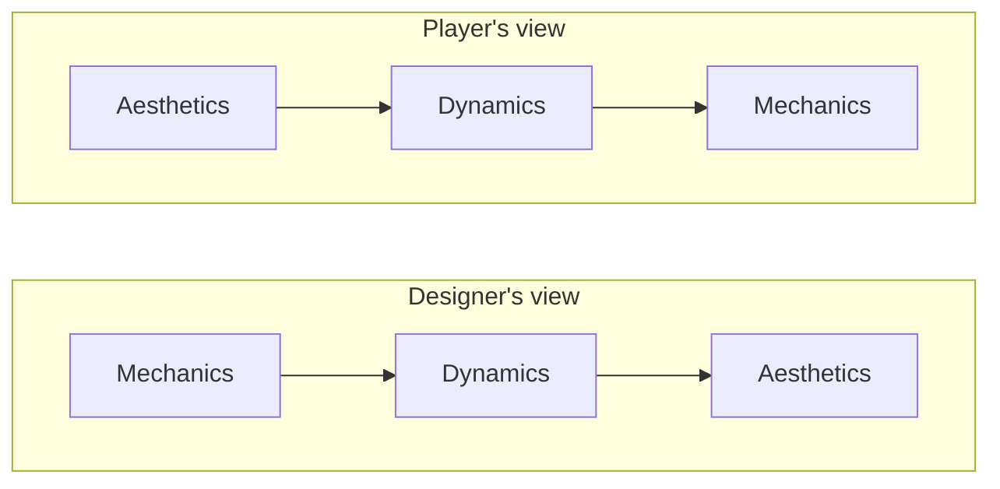
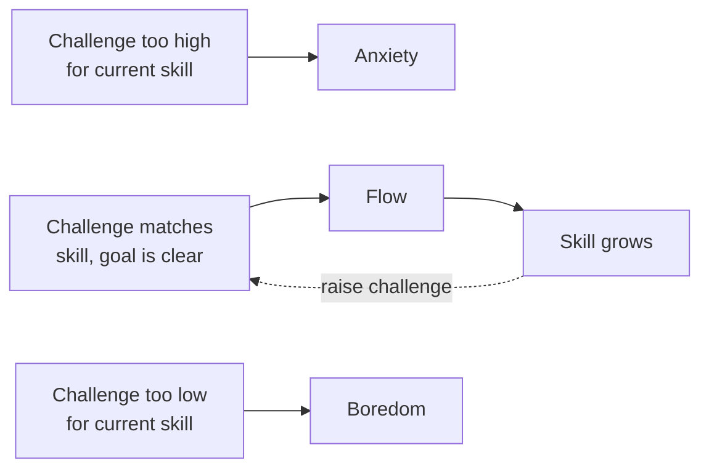

# Module 01: The player experience

- **Goal:** understand the feelings a game can deliver (MDA aesthetics), the main models of why people play (Bartle, Quantic Foundry, Self-Determination Theory), what flow is and how to keep players in it, and how to define a target audience with personas, so a design can aim at specific feelings for specific people.
- **Prerequisites:** [00 — What game design is](00-what-game-design-is.md).
- **Simulation:** none
- **Facts checked:** October 2026 (prices, rules and product status change; re-check before reuse)

## In short

Players do not buy rules, they buy **feelings**. The MDA framework says designers write **mechanics**, mechanics produce **dynamics** (what players actually do), and dynamics produce **aesthetics** (what players feel). Three models explain why people play: Bartle's four player types (old, coarse, easy to remember), Quantic Foundry's 12 motivations (data-based, genre-friendly) and Self-Determination Theory (three psychological needs that explain why a system feels good). Flow describes the state of being fully absorbed, which needs the right balance of challenge and skill. You choose your audience by motivation and behaviour, not only by age, then write a few personas. The worked example defines the course game's target players and ranks the feelings it must deliver.

## 1. The concept

### 1.1 MDA: mechanics, dynamics, aesthetics

**MDA** is a framework by Robin Hunicke, Marc LeBlanc and Robert Zubek (paper: *MDA: A Formal Approach to Game Design and Game Research*, 2004). It splits a game into three layers.

| Layer | What it is | Who controls it | Example in an online RPG |
|---|---|---|---|
| **Mechanics** | The rules and data: what exists, what actions are possible | The designer, directly | "A skill heals 20 % of max HP; 12 s cooldown" |
| **Dynamics** | The behaviour that emerges when players act on the mechanics | Nobody directly | "Groups always bring one healer and wait for her cooldowns" |
| **Aesthetics** | The emotional response of the player | The result | "I feel needed by my group" |

The key idea: **designers work from mechanics toward aesthetics, but players experience the game from aesthetics toward mechanics.** A player feels tension first and only reverse-engineers the rules if they care. That is why playtesting cannot be replaced: you can be certain of your mechanics and wrong about the feeling, because dynamics are emergent.

### 1.2 The eight aesthetics

The MDA paper replaces the vague word "fun" with eight named kinds of enjoyment. They are a **vocabulary**, not a complete theory, and one game usually delivers three or four strongly.

| Aesthetic | Meaning | Example of a mechanic that serves it |
|---|---|---|
| **Sensation** | Game as sense-pleasure | Hit effects, sound, screen shake, music |
| **Fantasy** | Game as make-believe | Class identity, costumes, a heroic title |
| **Narrative** | Game as drama | Quest chains, cutscenes, an unfolding mystery |
| **Challenge** | Game as an obstacle course | Bosses with patterns, difficulty tiers |
| **Fellowship** | Game as social framework | Parties, guilds, shared goals |
| **Discovery** | Game as uncharted territory | Hidden areas, secret recipes, lore |
| **Expression** | Game as self-discovery | Appearance, build choices, naming |
| **Submission** | Game as pastime | Relaxing routines, auto-run, repetitive farming |

Aesthetics can conflict. A design strongly built for **Challenge** (hard, punishing bosses) tends to work against **Submission** (relaxing play). Pick which ones come first.

### 1.3 Why people play: three models

No model is "the truth". Each answers a different question, and they work well together.

| Model | Question it answers | Best used for |
|---|---|---|
| **Bartle's taxonomy** | What kind of player is this? | A quick shared vocabulary |
| **Quantic Foundry's Gamer Motivation Model** | Which motivations does this player have, and how strongly? | Genre fit, content planning, marketing |
| **Self-Determination Theory** | Why does this feel good at a human level? | Checking whether a system is satisfying |

### 1.4 Bartle's player types

Richard Bartle wrote the classic paper *Hearts, Clubs, Diamonds, Spades: Players Who Suit MUDs* (1996) after studying early text-based multiplayer worlds. He sorted players on two axes: do they prefer **acting** or **interacting**, and is the target the **world** or **other players**?

| | Acting (do things to) | Interacting (engage with) |
|---|---|---|
| **The world** | **Achievers**: collect points, levels, gear | **Explorers**: map the world, learn how it works |
| **Other players** | **Killers**: impose themselves on others (competition, domination) | **Socializers**: enjoy the people, use the game as a place to meet |

Strengths: it is easy to remember, and it explains why a feature that thrills one group bores another. Weaknesses: it came from a narrow audience (early MUDs), it labels people rather than motivations, and real players mix types and change by day. Use it as a conversation tool, not as a measurement.

### 1.5 Quantic Foundry's 12 motivations

Nick Yee and Quantic Foundry built the **Gamer Motivation Model** from surveys of hundreds of thousands of players (the 2019 GDC talk cites more than 400,000). It describes 12 motivations in six pairs, grouped into three clusters.

| Cluster | Motivation | What the player enjoys |
|---|---|---|
| **Action-Social** | **Destruction** | Chaos, blowing things up, causing mayhem |
| | **Excitement** | Fast pace, surprises, thrills |
| | **Competition** | Duels, ranking, beating others |
| | **Community** | Chatting, helping, being on a team |
| **Mastery-Achievement** | **Challenge** | Practising, overcoming hard content |
| | **Strategy** | Thinking, planning, making clever decisions |
| | **Completion** | Finishing everything, collecting |
| | **Power** | Becoming strong, powerful characters and gear |
| **Immersion-Creativity** | **Fantasy** | Being someone else somewhere else |
| | **Story** | Following a plot and characters |
| | **Design** | Customising and building things |
| | **Discovery** | Exploring and experimenting |

Why it is useful for a designer: the motivations are measured per player, so you can build a **profile** (high Community, medium Power, low Competition) instead of a single label. Each genre has a typical profile, and the model shows which features serve which motivation. For example, a shared-world RPG usually attracts players high in Community, Power and Completion, with Fantasy and Story close behind.

Limit: the data comes from players who answered a survey, not from everyone, and motivations describe tendencies, not destiny.

### 1.6 Self-Determination Theory

**Self-Determination Theory** (SDT) is a general psychology theory by Edward Deci and Richard Ryan. Ryan, Rigby and Przybylski applied it to games in *The Motivational Pull of Video Games* (2006). It proposes three basic human needs that, when satisfied, make an activity feel intrinsically rewarding.

| Need | Meaning | How a game serves it |
|---|---|---|
| **Autonomy** | "My choices are my own" | Build choices, multiple paths, optional content |
| **Competence** | "I am capable and improving" | Clear feedback, a fair difficulty curve, visible mastery |
| **Relatedness** | "I am connected to others" | Parties, guilds, characters you care about |

SDT does not tell you what content to build. It tells you why a feature **feels** good or bad. A progression system that rewards only time spent (not skill) fails competence; a dungeon that forces one build fails autonomy; a game with no way to recognise other players fails relatedness.

### 1.7 Flow

**Flow** is a state of complete absorption in an activity, described by psychologist Mihaly Csikszentmihalyi (*Flow: The Psychology of Optimal Experience*, 1990). Time seems to pass quickly and effort feels natural. Three conditions matter most for games:

1. **Clear goals** at every moment (what am I doing right now?).
2. **Immediate feedback** (did that work?).
3. **A balance between challenge and skill.**

Too much challenge for the player's skill produces **anxiety**; too little produces **boredom**. Flow lives in a band in between, and the band moves upward as skill grows.

Designers cannot create flow directly. They create the conditions: clear goals, quick feedback, and difficulty that grows with the player. The game designer and researcher Jenova Chen applied this idea to games in his work *Flow in Games* (see Further reading), arguing that games can adapt difficulty so that different players each stay in their own band.

### 1.8 Target audience and player personas

A **target audience** is the group of players the game is built to delight. You cannot design well for "everyone", because many features conflict (a mode that thrills competitive players frightens relaxed ones).

A **persona** is a short, concrete description of one typical player in that audience: their situation, motivations, play habits and frustrations. Personas come from user-experience practice (see Further reading), and they work only if they are based on real observation (interviews, surveys, analytics) and not invented to flatter the design.

A useful persona has:

| Field | Purpose |
|---|---|
| **Name and short label** | Memorable, so the team can say "would Mira like this?" |
| **Situation** | When, where and on which device they play |
| **Motivations** | Top motivations from the model you use |
| **Habits** | Session length, days per week, social pattern |
| **Frustrations** | What makes them quit |
| **What the design must give them** | A design requirement, not a wish |

## 2. The player's view

A player rarely says "I want more Competence". They say "I feel like I am getting better" or "I do not know what to do next". Your job is to translate vague feelings into the vocabulary above so that design discussions stay precise.

**How the three models connect to the core loop (module 02):** the core loop is where aesthetics such as Challenge and Sensation are delivered second by second. The session loop is where Competence and Autonomy (choosing what to do next) show up. The meta loop is where Completion, Power and Fellowship keep people returning for weeks. If an aesthetic you promise has no loop that delivers it, players will not feel it.

Typical player-facing signals and what they usually mean:

| What a player says | Likely issue |
|---|---|
| "I do not know what to do" | Goals unclear (flow condition 1) |
| "It is too easy" | Challenge below skill: boredom |
| "It is too hard, I quit" | Challenge above skill: anxiety, or the cost of failure is too high |
| "Nothing I do matters" | Autonomy or competence not satisfied |
| "I play because of my friends" | Relatedness carries the game; the rest may be weak |
| "I just grind" | Submission or Completion without other aesthetics; risk of churn |

## 3. The design space

### 3.1 Ways to define an audience

| Approach | Idea | Strength | Weakness |
|---|---|---|---|
| **Demographic** | Age, gender, country, income | Easy to buy ads for | Weak predictor of how people play |
| **Motivation-based** | Profile on a model such as the 12 motivations | Predicts genre and feature fit | Needs surveys or data |
| **Behaviour-based** | Session length, spend, social activity | Directly measurable in a live game | Only known after launch |
| **Platform and situation** | Desk or phone, long or short sessions | Drives control, session and UI design | Misses motivation |
| **Jobs-to-be-done** | "I want to unwind for 20 minutes after work" | Anchors design in real situations | Less standard in games |

Most teams combine two: **motivation** for what to build, **situation** for how to fit it into a life.

### 3.2 Choosing and mixing motivation models

| Model | Granularity | Evidence base | Cost to use |
|---|---|---|---|
| Bartle | 4 types | Single paper, early MUDs | Free, instant |
| Quantic Foundry | 12 motivations, 3 clusters | Surveys of hundreds of thousands of players | Free articles; paid profiles |
| SDT | 3 needs | Decades of psychology research | Free; abstract |

| If you want to... | Use |
|---|---|
| Explain to non-designers why a feature splits the audience | Bartle |
| Plan content mix and check genre fit | Quantic Foundry |
| Check why a system feels satisfying or hollow | SDT |
| Analyse a live game's real behaviour | Your own data first, then map it back to a model |

### 3.3 How many personas

| Count | When it works |
|---|---|
| **1** | Tiny team; a very focused game |
| **2 to 4** | The sweet spot: enough to cover the core and the edges |
| **5 or more** | Rarely helpful; the team stops remembering them |

Keep one persona as **primary** (the one you design for when the others conflict) and the others as **secondary** (the design must not hurt them).

## 4. Tuning and pitfalls

### 4.1 Rules of thumb

- **Rank aesthetics.** Choose three or four to deliver strongly and accept that others will be weak. If everything is a priority, nothing is.
- **Match features to motivations.** Each major system should serve at least one top motivation of the primary persona.
- **Check each need in SDT.** For every core system ask: where is autonomy, competence and relatedness?
- **Plan flow bands per player type.** A new player and a veteran need different difficulties in the same content, for example normal and hard modes.
- **Use personas as a test, not as decoration.** For each major feature ask "would the primary persona use this, and what would the secondary persona lose?"

### 4.2 Signals that the experience is wrong

| Signal | Possible cause |
|---|---|
| High drop-off in the first session | Goals unclear, or first challenge too hard or too easy |
| Players clear content then leave | Only Challenge or Completion was served; no social or meta loop |
| Players log in to do chores and complain | Chores replaced goals; Submission without joy |
| Social features unused | Relatedness assumed, not designed; no reason to group |
| Survey says "fun" but retention is low | Aesthetics delivered but no reason to return (meta loop) |
| Survey says "boring" but retention is high | Players are staying for social ties, not the game |

### 4.3 Classic failures

- **Designing for yourself.** Designers are not the average player. Test with the personas, not with the team's taste.
- **Treating Bartle as a label.** People are not "an Achiever". The same player is a Socializer on Friday night and an Achiever on Sunday morning.
- **Using one aesthetic to mask a weak one.** Beautiful effects (Sensation) cannot rescue a weak fight (Challenge).
- **Personas invented, not observed.** A persona with no data is a wish.
- **Ignoring situation.** A great dungeon that needs 90 uninterrupted minutes fails the player who has 15 minutes on a phone.
- **Confusing popularity with fit.** A genre that is popular overall may not be what your specific audience wants. Check the profile, not the market size.

## 5. Worked example

The **course game** is a small online fantasy RPG for PC and mobile: one hero per player, class-based, real-time combat, player parties, a shared world and a free-to-play model. All personas and numbers are invented for teaching.

### 5.1 Target players

The course game targets players who like **fantasy RPGs and shared worlds**, and who play at least some sessions together with other people. It does **not** target hardcore competitive players or players who want a purely single-player story.

### 5.2 Three personas

| | **Mira, the group regular** (primary) | **Dev, the commuter** | **Lena, the loremaster** |
|---|---|---|---|
| **Situation** | Plays on PC in the evening, 1 to 2 hours, 5 evenings a week (about 7.5 hours) | Plays on a phone, 15 to 25 min sessions, 6 days a week (about 2.6 hours) | Plays on PC on weekends, long sessions, reads everything |
| **Top motivations** | Community, Power, Challenge | Completion, Power, Excitement | Story, Discovery, Fantasy |
| **Habits** | Runs dungeons with the same group; cares about a good role in the party | Logs in for the daily tasks; wants progress in short bursts | Explores every corner; tries all quests |
| **Frustrations** | Waiting for a party; a teammate who ruins a run | Content that needs a long block of time | Quests that are only "kill ten" with no story |
| **The design must give** | Easy grouping, a clear role, boss fights that reward coordination | Short, meaningful goals; progress saved at any moment | Quest text with stakes; secrets worth finding |

Mira is the primary persona. When a decision is a trade-off, the design favours Mira. Dev and Lena are secondary: the design must not break their experience.

### 5.3 Motivation profile of the course game (Quantic Foundry)

The profile shows what the **game design** serves, not a number from a survey.

| Cluster | Motivation | Priority | How the game serves it |
|---|---|---|---|
| Action-Social | Community | **High** | Parties, guilds, shared bosses |
| | Excitement | Medium | Real-time fights, boss moments |
| | Competition | Low | One opt-in PvP mode only |
| | Destruction | Low | Area skills and visual impact, nothing more |
| Mastery-Achievement | Power | **High** | Levels, gear, enhancement |
| | Challenge | **High** | Bosses with patterns, dungeon difficulty tiers |
| | Completion | Medium | Collections, achievements |
| | Strategy | Medium | Class build choices, party composition |
| Immersion-Creativity | Fantasy | Medium | Class identity, appearance |
| | Story | Medium | Quest chains |
| | Discovery | Low | Hidden areas, light exploration |
| | Design | Low | Appearance only, no building |

### 5.4 The feelings to deliver (MDA aesthetics, ranked)

| Rank | Aesthetic | Target feeling | A mechanic that delivers it |
|---|---|---|---|
| 1 | **Fellowship** | "My group needed me" | Party roles that make a group stronger than solo play |
| 2 | **Challenge** | "I mastered that boss" | Telegraphed boss patterns, a visible skill ceiling |
| 3 | **Fantasy** | "I am a real knight / mage / ranger" | Class-specific skills, animations and gear looks |
| 4 | **Sensation** | "That hit felt great" | Hit feedback, sound, impact effects |
| 5 | **Narrative** | "I care how this ends" | Quest chains with named characters |
| 6 | **Discovery** | "I found a hidden path" | A few secrets per region |
| 7 | **Expression** | "This is my hero" | Appearance and a small build choice |
| 8 | **Submission** | "I can relax and run my dailies" | Optional auto-run and simple chores |

Submission ranks last on purpose: the game makes it available (Dev's commute) but does not build around it.

### 5.5 Self-Determination Theory check

| Need | Where the course game satisfies it | Risk |
|---|---|---|
| **Autonomy** | Class choice, build choice, which content to do next | Too many currencies make the choice meaningless |
| **Competence** | Clear feedback in combat, bosses that teach their patterns | A gear-gated game where skill does not matter |
| **Relatedness** | Parties, guilds, shared world bosses | Matchmaking that puts people with strangers and gives no chat |

### 5.6 Flow plan

| Stage | Goal for the player | Challenge target | Feedback |
|---|---|---|---|
| **First 10 minutes** | Learn movement and two skills | Very low; success almost guaranteed | Immediate hit effects, a clear arrow to the next goal |
| **Levels 1 to 15** | Learn the class | Low to medium; enemies teach one new thing at a time | Skill unlocks every level or two |
| **Levels 15 to 50** | Combine skills, cooperate | Medium; first group dungeon around level 15 | Boss telegraphs, a damage summary after the fight |
| **Endgame** | Master patterns | High but fair; difficulty tiers for different skill bands | Clear ranks and clear-time records |

### 5.7 How the design would differ for another kind of game

| Game type | Which personas and aesthetics change |
|---|---|
| **Competitive arena game** | Competition and Challenge move to the top; the persona is a ranked player; Narrative nearly disappears |
| **Auto-battle collection game** | Completion and Power lead; the persona is a short-session collector; Fantasy is carried by characters, not by one hero |
| **Single-player story RPG** | Story and Fantasy lead; Fellowship is replaced by relatedness with story characters |
| **Social or casual game** | Community and Submission lead; low Challenge to protect flow for relaxed players |

## Key takeaways

- Players buy feelings. MDA links the designer's mechanics, through the players' dynamics, to the aesthetics they feel.
- The eight aesthetics (sensation, fantasy, narrative, challenge, fellowship, discovery, expression, submission) are a vocabulary: choose three or four to deliver strongly and accept that others will be weaker.
- Bartle (4 types) gives a quick shared language, Quantic Foundry (12 motivations) gives a measurable profile, and SDT (autonomy, competence, relatedness) explains why a system feels good.
- Flow needs clear goals, immediate feedback and challenge that matches skill, and the band must move as the player improves.
- Define the audience by motivation and situation, then write two to four personas from real data, and name one as primary.
- Check every major feature against the primary persona and against each SDT need.
- The course game targets group-loving fantasy RPG players, ranks Fellowship, Challenge and Fantasy first, and treats Submission as a supported but low-priority feeling.

## Further reading

- Robin Hunicke, Marc LeBlanc, Robert Zubek, [*MDA: A Formal Approach to Game Design and Game Research*](https://users.cs.northwestern.edu/~hunicke/MDA.pdf) (2004): the original framework paper, including the eight aesthetics.
- Richard Bartle, [*Hearts, Clubs, Diamonds, Spades: Players Who Suit MUDs*](https://mud.co.uk/richard/hcds.htm) (1996): the original Bartle paper.
- Wikipedia, [Bartle taxonomy of player types](https://en.wikipedia.org/wiki/Bartle_taxonomy_of_player_types): short summary and criticism.
- Nick Yee and Quantic Foundry, [Gamer Motivation Model](https://quanticfoundry.com/gamer-motivation-model/): the 12 motivations and the data behind them.
- Nick Yee, GDC 2019, [*A Deep Dive into the 12 Motivations: Findings from 400,000+ Gamers*](https://gdcvault.com/play/1025742/A-Deep-Dive-into-the) (GDC Vault; full video may need an account).
- Ryan, Rigby and Przybylski, [*The Motivational Pull of Video Games: A Self-Determination Theory Approach*](https://selfdeterminationtheory.org/SDT/documents/2006_RyanRigbyPrzybylski_MandE.pdf) (2006).
- Wikipedia, [Self-determination theory](https://en.wikipedia.org/wiki/Self-determination_theory): the general theory behind autonomy, competence and relatedness.
- Mihaly Csikszentmihalyi, *Flow: The Psychology of Optimal Experience* (book, 1990); overview: [Flow (psychology)](https://en.wikipedia.org/wiki/Flow_(psychology)).
- Jenova Chen, [*Flow in Games*](https://www.jenovachen.com/flowingames/): how flow applies to game design and difficulty.
- Wikipedia, [Persona (user experience)](https://en.wikipedia.org/wiki/Persona_(user_experience)): what personas are and how they are built.
