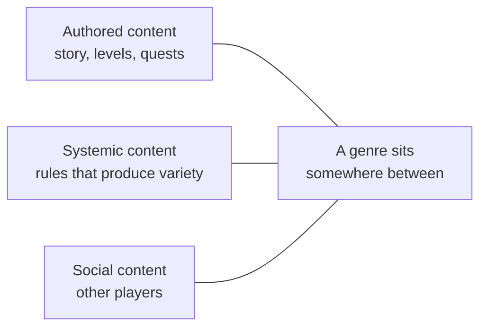
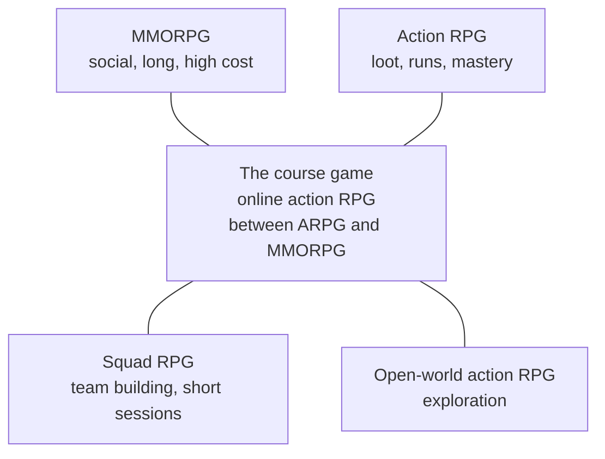

# Module 02: Genres and formats

- **Goal:** read the map of game genres as a designer: know each genre's core loop, the aesthetics it serves, what makes it fun, how long a session lasts and what its content costs, and choose a genre and format that fit a team, an audience and a platform.
- **Prerequisites:** [01 — The player experience](01-player-experience.md), [03 — Vision, pillars and loops](03-vision-pillars-loops.md), [11 — One hero, a party or a roster](11-party-roster.md).
- **Simulation:** none
- **Facts checked:** October 2026 (prices, rules and product status change; re-check before reuse)

## In short

A **genre** is a bundle of promises: a core loop, a set of feelings, a typical session length and a content cost. Players choose games by those promises, and a team chooses a genre by what it can afford to keep. This module maps the genres an online-RPG designer meets most often: the MMORPG, the open-world action RPG, the squad (hero-collection) RPG, the action RPG, tactics, roguelike and roguelite, platformer, card and deck-building, puzzle, adventure and visual novel, and idle and auto-battle games. It then looks at **classic and 8-bit style games**, where small rule sets and hard limits are a design method, not a lack of money. The worked example places the course game on the map and shows how its design would change as an open-world action RPG, as a squad RPG and as a small classic-style game.

## 1. The concept

### 1.1 Terms

| Term | Meaning |
|---|---|
| **Genre** | A family of games that share a core loop and a set of player expectations. Genres blend; labels are only a shortcut |
| **Format** | How the game is delivered and played: platform, session length, single or online, free or paid, real time or turn based |
| **Core loop** | The 30–90 second cycle the player repeats (module 03) |
| **Aesthetics** | The eight feelings of the MDA framework (module 01): Sensation, Fantasy, Narrative, Challenge, Fellowship, Discovery, Expression, Submission |
| **Content cost** | How many hours of authored work one hour of play needs. The most important number for a small team |
| **Replayability** | How much the game stays fresh without new authored content (random levels, builds, other players) |
| **Gacha** | A random draw that gives characters or items, usually sold for premium currency (module 17) |
| **Hero collection (squad RPG)** | An RPG where the player collects many heroes and fields a small team of them (module 11) |
| **Roguelike / roguelite** | A game of short runs with random levels; the roguelike loses everything on death, the roguelite keeps some permanent progress |
| **Auto-battle** | Combat that runs itself once the team is set up; the player decides the setup and sometimes the timing of key skills |

### 1.2 Genres sit between three axes

A visual novel is almost all authored content. A roguelike is mostly systemic: a few rules make endless runs. An MMORPG leans on social content: other players are the reason to stay. Where a genre sits on these axes explains most of its content cost and its retention.

## 2. The player's view

Players do not choose "a genre". They choose a feeling for an evening: to master a tight skill, to see a story, to build something powerful, to relax, to play with friends. Each genre is a reliable way to deliver one or two of these feelings. The designer's first question (module 01) is therefore not "what genre is it?" but "which aesthetics must the player feel, and which genre delivers them at a cost we can pay?"

Players also arrive with **expectations** from the genre. A player who opens a squad RPG expects collecting, team building and some automation; the same player opens an action RPG expecting to control the hero in real time. Breaking an expectation can be a selling point, but it must be a deliberate choice, and it must be visible in the first minutes (module 26).

## 3. The design space

### 3.1 The genre map

Each entry gives the core loop, the main aesthetics, what makes it fun, a typical session and the content cost. Session lengths and costs are rules of thumb, not measurements.

#### MMORPG (massively multiplayer online RPG)

- **Core loop:** fight enemies with a class, loot and gain levels, return to a town, group up for bigger content.
- **Aesthetics:** Fellowship, Fantasy, Challenge, Discovery.
- **What makes it fun:** a persistent shared world, a role inside a group, long progression, a social identity (guild, reputation).
- **Typical session:** 1–3 hours at a PC; the hobby lasts months or years.
- **Content cost:** very high and never finished. Players consume content faster than a team can make it, so the genre depends on repeatable content (dungeons, seasons) and on players entertaining each other.
- **Public examples:** *World of Warcraft*, *Final Fantasy XIV*, *Guild Wars 2*.

#### Open-world action RPG

- **Core loop:** pick a direction, travel, find something (a puzzle, a chest, a camp, an enemy), solve or fight it, collect a reward, upgrade the hero, pick the next direction.
- **Aesthetics:** Discovery, Sensation, Fantasy, Expression.
- **What makes it fun:** self-directed exploration, movement that is a joy by itself (climbing, gliding), real-time combat, a steady stream of small rewards.
- **Typical session:** 30–90 minutes; weekly resets and daily tasks pull players back in a live-service version.
- **Content cost:** high and spread over a large area. The map is cheap to paint, expensive to fill with points of interest that are worth finding. See also module 18, section 3.1.
- **Public example:** *Genshin Impact*. Released in September 2020 for PC, console and mobile, free to play with a character draw (gacha) as its main revenue. The player controls one character at a time from a party of four and switches between them; combat uses elemental interactions; the world can be explored on foot, by climbing and gliding with a stamina limit; up to four players can explore together in co-op. Status as of October 2026: in live service with regular version updates (not independently re-verified for this edition).

#### Squad or hero-collection RPG

- **Core loop:** gather heroes, build a team of a few, fight stage or boss battles (often with automation), earn materials and heroes, strengthen them, try harder content.
- **Aesthetics:** Challenge (team building), Expression (the team is mine), Fantasy, Fellowship (guilds), Submission (collecting).
- **What makes it fun:** collecting, the puzzle of team composition and roles, a visible power curve, short sessions.
- **Typical session:** 10–30 minutes on a phone, once or several times a day.
- **Content cost:** driven by the number of heroes (each needs art, animation, skills and a voice) rather than by map size. Each new hero is also the main product the game sells.
- **Public example:** *King's Raid*, a mobile hero-collection RPG by the studio Vespa, launched in Thailand in September 2016 and worldwide in February 2017. The player builds a party of four heroes from classes such as knight, warrior, assassin, archer, mechanic, wizard and priest. Battles are real time with 3D heroes, and the player can let the heroes fight on their own while choosing when to cast skills; heroes are placed in a front row and a back row. Content includes a story campaign, tower and dungeon stages, a competitive arena and guild raid battles. Heroes could be obtained through tickets and other routes besides random draws, which the game's publicity noted as unusual for the genre. Service status as of October 2026: the original service by Vespa was announced in February 2025 to close in spring 2025 (sources differ on the exact day), and another company announced it had bought the rights and was testing a rebuilt version in closed betas in 2026; a final public relaunch was not verified for this edition.
- **How it differs from the open-world action RPG:** the player's skill is in preparing a team, not in moving the hero; sessions are short; the world is a menu of stages.

#### Action RPG (ARPG)

- **Core loop:** kill packs of enemies in real time, loot, compare and equip gear, level up, face a boss, repeat on a harder setting.
- **Aesthetics:** Sensation, Challenge, Expression (the build), Submission.
- **What makes it fun:** fast, tactile combat and the loot chase; many players run the same dungeon dozens of times.
- **Typical session:** 1–2 hours; runs of 15–40 minutes.
- **Content cost:** medium. Systemic: random levels and random loot make a few authored pieces last. The depth is in the item and skill rules (modules 10 and 15).
- **Public examples:** *Diablo III*, *Path of Exile*.

#### Tactics (turn-based and grid-based)

- **Core loop:** study a battlefield, move units, use abilities in turn order, finish the encounter with the fewest losses.
- **Aesthetics:** Challenge, Fantasy, Narrative.
- **What makes it fun:** perfect information and planning; the player always knows why they won or lost.
- **Typical session:** 30–60 minutes for a battle; a campaign takes dozens of hours.
- **Content cost:** medium. Maps and encounters must be authored and tested, but there is little animation load and no real-time precision to build.
- **Public examples:** *XCOM*, *Fire Emblem*.

#### Roguelike and roguelite

- **Core loop:** start a run, choose between random rewards after each room, build a combination, meet a boss, die or win, restart (a roguelite keeps meta progress, such as unlocks).
- **Aesthetics:** Challenge, Discovery, Expression.
- **What makes it fun:** every run is a new puzzle of building a strong combination from random parts; failure is cheap and teaches.
- **Typical session:** 20–60 minutes per run, one more run at a time.
- **Content cost:** low per hour of play. A set of rooms, enemies and rewards combine into endless runs; the cost is in tuning the combinations so that none is broken.
- **Public examples:** *Hades*, *Slay the Spire* (also a deck builder), *The Binding of Isaac*.

#### Platformer

- **Core loop:** run and jump through a level, avoid hazards, reach the end, learn the rhythm and try again.
- **Aesthetics:** Sensation, Challenge, Discovery.
- **What makes it fun:** the movement itself: precise, responsive, expressive. Mastery is visible.
- **Typical session:** 5–30 minutes per level, play for a few hours total.
- **Content cost:** high per minute of play (each level is hand-made and hand-tested) but low per system, since the rule set is tiny. Feel work (module 06) is the main investment.
- **Public examples:** *Super Mario Bros.*, *Celeste*.

#### Card and deck-building

- **Core loop:** draw cards, play them using a resource, beat the opponent or the encounter; between games, collect cards or build a deck.
- **Aesthetics:** Challenge, Expression, Submission (collecting).
- **What makes it fun:** combinations and discovering a clever interaction; hidden information and chance add tension.
- **Typical session:** 5–20 minutes per match.
- **Content cost:** a new card is cheap to make but expensive to balance, because each card interacts with every other. Online competitive versions need constant balance patches.
- **Public examples:** *Hearthstone*, *Magic: The Gathering Arena*, *Slay the Spire*.

#### Puzzle

- **Core loop:** see a problem, form a hypothesis, test it, solve and move to the next.
- **Aesthetics:** Challenge, Discovery, Submission (relaxed solving).
- **What makes it fun:** the "aha" moment, and a clean difficulty curve.
- **Typical session:** 2–15 minutes per level, ideal for short breaks.
- **Content cost:** low per level for match-style puzzles (tools can generate levels), high for hand-made logic puzzles where every solution is verified.
- **Public examples:** *Tetris*, *Portal*, *Candy Crush Saga*.

#### Adventure and visual novel

- **Core loop:** read or explore, make a choice or solve a small puzzle, see the story move.
- **Aesthetics:** Narrative, Fantasy, Discovery.
- **What makes it fun:** characters, mystery and choices that matter to the story.
- **Typical session:** 30–120 minutes; the whole game can be finished in a weekend.
- **Content cost:** mostly writing and art; no combat systems to balance. Branches multiply the writing quickly, so most games branch a little and rejoin.
- **Public examples:** *Disco Elysium*, the *Ace Attorney* series.

#### Idle and auto-battle

- **Core loop:** the game progresses by itself (resources accumulate, battles run); the player makes upgrade decisions and checks in.
- **Aesthetics:** Submission, Challenge (optimisation), Fantasy (growing power).
- **What makes it fun:** visible growth with little effort, planning the next upgrade, a sense of a world that works while you are away.
- **Typical session:** a minute or two, many times a day.
- **Content cost:** low for the first hours, and it needs steady new layers (prestige, new currencies) to avoid running out. The design risk is retention through habit and not through meaning.
- **Public examples:** *Cookie Clicker*, many mobile idle RPGs.

### 3.2 Comparison at a glance

| Genre | Core loop length | Session | Content cost | Replay without new content | Social need |
|---|---|---|---|---|---|
| MMORPG | 30–90 s | 1–3 h | Very high | Medium (other players) | High |
| Open-world action RPG | 1–10 min | 30–90 min | High | Low–medium | Low–medium |
| Squad RPG | 1–5 min | 10–30 min | High (per hero) | Medium | Low–medium |
| Action RPG | 30–90 s | 1–2 h | Medium | High (loot) | Low |
| Tactics | 5–15 min per battle | 30–60 min | Medium | Low | None |
| Roguelike / roguelite | 1–3 min | 20–60 min | Low | Very high | None |
| Platformer | 10–60 s | 5–30 min | High per minute | Low | None |
| Card / deck-building | 5–20 min per match | 5–20 min | Low per card, high to balance | High | Optional |
| Puzzle | 1–5 min | 2–15 min | Low–high | Low–medium | None |
| Adventure / visual novel | 1–10 min | 30–120 min | Medium (writing and art) | Low | None |
| Idle / auto-battle | seconds | 1–5 min | Low at first | Medium | Low |

### 3.3 Classic, retro and 8-bit style games

**Classic or retro** here means a game built in the spirit of the earliest console and arcade generations (roughly the 1980s 8-bit era), whether it is an old title or a new one made in that style. As a design approach it has five traits:

1. **A tight core loop.** One verb or a few (run, jump, shoot, collect) carry the whole game.
2. **A small rule set.** A player can state the rules in two sentences. Depth comes from combining few rules in new levels.
3. **Hard limits as design tools.** A small palette, a low resolution, a few buttons and a few sprites on screen once came from the hardware. Used on purpose today, they make art cheap to produce, keep everything readable, and force the designer to cut anything that does not serve the loop.
4. **Short sessions.** A level or a run lasts a few minutes. Failure is quick and restarting is instant.
5. **Mastery through repetition.** Difficulty comes from execution and pattern learning, not from stats.

Why they are small to make: few systems to balance, small assets (a 16×16 sprite takes minutes to draw and animate), little or no networking, little text, and a fast iteration loop (change a number, play again). A team of one to five can finish such a game.

What they teach a designer of larger games:

- **Clarity:** if the core loop is not fun with grey boxes and four colours, extra systems will not fix it.
- **Feel before features:** the first investment is controls and feedback (module 06).
- **Constraint:** deciding what a game will not have is half of the design (module 03, pillars).
- **Pacing in small units:** a classic level introduces, tests and twists one idea in two minutes; a long game's quest can use the same shape (module 19).

The risk is nostalgia: copying the look without the discipline gives a game that is merely old. The style is a means to keep scope small.

### 3.4 How to choose

| Situation | Leans toward | Why |
|---|---|---|
| 1–5 people, under 12 months | Platformer, puzzle, roguelite, small tactics, visual novel, classic-style | Systemic or small-rule content; assets stay cheap |
| 5–20 people, 1–3 years | Action RPG, squad RPG, card game | Needs a pipeline for content and a live plan |
| 20+ people, live service for years | MMORPG, open-world action RPG | Needs a content machine and steady teams |
| Audience: short sessions on phones | Squad RPG, idle, puzzle, card, roguelite | Fits 5–25 minute sessions (module 27) |
| Audience: evenings at a PC with friends | MMORPG, ARPG, co-op action | Fellowship and mastery |
| Audience: story and characters | Visual novel, adventure, narrative RPG | Narrative and Fantasy first |
| Platform: browser | Classic-style, puzzle, card, small roguelite, idle | Fast start, small download (module 07) |
| Goal: a quick, testable prototype | Roguelite, platformer, puzzle | Fun can be judged in a day (module 28) |

Choose the **smallest genre that still delivers the aesthetics you promised**. If the vision needs Fellowship and a living world, the content cost of an online RPG is the price, and the plan (modules 24 and 29) must pay for it.

## 4. Tuning and pitfalls

**Signals that the genre fits.**

- Players describe the game in the genre's words without prompting ("one more run", "my build", "my team").
- Session length in the playtest matches the plan within about a third (module 28).
- The content a player consumes per hour is below what the team can produce per week.

**Signals that it does not.**

- Players ask for the loop of another genre ("can I just auto this?" in an action game; "can I control it?" in an idle game).
- The team's content plan is only met by cutting quality.
- The first hour looks like three genres at once (module 26).

**Classic failures.**

| Failure | What happens | Fix |
|---|---|---|
| **Genre stacking** | "An MMORPG with a card battler, a farm and a roguelike" | Pick one core loop; others must be small and serve it |
| **Underestimated content cost** | The team plans an MMORPG with a team sized for a platformer | Compute hours of content per hour of play before committing |
| **Cloning without the reason** | A copy of a hit's systems without its audience or live team | Write down which feeling you copy, not which features |
| **Retro as an excuse** | Pixels and chiptune but no tight loop | Test with grey boxes first |
| **Automation without decisions** | An auto-battle game where the player has nothing to decide | Keep at least one meaningful choice per session |
| **Collection without purpose** | Many heroes, no reason to field them | Roles and encounters that reward different teams (module 11) |

## 5. Worked example

### 5.1 Where the course game sits

The course game (its vision, pillars and loops are set in [module 03](03-vision-pillars-loops.md)) is an **online action RPG**: one hero per player, class based, real time combat, parties of up to four, a shared world of four regions and ten dungeons, PC and mobile, free to play.

It borrows the **combat and loot** of the action RPG, the **shared hubs, parties and weekly endgame** of the MMORPG and a **mobile session design** from squad games (15-minute reward, resume where you stopped). It leaves out most exploration systems and all hero collection. Its aesthetics, in priority order, are Challenge, Fellowship, Fantasy, then Discovery.

### 5.2 If the course game were made as...

| Design area | Course game (online action RPG) | Open-world action RPG | Squad RPG | Small classic-style game |
|---|---|---|---|---|
| **Core loop** | Fight a pack, dodge, loot (30–90 s) | Travel, find a point of interest, solve it, collect | Prepare a team, run a stage, upgrade | Run and fight through a short level |
| **Primary aesthetics** | Challenge, Fellowship | Discovery, Sensation | Challenge (team building), Submission | Challenge, Sensation |
| **Hero** | One hero, chosen class | One active hero at a time from a party, switching in real time | A roster of dozens, a team of four | One hero, fixed abilities, maybe one power-up |
| **World** | Four regions, shared fields, hubs | One continuous map with climbing and gliding, reveal by exploring | A stage map or menu; no walking | A handful of single-screen or scrolling levels |
| **Combat** | Real time, telegraphs, dodge | Real time with element interactions | Auto-run with timed skills | Two or three verbs, pattern based |
| **Co-op** | Party of four with roles | Optional drop-in co-op | Asynchronous (guild bosses, arena) | Local or none |
| **Session** | 20–40 min | 30–90 min | 10–20 min | 5–15 min |
| **Content plan** | About 25 hours at launch; seasons | Large map to fill; a regional update each season | Heroes are the product; one or two new heroes per month | An hour or two in total; done in months |
| **Monetization fit** | Cosmetics and passes | Character or weapon draws are the usual model | Draws or hero bundles (module 17 for the ethics) | Premium price or none |
| **Team size** | 20–40 | 100+ | 20–50 | 1–5 |
| **What the course game would lose** | n/a | Telegraph-driven set pieces on a flat map; level-gated pacing weakens | Direct control and the dodge, pillar 2 | Online parties and the weekly endgame |

What it would keep in each case: the vision's sentence (a hero with a clear role, best fights won together), a readable danger system and a rule that a short session gives a visible reward.

### 5.3 What was decided and what was cut

- **Decided:** the course game stays an online action RPG between the ARPG and the MMORPG. Hero collection is the one genre signature deliberately left out, because it would conflict with pillar 1 ("my hero, my way") and make module 11's single-hero rule meaningless.
- **Cut:** open-world traversal (no climbing or gliding), randomly generated levels, card and puzzle mini-games, idle rewards beyond rested XP.
- **For another kind of game:** a squad RPG makes module 11 and the shop (module 17) the centre of the design; an open-world action RPG makes module 18 the centre; a classic-style game removes most of modules 15, 16, 17 and 22, and puts everything into module 06.

## Key takeaways

- A genre is a bundle of promises: core loop, aesthetics, session length and content cost. Choose it from the feelings you must deliver.
- Content cost is the deciding number: how many authored hours does one hour of play need, and who pays for the next hour?
- MMORPGs and open-world RPGs need a live content machine; roguelites, puzzles and classic-style games get hours from a few rules.
- Squad (hero-collection) RPGs put the hero into the product: the roster is the content, the team puzzle is the play.
- Classic and 8-bit style is a design discipline: tight loop, small rules, hard limits and short sessions; it is cheap because it is focused.
- Don't stack genres. Keep one core loop and let the others serve it.
- State what your game does not have; the course game leaves out hero collection and open-world traversal on purpose.

## Further reading

- Robin Hunicke, Marc LeBlanc, Robert Zubek, "MDA: A Formal Approach to Game Design and Game Research": https://users.cs.northwestern.edu/~hunicke/MDA.pdf
- Video game genre overview: https://en.wikipedia.org/wiki/Video_game_genre
- Genshin Impact (overview, gameplay, release): https://en.wikipedia.org/wiki/Genshin_Impact
- King's Raid (overview, gameplay, service history): https://en.wikipedia.org/wiki/King%27s_Raid
- Roguelike and roguelite overview: https://en.wikipedia.org/wiki/Roguelike
- Platform game overview: https://en.wikipedia.org/wiki/Platform_game
- Deck-building game overview: https://en.wikipedia.org/wiki/Deck-building_game
- Idle game (incremental game) overview: https://en.wikipedia.org/wiki/Incremental_game
- Daniel Cook, "The Chemistry of Game Design" (Gamasutra, 2007), on skill and learning loops: https://www.gamedeveloper.com/design/the-chemistry-of-game-design
- Jesse Schell, *The Art of Game Design: A Book of Lenses* (3rd edition, 2019), chapters on genre and scope.
