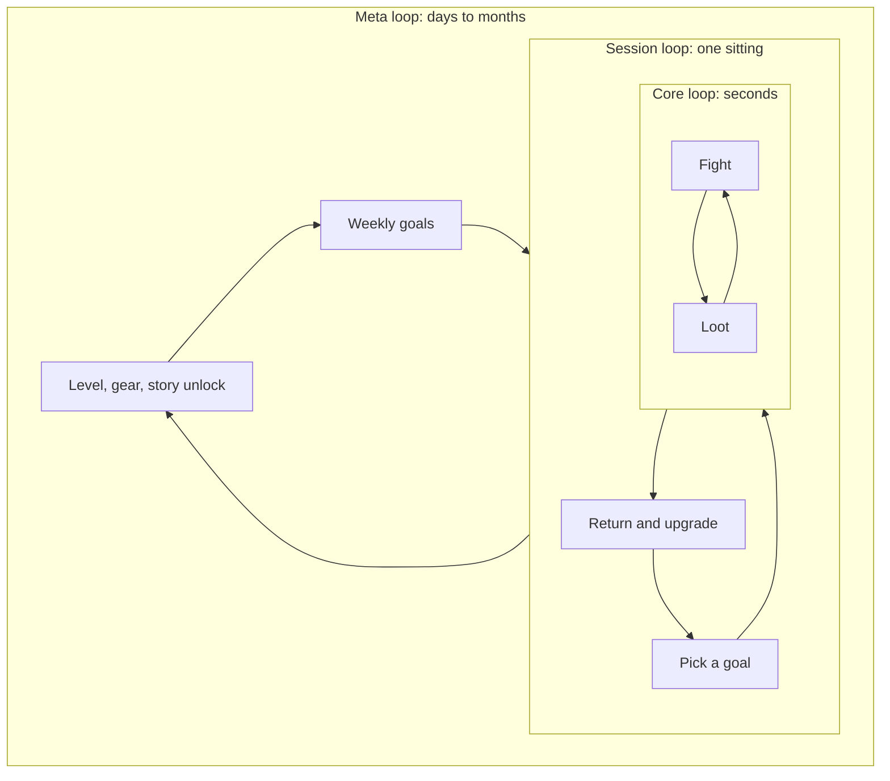
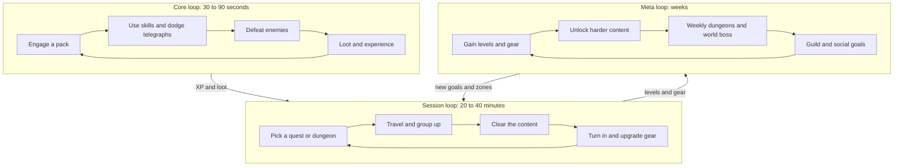

# Module 02: Vision, pillars and loops

- **Goal:** write a vision statement and a set of design pillars that can actually say "no", describe a game as three nested loops (core, session, meta), and check any proposed feature against the pillars and loops before building it.
- **Prerequisites:** [00 — What game design is](00-what-game-design-is.md), [01 — The player experience](01-player-experience.md).
- **Simulation:** none
- **Facts checked:** October 2026 (prices, rules and product status change; re-check before reuse)

## In short

A **vision** is one or two sentences about the experience the game gives. **Pillars** are three to five short principles that break the vision into filters; a good pillar is specific enough that some feature ideas fail it. A **loop** is a cycle of player actions that repeats: the **core loop** lasts seconds to minutes, the **session loop** lasts a sitting, and the **meta loop** lasts days to months. Loops nest: many core loops make one session, many sessions make one meta cycle. Before building a feature you ask which pillar it serves and which loop it lives in. The worked example is the course game's vision, four pillars and three loops, followed by a feature-check table.

## 1. The concept

### 1.1 Vision statement

A **vision statement** says what the game is and the feeling it delivers, in one or two sentences, so that anyone on the team can repeat it from memory. It is not a marketing slogan and not a feature list.

A useful vision has three parts:

| Part | Question | Example wording |
|---|---|---|
| **The fantasy** | Who does the player become? | "A hero of a frontier..." |
| **The verb** | What do they do most? | "...fights and explores..." |
| **The feeling** | What do they feel? | "...and feels that friends make the difference." |

Tests for a good vision:

1. **Repeatable:** a new teammate can say it back after one reading.
2. **Experiential:** it describes what the player feels, not what the engine does.
3. **Distinctive:** you could not paste it onto a competitor unchanged.
4. **Falsifiable:** you can imagine a game that does not fit it.

| Bad vision | Why it fails | Better |
|---|---|---|
| "A fun, immersive RPG with great graphics" | Applies to every RPG; no test | "Hold a frontier town together with three friends, one dangerous night at a time" |
| "Next-generation online experience" | A claim about technology, not the player | "Step into a world where your role in a group matters every fight" |
| "Casual and hardcore players will both love it" | Lists audiences; says nothing about the game | "Quick to learn in ten minutes, deep enough for a hundred hours" |

### 1.2 Design pillars

**Design pillars** are three to five short principles derived from the vision, used to filter every later decision. When two good ideas compete, the pillars decide. Pillars are usually set by the lead designer or creative director with the product owner and are rarely changed.

A pillar works only if it can **say no**. If every feature passes, the pillar is decoration.

| Property | Good pillar | Bad pillar |
|---|---|---|
| **Specific** | "Fights you can read at a glance" | "Great combat" |
| **Testable** | You can watch a playtest and judge it | "Fun and engaging" |
| **Rejects ideas** | Some good-looking features fail it | Everything passes |
| **Short** | 2 to 6 words, easy to memorise | A paragraph |
| **Player-facing** | Written as an experience | Written as a technical goal ("60 FPS") |
| **Few** | 3 to 5 | 10 |

A pillar is easier to use if it has a one-line **meaning**, a one-line **non-meaning** (what it does not say), and a **test** (how you would check it in play).

### 1.3 Published pillars, and what they teach

Some studios have published their pillars. Two public examples from online and loot-driven action RPGs:

**Diablo III (Blizzard).** Lead designer Jay Wilson listed seven pillars in a 2012 Gamasutra interview: approachable, powerful heroes, highly customizable, great item game, endlessly replayable, strong setting, and cooperative multiplayer. Source: interview mirrored at the link in Further reading.

**Destiny (Bungie).** Bungie's designers described seven "pillars of design" in 2013 press coverage, summarised roughly as: a world players want to be in; a bunch of fun things to do; rewards players care about; a new experience every night; shared with other people; enjoyable by all skill levels; enjoyable by the tired, impatient and distracted. The wording varies slightly between articles, so treat it as a close paraphrase. Source: the Destinypedia page quoting the 2013 Polygon feature (see Further reading).

What these two lists show (this is the course's reading, not the studios' own commentary):

| Observation | Example |
|---|---|
| **Pillars can be player-facing sentences** | "Enjoyable by the tired, impatient and distracted" is a requirement on every feature's friction |
| **Some pillars are strong filters** | "Approachable" rejects a feature that needs a 40-page manual |
| **Some pillars are weak filters** | "Strong setting" is hard to fail; it rarely rejects a feature |
| **Seven is on the high side** | Fewer pillars are easier to remember; seven needs ranking |
| **Pillars describe the whole product** | They cover combat, rewards, social and onboarding, not only one system |

Pillars can also be written for a single feature or an update ("feature pillars"), which is useful for a live game's season or major system. The same rules apply.

### 1.4 Loops

A **loop** is a sequence of player actions that repeats, with each repeat ideally giving the player a reason to start the next one. Every loop has the same four parts:

| Part | Meaning | Example |
|---|---|---|
| **Goal** | What the player wants right now | Defeat this pack |
| **Action** | What the player does | Use skills, move, dodge |
| **Feedback** | What the game shows | Damage numbers, a sound, enemies fall |
| **Reward** | What the player gets | Experience, loot, progress |

The reward must make the player want the next goal. If it does not, the loop is open at the end and the player leaves.

### 1.5 Three scales of loop

| Loop | Duration | What it answers | Typical online RPG example |
|---|---|---|---|
| **Core loop** | Seconds to 2 minutes | "What do I do right now?" | Engage a pack, use skills, kill, loot |
| **Session loop** | One sitting, 15 to 90 minutes | "What am I doing this hour?" | Take a quest or dungeon, travel, clear, return, upgrade |
| **Meta loop** | Days to months | "Why do I come back tomorrow, and next month?" | Raise level, improve gear, join a guild, unlock the next story region, clear weekly bosses |

Some designers add a **micro loop** (one button press and its feedback, under a second) and a **seasonal loop** (a content cycle of roughly three months). The three-way split is the common minimum.

### 1.6 How loops nest

Loops are nested like Russian dolls. A session loop is made of many core loops, a meta loop is made of many session loops, and the reward of the inner loop becomes the input of the outer one.

Two things to look for:

- **Each outer loop uses the inner loop's reward.** Loot from fights becomes gear upgrades in the session loop, and gear raises the character's power across the meta loop.
- **Each loop has an exit and an entry.** A session loop needs a natural stopping point (so the player can leave happily) and a reason to return (so they do).

### 1.7 Where a feature belongs

Every system should be placed in one or more loops. A new feature that fits none of the loops is either a new loop (rare, expensive) or noise.

| Question | If the answer is "none" |
|---|---|
| Which core loop action does it improve or change? | It does not touch moment-to-moment play |
| Which session goal does it create or complete? | It is not a reason to do anything this hour |
| Which meta goal does it feed? | It does not help retention |

### 1.8 Checking a feature against the pillars

The **pillar check** is a quick table you fill in before building. For each pillar, mark the feature as helping (+1), neutral (0) or harming (-1).

| Result | Decision |
|---|---|
| Serves at least one pillar and harms none | Build it |
| Serves one pillar and harms another | Redesign, or escalate to the owner of the pillars |
| Harms any pillar and serves none | Cut or postpone |
| Serves none, harms none | Ask whether it is worth the cost; usually postpone |

The check is cheap (ten minutes) and replaces long arguments with a question: "Which pillar is this for?"

## 2. The player's view

Players never read the pillars, but they feel them. A player says "this game respects my time" (a pillar worked), or "this game keeps changing what it is" (the pillars were not used).

How the loops feel from the player's side:

| Loop | The feeling it should give | If it fails |
|---|---|---|
| **Core** | "This is satisfying to do again" | Players leave in the first hour: "boring" or "clunky" |
| **Session** | "I made progress this evening" | "I played for two hours and nothing happened" |
| **Meta** | "I have something to look forward to" | Players clear content and drift away |

The motivations from [module 01](01-player-experience.md) map onto the loops. Excitement, Challenge and Sensation live mainly in the core loop. Strategy and Autonomy sit in the session loop (choosing what to do next). Power, Completion, Story and Community sustain the meta loop.

If the core loop is not fun by itself, no meta layer will rescue it. More currencies, more collections and more dailies only hide the problem for a while. This is the most common reason why a feature-rich game fails early.

## 3. The design space

### 3.1 Pillar approaches

| Approach | Example form | Good for | Risk |
|---|---|---|---|
| **Short noun phrases** | "Depth", "Style" | Quick to remember | Too vague to filter |
| **Promise sentences** | "Fights you can read at a glance" | Teams that need a test | Wordy |
| **Player verbs** | "Explore, fight, build" | Defining the gameplay | Ignores feeling |
| **Experience goals** | "Players feel needed by their group" | Aligning design and UX | Hard to measure |
| **Constraints** | "Every session ends with progress in 15 minutes" | Mobile and live games | Can feel restrictive |

### 3.2 Pillars: how many, and how strict

| Count | Typical use |
|---|---|
| **3** | Small teams and tight scopes; easy to remember |
| **4 to 5** | Most online games; covers feel, social, progression, fairness |
| **6 or more** | Large studios; needs ranking, otherwise nothing is excluded |

If you must keep more than five, **rank** them. When two pillars conflict, the higher one wins.

### 3.3 Loop designs by game type

| Game type | Core loop | Session loop | Meta loop |
|---|---|---|---|
| **Online action RPG** | Fight, loot | Quest or dungeon, return to town, upgrade | Level, gear, story, weekly raids |
| **Hero-collection mobile RPG** | Build a team, auto-battle | Stage, rewards, upgrade | Collect heroes, events, ranking |
| **Competitive arena game** | Skirmish, win lane | One match of 15 to 40 minutes | Rank, season, unlocks |
| **Single-player story RPG** | Explore and fight | One chapter | Story progression, ending |
| **Survival-crafting** | Gather, build | One day-night cycle | Base growth, exploration |

### 3.4 How to choose

| If you need to... | Use |
|---|---|
| Align a new team quickly | A short vision plus 3 to 4 pillars with "means / does not mean" |
| Keep a live game coherent for years | Pillars plus a loop map; check every update |
| Fit short sessions | Pillar on session length, with a session loop under 20 minutes |
| Choose what to cut | Rank pillars; cut what serves only the lowest |

## 4. Tuning and pitfalls

### 4.1 Rules of thumb for pillars

1. **Write each pillar with its "does not mean".** It prevents the loudest reading from winning.
2. **Pillars are about the player, not about the team.** "Fast iteration" is a production goal, not a pillar.
3. **Rank them.** When forced, you need to know which one gives way.
4. **Revisit them rarely, deliberately.** If playtests show a pillar is wrong, change it at the top and update everything under it.
5. **Hang them where the team can see them.** On the first page of the GDD and in feature specs.

### 4.2 Rules of thumb for loops

| Rule | Reason |
|---|---|
| The core loop should be fun **with the rewards turned off** | If it is not, rewards are bribes |
| A session should end with a visible result | Players leave satisfied |
| Rewards should create the next goal, not only a number | "What does this loot let me do?" |
| Each loop should be explainable in one sentence | If not, it is probably two loops |
| Do not add a new meta loop until the core is fun | More systems do not fix a weak core |

### 4.3 Signals that something is wrong

| Signal | Likely problem |
|---|---|
| New feature is built, then nobody can say which pillar it serves | No pillar check |
| Players quit after hours, not days | Meta loop is thin; core loop is fine |
| Players quit in the first session | Core loop or onboarding is wrong |
| Time-gated dailies are the main reason to log in | Meta loop made of chores |
| Pillars quoted by executives, ignored by designers | Pillars not tied to daily decisions |
| Many features serve only the pillar that is easy to serve | Hard pillars forgotten |

### 4.4 Classic failures

- **Pillars as slogans.** "Epic", "immersive" and "fun" cannot say no.
- **Too many pillars.** Seven or more is a wish list.
- **Pillars that conflict silently.** "Casual friendly" and "punishing difficulty" both appear, and nobody ranks them.
- **Meta loop before core loop.** Adding battle passes, collection screens and ranks to a combat system that is not fun.
- **A session loop with no end.** Endless chores with no natural stop, which burns players out.
- **Loops that do not nest.** Fight rewards that do not feed the session goals, so loot feels meaningless.

## 5. Worked example

The course game: a small online fantasy RPG for PC and mobile with one hero per player, real-time combat, groups and a shared world, free to play. All values are invented.

### 5.1 Vision

> **Be a hero with a clear role on a dangerous frontier, and discover that the best fights are the ones you win together.**

Checks against the four tests:

| Test | Result |
|---|---|
| Repeatable | Two clauses, easy to say back |
| Experiential | "Clear role" and "win together" are feelings |
| Distinctive | Shared with other group RPGs, but with the role and the group as the centre |
| Falsifiable | A game where the best fights are solo does not fit |

### 5.2 Four pillars

| # | Pillar | Means | Does not mean | How we test it |
|---|---|---|---|---|
| 1 | **My hero, my way** | Each class is distinct from the first fight, and build choices change how you play | Unlimited freedom or free respec | In a blind playtest, players name their class's role within 10 minutes |
| 2 | **Fights you can read** | Every dangerous enemy attack is telegraphed; a skilled player can avoid it | Easy or slow combat | Players on PC and on a phone can say what killed them |
| 3 | **Stronger together** | Groups always get better rewards per hour than the same player alone | Solo play is blocked | Group clear of the first dungeon is at least 25 % faster than solo |
| 4 | **Fair and respectful of time** | A 15-minute session always gives a visible reward; nothing sold gives combat power that players cannot earn | No monetization | Players can reach level 50 without spending; sessions end at a natural stop |

Ranking when pillars conflict: **2 > 1 > 3 > 4** for gameplay decisions, but **4 is a hard rule for the shop** (see module 14).

### 5.3 The three loops

| Loop | Goal | Action | Feedback | Reward | Pillars served |
|---|---|---|---|---|---|
| **Core** (30 to 90 s) | Defeat this pack | Skills, movement, avoiding telegraphed attacks | Hit effects, damage numbers, enemies fall | XP, loot | 1, 2 |
| **Session** (20 to 40 min) | Complete one quest or dungeon | Choose, travel, group, clear, turn in | Quest progress, party chat, a result screen | Gear, gold, story step | 1, 3, 4 |
| **Meta** (weeks) | Reach the next tier of content | Level, upgrade gear, run weekly dungeons, join a guild | Power rating, achievements, guild rank | Access to new zones and bosses | 1, 3 |

The numbers (30 to 90 seconds, 20 to 40 minutes) are targets to be validated by playtests, not facts.

### 5.4 How the loops nest in play

A typical evening for Mira (module 01):

1. She logs in and picks the weekly dungeon (session loop, **goal**).
2. She spends 3 minutes finding three teammates (session loop, **group up**).
3. In the dungeon she fights 12 packs of about 60 seconds each, plus two minibosses (core loops, **12 times**).
4. She turns in the clear, receives a piece of gear and upgrades it (session **reward**).
5. The gear raises her power, which unlocks the next dungeon tier next week (meta loop).

A phone session for Dev (module 01) uses a **shorter session loop**: a single solo quest of 15 minutes, with the same core loop and a smaller reward, and progress saved at any moment.

### 5.5 Feature check: five proposals

The team receives five ideas. For each, +1 helps a pillar, 0 is neutral and -1 harms it.

| Proposed feature | 1 My hero | 2 Readable | 3 Together | 4 Fair and time-respecting | Decision |
|---|---|---|---|---|---|
| **Auto-battle toggle** for solo quests | 0 | -1 | 0 | +1 | **Redesign:** limit auto to travel and trivial fights (keeps pillar 2) |
| **Daily login chest** | 0 | 0 | 0 | -1 | **Cut or reshape:** rewards login rather than play; harms the respect-for-time pillar |
| **Cosmetic mounts for sale** | +1 | 0 | 0 | +1 | **Build:** no combat power; supports fantasy |
| **Paid stat boosts** | 0 | 0 | -1 | -1 | **Reject:** violates the hard rule of pillar 4 |
| **Guild dungeon with role bonuses** | +1 | +1 | +1 | 0 | **Build:** serves three pillars |

The table shows how the pillars end arguments: nobody has to say whether auto-battle is "good". The question is which pillars it supports and which it breaks.

### 5.6 What was cut

- **Seven pillars.** The first draft had seven (including "a rich story" and "endless content"). They were ranked, and the lowest three were folded into the others.
- **A fourth loop (seasonal).** Added in module 25, when the live schedule is designed.
- **A "crafting loop".** Left out of the first release; gear comes from drops and upgrades.

### 5.7 How the design would differ for another kind of game

| Game type | Vision and pillars would change to... | Loops would change to... |
|---|---|---|
| **Hero-collection RPG** | "Build the ultimate team"; pillars on collection depth, team synergy, session brevity | Core: assemble and watch; meta: collect and level heroes |
| **Competitive arena** | "Outplay your opponents in minutes"; pillars on fairness, clarity, skill expression | Core: a skirmish; session: one match; meta: rank |
| **Single-player story RPG** | "Live an unforgettable story"; pillars on narrative, choice, atmosphere | Meta loop is the story; no weekly loop |

## Key takeaways

- A vision is one or two sentences about the player's experience; test it for repeatability, feeling, distinctiveness and falsifiability.
- Good pillars are short, player-facing, testable and able to say no. Write what each means, what it does not mean, and how you would test it.
- Published pillars (for example Diablo III's and Destiny's) show how a studio phrases player promises, and show that seven pillars need ranking.
- A loop has a goal, an action, feedback and a reward, and the reward must create the next goal.
- Games nest three loops: core (seconds), session (a sitting) and meta (weeks), and the outer loop uses the inner loop's reward.
- If the core loop is not fun on its own, no meta system rescues it.
- Before building any feature, run the pillar check and place the feature in a loop. A feature that serves no pillar and fits no loop is a candidate to cut.

## Further reading

- Wikipedia, [Game design](https://en.wikipedia.org/wiki/Game_design): overview of design concepts, including loops and player experience.
- Jay Wilson interview on Diablo III's seven pillars (Gamasutra, May 2012), mirrored at [RPG Codex](https://rpgcodex.net/article.php?id=8165).
- Destinypedia, [Seven Pillars of Design](https://destinypedia.com/Seven_Pillars): Bungie's seven pillars, quoting Polygon's 2013 feature on Destiny.
- Robin Hunicke, Marc LeBlanc, Robert Zubek, [*MDA: A Formal Approach to Game Design and Game Research*](https://users.cs.northwestern.edu/~hunicke/MDA.pdf) (2004): link between mechanics, dynamics and aesthetics.
- Jesse Schell, *The Art of Game Design: A Book of Lenses* (book): [publisher page](https://www.schellgames.com/art-of-game-design) and the chapters on game structure and the "lens of the problem statement".
- Jenova Chen, [*Flow in Games*](https://www.jenovachen.com/flowingames/): why a loop must keep challenge matched to skill.
