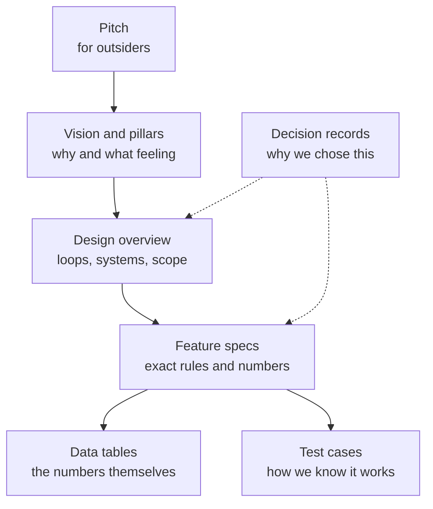
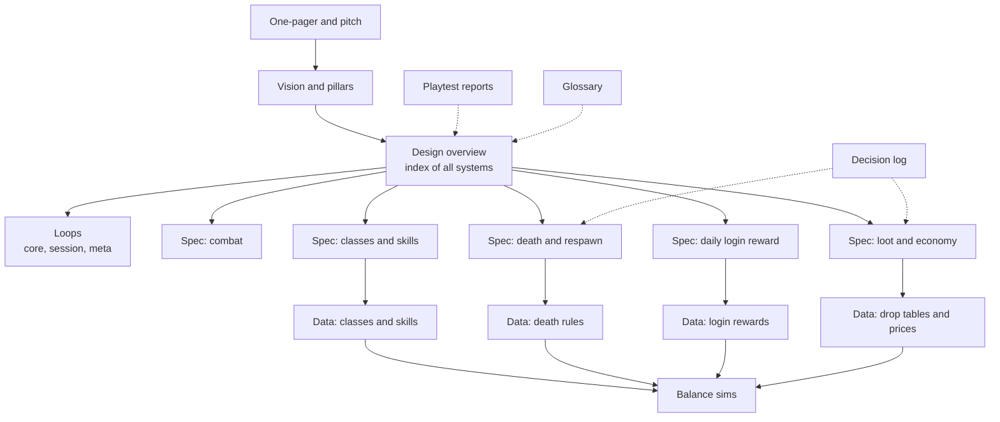

# Module 04: Design documents that stay alive

- **Goal:** choose the right document for each audience and decision, write a feature spec an engineer and a balance simulation can both use directly, and keep the whole set from rotting.
- **Prerequisites:** [00 — What game design is](00-what-game-design-is.md), [02 — Vision, pillars and loops](02-vision-pillars-loops.md).
- **Simulation:** none
- **Facts checked:** October 2026 (prices, rules and product status change; re-check before reuse)

## In short

A design document is a tool for getting the same idea into several heads, and then keeping it there while the game changes. Different readers need different documents: a short pitch for the people who fund you, a vision and pillars for the whole team, small feature specs for the people who build, data tables for the people who tune, and decision records for the people who will wonder why. One giant design document ("the GDD") tends to be written once and then ignored, so modern teams split it into many small, owned, dated pieces that live next to the work. The worked example draws the course game's document map and writes one complete feature spec, for the death and respawn rules.

## 1. The concept

### 1.1 What a design document is for

A design document has one job: to let someone who was not in the room make the same decision you would have made, and to let them check their work against it. If a document does not change what someone does, it is not worth maintaining.

Documents serve four purposes:

| Purpose | Example question it answers |
|---|---|
| **Align** | What are we making, and for whom? |
| **Instruct** | What exactly should the engineer build? |
| **Verify** | How does QA know it works? |
| **Remember** | Why did we decide this, and what did we try before? |

### 1.2 The document hierarchy

Documents are layered from *why* to *exactly how*, so that a rule on page 40 never quietly contradicts the reason the project exists.



The hierarchy is also an argument-settling tool. When a debate stalls, walk up: which pillar does this serve? If you cannot say, the feature is a candidate to cut.

### 1.3 The main document types

| Document | Reader | Length | Changes |
|---|---|---|---|
| **One-pager** | Anyone: team, friends, a stakeholder with two minutes | 1 page | Rarely |
| **Pitch** | Funders, publishers, management | 5 to 15 slides or pages | Per audience |
| **Vision document** | The whole team | 1 to 3 pages | At milestones |
| **Design overview** (the modern "GDD") | The whole team | A short index plus links | Continuously |
| **Feature spec** | Engineers, QA, artists on that feature | 1 to 4 pages | Often during build |
| **Data tables** | Designers, engineers, sims | Rows and columns | Constantly |
| **Decision record** | Future you, new joiners | Half a page each | Never rewritten; superseded |
| **Playtest report** | Design and production | 1 to 2 pages | One per test |

### 1.4 The one-pager, the pitch and the vision document

The **one-pager** answers five questions in one page: what is the game (one sentence), who is it for, what does the player do, what makes it different, and how big is it. It is the first thing you write and the thing you can still recite after a year.

A **pitch** is a one-pager grown for an audience with money or authority. It adds the hook, the target audience and market, comparable games, the core loop in a picture, a rough scope, a timeline and the team. It is persuasive; everything else on this list is not.

A **vision document** is for the team. It states the experience goal in a few sentences, the **pillars** (3 to 5 short phrases used as a filter for decisions), the target players, and what the game is explicitly *not*. It is the document you re-read when two good ideas collide.

### 1.5 Why monolithic GDDs rot

The traditional **game design document (GDD)** was one big file describing everything, written before production. It fails in predictable ways:

| Failure | Why it happens |
|---|---|
| **Out of date by week six** | Nobody owns the whole file, and each edit is a chore |
| **Nobody reads it** | A 200-page file is a reference nobody can find anything in |
| **Merge fights** | Several people editing one file |
| **Duplicated numbers** | The same value appears in text and in the data, and the two drift |
| **Written before play** | The rules were guessed in a vacuum, then defended instead of tested |
| **No status** | The reader cannot tell what is agreed, built, or abandoned |

Writers have criticised the monolithic GDD for decades. Talks such as Stone Librande's one-page designs argued that a single page with a strong picture beats a long text that nobody reads. Early classics like Tim Ryan's *Anatomy of a Design Document* show the older style; modern practice keeps the *idea* of a complete design but splits it into small linked pieces.

## 2. The player's view

Documents do not reach the player, but their effect does. A design that lives in one head ships as an inconsistent game: the quest designer assumes one death penalty, the engineer builds another, and the player meets both. The test of a good document set is that **every player-facing rule exists in exactly one place, in plain words, with a number.**

Here the "player" of the document is its reader. Each reader asks a different question:

| Reader | Asks | Needs |
|---|---|---|
| **Engineer** | "What exactly should I build? What do I do when X?" | Rules, edge cases, data schema, acceptance tests |
| **Artist or animator** | "What states and effects exist?" | A list of states, triggers and feedback moments |
| **QA** | "How do I know it works?" | Test cases with expected results |
| **Producer** | "How big is this? What does it depend on?" | Scope, dependencies, what is out |
| **Balance designer** | "Which numbers can I change without code?" | Data tables with ranges and a sim |
| **Another designer** | "Does this clash with my system?" | Intent, interfaces to other systems |
| **Future you** | "Why is it like this?" | A decision record |

Write for the *least informed* reader on this list who must act on the document. That is usually the engineer, so the feature spec is the layer to get right first.

The document also protects the player's experience over time. A spec that states its **intent** ("death should cost a little time, never progress") gives later changes something to be checked against, so a quick fix for an economy problem does not silently turn a friendly rule into a harsh one.

## 3. The design space

### 3.1 Choosing the form of the documentation

| Approach | Strength | Weakness | Used by |
|---|---|---|---|
| **One big GDD** | Everything in one place at first | Rots; unsearchable; merge conflicts | Small projects, publisher-required submissions |
| **One-pagers per feature** | Fast to read; forces clarity | Poor for detail; needs specs beneath | Teams that favour visuals |
| **Wiki of pages** | Easy to link and search; non-programmers can edit | History is weak; easy to leave stale; no review | Most mid-sized studios |
| **Docs in the code repository** | Reviewed and versioned with the code; changes can be tied to builds | Designers need basic tooling | Engineering-led teams |
| **Spreadsheets as source of truth** | Numbers and formulas live together; designers edit freely | Poor for prose; version history is thin | Almost every RPG for the numbers |
| **Ticket tracker only** | Work is tracked | Rules get lost inside tickets | Teams that never write specs (a warning sign) |

### 3.2 Wiki versus repository documents

| Question | Wiki (for example Confluence, Notion, Google Docs) | Documents in the repository (markdown beside the code) |
|---|---|---|
| Who can edit? | Anyone, instantly | Anyone with repository access, via a pull request |
| History | Page versions, often awkward | Complete, with who and why |
| Review | Optional | Built in |
| Tied to the build | No | Yes: the spec changes in the same change as the code |
| Rich media | Easy | Possible, needs conventions |
| Best for | Brainstorming, meeting notes, onboarding, external sharing | Specs, decision records, data schemas, anything that must stay true |

A common split, and a sensible default: **wiki or shared documents for exploring, repository for what is agreed.** The idea of "docs as code" is the same one that engineering teams use for architecture: documents are files, reviewed like code, with the same history (see the readings below).

### 3.3 How big should a spec be?

| Option | Detail | Cost | When |
|---|---|---|---|
| **Sketch** | Intent plus a bulleted rule list | Minutes | Prototyping; many options still open |
| **Spec** | Intent, rules, parameters, test cases, out of scope | 1 to 4 pages | Anything that will be built |
| **Formal specification** | Every state and transition, precise wording | Days | Money, trading, anti-cheat, legal rules |

### 3.4 How to choose

| Situation | Use |
|---|---|
| Pitching to outsiders | Pitch deck plus the one-pager |
| Starting a project | One-pager, vision and pillars, then a design overview index |
| A feature is going to be built next | Feature spec in the repository |
| A number will change often | Data table, never prose |
| A decision was contentious or reversed | Decision record |
| A publisher demands a GDD | Generate it from the pieces; do not maintain it by hand |

## 4. Tuning and pitfalls

### 4.1 A feature spec, section by section

A good feature spec has the same six sections every time, so readers know where to look:

| Section | What it holds | Rule of thumb |
|---|---|---|
| **Intent** | What the feature is for, in two or three sentences, and the pillar it serves | If you cannot write it, the feature is not ready |
| **Rules** | Numbered, testable statements ("R1, R2, ...") | One rule, one sentence, no vague words like "quickly" |
| **Parameters** | Every number, with unit, default, and allowed range | Numbers live in a table, linked to the data file |
| **Edge cases** | What happens when rules collide or things go wrong | Disconnects, ties, simultaneous events, full inventories |
| **Test cases** | Given, when, then, with concrete values | At least one per rule |
| **Out of scope** | What this spec deliberately does not cover | The cheapest defence against scope creep |

Words to avoid in rules: "fast", "rare", "sometimes", "appropriate", "balanced". Replace each with a number or a reference to a table.

### 4.2 Data tables as design documents

For an RPG, the numbers are the design. A **data table** is a spreadsheet or file where each row is a thing (a skill, an item, a level) and each column is a property. Treat it as a first-class document:

- **One source of truth.** The prose spec explains *why* and *how*; the table holds the *values*. Do not repeat a number in both.
- **Schema.** Name each column, give its unit and valid range, and say who may change it.
- **Plain, diffable format.** A CSV or JSON file exported from a spreadsheet can be reviewed and fed to both the game and a simulation.
- **Version it.** A balance change should show up as a visible change with an author and a reason.

### 4.3 Decision records

A **decision record** captures one choice and its reasons. Software teams call it an architecture decision record (ADR); the same structure works for design. It has a short, fixed shape: **title, status, context, options considered, decision, consequences, and when to revisit.** Records are not edited after the fact. A reversed decision gets a new record that supersedes the old one, which keeps the history honest.

Write one when: the decision is expensive to reverse, the team argued about it, someone new will ask "why?", or you are about to *not* do the obvious thing.

### 4.4 Handing off

| To | What goes across | Done when |
|---|---|---|
| **Engineers** | The spec, the data schema, the test cases | An engineer can start without asking you a question, and all open questions are listed in the spec |
| **Balance simulation** | The data table and the formulas, as inputs the sim can read | The sim reads the same file the game reads (modules 06, 11 and 21) |
| **QA** | The test cases and edge cases | Each rule has a test case with expected values |
| **Artists** | The state list and the feedback moments | Each state has a name, a trigger and an end condition |
| **Live operations** | The tunable parameters and their safe ranges | The team knows which numbers can change without a release |

A useful gate is a **definition of ready**: intent written, every rule numbered, every number in a table, edge cases listed, tests written, out of scope stated.

### 4.5 Keeping documents alive

Documents rot when no one is responsible for them, and when updating is harder than ignoring. Habits that prevent it:

| Habit | Why it works |
|---|---|
| **One owner per document**, named in the header | Someone is accountable |
| **A status line**: Draft, Agreed, Built, Superseded | Readers know what to trust |
| **A date and version** in the header | Readers can tell stale from current |
| **Change the document in the same change as the game** | The doc never lags by more than one task |
| **Link the spec from the ticket**, and the ticket from the spec | The trail is connected |
| **Review at milestones**: delete or archive what is dead | Fewer, truer documents |
| **A short change log** at the bottom of each spec | Readers see what moved |
| **Prefer links to copies** | A copy is a future inconsistency |

### 4.6 Signals that the documents are failing

- Engineers ask in chat what a rule is, and the answer is not in any document.
- Two documents give different numbers for the same thing.
- A status field says "Draft" on something shipped months ago.
- New joiners do not know where to start.
- The design overview is longer than anyone's patience.

Fix these by deleting, merging and assigning owners before writing anything new.

### 4.7 Pitfalls

| Pitfall | Guard |
|---|---|
| **Writing the whole GDD before prototyping** | Write sketches; specify a feature only when it will be built |
| **Over-specifying what will change** | Keep the stable parts (intent, rules) in prose and the volatile parts (numbers) in tables |
| **Under-specifying edge cases** | Always list disconnects, ties and simultaneous events |
| **Specs with no intent** | Intent first; a rule without intent cannot be judged |
| **Documentation as ritual** | If no one reads it, stop writing it |
| **Locking the numbers** | Mark numbers "starting values, tune in playtest" |

## 5. Worked example

The course game: a small online fantasy RPG for PC and mobile, one hero per player, class-based, real-time combat, player parties, a shared world, free-to-play. Everything below is invented for teaching.

### 5.1 The document map



How to read the map:

| Layer | Documents | Owner | Format |
|---|---|---|---|
| **Why** | One-pager, pitch, vision, pillars | Lead designer | Short markdown or slides |
| **What** | Design overview, loops, one spec per system | System owner | Markdown in the repository |
| **Numbers** | One data table per system | Balance designer | CSV or JSON, with a spreadsheet as the editing view |
| **Proof** | Balance sims, playtest reports | Balance designer, production | Code and short reports |
| **Memory** | Decision log, glossary | Lead designer | Markdown, append-only |

Each spec links up to the pillar it serves and down to its data table. Nothing else holds the numbers.

### 5.2 A decision record

```text
DR-007: No experience or item loss on death
Status: Agreed (2026-03-02)   Owner: Lead designer
Context: Death will happen often in group content, and sessions on mobile are short.
         Harsh penalties push casual players out and reward only careful veterans.
Options: (A) lose a slice of current-level XP; (B) drop items; (C) lose time and a short
         strength debuff; (D) no penalty at all.
Decision: C. Death costs time and a short debuff, never progress.
Consequences: Death no longer drains the economy (no repair or loss sink),
         so the economy needs other sinks (module 13). Pillar "Fair and friendly"
         is protected. Tension in boss fights comes from the enrage clock and the walk back, not from loss.
Revisit when: median deaths per hour fall below 0.5 (death has stopped meaning anything)
         or the economy shows no sink left.
```

### 5.3 The feature spec: death and respawn

```text
SPEC: Death and respawn
Status: Agreed      Version: 0.4      Owner: Systems designer      Pillar: "Fair and friendly"
Scope: the open world (fields, towns, safe zones). Dungeons, boss rooms and the world boss use the encounter rules of module 10 (R9).
```

**Intent.** Death is a short pause and a small cost, never a loss of progress. It should keep the group playing, give a reason to avoid dying without making players afraid of trying, and work for a ten-minute mobile session as well as a long PC session.

**Rules.**

| ID | Rule |
|---|---|
| R1 | A hero dies when current HP reaches 0. A dead hero cannot move, act or be targeted. Monsters drop aggro on a dead hero. |
| R2 | A dead hero chooses one of two options: **respawn** at the nearest respawn point (after a delay), or **wait for a revive** from a party member. |
| R3 | **Respawn delay** = min(10 + 5 x recent deaths, 30) seconds, where *recent deaths* is the hero's death count in the last 10 minutes, before this one. |
| R4 | A hero who respawns at a respawn point gets the **Weakened** status: damage dealt -10% and max HP -10% for 180 seconds. Weakened is refreshed to 180 seconds, not stacked. |
| R5 | A hero revived by an ally gets no Weakened status, and returns at 30% max HP where they fell, with 3 seconds of invulnerability. |
| R6 | A hero who respawns at a respawn point returns with 50% max HP and 3 seconds of invulnerability that ends early if the hero attacks. |
| R7 | The revive skill has a 3-second cast, is interrupted by damage to the caster, has a 60-second cooldown and a range of 10 metres. |
| R8 | Death never destroys, drops or damages items, and never costs currency or experience. |
| R9 | **Inside dungeons, boss rooms and the world boss encounter this spec's respawn rules (R2 to R4 and R6) do not apply.** The encounter rules of [module 10](10-enemies-encounters.md) do: a dead hero is revived by an ally (R5 and R7 still hold) or waits 15 seconds and respawns at the room's door at 50% max HP with no Weakened status; a wipe resets the room and returns the party to the door at full HP within 10 seconds; there is no repair cost. |
| R10 | Kill credit and loot eligibility stay with a hero who died, if the hero dealt damage to the monster in the 10 seconds before death. |

**Parameters** (starting values, to be tuned in playtests; they live in the death-rules data table).

| Parameter | Value | Range for tuning | Unit |
|---|---|---|---|
| Base respawn delay | 10 | 5 to 20 | seconds |
| Delay increase per recent death | 5 | 0 to 10 | seconds |
| Maximum respawn delay | 30 | 15 to 60 | seconds |
| Recent-death window | 10 | 5 to 30 | minutes |
| Weakened duration | 180 | 0 to 600 | seconds |
| Weakened damage modifier | -10 | -25 to 0 | percent |
| Weakened max HP modifier | -10 | -25 to 0 | percent |
| Respawn HP | 50 | 30 to 100 | percent of max HP |
| Revive HP | 30 | 20 to 100 | percent of max HP |
| Invulnerability after return | 3 | 1 to 5 | seconds |
| Revive skill cast time | 3 | 1.5 to 5 | seconds |
| Revive skill cooldown | 60 | 30 to 120 | seconds |
| Kill credit window | 10 | 5 to 15 | seconds |

**An excerpt of the data table** the spec points to:

```text
param_id,value,unit,min,max,notes
respawn_delay_base,10,s,5,20,"per death, first of the window"
respawn_delay_step,5,s,0,10,"added for each recent death"
respawn_delay_max,30,s,15,60,
recent_death_window,10,min,5,30,
weakened_duration,180,s,0,600,"refresh, no stack"
weakened_damage_mod,-10,pct,-25,0,
```

**Edge cases.**

| Case | Behaviour |
|---|---|
| Two heroes die on the same tick | Both die. Each is handled by its own rules; each chooses separately. |
| A hero disconnects while dead | The server keeps the hero dead. On reconnect the hero sees the respawn choice again, with the remaining delay counted from the original death. |
| A hero is dead when the party wins the encounter | The remaining respawn delay is waived and the hero may respawn at once. Weakened still applies (R4); a revive is still free of it (R5). |
| The respawn point is in a zone the hero is not allowed to enter (quest-locked) | Use the nearest unlocked respawn point. |
| A revive is cast on a hero who just chose to respawn | Whichever event the server processes first wins; the other is cancelled with no cost. |
| A hero dies in a safe zone (for example from an environmental effect) | Treated as normal death; respawn point is the zone's own. |
| The reviver dies during the cast | The cast is interrupted; no cooldown starts. |
| A hero dies in a dungeon or boss room | R9: module 10's rules apply, not the delay formula (R3) and not Weakened. |
| A hero dies while trading or crafting | The window closes and the item is returned to its owner; nothing is lost (R8). |

**Test cases** (each runs against the data table above, and each is also an input to the balance sim and to QA).

| # | Given | When | Then |
|---|---|---|---|
| T1 | A hero with no deaths in 10 minutes | The hero dies | Respawn delay = 10 s |
| T2 | A hero who died 2 times in the last 10 minutes | The hero dies a third time | Respawn delay = min(10 + 5 x 2, 30) = 20 s |
| T3 | A hero who died 5 times in the last 10 minutes | The hero dies again | Respawn delay = min(10 + 5 x 5, 30) = 30 s (capped) |
| T4 | A hero with 1000 max HP and 200 damage | The hero respawns at a respawn point | Max HP 900, damage dealt 180, HP 450 (50% of the reduced max), for 180 s |
| T5 | A hero in Weakened with 100 s left | The hero dies and respawns again | Weakened duration = 180 s, not 280 s; modifiers unchanged |
| T6 | A hero revived by an ally | The revive completes | HP = 30% of 1000 = 300; no Weakened; 3 s invulnerability |
| T7 | A reviver taking damage during the 3 s cast | Damage hits at 1.5 s | Cast is interrupted; no cooldown starts |
| T8 | A hero in a boss room, with 4 recent deaths in the last 10 minutes | The hero dies | Waits 15 s (not min(10 + 5 × 4, 30) = 30 s), respawns at the room door at 50% max HP, no Weakened (R9) |
| T9 | A hero who dealt damage 8 s before dying | The monster dies afterwards | The hero still receives kill credit and loot eligibility |
| T10 | A hero who dealt damage 12 s before dying | The monster dies afterwards | The hero receives no kill credit |

**Telemetry and targets** (what playtests and live metrics watch).

| Metric | Target at launch | A warning sign |
|---|---|---|
| Median deaths per hero per hour, field | 1 to 2 | More than 6 (too punishing) or below 0.5 (death means nothing) |
| Share of heroes who log out within 2 minutes of a death | Below 5% | Above 10% |
| Share of deaths followed by an ally revive in a party | 30% or more | Under 10% (revive is too costly or hidden) |
| Boss first-attempt group wipe rate (measured under module 10) | 30% to 50% | Above 70% |

**Out of scope.** Death inside dungeons, boss rooms and the world boss (module 10). PvP death and penalties (a separate PvP spec). Item durability and repair. A hardcore or permadeath mode. A paid instant-revive item. Cosmetic death effects. These are not rejected forever; they are not decided here.

**Open questions.** Is 180 seconds of Weakened long enough to be felt on mobile? Should the Weakened modifier scale with level? Both go to the first playtest.

**Change log.** v0.1 first draft; v0.2 added a revive pool for bosses; v0.3 capped the respawn delay at 30 s after paper-prototype feedback; v0.4 limited the spec to the open world, handed instances to module 10 and removed the revive pool.

### 5.4 What this spec shows

- The **intent** is one sentence a stranger can use to judge any later change.
- Every **rule** is numbered, one sentence, and testable. Every number is in the table and the table is the only copy.
- The **test cases** double as QA scripts and as simulation inputs: a balance sim can play ten thousand hero-hours with these rules and report deaths per hour before any player sees the game.
- **Out of scope** stops the spec from swallowing the PvP system.

### 5.5 Another small spec, as a sketch

A second small system uses the same shape. The **daily login reward**: *Intent*, to bring a player back for a short, rewarding visit, without punishing a missed day. *Rules*, a 7-day cycle; a missed day pauses the cycle and does not reset it; day 7 gives a bigger reward. *Parameters*, in a seven-row table. *Out of scope*, paying to recover a missed day. In a real project it would get its own page of test cases and edge cases, such as day changes at the server reset time rather than local midnight, and time zone changes.

### 5.6 How the document set would differ for another kind of game

| Kind of game | Difference |
|---|---|
| **Hero-collection game** | More weight on tables: hundreds of heroes means the data table is most of the design. Specs describe the rules; the table is the content. |
| **Competitive or esports game** | Balance and patch notes become public documents. The decision log is more important, and rules need exact definitions. |
| **Narrative or single-player game** | The "GDD" leans toward story documents, scripts and level documents; feature specs are fewer. |
| **Small prototype** | A one-pager and a page of rules is enough; skip decision records until you commit. |
| **Live service with a large team** | Add an ownership matrix, a review calendar and a release checklist; documents are part of the live schedule. |

## Key takeaways

- A design document exists to change what someone does. If no reader acts on it, stop maintaining it.
- Layer documents from why to how: pitch, vision and pillars, design overview, feature specs, data tables, tests.
- One monolithic GDD rots. Split it into small, owned, dated pieces, and generate any large document a publisher asks for.
- A feature spec has the same six sections every time: intent, numbered rules, parameters, edge cases, test cases, out of scope.
- The numbers live in data tables, one copy each. Prose explains why, the table says how much, and the balance sim reads the same table the game reads.
- Record contentious decisions in short decision records that are superseded, never rewritten.
- Keep documents alive with owners, status and dates, with changes made in the same step as the game, and with regular deletion.

## Further reading

- [Tim Ryan: The Anatomy of a Design Document, Part 1 (Gamasutra, 1999)](https://www.gamedeveloper.com/design/the-anatomy-of-a-design-document-part-1-documentation-guidelines-for-the-game-concept-and-proposal)
- [Stone Librande: One-Page Designs (GDC 2010)](https://gdcvault.com/play/1012356/One-Page)
- [Game Developer: One-page designs, video summary](https://www.gamedeveloper.com/design/video-one-page-designs)
- [Michael Nygard: Documenting Architecture Decisions (2011)](https://www.cognitect.com/blog/2011/11/15/documenting-architecture-decisions)
- [Architectural Decision Records: templates and tooling](https://adr.github.io/)
- [Malte Ubl: Design Docs at Google](https://www.industrialempathy.com/posts/design-docs-at-google/)
- [Write the Docs: Docs as Code](https://www.writethedocs.org/guide/docs-as-code/)
- [Martin Fowler: YAGNI (do not specify what you do not need yet)](https://martinfowler.com/bliki/Yagni.html)
