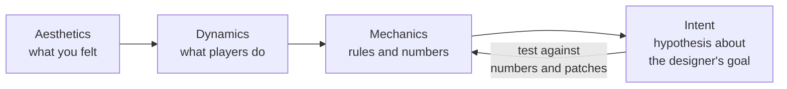
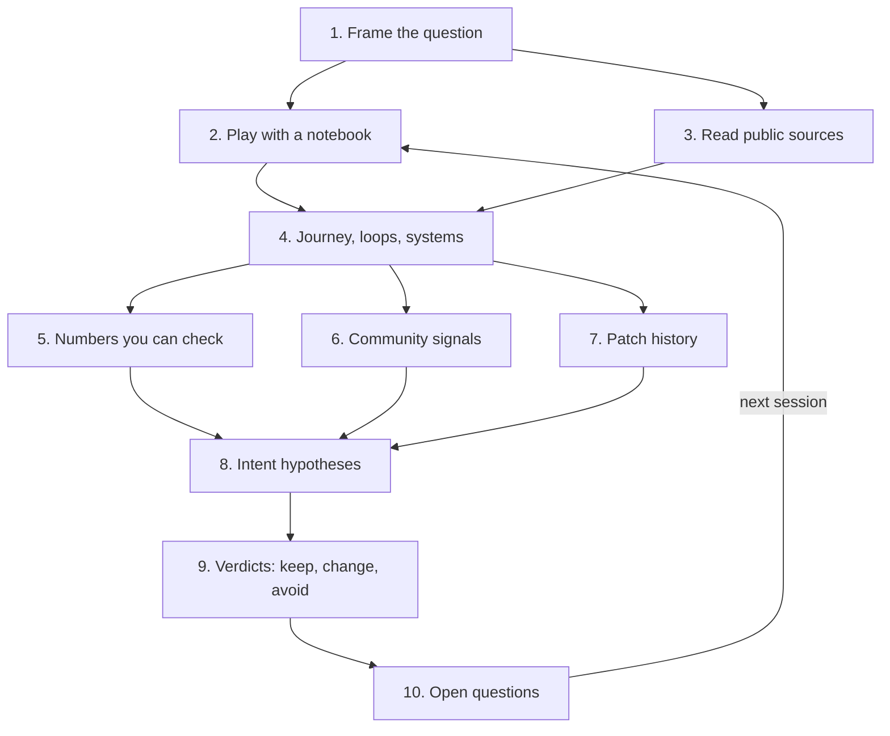
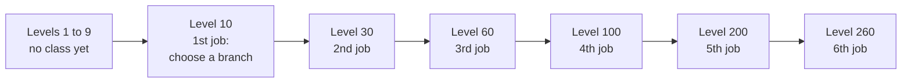

# Module 04: Studying a reference game as a designer

- **Goal:** read an existing online game as a *design*: reconstruct the player journey, the loops and the systems, infer the designers' intent from what the game shows, check it against numbers and public history, and write it all down so every claim is labelled by how well you know it.
- **Prerequisites:** [01 — The player experience](01-player-experience.md), [03 — Vision, pillars and loops](03-vision-pillars-loops.md).
- **Simulation:** none
- **Facts checked:** October 2026 (prices, rules and product status change; re-check before reuse)

## In short

Every designer learns from games that already exist. The professional version of that habit is a **design teardown**: a repeatable study that starts from what a player sees, walks the player journey, maps the loops and systems, works backwards to the intent behind them, and then tests that story against numbers, community reaction and the game's own patch history. A teardown reads a game as a set of *decisions*, not as a feature list. Every claim carries a label (observed, documented or inferred), and nothing comes from private sources or from client data mining presented as fact. The worked example is a teardown template filled in for one public, long-running, free-to-play online RPG: the class-advancement ladder and the random gear-upgrade system of MapleStory, built only from public sources.

## 1. The concept

### 1.1 What a design teardown is

A **teardown** is a structured study of an existing product. In this course it always means a *design* teardown: you ask "what was the designer trying to make the player do and feel, and which rules produce that?"

This is a different job from a technical teardown, which asks how a game is *built* (servers, update loops, data formats). Both can start from the same game, and they answer different questions. A technical teardown ends in an architecture guess. A design teardown ends in a list of decisions, each with a reason, a cost and a verdict.

### 1.2 MDA in reverse

Module 01 introduced **MDA** (Mechanics, Dynamics, Aesthetics): designers write *mechanics* (rules and numbers), which create *dynamics* (what players actually do), which create *aesthetics* (what players feel). Designers work from mechanics up to feelings. Players meet the game the other way round.

A teardown follows the player's direction and then goes one step further, which is why it is called MDA in reverse:



Start with how it felt ("I was never sure which of my gear upgrades was worth the money"). Find the behaviour behind the feeling ("players keep buying more attempts"). Find the rule that causes it ("each attempt is random and the result replaces the old one"). Then state a hypothesis about intent ("the designer wants a long-running spending loop with a thrill on each attempt") and look for evidence that confirms or kills it.

### 1.3 Three kinds of evidence

Every statement in a teardown gets one of three labels. They are the same ideas that a technical teardown uses, applied to design claims.

| Label | Meaning | Design example |
|---|---|---|
| **Observed** | You or a teammate saw it in play, and it can be repeated | "At level 10 the game asks you to choose a class branch" |
| **Documented** | A first-hand or reputable public source states it, with a date | "The regulator said the odds were changed in 2011 without notice" |
| **Inferred** | A guess that explains the observations | "The long gap between level 200 and 260 exists to keep veterans busy between content updates" |

Write the label beside every claim. A teardown that blurs the three turns into folklore within a month, because the next reader cannot tell a measurement from a hunch. It also pays to write **observed or documented, but source is secondary** when a claim comes from a press article retelling a primary document.

### 1.4 The pipeline



The sections below follow the numbered steps. Open questions feed the next play session, exactly as in any experiment.

## 2. The player's view

A teardown is the one place a designer is allowed to be two people at once: a player who feels the game, and an analyst who writes down why. The skill is switching between them on purpose.

### 2.1 Play with a notebook

Before a session, write one question ("what makes me want to play one more fight?"). While playing, write down **feelings first, mechanics second**. A moment of boredom or frustration is data, because the player in you is the cheapest playtester you have.

A useful notebook page has four lines:

| Line | Example |
|---|---|
| **When** (game version, date, character level, time played) | "Version 1.2, day 3, level 28, 40 minutes in" |
| **What I did** | "Cleared the same field three times for a drop" |
| **What I felt** | "Bored after the second clear, tense when the rare item dropped" |
| **What the game did to cause it** | "Rare drop; no visible progress meter" |

Online games change often, so a note without a version number is close to useless after a month.

Frame-by-frame video analysis, latency tests and similar instruments belong to the technical side of studying a game. For a design teardown a stopwatch and a notebook are usually enough.

### 2.2 Read the player journey

The **player journey** is the ordered list of experiences a new player has, from first launch to the point where the game stops giving new things. Reading it is the single most valuable part of a teardown, because it shows what the designers decided to teach, give and withhold, and in what order.

Map it as a timeline of **milestones**, with what each one unlocks:

| Question to ask at every milestone | Why it matters |
|---|---|
| What new verb, tool or choice appears here? | Pacing of novelty |
| What does the game take away or slow down here? | Where the grind begins |
| Which motivation (module 01) is being served: mastery, collection, social, story? | What the milestone is for |
| How long does it take (in hours) to reach the next one? | The shape of the curve |
| What is the first moment a player could plausibly quit? | Churn points |

Count the time between milestones. A journey where each step takes longer than the last is a typical long-running online RPG. A flat journey with a sudden cliff signals a gate or a paywall.

### 2.3 Map the loops

Using module 03, write the **core loop** (seconds), the **session loop** (minutes to an hour) and the **meta loop** (days to months) of the game. For each loop write the verb, the reward and the reason to repeat. Then check that each loop feeds the next: a core loop that produces nothing the session loop needs is a weak point.

### 2.4 Map the systems

A **system** is a set of rules that handles one concern: classes, gear upgrades, quests, trading, parties. List them, draw the links (what produces what), and mark each system with the loop it supports. Two things matter most:

- **Which systems the player touches daily** versus rarely. Daily systems carry the retention.
- **Where the money enters** (a shop, a time-saver, a random draw) and which system it touches. That tells you what the game treats as scarce.

## 3. The design space

There is no single way to study a game. The methods differ in what they cost and in how far their evidence can be trusted.

### 3.1 The methods compared

| Method | Best for | Cost | Main risk |
|---|---|---|---|
| **Play diary** (2.1) | Feelings, pacing, friction | Hours of play | Your taste is not the audience's taste |
| **Journey map** (2.2) | Pacing, what is taught when | Low | Seeing only the first hours; late game stays hidden |
| **Loop and system maps** (2.3, 2.4) | The structure of the design | Low | Mistaking a feature list for a design |
| **Numbers** (section 5) | Rates, prices, curves, caps | Medium | Small samples; numbers drift between patches |
| **Community signals** (section 6) | What players actually do and hate | Low | Loud minorities; survivor bias |
| **Patch history** (section 7) | Which decisions failed and how | Medium | Missing context on why a change was made |
| **Developer talks and interviews** | Stated intent | Low | Filtered by memory and marketing |

### 3.2 Public evidence: where each kind comes from

| Source | Good for | Reliability |
|---|---|---|
| **Official site, manuals, patch notes, in-game help** | Feature lists, rule changes, sometimes numbers | High for what it says; incomplete |
| **Published odds and rates** (see 5.2) | Drop and success probabilities | High where law or platform rules require them, and checkable |
| **Developer talks, postmortems, interviews** | Intent and trade-offs | High on intent; check the date |
| **Regulator and court documents, news from reputable outlets** | Documented facts about misconduct or disputes | High if primary; secondary if retold |
| **Community wikis and spreadsheets** | Aggregated rules and measurements | Variable: look for sample sizes and version tags |
| **Forums, social media, reviews, store ratings** | Sentiment and complaints | Treat as leads, not proof |
| **Video essays and streams** | Techniques and edge cases | Verify yourself |

Always note the date and the version a source describes, and cite it as you would in a paper: title, author, date, link.

### 3.3 How to choose how deep to go

| Situation | Suggested depth |
|---|---|
| Quick inspiration for one feature | Play diary + journey map for that feature, half a day |
| Deciding whether to adopt a mechanic | Add numbers and patch history, two to three days |
| Entering a genre or competing directly | Full teardown with community signals, a week or more, repeated per major version |
| You cannot play the game (region locked, defunct) | Public sources only; label everything documented or inferred |

## 4. Tuning and pitfalls

A teardown has no numbers to tune, but it does have a discipline to tune: how much you trust each claim.

### 4.1 Reverse engineering intent

Intent is always an **inference**. Three habits keep it honest.

1. **Write the hypothesis and a rival.** "The long level ladder exists to extend content life" versus "it exists because the studio kept adding levels as a cheap content patch". The evidence that separates the two (patch dates, XP changes) is what you look for next.
2. **Ask which player problem each rule solves.** A rule with no visible problem behind it may be legacy, a business need or a fix for an old exploit. Say so.
3. **Distinguish the design from the tuning.** The shape of a system (a ladder with advancement tiers) lasts for years. A constant (the exact level of a tier) changes with versions. Record the shape with confidence and the constant with a date.

### 4.2 Classic pitfalls

| Pitfall | What it looks like | Guard |
|---|---|---|
| **Copying the symptom** | Adopting a feature that solves a problem you do not have (an old hardware limit, a business model) | Ask "why does this exist?" before "how do I copy it?" |
| **Survivorship** | Studying only games that succeeded; the same feature may have failed elsewhere | Look for failed games with the same feature |
| **Confirmation bias** | Every sample looks like proof once you have a theory | Write the prediction before the test |
| **Version drift** | Mixing a 2012 wiki with a 2024 client | Tag every claim with a version or date |
| **Over-trusting community data** | Wikis copy each other and mix regions | Find the original measurement |
| **Mistaking a late game for the whole game** | Judging a ten-year-old game by its endgame, which new players never see | Study the new-player journey and the veteran journey separately |
| **Never finishing** | A teardown has no natural end | Time-box it and stop when the open questions no longer change a decision |

### 4.3 Ethics and the legal line

This section is general information, not legal advice.

- **Use what any player or reader can legitimately see.** Play the game within its terms, read public material, cite it.
- **Do not present datamining as fact.** Client files, extracted tables and decoded network traffic belong to the publisher. Most online game terms forbid taking them apart, and the resulting databases may mix versions or contain unreleased content. If you meet such data in a community wiki, label the claim "community data, collection method unknown" and look for a public source that confirms it.
- **Never use leaked or stolen internal documents or source code,** even "just to look". They contaminate your own work and carry legal risk.
- **Do not copy** text, art or exact data tables into your product. Copyright protects the specific expression, not the idea of a mechanic. Your numbers must come from your own tuning.
- **Be fair about people and companies.** Quote regulators and courts exactly, say whether a finding is disputed or under appeal, and never state an allegation as a settled fact.

## 5. Numbers you can observe

Design claims are strongest when a number backs them. Some numbers are published, some you can measure, and some are simply not available.

### 5.1 What you can usually get

| Kind of number | Where | Caveat |
|---|---|---|
| **Level thresholds, caps, tier levels** | In-game UI, official guides | Change with updates |
| **Prices and currency amounts** | Shop screens, patch notes | Regional prices differ |
| **Published odds** | Shop screens, official pages (see 5.2) | Check which version and region |
| **Cooldowns, ranges, rates** | Tooltips, repeated measurements | Tooltips can be out of date |
| **Population and activity** | Almost never public | Do not guess; treat third-party "player count" sites as rough |

### 5.2 Published odds: when the law makes numbers public

Many online games sell **randomised rewards** (loot boxes, gacha draws, random upgrade attempts). Because the odds matter to the buyer, several rule-makers require them to be shown. As of October 2026:

| Where | Rule | Source type |
|---|---|---|
| **Apple App Store** | Apps with loot boxes or other randomised virtual items for purchase "must disclose the odds of receiving each type of item to customers prior to purchase" (guideline 3.1.1) | Platform rule |
| **Google Play** | Apps with randomised items from a purchase "must clearly disclose the odds of receiving those items in advance of, and in close and timely proximity to, that purchase" | Platform rule |
| **South Korea** | Amendments to the Game Industry Promotion Act in force from 22 March 2024 require game companies, domestic and foreign, to disclose reward probabilities on the in-game purchase screen; penalties include fines up to 20 million won | Law |

These rules turn guesswork into documented numbers, and they also create checkable claims: a published rate can be tested against your own samples.

### 5.3 Checking a published number

How many trials do you need to tell a 3% rate from a 5% rate? More than most people expect.

**Worked example (invented numbers).** A shop page says an item drops with probability 3%. You try 200 times and see 5 drops.

- Expected drops at 3%: 200 x 0.03 = 6.
- Standard deviation: sqrt(200 x 0.03 x 0.97) = about 2.4.
- Your observed rate: 5 / 200 = 2.5%.
- A rough 95% interval for the true rate: 2.5% plus or minus 1.96 x sqrt(0.025 x 0.975 / 200) = 2.5% plus or minus 2.2 points, so about 0.3% to 4.7%.

The published 3% sits comfortably inside that interval. So does 1%, and so does 4.5%. Two hundred attempts cannot tell any of them apart, so five drops proves nothing about honesty. As a rule of thumb, you need several thousand trials (pooled across many players) before a single-digit rate is checked to within a point.

This is why community pooling matters, and why changes to odds that are never announced are so damaging: players cannot detect them by their own play.

### 5.4 Curves and thresholds

For progression, record the experience needed per level, or the time per milestone, and plot it. Compare simple shapes (linear, quadratic, exponential, a lookup table). A curve that fits none of them is probably a hand-edited table, which is itself a finding: the designers shaped it by feel, level by level.

## 6. Community signals

Players say what a design did to them. Read three places:

| Source | What it shows | Caution |
|---|---|---|
| **Store reviews and ratings** | Overall satisfaction, recent regressions | Review bombs after a single controversy |
| **Forums and subreddits** | Detailed complaints, workarounds, build discussions | Loud minorities; veterans dominate |
| **Official announcements and apologies** | What the studio admitted was wrong | Written by communications staff, not designers |
| **Churn and "why I quit" posts** | The moments the game loses players | Self-reported reasons are not always the real reason |

Ways to read them well:

- **Count themes, not posts.** Tally the top five complaints and the top five praises.
- **Separate feeling from fact.** "The drop rate feels bad" is a feeling. "I did 500 runs and got nothing" is a sample. Both matter, and only one is a number.
- **Look for behaviour, not opinion.** Workarounds, exploits and "meta" guides show what players do despite the design.
- **Match complaints to a system.** A complaint that cannot be traced to a rule is a note about taste or about marketing.

## 7. Patch history as a record of design mistakes

A game's patch notes are the cheapest source of hard evidence about its design, because each entry is a decision the team revisited. Read them chronologically and ask three questions of every change:

1. **What was the problem?** (an exploit, an unfair advantage, a bottleneck, a complaint)
2. **What was changed, and by how much?**
3. **Was it a fix or a pivot?** A fix keeps the intent. A pivot changes it.

Patterns worth noticing:

| Pattern in the notes | What it usually means |
|---|---|
| The same system adjusted every few patches | The design is unstable, or the audience keeps finding the edge |
| A catch-up event or boost added to an old ladder | The ladder became too long for new players |
| A new tier added to the top of a ladder | The old end was reached; the studio is stretching the content life |
| A rate or cost quietly changed | Economic pressure; this is where trust problems start |
| A feature removed or renamed | The design failed, or the legal environment changed |

Patch history is also where **trust failures** show up, and these are design failures too. A system that depends on randomness depends on the player believing the odds are fair. The worked example below contains a real one.

## 8. The teardown template

Use the same template every time so teardowns can be compared. Copy it, fill every field, and mark every claim with its label (O, D or I) and its source.

```text
TEARDOWN: <game and feature set>
Version / date of study: <...>        Platforms: <...>        Business model: <...>
Method: <desk study | played for N hours | both>
Question: <the one thing I wanted to understand>

1. PLAYER JOURNEY   milestone -> what it unlocks -> time to reach     [O/D/I]
2. LOOPS            core / session / meta: verb, reward, reason       [O/D/I]
3. SYSTEMS          name -> job -> loop supported -> money touchpoint [O/D/I]
4. NUMBERS          thresholds, prices, published odds, with dates    [D, or O if measured]
5. COMMUNITY        top 5 praised, top 5 disliked, workarounds        [D]
6. PATCH HISTORY    date -> change -> problem it answers -> fix/pivot [D]
7. INTENT (MDA in reverse)  hypothesis + rival hypothesis + evidence  [I]
8. VERDICTS         keep / change / avoid, each with a reason         [I]
9. OPEN QUESTIONS   each with a test or a source to look for
10. SOURCES         title, author, date, link, what it supports
```

## 9. Worked example: a teardown of a public online RPG

**Game chosen:** MapleStory, a free-to-play side-scrolling online RPG. It was released in Korea in April 2003 and has run for over twenty years, on PC and, with MapleStory M, on mobile. It is a good teardown subject because it has the same overall shape as the course game (one hero per player, class-based, shared world, free-to-play), its class ladder and its random gear-upgrade system are visible to every player, and the second of these has an unusually public record: published odds, a regulator's decision and a developer apology.

**Features studied:** (a) the class-advancement ladder ("job advancement") and (b) the random gear-upgrade system ("Cubes"), plus the catch-up events around the leveling ladder.

**How this was built:** a desk study from public sources only, with no play session and no client data. For that reason **no claim below is labelled Observed.** Wherever the study would normally rely on play, the claim is labelled Inferred and the notes say what a play session should check. All figures are as of October 2026 unless dated.

### 9.1 The teardown

```text
TEARDOWN: MapleStory - class advancement and random gear upgrades
Version / date of study: public information as of October 2026
Platforms: PC, mobile (MapleStory M)    Business model: free-to-play with a cash shop
Method: desk study (no play, no client data)
Question: How does a 20-year-old class-based RPG keep a long ladder worth climbing,
          and what happened when its random upgrade system lost players' trust?
```

**1. Player journey (class ladder).**



| Milestone | What it unlocks | Label |
|---|---|---|
| Level 10 | The first class choice (job advancement, "1st job") | Documented (community guide, older material) |
| Levels 30, 60, 100 | 2nd, 3rd and 4th job: new skills, stronger versions of the class | Documented (community guide) |
| Levels 200 and 260 | 5th and 6th job for the main explorer branch | Documented (encyclopedia entry; check the current client) |
| 6th job and the "HEXA Matrix" | A further tier of skills and stats, introduced in the late-2023 "New Age" update | Documented (news report on the update) |

The first reading: **the ladder has been extended over the years.** Early jobs sit at levels 10 to 100, and two more tiers were added much later. This is a typical way a long-running RPG stretches its content (Inferred: the dates of each tier were not studied).

**2. Loops** (all Inferred from the documented features; a play session should confirm).

| Loop | Verb | Reward | Reason to repeat |
|---|---|---|---|
| Core | Fight monsters on a field map | Experience, items | Each kill moves you toward the next milestone |
| Session | Hunt, clear a boss or daily task, upgrade gear | Levels, materials, currency | A daily quest list is documented in the update coverage |
| Meta | Advance the class, upgrade gear, join events | New job tiers, stronger gear | The ladder keeps extending |

**3. Systems.**

| System | Job | Money touchpoint |
|---|---|---|
| Job advancement | Gate the power ladder into steps | Indirect (progress-boosting items) |
| Cubes (random gear-line rerolls) | Let players keep rolling an item's bonus lines until they like the result | Direct: a purchasable random draw |
| Burning and Hyper Burning events | Help a new or returning character climb fast | Indirect: free, but retention-driven |
| Cash shop | Sell cosmetics, convenience and random draws | Direct |

**4. Numbers (all Documented, secondary where noted).**

| Number | Value | Source type |
|---|---|---|
| Level cap at the time of the 2023 update | 260; "EXP adjustments" made the climb from 200 to 260 faster | News report on the update |
| Cube odds history | Reported by the regulator: equal odds at launch in May 2010, then popular outcomes made less likely in an update in September 2010, and from August 2011 to March 2021 some outcomes reportedly made nearly impossible without notice | Regulator decision as reported by the press |
| Regulator's fine | 11.64 billion won (about US$8.8 million at the time), 5 January 2024 | News report on the regulator's decision |
| Developer's 2021 refund | Cash refunds for cube spending over the previous two years, at small percentages of what players paid, plus a donation | Developer Q&A as relayed by a fan-run news site (secondary) |

**5. Community signals (Documented).** In March 2021 the developer published its cube reset logic and rates, and players were disappointed that the disclosure was incomplete. The developer's own written answers in May 2021 apologised for releasing "insufficient information" and announced compensation. The pressure came from players, and it moved a company that had not been required by law to publish anything. Korea's law only made disclosure mandatory in March 2024.

**6. Patch history.**

| Date | Change | Problem it answers | Fix or pivot |
|---|---|---|---|
| May to Sept 2010 | Cube introduced, then odds reportedly changed | Players were finding the best outcomes too easily (Inferred) | Pivot to a higher-spend loop |
| Aug 2011 to Mar 2021 | Odds reportedly changed again, never announced | Same (Inferred) | Pivot, hidden |
| March 2021 | Rates published with refunds | Player anger | Fix |
| Jan 2024 | Regulator fine; the developer appealed and argues it had no duty to disclose before the 2024 law and that disclosure began in 2021 | Consumer protection | Dispute still in court at the latest report found (spring 2026) |
| Late 2023 | New Age update: 6th job, EXP adjustments for 200 to 260, Burning events return | The top of the ladder was slow | Fix and extension |

**7. Intent (MDA in reverse).**

| Hypothesis | Evidence for | Rival hypothesis |
|---|---|---|
| The class ladder exists to pace power and new skills over years (I) | New tiers added at 200 and 260 | The tiers were added to extend the game, with pacing a side effect |
| The random gear system exists to create a long-running spending loop with a thrill on every attempt (I) | It is sold per attempt, and the documented dispute is about its odds | It exists to give players a gear-customisation goal, and monetisation came later |
| Catch-up events exist because the ladder is too long to climb from scratch (I) | The update coverage ties Burning events to reaching level 260 faster | They also serve as a returning-player campaign |

**8. Verdicts (all Inferred).**

| Decision | Verdict | Reason |
|---|---|---|
| A class ladder with named tiers | **Keep** | Easy to read, easy to extend, gives milestones |
| Extending the ladder upward again and again | **Change** | Each extension pushes new players further from the veterans; plan the end of the ladder early |
| Random upgrades without published odds | **Avoid** | The documented record shows how fast trust is lost, and platform rules now require disclosure |
| Catch-up events | **Keep, built in** | Plan them with the ladder, not after it feels too long |

**9. Open questions** (what a play session or further reading would check).

- How long does it take to climb each tier today, in hours? (Play a new character and time it.)
- How does a new player feel in the first hour, before the first job choice? (Play diary.)
- What did the odds table look like when published, and how do the real outcomes compare? (Pool samples across many players.)
- What does the appeal ruling say when it arrives? (Re-check the sources.)

**10. Sources** are in the Further reading list below. The key ones are the encyclopedia entry for the class ladder, the news coverage of the 2023 update, the regulator's fine and the appeal, the developer's 2021 apology, and the platform and law pages for published odds.

### 9.2 What the course game takes from this

The teardown ends in **principles, not constants**. For the course game it suggests:

- **Use a class ladder with visible milestones** (module 09), and decide up front where the ladder ends and how it will be extended.
- **Plan catch-up in the first release** (module 14), not as a patch after players complain.
- **Publish odds and keep a public change log** for any random reward (module 17). It is a platform requirement and a trust asset.
- **Keep the evidence trail.** Every rule the course game takes from this teardown records the source that inspired it, and then gets its own numbers.

### 9.3 How the method changes for other kinds of game

| Kind of game | What changes in the teardown |
|---|---|
| **Single-player or offline** | No community sentiment over time; use reviews and the achievements data players share; patch history is shorter |
| **Hero-collection and squad games** | Add a roster map and an acquisition map: how heroes are obtained, how duplicates are used; published odds are central |
| **Competitive or PvP games** | Add a balance-patch log and a meta report from public match statistics; players' win-rate sites become a data source |
| **Auto-battle and idle games** | Focus on offline progress rules and the shape of the idle curve; the player journey is mostly waiting and spending |
| **A game you cannot play** | Rely on public sources only and mark everything Documented or Inferred; do not claim feelings you have not had |

## Key takeaways

- A design teardown reads a game as a list of decisions: what the player does, which rules cause it, what the designer probably meant, and whether it worked.
- Work MDA in reverse: start from the feeling, find the behaviour, find the rule, then state the intent as a hypothesis with a rival.
- Label every claim Observed, Documented or Inferred, with a version or date, so the study never turns into folklore.
- Public numbers (odds shown by law or platform rules, thresholds, prices) are the strongest evidence, but small samples prove little: 5 drops in 200 tries fits rates from under 1% to nearly 5%.
- Patch history and community reaction are free records of design mistakes. Each change is a decision someone had to revisit.
- Stay on the right side of the line: public sources, cited and dated, no datamined tables presented as fact, no leaks, and allegations reported as allegations.
- A teardown ends in your own principles and open questions, not in a copy of the other game. The numbers in your game come from your own tuning.

## Further reading

- [MDA: A Formal Approach to Game Design and Game Research (Hunicke, LeBlanc, Zubek)](https://users.cs.northwestern.edu/~hunicke/MDA.pdf)
- [MapleStory: encyclopedia entry (release, platforms, job advancement levels, the 2024 fine)](https://en.wikipedia.org/wiki/MapleStory)
- [MapleStory New Age update coverage: 6th job, HEXA Matrix, EXP changes, Burning events (MMOs.com)](https://mmos.com/news/maplestory-new-age-update-now-live)
- [Korean FTC fines Nexon over MapleStory cube odds (Anime News Network, January 2024)](https://www.animenewsnetwork.com/news/2024-01-05/korean-ftc-fines-nexon-usd8.8-million-for-allegedly-manipulating-draw-odds-in-maplestory-game/.206181)
- [Nexon's appeal of the fine at the Seoul High Court (Inven Global)](https://www.invenglobal.com/articles/20319/nexons-maplestory-appeals-fine-as-seoul-high-court-resumes-hearing-in-april)
- [Nexon's 2021 apology and cube compensation, fan-translated Q&A (Orange Mushroom)](https://orangemushroom.net/2021/05/14/apology-for-not-meeting-customer-expectations-with-the-cube-rate-reveal-customer-conference-written-inquiry-answers/)
- [South Korea loot box rules: 266 games found in violation (Game World Observer, July 2024)](https://gameworldobserver.com/2024/07/08/266-games-violated-loot-box-rules-south-korea)
- [Apple App Review Guidelines, section 3.1.1 (randomised item odds)](https://developer.apple.com/app-store/review/guidelines/)
- [Google Play policy on randomised items and odds disclosure](https://support.google.com/googleplay/android-developer/answer/9858738)
- [Nielsen Norman Group: Journey Mapping 101](https://www.nngroup.com/articles/journey-mapping-101/)
- [Game Developer: design articles and postmortems](https://www.gamedeveloper.com/design)
