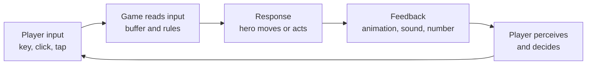
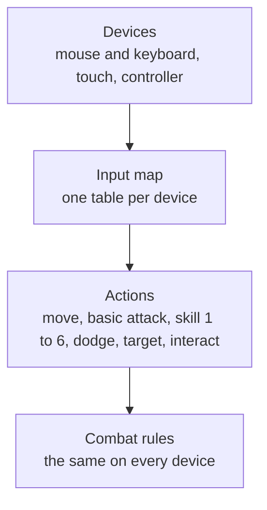

# Module 05: Controls, camera and game feel

- **Goal:** choose a control scheme and a camera for a real-time online RPG, explain how they shape combat, and specify the timing rules (buffering, responsiveness, animation commitment) and the feedback that make the controls feel good on both mouse/keyboard and touch.
- **Prerequisites:** [01 — The player experience](01-player-experience.md), [02 — Vision, pillars and loops](02-vision-pillars-loops.md).
- **Simulation:** none
- **Facts checked:** October 2026 (prices, rules and product status change; re-check before reuse)

## In short

A **control scheme** answers four questions: how the hero moves, how the player picks targets, how skills are fired, and what the camera shows. Each answer changes what combat can be: a camera that hides the ground cannot support ground telegraphs, and a touch screen cannot support twelve precise hotkeys. **Game feel** is how those controls feel in the hand: how fast the game answers, how forgiving the timing is, and how much the game "sells" each hit with sound and motion. Feel is mostly numbers (milliseconds, frames, pixels) that a designer can set and a playtest can check. The worked example designs the course game's control scheme for one hero on PC and on touch: input map, camera, targeting rules and a feedback list.

## 1. The concept

### 1.1 The input-response-feedback loop

Every control is a tiny loop that runs many times a second:

The loop must be short and predictable. If the response is late, the player blames the controls ("clunky"); if the feedback is weak, the player does not feel the action had weight ("floaty").

### 1.2 The four decisions of a control scheme

| Decision | Question | Typical options |
|---|---|---|
| **Movement** | How does the hero get from A to B? | Click-to-move, direct (keys or stick), tap-and-hold |
| **Targeting** | How does the player choose who a skill hits? | Select a target, aim with a cursor, auto-aim, ground-aimed area |
| **Activation** | How is a skill fired? | Hotkey or button, press-and-hold, drag-to-aim, auto-cast |
| **Camera** | What does the player see? | Top-down, isometric, third-person, side view |

These four are linked. Direct movement plus a free cursor lets the player aim at the same time; click-to-move uses the mouse for movement, so aiming skills needs a second mechanism (selected target or a held key). The rest of this module treats them as one package.

### 1.3 Terms used in this module

| Term | Meaning |
|---|---|
| **Latency** | Time between a physical input and the first visible or audible response, measured in milliseconds (ms). On an online game it includes the network round trip unless the client answers immediately. |
| **Responsiveness** | How quickly and consistently the game reacts to input. High responsiveness = low, steady latency. |
| **Input buffering** | Remembering a button press that arrives slightly too early (while the hero is still busy) and running it as soon as the hero is free. |
| **Animation commitment** | Once an action starts, how long the hero is locked into it before the player may do something else. Also called animation lock or recovery. |
| **Cancel window** | A part of an animation during which another action (usually a dodge) may interrupt it. |
| **Aim assist** | Rules that nudge an imprecise input toward the intended target (snap, magnetism, auto-target). |
| **Telegraph** | A visible warning before an attack lands (module 06). |
| **Game feel** | Steve Swink's term for the sensation of controlling something in a game; see 1.5. |
| **Juice** | Informal name for the layer of non-essential feedback (particles, shake, sound, squash and stretch) that makes actions feel good. |

### 1.4 Animation commitment: three phases

Most attacks and skills have three phases:

| Phase | What happens | Design lever |
|---|---|---|
| **Wind-up** (anticipation) | The hero prepares; no damage yet | Gives the player a moment to cancel, and enemies' wind-ups give the player time to react |
| **Active** | The hit lands (a few frames) | The only moment damage is applied |
| **Recovery** | The hero returns to neutral | The cost of using the skill: a risk window the player must plan around |

A long recovery makes a skill "heavy" and punishes mis-use. A short recovery makes it "light" and lets the player chain actions. Commitment is a balance tool: a strong skill with long recovery can be fair, because the player pays in vulnerability.

### 1.5 Game feel and juice

Steve Swink's book *Game Feel* (2008) defines game feel as real-time control of virtual objects in a simulated space, with the interaction emphasised by polish. He splits it into six building blocks: **input** (the device and its sensitivity), **response** (how the game interprets input), **context** (the space the object moves in), **polish** (effects that sell the action), **metaphor** (the fiction that explains what the object is) and **rules** (the systems that govern it). Source: the Wikipedia summary in Further reading.

Two lessons for a designer:

1. **Feel is built from several layers.** Fast response with no feedback feels thin; rich effects on a laggy input feel worse than none.
2. **Juice does not change the outcome of a hit.** It changes whether the hit is *felt*. The cheapest large gain in a combat prototype is usually a hit flash, a sound and a short hit-stop on impact. The talks "Juice it or lose it" and "The art of screenshake" show this on a simple game (see Further reading).

### 1.6 Responsiveness: why 100 ms matters

Usability research gives three rough limits for response time: about **0.1 s** feels instantaneous, about **1 s** keeps the user's train of thought, and about **10 s** is the limit of attention (Jakob Nielsen, 1993; the limits are still quoted today). For action games the 0.1 s limit is the useful one: if pressing a skill button produces *no visible reaction* for more than about a tenth of a second, the control feels sluggish. The practical rule for an online game is to **respond on the client at once** (start the animation, play the sound) and let the server confirm the result afterwards, so the player never waits for the network to see their own hero move.

## 2. The player's view

What the player should feel:

- **"My hero does what I meant."** Presses are never swallowed; a slightly early press still works (buffering).
- **"I can read the fight and answer it."** The camera shows the ground and the enemy, and a dodge is available when I see a telegraph (pillar 2 in the course game).
- **"Hits have weight."** A strong skill sounds, looks and feels strong, even before the damage number appears.
- **"I am never fighting the interface."** On a phone, my thumbs do not hide the fight, and the buttons I need are where my thumbs rest.

Motivations from [module 01](01-player-experience.md): controls and feel serve **Excitement** and **Sensation** (moment-to-moment pleasure), **Challenge** (a skilled player can dodge and chain) and **Power** (a skill that feels strong confirms growth). Dev (the phone persona, 15–25 minutes) needs **one-thumb-friendly** play; Mira (PC, evenings) wants depth and precision.

Link to the loops of [module 02](02-vision-pillars-loops.md): controls and feel *are* the core loop (30–90 s of "engage, use skills, dodge, kill"). If they are poor, no reward layer rescues the game, so this is the first system to prototype.

## 3. The design space

### 3.1 Movement schemes

| Scheme | How it works | Used by (visible in play) | Strengths | Costs |
|---|---|---|---|---|
| **Click-to-move** | Click the ground or an enemy; the hero walks or attacks | Diablo III, Path of Exile | Needs only the mouse; one hand free; works with many skills on keys | Hard to dodge precisely; mouse is busy moving, so aiming needs a second mechanism; pathfinding must be good |
| **Direct movement (WASD or stick)** | Held keys move the hero in a direction | World of Warcraft (alongside click-to-move), Genshin Impact | Precise dodging; best for telegraph-and-avoid combat; natural for controller | Needs two hands on PC; harder to support long travel without an "auto-run" |
| **Twin-stick** | One input moves, a second aims independently | Brawl Stars (touch), many PC and console shooters | Separates moving and aiming; strong for skill shots | Two thumbs on touch (little room for skill buttons); more complex on keyboard |
| **Tap and virtual joystick** | A thumb joystick moves; buttons fire skills; tap targets | Mobile versions of Genshin Impact, Wild Rift | Works on a phone; familiar to mobile players | Imprecise; thumbs cover the screen; no hover; fewer simultaneous buttons |
| **Controller** | Sticks move and aim; face buttons and triggers for skills | Genshin Impact, Diablo IV, many console RPGs | Comfortable for long sessions; precise movement | Few buttons; menus and inventory need a controller-friendly layout |

Many games offer two or three of these at once and let the player choose. Offering both click-to-move and direct movement doubles the work (pathfinding plus steering) and doubles the test matrix; do it only when the audience needs it.

### 3.2 Targeting and aiming

| Model | How the player chooses a target | Strengths | Costs |
|---|---|---|---|
| **Select a target** (tab-target) | Click or press Tab to select; skills hit the selection | Forgiving of latency and imprecise input; easy on touch | Aim is not a skill; fights become number-crunching unless enemy attacks demand movement |
| **Cursor or reticle aim** | Skills go where the cursor or reticle points | High skill ceiling; satisfying hits | Needs a mouse or stick; hard on touch; latency matters more |
| **Auto-target** | The game picks the nearest or best target | Lowest friction; ideal for touch and for filler skills | Wrong target in a crowd; needs override |
| **Ground-aimed area** | The player marks a spot or direction for an area skill | Clear and fair for area skills | Needs a preview and a drag gesture on touch |

Real games mix models. A common pattern in online RPGs is **soft target plus aim assist**: the game keeps a selected or nearest target, single-target skills use it, and area skills are placed on the ground.

### 3.3 Cameras and how they shape combat

| Camera | What it is | Used by (visible in play) | Effect on combat |
|---|---|---|---|
| **Top-down** | Camera looks nearly straight down, fixed rotation | Many ARPGs and MOBAs (Diablo III with its fixed angled view is the classic example) | Best view of the ground: telegraphs, area skills and positioning are easy to read; characters are small |
| **Isometric** | Fixed angle, usually around 30–45 degrees of pitch, no perspective or little | Diablo-style ARPGs, Path of Exile | Same as top-down with more character visibility; occlusion by walls needs transparency |
| **Third-person (orbit)** | Camera behind the hero, rotated by the player | World of Warcraft, Genshin Impact, Black Desert | Strong immersion; the player controls the view, so skills can be aimed in 3D; enemies behind the hero are hidden; telegraphs on the ground need a good camera angle |
| **Side view (2D)** | Camera looks at the hero from the side, scrolling horizontally | MapleStory | Simple and very readable; movement is one dimension plus jumping; level design is "lanes" |

Rules of thumb for how a camera shapes combat:

1. **The camera decides what a telegraph can be.** On a steep camera a red circle on the ground is visible at a glance. In third-person, the player must also manage the camera, so telegraphs need to be large and bright, and fights need an option such as a lock-on to keep the enemy in view.
2. **The more the player can see, the more enemies can attack at once.** A wide top-down view allows large packs and sweeping attacks; a close third-person view limits fair attacks to the front.
3. **A free camera is a skill and a load.** Orbiting while moving and aiming is a third control; on touch it competes for the same thumb as the joystick.
4. **Fixed cameras make level design cheaper.** The artists know what the player will see, and the engine can cull what is outside the view.

### 3.4 Rarer schemes (alternatives only)

The course game controls **one hero**. Other designs break that rule, and each changes the whole scheme:

| Scheme | How it works | Example of a visible feature | Cost |
|---|---|---|---|
| **Switch between several characters** | A team is equipped; the player controls one at a time and switches instantly | Genshin Impact (team of four, one active) | Switching UI; the others need AI or are idle; module 09 |
| **Control several characters at once** | The player gives commands to a group, usually with selection | Baldur's Gate 1 and 2 (real-time with pause; select the party with a drag box) | Selection UI; needs pause or slow combat to be usable; hard on touch |
| **RTS-style selection** | Box-select units, right-click to command | StarCraft, Dota 2 (one unit, but RTS-style commands) | Needs a mouse and a keyboard; precision rises, accessibility falls |
| **Auto-battle** | The game plays the fight; the player sets up before and optionally triggers skills | Many mobile hero-collection games, for example AFK Arena | Removes most of the control question; moves the design to team building (module 09) |
| **Turn-based** | The game waits for each choice | Classic Final Fantasy, Fire Emblem | Controls become menus; timing, buffering and animation commitment do not apply |

These are not covered further here. The point is that **a control scheme is a consequence of the combat model and of the platform**, so change one and the other must follow.

### 3.5 How to choose

| If your game... | Prefer |
|---|---|
| Is built on telegraphed attacks that must be avoided | Direct movement plus a steep camera, so the ground is readable and dodging is precise |
| Needs a huge number of skills and has players who sit at a PC | Click-to-move or direct movement with many hotkeys; top-down or isometric |
| Must feel good on a phone | Joystick plus few large buttons, auto-target, aim assist; limit skills on screen |
| Runs on both PC and touch with shared progress | One action set, two input maps; do not design depth that only the mouse can reach |
| Has tab-target combat | A forgiving camera and input; focus feel on feedback and cooldown timing |
| Is real-time with pause or party control | A selection model and a pause command, and a UI for them |
| Is competitive (PvP) | The most precise scheme available, and rules for fair cross-play |

## 4. Tuning and pitfalls

### 4.1 Rules of thumb

These are starting values to test, not laws. Practitioners' talks and platform guidelines support the shape of the numbers; the exact values depend on the game.

| Parameter | Starting value | Why |
|---|---|---|
| **Visible reaction to a press** | Within 100 ms (about 6 frames at 60 fps) | Nielsen's 0.1 s limit for "instantaneous" |
| **Input buffer window** | 100–200 ms before the hero is free | Long enough to forgive early presses, short enough not to run actions the player no longer wants |
| **Hit-stop (brief freeze on impact)** | 30–100 ms (2–6 frames at 60 fps): light hits 0–40 ms, heavy hits and bosses 60–100 ms | Gives hits weight; long freezes feel like lag |
| **Screen shake** | Short (100–250 ms), small, and rare | A shake on every hit hides the telegraphs the player needs to read |
| **Dodge i-frames** (invulnerable frames) | About 0.2–0.3 s at the start of the dodge | Rewards the player for timing the dodge to the enemy hit frame |
| **Tap target size on touch** | At least 44 x 44 pt (Apple guidance) or 48 x 48 dp (Material guidance); the web guideline WCAG 2.2 sets a floor of 24 x 24 CSS px | Fat-finger error is the main source of mis-taps; combat buttons should be larger than the minimum |
| **Gap between touch buttons** | At least 8 dp | Neighbouring buttons are pressed by accident otherwise |
| **Camera pitch for an action-readable ARPG view** | About 45–60 degrees from the horizon, fixed rotation | High enough to see ground telegraphs, low enough to see characters |
| **Cooldown ready feedback** | Icon flash and a soft sound | The player must know without looking away from the fight |

Network note (as of October 2026, general practice): for action combat on an online server, **client-side prediction** (the client starts the action at once and the server corrects it if needed) is the standard way to hide latency. Tab-target combat tolerates more latency than action combat because it does not depend on exact positions.

### 4.2 Signals that something is wrong

| Observation in a playtest or in data | Likely problem |
|---|---|
| Players say "clunky", "floaty", "my press did nothing" | Latency over 100 ms to a visible reaction, or no buffering |
| Players dodge late or early consistently | Telegraph timing or i-frames do not match the animation |
| On touch, players hit the wrong skill or the pause button | Buttons too small or too close, or in a bad thumb zone |
| Touch players avoid ground-aimed skills | The aiming gesture is too hard; add auto-aim or a quick-cast |
| The camera loses the enemy; players say "I can't see what hit me" | Camera too low, too close, or occluded; effects too heavy |
| Players spam one skill and ignore the rest | Activation friction is uneven; cooldown feedback is weak |
| Players switch off screen shake or effects | Juice is too heavy and hurts readability |
| PC and touch players report different difficulty on the same content | The input maps are not equivalent; see 4.4 |

### 4.3 Classic failures of a long-running game

- **Feel tuned once and never touched again.** New skills added over years are tuned for damage only, and they feel different from older ones. Keep a "feel checklist" in the skill spec (module 08).
- **Animation lock creep.** Each new skill gets a long, flashy animation, and the combat gets slower. Set a maximum recovery time per skill tier.
- **Effects that grow until the screen is unreadable.** Every new skill adds particles; in a group fight nobody can see the telegraph. Put a **visual budget** on skill effects and give the enemy telegraph the highest priority.
- **A camera built for one fight.** A boss that needs a wide view in a game with a tight camera. Decide the camera range early and test every fight at the extremes.
- **A touch layout copied from the PC one.** The result is tiny buttons and a crowded screen.
- **Hard dependence on a mouse.** The design needs a precise cursor, then the mobile version is a different game.

### 4.4 Designing one game for mouse/keyboard and touch

The cleanest approach has three layers:

1. **Define the actions once.** Combat rules see only actions ("use skill 3 on the selected target"), never keys or taps. Adding a device means adding an input map, not changing combat.
2. **Give every device the same capabilities, in its own way.** Anything a mouse user can do in combat, a touch user can do too, with a different gesture. Do not add content that only one device can complete.
3. **Compensate for the weaker input, do not nerf the content.** Touch has no hover, covers part of the screen and is imprecise, so give it a larger auto-target radius, quick-cast on tap and drag-to-aim only where it matters. The hit rules stay the same; the *assist* differs.
4. **Reduce what must be pressed at once.** Phones are comfortable with about 6–8 combat buttons; PC players handle more. The course game solves this at the design level: on touch, six skill buttons are shown and the two simple buff skills run on their own as auto-use toggles (see 5.2).
5. **Keep telegraph and dodge rules identical.** If the dodge window is tighter on one device, the same boss is easier on the other. Cross-play fairness matters most in PvP (module 19), so keep it in mind when the first PvP mode is designed.
6. **Test on real devices.** The emulator hides thumb occlusion and screen reflections.

## 5. Worked example

The course game: a small online fantasy RPG for PC and mobile, one hero per player, real-time combat. All numbers are invented. This feature spec covers the **control scheme for one hero**; skills themselves are in module 08.

### 5.1 Intent

- **Pillar 2, "Fights you can read":** the player must see every telegraph and have a way to answer it. This drives the camera and the dodge.
- **Pillar 1, "My hero, my way":** each class feels distinct in the hand: a Warden's skills have long, heavy recovery, a Duelist's are fast and light.
- **Mira (PC):** direct, precise, with enough keys to express depth.
- **Dev (phone):** one thumb on the joystick, the other on the buttons; a fight is playable without precise aiming.
- **Constraint:** no combat content that only mouse users can do.

### 5.2 Decisions

| Decision | Choice | Why |
|---|---|---|
| Movement | **Direct movement** (WASD on PC, floating joystick on touch) | Precise dodging; same mental model on both devices |
| Targeting | **Soft target plus ground-aimed area skills** | Forgiving on touch, still skillful on PC |
| Camera | **Fixed-rotation, tilted top-down (about 55 degrees)**, zoom range 10–16 m, follows the hero | Best view of ground telegraphs; no camera control competes with the joystick; cheap to test |
| Platforms | PC (mouse and keyboard) and touch at launch; controller supported by the action layer but not shipped | Keeps the first release small; the action layer allows a later controller map |
| Skill bar | **PC:** all 8 class skills on keys, plus basic attack and dodge, no loadout. **Touch:** 1 attack button, 1 dodge button and 6 skill buttons; the class's 2 simple buff skills run as **auto-use toggles** (on by default, also available on PC) | Fits a phone without cutting skills; buffs are maintenance, not decisions, so automating them costs no depth |
| Click-to-move | Not offered | Doubles the work and fights the dodge |

Every class has eight active skills: six that the player fires and two simple buffs. On touch the buffs are not buttons: an auto-use toggle (on by default) casts each buff when its class rule says so, for example "when an elite or boss is in range" (see [module 08](08-skills.md)), and only between skills so it never interrupts the player. On PC the same toggle exists and the buffs also have keys, for a player who wants to time them by hand. Both devices therefore reach every skill; only the way a buff is triggered differs.

### 5.3 Input map

| Action | PC | Touch |
|---|---|---|
| Move | W A S D | Left thumb: floating joystick (appears where the thumb lands, 120 dp across) |
| Basic attack | Left mouse button, or hold to auto-repeat on the selected target | Large button, bottom right (72 dp); hold to repeat |
| Skills 1–6 | Keys 1–6 | Six round buttons (56 dp) in an arc around the basic attack |
| Buff skills 7–8 | Keys 7 and 8, or the auto-use toggle | Auto-use toggle only: a small switch beside the arc (on by default); no buttons |
| Auto-use toggle (buffs) | Key B | Switch on the skill bar |
| Dodge | Space | Button (56 dp) above the arc, within thumb reach |
| Select target | Left click on an enemy, or Tab to cycle nearest-first | Tap an enemy |
| Aim a ground skill | Mouse cursor on the ground; skill fires on key press | Drag the skill button: a ground preview follows the thumb; release to cast; drag back to the button to cancel |
| Quick-cast a ground skill | Hold Shift while pressing the key: casts at the cursor with no preview | Tap the button: casts at the auto-aim position |
| Interact (NPC, door) | F | Context button that appears near the object |
| Camera zoom | Mouse wheel | Pinch (limited to the same 10–16 m range) |

### 5.4 Targeting rules

Used by single-target skills and the basic attack:

1. If the player has **selected** an enemy that is alive and within 25 m, use it.
2. Otherwise choose the **nearest hostile enemy within 120 degrees in front of the hero** within the skill's range.
3. If none, choose the nearest hostile enemy within the skill's range in any direction.
4. If none, the skill is **not spent**: the hero plays a short "no target" cue and the cooldown does not start.

Rules for ground-aimed skills:

- The cast point is clamped to the skill's maximum range.
- **Aim assist:** if an enemy is within 1.5 m of the cast point, the point snaps to it (touch: 2.5 m).
- A ground preview (the same shape as the damage area) is always shown while aiming, so the player sees what will be hit.

Selection ends when the target dies, becomes friendly, or leaves 25 m. Tab cycles only through enemies in view.

### 5.5 Timing rules (animation commitment and buffering)

| Rule | Value |
|---|---|
| Basic attack interval | Per class (module 06 lists the values used in the TTK simulation) |
| Skill phases | Wind-up (cancellable by dodge), active (the hit), recovery (cancellable by dodge after 40% of its length) |
| **Dodge** | 0.35 s long, moves the hero 4 m, invulnerable for the first 0.25 s, 3.0 s cooldown, no resource cost |
| Max recovery per skill | Light 0.3 s, medium 0.5 s, heavy 0.8 s |
| **Input buffer** | A press within 0.15 s before the hero is free is queued; only the last queued press is kept; the buffer clears when the hero is hit-stunned or dodges |
| Movement during a skill | Allowed for light skills; blocked during the active frames of medium and heavy skills |
| Reaction to a press | The hero starts the animation within 100 ms on the client, before the server confirms; if the server rejects the action (for example, out of range), the animation is cut and the cue "cannot use" plays |

### 5.6 Feedback list

Each action gets at least one visual and one audio cue. This is the checklist a skill spec in module 08 must fill in.

| Event | Visual | Audio | Touch extra | Timing |
|---|---|---|---|---|
| Button pressed | Button depresses; hero starts wind-up | Soft click | Light haptic tick | Within 100 ms |
| Hit lands (normal) | Enemy flash 80 ms; small damage number | Impact sound | None | On the active frame |
| Hit lands (heavy skill) | Larger flash; number scales with damage; short hit-stop | Heavier impact | Short haptic | Hit-stop 60 ms |
| Critical hit | Yellow number, bigger, with a spark | Layered "crit" sound | Short haptic | Hit-stop 80 ms |
| Kill | Enemy dissolves in 0.4 s; loot sparkle | Defeat sound | None | After the final hit |
| Hero takes damage | Screen-edge red pulse; short flash on the hero | Hurt sound | Medium haptic | Immediately |
| Enemy telegraph starts | Ground shape fills toward its edge over the whole cast time | Warning sound 0.5 s before the hit | None | Starts at wind-up |
| Dodge dodges a hit | Brief after-image and a "whoosh" | Dodge sound | Light haptic | On i-frames |
| Skill ready | Icon flashes once | Soft chime | None | When the cooldown ends |
| Hero below 30% HP | Slow red vignette pulse | Heartbeat, low | None | Persistent |
| Screen shake | Only on boss slams and the hero's heaviest skill | Matches the impact | None | 150 ms, small |

The priority rule: **enemy telegraphs are always drawn on top** of hero effects, and any hero effect may be turned down in a setting without changing gameplay.

### 5.7 Parameters to tune (summary)

| Parameter | Start | Range to test | Judged by |
|---|---|---|---|
| Camera pitch | 55 degrees | 45–65 | Players can say what hit them (pillar 2 test) |
| Input buffer | 0.15 s | 0.10–0.20 | "My press was swallowed" reports |
| Dodge i-frames | 0.25 s | 0.20–0.30 | Share of telegraph hits avoided by new players in the first dungeon |
| Auto-aim snap (touch) | 2.5 m | 1.5–3.5 | Ground-skill hit rate on touch vs PC |
| Joystick size | 120 dp | 100–140 | Mis-touches on skill buttons |
| Hit-stop (heavy) | 60 ms | 40–100 | Players call it "weighty", not "laggy" |

### 5.8 What was cut

- **Click-to-move** (cost and conflict with dodge).
- **A free-orbit camera** (competes with the joystick on touch).
- **Auto-battle** at launch. A basic "auto-attack on the nearest target" button exists; full auto-play is covered in module 23.
- **Controller map**, kept for a later release.
- **A parry or block button**: the dodge covers defence for the first release.

### 5.9 How the design would differ for another kind of game

| Game | Controls change |
|---|---|
| **Tab-target MMO** | Target selection and a bar of 12–20 hotkeys; camera orbit; effort goes into cooldown feedback and a global cooldown, not dodges |
| **Auto-battle hero collection** | Almost no movement; a "skill" tap when a meter fills; the camera is fixed; all feel work goes into feedback and presentation |
| **Squad real-time with pause** | Selection, a pause command and a queue; the camera must show the whole squad |
| **Competitive arena** | The most precise scheme only; no assist advantages; parity rules for devices |

## Key takeaways

- A control scheme is four linked decisions: movement, targeting, activation and camera. Change one and the others must follow.
- The camera decides what a telegraph can be: a tilted top-down view makes ground warnings readable and dodging fair.
- Feel is mostly numbers: respond within about 100 ms, buffer early presses for 100–200 ms, and keep recovery times capped per skill tier.
- Juice sells the hit but never changes its outcome; keep it on a visual budget so enemy telegraphs stay the loudest thing on screen.
- For PC and touch, define actions once and give each device its own input map; compensate touch with assist, not with easier content.
- A phone fits about six to eight combat buttons, so automate the low-decision skills (buffs) on touch instead of shrinking buttons.
- Multi-character control, RTS selection and auto-battle are rarer alternatives: each replaces the whole scheme, not one setting.

## Further reading

- Steve Swink, *Game Feel: A Game Designer's Guide to Virtual Sensation* (CRC Press, 2008), the book behind the term. Summary: [Game feel (Wikipedia)](https://en.wikipedia.org/wiki/Game_feel)
- Martin Jonasson and Petri Purho, ["Juice it or lose it"](https://www.youtube.com/watch?v=Fy0aCDmgnxg) (talk, 2012): how small effects change feel on a simple game.
- Jan Willem Nijman (Vlambeer), ["The art of screenshake"](https://www.youtube.com/watch?v=AJdEqssNZ-U) (INDIGO Classes, 2013).
- Jakob Nielsen, ["Response times: the 3 important limits"](https://www.nngroup.com/articles/response-times-3-important-limits/) (1993).
- [WCAG 2.2, Understanding SC 2.5.8: Target Size (Minimum)](https://www.w3.org/WAI/WCAG22/Understanding/target-size-minimum.html) (W3C), with Apple's 44 pt and Google's 48 dp guidance noted in 4.1.
- Steven Hoober, ["How do users really hold mobile devices?"](https://www.uxmatters.com/mt/archives/2013/02/how-do-users-really-hold-mobile-devices.php) (UXmatters, 2013): an observation of 1,333 people; useful for thumb reach and for testing layouts held in several grips.
