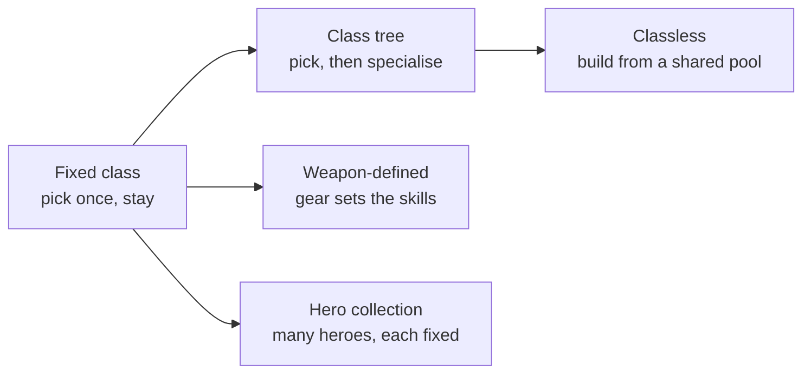
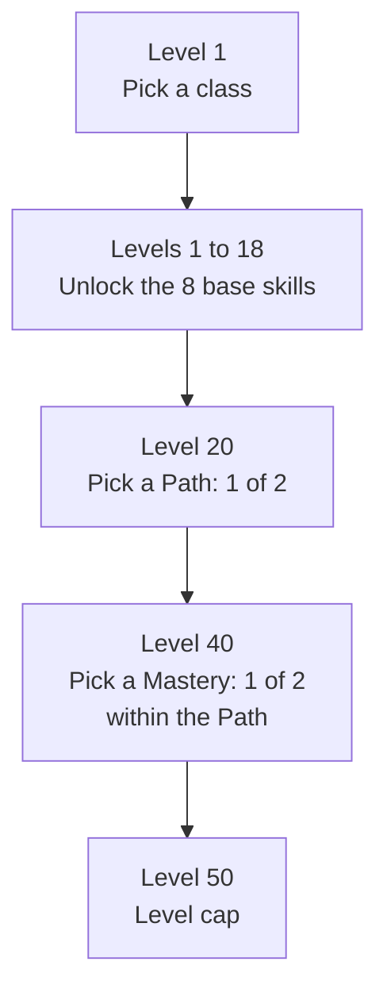

# Module 07: Classes and roles

- **Goal:** design a class roster for an online RPG: choose a role model, a class structure and a respec policy, check that a party of four covers its needs, and estimate what each class costs to build.
- **Prerequisites:** [02 — Vision, pillars and loops](02-vision-pillars-loops.md), [06 — Combat design](06-combat.md).
- **Simulation:** none
- **Facts checked:** October 2026 (prices, rules and product status change; re-check before reuse)

## In short

A **class** is a bundle of playstyle, fantasy and tools that a player picks to say "this is how I play." A **role** is the job the class does for the group (absorb hits, restore health, deal damage, control enemies, support allies). The classic split is the "holy trinity" of tank, healer and damage dealer, but many successful games use other models: no dedicated healer, support and control roles, or classes that are not bound to a role at all. The main design choices are the role model, the class structure (fixed, tree, classless, weapon-defined, collected heroes), how much choice a build has, and how freely players may change it. The worked example designs the course game's five launch classes, a role matrix for a party of four, an advancement plan for levels 1 to 50, and a respec policy.

## 1. The concept

### 1.1 Class, role and build

Three words are often mixed up. Keep them apart:

| Term | Meaning | Example |
|---|---|---|
| **Class** (also job or profession) | The identity the player picks: its fantasy, skills, resource and gear style | "Ranger" |
| **Role** | What the class contributes to a group fight | "Ranged damage plus control" |
| **Build** | The choices a player makes inside a class: skills, specialisation, gear, stats | "Ranger who specialises in traps" |

A class has one **base role** and a build moves it. A Ranger built for traps leans toward control, a Ranger built for aimed shots toward single-target damage. The more the build can move the role, the more **build diversity** the class has.

### 1.2 The holy trinity and the roles around it

The **holy trinity** is the three-role model of tank, healer and damage dealer (often called DPS, "damage per second"):

| Role | Job in a fight | What the player does |
|---|---|---|
| **Tank** | Keeps enemy attention and survives damage | Stands in front, uses defensive skills, positions the enemy |
| **Healer** | Restores health, removes harmful effects | Watches health bars, casts heals, revives |
| **Damage dealer** | Kills enemies | Uses the damage kit and avoids dangerous attacks |

It became the default model of large online RPGs, and it is still the structure of several of them. For example, Final Fantasy XIV groups its jobs into tank, healer and damage roles (see Further reading).

Beyond the trinity, designers add roles:

| Extra role | Job | Example form |
|---|---|---|
| **Controller** | Restricts enemies: slows, roots, stuns, pulls enemies together | Frost mage, trapper |
| **Support / buffer** | Raises the group's damage or defence, weakens enemies | Bard, banner carrier |
| **Utility / scout** | Opens paths, finds hidden things, speeds travel | Scout |
| **Hybrid** | Fills two roles at a lower level of each | Paladin-style tank-healer |

### 1.3 Class identity and fantasy

A class needs an **identity**: a short statement a player can repeat after ten minutes of play. It combines three parts.

| Part | Question | Example |
|---|---|---|
| **Fantasy** | Who do I imagine I am? | "The wall my party stands behind" |
| **Verb** | What do I do most? | Block, taunt, slam |
| **Signature mechanic** | What is only mine? | A resource, a stance or a skill nobody else has |

Identity is a design tool and a marketing tool. It gives each class a reason to exist when another class could do similar damage. This is pillar 1 of the course game ("My hero, my way"): each class must feel distinct from its first fight, so the fantasy and the signature mechanic have to appear in the first level, not at level 20.

### 1.4 Class structure models

How a game ties a character to a class is a separate choice from the role model. There are five common structures:

| Model | How it works | Public examples |
|---|---|---|
| **Fixed class** | The player picks a class at creation and keeps it; builds differ only inside it | Most action RPGs |
| **Class tree** | A base class branches into advanced classes at set levels | Tree of Savior (5 base classes, each with many advancement options, per the official class page) |
| **Classless / shared pool** | No class; the player buys abilities from a common pool | Path of Exile's shared passive tree (every class starts at a different place on the same tree, per the official page); open skill-based games |
| **Weapon-defined** | The equipped weapon decides the skills; changing weapon changes the role | Guild Wars 2 (weapon skills come from the equipped weapons, per its wiki); Final Fantasy XIV (switching weapon switches job) |
| **Hero collection** | The player gathers many heroes, each with a fixed class and role | Common in mobile squad games; see [module 09](09-party-roster.md) |

A mix is normal. A fixed class with one or two advancement choices is the most common shape for an online RPG, and it is the shape of the course game.

## 2. The player's view

The player's first question is "what do I want to be?" The class choice is the **first big decision** and is felt for dozens of hours. It serves these motivations and aesthetics from [module 01](01-player-experience.md):

| Motivation | How classes serve it |
|---|---|
| **Fantasy and Expression** | The class is the avatar's identity |
| **Community** | A role gives a reason to be wanted in a group |
| **Power** | Learning the class is the skill climb and the build raises strength |
| **Challenge** | Hard classes reward practice |
| **Strategy** | Builds and party composition are puzzles |

How it should feel at each stage:

| Moment | The player should feel |
|---|---|
| Class selection screen | "I can tell these apart and I know which one is me" |
| First fight | "My class already does something nobody else does" |
| First party | "The group needs what I do" |
| First specialisation | "My choice changed how I play, not just my numbers" |
| A bad fight | "I know what I could do better" (not "my class is weak") |

The class system supports the **core loop** (fight, loot) by giving each fight a shape, and the **meta loop** (levels, gear, groups) by giving players something to specialise in and a reason to try a second class.

## 3. The design space

### 3.1 Role models

| Model | Idea | Good for | Cost |
|---|---|---|---|
| **Holy trinity** | Every group wants a tank, a healer and damage | Co-op dungeons and raids with scripted boss fights; clear roles for beginners | Queue time for the scarce role; solo play is awkward for tanks and healers; groups feel incomplete without a role |
| **No dedicated healer** | Everybody has self-sustain, dodging and small group heals; no one "is the healer" | Action-combat games where avoidance matters; easier grouping | Hard to tune: encounters must work with any mix; support fantasy is weaker |
| **Damage / support / control** | Three roles of contribution; every class can mix them through build | Games that want flexible builds and no queue for a role | More tuning: every class touches every role |
| **Role-less** | Classes differ in flavour and tools, not in group job | Looter-shooters and arcade ARPGs | Less need for groups, so group design must come from something else (rewards, bosses) |
| **Build-defined roles** | Any class can be built for a role by choosing skills or gear | Long-running games with deep customisation | Players need guides; mistakes in a build are costly |

Guild Wars 2 is a public example of the second and third rows: its community wiki describes the game's design as replacing the trinity with damage, support and control aspects of combat (see Further reading). A common critique of the trinity in a short article from Game Developer is that it makes tanks and healers awkward outside group content and locks players into one role; the same author praises systems that let players change roles without a new character.

### 3.2 Class structures compared

| Structure | Build diversity | Content cost per class | Balance difficulty | Respec need | Good for |
|---|---|---|---|---|---|
| **Fixed class** | Low to medium | One kit | Lowest | Low | Games with fast onboarding and a small team |
| **Class tree** | Medium to high; grows with each advancement | Base kit plus every advanced class | Medium; combinations grow | Medium; a wrong branch is costly | Long progression, a feeling of becoming something |
| **Classless** | Very high | Many small abilities, few kits | Highest; players find combinations designers did not foresee | High | Mastery-focused games with an active community |
| **Weapon-defined** | High; role changes at will | A skill set per weapon per class | High | Low; swapping is the respec | Games that want flexibility without alts |
| **Hero collection** | Comes from team choice, not hero choice | A kit per hero, many heroes | Medium per hero; high across the roster | None; collect more heroes | Mobile live-service games |

### 3.3 How many classes to ship

More classes feel like more choice, but each class is a full set of skills, animations, effects, tuning and tutorials.

| Roster size | What it gives | What it costs |
|---|---|---|
| **3** | Easy to balance; each class can be very distinct | Choice feels thin; one role gap hurts |
| **4 to 6** | Enough for a role matrix with overlap; the common shape of a launch | Each class needs strong identity |
| **8 to 12** | A wide fantasy catalogue | Balance work grows faster than the class count, because each class must be tuned against every other |
| **Many, collected** | Long tail of content; a sales driver | Hero-collection economics, see [module 14](14-monetization.md) |

Rule of thumb for a launch: **cover every role the content needs at least twice**, so the party never has to wait for one specific class, and cover **every fantasy the audience wants**. Add classes after launch to fill a role or fantasy gap shown by the role matrix, not to add novelty.

### 3.4 Respec policy

**Respec** (re-specialisation) is the act of undoing a build choice and making a new one.

| Policy | Effect | Risk |
|---|---|---|
| **Free and unlimited** | Experiment-friendly; no regret | Choices lose weight; players swap per fight and expect guides to say which build to use |
| **Cheap, in-game currency** | Choices matter a little; mistakes are fixable | A cost players feel as a tax if set too high |
| **Expensive or limited** | Choices matter a lot | Fear of choosing; new players leave after a wrong pick |
| **Not possible** | Maximum identity; alts are the way to explore | Punishes players who followed bad advice or whose class was changed in a balance patch |
| **Paid in real money** | A revenue source | Conflicts with fairness pillars if it affects power; handle with care (see module 14) |

Two supporting tools reduce the cost of a wrong choice without making choices meaningless: a **trial** (try each option on a practice target before committing) and a **second character** slot (explore another class without losing the first).

### 3.5 How to choose

| If your game... | Lean toward |
|---|---|
| Has scripted dungeon bosses and wants strong group identity | Holy trinity, with a role bonus and fallback for missing roles |
| Wants fast matchmaking and avoidance-based combat | No dedicated healer, or damage / support / control |
| Is a mobile game with short sessions | A small roster, fixed classes, one or two advancement choices |
| Has a dedicated, long-lived build community | Class tree or classless, plus an active balance team |
| Needs players to change roles often | Weapon-defined or build-defined roles |
| Sells characters | Hero collection, with the fairness rules from module 14 |

## 4. Tuning and pitfalls

### 4.1 Build diversity, dominant strategies and trap builds

**Build diversity** is the number of viable ways to play a class. It is healthy when players can name more than one good build and the choice is about playstyle, not about a hidden maths answer.

Two failures define the problem:

| Term | Meaning | What players do |
|---|---|---|
| **Dominant strategy** | One option beats the others in all common situations | Everyone picks it; guides say "just take X"; the choice stops being a choice |
| **Trap build** | An option that looks attractive but is weaker than the alternatives for a reason a new player cannot see | New players make a mistake and are punished; they feel the game is hiding information |

Dominant strategies are usually a **tuning** error. Trap builds are a **communication** error, because the numbers are fine but the tooltip hides the cost.

### 4.2 Rules of thumb

| Rule | Reason |
|---|---|
| Every choice should win somewhere and lose somewhere | If option A wins every fight type, B is a trap |
| Compare builds in **benchmark fights**, not in one number | A build can lead in single-target damage and lose against packs |
| Keep spread inside a band, for example within 5 % of the class median in each benchmark | Perfect parity is impossible; wide gaps are felt (see module 21) |
| Judge choices by **how they change play**, not by percentages | "+5% damage" is a number; "adds a trap" is a decision |
| Show role effects in the tooltip ("this path trades healing for damage") | Prevents trap builds |
| Give each role a **fallback** so one missing class does not block a party | Pillar 3 says groups are better, never required |

### 4.3 Signals that something is wrong

| Signal | Likely problem |
|---|---|
| One class or build is over-represented in dungeon parties | Dominant option or a role gap |
| Players queue for 10 minutes for one role, while others instantly find a group | Role scarcity; the trinity's classic problem |
| A class has a high quit rate before the first advancement | Weak first hour, or the class is too hard for its audience |
| Players ask "which path should I pick?" before every level 20 | Missing information, or one clear winner |
| Many respecs right after a patch | The patch changed a choice from fun to wrong |
| Players call a class "mandatory" | Role gap: nobody else covers its function |
| Beginners pick the "easy" class and never switch | Mastery reward is too low for the hard classes |

### 4.4 Classic failures

- **A forgotten role.** A class designed to "support" that never matters because its buffs are smaller than a damage dealer's raw numbers.
- **Cloned classes.** Two classes that differ only in animation. Identity needs a mechanic, not a skin.
- **Class-level balance by fantasy.** A class gets stronger because players like it, then nerfed when they leave. Identity should not depend on power.
- **A trinity without fallbacks.** A group of four players with two tanks and no healer cannot finish the content.
- **A tree with no meaning.** Advancement that gives only more numbers, so the first choice is a trap and the second is a chore.

### 4.5 What a class costs

An estimate for planning, not industry data. For one class in a real-time online RPG:

| Item | Count per class | Typical work |
|---|---|---|
| Skill design, tuning and tooltips | 8 base + variants | Design, balance, text |
| Skill animations, effects and sounds | One per skill, plus basic attacks | Art and audio, often the biggest cost |
| Passive traits and upgrades | A handful | Design and balance |
| Class gear looks and weapons | Several tiers | Art |
| Tutorial and class quest | One | Design, scripting, text |
| Balance work across all content | Every new class interacts with all others | Design and data |
| Each class also adds work to every later system | Every encounter must work with it | Encounter design, QA |

Treat the 8-skill kit as only the visible part: variants, art, tutorials and testing usually double the cost. Adding a class late is more expensive than adding one early, because every existing encounter must be re-checked.

## 5. Worked example

The course game: a small online fantasy RPG for PC and mobile, one hero per player, real-time combat, parties of up to four, levels 1 to 50. All values are invented.

### 5.1 Intent

- The roster serves pillar 1 (**My hero, my way**): each class is recognisable from the first fight.
- The roster supports pillar 3 (**Stronger together**): a balanced party is better than a pile of the same class, but no party is blocked.
- Role model: a **light trinity with fallbacks**. There are tank, healer and damage fantasies, plus control and support as secondary jobs. No dungeon is gated by a class.
- Structure: **fixed class with two advancement choices** (levels 20 and 40).

### 5.2 The five launch classes

| Class | Fantasy | Base role | Resource | Difficulty (1 easy to 5 hard) | PC | Touch |
|---|---|---|---|---|---|---|
| **Warden** | The wall my party stands behind | Tank | Resolve (builds when hit and when blocking) | 2 | Good | Good: few timing demands |
| **Cleric** | The reason the group survives | Healer and support | Mana | 3 | Good | Fair: needs smart ally targeting |
| **Duelist** | A blade that dances through danger | Melee damage | Combo points (0 to 5) | 5 | Excellent | Fair: needs auto-targeting and dodge assist |
| **Ranger** | Hit and move; the field is my tool | Ranged damage and control | Focus | 2 | Good | Excellent: most skills are tap and go |
| **Arcanist** | Break the enemy line from a distance | Area damage and control | Mana | 4 | Good | Fair: aiming areas needs drag-to-aim |

Signature mechanics, so that identity is a mechanic and not a skin:

| Class | Signature mechanic |
|---|---|
| Warden | Taunt and block: enemies that attack the Warden are marked, and Resolve spends on shield and counter skills |
| Cleric | Healing that costs mana but whose basic attack returns mana, so a healer always has a reason to attack |
| Duelist | Combo points: quick strikes build them, finishers spend them; dodging at the right moment resets a cooldown |
| Ranger | Traps and kiting: ground effects and slow, with a Focus meter that rewards basic attacks |
| Arcanist | Area control: the largest area skills and long cooldowns, with the lowest durability |

Two classes use mana but differ in how they regain it (Cleric through attacking, Arcanist through time), so the same word does not mean the same rhythm (see [module 08](08-skills.md) for resources).

### 5.3 Role matrix

Legend: ●● = primary job, ● = strong secondary, ○ = some, – = none.

| Need | Warden | Cleric | Duelist | Ranger | Arcanist |
|---|---|---|---|---|---|
| Hold enemy attention and absorb hits | ●● | ○ (shields) | – | – | – |
| Restore health / revive | ○ (self-heal) | ●● | – | – | – |
| Single-target damage | ○ | ○ | ●● | ● | ● |
| Area damage | ○ | ○ | ○ | ○ | ●● |
| Control (slow, root, stun) | ○ (taunt, stagger) | – | ○ | ● | ● |
| Party buffs and enemy debuffs | ○ | ● | – | ○ (mark) | ○ |
| Safe distance (ranged) | – | ● | – | ●● | ●● |
| Mobility | – | – | ● | ● | ○ |

Reading the matrix:

- Every need has at least two classes with ● or ●●, except "hold attention" (Warden only) and "restore health" (Cleric only). These two are covered by **fallbacks** in 5.4.
- Damage is the most crowded row, as in most online RPGs. The classes differ by shape (single target, area, ranged, melee), not only by size.
- No class has a ●● in more than two rows. A class with three ●● rows would crowd out others.

### 5.4 Party of four: what is covered

| Party | Needs covered | Needs missing | How the game compensates |
|---|---|---|---|
| **Balanced:** Warden, Cleric, Duelist, Arcanist | All | None | Standard; gets the **balanced party bonus** below |
| **No healer:** Warden, Duelist, Ranger, Arcanist | Absorb, damage, control | Healing | Health potions, a ground heal pickup dropped by elites, ally revive (every hero can revive a downed ally with a short channel); dungeon damage is tuned for it |
| **No tank:** Cleric, Duelist, Ranger, Arcanist | Healing, damage, control | Holding attention | Enemies favour the closest hero unless taunted (module 06 owns the targeting rules), Cleric shields and the Ranger's traps and slows peel enemies off; elite attacks are telegraphed so everyone can dodge (pillar 2) |
| **Four Rangers** | Ranged damage | Almost everything else | Allowed; clears more slowly, never blocked |

The **balanced party bonus** is a pillar 3 reward: a party with three or more different classes receives +10% experience and +10% gold, so mixing is encouraged without being required.

### 5.5 Advancement plan

The plan is **one class pick, one path at level 20 and one mastery at level 40**.

| Stage | Choice | What changes |
|---|---|---|
| **Level 1** | Class, 1 of 5 | The base kit, resource and fantasy |
| **Levels 1 to 18** | None; skills unlock at levels 1, 2, 4, 6, 9, 12, 15 and 18 | Base eight skills; no choices yet because the player is still learning the kit |
| **Level 20** | **Path**, 1 of 2 | A path trait (a passive that leans the role), plus alternate versions of two skills |
| **Level 40** | **Mastery**, 1 of 2 within the Path | A mastery trait that rewrites one skill with a new effect |

That gives 2 paths and 4 masteries per class, so 4 end states per class and 20 across the roster, before gear choices.

| Class | Path A | Path B |
|---|---|---|
| Warden | **Bulwark**: group shields and damage reduction | **Avenger**: threat through counters and retaliation |
| Cleric | **Lifebinder**: bigger heals and raise | **Radiant**: smite damage that also heals, plus buffs |
| Duelist | **Swiftblade**: sustained melee, longer combos | **Executioner**: burst damage on weak targets, high risk |
| Ranger | **Sharpshooter**: single-target damage | **Trapper**: control and area through ground effects |
| Arcanist | **Stormcaller**: area damage and chains | **Frostbinder**: slow, freeze and crowd control |

Each path moves the **role emphasis** rather than replacing it. A Frostbinder is still an Arcanist, but it now has a larger "control" bubble in the role matrix.

Rules for the choice:

1. **The path is a change in play, not in power.** Both paths are benchmarked within 5% of each other in the three benchmark fights (single boss, pack, group dungeon).
2. **Each path has a visible reason to be picked** in its tooltip: "Trapper: more control, less single-target damage."
3. **The mastery never changes the path's role**; it deepens it.
4. **Class quests** at levels 20 and 40 present the choice with a story scene (see [module 16](16-quests.md)) and a trial on a practice target.

### 5.6 Respec rules

| Item | Rule |
|---|---|
| Trial | Before committing to a path or mastery, the player can try each option on a practice target, free and unlimited |
| First change | Free for 30 minutes after the choice |
| Later changes | Cost soft currency earned in game, scaled by level; 1 change per day |
| Real-money respec | Not sold. Convenience passes may reduce the cooldown but never the currency cost to zero (module 14) |
| Skill bar order, hotkeys | Always free |
| Second hero | Every account may create a second hero to explore another class; this is the main way to experience other classes |

This fits pillar 1's "does not mean free respec": a choice has a small price, but a mistake is never permanent.

### 5.7 Content cost for the roster

| Item | Per class | Five classes |
|---|---|---|
| Base skills | 8 | 40 |
| Path skill variants | 4 (2 per path) | 20 |
| Path traits | 2 | 10 |
| Mastery traits | 4 | 20 |
| Class quests | 3 (class pick, level 20, level 40) | 15 |

That is **60 skill designs** (40 base plus 20 variants) and 30 traits before any gear. Planning guess (invented for teaching): 4 person-days per skill including art and tuning, so about 240 person-days for skills alone. This is why the course game ships five classes and not ten.

### 5.8 What was cut

| Idea | Why cut |
|---|---|
| Classless skill pool | Highest balance cost; weakens fantasy of the first fight |
| Third advancement | Past level 40 the player should be mastering, not choosing |
| Dual class | Needs a larger roster and breaks identity |
| Weapon-defined skills | Needs multiple kits per class; revisit after launch if players want flexibility |
| A sixth class at launch | The role matrix shows no uncovered need |

### 5.9 Checks against the pillars

| Pillar | Check | Result |
|---|---|---|
| 1: My hero, my way | Can a blind tester name each class's role after 10 minutes? Do the two paths feel different? | Target: 4 of 5 class roles named; paths differ in at least 3 of 8 skills |
| 2: Fights you can read | Does any class kit hide the information needed to read a fight? | Each class's skills have telegraphs (see module 08) |
| 3: Stronger together | Is a balanced party faster than four of one class? | Target: balanced is at least 25% faster than a single-class party |
| 4: Fair and time-respecting | Does a path or mastery require a purchase? | No; all are earned |

### 5.10 How the design would differ for another kind of game

| Game type | Class design would change to |
|---|---|
| **Hero-collection mobile RPG** | Dozens of fixed heroes, each with one role; the "party" is the player's choice of four, and the role matrix applies to the team, not to the character |
| **Raid-focused MMO** | A strict trinity with specialisations per role, because boss encounters are scripted for tank, healer and damage |
| **Looter-shooter** | Role-less classes with a subclass for flavour; no matrix, because group power comes from gear |
| **Open skill-based game** | No classes; roles emerge from skill and gear choices, and the matrix is replaced by a "coverage of capabilities" check |

## Key takeaways

- A **class** is an identity, a **role** is a job for the group, and a **build** is the player's choices inside the class.
- The holy trinity gives clear roles and queue problems; alternatives (damage, support, control, build-defined roles) reduce queues and raise tuning cost.
- Choose the class structure by what your content can afford: fixed classes are cheapest, trees and classless are deepest, hero collection scales by volume.
- Every option should win somewhere and lose somewhere; dominant strategies are tuning errors, trap builds are communication errors.
- A respec policy balances freedom against weight of choice: a trial plus a small cost is a good default.
- Every class costs far more than its skill list; ship fewer, more distinct classes and fill gaps shown by a role matrix.
- The course game ships five classes, a light trinity with fallbacks, a path at level 20 and a mastery at level 40.

## Further reading

- Jouse Then, "The Holy Trinity", Game Developer, 2015: https://www.gamedeveloper.com/design/the-holy-trinity
- Guild Wars 2 wiki, "Weapon skill" (weapon-defined skills): https://wiki.guildwars2.com/wiki/Weapon_skill
- Guild Wars 2 wiki, "Sinister Triad" (notes the game's move from the trinity to damage, support and control): https://wiki.guildwars2.com/wiki/Sinister_Triad
- Path of Exile, official passive skill tree (shared tree, class start points): https://www.pathofexile.com/passive-skill-tree
- Tree of Savior, official class page (base classes and advancement options): https://treeofsavior.com/page/class/
- "All classes in FFXIV: Tank, DPS & Healer roles explained" (an overview of a trinity game's roles): https://cms.ggrecon.com/guides/ffxiv-classes-roles-jobs/
