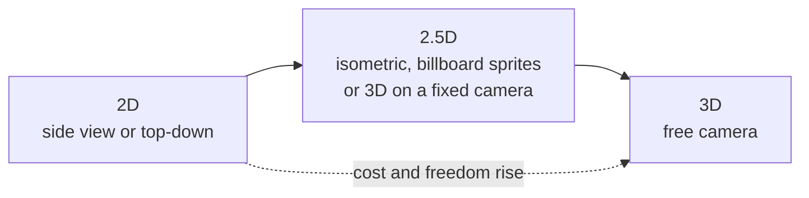

# Module 07: 2D, 2.5D and 3D

- **Goal:** choose the dimension and art style of a game as a design decision: know how 2D, 2.5D and 3D change readability, movement, camera, combat, level design, content cost and feel, and what a browser game changes.
- **Prerequisites:** [06 — Controls, camera and game feel](06-controls-camera-feel.md), [08 — Combat design](08-combat.md), [18 — World and level design](18-world-level.md), [27 — PC, mobile and browser](27-platforms.md).
- **Simulation:** none
- **Facts checked:** October 2026 (prices, rules and product status change; re-check before reuse)

## In short

"2D or 3D?" is often asked as a question about graphics, but it is a question about design. The dimension decides what the player can see (readability), how the hero and enemies move and collide, what the camera does, how attacks are warned, how levels are built, how many assets each feature costs and how animation is made. **2D** is either a side view or a top-down view. **2.5D** mixes the two: an isometric or fixed-angle view, 2D sprites placed in a 3D space, or 3D models seen by a fixed camera. **3D** gives a free camera and the most expressive space at the highest cost. **Art style** (pixel art, hand-drawn, stylised 3D, realistic) is a separate choice that sets both mood and workload. A **browser** game adds its own limits: instant start, small downloads, mixed inputs and short sessions. The worked example confirms the course game's choice (3D models on a fixed tilted camera) and shows what each alternative would change.

## 1. The concept

### 1.1 Terms

| Term | Meaning |
|---|---|
| **Dimension** | How many axes the game space has for the player: two (a flat plane) or three (width, depth, height) |
| **Side view** | A 2D camera looking at the scene from the side; the hero moves left and right and jumps |
| **Top-down** | A 2D or tilted camera looking down on the scene; the hero moves in any ground direction |
| **Isometric** | A fixed camera angle (classically about 30° from the horizontal, with the view turned 45°) that shows three faces of every object with no perspective shrinking |
| **2.5D** | Any mix: 2D gameplay with 3D visuals, 3D space with 2D sprites, or a 3D game on a fixed camera |
| **Sprite** | A flat image, or a frame of a flat animation |
| **Billboard** | A sprite that always turns to face the camera while sitting in a 3D scene |
| **Voxel** | A cube-like unit of volume; "voxel art" looks like chunky 3D pixels |
| **Pixel art** | Art drawn on a low-resolution grid where each pixel is deliberate |
| **Rig and skeleton** | The bone structure used to animate a 3D model; 2D can also use rigs (cut-out animation) |
| **Draw call and overdraw** | Two common performance costs: how many separate drawing commands the game sends, and how often the same pixel is painted over |
| **Z-order (depth sorting)** | Deciding which sprite is drawn in front of which; a classic source of 2.5D bugs |
| **LOD (level of detail)** | A cheaper version of a 3D model shown at a distance |

### 1.2 The dimension map

Cost and freedom both rise to the right. The designer's job is to buy only the freedom the game's core loop uses.

## 2. The player's view

The player does not think "dimension". They notice:

| What they feel | What causes it |
|---|---|
| "I can see what is about to hit me" | Readable silhouettes, a clear view of the ground, telegraphs that are not hidden by the camera |
| "The hero moves exactly where I mean" | Movement rules fit the view: a side view needs jumping, a top-down view needs a ground plane |
| "The world looks like a place" | Depth, lighting and scale; stronger in 3D |
| "It has a style I recognise" | The art style, which can matter more than the dimension |
| "It starts fast and runs well" | Download size and performance, especially on browsers and phones |

Style serves the aesthetics (module 01). Pixel art delivers Fantasy and nostalgia and keeps Challenge readable; a lit 3D world delivers Sensation and Discovery.

## 3. The design space

### 3.1 The views

| View | Dimension | Typical games | Movement | Camera | Strength | Weakness |
|---|---|---|---|---|---|---|
| **Side view** | 2D | Platformers, brawlers, side-scrolling action RPGs | Left, right, jump; gravity | Scrolls with the hero | Precise, readable, cheap | Narrow space; few directions for enemies |
| **Top-down** | 2D | Arcade shooters, classic action RPGs | Any direction on the plane | Fixed above | Wide space, easy aiming | Characters look flat from above; vertical space needs tricks |
| **Isometric** | 2.5D | Classic action RPGs and tactics | Any ground direction | Fixed angle | Depth cue with a fixed camera | Objects hide others; clicks are ambiguous |
| **2D sprites in a 3D world** | 2.5D | Games with hand-drawn characters in 3D scenes | Free in 3D | Fixed or limited rotation | 2D art quality with 3D lighting | Sprites look wrong from other angles |
| **3D models, fixed camera** | 2.5D | Online action RPGs, many mobile games | Ground plane, optional height | Fixed rotation, possibly zoom | Full 3D art and animation with a controlled view | Some 3D cost; camera cannot show behind walls |
| **3D, free camera** | 3D | Open-world RPGs, third-person action | Full 3D | Player controlled | Maximum immersion and freedom | Highest cost; occlusion, lock-on and camera problems |

### 3.2 What the dimension changes

#### Readability

Readability is the ability to tell friend, foe and danger apart at a glance (modules 08 and 12).

- **2D** gives the designer total control: every sprite is drawn to be read. Silhouettes, colour and outlines are deliberate.
- **Fixed-camera 3D** keeps most of that control: the angle is known, so telegraphs on the ground, outlines and sizes can be tuned once.
- **Free-camera 3D** loses it: the camera can end up behind a pillar, in a wall or looking at the sky, and enemies are seen from every angle. Lock-on, camera collision and auto-framing are needed, and still some deaths come from "I could not see it".

#### Movement and collision

- **2D** collision is simple: rectangles and circles, often on a pixel grid. Behaviour is predictable and cheap, so exact, tight controls are common (platformers rely on this).
- **3D** collision needs volumes, slopes, steps and a rule for height. Hits can pass through thin objects at high speed unless handled. Climbing, gliding and swimming are new systems.
- **Ground-plane 3D** (fixed camera) is a good middle: movement is 2D on a flat plane, with height only as decoration or as a jump.

#### Camera (see module 06)

| Dimension | Camera work |
|---|---|
| 2D side view | Scrolling and look-ahead; trivial |
| 2D top-down, isometric | Fixed; follow the hero, optional zoom |
| 3D fixed rotation | Follow, zoom, occlusion fade (make walls transparent) |
| 3D free | Orbit, collision, auto-recentre, lock-on, motion sickness limits, a camera-sensitivity setting; a large design and tuning task |

Free cameras also change controls: on a touch screen, one finger moves and another must rotate the view, which uses a lot of the screen (module 06).

#### Combat and telegraphs

Telegraphs (module 12) are shapes on the ground: circles, cones, lines. They are easy to draw in 2D and in fixed-camera 3D, where the ground is always visible. In free-camera 3D they can be hidden by the hero or by terrain, so they need extra cues (sound, a bright rim, a UI warning). Side-view games warn with the animation itself and use vertical lanes, which suits fast reaction but gives enemies few ways to surround the hero.

Projectile aiming, area skills and positioning all work in the plane in 2D and fixed 3D; vertical aiming (shooting upward at a flying enemy) is an extra rule that free 3D needs.

#### Level design (see module 18)

| Dimension | Level design implication |
|---|---|
| 2D side view | Levels are paths and rhythms; hand-built; a screen is a unit of design |
| 2D top-down / isometric | Rooms and corridors on a grid; easy to greybox and to generate |
| 3D fixed camera | Same as above with more variety of height and sightlines; must keep the hero visible behind objects |
| 3D free | Space with verticality, landmarks that work from any direction; far more art and test time; open-world pacing needs density planning (module 18) |

#### Content cost per asset

| Asset | 2D (pixel or hand-drawn) | 2.5D | 3D |
|---|---|---|---|
| Character | Sprite sheets; many frames per animation; one angle (or a few) | Sprites per direction or a 3D model | Model, rig, textures, animation set; reusable across angles |
| Animation | Frame by frame (labour grows with frame count and directions) or skeletal | Mixed | Skeletal; clips can be reused across characters (retargeting) |
| Environment | Tiles, painted backgrounds | Tiles or modular 3D | Modular 3D kit, lighting, collision meshes |
| Effects | Sprite effects | Both | Particles, shaders |
| Variations (new class, new armour) | A new sprite set | A new sprite set or model | New mesh or material, can share the rig |

Rules of thumb: 2D saves time on environments and effects, but each direction of each animation needs drawing; 3D has a high entry cost (tools, pipeline, rigging) and a lower marginal cost once a pipeline exists, mostly because a model can be re-lit, re-angled and re-used. Pixel art keeps frames small but requires fine craft and a consistent grid.

#### Animation load

A 2D character facing eight directions with ten actions at six frames each is 480 frames. A 3D character needs the ten animation clips once, then plays them from any angle. In 2D, mirroring and cut-out rigs cut the cost; in 3D, retargeting and motion capture cut it. The animation load is also a **feel** load (module 06): wind-up, hit-stop and recovery have to be readable frame by frame.

#### Feel

2D allows the sharpest feel: fixed frames, exact hitboxes, a 1-pixel precision. 3D feel depends on camera, physics and animation blending; it can feel heavier and more immersive but takes more tuning to reach the same crispness.

### 3.3 Art styles as design choices

| Style | What it gives the designer | Watch out for |
|---|---|---|
| **Pixel art** | Strong readability at small sizes; nostalgia; cheap frames | Fine detail is expensive in human time; scaling to many resolutions needs integer scaling |
| **Hand-drawn 2D** | Unique look, expressive animation | Very expensive per frame; hard to add content later |
| **Vector or cut-out 2D** | Cheap animation by rig; scales cleanly | Can look flat; style limits |
| **Stylised 3D** (low-poly, cel-shaded) | Cheaper than realistic; ages well; reads clearly | Needs art direction to look intentional |
| **Realistic 3D** | Sensation, immersion | Highest cost, heavy hardware, uncanny problems |
| **Voxel** | Easy to build and destroy; recognisable | A distinct style players may or may not like |

A useful rule: **pick the style the team can make consistently for the whole life of the game.** A consistent simple style beats an inconsistent ambitious one.

### 3.4 What a browser (web) game changes

A browser game is run in a web page using standard web technology; it is a platform decision that has design consequences (module 27).

| Area | What changes |
|---|---|
| **Instant start** | No install: a link opens the game. The first minute can begin in seconds, which is a strong funnel advantage (module 26) |
| **Download size** | Every megabyte delays that start. Budgets of a few megabytes for the first screen are common; assets stream in later. Pixel art, small atlases and procedural content fit well; large 3D worlds are harder |
| **Input** | Mouse and keyboard on desktop, touch on phones; both must be supported or the game picks one. Browsers limit some key shortcuts and the cursor lock |
| **Session length** | Players expect short, resumable sessions; closing a tab is easy, so save progress often and make the first reward fast |
| **Performance limits** | Less memory and no guaranteed graphics hardware access on low-end devices; modern browsers expose GPU graphics and compute APIs, but support differs across devices (as of October 2026, check a compatibility table before relying on a feature). Draw calls, texture size and garbage-collection pauses matter more |
| **Audio** | Browsers usually block sound until the player interacts first; the first click or tap must unlock audio |
| **Updates** | Instant, no store review: a design advantage for live balancing (module 29) |
| **Monetization** | Usually web payments or ads; platform rules differ from app stores (module 17) |

Practical effect on dimension: browser games lean toward **2D and 2.5D** with small assets, and many successful browser games are simple loops. Fixed-camera 3D with low-poly assets is possible. Large open 3D worlds with free cameras are possible but need streaming and a strong performance budget.

### 3.5 How to choose

| Question | If yes, lean toward |
|---|---|
| Does the core loop need precise jumping or timing? | 2D side view |
| Does it need wide arenas and many enemies readable at once? | Top-down 2D or 3D on a fixed camera |
| Do you want players to explore vertical, open space? | 3D free camera |
| Is the team under 5 people? | 2D or a small 2.5D with a strict style guide |
| Does the game need many characters and costume variants? | 3D (reusable rig) or modular 2D |
| Is the first-minute and install friction critical? | Browser: 2D, 2.5D, small 3D |
| Is the game played on phones with one thumb? | Fixed camera; avoid free camera |
| Is there a distinctive visual identity to protect? | The style you can produce for years |

## 4. Tuning and pitfalls

**How to set the numbers.**

- **Budgets before art.** Set a frame-time target (for example, 16.7 ms for 60 fps), a memory target and a first-load size, and tell artists the limits in numbers (triangles per character, texture sizes, frames per animation).
- **Readability test.** Show a screenshot for one second to a tester and ask them to point at the hero, the enemy and the danger. Repeat on the smallest device.
- **Greybox first** (module 18): test movement and camera with grey shapes before art.
- **Asset cost sheet.** Time per character, per animation set, per environment piece. Multiply by the content plan (module 29).

**Signals it is wrong.**

- Testers lose track of the hero in crowds.
- A third of deaths are described as "I did not see it" (module 28).
- Artists cannot keep up with the content plan; the style is drifting between assets.
- Frame time spikes in group fights on the lowest target device.
- Camera complaints on touch (motion sickness, wrong angles).

**Classic failures.**

| Failure | Result | Fix |
|---|---|---|
| **3D by default** | The team pays for free-camera 3D and uses a fixed camera | Choose fixed-camera 3D or 2D until the core loop needs more |
| **2D with too many directions** | Animation load explodes | Mirror, limit directions, use cut-out rigs |
| **Sprites in 3D that look wrong at an angle** | Billboards show the same face from all sides | Limit the camera angle or use 3D models |
| **Style drift** | Different artists, different looks | A style guide with reference sheets and a palette |
| **Realism trap** | Cost and hardware needs outgrow the team | Stylise |
| **Ignoring the small screen** | Details too small to read on a phone | Test silhouettes at the smallest size |
| **Browser bloat** | First load takes a minute | Budget the first screen; stream the rest |

## 5. Worked example

### 5.1 The course game's decision

The course game's control module fixed the camera as a **fixed-rotation, tilted top-down view at about 55°**, with a 10–16 m zoom, following the hero (module 06). Its platforms are PC and touch (module 27). This module records the dimension and style decision that goes with it.

| Question | Decision |
|---|---|
| **Dimension** | 2.5D in the "3D models, fixed camera" sense: 3D characters and environments, a fixed-rotation camera, gameplay on the ground plane |
| **Style** | Stylised 3D with simple shapes, strong silhouettes and a limited palette per region. Danger colours are reserved (module 10). Not realistic |
| **Why** | Pillar 2 ("fights you can read") needs a camera that always shows the ground; pillar 1 needs five classes with many skills and costume variants, which a reusable 3D rig handles; a small team can keep a stylised look consistent |
| **Movement** | Direct movement on a ground plane; jump is not a combat tool; a height difference is decoration or a ramp |
| **Occlusion** | Walls and tall props between camera and hero fade to 30% opacity; enemies and telegraphs are never hidden |
| **Budgets (invented)** | Hero at most 15,000 triangles; trash enemy at most 6,000; at most 40 animated characters on screen; draw-call budget set per quality tier (module 27) |
| **Art cost sheet (invented)** | New enemy 8 days; new class set with skills 40 days; new environment kit 25 days; costume variant 4 days on an existing rig |
| **Browser** | The game does not target browsers at launch (module 27); if it did, the first load would stay under 20 MB with streaming and the quality tier would start on "low" |

### 5.2 What each alternative would change

| Alternative | What it would change | What would break or improve |
|---|---|---|
| **2D top-down, pixel art** | Replace models by sprite sheets; five classes at eight directions and ten actions each is thousands of frames; the budget moves from rigs to frame counts. Telegraphs become simpler and exact | **Improves:** cost of environments, readability at small size, browser start. **Breaks:** costume variants multiply the sprite work; visual spectacle for bosses is harder |
| **2D side view** | Combat moves to lanes; the dodge becomes a roll or jump; parties overlap on one plane; the world is a series of levels instead of fields | Pillar 3 (grouping) is harder to show; world design becomes linear |
| **3D with a free camera** | Orbit camera, lock-on, camera collision, vertical enemies; movement and aim on touch need two thumbs for movement and camera | **Improves:** immersion and exploration. **Breaks:** telegraph readability (pillar 2), phone controls, content cost |
| **Isometric sprites** | A fixed 30° angle; a pixel look; depth sorting issues | Good for a small-team classic look; heavy art for a large class roster |
| **Realistic 3D** | Higher poly counts and texture memory; hardware floor rises | Fails the "PC integrated graphics at 60 fps and a three-year-old phone at 30 fps" target in module 27 |

### 5.3 What was cut

- A free camera (no player orbit; a small camera tilt option only for accessibility is left open).
- A realistic art style.
- Hand-drawn animation.
- A side-scrolling mode.

### 5.4 For another kind of game

A small classic-style platformer would pick 2D side view with pixel art, a tiny palette and a one-screen camera, spend its budget on feel (module 06) and level rhythm (module 18), and ship in a browser with a first load of a few megabytes. An open-world action RPG would pick a free-camera 3D with climbing and gliding and spend its budget on streaming, density and traversal (module 18, open worlds).

## Key takeaways

- Dimension and art style are design decisions: they change readability, movement, camera, telegraphs, level design, content cost and feel.
- 2D gives control and low cost per asset; 3D gives reuse and spatial freedom at higher cost; 2.5D covers many mixes, among them 3D models on a fixed camera.
- A free camera is the most expensive freedom. Buy it only when the core loop needs it.
- Pick an art style the team can keep consistent for the life of the game; stylised beats realistic for small teams.
- A browser game starts instantly but must budget download size, input, audio unlock and performance from the start.
- Write budgets (frame time, memory, first load, triangles, frames) as numbers before art starts.
- The course game uses stylised 3D on a fixed tilted camera because pillar 2 needs the ground always visible.

## Further reading

- Isometric video game graphics: https://en.wikipedia.org/wiki/Isometric_video_game_graphics
- 2.5D overview: https://en.wikipedia.org/wiki/2.5D
- Pixel art overview: https://en.wikipedia.org/wiki/Pixel_art
- Steve Swink, *Game Feel* (2008), overview: https://en.wikipedia.org/wiki/Game_feel
- MDN Web Docs, "Games" (techniques for web games, performance, audio): https://developer.mozilla.org/en-US/docs/Games
- MDN Web Docs, "Web audio best practices" (autoplay policy): https://developer.mozilla.org/en-US/docs/Web/Media/Guides/Autoplay
- Web.dev, "Performance" guides: https://web.dev/learn/performance
- Mark Brown, "Game Maker's Toolkit" (video series on camera and design): https://www.youtube.com/@GMTK
