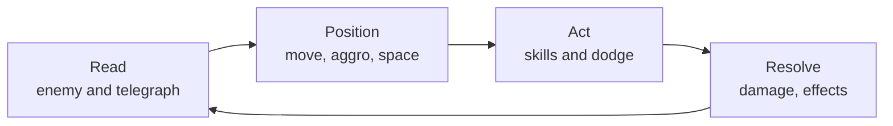
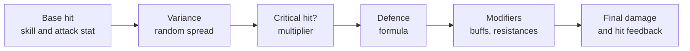

# Module 08: Combat design

- **Goal:** choose a combat model, make fights readable, set time-to-kill targets, pick a damage formula, define roles, aggro and crowd control, and pace encounters, then check the numbers with a simulation before players see them.
- **Prerequisites:** [03 — Vision, pillars and loops](03-vision-pillars-loops.md), [06 — Controls, camera and game feel](06-controls-camera-feel.md).
- **Simulation:** `examples/08-ttk/` (`dotnet test examples/08-ttk`)
- **Facts checked:** October 2026 (prices, rules and product status change; re-check before reuse)

## In short

Combat is the rules and numbers that decide what a fight asks of the player. The first choice is the **model**: tab-target, action, a hybrid, or turn-based and auto-battle. The second is **readability**: the player must be able to see what is about to hit them. The third is **numbers**: **time-to-kill (TTK)** is how long the player needs to defeat an enemy, **time-to-die (TTD)** is how long the player survives, and the ratio between them is the difficulty. A **damage formula** turns attack and defence into damage, and the formula you pick decides which classes and stats are strong. Roles, aggro and crowd control decide who does what in a group. The worked example fixes the course game's combat model and TTK targets, then checks them with a small C# simulation.

## 1. The concept

### 1.1 What a combat model is

A **combat model** is the set of rules that defines one fight: how the player picks targets, how skills hit, what the enemy does, how damage and defence work, and how a fight ends. It sits between the controls ([module 06](06-controls-camera-feel.md)) and the skills ([module 10](10-skills.md)).

The **combat loop** inside the core loop of [module 03](03-vision-pillars-loops.md) is short:



### 1.2 Terms used in this module

| Term | Meaning |
|---|---|
| **HP** | Health points: damage an actor can take before defeat. |
| **DPS** | Damage per second: the average damage rate. A designer's shorthand for offence. |
| **Burst** | A large amount of damage in a short window, usually from cooldown skills. |
| **Sustain** | The ability to stay alive through healing, shields or mitigation. |
| **TTK** | Time-to-kill: seconds for a group (one player or a party) to defeat an enemy. Written TTK(enemy, group). |
| **TTD** | Time-to-die: seconds a hero survives if every enemy attack lands, with no dodging and no healing. |
| **Telegraph** | A visible warning before an attack lands (a ground marker, a cast bar, an animation tell, a sound). |
| **Aggro / threat** | The rule that decides which player an enemy attacks. Threat is a number that grows with damage, healing or taunts. |
| **Crowd control (CC)** | Effects that limit actions instead of dealing damage: stun, root (cannot move), silence (cannot use skills), slow, knockback. |
| **Diminishing returns (DR)** | Each repeated CC on the same target lasts shorter, until the target is immune for a while. |
| **Role** | A job in a group: the one who takes hits (tank), heals and supports (healer), or deals damage (damage). |
| **Pull** | Engaging a group of enemies; one "pull" is one fight. |

### 1.3 The damage pipeline

Most RPGs resolve one hit as a chain of small steps. The order matters for balance:



Each step is a place where designers can tune, and where a bug or an exploit can hide. The simulation of this module models steps A to D.

## 2. The player's view

Good combat gives a rhythm of **tension and release**. The player is surprised by a pack, reads the telegraphs, uses skills, wins, and gets a small reward. Over a session the tension goes up (an elite, then a boss) and comes down (loot, a quiet walk).

What the player should feel in the course game:

| Fight | Feeling | Motivation ([module 01](01-player-experience.md)) |
|---|---|---|
| **Trash pack** | "I am strong; this takes a few seconds" | Power, Excitement |
| **Elite** | "I must pay attention to survive" | Challenge |
| **Boss** | "I must learn the fight, and my group matters" | Challenge, Community |
| **Group fight** | "My role matters, and we win faster together" | Community, Strategy |

Two pillars of the course game govern the whole module: **Fights you can read** (every dangerous attack is telegraphed; a skilled player can avoid it) and **Stronger together** (groups earn better rewards per hour, solo is never blocked).

## 3. The design space

### 3.1 Combat models

| Model | How a fight plays | Used by (visible in play) | Strengths | Costs |
|---|---|---|---|---|
| **Tab-target** | Select a target; skills hit the selection; fights are about cooldown order and positioning; usually a global cooldown | World of Warcraft, Final Fantasy XIV | Tolerates latency and low precision; many skills; works for large raids | Aim is not a skill; fights can become a rotation; needs strong enemy mechanics to stay engaging |
| **Action** | The player aims, moves and dodges in real time; hits depend on position | Dark Souls, Black Desert, Genshin Impact | Skill-driven and exciting; strong "feel" | Needs low latency and a good camera; hard to balance with many classes; hard on touch |
| **Hybrid** | A mix: soft target, dodge, ground-aimed skills | Guild Wars 2 (a selected or nearest target, with free movement and dodging) | Good compromise for online RPGs; touch-friendly with aim assist | More design effort; needs clear rules for what is aimed and what is selected |
| **Turn-based** | The game waits for each choice | Classic Final Fantasy, Fire Emblem | Time to think; no latency pressure; ideal for deep tactics | Slow pace; poor fit for real-time online groups |
| **Auto-battle** | The game plays the fight; the player sets up the team and triggers a few skills | Many mobile hero-collection games, for example AFK Arena | Fits short phone sessions; fewer inputs | The fun moves to team building; little moment-to-moment skill |

Most online RPGs sit on a line between **tab-target** and **action**. The course game uses the **hybrid** model with action-style dodging.

### 3.2 Readability and telegraphs

**Readability** is whether the player can tell, fast enough to react, who is attacking, what is about to hit them, and what just happened. It is a combat-design concern, not polish: an unreadable fight cannot be played skillfully.

Common **telegraph** types:

| Type | Example | Best for |
|---|---|---|
| **Ground marker** | A red circle, cone or line that fills over time | Area attacks; seen in Guild Wars 2 and Final Fantasy XIV |
| **Animation tell** | The enemy raises a weapon, rears back | Single-target or melee hits; learned by sight |
| **Cast bar** | A bar over the enemy's head | Interruptible spells |
| **Sound cue** | A distinct sound before a heavy hit | Backup for a screen full of effects |
| **Status icon** | A debuff icon on the player | Delayed effects such as a bomb |

Rules of thumb for good telegraphs:

1. **The warning must outlast the player's reaction time.** A trained player reacts in about 0.25–0.35 s; a new player needs more. A common starting point is **at least 0.8 s for common attacks** and **1.2–2 s for heavy attacks** (a design assumption to playtest).
2. **Consistency beats surprise.** The same shape and colour always mean the same thing (for example, red = enemy damage, blue = safe, yellow = help).
3. **Telegraphs outrank effects.** Player skill effects must never cover a telegraph; keep a visual budget (see [module 06](06-controls-camera-feel.md)).
4. **Fair means avoidable.** Every attack that can kill must be both visible beforehand and avoidable by movement, a dodge or a role action.
5. **One-shot mechanics need a warning that cannot be missed**, such as a large marker plus sound.
6. **Group fights multiply the clutter.** Four players' effects plus an enemy: test readability with a full party, not one hero.

Players often install add-ons to read a fight better. That is a signal that the built-in telegraphs are not enough: in large raids the community builds timers and warnings (for example, boss-timer add-ons in World of Warcraft). A design that needs such tools has failed pillar 2.

### 3.3 Time-to-kill and time-to-die

For one hero against one enemy, the spreadsheet formula is:

```
expected TTK = enemy HP / hero damage per second
damage per second = expected damage per swing / attack interval
```

For a party, divide by the **sum** of the members' damage per second. TTD is the mirror image: hero HP divided by enemy damage per second after defence.

Why designers use both:

| Ratio | Meaning |
|---|---|
| **TTK much shorter than TTD** | The player wins comfortably (trash) |
| **TTK about equal to TTD** | The player wins only by avoiding some damage (elite) |
| **TTK longer than TTD** | The player *must* avoid, heal or use CC; otherwise they lose (boss) |

A handy derived number is **required avoidance** = 1 - TTD / TTK, limited to 0–100%: the share of enemy damage the player must dodge, block or heal to win. Required avoidance of 0% means the player can win by standing still; 90% means one hit in ten may land. It is not a prediction of skill; it is a way to compare fights.

Why TTK matters beyond difficulty:

- **Short TTK on trash** supports the Power fantasy and keeps the core loop (30–90 s) fast.
- **Long TTK on bosses** gives room for mechanics, but too long becomes boring; players tolerate long fights only if the fight keeps changing.
- **TTK scales with gear and level.** If damage grows faster than enemy HP, TTK collapses toward zero and fights become irrelevant (see 4.3).

### 3.4 Damage formulas from a design view

A **damage formula** takes the attacker's hit and the defender's defence and gives damage. The two common families:

| Formula | Rule | Behaviour |
|---|---|---|
| **Subtractive** | damage = hit - defence (with a minimum) | Simple to read; defence is "worth" the same at any hit size; many small hits are crushed by high defence; needs a floor so damage never reaches 0 |
| **Ratio (percentage reduction)** | damage = hit x K / (K + defence) | Defence is a percentage; never reaches 100% reduction; works the same for small and large hits; the constant K sets how fast defence pays off |
| **Hybrid** | A ratio, then a flat reduction | More tuning knobs, harder to explain |
| **Flat percentage** | Each point of armour removes a fixed percentage up to a cap | Easy to display; the cap becomes a stat to chase |

Two public examples of the ratio family (check the pages for the current values): the game-guide pages for World of Warcraft armour (damage reduction = armour / (armour + a level-based constant); the page marks the older formula as outdated) and for Dota 2 armour (a multiplier of 1 - 0.06 x armour / (1 + 0.06 x armour) for positive armour). Both are listed in Further reading.

Worked example with numbers. Take a hit of 100 raw damage and enemy defence of 50:

| Model | Result | Comment |
|---|---|---|
| Subtractive | 100 - 50 = 50 damage | A 60-damage hit under the same defence: 10 damage |
| Ratio with K = 100 | 100 x 100 / (100 + 50) = 66.7 damage | A 60-damage hit under the same defence: 40 damage |

Under the subtractive formula, defence takes 50 off *every* hit, so small hits suffer far more (the 60-damage hit loses 83%, the 100-damage hit loses 50%). Under the ratio formula, both lose a third. That is the key design difference: **a subtractive formula favours big, slow hits and punishes fast, small ones; a ratio formula is neutral to hit size.** In the simulation below, switching the course game from ratio to subtractive makes the Duelist (many small hits) the first class to fall out of its band.

**Variance** is a random spread on the raw hit (for example, plus or minus 10%). It makes combat feel less mechanical, with no change to the average. High variance makes fights less predictable: a rule of thumb is to keep it under 15% for regular combat and to avoid it on bosses.

**Critical hits** multiply damage on a chance. The expected multiplier of a swing is 1 + chance x (multiplier - 1): at a 25% chance and x1.75, it is 1.1875. Crits make damage numbers exciting but add variance: a class that lives on crits has more spread in its TTK than one that does not.

Other formula questions a designer must answer:

| Question | Typical options |
|---|---|
| Does a hit always land? | Always-hit (simple, preferred in action combat) or a hit-chance stat |
| Is there a damage floor? | A minimum percentage of the raw hit, so defence never makes an enemy immune |
| Are there damage types? | Physical and magical (more defence stats to display and tune) |
| Is there a cap on defence or crit? | Prevents impossible builds; makes stacking stop paying |

### 3.5 Roles and aggro

Many online RPGs use the **role trinity**: tank (takes hits), healer and damage. It is easy to explain and gives each player a clear job; it needs enough players to fill the roles (module 09 and 22). Some games avoid fixed roles and make everyone dodge, heal themselves and support (Guild Wars 2 is a visible example of a game without a dedicated threat system and with flexible roles). The choice of model for aggro depends on this.

| Aggro model | Rule | Used by | Strengths | Costs |
|---|---|---|---|---|
| **Threat table** | Each enemy keeps a number per player; it attacks the highest | World of Warcraft, Final Fantasy XIV (enmity) | Tanks have a real job; predictable | Needs taunts, a threat display, and teaches threat management |
| **Proximity or last-hit** | The enemy attacks the nearest or the last attacker | Many action RPGs | Simple; no UI | Tanks cannot protect others; dodging decides |
| **Role-weighted AI** | The enemy chooses targets by AI rules per role | Many action games | Flexible | Less predictable; hard to explain |

Why aggro matters for groups: the **target of the enemy's attacks** decides who needs to dodge or heal. A boss that retargets randomly forces everyone to read; a boss that stays on the tank lets the other players focus on offence.

### 3.6 Crowd control and diminishing returns

CC is powerful because defence does not reduce it. It needs rules that stop it from becoming a lock.

| Guardrail | How it works | Visible example |
|---|---|---|
| **Diminishing returns** | A repeated CC on the same target lasts shorter, then the target is immune for a while | World of Warcraft PvP: the second application is reduced by 50%, the third by 75%, then the target is immune for 18 seconds (as stated on the game wiki, October 2026) |
| **CC immunity window** | After CC ends, the target cannot be CC'd for a short time | Common in action RPGs |
| **Boss resistance bar** | The boss ignores normal CC but has a bar that CC fills; when full, the boss is stunned | Guild Wars 2: the defiance bar (the game wiki describes it) |
| **CC shorter on elites and bosses** | Duration multiplier by enemy tier | Common |

Rules of thumb: a **stun** is the strongest effect and must be the shortest and rarest; **slow** and **root** can be longer; the more a CC is a "free win", the stricter its guardrails. Any CC that removes the player's control (for example, stun on the player) must be telegraphed and short in PvE, and nearly absent in PvP unless the opponent has an answer.

### 3.7 Encounter pacing

A **pacing plan** decides what the player meets and in what order so that tension rises and falls.

| Tool | Effect |
|---|---|
| **Pack size and mix** | Few enemies of one kind are easy; mixes (a caster behind a melee) test priorities |
| **Elite placement** | An elite after two or three packs gives a peak; two elites in a row become tiring |
| **Rest beats** | Walking, a safe corner, a treasure; players recover mentally and resource-wise |
| **Boss as a finale** | One boss at the end of a dungeon; a "mid-boss" for variety |
| **Fight share** | Fraction of play time spent in combat: 30–40% is a common target for a dungeon, lower for a field |

The numeric version (how many packs, how long each fight lasts) is the **TTK plan** below; the content side is module 12.

### 3.8 How to choose

| If your game... | Prefer |
|---|---|
| Is played on phone and PC with the same character | Hybrid combat with a soft target, aim assist and a dodge |
| Has raids of dozens of players | Tab-target or hybrid with a threat table and large telegraphs |
| Sells itself on skill and feel | Action combat; accept the latency and camera costs |
| Has sessions under 10 minutes | Short TTK, auto-target and optional auto-battle |
| Expects heavy PvP | A formula that is easy to read, hard CC guardrails and no hidden randomness |
| Must work with few players | Flexible roles with self-sustain, not a strict trinity |
| Wants build diversity | A ratio formula so small-hit and large-hit builds are equal |

## 4. Tuning and pitfalls

### 4.1 Setting TTK targets

Start from the **fight length you want**, then derive HP from it. Do not start from HP.

| Enemy type | Role in the loop | Solo TTK to start from | Party TTK to start from |
|---|---|---|---|
| **Trash pack** (3–5 enemies) | Core loop, 30–90 s | 10–20 s | 5–10 s |
| **Elite** | Spike inside a session | 45–90 s | 30–50 s |
| **Boss** (a dungeon boss) | End of a session loop | 170–260 s | 100–160 s |

These are rules of thumb to playtest, not laws. They fit a game where trash is a fast core loop and the boss is a group event.

Steps:

1. **Choose the target TTK band** for each enemy type and group size.
2. **Pick the class DPS** (module 09 and 10). A class does not need equal DPS: tanks and healers may be lower, but the ratio between the weakest and the strongest solo class should stay under about 1.5.
3. **Compute enemy HP** = target TTK x party DPS (the average of the classes at the level).
4. **Scale for group size.** If every player's DPS adds up and enemy HP does not rise, groups kill much faster than solo. To keep "stronger together" without trivialising content, enemy HP in a party is multiplied by a **party HP scale** below the party size (the course game uses 2.5 for four players).
5. **Check TTD.** Compute the required avoidance for each fight; make sure trash needs none and bosses demand avoidance but not perfection.
6. **Simulate**, then playtest.

The party HP scale decides the value of grouping. With a scale of 1.0, a party of four would kill about three to four times faster than a solo player, and a party member would be bored; with a scale of 4.0, a party is no faster than a solo hero, and there is no reason to group. The simulation shows this in 5.5.

### 4.2 Signals that something is wrong

| Observation | Likely problem |
|---|---|
| Players kill everything without using skills | TTK too short or damage too high for the content level |
| Players use consumables on trash | Trash TTD is too short; enemies hit too hard |
| One class is never chosen for solo | Its solo TTK is far above the others |
| Groups do not form | Party TTK is close to solo TTK; the party HP scale is too high |
| Wipes on the first boss mechanic | Telegraph too short or not visible; required avoidance too high |
| Players quit during a long boss | TTK too long, or the fight does not change |
| The healer is idle on trash and overworked on the boss | Healing is tuned for the boss only; add a use on trash |
| Defence stat "does nothing" | The formula's constant is wrong for the stat range |
| Players share "stack crit" builds | Crit is too strong relative to other stats |

### 4.3 Classic failures of a long-running game

- **Power creep in damage.** Each season adds more damage than enemy HP. TTK collapses; old content is trivial. Fix: tune from TTK, not from raw numbers.
- **HP-sponge bosses.** To keep up with power, designers add HP, so fights get longer without being deeper. Add mechanics or phases (module 12), not HP.
- **A defence stat that scales badly.** A subtractive formula with no cap makes enemies unhittable at the high end; a ratio formula with a small K makes defence worthless.
- **CC chains.** Players stack stuns to remove an enemy from the fight. DR and boss resistance bars are the standard fix.
- **A forced trinity.** If the content cannot be cleared without a healer, groups wait for one; pillar 3 fails when grouping is a queue.
- **One-shot mechanics that are not telegraphed.** Players learn through death, which feels unfair. Always warn.
- **Balance by anecdote.** Without a simulation or data, every nerf is an argument. See module 25.

### 4.4 Connecting formulas to a simulation

A spreadsheet answers "what is the average?". A simulation answers "how often is this outlier?" and "what happens when I change the formula?". It also catches rules that a closed form ignores, such as a damage floor interacting with variance. The next section shows a tiny one.

## 5. Worked example

The course game: a small online fantasy RPG for PC and mobile, one hero per player, real-time combat, parties of up to four. All numbers are invented.

### 5.1 Combat model

| Decision | Choice |
|---|---|
| **Model** | Hybrid: soft target, ground-aimed area skills, a dodge (module 06) |
| **Hit resolution** | Always-hit; no miss or hit-chance stat |
| **Damage formula** | **Ratio** defence, K = 100; defence = percent reduction |
| **Variance and crits** | Plus or minus 10% variance; each class has a crit chance and a crit multiplier on the raw hit |
| **Roles** | Soft trinity of tank, healer and damage: every class can solo, and the healer is a class, not a requirement |
| **Aggro** | Threat table; see 5.2 |
| **CC** | Stun, root, slow, silence, knockback with diminishing returns; see 5.3 |
| **Telegraphs** | Every dangerous attack is telegraphed and avoidable; the minimum warning grows with the share of a hero's HP the hit removes, and the bands are owned by [module 12](12-enemies-encounters.md) (for example, a hit of 30% of HP needs 1.2 s) |

Why ratio defence: pillar 1 ("my hero, my way") says each class is distinct, and the course game has fast classes (Duelist, Ranger) and slow classes (Arcanist). A ratio formula keeps both viable against every defence value, as the simulation shows.

### 5.2 Aggro rules

| Rule | Value |
|---|---|
| Threat from damage | 1 per point of damage dealt |
| Tank multiplier | Warden damage threat x2.0 |
| Healing | 0.5 threat per point healed, shared among enemies in the fight |
| Taunt | The target switches to the taunter for 4 s, then normal rules resume |
| Re-targeting | Every 2 s; a challenger must exceed the current target's threat by 20% |
| Solo | Aggro is irrelevant; the enemy attacks the hero |

The 20% rule stops a boss from flicking between two players every time the lead changes.

### 5.3 CC rules

| Effect | Base duration | In PvE |
|---|---|---|
| **Stun** | 2.0 s | Elites take half; bosses ignore it |
| **Root** | 3.0 s | Elites take half; bosses ignore it |
| **Slow** | 40% for 4 s | Allowed on all |
| **Silence** | 3.0 s | Elites take half; bosses ignore it |
| **Knockback** | Short move | Bosses ignore it |

Diminishing returns on the same enemy: 100%, then 50%, then 25%, then immune for 6 s. The count resets 15 s after the last CC. **Bosses** carry a **stagger bar**: CC skills fill it instead of stunning; when full, the boss is staggered for 4 s and takes 25% more damage.

### 5.4 The simulation

The simulation `examples/08-ttk/` turns the design into numbers. It models the damage pipeline of 1.3 (base hit, variance, crit, defence), not the whole fight.

**Data file `combat.json`** (all editable):

| Section | Contents |
|---|---|
| `defence` | `model` (`ratio` or `subtractive`), `ratioConstant` (K = 100), `minFraction` (0.2, the subtractive floor) |
| `classes` | Per class: HP, defence, damage per hit (the average swing including skills), attack interval, crit chance, crit multiplier, variance |
| `enemies` | Per archetype: HP, defence, number of attackers, damage per hit, attack interval, and target bands for solo and party TTK |
| `party` and `partyHpScale` | The four classes in the sample party (Warden, Ranger, Arcanist, Cleric) and the HP multiplier for the party (2.5) |

The five sample classes (damage per hit, attack interval, crit chance and multiplier):

| Class | Role | HP | Defence | Damage per hit | Interval | Crit | Crit x |
|---|---|---|---|---|---|---|---|
| Warden | tank | 1,300 | 40 | 38 | 1.0 s | 10% | 1.5 |
| Ranger | damage | 900 | 15 | 30 | 0.8 s | 25% | 1.75 |
| Arcanist | damage (area and control) | 800 | 10 | 70 | 1.75 s | 15% | 2.0 |
| Cleric | healer | 1,000 | 20 | 46 | 1.4 s | 5% | 1.5 |
| Duelist | damage (melee) | 900 | 15 | 22 | 0.6 s | 30% | 1.75 |

The three enemy archetypes:

| Enemy | HP | Defence | Attackers | Damage per hit | Interval | Solo band | Party band |
|---|---|---|---|---|---|---|---|
| Trash pack (4 enemies, total HP) | 480 | 10 | 4 | 30 | 2.0 s | 10–18 s | 6–10 s |
| Elite | 2,200 | 20 | 1 | 110 | 2.5 s | 50–85 s | 30–50 s |
| Boss | 6,500 | 30 | 1 | 160 | 3.0 s | 170–260 s | 100–160 s |

**What the code does.** `Formulas` computes the closed form (expected hit with crits, DPS, expected TTK, TTD, required avoidance). `Simulator` plays the fight many times (2,000 trials, a seeded generator so a run is identical on every machine): each hero swings every attack interval, the swing rolls variance and crit, defence is applied, and the fight ends when the HP is gone. `TtkReport` builds one table row for each class and for the party against each enemy and checks the expected TTK against its band.

**Worked example by hand: Warden against the trash pack.** An average swing is 38 x 0.9 + 57 x 0.1 = 39.9 raw damage (a crit multiplies the raw hit by 1.5, so 57). With K = 100 and enemy defence 10, the ratio is 100 / 110 = 0.909, so 39.9 x 0.909 = 36.27 damage per swing. At one swing per second, DPS = 36.27 and **expected TTK = 480 / 36.27 = 13.2 s**. The simulation, which makes each swing land at the end of its interval, reports about 13.8 s: roughly half an attack interval above the formula, plus a small rounding on the final hit.

**The table the simulation prints (ratio defence, the default design):**

| Enemy | Group | Expected TTK | Simulated mean | Band | In band |
|---|---|---|---|---|---|
| Trash pack | Warden | 13.2 s | 13.8 s | 10–18 s | yes |
| Trash pack | Ranger | 11.9 s | 12.3 s | 10–18 s | yes |
| Trash pack | Arcanist | 11.5 s | 12.4 s | 10–18 s | yes |
| Trash pack | Cleric | 15.7 s | 16.4 s | 10–18 s | yes |
| Trash pack | Duelist | 11.8 s | 12.1 s | 10–18 s | yes |
| Trash pack | Party of four | 8.0 s | 8.7 s | 6–10 s | yes |
| Elite | Warden | 66.2 s | 66.7 s | 50–85 s | yes |
| Elite | Arcanist | 57.4 s | 58.4 s | 50–85 s | yes |
| Elite | Cleric | 78.4 s | 79.1 s | 50–85 s | yes |
| Elite | Party of four | 40.2 s | 40.8 s | 30–50 s | yes |
| Boss | Warden | 211.8 s | 212.2 s | 170–260 s | yes |
| Boss | Arcanist | 183.7 s | 184.8 s | 170–260 s | yes |
| Boss | Cleric | 250.9 s | 251.7 s | 170–260 s | yes |
| Boss | Party of four | 128.7 s | 129.4 s | 100–160 s | yes |

(The Ranger and Duelist rows for the elite and the boss, 59.3 / 58.8 s and 189.8 / 188.1 s, are also in band; the tests assert all 18 rows.)

**Time-to-die and required avoidance (solo, ratio defence):**

| Enemy | Warden TTD | Warden required avoidance | Arcanist TTD | Arcanist required avoidance |
|---|---|---|---|---|
| Trash pack | 30.3 s | 0% | 14.7 s | 0% |
| Elite | 41.4 s | 37% | 20.0 s | 65% |
| Boss | 34.1 s | 84% | 16.5 s | 91% |

Reading it: the Warden can stand in a trash pack and win; against the elite it must avoid about 37% of the damage; against the boss, solo, it must avoid 84% (the boss is a party fight; solo is possible but demanding, which keeps pillar 3's "solo never blocked" honest while rewarding groups). The Arcanist, with fewer HP and less defence, must avoid more.

**Pacing plan for one dungeon (party of four, derived from the table):** 8 packs x 8 s + 2 elites x 40 s + 1 boss x 129 s = 64 + 80 + 129 = 273 s, or about 4.6 minutes of fighting in a 15-minute dungeon: a **30% fight share**, inside the 30–40% target. The rest is travel, loot and rest beats.

### 5.5 Tuning experiments with the simulation

Each of these is a test in `TtkTests.cs`. They show what changing a number does.

| Experiment | Change in `combat.json` | Result |
|---|---|---|
| **Switch to subtractive defence** | `"model": "subtractive"`, same defence numbers | 11 of 18 rows leave their band. The Duelist against the elite goes from 58.8 s to **153.0 s**: its 22-damage hits lose most of their value against 20 defence. The Arcanist (70-damage hits) is the only class still in band against the elite (63.6 s) |
| **Rescale subtractive defence to compensate** | Subtractive, every enemy defence halved | Only the boss row is broken for the Warden (261.0 s), the Cleric (283.0 s) and the Duelist (326.4 s); the Arcanist is still in band (173.7 s). The formula still prefers big hits |
| **Party HP scale 2.5 to 4.0** | `"partyHpScale": 4.0` | Party elite TTK rises from 40.2 s to **64.3 s**, out of the 30–50 s band and **slower than a solo Arcanist** (57.4 s): grouping no longer pays |
| **Formula versus simulation under a damage floor** | Subtractive, default defence | The Warden against the boss: formula **656.6 s**, simulation about 624 s. The damage floor makes damage convex in the roll, so variance helps the player; the spreadsheet does not see it |

The first experiment is the main lesson: **the same stat numbers behave differently under a different formula, and the classes that fall out of balance first are the ones with the smallest hits.** A designer who changes the formula must retune every number.

Run it yourself:

```bash
dotnet test examples/08-ttk
```

The test `Prints_The_Balance_Table` prints the full table (use `--logger "console;verbosity=detailed"` to see it). Edit `combat.json`, run again, and see which rows turn into "NO".

Limits of this simulation: it models damage pipeline and TTK only. It has no movement, no CC, no healing, no enemy death during a pack fight (the pack is one HP pool) and TTD assumes no kills and no dodging. Module 25 builds a bigger one.

### 5.6 What was cut

- **Hit chance and miss.** Always-hit keeps action combat readable.
- **Separate physical and magic defence.** One defence stat in the first release.
- **Threat decay.** Threat resets when the fight ends.
- **Hard CC on bosses.** Bosses use the stagger bar instead.

### 5.7 How the design would differ for another kind of game

| Game | Combat changes |
|---|---|
| **Tab-target raid game** | Global cooldown, threat table with taunts, long telegraphs; TTK for bosses 5–10 minutes with many players |
| **Action-focused solo game** | No threat table or party scaling; subtractive or ratio defence tuned around dodging; TTK on bosses set by number of hits the player must land |
| **Auto-battle hero collection** | TTK is a team-power check before the fight; the formula and ratios still apply but the player sets up instead of aims |
| **Turn-based tactics** | No telegraph timers; "telegraph" is a visible enemy intent; TTK is counted in turns |
| **PvP-first game** | A ratio formula with a hard cap on defence, strict CC rules and no variance |

## Key takeaways

- A combat model is a set of linked choices: target selection, hit resolution, defence formula, roles, aggro and CC. Choose them together, from the pillars.
- Readability is a design rule: every dangerous attack is telegraphed longer than the player's reaction time, and effects never hide the telegraph.
- Set TTK bands first (for example, trash 10–18 s, elite 50–85 s, boss 170–260 s solo) and derive enemy HP from them, not the other way round.
- Subtractive defence punishes small hits; ratio defence is neutral to hit size. Changing the formula means retuning every class.
- Group content stays attractive only if party HP scale is below the party size; at 2.5 for four players the party kills about 30–45% faster than a solo hero, and at 4.0 it kills slower.
- Required avoidance (1 - TTD / TTK) is a simple way to compare how demanding fights are: trash 0%, elite about 35–65%, a solo boss around 85–90%.
- Guardrails make power safe: aggro rules for roles, diminishing returns and boss stagger bars for crowd control, and a pacing plan with rest beats.

## Further reading

- Ian Schreiber, [Game Balance Concepts](https://gamebalanceconcepts.wordpress.com/) (online course) and Ian Schreiber and Brenda Romero, *Game Balance* (CRC Press, 2021): spreadsheets, formulas and balancing method.
- [Diminishing returns (World of Warcraft wiki)](https://warcraft.wiki.gg/wiki/Diminishing_returns): categories, reduction steps and reset timer for crowd control.
- [Armor (World of Warcraft wiki)](https://warcraft.wiki.gg/wiki/Armor): a ratio-style damage-reduction formula; note the page flags the old formula as outdated.
- [Armor (Dota 2 wiki)](https://dota2.fandom.com/wiki/Armor): the 0.06 armour multiplier formula (could not be fetched while checking; open it in a browser).
- [Defiance Break (Guild Wars 2 wiki)](https://wiki.guildwars2.com/wiki/Defiance_Break): how a boss resistance bar works.
- [Relevant combat mechanics for healers (Icy Veins)](https://www.icy-veins.com/ffxiv/healer-combat-mechanics): a player-written explanation of global cooldown and animation lock in Final Fantasy XIV.
- Steve Swink, *Game Feel* (CRC Press, 2008): [summary](https://en.wikipedia.org/wiki/Game_feel), for how combat feedback ties into the controls.
