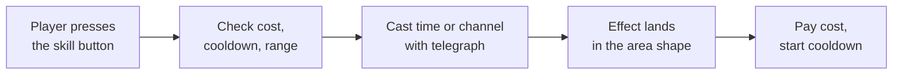
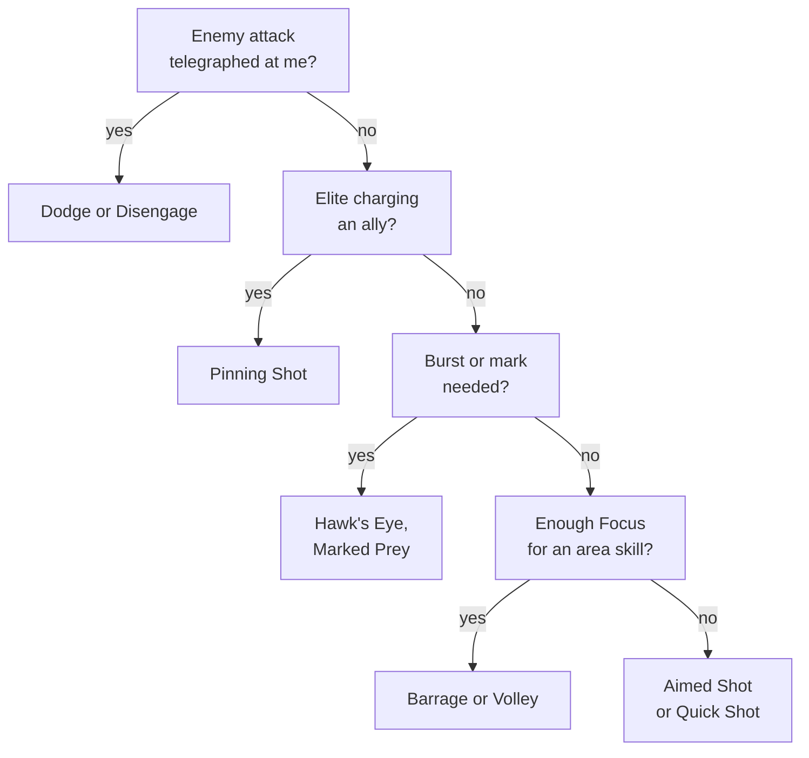

# Module 08: Skills and abilities

- **Goal:** design a class's skill kit: choose its resource, set cooldowns and costs, define status effects and crowd control with sane stacking rules, decide how many skills each role needs, and adapt the kit to touch controls.
- **Prerequisites:** [06 — Combat design](06-combat.md), [07 — Classes and roles](07-classes-roles.md).
- **Simulation:** none
- **Facts checked:** October 2026 (prices, rules and product status change; re-check before reuse)

## In short

A **skill** (or ability) is an action the player chooses to trigger. Every skill is defined by the same few parts: what it costs, how long it blocks reuse, how long it takes to perform, how far it reaches, what area it covers and what it does. The class's **resource** (mana, energy, rage, focus, combo points, charges) and the skills' **cooldowns** decide the rhythm of play: a fixed rotation, a priority list, or reactions to what the enemy does. Status effects and crowd control add duration-based effects that need stacking rules and limits. Touch controls need fewer buttons and smarter targeting. The worked example is the full eight-skill kit of one course-game class, the Ranger, with its resource, its priority list on PC and touch, and a check against pillars 1 and 2.

## 1. The concept

### 1.1 Anatomy of a skill

Every skill, in any game, answers the same questions:

| Part | Question | Typical options |
|---|---|---|
| **Cost** | What must the player pay? | A resource, a charge, health, an item, nothing |
| **Cooldown** | When can it be used again? | None, seconds, charges that refill, shared lock |
| **Cast or channel** | How long does it take? | Instant, a cast time, a channel that continues while held |
| **Range** | How far can it reach? | Self, melee, ranged distance, unlimited in sight |
| **Area shape** | What does it hit? | Single target, circle, cone, line, ring, the whole screen |
| **Effect** | What does it do? | Damage, heal, status effect, movement, summon |
| **Telegraph** | What does everyone see before it lands? | Cast bar, ground marker, animation, sound |

The **telegraph** is a design part, not only an art task. It is what lets teammates and opponents read the fight before it happens (pillar 2 of the course game).

Two terms:

- A **cast time** is the delay between pressing and the effect landing. During it the hero is usually committed: moving or being interrupted may cancel the skill.
- A **channel** is a skill that keeps acting in repeated ticks while the player holds still or holds the button.

### 1.2 Resources

A **resource** is the meter that limits how often skills can be used. Its job is to make the player choose, not to count. Five types cover most games, and the examples below come from World of Warcraft, a public game whose resource types are documented on its wiki:

| Resource | How it works | How it feels | Public example |
|---|---|---|---|
| **Mana** (a pool that refills slowly) | Spend per cast; regenerates over time or by items | Planning and pacing: "do I have enough for the next heal?" | Casters and healers |
| **Energy** (fast pool that refills at a steady rate) | Spend per skill; refills over time automatically | Rhythm: a steady stream of actions, never starving long | Rogues, monks |
| **Rage** (builds from fighting) | Starts empty, builds when hitting or being hit; spend on strong skills | Aggressive: the harder the fight, the more you have | Warriors, bear-form druids |
| **Focus** (builds and drains) | Regenerates during combat; spent on shots | Steady management between cheap and costly shots | Hunters |
| **Combo points** (a small count) | Builders add points, finishers spend them all; more points, a stronger finisher | Building tension, then a satisfying release | Rogues, cat-form druids |

Source for all rows: the Warcraft wiki's "Resource mechanics" page (see Further reading). Other resource shapes you will meet:

| Resource | How it works | Feels like |
|---|---|---|
| **Charges** | A skill has 2 or 3 uses; each charge refills on its own timer | Flexible timing: use one now, save one |
| **Health as cost** | A skill costs life | Risk and reward |
| **No resource** | Only cooldowns gate use | Simple; good for mobile and beginners |

**Generators and spenders** are the two halves of a resource system: **generators** (often basic attacks) add resource, **spenders** use it. This gives a class a rhythm: "build, spend, build again."

A resource also answers a design question: **why isn't the best skill pressed forever?** Without a cost or a cooldown, one skill would always win.

### 1.3 Cooldown design

A **cooldown** is the enforced wait before a skill is used again. Cooldowns and resources are two ways to limit the same thing, and they feel different:

| Limiter | Player decision | Feels like |
|---|---|---|
| **Resource-gated** (no cooldown) | "When do I spend?" | Flowing, responsive |
| **Cooldown-gated** (no cost) | "When do I use it?" | Timing windows |
| **Both** | Two decisions at once | Rich, but harder to read |

Typical ranges, as a starting point for tuning (not a standard):

| Skill kind | Cooldown range | Why |
|---|---|---|
| Filler or builder | 0 to 3 s | Used constantly |
| Core skill | 4 to 10 s | Used every few seconds |
| Utility, control | 12 to 30 s | A decision per fight phase |
| Defensive skill | 30 to 90 s | Used at the right moment |
| Burst or "ultimate" | 60 s or more | A moment that wins or turns a fight |

Cooldown tools:

- **Global cooldown (GCD):** a short lock shared by most skills, so the player cannot press everything at once. In World of Warcraft the base value is 1.5 seconds, with lower values for some classes (see Further reading).
- **Charges:** see above; reduces the cost of mistiming a skill.
- **Cooldown reduction and resets:** gear, traits or a perfect dodge that shorten or refresh cooldowns. They multiply every skill, so cap them.

### 1.4 Play patterns: rotation, priority and reactive

Players use a kit in one of three ways. Designers choose which one a class should lean toward.

| Pattern | What it is | Good for | Risk |
|---|---|---|---|
| **Rotation** | A fixed sequence of skills in an order | Easy to learn, easy to teach; automation friendly | Boring once learned; a guide replaces thinking |
| **Priority list** | A ranked list: use the highest-ranked skill that is ready and affordable | Most modern action RPGs; adapts to procs and cooldowns | Players need a guide to learn the order |
| **Reactive** | Skills used in response to what the enemy does | Games with strong telegraphs; fits pillar 2 | Needs readable enemies; hard to tune on a phone |

The Warcraft wiki notes that "rotation" has become inaccurate in that game: an ordered rotation is a list followed blindly, while a **priority list** takes conditions into account, because procs and varying effects prevent strict sequencing. Most classes in a modern action RPG are a priority list with a few reactive skills on top.

A well-designed kit gives the player **a plan, plus reasons to break it**. If the best play is always the same list, the class is a rotation and will be botted or boring. If no plan exists, the class is chaos and beginners cannot learn it.

### 1.5 Status effects, buffs and debuffs

A **status effect** is a lasting condition on a unit. A **buff** helps its target, a **debuff** hurts it. Common kinds:

| Kind | Effect | Example |
|---|---|---|
| **Damage over time (DoT) / heal over time (HoT)** | Periodic damage or healing | Burning, regeneration |
| **Stat change** | Raises or lowers damage, defence, speed | +20% damage |
| **Mark / vulnerability** | Makes the target take more damage from allies | "Marked" |
| **Shield** | Absorbs a fixed amount of damage | A barrier |
| **Control** | Limits movement or action | Root, stun |

Every status effect needs **stacking rules**. Without them two players applying the same effect can multiply it out of control. The common rules:

| Rule | Meaning | Use for |
|---|---|---|
| **Refresh** | Re-applying resets the duration; no extra effect | Most buffs, marks |
| **Extend** | Re-applying adds duration up to a cap | Channels, DoTs |
| **Stack intensity** | Each application adds strength up to a maximum count | Bleeds, "build up" effects |
| **Highest wins** | Only the strongest source of the same type counts | Party buffs from several players |
| **Unique per caster** | Each caster's effect coexists, up to a limit | Personal DoTs |
| **Category cap** | Several effects of one kind add up only to a ceiling | "Damage dealt" buffs capped at +40% |

Players read statuses through **icons** with timers, so a kit should not apply more effects than the interface can show (a good limit is a few important ones per unit; hide the minor ones).

### 1.6 Crowd control and diminishing returns

**Crowd control (CC)** is any effect that takes away part of an enemy's (or player's) control: stun, root, slow, silence, knockback, sleep. It is powerful because it ignores the target's defence, so it needs limits. The skill-side tools:

| Tool | What it does |
|---|---|
| **Short durations** | Most hard CC lasts 1 to 3 seconds in real-time games |
| **Diminishing returns (DR)** | Repeated CC of the same category on the same target gets shorter, then the target becomes immune for a while |
| **Immunity window** | After a CC ends, the target ignores that category for a few seconds |
| **Boss rules** | Bosses and elites ignore the hardest CC, or take a weaker version |
| **Break on damage** | Some CC ends when the target is hit (sleep, fear) |
| **Cooldown cost** | CC skills are on longer cooldowns than damage skills |

World of Warcraft's diminishing returns are a public example: the first application of a crowd-control category has full duration, the second is reduced by 50%, the third by 75%, and afterwards the target is immune to that category; the category resets 18 seconds after the previous effect ends (Warcraft wiki, "Diminishing returns", checked October 2026). The shape is more important than the numbers: **full, half, quarter, immune, reset**.

Design rule: CC should answer a **moment** (interrupt a charge, split a pack), not stop a fight. If one player can chain CC for the whole fight, the fight is no longer about the enemy.

### 1.7 Forms, stances and mode switching

A **form** or **stance** changes a hero's skill set or behaviour as a mode. It is one option among several for giving a class flexibility:

| Option | How it works | Public example |
|---|---|---|
| **Stance or form** | A button swaps the kit or modifies it | Druid forms in World of Warcraft: abilities are restricted to a form or work differently in it |
| **Weapon swap** | Equipped weapons decide skills 1 to 5; a button swaps sets | Guild Wars 2: a combat swap cooldown of 10 seconds for most professions (wiki, checked October 2026) |

Costs of modes: every mode multiplies the kit (two stances of eight skills each is a sixteen-skill design), UI and tooltips get harder to read, and a new player cannot tell which mode is active at a glance. Use a mode when the class's **fantasy is the switch itself** (shapeshifter, a gunslinger with two stances); otherwise a plain kit is cheaper and clearer. The course game has no stances.

### 1.8 Skill budget per role

A **skill budget** says how many slots a class spends on each job. With eight slots, a rule of thumb:

| Slot job | Tank | Healer | Melee damage | Ranged damage | Area / control |
|---|---|---|---|---|---|
| Single-target damage | 1 | 1 | 3 | 1 | 2 |
| Area damage | 1 | 1 | 1 | 1 | 2 |
| Control | 1 | 0 | 1 | 2 | 2 |
| Defence or healing | 3 | 4 | 1 | 0 | 0 |
| Mobility | 1 | 0 | 1 | 1 | 1 |
| Buff or debuff | 1 | 1 | 0 | 2 | 0 |
| Burst (long cooldown) | 0 | 1 | 1 | 1 | 1 |
| **Total** | **8** | **8** | **8** | **8** | **8** |

Rules the budget enforces:

1. **A class's primary job gets 3 or 4 slots; its secondary jobs get 1 or 2.**
2. **No empty identity:** each class has at least one slot that no other class can copy.
3. **Everyone has a way to avoid damage.** Either a mobility skill or the universal dodge defined in the controls module.

### 1.9 Skills on touch

On a phone, thumbs cover the screen and a hero with eight skill buttons is hard to use. Touch design has four tools:

| Tool | What it does | Trade-off |
|---|---|---|
| **Fewer buttons** | Show 4 to 6 skills; the rest become automatic or are merged | Less expression; fewer clicks to learn |
| **Smart targeting** | The game picks the target or area: nearest enemy, densest cluster, lowest-health ally | Occasional wrong pick; players want an override |
| **Tap to aim, drag to override** | A tap casts at the smart default; a drag aims manually with a preview | Needs a clear preview; adds a gesture |
| **Auto-use toggles** | Selected skills fire when ready, if the player allows it | Simple buffs benefit; skills with a decision should not be automatic |

Rule: **never give a platform a power advantage.** If touch has auto-use for buffs, PC players get the same toggle, so the platforms are equal (course pillar 4).

## 2. The player's view

Skills are where the player feels the class. A good kit feels like this:

| Stage | The player should feel |
|---|---|
| **Pressing a skill** | Immediate response, a clear sound and effect |
| **Using the kit** | "I have a plan, and I can break it when needed" |
| **Spending the resource** | "I made a choice, not a chore" |
| **Mastery** | "I got better: I can read the fight and use my kit at the right moments" |

Skills serve Challenge and Mastery (higher-skill play), Fantasy ("I am an archer"), and Community when a skill helps allies (a mark, a shield). They fill the core loop's "skills and dodging" step ([module 02](02-vision-pillars-loops.md)).

## 3. The design space

### 3.1 Skill count and bar size

| Design | Typical skills | Used by | Cost |
|---|---|---|---|
| **Few** | 4 to 6 | Mobile, arcade, beginner-friendly games | Little expression; each skill must be strong |
| **Medium** | 8 to 12 | Most action RPGs | Needs bar layout; balance work grows |
| **Many** | 15 or more | Deep MMOs with hotbars | Heavy tooltips and UI; need guides |

### 3.2 How to choose

| If you need... | Choose |
|---|---|
| Fast learning on a phone | Few buttons, smart targeting, no stances |
| Depth for dedicated players | Resource plus cooldowns plus a signature mechanic |
| A flexible role without a second class | A stance or a weapon swap (accept the cost) |
| Readable fights (pillar 2) | Strong telegraphs, short CC, few simultaneous effects |
| A kit that cannot be automated | Reactive skills, plus conditions inside the priority list |

## 4. Tuning and pitfalls

### 4.1 Rules of thumb

| Rule | Reason |
|---|---|
| **Compare skills by value per resource**, not by raw damage | Skills of different cost and area can then be balanced against each other (see module 21) |
| **An area skill should break even with a single-target skill at two targets** | It then wins when it should (packs), and never loses outright |
| **Every skill should be pressed in a normal 60-second fight** | A skill nobody presses is a design bug |
| **Spread of damage by skill:** the main spender 25 to 40% of damage, no skill (except utility) under 3% | A kit dominated by one button is a rotation |
| **Keep the number of simultaneous effects readable** | One big ground effect per second, not five |
| **Cooldown skills should answer a situation** | Burst, control, escape; not "press on cooldown" only |
| **Cast time buys power and costs risk** | A longer cast hits harder but needs a safe moment |
| **Colour grammar:** red for enemy danger, other colours for friendly effects | Players read a red circle as a threat, so allies' skills must not use it |

### 4.2 Signals that something is wrong

| Signal | Likely problem |
|---|---|
| Players ignore one skill | Cost too high, cooldown too long, or no situation uses it |
| One skill makes up over half of a class's damage | The kit is a spam loop |
| Players cannot say what killed them | Overlapping effects; weak telegraphs |
| A class is "unplayable on mobile" | Skills need precision that the touch layout lacks |
| CC is the top reason for a death complaint | Durations too long, no DR, no warning |

### 4.3 Classic failures

Resource as a chore (a meter watched but never decided on); cooldowns so long the hero feels empty; hidden stacking where the tooltip says "adds" but the effects multiply; perma-CC chains; too many modes; and one best skill with seven decorations.

## 5. Worked example

The course game: a small online fantasy RPG for PC and mobile, one hero per player, real-time combat, parties of up to four, levels 1 to 50. The class is the **Ranger** from [module 07](07-classes-roles.md): ranged damage and control, difficulty 2 of 5, excellent on touch. All numbers are invented. Hit damage is expressed as a multiple of the Ranger's basic attack hit ("1.0×"), because the damage formula belongs to [module 06](06-combat.md).

### 5.1 Intent and resource

- **Fantasy:** hit and move; the field is my tool.
- **Role:** ranged single-target damage with traps and roots for control.
- **Resource: Focus.** Range 0 to 100. A fight starts at 60. It regenerates 4 per second always (including while casting). Each basic attack hit (**Quick Shot**) adds 6. Skills spend it. For illustration, assume 1 basic attack hit per second (module 06 sets the real rate), so the Ranger gains about **10 Focus per second while auto-attacking** and 4 per second while casting.
- **Why Focus:** a steady resource where basic attacks are the generator and skills the spenders. It teaches "build, spend" without combo-point bookkeeping, which suits a class of difficulty 2.

### 5.2 The eight skills

Eight active skills unlock at levels 1, 2, 4, 6, 9, 12, 15 and 18 (module 07). There is no global cooldown: cast times and the resource pace the kit. Range is in metres.

The **Telegraph** column is what the Ranger's own team sees before the effect lands. It follows one colour rule: red is reserved for enemy danger, so Ranger effects use teal and white.

| # | Level | Skill | Cost | Cooldown | Cast | Effect | Purpose | Telegraph |
|---|---|---|---|---|---|---|---|---|
| 1 | 1 | **Aimed Shot** | 25 Focus | none | 0.8 s | One target within 20 m takes 3.0× | Main spender; the plan | A thin teal line from the Ranger to the target while drawing; a bowstring sound |
| 2 | 2 | **Volley** | 35 Focus | 6 s | 0.5 s | 60° cone, 12 m long; every enemy in it takes 2.0× | Packs | Cone outline on the ground for 0.5 s |
| 3 | 4 | **Snare Trap** | 15 Focus | 2 charges, 12 s per charge | 0.3 s | Place at a spot within 8 m, arms after 1 s, radius 3 m; the first enemies to enter are slowed 40% for 4 s; lasts 20 s, max 2 traps | Control and peel | A white ring on the ground that brightens when armed |
| 4 | 6 | **Disengage** | free | 10 s | instant | Leap 6 m away from the target; breaks roots and slows on the Ranger | Reposition; escape | A dust trail and a short whoosh |
| 5 | 9 | **Marked Prey** | 10 Focus | 20 s | instant | Target within 25 m is Marked for 10 s and takes +8% damage from all heroes | Team support | A teal mark icon over the target, visible to the party |
| 6 | 12 | **Pinning Shot** | 20 Focus | 18 s | 0.4 s | Target within 20 m takes 1.5× and is rooted 2 s (DR below; elites half); bosses take a 20% slow for 2 s instead | Interrupt a charge | A chain of light along the arrow's path; a rooted icon on the target |
| 7 | 15 | **Hawk's Eye** | free | 40 s | instant | +20% damage dealt for 8 s | Burst window | A gold glow around the Ranger and an icon in the party frame |
| 8 | 18 | **Barrage** | 50 Focus | 45 s | 3 s channel | A circle of 5 m radius within 20 m; 6 ticks, each 1.0× to every enemy inside; the Ranger cannot move (moving cancels it) | Pack burst; boss window | A large teal ground circle that stays for the whole channel; a channel bar above the Ranger |

Rules for the status effects:

| Effect | Stacking rule |
|---|---|
| **Marked** | Refresh only. Two Rangers marking one target do not stack; the strongest mark counts |
| **Slow** (Snare Trap) | Highest wins. Does not stack with other slows |
| **Rooted** (Pinning Shot) | The course game's diminishing returns ([module 06](06-combat.md)): 2 s, then 1 s, then 0.5 s, then immune for 6 s; the count resets 15 s after the last root. Elites take half duration; bosses ignore roots and take the 20% slow instead |
| **Hawk's Eye** | Damage-dealt buffs from all sources add up to a cap of +40% |

### 5.3 Budget check

By role budget (section 1.8), the Ranger's eight slots are:

| Slot job | Skills | Count |
|---|---|---|
| Single-target damage | Aimed Shot | 1 |
| Area damage | Volley | 1 |
| Control | Snare Trap, Pinning Shot | 2 |
| Mobility | Disengage | 1 |
| Buff or debuff | Marked Prey, Hawk's Eye | 2 |
| Burst | Barrage | 1 |
| **Total** | | **8** |

Value per resource (damage multiple per 1 Focus, one target):

| Skill | Damage | Cost | Per Focus (1 target) | Per Focus (3 targets) |
|---|---|---|---|---|
| Aimed Shot | 3.0× | 25 | 0.120 | 0.120 |
| Volley | 2.0× per target | 35 | 0.057 | 0.171 |
| Pinning Shot | 1.5× plus root | 20 | 0.075 | 0.075 |
| Barrage | 6 × 1.0× = 6.0× per target | 50 | 0.120 | 0.360 |

Reading it:

- Aimed Shot is the single-target benchmark at 0.12 per Focus.
- Volley breaks even with Aimed Shot at **two targets** (2 × 0.057 = 0.114), and wins from three: the rule in section 4.1.
- Pinning Shot is cheaper in damage because it pays with control.
- Barrage matches Aimed Shot on a single target; its cost is **exposure**: a 3-second channel with no movement and no Focus from basic attacks.

### 5.4 Resource and rhythm: an opener

All skills ready, 60 Focus, 1 basic attack hit per second. Focus is rounded.

| Time | Action | Focus after | Note |
|---|---|---|---|
| 0.0 s | Hawk's Eye | 60 | Free; the burst window runs to 8.0 s |
| 0.0 s | Marked Prey on the target | 50 | Team's damage +8% |
| 0.0 s | Volley (cast 0.5 s) | 15, then 17 | 35 spent; +2 regeneration during the cast |
| 0.5 to 2.5 s | Two Quick Shots | 37 | +12 from hits, +8 regeneration |
| 2.5 s | Aimed Shot (cast 0.8 s) | 12, then 15 | 25 spent; +3 regeneration |
| 3.3 to 5.3 s | Two Quick Shots | 35 | +20 |
| 5.3 s | Snare Trap, placed in the enemy's path | 20 | Volley is ready at 6.0 s but needs 35 |

By 5.3 seconds the Ranger is **Focus-limited, not cooldown-limited**. That is the design: with every cooldown skill used on cooldown the Ranger would spend about 9.8 Focus per second (Volley 5.8, Snare Trap 1.25, Marked Prey 0.5, Pinning Shot 1.1, Barrage 1.1) against an income of about 10, so choosing which skill to skip is the gameplay. Volley is skipped against a single enemy, which leaves Focus for Aimed Shot.

### 5.5 Play pattern: priority list on PC

The Ranger is a **priority list with reactive overrides**. PC hotkeys 1 to 8 follow the table order. Highest rule first, each rule applies only if the skill is ready and affordable.

| Order | Rule | Why |
|---|---|---|
| 1 | **React:** an enemy telegraphs a dangerous attack at you, then dodge or Disengage out of it | Pillar 2: avoiding is the first job |
| 2 | **React:** an elite starts a charge at an ally, then Pinning Shot it (not on a boss) | The root answers a moment |
| 3 | Hawk's Eye when a pack of 3 or more, or an elite or boss, is engaged | Burst window while enemies are alive |
| 4 | Marked Prey on an elite or boss that is not marked | Team damage |
| 5 | Barrage when enemies are clustered, or a boss is stationary and your position is safe, and Focus is 50 or more | Pack burst |
| 6 | Volley if 2 or more enemies are in the cone and Focus is 35 or more | Break-even rule |
| 7 | Snare Trap when an enemy will reach you or a weak ally | Peel |
| 8 | Aimed Shot when Focus is 25 or more (45 or more if you want a reserve for Pinning Shot) | Filler spender |
| 9 | Quick Shot | Generator |

### 5.6 Play pattern: touch

Touch layout: one large **attack button**, **1 dodge button** and **6 skill buttons** around the right thumb; the class's two simple buff skills run as auto-use toggles. Layout details belong to [module 05](05-controls-camera-feel.md).

| Skill | On touch | Smart targeting |
|---|---|---|
| Quick Shot | Hold the attack button to auto-attack | Nearest enemy, or the one the player tapped (sticky) |
| Aimed Shot | Button | The tapped target; otherwise the nearest elite, then the nearest enemy |
| Volley | Button | Aims the cone at the direction with the most enemies within 12 m |
| Snare Trap | Button; drag to override | Placed 5 m from the Ranger on the line to the nearest enemy |
| Pinning Shot | Button | The nearest enemy that is charging an ally or the player |
| Barrage | Tap casts at the densest cluster; drag aims with a circle preview | Falls back to the target's position |
| Disengage | Button; drag to choose the direction | Away from the nearest enemy if no direction is given |
| Marked Prey | **Auto-use** (on by default) | Cast on an elite or boss in range when ready |
| Hawk's Eye | **Auto-use** (on by default) | When 3 or more enemies, or an elite or boss, are in range |

Two fairness rules: the auto-use toggles exist **on PC as well**, so the platforms are equal; and a tap-to-cast target is shown with the same preview as a PC click, so a player always sees where the skill will go.

What is lost on touch: fine control of Marked Prey timing and manual Hawk's Eye windows. What stays: all the decisions that matter in a fight (Volley or Aimed Shot, Barrage placement, Pinning Shot, dodging).

### 5.7 How advancement touches the kit

Module 07 adds one path at level 20 and one mastery at level 40. For the Ranger, the path replaces two skills with variants and adds a trait; the mastery adds a rule to one skill.

| Choice | Option | Change |
|---|---|---|
| **Path (20): Sharpshooter** | Replaces Aimed Shot with **Piercing Shot** (hits all enemies in a 15 m line, 0.8 s cast) and Marked Prey with **Deadeye Mark** (+12%) | Single-target depth |
| **Path (20): Trapper** | Replaces Snare Trap with **Net Trap** (roots 1.5 s, DR applies) and Barrage with **Minefield** (three delayed explosions in a 5 m circle) | Control and area |
| **Mastery (40), Sharpshooter** | **Deadeye:** Aimed Shot or Piercing Shot against a Marked target refunds 10 Focus. **Quickdraw:** that skill's cast is 0.5 s and damage is 2.5× instead of 3.0× | Two different rhythms |
| **Mastery (40), Trapper** | **Pack Hunter:** Snare Trap and Net Trap have 3 charges. **Venomtip:** trap triggers also add a 4-second damage over time | Charge play versus damage |

### 5.8 Checking the kit against pillars 1 and 2

**Pillar 1: My hero, my way.**

| Check | Test | Result for the Ranger |
|---|---|---|
| Distinct from the first fight | At level 1 the Ranger has Quick Shot, Aimed Shot and a Focus meter | A tester describes it as "an archer who shoots when the meter is full" |
| Signature mechanic is unique | No other class has traps or Focus | Yes: the Duelist uses combo points, others use mana or Resolve |
| Choice changes play | At 20 and 40 the player picks a different rhythm | Sharpshooter plays Aimed Shot cycles; Trapper plays placement |
| Role is named in 10 minutes | Blind playtest | Target: 4 of 5 testers say "ranged damage and slows" |

**Pillar 2: Fights you can read.**

| Check | Test | Result |
|---|---|---|
| Every skill has a telegraph | The table in 5.2 has a telegraph for each skill | Yes |
| Area skills show their shape before they land | Volley outline, Snare Trap ring, Barrage circle | Yes |
| Skill colours do not look like enemy danger | Ranger effects use teal and white, never red | Yes |
| The Ranger's own vulnerabilities are visible | Barrage shows a channel bar above the hero | Yes; allies know the Ranger is committed |
| CC follows clear rules | Root has DR; bosses ignore it | Yes; the target shows a rooted icon |
| Mobile can read it | Previews and icons are the same size on a phone | Check in a 6-inch playtest |

What was cut: a stance (a "sniper stance") and a Focus-spending dodge, because both added a mode without adding a decision; a pet, because the course game has one hero per player.

### 5.9 How the design would differ for another kind of game

| Game type | Skill design would change to |
|---|---|
| **Hero-collection mobile RPG** | Two or three skills per hero (one basic, one active, one ultimate), a shared energy bar, and auto-use as the default |
| **Tab-target MMO** | A global cooldown of about 1.5 s and a 12 to 20-skill hotbar, with a rotation or priority list as the main skill |
| **Competitive arena game** | 4 skills with long cooldowns, no resources, and every skill designed to be played around by an opponent |

## Key takeaways

- A skill is **cost, cooldown, cast, range, area and effect**, plus a **telegraph** that lets everyone read the fight.
- The **resource** sets the rhythm: generators and spenders give "build, spend" play; mana, energy, rage, focus and combo points each feel different.
- Use cooldowns for timing windows and resources for flow; avoid long cooldowns on core skills.
- Classes are played as a **priority list with reactive overrides**; a pure rotation is boring and a kit with no plan is chaos.
- Status effects need **stacking rules** (refresh, highest wins, category cap) and crowd control needs **diminishing returns** and boss rules.
- Modes and stances multiply a kit's size; use them only when the fantasy is the switch.
- On touch: fewer buttons, smart targeting, drag to override, and auto-use toggles for the same skills on every platform.

## Further reading

- Warcraft wiki, "Resource mechanics" (mana, rage, energy, focus, combo points and more): https://warcraft.wiki.gg/wiki/Resource_mechanics
- Warcraft wiki, "Combo point": https://warcraft.wiki.gg/wiki/Combo_point
- Warcraft wiki, "Global cooldown": https://warcraft.wiki.gg/wiki/Global_cooldown
- Warcraft wiki, "Rotation": https://warcraft.wiki.gg/wiki/Rotation
- Warcraft wiki, "Diminishing returns": https://warcraft.wiki.gg/wiki/Diminishing_returns
- Warcraft wiki, "Shapeshifting" (druid forms): https://warcraft.wiki.gg/wiki/Shapeshifting
- Guild Wars 2 wiki, "Weapon swap": https://wiki.guildwars2.com/wiki/Weapon_swap
- Guild Wars 2 wiki, "Weapon skill": https://wiki.guildwars2.com/wiki/Weapon_skill
