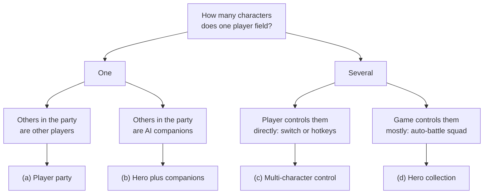

# Module 09: One hero, a party or a roster

- **Goal:** choose how many characters a player owns, controls and fields, design the rules of a player party (size, roles, loot, scaling), and compare the main ways players acquire characters, including gacha odds and what they cost.
- **Prerequisites:** [02 — Vision, pillars and loops](02-vision-pillars-loops.md), [05 — Controls, camera and game feel](05-controls-camera-feel.md), [07 — Classes and roles](07-classes-roles.md).
- **Simulation:** none
- **Facts checked:** October 2026 (prices, rules and product status change; re-check before reuse)

## In short

Every online RPG has to answer one question early: **how many characters does the player own, and how many do they control at once?** Four answers cover almost every game: one hero who groups with other players, one hero plus AI followers, a party of characters the player controls, or a roster of collected heroes. Each answer sets the control load, the content and balance cost, and how hard the game leans on monetization. The choice also decides how characters are acquired: by story, by purchase, by crafting, or by random draw (gacha), and the random draw needs honest odds and a worked-out cost. The worked example is the course game's party rules: size four, three roles, personal loot, and a scaling table from one to four players, plus a short comparison of what would change under the other three answers.

## 1. The concept

### 1.1 Terms

| Term | Meaning |
|---|---|
| **Hero** | The character a player controls directly |
| **Party** | A small group fighting together in the same instance or field, usually two to six characters |
| **Companion (follower, hireling, mercenary)** | A character controlled by the game's AI that fights next to the player |
| **Roster** | Every character a player owns, whether or not they are in the party right now |
| **Squad** | The subset of the roster brought into one fight |
| **Recruitment** | Any way a character joins a player's roster |
| **Control load** | How much the player must decide and do per second |
| **Gacha** | A random draw from a pool, usually paid with a currency, used to give out characters or items |

### 1.2 Two questions that define the space

Two independent questions place any game on the map:

1. **Who owns the characters on screen?** One player owns one hero, or one player owns several.
2. **Who controls the characters other than the hero?** Other humans, the AI, or the same player.

The four boxes at the bottom are the four options of section 3. They can be mixed (a player party where each player also brings companions), but each real game has one centre of gravity.

## 2. The player's view

What the player feels depends on the option:

| Option | The feeling | Motivations served (module 01) |
|---|---|---|
| **(a) Player party** | "I have a role, and others rely on me" | Community, Challenge, Excitement |
| **(b) Hero plus companions** | "I am the hero, with help I can rely on" | Autonomy, Story, Fantasy |
| **(c) Multi-character control** | "I conduct a small team" | Strategy, Power, Challenge |
| **(d) Hero collection** | "I build a collection and a team out of it" | Completion, Power, Strategy |

How each fits the loops of [module 02](02-vision-pillars-loops.md):

- **Core loop (seconds):** options (a) and (b) keep one hero's skills at the centre. (c) adds a switching or commanding layer. In (d) the core loop is often watching a fight and choosing when to use a signature skill.
- **Session loop (a sitting):** (a) needs other people to be available, which costs waiting time. (b) and (d) start instantly.
- **Meta loop (weeks):** (a) grows through gear and social goals. (d) grows through collecting and upgrading, which makes recruitment itself the meta loop.

The risk to watch in every option is that the **control load** and the **number of things to maintain** (gear, levels, skills per character) multiply by the number of characters. A player with ten characters to gear has ten times the chores, so a roster game needs a way to share progress between characters.

## 3. The design space

### 3.1 Option (a): one hero per player, grouping with other players

The most common shape in online RPGs. Each player owns and controls one hero at a time and joins a **party** of other players for dungeons, bosses and field content. Public examples (as of October 2026): World of Warcraft, Final Fantasy XIV, Guild Wars 2, Diablo IV, Path of Exile.

**Party size.** Typical sizes: **four** (Diablo IV parties and Final Fantasy XIV's standard dungeons), **five** (World of Warcraft and Guild Wars 2 dungeons), and **eight to thirty** for raids. Small parties have three benefits: each player's contribution is visible, matchmaking is faster, and the screen is readable. Larger parties support deeper role specialisation but need more coordination.

| Party size | Common roles | Strength | Cost |
|---|---|---|---|
| 2 | Any | Easiest to form | Little role design |
| 3 | Often 1 front, 2 flexible | Friendly to small friend groups | Needs strong solo-capable classes |
| **4** | 1 tank, 1 healer, 2 damage | Clear roles, fast to fill, readable screen | Each missing role is felt |
| 5 | 1 tank, 1 healer, 3 damage | Classic dungeon structure | One absent player is 20% of the group |
| 8+ | Several of each | Spectacle, social weight | Hard to coordinate; needs voice or a guild |

**Role needs.** A **role** is the job a hero does in a fight (module 07). A party works when the encounter design (module 10) asks for roles, and the class design provides them. Three questions to settle: is the party allowed to be roleless; does the game help players find missing roles; and does the encounter punish an imbalanced party hard or softly.

**Loot rules.** Who gets what the party kills? The common systems (as of October 2026):

| System | How it works | Pros | Cons | Example |
|---|---|---|---|---|
| **Personal loot** | Each player rolls their own drops; trade may be allowed afterwards | No arguments, no stolen items | Fewer chances to guarantee a specific item; players trade to fix it | World of Warcraft's default in group content |
| **Need before greed** | Items drop to the pile; players roll Need or Greed | Chance for every player; social | Roll arguments, "ninja looting" | World of Warcraft group loot |
| **Master loot** | One person decides | Efficient for organised guilds | Trust and abuse problems | World of Warcraft (guild raids) |
| **Free for all** | First to pick up wins | Simple | Races, griefing | Early online RPGs |
| **Loot per player (everyone gets a chest)** | Every player opens an own chest | Fair, mobile-friendly | Group has no loot decisions | Common in modern action RPGs |

Rule of thumb: the more casual and cross-platform the audience, the more personal the loot should be. Loot arguments are one of the top causes of party breakup, and every fix beyond personal loot is a social feature, not a game feature.

**Scaling for party size.** The same encounter must work for one to four players if solo play is allowed. The knobs are enemy health, damage, count and mechanics. Two well-known public approaches:

- **Flexible raid size** in World of Warcraft scales boss health and damage with the number of players between 10 and 30, and adds a probability of extra targets per player. Boss health grows more slowly than raid output, so larger groups kill faster, and the design goal was to be neutral about group size.
- **Dynamic events** in Guild Wars 2 scale with the number of players nearby, even players who do not take part, up to about ten for most events and much higher for large events.

**Solo vs group rewards.** Three stances:

| Stance | What it means | Typical outcome |
|---|---|---|
| **Group-favoured** | Groups earn more per hour; solo is possible but slower | Social game; solo players feel pushed |
| **Neutral** | Same reward per hour in either | Players choose by taste; groups form less |
| **Solo-favoured** | Solo is more efficient | Group content empties; the game becomes a single-player game with a chat window |

A social game should be group-favoured but never solo-blocked. Section 5 shows how to build that.

**Content and balance cost.** Medium. Encounters must work for any role mix and several sizes, but only one hero's kit has to be balanced at a time.

**Monetization pressure.** Low to medium. Money is applied to the single hero (cosmetics, convenience). Selling power breaks the party's fairness fast, because players see each other's gear.

### 3.2 Option (b): one hero plus AI companions

The player controls one hero, and the game controls **companions**: followers, hirelings, mercenaries or pets that fight next to them. They exist to make solo play viable, to fill empty party slots, or to deliver story.

Public examples (as of October 2026):

- **Guild Wars** (Nightfall and later campaigns) lets a player add up to seven NPC **heroes** to a party, depending on the party's maximum size and how many other players are in it. Heroes have customised skills and gear, and the player sets a combat mode (fight, guard or avoid combat), positions them with flags, and can force a skill on a target.
- **World of Warcraft Follower Dungeons** (patch 10.2.5) fill a normal-difficulty dungeon with NPC followers that complete the party up to four, so a player can run it alone or with one to three friends.
- **Final Fantasy XIV Trust** (introduced with Shadowbringers) fills dungeons with allied NPCs; the party is one tank, one healer and two damage dealers.
- **Diablo II** mercenaries are hired from an NPC, follow and fight, level up and can be equipped; one at a time.
- **Hunter and warlock pets** in many MMORPGs are class-based companions with simple commands.

**Variations:** a pet (summon, few commands), a hireling or mercenary (hire, equip, keep alive), a story companion (travels in quests), a dungeon filler (the game completes the party), and a customisable hero (set skills, gear and behaviour mode).

**Control load.** Low, if the AI is good. The player gives broad orders (stay close, protect me, focus my target) rather than skill-by-skill orders.

**Content and balance cost.** Medium to high. The designer must write AI for every role the companion can play, tune solo and group difficulty, and avoid companions that either carry the player or die constantly. Each companion needs its own animation, gear and skill set.

**Monetization pressure.** Medium. Companions are easy to sell (outfits, new ones), but if they affect power, they become pay-to-win in solo content.

**The social risk.** If companions are good, players stop queuing. A game whose pillar says "stronger together" must keep companions weaker than humans, or restrict them to story and normal-difficulty content.

### 3.3 Option (c): a party the player controls

The player owns a **party of two to four characters and controls all of them**, either by **switching** the controlled character with a key or tap while the others run on AI, or by giving every character **its own hotkeys** so that several can act in the same second. It is rare in online RPGs, because the control load multiplies.

Public examples (as of October 2026):

- **Genshin Impact** lets the player carry four characters and switch between them quickly during combat; in co-op, the characters are divided among the connected players (with two players each gets two, with four each gets one).
- Other action games use the same switching model, for example Wuthering Waves.
- **Multi-boxing** (one person running several game clients) is a player-created version in older MMORPGs; some games tolerate it, many ban it.

**Control schemes inside (c):** switch with the others on AI (medium load, fits mobile and gamepad), switch where the swap is itself an attack (medium to high), leader movement with formation followers (medium), and per-character hotkeys (very high, PC only).

**Control load.** High. A designer has to decide what the AI does for the characters not being driven (follow, attack, use skills by rule) and how the player takes over. The risk is that skilled players multi-task well and weak players watch their characters die.

**Content and balance cost.** High. Every combat design must work for **three or four sets of skills at once**, and gear and levelling multiply by the number of characters. Encounter damage must be tuned against a bigger party that still has one pair of hands.

**Monetization pressure.** High if characters are sold (as in Genshin Impact, where characters are the main product), moderate if characters are earned by story.

### 3.4 Option (d): hero collection and roster games

The player collects many heroes and fields a **squad** (often four to six) built from them. Battles are often **auto-battle**: the heroes act by AI, and the player picks the squad, its formation and the moment of the strongest skill. Public examples (as of October 2026): AFK Arena, Raid: Shadow Legends, Summoners War, Epic Seven, Fire Emblem Heroes, Genshin Impact (the roster is real-time).

| Part | Typical design |
|---|---|
| **Roster size** | Dozens to hundreds of heroes |
| **Squad size** | 3 to 6 fielded per battle |
| **Combat** | Auto-battle with manual ultimates, or turn-based |
| **Progression** | Per-hero levels, stars (duplicates), gear, fusion or shards |
| **Content** | Stages, towers, arena, bosses with team requirements |
| **Meta loop** | Collect, upgrade, build teams, repeat |

**Control load.** Low during a fight, high between fights (managing the roster).

**Content and balance cost.** Very high and permanent. A game with 150 heroes needs 150 kits balanced against each other, each new hero has to be at least interesting, and power creep (new heroes stronger than old ones) is hard to avoid. Heroes also need art, voice and story.

**Monetization pressure.** Highest. The roster is the product. Money buys random draws (gacha) or direct purchases, so odds, pity and fairness (section 3.7) become the core design topic.

**Why it works.** It suits short mobile sessions (Dev persona), makes progress visible, and gives long-lived collection goals. It works against deep co-operation and against a single hero's identity.

### 3.5 The four options side by side

| | (a) Player party | (b) Hero plus companions | (c) Multi-character control | (d) Roster and squad |
|---|---|---|---|---|
| **Characters controlled** | 1 | 1 (+ AI) | 2–4 | 0–1 (mostly AI) |
| **Control load** | Medium | Low to medium | High | Low in fights |
| **Solo playability** | Needs scaling | Built in | Built in | Built in |
| **Social depth** | High | Low to medium | Medium | Low (arena, guild) |
| **Content cost** | Medium | Medium to high | High | Very high, permanent |
| **Balance cost** | Medium | Medium | High | Very high (power creep) |
| **Monetization pressure** | Low to medium | Medium | High | Highest |
| **Typical platform** | PC, then mobile | PC and mobile | PC or console, mobile switching | Mobile |
| **Public examples** | WoW, FFXIV, Diablo IV | Guild Wars heroes, WoW Follower Dungeons | Genshin Impact | AFK Arena, Raid: Shadow Legends |

### 3.6 Recruitment: how characters join the roster

Options (b), (c) and (d) must decide **how the player gets more characters**. Five methods:

| Method | How it works | Cost predictability | What it feels like | Content cost | Monetization pressure | Public examples |
|---|---|---|---|---|---|---|
| **Story or quest recruitment** | A quest chain ends with the character joining | Fully predictable | Earned, meaningful, narrative | High per character (a quest chain each) | Low | Guild Wars heroes (campaign quests), FFXIV Trust unlocked through the main story |
| **Direct purchase** | A price in currency, soft or hard | Fully predictable | Honest, but clearly a shop | Low | Medium | Premium characters in many games |
| **Crafting or shards** | Collect fragments (shards) per hero, spend them to unlock | Predictable if shard rates are public | Steady progress, "I am close" | Medium | Low to medium | Raid: Shadow Legends uses shards for many champions |
| **Currency draw (gacha)** | Spend currency for a random pull | Unpredictable per pull, predictable on average | Thrill and frustration | Low per pull, high per pool | High | Genshin Impact, Summoners War, Epic Seven |
| **Event or grind reward** | A time-limited challenge gives a hero | Predictable but time-boxed | Prestigious, sometimes stressful | Medium | Low | Common as a "free hero" in live-service games |

Mixing is normal: the story gives a few free heroes, the shop sells a few, and the draw gives the rest. What matters is which part of the roster a **free-to-play player can complete**, and how clearly the game tells them.

### 3.7 Gacha: rates, pity, expected cost and disclosure

A **gacha** is a random draw from a pool. It is covered as an ethics and regulation topic in [module 14](14-monetization.md); this section covers only what a party or roster designer needs: **the odds, and the expected cost of a collection.**

**Vocabulary.**

| Term | Meaning |
|---|---|
| **Pull (draw, wish, summon)** | One random draw |
| **Rate** | Probability of each rarity per pull |
| **Pool or banner** | The set of items one draw can return; often time-limited |
| **Featured item** | The headline hero of a banner with a boosted share |
| **Pity** | A rule that raises or guarantees the top result after many misses |
| **Soft pity** | The rate climbs gradually after a threshold |
| **Hard pity** | A guaranteed top result at a count |
| **50/50** | When the top result may be off-banner; a loss guarantees the featured one next time |
| **Duplicate** | A hero you already own; usually converted to upgrade material |

**A concrete model.** A publicly known shape (Genshin Impact's published rules, as of October 2026): base rate **0.6%** for the top rarity, a guarantee at **90** pulls, with community analysis showing the rate climbing from about pull **74** (the soft-pity part is not published by the studio; treat the curve below as an estimate). We model it with a base rate of 0.6%, plus 6 percentage points per pull from pull 74 until a guarantee at pull 90.

| Quantity | Value (computed from the model) |
|---|---|
| Expected pulls per top-rarity hero with pity | **about 62** |
| Median pulls | 76 |
| Pulls with no pity at 0.6% | 167 on average; 58% of players still have none after 90 pulls |
| Expected pulls per *featured* hero with a 50/50 rule | about **93** (1.5 top-rarity results) |
| Worst case with a 50/50 rule | 180 pulls |

**Worked cost.** If one pull costs 1.5 units of currency (invented), a featured hero costs about 140 units on average and up to 270 units in the worst case. Twelve consecutive featured banners cost about 1,120 pulls, or about 1,700 units. For comparison, twelve top-rarity results cost about 750 pulls on average with the pity model (12 × 62) and about 2,000 without any pity (12 × 167), with large variance. Pity bounds the cost; it does not make it small.

**Expected cost to complete a collection.** If the pool has *N* different top-rarity heroes and each pull of that rarity returns one at random (no banner, no pity), the expected number of top-rarity results to see all of them is *N* times the *N*th harmonic number (the "coupon collector" result):

| Pool size N | Top-rarity results to complete | Pulls at a 0.6% rate, no pity | Pulls with the pity model above |
|---|---|---|---|
| 10 | 29 | about 4,900 | about 1,800 |
| 20 | 72 | about 12,000 | about 4,500 |
| 30 | 120 | about 20,000 | about 7,500 |

The formula for the middle column is `N × H(N) / rate`. The last column multiplies the first by the pity model's 62 pulls. These figures ignore duplicates being useful and ignore banners that raise a featured hero's share, which is why real games add **targeted mechanics** (selectable guarantees, exchange currencies, shard conversion) when a pool is large. A collection designed to be completed through chance alone is, on these numbers, designed to take years or thousands of units.

**Design choices that change the cost:** a higher base rate or earlier soft pity lowers the mean; the hard-pity count sets the worst case; a 50/50 rule raises the average by half; a selectable guarantee turns the collection into a plan; duplicate conversion keeps late pulls useful; free weekly pulls set how long a free player takes.

**Disclosure and regulation (as of October 2026).** Rules on random paid items differ by country and platform, and are changing. This list is a snapshot, not legal advice. Check current law before launch.

| Where | Rule | Status |
|---|---|---|
| **Apple App Store** | Apps with loot boxes or other randomized paid items must disclose the odds of each type of item before purchase | Since December 2017 |
| **Google Play** | Same rule: odds disclosed before purchase | Since May 2019 |
| **China** | Publishers must publish the draw probabilities of each item on the official site or an in-game page, and keep draw records for at least 90 days | Since May 2017 |
| **South Korea** | Probabilities must be disclosed on the purchase screen; since 1 August 2025 a civil regime with up to treble damages applies to probability-item disputes; extra administrative fines were proposed and under review | In force since March 2024 |
| **Brazil** | The Digital Statute of Children and Adolescents restricts loot boxes for minors (age verification or a version without them) | Enforcement from 17 March 2026 |
| **Belgium** | The gaming commission ruled in 2018 that loot boxes are illegal gambling | Since 2018 |
| **Netherlands** | In 2022 the Council of State reversed a fine against a publisher, ruling the game as a whole was not a game of chance | Since 2022 |
| **Australia** | Games with paid loot boxes get at least an M rating, games with simulated gambling R 18+ | From 22 September 2024 |
| **United Kingdom** | Industry principles (2023): disclose loot boxes and probabilities, restrict under-18 purchases without parental consent | Voluntary |
| **European Union** | Consumer authorities published key principles on in-game virtual currencies in March 2025: clear pricing, no hidden costs, extra care with children | Guidance |

Design rule for a new game: **publish the odds including the pity curve, show the expected cost in the shop, and treat the strictest rule above as the baseline for every region.** If your design only works without pity or disclosure, it is the design that is wrong.

### 3.8 How to choose

| If your game is... | Choose | Because |
|---|---|---|
| A social online RPG with shared dungeons and a world | (a), plus light companions for solo access | Roles and groups are the product |
| A solo-friendly story RPG with some co-op | (b) | Story companions carry the narrative |
| A console or PC action RPG with premium characters | (c) | Control depth is the product and characters can be few |
| A mobile idle or collection game with short sessions | (d) | The roster is the meta loop |
| A game with a strict "no pay for power" rule | (a) or (b); (d) needs extra care | Rosters are sold by power |

## 4. Tuning and pitfalls

### 4.1 Rules of thumb

Pick the smallest party that makes every role necessary; make loot personal by default; keep every non-event content piece soloable; keep companions weaker than humans; give every hero a reason to exist in at least one team; and publish odds with pity and a worst-case cost.

### 4.2 Signals that something is wrong

| Signal | Likely problem |
|---|---|
| Parties form slowly for one role | One role is unfun or too scarce; a classic queue problem |
| Players solo content meant for parties using companions | Companions too strong |
| Players drop out after the first boss | Party content too hard or loot unfair |
| Group-clear time is no faster than solo | Scaling too steep; groups are punished |
| Spending clusters on one banner | Power creep; featured heroes dominate |
| Players ask "which hero should I pull for?" and not "which hero do I like?" | The roster is a ranking, not a collection |

### 4.3 Classic failures

- **The missing role.** If only one in ten players picks the healing role and every dungeon needs one, queues stall. Fix: reduce the dependency, make the role attractive, or let AI or consumables cover a missing role softly.
- **Companion replaces people.** Solo play becomes easier and better than group play, and the world empties.
- **Roster rot.** New heroes make the old ones obsolete, so the collection has no meaning.
- **The multiplied chore.** Several characters mean several inventories, quest logs and gear sets. Share what you can across the roster.
- **Scaling nobody can see.** If group scaling makes the same dungeon feel harder with more people, players avoid parties. Tell the player what scaling does.

## 5. Worked example

The course game: a small online fantasy RPG with **one hero per player**, five classes, parties of **up to four players**, a shared world and free to play. All values are invented. The party is option (a).

### 5.1 Intent

Pillar 3 of the course game, **Stronger together**: groups get better rewards per hour than the same player alone, and solo play is never blocked. The party rules exist to make that sentence true without making groups mandatory, and to keep pillar 4 (**fair and respectful of time**) intact: no loot arguments, no waiting for a role.

### 5.2 Party rules

| Rule | Value |
|---|---|
| **Party size** | 1 to 4 players; one hero per player |
| **Roles** | A light trinity (module 07): **tank** (draws enemy attention and absorbs hits), **healer** (restores health, shields and buffs) and **damage** (the main source of kills), with control and support as secondary jobs. The five classes (Warden, Cleric, Duelist, Ranger, Arcanist) each have a base role and a fallback; every hero can revive a downed ally |
| **Recommended party** | 1 tank, 1 healer, 2 damage. **Not enforced**: no dungeon is gated by a class, and parties with three or more distinct classes get the +10% balanced party bonus of module 07 |
| **Forming a party** | Invite a friend, join through the group finder, or use the one-tap fill: the matchmaker fills open slots, preferring missing roles, and starts as soon as two players are present (simple matchmaking) |
| **Role hints** | The group finder shows the party's roles and a hint: "no healer: potions and ground heals recommended" |
| **Joining and leaving** | A leaver's slot can be filled during a dungeon; a disconnected player keeps the slot for 5 minutes |
| **Party level range** | Members must be within 3 levels of the dungeon's recommended level |
| **Shared credit** | Every member gets full credit (XP, quest progress) for every kill by the party, with no kill stealing |

### 5.3 Loot rules

| Rule | Value |
|---|---|
| **Drop model** | **Personal loot.** Every enemy and chest rolls separately for each party member, so no one can take another's drop |
| **Boss chest** | One chest per player, opened by that player; it contains a guaranteed reward tier plus a drop roll |
| **Duplicates** | No hero duplicates exist in the course game; duplicate-style rewards convert to crafting material |
| **Trading** | Gear dropped to a player can be traded to a party member for **2 hours** after the drop, only once, and only when it is not better than what the receiver already wears |
| **Rolls** | None. No need/greed rolls, no voting |
| **Currency** | Currencies are personal; a group never splits gold |

The point is that a party never has a loot discussion. Trading is the safety valve for a wrong-class drop.

### 5.4 Scaling from one to four players

The number of players in the instance at **pull time** (the moment a fight starts) is *n*. All values below are relative to a solo player (*n* = 1). **Party power** is the party's total damage output compared with one hero; in the combat simulation of [module 06](06-combat.md) a party of four deals about four times the average solo hero's damage per second. The only value module 06 fixes is the **enemy HP multiplier of 2.5 at four players**; the rows in between are a straight line, 1 + 0.5 × (*n* − 1).

| Players *n* | Party power | Enemy HP multiplier | Kill speed (power divided by HP) | Enemy damage multiplier | Group XP and drop bonus | Reward per hour per player |
|---|---|---|---|---|---|---|
| 1 | 1.0 | 1.0 | 1.00 | 1.0 | 1.00 | **1.00** |
| 2 | 2.0 | 1.5 | 1.33 | 1.1 | 1.05 | **1.40** |
| 3 | 3.0 | 2.0 | 1.50 | 1.2 | 1.10 | **1.65** |
| 4 | 4.0 | 2.5 | 1.60 | 1.3 | 1.15 | **1.84** |

How to read it:

- Enemy HP grows **slower** than party power, so a bigger group kills faster. At *n* = 4: 4.0 / 2.5 = 1.6, so each kill takes 1 / 1.6 = 62.5% of the solo time, which is **37.5% faster**. The simulation agrees: against the boss a party of four takes about 129 s, a solo Warden-type hero about 212 s (39% faster). This meets the pillar test "a group clear of the first dungeon is at least 25% faster than solo".
- Per-player reward per hour is kill speed times the group bonus. At *n* = 4: 1.6 × 1.15 = 1.84. The **balanced party bonus** (+10% XP and gold for three or more distinct classes, module 07) stacks on top: 1.84 × 1.1 = about 2.02 for a full balanced party.
- Enemy damage rises by 10% per extra player so that healing and shielding have something to do.
- The multiplier is the lever: if it rose to 4.0 at four players, the party's boss kill would take 206 s, no faster than a solo hero, and grouping would stop paying (module 06 shows this experiment for the elite).

**What scales how.**

| Content | Scales by | Why |
|---|---|---|
| **Field packs** | Total pack HP times the multiplier, delivered partly as **extra weak enemies** (+1 per extra player, up to +3) | Many small targets keep everyone busy |
| **Elites and mini-bosses** | HP and damage | One target; adding enemies would change the fight |
| **Dungeon bosses** | HP, damage and the number of simultaneous mechanics (see module 10) | Keeps the roles busy |
| **World boss** | A fixed, high HP for a population of players; no party scaling | Open event |

**Rule: no mechanic may need more than one player.** A mechanic that needs two players to stand on two plates in a group must be sequenced for a solo hero (one plate, repeated). Solo is slower, never blocked.

### 5.5 Solo versus group rewards

| Source | Solo | Group of 4 |
|---|---|---|
| XP and loot per hour | 1.00 (baseline) | 1.84, or about 2.02 with a balanced party (table above) |
| Daily first-dungeon bonus | Yes, any size | Yes, any size |
| Weekly dungeon chest | Yes | Yes, plus **one bonus reward roll** if the clear time is under the par time |
| Story quest chains | Fully solo-playable | Same |
| World boss | Part of a public event | Same |
| Matchmaking | Optional | Optional |

Solo players give up **speed**, never content or the 15-minute reward guaranteed by pillar 4. A solo player's dungeon always completes; each kill takes about 1.6 times as long as in a full party, plus the sequenced mechanics.

### 5.6 What was cut

- **Hard role lock** (needing a healer to enter). It makes queues slow and lets one role hold the group hostage.
- **Need/greed and master loot.** Too much social work for a game that wants short sessions.
- **Cross-class party bonuses** (for example a bonus for five different classes). They would force the party composition, and only four slots exist.
- **Companions that fight**, **multi-character control** and **hero collection.** Kept out of the first release. See section 5.7.

### 5.7 How the course game would change under the other options

**(b) Hero plus companions.**

| Area | Change |
|---|---|
| **Party size** | The group is "you plus up to three companions or players", filled by AI when queues are empty |
| **Rules to add** | Companion roles, behaviour modes (follow, guard, focus), revive rules, a cap on companion strength |
| **Pillar impact** | Pillar 3 (stronger together) weakens: add a rule that companions give 60% of a player's output, and a group of humans gets the reward bonus; Dev gains instant starts; Mira loses some of the social reason to queue |
| **Content** | Every dungeon is tested solo with companions and with humans; a story companion per region |
| **Monetization** | Companion outfits only. Selling stronger companions would break pillar 4 |

**(c) A party the player controls.**

| Area | Change |
|---|---|
| **Control** | The player owns three heroes, drives one and switches. Needs a switch key and an AI mode for the others (pillar 1 changes from "my hero" to "my team") |
| **Party size** | Two to four players could still group, with each player's team shrinking (similar to the co-op rule in Genshin Impact) |
| **Combat** | The five classes' kits must work both when driven and when run by AI; skills need fewer hotkeys |
| **Mobile** | Switching on touch is feasible; per-character hotkeys are not |
| **Cost** | Gear and levelling triple per player unless shared; encounter damage must be tuned against a larger team |

**(d) Hero collection and roster.**

| Area | Change |
|---|---|
| **Core loop** | Shifts from fighting to team-building; combat becomes auto or semi-auto |
| **Pillars** | Pillar 2 (read the fight) loses its purpose; pillar 1 changes to "my team"; pillar 4 needs odds, pity and a "no unearnable power" statement the shop cannot easily keep |
| **Content** | One kit per hero, an ever-growing roster, new heroes each season |
| **Social** | Guilds and arenas replace dungeon parties |
| **Persona fit** | Dev gains a great fit; Mira loses |

The table in section 3.5 summarises the trade: the course game keeps (a) because its vision is about roles and winning together, and each alternative gives up part of that.

## Key takeaways

- The first design choice is **how many characters a player owns and controls**: one hero in a player party, one hero plus AI companions, a controlled party, or a roster of collected heroes.
- Control load, content cost and monetization pressure all **multiply with the number of characters**; plan to share progress across a roster.
- For a social online RPG, **party size four with three roles** is the smallest structure that makes roles matter, and it keeps queues fast and the screen readable.
- **Personal loot** removes the biggest source of party arguments; trading is the safety valve.
- Scale enemies **more slowly than party power** so groups are faster per hour, and let nothing require more than one player so solo is never blocked.
- AI companions give solo access but **replace people if they are too good**; keep them weaker than humans in a game that sells togetherness.
- If characters come from a random draw, **publish rates and pity and calculate the expected and worst-case cost**; completing a pool of 20 top-rarity heroes by chance alone costs thousands of pulls even with pity.

## Further reading

- Guild Wars Wiki, "Hero" (companions with control panel, modes and flags): https://wiki.guildwars.com/wiki/Hero
- Warcraft Wiki, "Follower Dungeons": https://warcraft.wiki.gg/wiki/Follower_Dungeons
- Final Fantasy XIV Console Games Wiki, "Trust System": https://ffxiv.consolegameswiki.com/wiki/Trust_System
- Warcraft Wiki, "Personal Loot": https://warcraft.wiki.gg/wiki/Personal_Loot
- Warcraft Wiki, "Flexible Raid": https://warcraft.wiki.gg/wiki/Flexible_Raid
- Genshin Impact Wiki, "Wish": https://genshin-impact.fandom.com/wiki/Wish
- Apple, App Store Review Guidelines (section 3.1.1 on randomized items): https://developer.apple.com/app-store/review/guidelines/
- Fenwick, "Google Play now requires disclosure of loot box odds": https://www.fenwick.com/insights/publications/google-play-now-requires-disclosure-of-loot-box-odds
- Australian Classification Board, "New classifications for gambling content in video games": https://www.classification.gov.au/about-us/media-and-news/news/new-classifications-for-gambling-content-video-games
- Inven Global, "Loot Box Crackdown? South Korea Eyes Revenue Penalties for Probability Disclosure Breaches": https://www.invenglobal.com/articles/20244/loot-box-crackdown-south-korea-eyes-revenue-penalties-for-probability-disclosure-breaches
- Mayer Brown, "Enforcement of Brazil's ECA Digital introduces new obligations for companies": https://www.mayerbrown.com/ja/insights/publications/2026/04/enforcement-of-brazils-eca-digital-introduces-new-obligations-for-companies
- Baker McKenzie, "European consumer protection network issues new key principles on in-game virtual currencies": https://connectontech.bakermckenzie.com/european-consumer-protection-network-issues-new-key-principles-on-in-game-virtual-currencies-impact-for-gaming-and-gambling-entities-in-belgium-the-eu-and-beyond/
