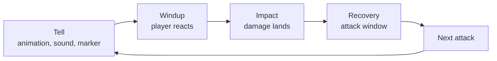

# Module 12: Enemies, bosses and encounters

- **Goal:** design enemies and encounters that players can read, learn and master: choose archetypes, compose packs, set difficulty knobs, build a multi-phase boss that tests every role, and scale it for party size.
- **Prerequisites:** [08 — Combat design](08-combat.md), [09 — Classes and roles](09-classes-roles.md), [11 — One hero, a party or a roster](11-party-roster.md).
- **Simulation:** none
- **Facts checked:** October 2026 (prices, rules and product status change; re-check before reuse)

## In short

An **encounter** is one fight the designer has staged: which enemies, where, with what behaviour, and what the player must do to win. Enemies come in a small set of **archetypes**, each asking the player for one thing (move, focus, interrupt, hold, survive). Enemies must be **readable**: every dangerous attack shows a **tell** before it lands, and every enemy leaves an **attack window** afterwards. Difficulty is tuned with a few **knobs** (health, damage, count, mechanics, timers) and should come from mechanics first and numbers last. Bosses combine archetypes into **phases** that test each role. The worked example is a field pack, an elite and a three-phase dungeon boss for the course game, with stats given as multiples of a standard enemy.

## 1. The concept

### 1.1 Terms

| Term | Meaning |
|---|---|
| **Enemy archetype** | A reusable type of enemy defined by the job it does in a fight (fodder, bruiser, caster...) |
| **Pack** | A group of enemies that fight together |
| **Pull** | The act of engaging a pack; also the group that joins the fight (a "pull of five") |
| **Aggro (threat)** | The rule that decides whom an enemy attacks |
| **Tell** | Any signal that an attack is coming: animation, sound, colour, a marker on the ground, a cast bar |
| **Telegraph** | A tell that also shows where and when: a marker on the ground, a cone, a line |
| **Attack window (window of opportunity)** | A moment when the enemy cannot hurt the player, so the player can attack or reposition |
| **Phase** | A stage of a boss fight with its own behaviour, usually triggered by a health threshold |
| **Enrage** | A time limit or growing damage that forces the fight to end |
| **Wipe** | Every party member is dead; the attempt ends |
| **Add** | A small enemy summoned during a boss fight |
| **Standard enemy (SE)** | The course game's unit of measure: one trash enemy of module 08 (120 HP). Its basic hit is 1 SH (standard hit, 30 damage) |

### 1.2 Anatomy of one enemy attack

Every readable attack has four steps. The player's skill is spotting the first and using the last.



Design values per attack are the **length of the tell and windup** (how long the player has) and the **length of the recovery** (how long the enemy is exposed). Everything else in this module is a way of arranging these two numbers.

## 2. The player's view

Players should feel that a fight is **fair, then learnable, then masterable**:

| Stage | The feeling | What the design must provide |
|---|---|---|
| **First pull** | "I did not know that would happen, but I see why" | Tells for every dangerous attack |
| **Learning** | "Next time I will move at the glow" | Consistent signals; a death recap showing what killed the player |
| **Mastery** | "I read it and I own it" | Windows that reward precision; speed and risk options |

This is pillar 2 of the course game, **Fights you can read**. The motivations from [module 01](01-player-experience.md) it serves are Challenge and Excitement (core loop) and Community (the group solves a fight together). A fight that is hard because the player cannot see what is happening feels unfair, and players blame the game. A fight that is hard because it asks for precision feels fair and gets replayed.

## 3. The design space

### 3.1 Enemy archetypes

An archetype is defined by what it asks of the player. Values are in standard enemies (SE, 120 HP) and standard hits (SH, 30 damage); the elite and boss rows are the module 08 values.

| Archetype | Job in the fight | What it asks of the player | HP | Damage | Typical tell |
|---|---|---|---|---|---|
| **Fodder** | Fills space, gets killed fast | Area attacks, positioning | 0.3–0.6 SE (35–70 HP) | 0.5–1.0 SH | Short wind-up animation |
| **Bruiser** | Soaks and hits hard in melee | Hold its attention, dodge its one heavy move | 1.5–3 SE | 1–2 SH basic, one heavy move of 6 SH | Big animation plus a marker |
| **Ranged** | Hurts from behind the front line | Break formation, close in or take cover | 0.8–1.2 SE | 1–2 SH | Flash on the weapon, a projectile you can see |
| **Caster** | Dangerous spell or summon | Interrupt, stun or kill first | 0.8–1.5 SE | 2–6 SH on cast | Cast bar and name, glowing hands |
| **Healer or support** | Heals, shields or buffs other enemies | Focus it first or stop the buff | 1–2 SE | Low | Visible link or aura to its allies |
| **Elite** | A tougher enemy with 1–2 special moves | Use cooldowns, handle a mechanic | about 18 SE (2,200 HP) | about 3.7 SH basic (110), specials 6–10 SH | Named, with a coloured nameplate and markers |
| **Mini-boss** | A set piece before a boss | A short test of one mechanic and a role | about 33 SE (4,000 HP) | about 4 SH basic, specials 8–15 SH | Area-sized markers |
| **Boss** | The climax of a dungeon or event | Every role and every skill | about 54 SE (6,500 HP) | about 5.3 SH basic (160), specials 10–25 SH | A full set of markers, sounds and phases |

A distinct silhouette and colour lets players pick the type from across the screen, a single clear counter (interrupt the caster, hold the bruiser, close on the ranged enemy) makes it learnable, and cheap variants (a different element or tint) stretch it across regions.

### 3.2 Behaviour players can read

**Tells.** A tell is the contract between designer and player: "when you see this, this will happen." Designers' write-ups on action and online RPGs repeat the same advice (as of October 2026): use large gestures, colour-coded attacks, and voice and sound cues to signal the start of a pattern, and keep the visual language **consistent** (if red always means "get out", it must always mean that).

**Three kinds of signal.**

| Kind | Example | Good for |
|---|---|---|
| **Animation** | The enemy raises its weapon | Light and medium attacks, melee |
| **Ground marker** | A circle, cone or line appears | Area attacks the player must leave |
| **Text and audio** | A cast bar with a name; a roar; a voice line | Heavy attacks, phase changes, mechanics |

Public games solve this in different ways. **Guild Wars 2** draws red outlines or filled circles on the ground to say "do not stand here"; the solid red circles are used for the attacks that matter most. **Final Fantasy XIV** shows orange area markers, and in high-end content the marker may appear only shortly before the attack resolves, so players must also read the enemy's animation and cast name; the attack's damage registers when the marker disappears. Both show that **readability is a design budget**: higher difficulty usually shortens the tell, not removes it.

**Timing rule of thumb.** A human needs roughly a quarter of a second to react to a simple signal, longer when choosing between options, and a touch screen and network add more (rule of thumb, inferred). So the tell must be longer for bigger attacks:

| Hit size (of max hero HP) | Minimum tell time | Required signals |
|---|---|---|
| Light, up to 5% | 0.4 s | Animation |
| Medium, up to 20% | 0.8 s | Animation plus a marker |
| Heavy, up to 45% | 1.2 s | Marker and a sound |
| Severe, above 45% | 1.5 s | Marker, sound and a cast name; always avoidable |

These values already include about 0.25 s for touch input and latency, so a PC player and a phone player have the same window. They are slightly stricter than the floor in module 08 (above 25% of HP: 0.8 s; heavy attacks: 1.2 s).

**Attack windows.** An enemy that attacks without pause cannot be punished, and the player can only run. A designer controls difficulty by the length of the window after each pattern: more downtime is easier, less downtime is harder. Windows are the player's reward for reading the pattern.

**Consistency.** Do not change a tell's meaning between enemies, and do not hide a severe attack inside effects clutter (module 26 covers the HUD).

### 3.3 Pack composition and pull size

A **pack** is composed from archetypes. A **pull** is how many enemies join the fight at once. Pull size sets the pace of the core loop.

| Pull size | Feeling | Typical use |
|---|---|---|
| **1–2** | A duel; each enemy matters | Elites, early game |
| **3–5** | A short skirmish; needs target priority | The standard field pack |
| **6–10** | A crowd; area skills shine | Hordes, density events |

Rules for composing a pack:

1. **One priority target.** Include one enemy that the player should kill first (ranged, caster or healer). A pack of identical enemies has no decisions.
2. **Mix distances.** Melee and ranged in one pack force movement and positioning.
3. **No more than two archetypes with a heavy attack in one pull**, so the markers stay readable.
4. **Fodder fills the count.** Heavy enemies drive the difficulty; fodder drives the pace.
5. **Pull links.** Decide how enemies join the fight: only the ones the player touches, or the whole pack within a radius. Linked packs make careful play possible; "chain pulls" that wake half the map punish exploration.
6. **Leash and reset.** An enemy that chases the player too far returns and heals. Players use this to escape, so keep it consistent.

**Aggro.** The simplest rule is "nearest player". A **threat table** (damage and taunts raise threat; the enemy attacks the highest) lets a tank keep attention. The choice matters for parties: with nearest-target aggro every player is a tank, with threat tables there is a defined tank, and the encounter can ask for a role.

### 3.4 Difficulty knobs

The designer has five main knobs and a few minor ones.

| Knob | What it does | When it is the right tool | Danger |
|---|---|---|---|
| **HP** | Longer fight | Setting fight length (to reach the time-to-kill target of [module 08](08-combat.md)) | Sponges: long fights where nothing changes |
| **Damage** | More pressure on healing and dodging | Making mistakes matter | Instant kills that feel unfair; healers become mandatory |
| **Count** | More targets at once | Making area skills and positioning matter | Clutter; unreadable markers |
| **Mechanics** | New things to do (interrupt, dodge, move) | Adding skill, not numbers | Too many at once; tutorial needed |
| **Timers** | Pace, enrage, windows | Forcing action | Frustration when a timer is invisible |
| **Minor knobs** | Tell length, window length, speed, area size, resistances | Fine tuning | Hidden changes feel arbitrary |

**Rule of thumb: mechanics and count first, damage next, HP last.** A fight that is hard because there is more to do is a better fight than one where the numbers just got bigger. HP is the knob that sets length and should be set from the time-to-kill target, not used to raise difficulty.

### 3.5 Boss design

A boss is a long encounter, usually two to six minutes in an online RPG dungeon, built from **phases**. A boss fight should do four things: teach, escalate, test every role, and end.

**Phases.** A phase is a stage of the fight with its own set of behaviours. Phase triggers:

| Trigger | Example | Notes |
|---|---|---|
| **Health threshold** | At 65% and 30% | Most common; easy to show on the boss bar |
| **Timer** | Every 90 seconds | Ensures pace |
| **Event** | A pillar is destroyed | Rewards teamwork |

Phase structure that works:

- **Phase 1 teaches.** It uses two or three basic mechanics at a forgiving speed.
- **Phase 2 changes the rules.** A new arena state or a mechanic that asks for a different role.
- **Phase 3 combines and speeds up.** It reuses earlier mechanics at a higher tempo, plus an enrage.
- **Transitions are safe.** The boss is briefly invulnerable and does no damage so players can heal and regroup.

Bosses are commonly built as multi-phase fights because phases prevent repetition, give milestones that reward partial success, and force adaptation instead of rote execution.

**Mechanics that test each role.** A good boss asks something specific of every role, so no one is idle and no one carries:

| Role (module 09) | A mechanic that tests it |
|---|---|
| **Tank** | A frontal cone that must be turned away from the group; a heavy hit on the current target that needs mitigation |
| **Damage** | Adds that must die before they reach players; a short vulnerable window for burst |
| **Healer** | Damage over time that needs healing or cleansing; a shield before a large blast |
| **All** (control as a secondary job) | Moving out of area markers; positioning for a phase; filling the boss's stagger bar |

**Enrage.** A time limit that makes the fight end. A **hard enrage** wipes the group at a fixed time (often several minutes); a **soft enrage** gradually raises the pressure (more adds, rising damage, a shrinking arena) so that a strong group can push through it. Without any enrage, a fight can be won by healing forever. Use enrage to say that damage matters, and show the clock to the player.

**Wipe recovery.** A wipe is a normal part of learning a boss, so recovery must be quick and cheap. Questions to settle:

| Question | Options |
|---|---|
| **Does a death end the fight for that player?** | Respawn and run back; ally revive; limited revives |
| **Are revives limited?** | **World of Warcraft** raids share one pool of combat-resurrection charges (one at the start, plus one every 90 divided by raid size minutes), while dungeons have no limit |
| **What does a wipe cost?** | Time only, or repair costs and lost consumables |
| **What does the boss do on reset?** | Full reset, or phase checkpoints |
| **How long to get back?** | Under a minute is friendly; five is punishing |

A designer must decide how much a death should hurt. Too little and mechanics are optional; too much and groups disband.

### 3.6 Scaling for party size

If one to four (or more) players can fight the same encounter, **scale it**. Knobs, from simplest to most refined:

| Method | How it works | Pros | Cons |
|---|---|---|---|
| **HP and damage multiplier** | Multiply by a function of player count | Simple | Fights feel the same, just longer |
| **Count scaling** | More enemies for more players | Fills the field, keeps pace | Clutter |
| **Mechanics scaling** | More simultaneous mechanics (more markers, more adds) | The fight is genuinely harder | Hard to tune and test |
| **Fixed tiers** | Separate versions for 1, 2–3 and 4 | Predictable | Cost multiplied by the tiers |

Public approaches:

- **Flexible raids** in World of Warcraft scale health and damage with raid size (between 10 and 30 players), with each player adding about a 20% chance for a boss ability to hit one more target or have an extra effect. Boss health grows more slowly than raid output, so bigger groups kill faster, and the stated goal was to be neutral about group size.
- **Dynamic events** in Guild Wars 2 scale in real time as players arrive or leave: most events scale up to about ten participants, and a few large ones scale up to a hundred. Scaling can increase enemy level, add tougher enemy types, add more enemies, or raise the objective.

Rules for good scaling:

1. **Scale at the pull**, not mid-fight, so players are not surprised. (Dynamic scaling is fine for open-world events, where players come and go.)
2. **Scale HP slower than party power**, so groups are faster per hour.
3. **Scale mechanics with count**, not only numbers, so large parties still have something to do.
4. **Never require more players than the minimum.** If a mechanic needs two players, solo must have a sequential version.
5. **Tell the player** what the scaling is.

### 3.7 World bosses

A **world boss** is a boss fought in the open world by many players at once, usually at scheduled times. Public example: **Diablo IV** world bosses appear about every six hours, with a short fight window (a guide gives 15 minutes) and multi-player participation (as of October 2026).

| Design question | Typical answer |
|---|---|
| **Spawn** | Fixed schedule with a visible countdown or announcement |
| **Participation** | Anyone nearby can join, no party needed |
| **HP and scaling** | Large HP, scaled by the number of players present |
| **Mechanics** | Big, simple, and readable at a distance; few roles are required |
| **Rewards** | By participation, so a late joiner or a supporter is not left out |
| **Failure** | A timer; the boss leaves if not killed |
| **Dying** | Respawn at a nearby camp; dying does not forfeit the reward |

A world boss is a **social event** more than a skill test: the aim is that many players feel part of something large, so mechanics must be forgiving and the telegraphs must be huge. Lots of players in one place also make readability and server load the first problems.

### 3.8 How to choose

Use 3–5 enemy packs with one priority target for the everyday field loop, elites with one or two special moves to give cooldowns a purpose, a three-phase boss as a dungeon climax, and a world boss with huge telegraphs as a social spectacle. For touch screens lengthen tells and reduce simultaneous markers; for hard-core players shorten tells and add mechanics and enrage timers. For turn-based or auto-battle games, show enemy intent (a next-action icon) and test team composition and elements instead of reflexes.

## 4. Tuning and pitfalls

### 4.1 Setting fight length

Fight length comes from HP, and the numbers come from the time-to-kill simulation of [module 08](08-combat.md). A planning rule:

```
fight time = module 08 simulated time for that enemy and group ÷ damage uptime
```

**Damage uptime** is the share of time the party can attack; dodging and repositioning lower it (about 0.9 for a simple elite, about 0.85 for a mechanics-heavy boss). The module 08 sim has no movement, so uptime is the correction. The formula is a planning tool; playtests correct it.

Target durations (bands for pack, elite and dungeon boss are module 08's; mini-boss and world boss are this module's):

| Encounter | Solo | Party of four |
|---|---|---|
| Field pack (480 HP) | 10–18 s | 6–10 s |
| Elite (2,200 HP) | 50–85 s | 30–50 s |
| Mini-boss (4,000 HP) | 100–170 s | 60–100 s |
| Dungeon boss (6,500 HP) | 170–260 s | 100–160 s |
| World boss | not soloable | 8–12 min |

Party fights use the HP multiplier of 2.5 at four players ([module 11](11-party-roster.md)). Module 08's pacing plan for a 15-minute dungeon is 8 packs, 2 elites and 1 boss, which is about 4.6 minutes of fighting, or **30% of the time**; the rest is travel, loot and rest beats.

### 4.2 Signals that something is wrong

| Signal | Likely problem |
|---|---|
| Players cannot say what killed them | Missing tell, or tell hidden by effects |
| Everyone dies to the same attack | The tell is too short or too late; or the counter is not clear |
| A role never has anything to do | The boss does not test that role |
| One role carries the fight | The mechanics demand too much of one role |
| Boss fights take longer than 8 minutes | Too much HP; difficulty is coming from numbers |
| Solo clears are impossible | A mechanic requires two players |

### 4.3 Classic failures

- **The sponge.** A boss with a huge HP bar and the same two attacks. The fight is long, not hard.
- **Unreadable difficulty.** Many markers, colours and effects at once. The player sees noise.
- **Surprise kills.** A lethal attack with no tell, or a tell shorter than the human reaction time. It teaches players to distrust the game.
- **The healer problem.** Pure damage-pressure encounters make the healer the only role that matters.
- **Roleless bosses.** Fights where nothing differentiates the roles make class design pointless.
- **Scaling that punishes grouping.** A group of four faces more than four times the HP.

## 5. Worked example

The course game: a small online fantasy RPG with one hero per player, five classes (module 09), parties of up to four, real-time combat and a pillar that says every dangerous attack is telegraphed. The values are invented and relative. Combat formulas and the actual time-to-kill targets belong to [module 08](08-combat.md); this module only uses relative multiples.

### 5.1 Units

| Unit | Meaning |
|---|---|
| **SE** | One module 08 trash enemy: **120 HP, defence 10** |
| **SH** | That enemy's basic hit: **30 damage**, which is 3% of a hero's 1,000 HP (the example HP of earlier modules) |
| **Module 08 enemies** | Trash pack of 4 enemies, **480 HP** in total (4 SE); elite **2,200 HP**, defence 20, 110 per hit every 2.5 s (about 18 SE); boss **6,500 HP**, defence 30, 160 per hit every 3.0 s (about 54 SE) |
| **Party scale** | Enemy HP × 1.0, 1.5, 2.0, 2.5 for one to four players ([module 11](11-party-roster.md)), so the four-player values are 1,200, 5,500 and 16,250 HP |
| **Roles** | Tank (Warden), healer (Cleric) and damage (Duelist, Ranger, Arcanist) from the light trinity of [module 09](09-classes-roles.md); control and support are secondary jobs |
| **Interrupts** | A stun, silence or knockback cancels an elite's cast (the halved duration of module 08 shortens the lock-out, not the cancel). Bosses cannot be interrupted; CC skills fill their stagger bar instead |

### 5.2 A field pack: the Ashfang pack

Located in the first region's fields. Four enemies, one pull, an 8 m aggro radius with the whole pack joining. Module 08 gives a four-attacker pack of 480 HP and a 2 s attack interval; this pack fits it.

| Enemy | Archetype | HP | Behaviour | Tell | What it tests |
|---|---|---|---|---|---|
| **2 Scrappers** | Fodder | 0.5 SE (60 HP) each | Run at the nearest player and swing (1 SH, every 2 s) | A 0.4 s arm raise | Area skills, not being surrounded |
| **1 Brute** | Bruiser | 2 SE (240 HP) | Hits the nearest player (1.5 SH). Every 8 s it uses **Ground Slam**: 6 SH in a 4 m circle. After the slam it recovers for 2 s and takes 30% more damage | A 1.0 s red circle that fills; a heavy thud sound | Leaving the marker; punishing the recovery; the tank holding it |
| **1 Slinger** | Ranged | 1 SE (120 HP) | Stays 10 m back and shoots (1 SH) every 2 s | A 0.5 s flash on the sling, a visible stone in flight | Priority target; breaking formation to reach it |

- **Pack HP:** 2 × 60 + 240 + 120 = **480 HP (4 SE)**. Module 08 gives solo kill times of 12–16 s for the classes; with dodging (0.9 uptime) the Ashfang pack takes about **13–18 s solo**, inside the 10–18 s band, and about **9 s** for a party of four (8.0 s ÷ 0.9), inside 6–10 s.
- **Damage pressure:** all four attacking is about 4.5 SH per 2 s, or roughly 67 damage per second. A lone 1,000-HP hero who ignores every tell dies in about 15 s, in line with module 08's time-to-die. The tells give the way out.
- **Scaling:** total pack HP is 480 × the party scale (720, 960, 1,200). Each extra player adds one Scrapper (up to +3) and the rest of the budget goes into HP.
- **Pull rules:** the pack links on any hit; it resets and heals if chased beyond 30 m; no patrols.
- **Variants:** an ice Brute and a poison Slinger reuse the same behaviour in the second region.

### 5.3 An elite: the Gravel Matron

Placed beside a road or at the end of a field path, with a coloured nameplate and a small reward chest.

| Property | Value |
|---|---|
| **Archetype** | Elite (the module 08 elite: 2,200 HP, defence 20) |
| **HP** | **2,200 HP (about 18 SE)** at one player; **5,500 HP** at four |
| **Basic attack** | 110 damage (3.7 SH), once every 2.5 s |
| **Fight length** | Party of four: 40.2 s (module 08) ÷ 0.9 uptime = **about 45 s**, inside 30–50 s. Solo Warden-type hero: 66 s ÷ 0.9 = about 74 s, inside 50–85 s |

Two special moves only:

| Move | Behaviour | Tell | What it tests | Counter |
|---|---|---|---|---|
| **Boulder Cleave** | A frontal 120-degree cone for 8 SH (240, 24%), every 6 s | A cone marker for 1.2 s and a wind-up animation | Tank: turn her away from the party. Everyone: leave the cone | Step aside; the 1.5 s recovery after it is the attack window |
| **Call Gravelings** | Every 20 s she channels for 3 s and then 2 Gravelings (0.5 SE fodder) join the fight | A 3 s cast bar named "Call Gravelings", and her hands glow | Interrupting: any stun, silence or knockback cancels the call. Damage: killing adds quickly | Interrupt the channel; if it succeeds, the adds are the penalty |

What it teaches: **stuns and interrupts matter**, the tank decides where she faces, and cooldowns are for something. After the first elite, a player knows two behaviours that they will see again in the boss.

### 5.4 A three-phase dungeon boss: the Cinder Warden

The last boss of the course game's first dungeon, in a round arena with a 10 m ring of safe floor around a central furnace.

**Overall.** The module 08 boss: **6,500 HP (about 54 SE), defence 30**, basic hit 160 (5.3 SH) every 3.0 s. At four players 16,250 HP. Planned fight time with mechanics (0.85 uptime): party of four 129 s (module 08) ÷ 0.85 = **about 152 s**, inside 100–160 s; a solo Warden-type hero 212 s ÷ 0.85 = **about 249 s**, inside 170–260 s. At four players the phases last about 53 s (100% to 65%), 53 s (65% to 30%) and 46 s (30% to 0%); solo they last about 87, 87 and 75 s. A visible **Ember gauge** fills over **6 minutes**, 2.4 times the party fight and 1.4 times the solo fight; when full it starts a 10 s Meltdown countdown that wipes the party (the hard enrage).

#### Phase 1: "Forge" (100% to 65%)

The teaching phase.

| Move | Behaviour | Tell | Damage | What it tests |
|---|---|---|---|---|
| **Hammer Cleave** | A frontal cone every 8 s | A 1.3 s cone marker, a raised hammer | 10 SH (300, 30%) | Tank faces him away; others stay out of the cone |
| **Ember Pools** | Every 12 s drops a fire pool beneath random players (1 at one or two players, 2 at three or four) | A 1.5 s ring under each target, a hiss | 3 SH per second (9%) while standing in it; the pool lasts 8 s | Everyone: move on the marker, and the ring warns the player it is aimed at them |
| **Slagmites** | Every 20 s he spawns Slagmites (fodder, 0.5 SE) that run at players and explode after a 3 s fuse | A visible fuse and a red glow | 6 SH to anyone near | Damage: kill them before they reach the party; healer: heal the survivors |

Number of Slagmites per wave: 1, 2, 2, 3 for one to four players.

#### Phase 2: "Overheat" (65% to 30%)

The rule-changing phase. Between phases the boss is invulnerable and deals no damage for 3 seconds while the arena shakes.

| Move | Behaviour | Tell | Damage | What it tests |
|---|---|---|---|---|
| **Furnace Blast** | Every 20 s he retreats to the furnace and channels. A pulse hits the whole arena **except** three vent circles of safe floor | A 2.0 s cast bar named "Furnace Blast", the floor glows red and the three vents glow blue | 25 SH (750, 75%) to anyone outside a vent | Everyone: stand in a vent. Healer: shield the party or heal after |
| **Molten Strike** | A heavy single-target hit on whoever holds his attention | A 2.0 s cast bar and a marker on the target | 20 SH (600, 60%) before mitigation | Tank: use a mitigation skill (module 10) |
| **Exposed Core** | After each Furnace Blast the core is exposed for 6 s | A bright core on the boss, a chime | Boss takes +25% damage (the same as a stagger) | Damage: save burst for the window; everyone else: keep the window safe |

Hammer Cleave and Slagmites continue at a slower rate (every 10 s, every 30 s). Control skills (stun, slow, knockback) also fill the boss's **stagger bar** of module 08: when it is full the boss is staggered for 4 s and takes 25% more damage. Bosses ignore stun and root themselves.

#### Phase 3: "Meltdown" (30% to 0%)

The combining phase.

| Move | Behaviour | Tell | What it tests |
|---|---|---|---|
| **Closing Ring** | The outer floor starts to burn and closes inward at a visible speed, fully closed 100 s after the phase starts: a **soft enrage** | The edge turns orange and the fire moves | Time: damage output matters; the party must stay in the shrinking circle |
| **All earlier moves** | Cleave every 6 s, Pools every 12 s, Slagmites every 15 s, Furnace Blast every 20 s | As before | Reading everything at a higher tempo, which the player has learned already |
| **Final Roar** (at 10%) | The boss knocks everyone back and drops 3 Ember Pools at once | A 1.5 s cast with a roar, three rings | One last movement check before the kill |

#### What the fight asks of each role

| Role | Phase 1 | Phase 2 | Phase 3 |
|---|---|---|---|
| **Tank** (Warden) | Turn the cone away | Mitigate Molten Strike | Hold position as the ring closes |
| **Damage** (Duelist, Ranger, Arcanist) | Kill Slagmites | Burst the Exposed Core | Race the ring |
| **Healer** (Cleric) | Heal pool damage | Shield before Furnace Blast | Heal and cleanse the burn |
| **All** | Leave pools | Reach a vent | Stay in the circle |

#### Scaling for the party

| Players | HP (multiplier) | Slagmites per wave | Ember Pools targets | Vents in Furnace Blast |
|---|---|---|---|---|
| 1 | 6,500 (1.0) | 1 | 1 | 3 |
| 2 | 9,750 (1.5) | 2 | 1 | 3 |
| 3 | 13,000 (2.0) | 2 | 2 | 3 |
| 4 | 16,250 (2.5) | 3 | 2 | 3 |

Every mechanic works for one player: there are always three vents, which is plenty for one, and no mechanic needs two players in different places.

#### Telegraph check

| Attack | Share of max HP | Required tell (section 3.2) | Used |
|---|---|---|---|
| Slagmite explosion | 18% (6 SH) | 0.8 s | 3 s fuse |
| Hammer Cleave | 30% | 1.2 s | 1.3 s |
| Ember Pool | 9% per second | 0.8 s | 1.5 s |
| Molten Strike | 60% | 1.5 s | 2.0 s |
| Furnace Blast | 75% | 1.5 s | 2.0 s |

All are at or above the minimum, and all severe attacks are avoidable (a vent) or mitigable (a skill).

#### Death and recovery

- A dead hero can be **revived by an ally** (any hero can do it with a short channel, returning the ally at 30% HP with 3 s of invulnerability, as specified in module 05), or can wait **15 seconds** and respawn at the room's door at 50% HP, and run back in about 20 s. The enrage clock does not pause.
- Dying does not reset the boss. A **wipe** (all four dead) resets the boss and the room; the party returns to the door at full HP within 10 s. No repair costs.
- A **death recap** shows the attack that killed the player and when its tell began, supporting the pillar test "players can say what killed them".

### 5.5 The world boss (short spec)

A single world boss at the end of the first release's content, the **Ashen Colossus**, as part of the weekly schedule.

| Property | Value |
|---|---|
| **Schedule** | Twice a week at a fixed time; announced 30 minutes before |
| **Participation** | Anyone in the map layer; layers hold up to 40 players |
| **HP** | **9,000 HP (75 SE) per player present**, between 10 and 40 players (90,000 to 360,000 HP), recomputed every minute while keeping the health percentage. Defence 30 |
| **Fight time** | A hero deals about 31 damage per second against defence 30 (module 08's classes average about 37 against defence 10). At 30 players of average efficiency 0.8 with 0.6 uptime: 270,000 ÷ (30 × 31 × 0.8 × 0.6) = about 605 s, **10 minutes**. The same at 10 players, so scaling is neutral by design |
| **Mechanics** | Three huge markers: a stomp circle (2.5 s tell), a sweeping line (2.0 s) and a ground wave you jump or dodge. All are mitigable or avoidable |
| **Rewards** | Everyone who earns a **contribution score** of 5% or more gets the reward. The score counts damage, healing and revives, so healers are not left out |
| **Failure** | If the boss is alive after 20 minutes it leaves, and everyone who took part gets a smaller reward |
| **Death** | Respawn at the camp after 15 s with no penalty |

The world boss does not require a party, supports pillar 3 as a place where strangers help each other, and does not depend on a role mix.

### 5.6 What was cut

Instant-death mechanics with no tell (pillar 2), mechanics requiring two players in different places (solo is never blocked), hidden gear checks (the enrage is a visible clock), and per-boss resurrection caps (time and lost output are the cost of dying).

### 5.7 How the design would differ for another kind of game

In a **hero-collection auto-battle** game there are no telegraphs to react to: the encounter tests squad composition, elements and formation, and boss mechanics become team requirements ("needs a cleanser"). In **turn-based tactics** the tell becomes information (a turn bar of enemy actions) and the boss pattern is a puzzle. In an **action game with one hero** windows and tells are the entire game, boss HP is lower and dodging is the key skill. In **raid-scale online games** (ten or more players) bosses add more simultaneous mechanics assigned to roles, a limited revive pool and a stricter enrage.

## Key takeaways

- Enemy archetypes are defined by **what they ask of the player**: fodder fills, bruisers hold, ranged break formation, casters get interrupted, elites test cooldowns, bosses test everyone.
- **Readability is a contract.** Every dangerous attack has a tell, the tell is long enough for the hit's size, and the same signal always means the same thing.
- **Attack windows reward reading.** Difficulty comes from shortening windows and adding mechanics, not only from bigger numbers.
- Tune with **mechanics and count first, damage next, HP last**; set HP from a time-to-kill target, not to make fights harder.
- A boss is **three phases that teach, change the rules, then combine**, with a visible enrage clock and something specific for every role to do.
- Make **wipe recovery fast and cheap**; the cost of death should be time and lost output, not a chore.
- Scale encounters at the pull, **HP slower than party power**, and never require more players than one; world bosses are social events with participation rewards and huge telegraphs.

## Further reading

- Alex Kubodera, "Designing for Difficulty: Readability in ARPGs" (Game Developer): https://www.gamedeveloper.com/game-platforms/designing-for-difficulty-readability-in-arpgs
- Game Developer, "Enemy Attacks and Telegraphing": https://gamedeveloper.com/design/enemy-attacks-and-telegraphing
- Warcraft Wiki, "Enrage (mechanic)": https://warcraft.wiki.gg/wiki/Enrage_timer
- Warcraft Wiki, "Combat resurrection": https://warcraft.wiki.gg/wiki/Combat_resurrection
- Warcraft Wiki, "Flexible Raid": https://warcraft.wiki.gg/wiki/Flexible_Raid
- Guild Wars 2 Wiki, "Dynamic event" (scaling): https://wiki.guildwars2.com/wiki/Event
- Guild Wars 2 Wiki, "Area of effect" (red circles): https://wiki.guildwars2.com/wiki/Aoe
- Final Fantasy XIV Console Games Wiki, "Common mechanics and markers": https://ffxiv.consolegameswiki.com/wiki/Common_mechanics_and_markers
- Diablo IV world boss guide (Keengamer): https://www.keengamer.com/articles/guides/diablo-4-world-boss-guide-world-boss-spawn-times-strategies-and-loot/
