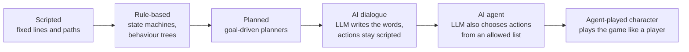

# Module 13: AI-driven characters

- **Goal:** decide whether and how a game's NPCs and companions should be driven by AI agents (for example large language models), and design the persona, limits and fallbacks that keep such a character in character, in canon and safe.
- **Prerequisites:** [11 — One hero, a party or a roster](11-party-roster.md), [12 — Enemies, bosses and encounters](12-enemies-encounters.md), [20 — Narrative design for a live game](20-narrative.md), [28 — Prototyping, playtesting and metrics](28-prototype-playtest.md).
- **Simulation:** none
- **Facts checked:** October 2026 (prices, rules and product status change; re-check before reuse)

## In short

NPC behaviour has always been a spectrum: fixed scripts, state machines and behaviour trees, planners, and now **AI agents** that generate dialogue or choose actions at run time. AI agents add open conversation, memory, reactions and characters that play like players. They also add risks: leaving the persona or the canon, breaking quests, being exploited, being unreadable, producing unsafe text, and costing money and time per interaction. As of October 2026 the technology is mostly **experimental or limited-mode** in commercial games, so the practical design is a **hybrid**: the story, rewards and rules stay scripted, and the AI works inside a narrow, guarded space with scripted fallbacks. AI can also play as a **test bot** that behaves like a player to check content and balance. The worked example designs the course game's AI-driven companion with a persona sheet, an action list and fallbacks.

## 1. The concept

### 1.1 Terms

| Term | Meaning |
|---|---|
| **NPC** | A non-player character, controlled by the game |
| **Companion** | An NPC that fights or travels with the player (module 11) |
| **Scripted NPC** | An NPC whose lines and actions are written in advance |
| **Behaviour tree / state machine** | Hand-built decision structures for NPC actions |
| **Planner (GOAP)** | A system that chooses a sequence of actions to reach a goal |
| **LLM (large language model)** | A model that generates text from a prompt |
| **AI agent** | A program that perceives the game state, decides and acts, often with an LLM making some of the decisions |
| **Persona sheet** | The written description of a character that the AI must follow |
| **Canon limit** | What the character may and may not say or know, set by the lore bible (module 20) |
| **Guardrail** | A rule or filter that restricts what the AI can say or do |
| **Fallback** | A scripted line or action used when the AI fails, is slow or is blocked |
| **Latency** | The delay between a player's input and the character's reply |
| **Test bot** | An automated player used to test a game |

### 1.2 The spectrum of NPC intelligence

Left to right, the character gets **more open** and the designer gets **less control**. Every step to the right needs more guardrails.

## 2. The player's view

What AI-driven characters promise a player:

| Promise | Example | Motivation served (module 01) |
|---|---|---|
| **Conversation** | "I can ask the blacksmith anything" | Discovery, Fantasy |
| **Memory** | "She remembers what I did last week" | Story, Community |
| **Reaction** | "He comments on my armour and my kill" | Fantasy |
| **A teammate that plays like a person** | "My companion revives me and calls out threats" | Community, Autonomy |
| **Uniqueness** | "My game differs from yours" | Discovery |

What players do not forgive: a character that **forgets the quest**, says **something that contradicts the world**, is **slow** to answer, or can be **tricked into breaking the game**. The test for a player is "does this make the world feel more alive, or more broken?"

How it fits the loops of [module 03](03-vision-pillars-loops.md): conversation sits in the **session** loop (between fights); a companion's actions sit in the **core** loop (inside fights), where latency and readability matter most.

## 3. The design space

### 3.1 The spectrum compared

| Level | What the AI controls | Strength | Weakness | Fit |
|---|---|---|---|---|
| **Scripted** | Nothing | Total control; zero cost per interaction | Repetition; no reaction | Story beats, tutorials, quest givers |
| **Rule-based** (state machines, behaviour trees) | Actions by rules | Predictable; easy to tune; cheap | Rigid; needs many rules | Enemies, companions in combat |
| **Planned** (goal planners) | A chosen action sequence | Flexible; reads as intelligent | Harder to debug | Complex enemies, simulation NPCs |
| **AI dialogue** | Words only | Open conversation | Can leave persona or canon | Flavour NPCs, tavern talk |
| **AI agent** | Words and some actions from an allowed list | Reactive, memory, initiative | Cost, latency, risk | Companions, simulation characters |
| **Agent-played character** | Whole play style | Plays like a person | Fairness, trust, cost | Test bots, practice partners, optional co-players |

### 3.2 What AI-driven characters add

| Addition | How | Limit |
|---|---|---|
| **Free conversation** | The model generates replies from the persona and context | Needs guardrails; cost per turn |
| **Memory** | Stored events retrieved into each prompt | Memory can drift or contradict the world |
| **Reaction to the world** | The character receives a short description of game state | Adds latency; must stay cheap |
| **Initiative** | The character starts talking or acting | Players may feel nagged |
| **Characters that play like players** | The agent perceives, plans and acts in the game | Fairness, anti-cheat, expected skill |

### 3.3 Public examples and research

| Source | What it is | Status (as of October 2026) |
|---|---|---|
| **"Generative Agents" (Park et al., 2023)** | A research paper: 25 LLM-driven characters in a small town sandbox, with a memory stream, reflection and planning. They coordinated a party invitation without being scripted to | **Research.** Not a shipped game |
| **Ubisoft "NEO NPC" (GDC 2024)** | A player-facing prototype built with Inworld AI and NVIDIA: NPCs with backstory and conversation style, voice input, relationship levels | **Prototype shown publicly.** Ubisoft reported challenges such as models not acting as intended and input needing filters |
| **NVIDIA ACE autonomous game characters (CES 2025)** | A toolkit presented with small language models for characters that perceive, plan and act like players | **Technology announced;** adopted in some products |
| **PUBG Ally (Krafton, with NVIDIA ACE)** | A "co-playable character" teammate that talks by voice, finds and shares loot, drives and fights. Testing started in early 2026 and an "Ally Duo" arcade beta ran 17 June to 1 July 2026 | **Public beta, limited mode;** not the main game mode (per the publisher's press release) |
| **inZOI "Smart Zoi" (Krafton)** | Life-simulation characters driven by AI goals and reactions | **Announced in 2025;** check the game's current status |
| **Classic AI** | Behaviour trees and planners; the "AI Director" of *Left 4 Dead* (2008) changes pacing by watching players | **Shipped for many years** |

State clearly to your team: **shipped and mainstream** = scripted, behaviour trees, planners; **limited modes and betas** = AI companions and AI dialogue; **research** = fully generative societies. As of October 2026, no large online RPG relies on AI-written quest dialogue for its main story (inferred from public announcements; check before relying on it).

### 3.4 Design risks

| Risk | What goes wrong | Why it matters |
|---|---|---|
| **Out of character** | The NPC speaks in the wrong voice or mood | Breaks the persona (module 20) |
| **Out of canon** | The NPC invents facts or reveals a hidden twist | Contradicts the bible; spoils open threads |
| **Breaking the story** | The NPC gives away the quest solution or offers a different one | Players skip the designed experience |
| **Unfairness** | A companion carries or ruins a fight; players with better prompts get more | Breaks the reward rules (module 11, 17) |
| **Exploitation** | Players trick the NPC into giving items, currency or secrets ("jailbreak" or prompt injection) | Breaks the economy (module 16) |
| **Predictability and readability** | Combat actions that vary freely cannot be read or learned | Violates "fights you can read" (module 12) |
| **Moderation and safety** | The model produces offensive text or handles toxic player text | Legal and platform rules; children's rules |
| **Cost per interaction** | Each reply costs money | A free-to-play game must budget it per player |
| **Latency** | A reply takes seconds | Unusable in combat; awkward in talk |
| **Inconsistency across players** | Two players hear different "facts" | Shared-world games need one truth |
| **Localisation** | The model may not match approved translations or names | Module 20 glossary |
| **Data and privacy** | Player text and voice are sent to a service | Needs a policy and consent |

### 3.5 Guardrails

| Guardrail | What it does |
|---|---|
| **Persona sheet** | Written voice, wants, flaws and example lines; part of every prompt |
| **Canon limits** | A list of what the character knows, does not know and must never say; hidden twists are not in the prompt at all |
| **Allowed actions** | The agent chooses only from a fixed list (follow, heal, warn, fetch); the game checks every action |
| **Rules above the AI** | Fight outcomes, rewards and quest states are computed by the game; the AI cannot change them |
| **Input filters** | Detect abuse, injection attempts and personal data before the prompt |
| **Output filters** | Check for banned words, canon violations and length |
| **Short memory with approved facts** | Only logged, verified events are remembered |
| **Scripted fallbacks** | A bark or a scripted line when the AI is slow, blocked or off-persona |
| **Budgets** | A cap on tokens, replies per hour and cost per player |
| **Logging and review** | Samples of conversations are reviewed by a person; failures become test cases |
| **A kill switch** | Remote switch back to scripted mode without a patch |

**The rule of thumb:** *the AI chooses words and picks among options; the game owns the facts, the rewards and the rules.*

### 3.6 AI-played characters as a testing aid

An agent that **plays the game like a player** can help test (module 28):

| Use | How | Limit |
|---|---|---|
| **Content smoke tests** | A bot walks a quest or dungeon and reports where it gets stuck | Finds blockers, not fun |
| **Balance checks** | Many bot runs of a fight give clear-time and death statistics (module 25) | Bots do not play like skilled or casual humans unless trained for it |
| **Different skill levels** | Bots tuned as "novice" or "expert" give a range | The model of a novice is an assumption |
| **Load and economy tests** | Bots act in the economy to expose exploits (module 16) | They find loops, not feelings |
| **Regression** | The same bot runs after each patch | Needs maintenance |

Public precedent: research agents have played complex games at high level (for example OpenAI Five for *Dota 2* and DeepMind's AlphaStar for *StarCraft II*), but they were research projects, not products; most studios use scripted or reinforcement-learned bots for testing. **A bot is a measuring tool, never a replacement for human playtests** (module 28).

### 3.7 How to choose

| If the character is... | Use | Because |
|---|---|---|
| **A quest giver for a main story beat** | Scripted | The designer must control facts and pacing |
| **An enemy in combat** | Behaviour tree or planner | Readability matters most |
| **A tavern NPC who adds colour** | AI dialogue with guardrails and a scripted fallback | Low stakes; adds life |
| **A companion in a game that sells togetherness** | Rule-based combat; AI dialogue for banter only | The companion must stay weaker than humans (module 11) |
| **A companion in a solo game** | AI agent with an action list | Reaction and memory are the product |
| **A simulation character** | AI agent with memory | The emergent stories are the product |
| **A test partner** | Test bot | A tool, not a player-facing feature |
| **A character in a game for children** | Scripted, or heavily filtered AI dialogue only after review | Safety rules |
| **A shared world with one canon** | AI dialogue only where it cannot change shared facts | Everyone must see one truth |

## 4. Tuning and pitfalls

### 4.1 Rules of thumb

- Start **scripted**, then add AI where a playtest shows the character feels dead.
- **Keep AI out of the core combat loop** unless actions come from a short, readable list.
- Give the AI **no power over rewards, items or progress.**
- Put a **budget** on every AI reply (tokens, time, cost) and a fallback for each.
- **Test with adversarial players.** Ask testers to break the character in 15 minutes.
- **Review logs** weekly; every failure becomes a rule or a test.
- **Tell the player** the character uses AI and what happens to their text (privacy and trust).

### 4.2 Metrics and signals

Invented targets for the course game, to be set from playtests:

| Metric | Target | Signal if missed |
|---|---|---|
| **Reply latency (dialogue)** | Under 2 s for 95% of replies | Players lose the thread |
| **Companion action latency (combat)** | Under 0.3 s from the decision to the action (module 06 feel targets) | The companion looks broken |
| **Off-persona or off-canon rate** | Under 1% in reviewed samples | Persona sheet or filter too weak |
| **Fallback rate** | 1–5% (more means a poor model or poor prompts; zero means the fallback is untested) | Check logs |
| **Exploit reports** | 0 that give items, currency or progress | Rules above the AI are not enforced |
| **Cost per player-hour** | Under an agreed cap (invented: 0.5% of average revenue per hour, set with module 17) | The feature is unsustainable |
| **Playtest** | Testers can say what the character wants and how they sound | Persona unclear |
| **Companion fairness** | Group clear time with a companion stays slower than with a human of the same level | The companion replaces people (module 11) |

### 4.3 Classic failures

- **The chatty guide.** An NPC that says anything and nothing; players stop reading.
- **The leaked twist.** The model reveals a secret from its prompt or from the model's training.
- **The free item.** A clever player talks an NPC into a reward.
- **The slow companion.** Replies arrive after the fight is over.
- **The drifting persona.** After a long conversation the character's voice changes.
- **The cost surprise.** A feature that is cheap in a test and costly with a million players.
- **The forgotten fallback.** The AI service is down and the character is silent.
- **The uncanny teammate.** A companion plays too well or too oddly, and players distrust it.

## 5. Worked example

The course game: a free-to-play online RPG for PC and mobile (module 11's party of up to four players; module 20's story; module 17's shop rules). We add an **AI-driven companion** in one place and an AI-flavoured NPC in another. All values are invented, and this is a feature spec, not a decision to ship AI in the first release.

### 5.1 Intent

Give **Dev** (short phone sessions) and **Lena** (story and discovery) a character who makes the world feel alive when no party is available, without weakening pillar 3 (**Stronger together**) or pillar 2 (**Fights you can read**), or breaking the story of module 20.

### 5.2 The companion: Pip, the Lodge scout

| Field | Entry |
|---|---|
| **Role in story** | A young Lodge scout assigned to the player in Ashfall Vale; a minor character with no hidden plot role |
| **Role in play** | An optional solo-play helper in field content and normal dungeons (module 11 option b); never in Ember mode, the world boss, or PvP |
| **Persona sheet** | Age 19; short, eager sentences; asks questions; afraid of the dark but never says so; keeps notes in a small book; speaks of the Lodge with pride |
| **Voice samples** | "Eyes up, I saw something move." / "Is it always this warm near the Foundry?" / "I wrote that down." / "Watch the left. Ground slam." / "I'm fine. Really." |
| **Wants** | To earn a place in the Lodge |
| **Knows** | Public Book One facts up to the player's current region; the names in the glossary |
| **Does not know** | Kael's identity before the Vale story reveal; the Heart's secrets; anything about the season plot (these are not in the prompt) |
| **Never says** | Spoilers, real-world references, advice about the shop, items for sale, any promise of rewards, personal data requests |

### 5.3 What is scripted and what is AI

| Layer | Driven by | Why |
|---|---|---|
| **Story beats and quest lines** | **Scripted** | Facts and pacing must be controlled |
| **Combat actions** | **Rule-based** (behaviour tree): follow, attack the player's target, warn on an enemy telegraph, revive a downed ally | Readability; guaranteed latency; fairness |
| **Banter and reactions** | **AI dialogue** from the persona sheet, within a short list of topics (the area, the enemy, the player's class, the weather) | Adds life; low stakes |
| **Memory** | A short list of **logged events** (zones cleared, bosses killed, class chosen) in a fixed schema | Verified facts only; no free-form memory |
| **Rewards and items** | **Game only** | The AI has no access to inventory or economy |
| **Callouts in combat** | **Scripted barks**, chosen by the rule-based layer | Under 0.3 s, always correct |

The AI never selects combat actions. In the first version it only writes the **banter**.

### 5.4 Companion strength and fairness

| Parameter | Value | Reason |
|---|---|---|
| **Output** | 40% of a player's damage; basic revive with a longer channel | Weaker than humans (module 11 suggests 60% in another variant; here a pure helper) |
| **Party slot** | Fills one slot only when the party is smaller than three | Humans always take priority |
| **Reward share** | None; loot and XP are the player's | A companion is not a farm |
| **Group bonus** | Not counted as a player for module 11's scaling | Keeps "stronger together" true |
| **Dungeon use** | Normal difficulty only | Ember mode needs humans |

### 5.5 Allowed actions, filters and fallbacks

| Item | Rule |
|---|---|
| **Allowed actions** | Follow, attack the player's target, hold position, warn, revive. Nothing else |
| **Input filter** | Player chat to Pip is passed through the same moderation as chat (module 22); messages with personal data, links or injection patterns are not sent to the model and Pip answers with a scripted line |
| **Output filter** | Max 20 words, no names outside the glossary, no numbers about rewards; failed output is replaced |
| **Fallback lines** | A set of 40 scripted barks by area and state; used when the model is slow (over 2 s), blocked or off, or the player is offline |
| **Offline mode** | If the AI service is unavailable, Pip runs on barks only; combat is unchanged (the combat layer is not AI) |
| **Cost cap** | At most 12 AI banter replies per hour per player, then barks |
| **Logging** | Reviewed samples (with consent in the privacy policy); every failure becomes a test line |
| **Kill switch** | A server flag turns the AI banter off for all players without a patch |
| **Disclosure** | The settings screen says "Pip's banter is generated by AI" and has an off switch; text typed to Pip is handled as in the privacy policy |
| **Persona drift test** | Pre-release: 200 scripted test conversations, 5 with adversarial prompts; target under 1% off-persona |

### 5.6 The tavern NPC: Hob at the Stilt Market

A low-stakes example. **Hob** is a Gloam Fen barkeeper who can chat about the town's rumours.

| Field | Entry |
|---|---|
| **Format** | AI dialogue only, no actions |
| **Knowledge** | A fixed "rumour list" of 30 approved lines; he may rephrase them, not add new ones |
| **Stops at** | Any question about plot twists: scripted reply "Ask Marshal Holt, not me" |
| **Rewards** | None |
| **Fallback** | One of the 30 rumour lines, unchanged |

### 5.7 The test bot

| Field | Entry |
|---|---|
| **Purpose** | Run each dungeon after every build and report clear time, deaths and blockers (module 28) |
| **Skill levels** | Three profiles: novice (late dodges), standard, expert |
| **How it plays** | Uses the same inputs as a player through the client; no special access |
| **Output** | Clear-time and death tables per boss and class, compared with module 08 and 25's bands |
| **Limit** | Not used as a stand-in for human playtests of feel, readability or fun |

### 5.8 What was cut

- **AI-written quest dialogue.** Story and facts stay scripted (module 20).
- **AI-chosen combat actions.** Readability and latency (module 12).
- **Companions in Ember mode, the world boss and PvP.** Humans only.
- **Free-form memory.** Only logged, verified events.
- **Voice conversation.** Extra cost, moderation and privacy work.
- **AI characters that sell things.** Violates pillar 4.

### 5.9 For another kind of game

| Game type | What changes |
|---|---|
| **Single-player story RPG** | A companion may use more AI dialogue and memory; the plot still scripted; a smaller moderation scope |
| **Life simulation** | AI agents with memory are the main feature; allow wide freedom but keep a world-rule layer |
| **Competitive game** | AI teammates and practice partners; no AI in ranked modes unless clearly marked |
| **Hero-collection game** | AI banter per hero could add personality; every hero needs a persona sheet and a cost budget |
| **Game for children** | Scripted or strongly filtered; legal review first |

## Key takeaways

- NPC intelligence is a **spectrum** from scripts to agents; each step to the right adds openness and removes control.
- As of October 2026, AI-driven characters are **experimental or limited-mode** in commercial games; scripted, behaviour-tree and planned NPCs are the shipped standard.
- AI adds **conversation, memory, reaction** and **characters that play like players**, but brings risks: out of character, out of canon, exploits, unreadable actions, safety, cost and latency.
- **The AI chooses words and picks among options; the game owns the facts, rewards and rules.**
- Use **guardrails**: persona sheet, canon limits, allowed actions, input and output filters, budgets, logging and a kill switch, and a **scripted fallback for every case**.
- Keep AI **out of the readable core combat loop**, and out of anything that grants rewards.
- **Test bots** that play like players are a useful measuring tool, never a replacement for human playtests.

## Further reading

- Park et al., "Generative Agents: Interactive Simulacra of Human Behavior" (2023): https://arxiv.org/abs/2304.03442
- Ubisoft, "Ubisoft unveils NEO NPC, a generative AI prototype" (GDC 2024): https://news.ubisoft.com/en-us/article/5qXdxhshJBXoanFZApdG3L
- NVIDIA, "NVIDIA Redefines Game AI With ACE Autonomous Game Characters": https://www.nvidia.com/en-eu/geforce/news/nvidia-ace-autonomous-ai-companions-pubg-naraka-bladepoint/
- Krafton, "Krafton reveals playtest plans for PUBG Ally, built with NVIDIA ACE": https://press.krafton.com/KRAFTON-REVEALS-PLAYTEST-PLANS-FOR-PUBG-ALLY-BUILT-WITH-NVIDIA-ACE
- Wikipedia, "Behavior tree (artificial intelligence, robotics and control)": https://en.wikipedia.org/wiki/Behavior_tree_(artificial_intelligence,_robotics_and_control)
- Wikipedia, "Goal-oriented action planning": https://en.wikipedia.org/wiki/Goal-oriented_action_planning
- Wikipedia, "Left 4 Dead" (the AI Director): https://en.wikipedia.org/wiki/Left_4_Dead
- OpenAI, "OpenAI Five": https://openai.com/index/openai-five/
- DeepMind, "AlphaStar: Mastering the real-time strategy game StarCraft II": https://deepmind.google/discover/blog/alphastar-mastering-the-real-time-strategy-game-starcraft-ii/
