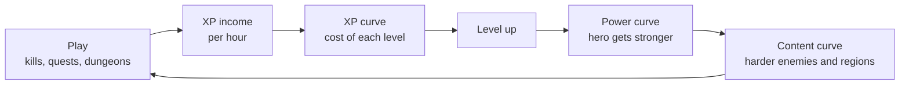

# Module 14: Progression and power curves

- **Goal:** design how a hero gets stronger over time: choose an XP curve shape, derive the XP table from a time budget, keep hero power in step with content difficulty, mix vertical and horizontal progression, and plan catch-up, level caps and cap raises for a game that runs for years.
- **Prerequisites:** [03 — Vision, pillars and loops](03-vision-pillars-loops.md), [08 — Combat design](08-combat.md), [09 — Classes and roles](09-classes-roles.md).
- **Simulation:** `examples/14-curves/` (`dotnet test examples/14-curves`)
- **Facts checked:** October 2026 (prices, rules and product status change; re-check before reuse)

## In short

**Progression** is how a player's hero becomes more capable as they play. Three curves have to be designed together: the **XP curve** (what each level costs), the **power curve** (what each level gives) and the **content curve** (how hard the world is at each point). The cleanest way to build the first one is backwards: decide how long each level should take, then compute the XP bar from how much XP the player earns per hour. Beyond levels, a live game adds other tracks (gear, class choices, collections) and has to plan for catch-up, a level cap that will one day move, and the slow growth of power across years ("power creep"). The worked example is the course game's level curve for levels 1 to 50 (about 25 hours), the hour at which each region, Path and Mastery arrive, and a power curve that stays within 0.95 to 1.35 times the content in every region.

## 1. The concept

### 1.1 Terms used in this module

| Term | Meaning |
|---|---|
| **Experience points (XP)** | A number earned by playing (kills, quests, dungeons) that fills a bar |
| **Level** | A step on a ladder; filling the XP bar moves the hero up one step |
| **XP-to-next** | The size of the bar at level L: the XP needed to go from L to L+1 |
| **XP curve** | XP-to-next plotted against level |
| **XP income** | XP earned per hour of play at a given level |
| **Power** | A single number for how strong a hero is in a fight (damage and survivability together) |
| **Power curve** | Hero power plotted against level and time played |
| **Content curve** | The power of the enemies the player meets at each level |
| **Power ratio** | Hero power divided by content power. 1.0 is an even fight |
| **Vertical progression** | Numbers go up: more power than before |
| **Horizontal progression** | Options go up: more choices, but not more power |
| **Level cap** | The highest level a hero can reach |
| **Power creep** | The slow drift of new content being stronger than old content, so old content gets trivial |

### 1.2 Three curves, one job

The three curves are separate documents and separate owners, but they must be read side by side.



| Curve | Question | Owner in the course game |
|---|---|---|
| **XP curve** | How long does the next level take? | This module |
| **Power curve** | How much stronger am I after it? | This module (level power), module 15 (gear power) |
| **Content curve** | What am I asked to beat, and when? | Modules 08 and 12 (enemies), 15 (regions) |

If the power curve outruns the content curve the game becomes trivial. If it lags, the game is a wall. The XP curve decides how fast the player moves along both.

## 2. The player's view

The player does not see a curve. They feel **rhythm**: how often something new arrives and how much effort sits between two arrivals.

- **Power** (module 01): "I am visibly stronger than an hour ago." A level-up, a new skill and a new item each tell the player this. The reward must be *felt*, not just a number.
- **Completion**: the XP bar is the smallest progress bar in the game, filled again and again. A full-screen "Level up" moment is the cheapest satisfying beat a designer owns.
- **Challenge**: the player wants to be slightly under-prepared for the next boss, then prepared after some effort. A power ratio of 1.0 to 1.3 gives exactly that feeling.

The core loop of [module 03](03-vision-pillars-loops.md) ends in "loot and XP"; the session loop ends in "turn in and upgrade". Progression is what turns many loops into a story of getting stronger. Two moments hurt it: **dead levels** (levels that give nothing but a bigger number, and take long) and **walls** (a stretch where the bar barely moves). Both are visible in a table of minutes per level, before any player sees them.

## 3. The design space

### 3.1 XP curve shapes

| Shape | Formula for XP-to-next at level L | XP at level 50 vs level 10 | Feel | Used when |
|---|---|---|---|---|
| **Linear** | `a + b × L` | 4.8× (with a = 250, b = 600) | Each level takes about as long, if income is flat | Short games, mobile, flat income |
| **Polynomial** | `base × L^k` (k between 1.5 and 2.5) | 11× at k = 1.5, 25× at k = 2, 56× at k = 2.5 | Levels get gradually longer; easy to tune with one number | Most online RPGs |
| **Exponential** | `base × g^(L−1)` (g about 1.05 to 1.15) | 133× at g = 1.13 | Slow late levels; very hard to keep sane across 50 levels | Idle games, games with a hard soft cap |
| **Piecewise / table** | A hand-made table, or different formulas per band | Anything | Tuned per band: fast tutorial, steady middle, slow end | Production games; usually a formula first, then hand edits |

Rules of thumb:

- Polynomial with **k between 1.5 and 2.5** covers most of the useful range. The exponent is the single "steepness" knob (see the experiment in section 5.8: 1.8 to 1.9 stretches 25 hours into 35).
- A pure exponential grows so fast that a small change of `g` changes the game's length by an order of magnitude. Use it only over a short range.
- Almost every shipped curve is **hand-corrected**: a formula gives the shape, and a designer overrides single levels (a level that should be quick, a level that gates a feature). This is the common practice in the published advice on XP thresholds (see Further reading).
- Some games keep the bar fixed and instead **reduce the XP given by the same task** as the hero levels up. It gives the same result with a different data shape.

### 3.2 Deriving the XP table from a time budget

The most useful habit is to **design the time, then compute the XP**.

1. Set a total: "about 25 hours to the cap" (a vision and market decision, not a formula).
2. Split it across **regions** or level bands: "region 1 about 2.5 hours, region 4 about 9".
3. Within a band, choose how minutes per level change: usually a gentle rise ("each level takes a little longer than the last").
4. For every level, estimate **XP per hour** (section 3.3).
5. Compute: `XP-to-next(L) = minutes(L) / 60 × XP per hour(L)`.
6. Fit a formula to the result (or keep the table), then round to friendly numbers.

A level-20 example from the worked example: the target is 29 minutes, XP income at level 20 is 113,490 per hour, so the bar is `29/60 × 113,490 ≈ 54,900`. The formula `250 × L^1.8` gives 54,928 at level 20, so the formula is a good fit to the plan.

Why backwards? A formula-first table produces "whatever hours it produces", and the designer finds out in playtests. A time-first table makes pacing a **decision**, and the XP bar becomes a consequence. It also keeps working when income changes: if a quest pays more XP, the bar is recomputed, and the hours stay as designed.

### 3.3 Where XP income comes from

| Source | Typical share | Notes |
|---|---|---|
| **Kills** | 40% to 70% | The loop of module 03; value grows with enemy level |
| **Quests** | 20% to 50% | Fixed rewards; a quest is "worth N kills". Quests are also where story and levels meet |
| **Dungeons and bosses** | Large per hour, small per run | Elites and bosses count as 10 and 40 kills in the worked example |
| **Exploration, discovery** | Small | Rewards curiosity (persona Lena) |

Two helpers keep income honest:

- **Level-difference modifier.** Kill XP is scaled by `enemy level − hero level`. Over-level enemies pay a little more (capped); under-level enemies pay less and less. Without it players farm trivial enemies for safe XP, or run past the world to fight enemies far above them.
- **Income must grow slower than the bar.** Minutes per level are `bar ÷ income`. If both grow at the same rate, every level takes the same time. If the bar grows faster (here as `L^1.8` against `L^1.2` for kill XP), levels get longer. If income grows faster, levels get *shorter* as the hero levels, which is the "linear curve" failure shown in the simulation.

### 3.4 Power curves against content

| Model | Idea | Strength | Cost |
|---|---|---|---|
| **Fixed content bands** | Each zone has a level; stronger hero means easier zone | The player feels growth; the world feels like a place | The player outgrows zones; old content empties out |
| **Level scaling** | Enemy level follows the hero (within a range) | Everything stays relevant; players of any level can group | Growth is hidden: "I levelled but enemies also grew" |
| **Sawtooth** | Fixed bands, with new gear and zones resetting the ratio | Repeating cycles of struggle and mastery | Needs good gear and region timing |

Most online RPGs use **fixed bands** in the levelling game and sawtooth pacing across regions, and add scaling in places where groups of different levels meet (dungeons, events). The **power ratio** `r = hero power ÷ content power` is the number to tune:

- `r` near 1.0: tense fights; the TTK bands of [module 08](08-combat.md) apply as written.
- `r` between 1.1 and 1.3: comfortable; the player feels strong.
- `r` below 0.9: the player hits a wall; above 1.35 the fights are over before they begin.

Because hero power is damage × survivability, a power ratio of `r` changes **time-to-kill by about `1/√r`**, not `1/r` (offence and toughness each grow by `√r`). This is the link to module 08's TTK bands.

### 3.5 Vertical versus horizontal progression

| | Vertical | Horizontal |
|---|---|---|
| **What grows** | Numbers: level, gear stats | Options: skills, builds, cosmetics, titles, sideways unlocks |
| **Motivation served** | Power, Completion | Fantasy, Discovery, Community |
| **Pace** | Time-gated; the player can see the next step | Choice-gated; the player decides what to chase |
| **Live-game cost** | Needs new tiers over time; old content ages | No power inflation, but each option needs new content and balance |
| **Risk** | Treadmill: new gear invalidates old effort | Players want a number to grow; can feel flat |

Real games sit on a spectrum. *World of Warcraft* adds new gear levels and, at times, new max levels with each expansion (a vertical model). *Guild Wars 2*'s wiki states that it deliberately has no gear treadmill: the driving philosophy is horizontal progression, with a fixed top gear class (Ascended and Legendary) and growth through unlocks (as of October 2026). Most games mix the two: **vertical for the climb, horizontal for the long run**.

### 3.6 Multiple progression tracks

A single bar is rarely enough for years of play. Common tracks:

| Track | Type | Typical pace |
|---|---|---|
| **Character level** | Vertical, time-gated | Minutes to hours per level |
| **Gear** | Vertical, luck and effort | Days to weeks per upgrade |
| **Class advancement** (skills, a path, a mastery) | Horizontal choice, level-gated | A few in the whole game |
| **Account collections** (cosmetics, titles, pets) | Horizontal | Months |
| **Social** (guild level, reputation) | Mixed | Weeks to months |

Design rule: **each track should give a reward at its own cadence**, and the player should always have something close. If the level bar is the only thing near, the game depends on a single curve. A **reward cadence** chart (a line per track, a dot per reward, over the hours of play) shows gaps: long stretches with no dot are where players drift away.

### 3.7 Catch-up, rested and level-difference mechanics

Players who start late, play less often, or add a second hero would face a long climb. Common tools:

| Tool | How it works | Cost or risk |
|---|---|---|
| **Rested XP** | A pool fills while the player is away; kills give bonus XP until it is spent. In *World of Warcraft*, one bubble (10% of the current level) fills per 16 hours in an inn or city or 64 hours logged off elsewhere, up to 15 bubbles, and gives double XP from kills (as of October 2026) | Rewards infrequent players; can feel like a reason to log off |
| **Second-character bonus** | A hero on an account that already has a max-level hero levels faster | Alts level quickly; the first hero's path is the "real" one |
| **Level-range grouping** | Players of a wide level range can party and still earn | Needs scaling in the dungeon |
| **Level boosts** | A paid or granted jump to a higher level | Easy to sell, which can conflict with a fairness pillar |
| **Over-level penalty** | Kill XP falls as the hero outlevels an enemy | Stops farming trivial enemies; adds a number to explain |

Rested XP is the most-copied: it is invisible to a player who plays daily, and a gift to a player who plays rarely, so it fits both heavy and light personas.

### 3.8 Level caps and cap raises in a live game

A live game with a cap must decide, years ahead, what happens when the cap moves.

| Option | What happens | Example |
|---|---|---|
| **Never raise it** | Endgame growth is horizontal and gear-based | *Guild Wars 2* (as of October 2026, per its wiki: no gear treadmill) |
| **Raise it with each expansion** | New levels, new zones, new gear tier | *World of Warcraft* for most of its history |
| **Squish** | Re-number levels to a lower range; the content curve is flattened | *World of Warcraft* in 2020 cut the cap from 120 to 60 so that levelling is shorter and each level gives something |
| **Soft cap with extra points** | After the cap, XP gives a second bar (points, ranks) | Many games' "paragon" style systems |
| **Seasonal reset** | Heroes or gear restart each season | Seasonal games |

Raising the cap by N levels on the same curve makes the **new levels longer than the old ones** (the curve keeps rising), so cap raises usually come with a new region, a new gear tier, and a rule such as "at most 10 levels, and at most about a third of the base game's hours". Section 5.6 shows the arithmetic for the course game.

### 3.9 Power creep

**Power creep** is what happens when each new piece of content is a little stronger than the last. It starts with a good reason (the new thing must feel like an upgrade) and ends with the old content being irrelevant.

A simple model: if each of three expansions raises the gear ceiling by 20% and old content is never retuned, then old content sits at `1.25 × 1.2³ ≈ 2.2` times its original power ratio. A fight designed for an even match is now a formality.

Tools against it:

- **Retune old content** (a pass at every expansion), and **scale** it for groups.
- Add **horizontal** growth in place of vertical (new options at equal power).
- **Squish** numbers periodically, so the top is not unreadable (damage in the millions).
- Make a new tier worth just **slightly more** than the best old tier (a new generation's fresh item roughly equals the last generation's maxed item), so old effort is worth something.

### 3.10 How to choose

| If your game is... | Choose |
|---|---|
| Mobile, short sessions, daily play | Polynomial XP with a short total (10 to 20 h), strong rested or daily bonus, many visible rewards per session |
| PC or cross-platform online RPG, years of content | Time-budgeted polynomial XP, fixed bands, a sawtooth gear curve, plan a cap raise or a horizontal endgame |
| Skill-based action game | Few levels, horizontal growth, power ratio close to 1 |
| Idle or incremental | Exponential, soft caps, prestige resets |
| A game that promises "no treadmill" | Fixed cap, fixed top gear tier, horizontal growth, accept slower content cadence |

## 4. Tuning and pitfalls

### 4.1 Setting the numbers

1. **Start from the total hours**, then split by region (heavier toward the end: players accept longer levels once invested).
2. **First minutes are free.** The first levels should take 3 to 5 minutes, and for the first hour a level-up at least every 15 minutes.
3. **No dead levels.** Every level should unlock a skill, a choice, an item slot, a zone or a feature, or be short. In the course game, skills arrive at levels 1, 2, 4, 6, 9, 12, 15 and 18.
4. **Minutes per level rise slowly** after the opening levels; a jump above about 25% between neighbouring levels is likely to be felt as a wall (a rule of thumb, check it in playtests).
5. **Check the time to the first Path or class choice**: it should come at the end of the first long evening or two.
6. **Test with the groups too.** Fast group XP can halve the planned hours; decide whether the budget is solo or the median mix.

### 4.2 Signals that something is wrong

| Observation | Likely cause |
|---|---|
| Players leave at the same level (a bump in the funnel chart) | A wall: bar too long, a gate quest too hard, a region change without new gear |
| Median hours to cap far from plan | Income model is wrong (kills per hour, quests per hour) |
| Most XP comes from one activity | The loop is a grind; others pay too little |
| Players farm low-level enemies | Level-difference modifier too soft |
| The time between rewards on any track is over 2 hours | A dead stretch; add or move rewards |
| Elite and boss TTK falls under the band for geared players | Power ratio above its band |

### 4.3 Classic failures of a long-running game

- **The treadmill:** each expansion adds a gear tier and resets effort, and players feel punished for having played.
- **The cap-raise cliff:** new levels are slower than old ones and nothing explains why.
- **Levelling that gets in the way:** a 50-level climb that repeats for every new hero, with no catch-up.
- **Rested XP as a shackle:** players log in only to spend the pool, not to play.
- **Trivialised early game:** over-levelled players run through old zones, which are now empty. Scaling or catch-up groups refill them.
- **A formula nobody can read:** an XP curve with six parameters that only its author understands. Keep it a table.

### 4.4 Connecting to a simulation

A spreadsheet or a script that takes the XP curve, the income per region and a few anchors (cap, Path level) and prints **hours per level and per region** answers most of the questions above before a single quest is written. The worked example below is that script.

## 5. Worked example

### 5.1 Intent and rules

The course game must give "a 15-minute session always a visible reward" (pillar 4) and be reachable in **about 25 hours** to level 50 (solo baseline).

| Rule | Value |
|---|---|
| Level range | 1 to 50; 49 level-ups |
| Regions by levels played | Region 1: 1 to 11. Region 2: 12 to 24. Region 3: 25 to 37. Region 4: 38 to 49. Level 50 is the cap |
| XP curve | `XP-to-next(L) = round(250 × L^1.8)` |
| Kill XP (on-level enemy) | `round(8 × L^1.2)` |
| Quest XP | 25 × kill XP at the quest's level |
| Dungeon XP | Trash 1 kill, elite 10, boss 40, completion bonus 25 (one quest); a 15-minute dungeon is worth 117 kills (32 + 20 + 40 + 25) |
| Level-difference modifier (kill XP, enemy level − hero level) | +3 or more 1.10; +1 or +2 1.05; 0 1.00; −1 0.90; −2 0.80; −3 0.60; −4 0.40; −5 0.20; −6 or lower 0.10 (never zero) |
| Solo baseline income | Region 1: 200 kills and 8 quests per hour. Region 2: 240 and 6. Region 3: 260 and 6. Region 4: 300 and 4 |

A 15-minute dungeon in region 3 pays 468 kill-equivalents per hour against 410 for the field mix (about 14% more, solo), and the party bonus of module 11 comes on top.

Quest XP is 50% of income in region 1, 38% in region 2, 37% in region 3 and 25% in region 4: story first, then the kill loop takes over.

### 5.2 The level curve

All values come from the simulation (section 5.7).

| Level | XP to next | Kill XP | XP per hour | Minutes in this level |
|---|---|---|---|---|
| 1 | 250 | 8 | 3,200 | 4.7 |
| 5 | 4,530 | 55 | 22,000 | 12.4 |
| 10 | 15,774 | 127 | 50,800 | 18.6 |
| 15 | 32,727 | 206 | 80,340 | 24.4 |
| 20 | 54,928 | 291 | 113,490 | 29.0 |
| 25 | 82,079 | 381 | 156,210 | 31.5 |
| 30 | 113,962 | 474 | 194,340 | 35.2 |
| 35 | 150,405 | 570 | 233,700 | 38.6 |
| 40 | 191,270 | 669 | 267,600 | 42.9 |
| 45 | 236,441 | 771 | 308,400 | 46.0 |
| 49 | 275,609 | 854 | 341,600 | 48.4 |

Hand check at level 20: kill XP is `8 × 20^1.2 = 291`; income is `291 × (240 kills + 6 quests × 25) = 291 × 390 = 113,490`; the bar is `250 × 20^1.8 = 54,928`; so the level takes `54,928 ÷ 113,490 = 0.484 h = 29 minutes`. Total XP from 1 to 50 is about 4.96 million.

What the table says about the design:

- **Levels 1 to 6 take 15 minutes or less**, so every short session of a new player ends with a level-up (pillar 4).
- At every level, **a 15-minute session fills at least 31% of the bar** (level 49) and 52% at level 20, so the XP bar always visibly moves.
- Minutes per level rise by 2 to 6 minutes every five levels (most steeply in the first ten), and from level 7 on no level is more than 10% longer than the one before (the opening levels start from 4.7 minutes, so their steps are larger): no wall.

### 5.3 Pacing by region, and where Path and Mastery land

| Region | Levels | Hours | Reached at hour | Minutes per level (first to last) |
|---|---|---|---|---|
| Region 1 | 1 to 11 | 2.4 | 0.0 | 4.7 to 19.8 |
| Region 2 | 12 to 24 | 5.9 | 2.4 | 21.3 to 32.3 |
| Region 3 | 25 to 37 | 7.8 | 8.3 | 31.5 to 39.9 |
| Region 4 | 38 to 49 | 9.0 | 16.0 | 41.6 to 48.4 |
| **Total to level 50** | | **25.1** | | |

Reach-hours of the class milestones (module 09):

| Milestone | Level | Reached at hour | In session terms |
|---|---|---|---|
| Skills 2, 4, 6, 9 | 2, 4, 6, 9 | 0.1, 0.35, 0.74, 1.5 | Inside the first evening |
| Skills 12, 15, 18 | 12, 15, 18 | 2.4, 3.5, 4.8 | Evenings two and three |
| **Path** | 20 | **5.7** | End of about the third 2-hour evening |
| **Mastery** | 40 | **17.4** | Two levels into region 4, about 70% of the way |
| Cap | 50 | 25.1 | |

This shows one **dead stretch**: between Path (hour 5.7) and Mastery (hour 17.4) there is no class unlock for about 11.7 hours. The plan fills it with region changes (hours 8.3 and 16.0), a new gear wave at each region, and the dungeons of module 18; the stretch is a candidate to cut by moving the third class quest, if playtests show drop-off in region 3.

A group lowers the hours. Applying the 1.84× reward rate of [module 11](11-party-roster.md) to all XP gives `25.1 ÷ 1.84 = 13.6 hours` for a full-time four-player party. That is an upper bound (quest XP does not scale with a party), and it is why 25 hours is called the **solo baseline** and why main-story quests are level-gated.

### 5.4 Power curve against the four regions

Hero power = **level power** × **gear factor**. Level power is `1 + 0.12 × (L − 1)`: 1.00 at level 1, 2.08 at 10, 3.28 at 20, 4.48 at 30, 5.68 at 40, 6.88 at 50. Content power is the level power of the **quest hub** the hero is working in; hubs sit every three levels (1, 4, 7, and so on). The **gear factor** is the typical player's gear strength, relative to an Uncommon set at +0 with a level-appropriate item level (module 15 supplies the ingredients).

| Region | Gear factor at entry | Gear factor at exit | Typical gear at exit |
|---|---|---|---|
| Region 1 | 1.00 | 1.20 | Uncommon and Rare, upgrades to about +3 |
| Region 2 | 0.95 | 1.25 | Rare with upgrades to about +4 or +5 |
| Region 3 | 0.95 | 1.25 | The same, plus the first dungeon Epic pieces |
| Region 4 | 0.95 | 1.30 | Rare +7 or an Epic +3 |

The sawtooth comes from new regions: the first quest rewards of a new region replace most slots, so upgrade investment restarts. The resulting power ratio at selected levels:

| Level | 1 | 5 | 10 | 11 | 12 | 20 | 24 | 25 | 30 | 37 | 38 | 40 | 49 | 50 |
|---|---|---|---|---|---|---|---|---|---|---|---|---|---|---|
| **Ratio** | 1.00 | 1.18 | 1.18 | 1.27 | 1.06 | 1.19 | 1.34 | 0.95 | 1.14 | 1.25 | 0.97 | 1.01 | 1.30 | 1.32 |

The ratio is held between **0.90 and 1.35** at every level; the minimum is 0.95 (a new region's first level) and the maximum 1.34 (the last level of region 2).

Link to [module 08](08-combat.md): its TTK bands assume `r = 1.0`. At `r = 1.35` time-to-kill is about `1 ÷ √1.35 = 0.86` of the value: the Arcanist's elite fight, 57.4 s at `r = 1.0` (band 50 to 85 s), takes about 49 s, a hair under the band. This is accepted: it is the reward for being over-geared, and it only happens at the very top of the band. At `r = 0.9` the same fight takes about 60 s.

Under power creep (section 3.9): the cap raise of section 5.6 must either bring back `r` to the band for old content with a catch-up gear wave, or accept that old content is "farm content", not "challenge content".

### 5.5 Tracks and catch-up in the course game

| Track | Type | Cadence in the course game |
|---|---|---|
| Level | Vertical | A level-up every 5 to 50 minutes (section 5.2) |
| Skills and Path and Mastery | Horizontal choice | Eight skills by hour 4.8, Path at 5.7, Mastery at 17.4 |
| Gear | Vertical (module 15) | New items every few dungeon runs; upgrades in days |
| Account | Horizontal | Titles, cosmetics, collections (module 24) |
| Guild | Social | Guild goals (module 22) |

Catch-up rules:

| Rule | Value |
|---|---|
| **Rested XP** | The pool fills by 1% of the current level's XP bar per offline hour, capped at 72% of a bar (72 hours offline). While the pool lasts, all XP earned is +50%, and the bonus is taken from the pool |
| **Second hero** | A hero on an account that already has a level-50 hero earns +50% XP up to level 30 |
| **Group range** | Party members must be within 3 levels of the dungeon's recommended level (module 11) |
| **Over-level penalty** | The level-difference table of section 5.1 |
| **XP is never sold** | The convenience pass does not change XP (the final decision belongs to module 17) |

Worked example of rested XP, for Dev (the 15-to-25-minute player) at level 20: after 23 hours offline the pool is `0.23 × 54,928 = 12,633` XP. A 20-minute session earns `113,490 ÷ 3 = 37,830` XP, so the 50% bonus would be 18,915; the pool is smaller, so the session pays 12,633 extra, **a third more**. For Mira (a 2-hour evening) after 22 hours offline, the pool is 12,084 against 226,980 earned, a 5% top-up. Rested XP is a gift to the light player and nearly invisible to the heavy one.

### 5.6 The cap-raise plan

If the cap moves from 50 to 60 on the same curve, ten more levels cost **8.6 more hours** (about a third of the base game), with the last new level at about 54 minutes (the curve keeps rising). The plan for a cap raise:

- At most **10 levels** per expansion, and a target of at most 9 hours for them.
- A new region, a new gear wave (module 15) and a new dungeon tier come with the levels.
- The old regions get a catch-up pass (second-hero bonus and group-range rules continue to apply), so a returning player does not repeat 25 hours at full length.
- If levelling becomes too long after several raises, the game does a **squish** (renumber levels) instead of letting the bar grow forever.

### 5.7 The simulation

`examples/14-curves/` reads `curves.json` (the XP curve and constants, kill and quest income, the four regions with their kills and quests per hour, target hours, Path and Mastery levels, the rested-XP rules and the power plan) and reports hours per level and per region. The formulas are in `Curves.cs`: XP-to-next (linear, polynomial or exponential), `HoursForLevel = XP-to-next ÷ XP per hour`, the reverse function `DeriveXpTable` (from a minutes-per-level budget), rested XP, and the power ratio.

Run it:

```bash
dotnet test examples/14-curves
```

Key tests and their numbers:

| Test | What it asserts |
|---|---|
| Xp table hand check | Level 1 bar 250, level 20 bar 54,928, kill XP 291, quest XP 25 × 291 |
| Hours per level | Level 20 earns 113,490 XP per hour and takes 29.0 minutes; level 1 takes 4 to 6 minutes; level 49 takes 45 to 55 |
| Total time | 25.1 hours, within 25 ± 1; every region within 0.4 hours of its target (2.5, 6.0, 7.5, 9.0) |
| Milestones | Path (level 20) at hour 5.2 to 6.2 (actual 5.7); Mastery (level 40) at 17 to 19 (actual 17.4) |
| Group pace | At a 1.84× rate the climb takes 13.6 hours |
| Derive from a budget | A flat 20 minutes per level gives a level-20 bar of 37,830 XP; re-measuring gives back 49 × 20 minutes |
| Curve kinds | Linear total is under 6 hours and levels get shorter; exponential (g = 1.13) is under 4 hours and lopsided |
| Rested XP | 12,633 XP for 23 offline hours at level 20; the cap is 72% of a bar |
| Power ratio | Between 0.90 and 1.35 for all 50 levels; 1.00 at level 1; drops at region entry |

### 5.8 Tuning experiments

Each experiment changes one number in `curves.json`:

| Change | Result | Reading |
|---|---|---|
| XP exponent 1.8 to **1.9** | Total 25.1 to **34.8 h**; region 4 from 9.0 to 13.1 h; level 49 from 48 to 71 minutes | One tenth of exponent adds ten hours, nearly all at the end |
| XP exponent 1.8 to **1.7** | Total 18.1 h; level 49 takes 33 minutes | Faster; level 1 is unchanged (the curve is 250 × 1^k) |
| Cap 50 to **60** with the same curve | Adds **8.6 h** | A third of the base game for 10 levels |
| Reward rate **1.84×** (full party) | 13.6 h | The solo baseline of 25 h is not the party experience |
| Linear XP (250 + 600 × L) | 5.4 h; levels get shorter as the hero rises | Income grows faster than a linear bar |
| Exponential XP (g = 1.13) | 3.1 h; level 49 takes 15× longer than level 10 | Needs a growth rate matched to income |

### 5.9 What was cut

- **Dynamic XP rates by time of day or event** (module 29 may add double-XP weekends).
- **XP from crafting or gathering**: no crafting or gathering loop in the first release.
- **Prestige or paragon levels** after 50: module 24 designs the endgame bar.
- **A level boost**: see the fairness pillar.
- **Per-level stat points the player assigns** (module 09's class-based growth is fixed; the reason is in module 25).

### 5.10 How the design would differ for another kind of game

- **Mobile idle or hero-collection game:** many hero levels, XP spent from items, a soft power cap per rarity; progression is a currency sink, so numbers belong to the economy (module 16).
- **Action game with a fixed cap and no levels:** gear and skills carry all progression; the "level curve" becomes a gear tier table and a skill unlock schedule.
- **Seasonal game:** all heroes reset each season; levels are fast (a few hours) and the real curve is gear and builds.
- **Games that control several characters:** every character has its own curve; a shared account level or a catch-up bonus for new characters becomes important, because the total hours multiply.

## Key takeaways

- Design **three curves together**: XP (cost), power (reward) and content (demand); the power ratio between hero and content is the number to tune.
- **Derive the XP table from a time budget**: `XP-to-next = minutes per level ÷ 60 × XP per hour`. A formula is just a good fit to that plan.
- Use a **polynomial** `base × L^k` with k between 1.5 and 2.5; the exponent is the steepness knob, and a 0.1 change can add ten hours.
- Income must grow **slower than the bar**, or levels get shorter as players climb; check minutes per level, not XP.
- Plan **tracks and cadence**: no dead levels, a visible reward in every 15-minute session, and a check for long stretches between rewards.
- Offer **catch-up** (rested XP, second-hero bonus) and decide early what a **cap raise** or **squish** will look like; a cap raise on the same curve adds about a third of the base game for ten levels.
- Watch for **power creep**: three small gear raises can double the power ratio of old content unless it is retuned.

## Further reading

- Pascal Luban, "Quantitative Design: How to Define XP Thresholds" (Game Developer, 2018): https://www.gamedeveloper.com/design/quantitative-design---how-to-define-xp-thresholds-
- Warcraft Wiki, "Rested" (accumulation rates and bonus): https://warcraft.wiki.gg/wiki/Rested
- Guild Wars 2 Wiki, "Endgame" (no gear treadmill; horizontal progression): https://wiki.guildwars2.com/wiki/Endgame
- WCCFtech, "WoW Shadowlands level squish detailed" (cap from 120 to 60 and the reasons): https://wccftech.com/wow-shadowlands-level-squish-something-cool/
- Wikipedia, "Experience point": https://en.wikipedia.org/wiki/Experience_point
