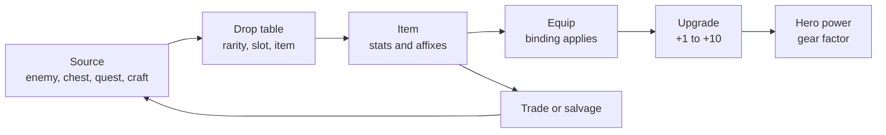

# Module 15: Itemization and loot

- **Goal:** design the items a hero wears and how they are found, improved and exchanged: slots and stats, rarity, affixes, item level and gear score, sets, upgrades, drop tables with bad-luck protection, crafting, trading and binding, and check the odds with numbers before players do.
- **Prerequisites:** [08 — Combat design](08-combat.md), [11 — One hero, a party or a roster](11-party-roster.md), [14 — Progression and power curves](14-progression.md).
- **Simulation:** `examples/15-loot/` (`dotnet test examples/15-loot`)
- **Facts checked:** October 2026 (prices, rules and product status change; re-check before reuse)

## In short

**Itemization** is the design of equipment: what slots a hero has, what stats an item gives, how rare it is, how it is improved and how a player gets it. It is a slow second progression track next to levels ([module 14](14-progression.md)) and a major reason players come back. The main choices are how much of an item is fixed and how much is random, how upgrades fail, how drops are rolled and how bad luck is capped. The rule that matters most is **never stack independent random layers**: every extra roll multiplies the spread of outcomes, and the unluckiest players suffer most. The worked example designs the course game's eight gear slots, four rarity tiers, a ten-step upgrade system and one dungeon's drop table, and the simulation shows that bad-luck protection cuts the 99th-percentile wait from 244 runs to 83, and that a protection charm halves the expected cost of a +10 upgrade.

## 1. The concept

### 1.1 Terms used in this module

| Term | Meaning |
|---|---|
| **Item** | A piece of equipment a hero wears in a **slot** |
| **Stat** | A number an item adds to the hero: Attack, Max HP, Guard (defence), crit chance and so on |
| **Stat budget** | The total value an item of a given item level is allowed to carry |
| **Rarity** | A tier label (Common to Epic) that sets how many extras an item has and how often it drops |
| **Affix** | An extra property on an item (a bonus stat); fixed or randomly chosen and rolled |
| **Roll** | A random draw: the value inside an affix's range, or a draw from a drop table |
| **Item level (ilvl)** | The level an item is made for; sets its stat budget |
| **Gear score** | One number that sums the power of everything a hero wears |
| **Set** | A group of items that give bonuses when several are worn together |
| **Upgrade / enhancement** | Spending resources to raise an item's level (+1, +2, ...), often with a chance of failure |
| **Drop table** | The data that says what an enemy or chest can give and how likely each item is |
| **Weight** | A relative number in a drop table; probability = weight ÷ sum of weights |
| **Pity / bad-luck protection** | A rule that raises the chance (or guarantees the item) after enough misses |
| **Binding** | A rule that ties an item to a hero or account so it cannot be traded |

### 1.2 The item lifecycle



Each box is a design decision, and each arrow can be tuned: the table decides how often a drop is good, upgrades decide how long an item stays useful, and trade or salvage decide what happens to the drops the player cannot use.

## 2. The player's view

Items serve four of the motivations of [module 01](01-player-experience.md):

- **Power**: "this is better than what I wear" is a clear, immediate reward.
- **Excitement**: the moment a chest opens is one of the strongest beats in an online RPG. The colour, the sound and the delay all matter.
- **Completion**: sets and collections give a visible goal.
- **Community**: showing and trading items is social, and the "wrong class drop" problem is a social problem (module 11).

A drop must always answer three questions at a glance: **Is it better than mine? Can I use it? What would it cost me to improve?** Anything that forces the player to leave the game and read a spreadsheet has failed. The rule from the course game's pillar 4 applies: the player's time is respected, so the worst-case wait for a chased item must have a **ceiling**.

## 3. The design space

### 3.1 Slots and stats

| Choice | Options | Cost |
|---|---|---|
| **Number of slots** | 4 to 6 (simple, mobile), 8 to 12 (classic), 15+ (deep) | More slots means more drops, more sorting, more tuning |
| **Stat model** | A few **primary** stats (Attack, HP) plus **secondary** stats (crit, speed) | Fewer stats are easier to read and balance; many stats make stat-sticking a minigame |
| **Class-bound or open** | Items restricted by class, or a stat that only helps the right class | Class-bound drops are cleaner ("smart loot" only rolls what the hero can use) but double the item list |
| **Flat or percent** | +40 Attack versus +4% Attack | Flat grows with level and needs retuning; percent scales and needs caps |
| **One weapon, or weapon plus off-hand** | | Each extra slot adds a build question and a drop to chase |

### 3.2 Rarity tiers

A rarity tier is a promise about **how special** an item is. Most games use four to seven tiers with a colour code that players learn in minutes (grey/white, green, blue, purple, orange are common conventions).

| Design | What rarity changes | Example use |
|---|---|---|
| **Power tiers** | The stat budget grows with rarity | Simple games: a rare is just stronger |
| **Slot tiers** | Rarity sets the **number of affixes** (more slots to roll) | Many action RPGs; *Path of Exile* uses rarity to set how many affixes an item may have (as of October 2026, per its wiki) |
| **Named / unique** | A few items have a fixed, special rule | Items that change a skill; build-defining |

Rule of thumb: **each tier should drop about 3 to 5 times less often than the one below**, and the top tier should be the one the player thinks about.

### 3.3 Affixes: fixed versus random

| | Fixed | Random |
|---|---|---|
| **What it is** | The item's stats are always the same | Affixes are drawn from a pool, and each value is rolled in a range |
| **Strengths** | Clear, learnable ("the Cinder helm") | Variety, endless chase, build crafting |
| **Weaknesses** | Collecting ends | "Best in slot" becomes a perfect roll nobody can reach; item lists become unreadable |
| **Tuning knobs** | None | Pool size, number of affixes, **roll width** (how far the value can differ) |

The key knob is **roll width**. A roll of 50% to 150% of the average makes a perfect item twice as strong as a poor one, and drives a gambling chase. A roll of 90% to 110% makes it nearly cosmetic. Many games also gate affixes by **item level**: an affix that needs item level 40 cannot appear on item level 30 (as of October 2026, *Path of Exile* works this way), so the pool grows as the player progresses.

### 3.4 Item level and gear score

**Item level** says "this item is made for this level". It is set by the source (an enemy of level 32 drops item level 32 items) and sets the stat budget. **Gear score** is the sum of item power across slots, shown as one number. It is a **summary** for the player and a tool for the designer (recommended gear for a dungeon).

Pitfalls: a gear score used as a **gate** ("need 500 to join") turns a number into a rule, excludes players who are strong in ways the number does not see, and invites inflation. The course game shows gear score and recommends it, but never gates on it (module 11 uses a level range only).

### 3.5 Set items

A **set** bonus rewards wearing several pieces of one family.

| Design | Bonus is | Cost |
|---|---|---|
| **Stat bonus** (2 and 4 pieces: more HP, more crit) | Extra power for a complete set | Players wear a set even when single pieces are better; sets must not exceed the budget of the best mix |
| **Build bonus** (changes how a skill works) | A reason to build around the set | Needs balance work per class |
| **Collection bonus** (account-wide, cosmetic) | Rewards completion without power | No power, so a weaker chase |

Keep set bonuses on the same budget as other items, and decide whether they are **additive** with other buffs (module 10 caps additive damage-dealt buffs at +40%).

### 3.6 Enhancement and upgrade systems

An **upgrade** raises an item by steps (+1, +2, ...). Three designs exist:

| Design | Rule | Feel |
|---|---|---|
| **Deterministic** | Pay the cost, always succeed | Predictable; a pure sink; no drama |
| **Probabilistic** | Each step has a success chance | Exciting, with a bad-luck problem |
| **Hybrid** | Safe early steps, risky late steps, plus protection | Common in online RPGs |

On **failure**, games choose from: nothing but the cost is lost; the item drops a level; the item is destroyed. The harsher the penalty the more players buy **protection items**, and the more a failure feels like a loss rather than a retry. A **pity** rule (a failure counter that eventually forces success) caps the wait. For example, *Lost Ark* tracks an "Artisan's Energy" meter per item: each failed honing attempt raises it, and when it reaches 100% the next attempt is guaranteed (as of October 2026, per community guides).

**The cost of an upgrade with a chance `p` and a cost `c` per attempt:**

- Attempts until success follow a **geometric distribution**: mean `1/p`; the chance of needing more than `n` attempts is `(1 − p)^n`.
- Expected cost of a step with no penalty: `c / p`.
- If a failure also drops the item one level, the step must first be re-climbed: `T(i) = (c + (1 − p) × T(i − 1)) / p`, where `T(i)` is the expected cost to go from level `i − 1` to `i`.
- With a pity rule that guarantees success after `K` failures, the mean number of attempts is `(1 − (1 − p)^(K+1)) / p`. For `p = 0.55` and `K = 3`: `(1 − 0.45⁴) / 0.55 = 1.74` attempts instead of `1.82`.

**Never stack independent RNG.** Every random layer multiplies the number of possible outcomes. Suppose a perfect piece needs a drop (1 in 53 runs), three affixes each in the top tenth of a wide range (1 in 1,000) and a lucky upgrade climb: the chase is 1 in 53,000 runs before the upgrade, and the player who needs it has no way to plan. If one layer must be wide (drops), keep the others narrow (affix rolls 90% to 110%) or deterministic (early upgrades), and put a ceiling on the wide one.

### 3.7 Drop tables

A drop table is a chain of draws: **source → does it drop? → rarity → slot → item → affixes**.

| Method | How it works | Notes |
|---|---|---|
| **Weights** | Each entry has a weight; probability = weight ÷ total | Easy to edit: changing one weight changes the rest |
| **1-in-N** | A fixed chance, such as 1 in 50 | Easy to read for players; same maths as a weight |
| **Guaranteed floor** | A chest always gives at least a given rarity | Removes dead runs |
| **Pity / bad-luck protection** | The chance rises after a number of misses; run N always drops | Caps the worst case |
| **Targeted** | A token, shop or crafting recipe buys a chosen item | A deterministic path next to the random one |

**The maths of a 1-in-N drop.** With chance `p` per run, the mean is `1/p`; the chance of still being without it after `n` runs is `(1 − p)^n`. After one mean wait, 37% of players are still without the item; after two means 14%; after three means 5%. The 90th percentile is `ln(0.1) / ln(1 − p)` runs, about 2.3 times the mean. Averages hide the unlucky tail, so designers look at **percentiles** and not at the mean.

**Personal versus shared loot** (module 11): with **shared** drops (need/greed, master loot) a party gets one drop and divides it; with **personal** loot each player rolls separately (*World of Warcraft*'s group loot offers personal loot as an option, as of October 2026). Personal loot removes quarrels but multiplies the item supply by the party size, so the economy must assume four rolls per run, not one.

### 3.8 Crafting

| Type | What the player does | Design role |
|---|---|---|
| **Recipe crafting** | Spends materials for a known item | A deterministic floor next to drops |
| **Reroll** | Replaces one affix with a new random one (*Path of Exile*'s Chaos Orb, as of October 2026, re-rolls one random affix) | Fixes bad rolls; a sink |
| **Salvage** | Breaks items into materials | Turns unusable drops into progress; keeps duplicates useful |
| **Targeted crafting** | Chooses an affix or a result | Strong; needs a high cost so it does not replace drops |

### 3.9 Trading and binding

| Rule | Meaning | Effect |
|---|---|---|
| **Bind on pickup** | Tied to the hero when obtained | Protects the economy; players cannot fix a wrong drop |
| **Bind on equip** | Tied when worn; tradeable before | Gives trade value to unused drops |
| **Account-bound** | Shared between a player's heroes | Helpful with a second hero |
| **Trade window** | A limited time to trade a bound item to a party member | A safety valve for the wrong class. *World of Warcraft* personal loot is tradeable to group members when it is not an item-level upgrade for the owner (as of October 2026) |
| **Free trade** | Sold or exchanged at will | A real market (module 16) |

### 3.10 How to choose

| If your game is... | Choose |
|---|---|
| Mobile, short sessions | Fewer slots (4 to 6), fixed stats, upgrade with a pity counter, gear as hero progression |
| PC online RPG, years of play | 8 to 12 slots, 4 to 5 rarity tiers, narrow random affixes, hybrid upgrades with protection, bind on equip, personal boss loot |
| Hardcore or build-crafting game | Wide random affixes, deep crafting, a market; accept an expert-only chase |
| Competitive or fairness-driven | Standardised gear in PvP; items matter for PvE |
| A game with "no gear treadmill" | A fixed top tier, with growth in options (module 14) |

## 4. Tuning and pitfalls

### 4.1 Setting the numbers

1. **Start from the time a chase should take.** Pick a target such as "a chosen dungeon piece in a month of weekly clears" and work back to the chance per run.
2. **Look at the tail, not the mean.** Choose the percentile you protect (P99) and set the pity so the worst case is acceptable.
3. **Make the stat budget follow the level curve.** `budget(ilvl) = base × level power(ilvl)` (module 14) so gear scales with the hero.
4. **Rarity is a multiplier, not a lottery.** The gap between the best and worst item of a slot at the same level should be about 30% to 50%.
5. **Upgrade rates from expected attempts.** Choose the number of attempts a typical player will accept at each step (about 1 to 2 for early steps, 3 to 10 for late ones) and compute `p`.
6. **Price from the sink you need.** Costs are placeholders until the economy (module 16) says how much gold must leave the game per player per week.

### 4.2 Signals that something is wrong

| Observation | Likely cause |
|---|---|
| Players stop running a dungeon after "enough" runs | The chase has no end or the next piece is too far away; add pity |
| One item is worn by everyone | Too much budget in one slot or one set |
| Players sort inventory for minutes | Too many low-value drops; raise the floor or auto-salvage |
| Support tickets about upgrade failures | Penalty too harsh or odds not shown |
| Gear score is the only way to join groups | Gear score became a gate |
| Gold or materials pile up unused | Sinks too weak (module 16) |
| Very high upgrade levels held by few players | Too long a tail; add protection or pity |

### 4.3 Classic failures of a long-running game

- **Loot inflation:** every expansion adds a tier, so old drops are scrap (see power creep in module 14).
- **Random on random on random:** the chase has no ceiling for the unlucky.
- **The one correct item:** a build needs one specific drop with no deterministic path.
- **Hidden odds:** players find real rates by data-mining. In many places odds for paid random items must be disclosed (see module 11), and good practice is to publish all odds.
- **Failure that feels like theft:** destruction on failure, with no protection or pity.
- **Binding that traps:** drops that can never be traded or used, so players feel their time was wasted.

### 4.4 Connecting to a simulation

The odds are small, but their consequences are not. A seeded simulation plus the closed form (they must agree) shows how long players really wait and what a rule changes. The worked example ends with that.

## 5. Worked example

### 5.1 Slots and stats

Eight slots. Each slot has a **weight** (its share of the set's stat budget; weights sum to 9.0).

| Slot | Weight | Share of set budget | Base stat |
|---|---|---|---|
| Weapon | 2.0 | 22% | Attack |
| Chest | 1.4 | 16% | Max HP and Guard |
| Legs | 1.2 | 13% | Max HP and Guard |
| Head | 1.0 | 11% | Max HP and Guard |
| Ring | 1.0 | 11% | Attack and Precision |
| Hands | 0.8 | 9% | Max HP and Guard |
| Feet | 0.8 | 9% | Max HP and Guard |
| Necklace | 0.8 | 9% | Attack and Precision |

Stats map to [module 08](08-combat.md): Attack is damage per hit, Max HP and Guard (defence) are survivability, Precision is crit chance. Item drops are **class-filtered** ("smart loot"): a Cleric only rolls items a Cleric can use.

**Stat budget:** `budget(ilvl) = round(10 × (1 + 0.12 × (ilvl − 1)))`, which is 10 times the level power of module 14: item level 10 gives 21, level 32 gives 47, level 50 gives 69. Item level equals the source's level (an enemy, a dungeon's recommended level or a quest).

### 5.2 Rarity and affixes

| Tier | Affixes | Item power | Notes |
|---|---|---|---|
| Common | 0 | 0.90 | Salvage material |
| Uncommon | 1 | 1.00 | The reference: a full Uncommon set at +0 has a gear factor of 1.00 (module 14) |
| Rare | 2 | 1.10 | What most players wear in the climb |
| Epic | 3 | 1.20 | Dungeon sets and elite rarities |

An affix is worth about **0.10 of the item's base** on average, so item power = `0.90 + 0.10 × number of affixes`. Each affix is drawn from a pool of five (Power, Vitality, Guard, Precision, Ferocity) filtered by slot, no duplicates on one item, and rolls between **90% and 110%** of its average. The roll is deliberately narrow: a perfect Epic is at most about 2.5% stronger than an average one. The chase is for the **piece**, not for the roll.

### 5.3 Item power and gear score

`item power = slot weight × budget × rarity power × (1 + 0.025 × upgrade level)`, rounded per item. A full set of eight items at item level 32 (budget 47):

| Set | Gear score | Relative to the Uncommon set |
|---|---|---|
| Common +0 | 381 | 0.90 |
| Uncommon +0 | 424 | 1.00 |
| Rare +0 | 464 | 1.09 |
| Rare +4 | 511 | 1.21 |
| Epic +0 | 507 | 1.20 |
| Epic +10 | 633 | 1.49 |

Hand check, a Rare +4 weapon: `2.0 × 47 × 1.10 × 1.10 = 113.7`, so 114. These are the gear factors of [module 14](14-progression.md): region exits at about 1.20 to 1.30 are Rare sets with +3 to +7, and **Epic +10 at 1.5 is the ceiling of one item generation**, reached after the journey.

**New generation rule.** A new item level ten levels higher is worth about 1.25 times the budget, so a fresh Epic of the next generation roughly equals a maxed Epic of the old one. Upgrade effort is not wasted at once; it is replaced slowly.

### 5.4 The upgrade system ("Tempering")

Ten steps. Step `i` takes the item from `+(i−1)` to `+i`.

| Step | Success | Gold per attempt | On failure |
|---|---|---|---|
| 1, 2, 3 | 100% | 50, 60, 70 | n/a |
| 4 | 85% | 100 | Nothing lost |
| 5 | 75% | 130 | Nothing lost |
| 6 | 65% | 170 | Nothing lost |
| 7 | 55% | 220 | Nothing lost |
| 8 | 45% | 280 | **Item drops one level** unless a charm is used |
| 9 | 35% | 350 | Drops one level unless a charm is used |
| 10 | 25% | 450 | Drops one level unless a charm is used |

The **Tempering Charm** costs 400 gold per attempt (only needed on steps 8 to 10). An item is never destroyed. Each level adds **+2.5%** to the item's power, so +10 is +25%. Gold figures are **placeholders** for an item of level 32: [module 16](16-economy.md) balances prices and scales them by item level.

Expected cost to climb from +0 to +N (closed form; the simulation agrees to within 3%):

| Target | No charm | With charm | Notes |
|---|---|---|---|
| +3 | 180 | 180 | All certain |
| +5 | 471 | 471 | No loss possible |
| +7 | 1,133 | 1,133 | Last "safe" step |
| +8 | 2,244 | 2,644 | The charm is not worth it yet |
| +9 | 5,307 | 4,786 | Break-even |
| +10 | 16,298 | 8,186 | The charm halves the cost |

Hand check of step 8 without a charm: the step before costs `220 / 0.55 = 400`, so `T(8) = (280 + 0.55 × 400) / 0.45 = 1,111`. With a charm: `(280 + 400) / 0.45 = 1,511`. At step 10 the numbers part: `T(10) = 10,988` without a charm against `3,400` with one.

The tail from a seeded simulation (20,000 climbs):

| Target +10 | Mean | P90 | P99 |
|---|---|---|---|
| No charm | about 16,200 gold | about 34,700 | about 66,800 |
| With charm | about 8,160 gold | about 13,000 | about 19,900 |

The charm cuts the **99th percentile by 3.4 times**: a very unlucky player pays 66,800 without it and 19,900 with it.

### 5.5 One dungeon's drop table

The Cinder Forge dungeon (item level 32; its boss is the Cinder Warden of [module 12](12-enemies-encounters.md); a 15-minute run is 8 packs of four trash, 2 elites and the boss, per module 08).

| Source | Gear drops? | Common | Uncommon | Rare | Epic |
|---|---|---|---|---|---|
| Trash enemy (32 per run) | 8% (1 in 12.5) | 70 | 25 | 5 | 0 |
| Elite (2 per run) | 40% | 30 | 45 | 24 | 1 |
| **Boss chest** (1 per player) | 100% | 0 | 0 | 85 | 15 |

The columns are **weights**: an elite's gear is Epic with probability `1 / 100 = 1%`. The boss chest has a **guaranteed floor**: every player gets at least a Rare, and the roll decides Rare or Epic (`15 / 100 = 15%`). The chest is **personal** (module 11). Trash and elite Epics are generic items; only the boss chest drops the **Cinder Forge set** (eight Epic pieces, one per slot, class-filtered).

A run therefore gives about `32 × 0.08 + 2 × 0.40 = 3.4` extra gear drops (mostly Common and Uncommon, auto-salvaged to materials), about 1.2 Rares and 0.16 Epics per player.

**Chasing one set piece.** The chest drops Epic with 15%, then picks 1 of 8 pieces, so a specific piece is `0.15 / 8 = 1.875%` per run, 1 in 53.

| | Mean runs | Median | P90 | P99 |
|---|---|---|---|---|
| No protection | 53.3 | 37 | 122 | 244 |
| **With protection** | 38.2 | 37 | 69 | 83 |
| Bonus roll (2 rolls per run, no protection) | 26.9 | 19 | 61 | 122 |

The protection rule: **after 50 runs without the piece, the chance rises by 0.5 percentage points each run, and run 100 always drops it.** The mean falls by 28%; the P99 falls by **66%** and has a ceiling of 100. Hand check: without protection, 37% of players are still without the piece after 53 runs, about 13% after 106, 5% after 160; with protection nobody is without it after 100 runs.

Under **personal loot** the odds are per player: in a party of four each member rolls, so the chance that at least one of four gets a specific piece in a run is `1 − 0.98125⁴ = 7.3%`, but each player's own chase is unchanged. The faucet scales with party size (module 16).

### 5.6 Sets, crafting, trading

**Cinder Forge set** (8 pieces, one per slot): 3 pieces: +5% Max HP; 6 pieces: +10% damage dealt. The damage bonus is **additive** with other damage buffs under the +40% cap of module 10. The set sits inside the Epic budget (1.20); the bonus is the reason to wear it, not extra power above the ceiling.

**Crafting:**

| Function | Rule |
|---|---|
| Salvage | Any unused item becomes materials (module 11: duplicates convert to materials); Common and Uncommon can be auto-salvaged |
| Craft | Known recipes make a **Rare** item of the player's choice of affixes, never Epic; the deterministic floor |
| Reroll | One affix on an item can be rerolled for gold and materials; the count of affixes never changes |

**Binding and trading** (module 11's rules, with the other sources added):

| Item | Binding |
|---|---|
| Boss chest gear | Bound to the hero on pickup; **one** party trade within **2 hours**, and only if it is not better than what the receiver wears |
| Elite, trash and field drops | Bind on equip; free trade through the trade window until worn |
| Quest rewards | Bound to the hero |
| Crafted items | Bind on equip |
| Anything upgraded to +1 or higher | Bound; this keeps upgrade effort out of the market |
| Materials, charms | Tradeable |

Module 16 sets market fees and limits; module 17 decides what the shop may never sell (no gear power).

### 5.7 The simulation

`examples/15-loot/` reads `loot.json`: rarity tiers, the slot weights, the stat budget, the three drop sources, the dungeon (target piece, pieces count, rolls per run, pity rule) and the upgrade steps (rate, gold, charm price, the step from which failure drops a level). The code is in `Gear.cs` (item power and gear score), `Drops.cs` (exact distribution and simulation of runs to a target) and `Upgrades.cs` (closed form and simulation of the climb).

```bash
dotnet test examples/15-loot
```

Key tests and their numbers:

| Test | What it asserts |
|---|---|
| Item power and gear score | Budget 47 at item level 32; a Rare +4 weapon is 114; Uncommon +0 set 424; Rare +4 set 511; Epic +10 set 633 |
| Drop probabilities | Boss chest Epic 15%; elite Epic 1%; per roll for one piece 1.875% |
| Chase without protection | Mean 53.3 runs; P50 37; P90 122 (equals `ln(0.1) / ln(1 − p)` rounded up); P99 244; a 40,000-run simulation is within 3% |
| Chase with protection | Mean 38.2; P90 69; P99 83 and never above 100; P99 is less than 40% of the unprotected one |
| Bonus roll | With 2 rolls per run: 3.72% per run, mean 26.9, median 19, P90 61, P99 122 |
| Upgrade closed form | +3 costs 180; step 8 costs 1,111 without a charm; the simulation agrees to 3% for +10 |
| Charm | +10 costs 16,298 without and 8,186 with; the P99 with a charm is under 40% of the P99 without it |
| Tighter pity | A hard pity at 60 runs gives mean 35.9, P99 60 |
| Cheaper charm | At 200 gold the charm path to +10 costs 6,371, and it already beats no charm at +8 |

### 5.8 Tuning experiments

| Change | Result | Reading |
|---|---|---|
| Bonus roll for beating a par time (`rollsPerRun` 1 to 2) | Chase mean 53.3 to 26.9 runs, P90 122 to 61 | A bonus roll halves the chase with no change to the weights |
| Hard pity at 100 runs lowered to 60 | Mean 35.9 runs, P90 and P99 both 60 (the ceiling) | A tighter ceiling for a 6% lower mean; the item feels less rare |
| Remove the charm | +10 costs 16,298 and the P99 is 66,800 | A drop-back penalty without protection is a tax on the unlucky |
| Charm price 400 to 200 | +10 costs 6,371 | A cheaper charm shifts the break-even down to step 8 |

### 5.9 What was cut

- **Sockets and gems:** another random layer; revisit if builds need more depth.
- **Item destruction on failure:** too harsh for pillar 4.
- **Wide affix rolls and a "perfect roll" chase:** keeps the chase to one layer.
- **A gear-score gate for dungeons:** gear score is shown but never required.
- **Transmog and cosmetic gear:** module 17.
- **An auction house:** the market design is module 16's.

### 5.10 How the design would differ for another kind of game

- **Mobile hero-collection game:** equipment is minor; the "item" is the hero, and pity applies to hero draws (module 11).
- **Action roguelite:** items last one run; the drop table is the whole build.
- **Hardcore loot-driven game:** wide random affixes, deep crafting, a player market; accept an expert-only endgame.
- **Competitive PvP:** gear is equalised in the mode; items only matter for PvE.

## Key takeaways

- An item is **a slot, a stat budget, a rarity and a few affixes**; keep the budget tied to the level curve and the rarity a multiplier.
- **Never stack independent RNG.** Keep one layer wide (drops), the others narrow or deterministic, and cap the wide one.
- Judge a chase by its **percentiles**, not the mean: a 1-in-53 drop leaves 5% of players without it after 160 runs.
- **Bad-luck protection** lowers the tail far more than the mean (P99 244 to 83 runs for a 28% lower mean).
- For upgrades, **a failure that drops the item must come with a protection**; the charm halves the cost of +10 and cuts the 99th-percentile cost by 3.4 times.
- Use **personal loot with a boss-chest floor**, and a **trade window** for wrong-class drops; binding keeps the economy simple.
- Keep **gear score a display, not a gate**, and plan for **new item generations** so old effort is replaced slowly.

## Further reading

- Warcraft Wiki, "Personal Loot": https://warcraft.wiki.gg/wiki/Personal_Loot
- Path of Exile database, "Item Level" (affixes gated by item level): https://poedb.tw/us/Item_Level
- Lost Ark honing guide (Artisan's Energy pity): https://gamerempire.net/lost-ark-gear-honing-guide/
- Guild Wars 2 Wiki, "Endgame" (no gear treadmill): https://wiki.guildwars2.com/wiki/Endgame
- Pascal Luban, "Quantitative Design: How to Define XP Thresholds" (Game Developer, 2018), for the same progression-curve thinking: https://www.gamedeveloper.com/design/quantitative-design---how-to-define-xp-thresholds-
