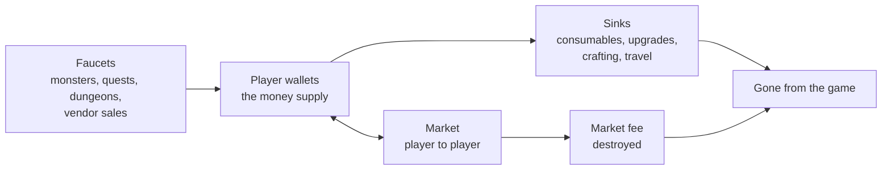

# Module 16: Economy design

- **Goal:** design the currencies, sources, sinks and trading rules of an online RPG, predict how much money players will be holding in three months, and know which numbers to watch and which levers to pull once the game is live.
- **Prerequisites:** [03 — Vision, pillars and loops](03-vision-pillars-loops.md), [11 — One hero, a party or a roster](11-party-roster.md), [14 — Progression and power curves](14-progression.md), [15 — Itemization and loot](15-items-loot.md).
- **Simulation:** `examples/16-economy/` (`dotnet test examples/16-economy`)
- **Facts checked:** October 2026 (prices, rules and product status change; re-check before reuse)

## In short

An in-game economy is a **flow system**: currency is created by **faucets** (monsters, quests, dungeons), held in player wallets, and destroyed by **sinks** (consumables, upgrades, fees). If faucets outrun sinks the currency loses value (inflation); if sinks outrun faucets players feel poor and stop spending (deflation). Most of the design work is choosing **how many currencies** to have and what each is for, **how players may trade**, and **which numbers to watch** after launch, because an economy does not correct itself. The worked example is the course game's currency map (gold, one premium currency, one bound token), its source and sink table, a price list, and a 90-day simulation that shows how much gold the average active player is holding on day 90 and what happens when a sink is added or the market fee is raised.

## 1. The concept

### 1.1 Terms

| Term | Meaning |
|---|---|
| **Currency** | A counted resource whose main job is to be spent |
| **Soft currency** | Earned by playing, spent on everyday things. Usually the tradeable one ("gold") |
| **Premium (hard) currency** | Bought with real money, spent in the shop. Sometimes also trickled out as a reward |
| **Bound currency** | Cannot be traded: tied to a character or an account |
| **Activity token** | A bound currency earned in one kind of content (a dungeon, an event, a mode) and spent in that content's own vendor, usually with a weekly cap |
| **Faucet (source)** | Anything that creates currency or items from nothing |
| **Sink** | Anything that destroys currency or items for good |
| **Money supply** | The total currency held by players at a moment. Per active player, it is the average wallet |
| **Inflation / deflation** | Prices rising (the currency buys less) or falling over time |
| **Market (auction house, trading post)** | A place where players list items for other players at their own prices |
| **Fee or tax** | A share of each trade that is destroyed. A sink that scales with trading |
| **Binding** | A rule that stops an item from being traded: on pickup, on equip, or account-wide |
| **RMT (real-money trading)** | Selling in-game currency or items for real money outside the game's own shop |
| **Bot** | A program that plays for a player, usually to farm currency or items |

### 1.2 The flow

Think of the economy as a bathtub. Faucets fill it, sinks drain it, and the water level is the money supply. A market moves water between people but does not change the total, except through its fee.

Two flows matter: the **daily faucet total** and the **daily sink total**. Their ratio, the **sink ratio** (sinks divided by faucets), tells you where the supply is heading. At 100% the supply is flat. Under 100% it grows.

## 2. The player's view

Players do not think in faucets. They think in **goals and prices**: "I need about 40,000 gold for that item, and I earn about 2,000 an evening, so it is three weeks away." A good economy makes that sentence true and stable. The motivations from [module 01](01-player-experience.md) it serves: **Power** (saving for upgrades), **Completion** (affording the whole set), **Community** (trading with friends) and **Autonomy** (choosing what to spend on).

How it supports the loops of [module 03](03-vision-pillars-loops.md):

- **Core loop (seconds):** loot and gold drops are the visible reward of every fight.
- **Session loop (a sitting):** at the end of a session the player sells, buys potions, and upgrades. That "spend" moment closes the loop.
- **Meta loop (weeks):** saving for a big purchase or a market flip gives the weeks a shape.

Feelings to protect: "my gold means something" (no inflation), "I can afford something useful today" (no deflation), "the market is fair" (no bots or scammers), and "paying money did not break it" ([module 17](17-monetization.md)). The most damaging feeling is **"gold is worthless"**: when everything that matters costs ten times what a session earns, or when a bot has made the currency meaningless, players stop caring about drops.

## 3. The design space

### 3.1 Currency segmentation: how many currencies?

Every extra currency adds a wallet, a vendor, an icon and a way to confuse players. Each one must answer three questions: **what earns it, what spends it, and why can't plain gold do that job?**

| Type | Earned by | Spent on | Tradeable | Why it exists | Example (public, as of October 2026) |
|---|---|---|---|---|---|
| **Soft currency (gold)** | Everything | Everyday goods, fees, upgrades | Yes | The common measure of value | Gold in most online RPGs |
| **Premium currency** | Real money (sometimes a trickle from play) | Shop items, passes | No | Hides prices, lets the shop work across countries, gives a place for free rewards | V-Bucks in Fortnite, Primogems in Genshin Impact |
| **Bound token** | One activity, often weekly | One vendor | No | Gives a fixed progress rate and keeps rewards out of the market | FFXIV's Allagan Tomestones have a weekly cap on the newest type (as of October 2026) |
| **Event currency** | A time-limited event | The event shop | No | Ends with the event; its leftover has no value to inflate anything | Common in live games |
| **Reputation or mastery points** | Doing something repeatedly | Unlocks | No | Not really currency: a progress meter | Faction reputation, crafting mastery |

**Why segment at all?**

1. **Contain inflation.** Gold earned by killing monsters flows into the market. A token earned by one dungeon and spent only at its vendor cannot.
2. **Set a fixed progress rate.** A weekly-capped token says "you can have one piece of this per week" regardless of how much you grind.
3. **Protect against bots and RMT.** A bound currency has no resale value.
4. **Keep the shop honest.** A premium currency that cannot be converted to gold cannot become a back door for buying power ([module 17](17-monetization.md)).

**The cost:** "currency soup". Some games end up with a dozen currencies and a wallet screen that needs a tutorial. Rule of thumb: **one tradeable currency, at most two or three bound ones, one premium one**.

**Should premium currency convert to gold?** Three options:

| Option | How it works | Pros | Cons |
|---|---|---|---|
| **No link** | Premium never becomes gold | Simple, no pay-for-power route, bots gain no official outlet | Gold sellers still exist |
| **Official exchange** | The publisher sells a token players list for gold: the buyer pays money, the seller gets gold | Takes business from gold sellers; players can pay for playtime with gold | Real money buys gold, and gold buys power; a design stance, not a detail. World of Warcraft launched its Token this way in April 2015 |
| **Real-money auction house** | Players sell items for real money in the game | A legal outlet, publisher takes a cut | The loot loop becomes a job. Diablo III closed its real-money and gold auction houses on 18 March 2014; Blizzard's production director said the auction house "short-circuited" the loop of earning loot by killing monsters |

### 3.2 Faucets and sinks

**Common faucets**

| Faucet | Notes |
|---|---|
| Monster drops (gold or vendor trash) | The base flow. Scales with time played |
| Quests | Front-loaded: great for onboarding, finite |
| Dungeon and boss rewards | Where group bonuses show up ([module 11](11-party-roster.md)) |
| Dailies, weeklies, login rewards | A predictable floor; counts as a faucet too |
| Events and world bosses | Spikes. Plan them or they distort the average |
| Selling items to a vendor | A **creator** of gold, because the vendor pays from nothing. Selling to another player only moves gold |

**Common sinks**

| Sink | Type | Notes |
|---|---|---|
| **Consumables** (potions, ammo, food) | Recurring, scales with play | The healthiest sink: players choose how much to use |
| **Upgrades and enhancement** | Aspirational | The biggest sink in most RPGs, because players want power |
| **Crafting fees** | Recurring | Cheap but frequent |
| **Fast travel, teleports** | Convenience | Keep it cheap; a travel toll that stings is a time tax |
| **Repairs** (gear durability) | Mandatory | Classic in older games. It punishes failure, and not every game wants that |
| **Storage and slot expansion** | One-off | Large price, rare, never "needed" |
| **Respec and re-roll services** | Optional | Good places for a fee ([module 09](09-classes-roles.md)) |
| **Market fees and taxes** | Scales with trade | The only sink that grows with the economy itself |
| **Cosmetic purchases in gold** | Aspirational | Good late sinks for veterans who own everything useful |
| **Item destruction** (failed upgrades, salvage) | Item sink | Removes supply of items as well as gold |

**Mandatory or aspirational?** Sinks the player must pay (repairs, tolls) feel like punishment; sinks the player chooses (upgrades, cosmetics) feel like shopping. Prefer the second kind, keep the first small, and **never make a sink the way players lose to a mistake they cannot see coming**.

### 3.3 Player trading

| Model | How it works | Pros | Cons |
|---|---|---|---|
| **No trading** (everything bound) | Players use what they earn | No scams, no RMT, easy to balance | No player economy, no social glue |
| **Direct trade only** | Two players swap in a window | Social, simple | Slow price discovery; scams; whispers and spam |
| **Auction house / trading post** | Listings, buyers browse, fees apply | Price discovery, ships your items to everyone | Needs fees, price limits, anti-bot work; can turn the game into a spreadsheet |
| **Player-run markets** | Players set up shops in the world | Flavour | Poor UI, needs moderation |

**Binding** is the dial between these: **bind on pickup** (never tradeable), **bind on equip** (tradeable until first used), **account-bound** (shareable between your own characters only), and **tradeable until X** (a time window, as in the party loot rule of [module 11](11-party-roster.md)). The more power an item carries, the earlier it binds.

**Fees and taxes.** Trade fees are the sink designers love because they scale with the economy: more trading, more drain. Two common forms (as of October 2026):

- **Listing fee:** paid up front, non-refundable. Discourages spam listings and price testing. Guild Wars 2's Trading Post charges 5% to list, plus 10% on sale.
- **Sale tax:** a percentage of the sale price, taken from the seller. Old School RuneScape's Grand Exchange charges a flat percentage with a cap per item, so very expensive items are not taxed without limit; the rate was raised once after launch and the community wiki lists the current value.

**Safeguards that cost little:** a level or age requirement before trading; a **price corridor** (a listing may not be priced far from the recent median); a daily cap on how much gold one account may transfer; and a short delay on mail and large trades so scammers and gold sellers lose their speed.

### 3.4 Inflation and deflation

**Inflation** happens when the supply of currency grows faster than the supply of things worth buying with it. Causes in online RPGs:

- **Faucets scale up with player power** while sink prices stay fixed. A veteran earns 100 times what a newcomer does, and prices have to serve both.
- **Wealth accumulates.** Players who do not spend stockpile. They are not the problem until one day they all start spending.
- **Duplication bugs and exploits.** One exploit can add months of supply overnight.
- **Bots and gold farming.** They create currency without playing for fun and often sell it.

**Deflation** is less discussed. Causes: sinks too heavy for the earning rate; fees too high; a new currency that crowds out gold. Symptoms: players stop trading because the fee eats the margin, and newcomers cannot afford the basics.

**The key measure is money supply per active player**, and the key warning sign is the sink ratio drifting away from 90–100% for weeks. Two details trip up first-time designers:

1. **The stock is a small difference of two big flows.** If players earn 2,200 gold a day and sinks drain 2,010, the supply grows by only 190 a day, but a 5% change in either flow moves that difference by half. The simulation of section 5 shows it: doubling the market fee from 5% to 10% cuts the day-90 supply by 40%. Tune sinks in small steps and wait.
2. **The average hides the distribution.** A few rich veterans hold most of the gold. Look at the median and the top 1% as well as the mean.

### 3.5 Bots and real-money trading

Bots and RMT hurt in three ways: they inflate the currency, they make farming unprofitable for honest players, and they bring account theft and scams. A design that **reduces the profit** works better than one that only bans.

| Lever | How it helps |
|---|---|
| **Bind the best drops** | No resale value, no farming incentive |
| **Personal loot and bound currencies** | Nothing for a bot to hand to a buyer |
| **Trade friction** | Level or age gates, daily transfer caps, mail delays, price corridors |
| **Caps on farmable value** | Diminishing returns on repeated identical farming; weekly caps on tokens |
| **Detection** | Watch gold earned per account per hour, trade graphs, and item flow between accounts |
| **Enforcement with rollback** | Ban waves that also remove the gold and items already sold on |
| **A legitimate outlet (optional)** | An official exchange (section 3.1) takes demand away from sellers but has design consequences |

### 3.6 Stamina and energy as pacing

**Stamina (energy)** is a resource that limits how much of a type of content a player can do in a period. It refills slowly over real time, or through items.

| Variant | How it works | Example (public, as of October 2026) |
|---|---|---|
| **Regenerating energy** | A bar that refills by the minute | Genshin Impact's Original Resin: one point per 8 minutes, held up to 200 after a 2024 change from 160, as reported at the time |
| **Daily or weekly caps** | A number of rewards or entries per period | Weekly caps on tokens, daily first-clear bonuses |
| **Entry tickets** | A limited number of dungeon entries | Common in mobile RPGs |
| **Rested bonus** | Time offline stores a bonus for later | Several MMORPGs |
| **Diminishing returns** | Rewards shrink as you repeat the same task | Many action RPGs |

**What it is for.** Pacing (players do not burn a month of content in a weekend), a retention hook (a reason to come back), and, in some games, a sales point (refills). It is the clearest divide between mobile and PC design: stamina suits short mobile sessions and collector games, and fits badly with a game that sells "play as long as you like".

**Cost.** The player must stop when the bar empties, and the reason can feel arbitrary. Selling refills makes it worse, because the game is now charging for the right to keep playing.

**Soft alternatives.** Cap the *reward*, not the *access*: a daily first-clear bonus, a weekly chest, a capped token. The player may keep playing; they just earn less of one thing.

### 3.7 How to choose

| If your game is... | Choose | Because |
|---|---|---|
| A social RPG with a long endgame | One tradeable currency, a market with a 5%-ish fee, one or two capped tokens | Players trade, so the sink must scale with trade |
| A mobile game with short sessions | Stamina or entry tickets, many bound currencies, little or no trading | Pacing and control matter more than a player economy |
| A game with strict "no pay for power" | No official exchange, premium currency that never becomes gold | A link from money to gold is a link from money to power |
| An open sandbox (player-made goods) | Heavy fees and item sinks, public economic reports | Players make most of the economy and the sinks have to match |
| A single-player or co-op game | One soft currency, no market | Nothing to balance between players |

## 4. Tuning and pitfalls

### 4.1 Rules of thumb

- **Price in time.** Decide how many minutes of average income each purchase should cost. A common ladder: consumables 1–5 minutes, services 5–15, an upgrade attempt 30–60, a big goal 3–10 hours, a one-off luxury a few evenings.
- **Aim for a sink ratio of 85–95%** in the steady state. Do not aim at 100%: players need to save for goals, so the supply has to grow slowly.
- **Hold a few days of income.** A healthy average wallet is a few days of income, not weeks. In the simulation below the target is under five.
- **Scale sinks with progress.** Fixed sinks do nothing for a veteran, and ruin the start for a newcomer. Prices that scale with level or stage keep the ratio in place.
- **Make sinks chosen.** Prefer consumables, upgrades and cosmetics to tolls and repairs.
- **Prefer many small sinks to one big one.** One sink can be skipped and hurts when it is touched.
- **Do not change a sink and a faucet in the same patch.** You will not know which did what.

### 4.2 Telemetry and live tuning

An economy is run by a dashboard. Measure daily, per active player, and review weekly:

| Metric | What it shows | Warning sign |
|---|---|---|
| **Faucet and sink by source** | Where gold comes from and goes | One faucet over half of the total; a sink falling |
| **Sink ratio** | Whether the supply is growing | Below 85% for weeks (inflation) or above 100% (deflation) |
| **Money supply: mean, median, top 1%** | How much players hold | Mean rising fast; median flat |
| **Days of income held** | The supply relative to earning | Over 7 days |
| **Price basket** | Prices of ten staple items on the market | Basket up more than 10% in a month |
| **Trade volume and fee take** | How active the market is | Volume dropping after a fee change |
| **Gold per account per hour** | Bot detection | Accounts far above the 99th percentile |
| **Premium currency bought and spent** | Health of the shop | Large unspent balances (a possible refund and consumer-law issue) |

Public example: EVE Online's developer publishes a Monthly Economic Report with money supply, money velocity, sinks and faucets, and price indices (as of October 2025), so players can see the same dashboard the designers use.

**Levers, from gentle to harsh:** adjust the market fee or a vendor price by a few percent; add a consumable or a cosmetic sink; run a time-limited gold sink event; change drop rates; change a faucet. Announce the change and the reason. Players accept a fee increase better than a surprise.

### 4.3 Signals and classic failures

| Signal | Likely problem |
|---|---|
| Players say they have "nothing to spend gold on" | Sinks too small or not aspirational |
| Newcomers cannot afford potions | Sinks not scaled with stage, or the faucet is too slow early |
| Prices of the same item double within a month | Inflation; a faucet or exploit |
| Players list at the maximum allowed price | The corridor is too wide or supply too thin |
| Veterans hold 50 times the average | Wealth concentration; check hoarding and bots |
| The fee is raised, then trade volume drops by more than the fee | Fee too high for thin margins |

**Classic failures.**

- **The retrofit.** Sinks added after players have stockpiled feel like a tax on the past. Design them before launch.
- **The one big sink.** All the drain goes through one item class, which then dominates the game.
- **The duplicate bug.** One exploit floods the economy. Keep an audit log so you can roll back.
- **A currency that nobody can spend.** Event leftovers or tokens with no vendor.
- **Level-scaled rewards without level-scaled sinks.** The faucet grows every level, and the drain does not.

## 5. Worked example

The course game: a small online fantasy RPG, one hero per player, parties of four, shared world, gear tradeable between players, free to play ([the fact sheet](_course-game.md)). All numbers are invented. The economy has to serve pillar 4 (**fair and respectful of time**: a 15-minute session always gives a visible reward, and nothing sold gives combat power players cannot earn) and pillar 3 (**stronger together**: group rewards per hour scale as in [module 11](11-party-roster.md)).

### 5.1 Intent

Players should be able to afford something useful after every session, save for a real goal in a week or two, and trade gear with each other without a bot or a seller able to turn money into power. So: one tradeable currency with a fee, one bound token for weekly content, and one premium currency that never touches gold.

### 5.2 The currency map

| Currency | What it is | Earned by | Spent on | Tradeable | Bound | Cap |
|---|---|---|---|---|---|---|
| **Gold** | The soft currency | Fights, quests, dungeons, world boss, vendor sales | Potions, Tempering, crafting, travel, respec, guild founding, storage, market fees | Yes: market, direct trade, mail | No | 10,000,000 held |
| **Frontier Marks** | Bound token for weekly content | Daily first-dungeon bonus (10); the Weekly Chest at the Lodge Hall (60, once a week, whatever the number of slots opened, module 24); Ash Tide kill with the contribution needed for its chest (40 each, twice a week) | A weekly vendor (see below) | No | Account | 1,000 held |
| **Crucible Marks** | Bound token for the PvP mode ([module 23](23-pvp.md)) | 10 per match, up to 12 matches a week (120), plus a first-win bonus of 5 a day | A PvP cosmetic vendor, 300 to 600 each | No | Account | 1,000 held |
| **Crowns** | Premium currency | Real money ([module 17](17-monetization.md)); a small refund from the seasonal pass tracks | The shop | No | Account | None |

Rules that keep it clean:

- **Crowns never become gold and gold never becomes Crowns.** No official exchange (section 3.1). This is the economic half of pillar 4.
- **Marks have a built-in earn rate**: all sources are once a day or once a week, so a regular level 50 player who plays five evenings a week (Mira) earns about **190 a week** (5 × 10 + 60 + 80); Dev, who plays six days and clears one Ash Tide, about **160** (6 × 10 + 60 + 40). Before level 50 only the daily bonus and Ash Tide pay, since the Weekly Chest is an Ember-mode reward. A priced item is therefore "one a week" or "one a fortnight", whatever the grind. Crucible Marks work the same way: 120 a week at the cap, so a 300-Marks item takes at least three weeks.
- **The Frontier Marks vendor sells bound goods only** (last tier's gear as the catch-up route of module 24, crafting materials, dyes). The gear rules are in [module 15](15-items-loot.md).
- **Currencies are personal** (a party never splits gold), as in [module 11](11-party-roster.md).

### 5.3 Sources and sinks of gold

The numbers below come from the simulation (section 5.6) for one average active player on day 90, in gold per day.

| Faucet | Gold per day | Share |
|---|---|---|
| Dungeons | 1,274 | 58.0% |
| Field monsters | 415 | 18.9% |
| Events (Ash Tide and weekly) | 408 | 18.6% |
| Quests | 101 | 4.6% |
| **Total created** | **2,198** | |

| Sink | Gold per day | Share of sinks |
|---|---|---|
| Tempering (gear upgrades) | 1,328 | 66.0% |
| Potions | 321 | 16.0% |
| Crafting fees | 199 | 9.9% |
| Market fee (5%) | 81 | 4.0% |
| Fast travel | 31 | 1.5% |
| Respec | 29 | 1.4% |
| Storage upgrade | 19 | 0.9% |
| Guild founding | 1 | 0.1% |
| **Total destroyed** | **2,010** | |

The **sink ratio is 91%**: for every 100 gold created, 91 are destroyed. By day 90 most players have reached level 50, so the finite quests have dried up (5% of income) and dungeons and events carry the faucet. Tempering is the main sink by design: players want power, and power can only be earned. Potions matter because parties without a healer rely on them ([module 09](09-classes-roles.md)). Guild founding is a gatekeeper rather than a sink (a handful of founders a day).

### 5.4 The price list

Prices and income scale with a **stage**, which is the level power of [module 14](14-progression.md) (1 + 0.12 × (level − 1)) relative to level 30. **Stage 1.0 is level 30**, which a solo player reaches at about hour 11 of the 25.1 hours to level 50 (an item level of about 32, the level at which [module 15](15-items-loot.md) states its gold prices). Stage is 0.22 at level 1, 0.52 at 12, 0.73 at 20, 1.21 at 38 and 1.54 at 50. A regular player (1.5 h per evening) earns about **1,300 gold per hour** at stage 1.0 (about 2,000 at level 50).

| Item or service | Price at stage 1.0 | Scales with stage | In minutes of income at stage 1.0 |
|---|---|---|---|
| Potion | 40 | Yes (9 at level 1) | 1.8 |
| Fast travel | 30 | No, flat | 1.4 |
| Crafting fee | 200 | Yes | 9 |
| Tempering attempt (module 15): steps 1–10 | 50, 60, 70, 100, 130, 170, 220, 280, 350, 450 | Yes (module 15 gives them for item level 32) | 2 to 21 |
| Tempering Charm (steps 8–10) | 400 | Yes | 18 |
| Tempering, average per attempt (see 5.6) | 188 | Yes | 8.7 |
| Climb an item to +7 / to +10 with charms | 1,133 / 8,186 | Yes | 52 / 378 |
| Respec (module 09) | 50 gold times level, so 1,500 at level 30; 1,000 at the level 20 Path, 2,000 at the level 40 Mastery | By level | 69 |
| Guild founding (module 22) | 1,000 per founder, 3,000 per guild, one-off | No | 46 |
| Storage upgrade (one row) | 4,000 | No | 185 |
| Market fee | 5% of the sale price, paid by the seller on a sale; listing is free | | |

Module 15's Tempering prices are taken **as given** at stage 1.0; this module only scales them for other item levels. The guild fee is meant as a small hurdle (about one evening at level 15, where income is about 780 gold an hour) so a guild needs three players who mean it.

Respec is calibrated at **about one evening of income at any level**, so it is a decision but never a barrier. The simulation approximates 50 × level by 1,500 × stage, within 10% from level 20 up. It is never sold for Crowns (module 09).

### 5.5 Market and trade rules

| Rule | Value |
|---|---|
| **What can be listed** | Gear (until equipped for the first time), crafting materials, consumables |
| **Binding** (module 15) | Boss-chest gear binds on pickup (apart from the party handoff below); other drops bind on equip; anything tempered to +1 or more is bound. Cosmetics and Marks are account-bound |
| **Party handoff** | The 2-hour, one-time trade of [module 11](11-party-roster.md) still applies and is free of the fee |
| **Listings per player** | 20; extra slots only through the convenience pass (module 17) |
| **Fee** | 5% of the sale price, paid by the seller; at least 1 gold |
| **Price corridor** | A listing must be between 25% and 400% of the item's 7-day median price |
| **Trading unlock** | Market (the trade post) from level 10 and 3 days of account age; direct trade from level 20 and 24 hours of account age (module 22) |
| **Gold transfers** | Direct trade and mail are capped at 100,000 gold per account per day; mail to a new account is delayed 24 hours |
| **Direct trade** | A two-step confirmation window; both lists shown in full before the second confirm |

### 5.6 The 90-day model

**What it models.** Players join in daily cohorts and fade by a retention curve. Each cohort has three kinds of player (casual, regular, hardcore) with their own hours per day and activity mix. Every day each player earns from the faucets, then pays the sinks in order, never spending gold they do not have. Players who leave take their wallet with them (counted as **dormant gold**, not supply). The market fee destroys a share of the gold that changes hands. The model reports, per active player, the **money supply**, the daily faucet and sink, the sink ratio and the **days of income held**.

**The data** (`economy.json`, what a designer edits):

| Field | Value |
|---|---|
| New players per day | 3,000 on days 1–7; 1,200 on days 8–29; 500 from day 30 |
| Retention | Fraction still active at tenure *a* days: (1 + *a*)^−0.6 (0.66 on day 1, 0.29 on day 7, 0.13 on day 30, 0.07 on day 90) |
| Level by hours played | Level 1 at 0 h, 12 at 2.4 h, 25 at 8.3 h, 38 at 16.1 h, 50 at 25.1 h (module 14's region exits, linear in between); stage = level power relative to level 30. Casual players (0.4 h a day) reach level 30 on day 28 and 50 on day 63, regular ones on day 8 and 17, hardcore ones on day 3 and 7 |
| Faucets (gold per hour at stage 1.0) | Field 900, quests 1,100 (finite: dry up at level 50 and their hours move to the others), dungeons 1,500, events 2,000 |
| Profiles | Casual 50% of players, 0.4 h a day, mostly quests and field; regular 35%, 1.5 h, mostly dungeons; hardcore 15%, 3.5 h, 60% dungeons |
| Sinks | Potions 40 gold at 5 a hour; **Tempering 188 at 4.4 attempts a hour**; crafting 200 at 0.7 a hour; fast travel 30 at 1 a hour; respec 1,500 at 0.03 a day; guild founding 1,000 at 0.002 a day; storage 4,000 at 0.01 a day |
| Market | 1,200 gold of sales per active hour at stage 1.0; fee 5% |

**Where 188 comes from.** The average gold per Tempering attempt over a typical mix of climbs, from module 15's table: 9 in 10 climbs stop at +7 (1,133 gold over 8.87 attempts) and 1 in 10 goes to +10 with charms (8,186 gold over 17.95 attempts). That is (0.9 × 1,133 + 0.1 × 8,186) / (0.9 × 8.87 + 0.1 × 17.95) = 1,838 / 9.78 = **188 gold per attempt**. At 4.4 attempts per active hour a player does about one +7 climb every two hours. The 4.4 was tuned so the day-90 sink ratio lands in the 85–95% target; module 15's prices were not touched.

**Hand check** (the test does it): a regular player earns 1.5 h × (0.25 × 900 + 0.25 × 1,100 + 0.40 × 1,500 + 0.10 × 2,000) = 1.5 × 1,300 = **1,950 gold a day** at stage 1.0, and wants to spend 300 (potions) + 1,241 (Tempering: 188 × 4.4 × 1.5) + 210 (crafting) + 45 (travel) + 45 (respec) + 4 (guild) + 40 (storage) + 90 (fee) = **1,973**, or 101% of income. At level 30 a regular player spends everything they earn. The surplus builds up later, at level 50, where income is higher.

**Result** (baseline, per active player):

| Day | Active players | Supply per active player | Faucet per day | Sink per day | Sink ratio | Days of income held |
|---|---|---|---|---|---|---|
| 1 | 3,000 | 2 | 369 | 367 | 99% | 0.0 |
| 7 | 10,936 | 155 | 976 | 918 | 94% | 0.2 |
| 14 | 9,439 | 684 | 1,571 | 1,454 | 93% | 0.4 |
| 30 | 10,477 | 2,019 | 1,910 | 1,752 | 92% | 1.1 |
| 60 | 8,664 | 5,743 | 2,170 | 1,983 | 91% | 2.6 |
| 90 | 8,985 | **8,502** | 2,198 | 2,010 | 91% | **3.9** |

**Key tests and their numbers.**

| Test | What it asserts |
|---|---|
| Day-90 supply per active player | Between 8,000 and 9,000 (the model gives 8,502), under the 5-day target |
| Stage tied to module 14 | Hour 11.3 is level 30 and stage 1.0; level 50 is stage 1.536; quests stop paying at level 50 and a regular player's income goes from 1,950 to 2,050 at stage 1.0 |
| Sink ratio on day 90 | Between 90% and 93% (the model gives 91.4%) |
| Conservation | Gold created minus gold destroyed equals gold in active wallets plus dormant wallets |
| The average hides the distribution | A hardcore day-1 veteran holds about 99,600 gold; a regular one about 12,100; a casual one spends everything it earns, so holds 0 |
| Raise the fee | Day-90 supply: fee 0% gives 12,158; 5% gives 8,502; 10% gives 5,141 (down 40%) |
| Add a sink | A new "reforge" sink of 2,000 gold at 0.1 uses a day cuts day-90 supply to 4,957 and slows growth over days 60–90 from 2,759 to 1,526 |
| No sinks at all | Day-90 supply is 97,783 gold, 44.5 days of income, 11.5 times the baseline |

**What the simulation tells you.**

- The economy is **sensitive**: the faucet and sink are within 10% of each other, so the stock reacts strongly to small changes. This is why live tuning moves one lever a few percent at a time.
- The baseline **still drifts up** (5,743 on day 60, 8,502 on day 90) because players reach level 50, where income is 1.5 times that of level 30, and veterans save. That is acceptable: 3.9 days of income is under the 5-day target. If it were 8 days, the fix would be the new sink or a fee of 6–7%.
- **Wealth concentrates in the hardcore tail.** The mean of 8,502 describes nobody: casuals hold nothing, hardcore veterans hold about twelve times the mean. This matters for the market, where the rich set prices.
- **The market fee is a gentle sink** in the baseline: 81 of 2,010 gold a day, but the *change* from 5% to 10% is as strong as a new big sink.

**What the model leaves out** (on purpose): prices do not react to supply (no feedback), no bots, no one-off events, no returning players, a fixed mix of player kinds. Use it to compare designs, not to forecast.

### 5.7 Pacing without stamina

The course game has **no stamina or energy bar**, because pillar 4 says a player may play as long as they like and always gets a visible reward. Pacing comes from **reward caps instead of access caps**: a daily first-dungeon bonus, the Weekly Chest (more clears give more choice, not more items, module 24), Marks from once-a-day and once-a-week sources, and two Ash Tide events a week. A player who plays eight hours on a Saturday earns no more Marks than one who plays one hour a day; they earn more gold, which has sinks.

### 5.8 Live tuning plan

| Metric | Healthy band | If outside for two weeks |
|---|---|---|
| Sink ratio (veteran cohorts) | 85–95% | Below 85%: raise a fee or add a sink. Above 100%: cut a price |
| Days of income held (mean) | Under 5 | Over 7: add an aspirational sink; do not add a toll |
| Price basket (10 staples) | ±10% a month | Investigate faucet exploits and bots first |
| Top 1% wallet divided by median | Under 100 | Look for bot clusters |
| Market volume | Within 20% of the previous month | Re-check the fee and the corridor |

### 5.9 What was cut

- **Official gold-for-money exchange.** It would turn the shop into a power route (section 3.1).
- **Repair costs and gold loss on death.** Module 12 gives no repair cost, and pillar 4 (respectful of time) argues against making failure cost twice.
- **A listing deposit.** A 1% deposit would stop listing spam but punish players who test prices; the corridor and the 20-listing cap do the job.
- **Stamina.** See 5.7.
- **A second tradeable currency.** One is enough to keep the economy readable.

### 5.10 How the design would change for another kind of game

| Game kind | Change |
|---|---|
| **Mobile collector** | Add stamina; many bound currencies; no market; sinks are upgrade materials; the premium currency is the main economy |
| **Sandbox with player-made goods** | Heavy item sinks (destruction), public economic reports, bigger fees; the designers manage the economy as a government |
| **Single-player RPG** | One currency; sinks are the shop and upgrades; no fee, no corridor |
| **Roster game** | Several currencies, one per upgrade axis; sinks are duplicate conversion; telemetry watches pulls and spend, not gold |

## Key takeaways

- An economy is **faucets, sinks and wallets**; the number to watch is the **sink ratio** and the **money supply per active player**, not the price of any one item.
- Give each currency **one job**: one tradeable soft currency, one or two bound tokens with weekly rates, one premium currency that never converts to gold.
- **Sinks should be chosen, not forced**: upgrades, consumables and cosmetics feel like shopping, tolls and repairs feel like punishment.
- A market needs a **fee, a price corridor and trade limits**; the fee is the one sink that scales with the economy itself.
- The stock is a **small difference of two big flows**, so tune in steps of a few percent. In the model, moving the fee from 5% to 10% cuts the day-90 supply by 40%.
- **Averages hide the tail**: a hardcore veteran can hold ten times the mean while a casual holds nothing; track the median and the top 1%.
- Design the sinks **before launch**, publish a dashboard, and decide the rules for premium currency early: any link from money to gold is a link from money to power.

## Further reading

- Ian Schreiber, "Game Balance Concepts", Level 10 (economies, sources and sinks, inflation, auctions): https://gamebalanceconcepts.wordpress.com/2010/09/08/level-10-final-boss/
- EVE Online, "Monthly Economic Report" (a public example of an economy dashboard): https://www.eveonline.com/news/view/monthly-economic-report-october-2025
- Game Informer, "Blizzard closes Diablo III auction house" (March 2014): https://gameinformer.com/b/news/archive/2014/03/18/blizzard-closes-diablo-iii-auction-house.aspx
- NBC News, "No money, no problems? Blizzard axes 'Diablo 3' auction house" (Blizzard's reasons, 2013): https://www.nbcnews.com/technolog/no-money-no-problems-blizzard-axes-diablo-3-auction-house-4B11192195
- Game Informer, "Blizzard to allow players to buy gold with real money" (the WoW Token, March 2015): https://gameinformer.com/b/news/archive/2015/03/02/blizzard-to-allow-players-to-buy-gold-with-real-money.aspx
- Guild Wars 2 Wiki, "Trading Post" (listing and exchange fees): https://wiki.guildwars2.com/wiki/TP
- Old School RuneScape Wiki, "Grand Exchange" (tax rate and cap): https://oldschool.runescape.wiki/w/Grand_Exchange
- Final Fantasy XIV Console Games Wiki, "Allagan Tomestones" (weekly caps): https://ffxiv.consolegameswiki.com/wiki/Tomestone
- Genshin Impact Wiki, "Original Resin": https://genshin-impact.fandom.com/wiki/Original_Resin
- Edward Castronova, *Synthetic Worlds: The Business and Culture of Online Games* (University of Chicago Press, 2005), the standard economics-of-virtual-worlds book.
