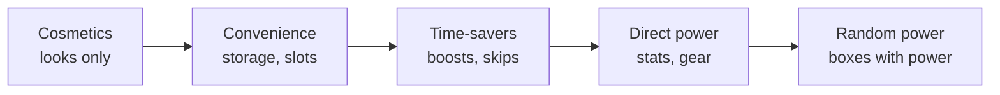

# Module 17: Monetization design

- **Goal:** choose a business model for an online RPG, decide what the game sells and what it never sells, evaluate a battle pass or a random-draw system by its numbers and its ethics, and know the main regional rules, so that monetization shapes the game without bending it.
- **Prerequisites:** [01 — The player experience](01-player-experience.md), [03 — Vision, pillars and loops](03-vision-pillars-loops.md), [11 — One hero, a party or a roster](11-party-roster.md), [16 — Economy design](16-economy.md).
- **Simulation:** `examples/17-gacha-odds/` (`dotnet test examples/17-gacha-odds`)
- **Facts checked:** October 2026 (prices, rules and product status change; re-check before reuse)

## In short

A game is paid for in one of four main ways: players **buy it once**, **subscribe**, **play free and buy extras**, or a **hybrid** of these. Most online RPGs today are free to play or hybrid, so the design question is **what the shop sells**. The sale of cosmetics and convenience is widely accepted; the sale of combat power and random power is where players, platforms and regulators push back. The rules differ by country and change quickly, and children need special care. The worked example is the course game's business model: free to play, with cosmetics, a convenience pass and a seasonal pass, a written list of red lines taken from pillar 4 ("nothing sold gives combat power players cannot earn"), simple revenue math for 10,000 monthly players, and a simulation that prices a random-draw box so a proposal for one can be judged by its expected, typical and worst-case cost.

## 1. The concept

### 1.1 Terms

| Term | Meaning |
|---|---|
| **Business model** | How the game turns players into revenue |
| **Free to play (F2P)** | Free to download and play; revenue comes from optional purchases |
| **Premium (buy to play)** | A one-time purchase price, often with paid expansions |
| **Subscription** | A recurring fee for access |
| **Microtransaction** | A small purchase inside the game |
| **MAU / DAU** | Monthly or daily active users |
| **Conversion** | The share of players who ever pay (the "payer rate") |
| **ARPU / ARPPU** | Average revenue per user, or per *paying* user, in a period |
| **ARPDAU** | Revenue per daily active user per day |
| **LTV** | Lifetime value: total revenue one player brings |
| **Heavy spender ("whale")** | A player who spends far more than the average payer. The word is industry slang and is used here without judgement |
| **Battle or season pass** | A time-limited progress track with free and paid rewards |
| **Loot box / gacha** | A random draw, often paid for (module 11 explains the odds maths) |
| **Pay to win** | Paying gives an advantage non-payers cannot match with time or skill |

### 1.2 The ladder of what a shop can sell

Players' acceptance falls as you move right. The left two steps are widely tolerated, the middle one is debated, and the right two are what "pay to win" usually refers to. The rest of this module is about where to stop on this ladder, and what to do about the random draw, which can be placed on any step.

## 2. The player's view

Players judge a shop with a few quick questions, usually without saying them aloud:

- **Is the game still fun if I never pay?** The non-payers are the crowd that makes a shared world feel alive.
- **Does paying change how fair the game is to me?** This is the pay-to-win question, and it is felt strongly in a game with groups, because everyone sees everyone's gear ([module 11](11-party-roster.md)).
- **Do I understand what I am buying, and what it really costs?** This is the question regulators have started asking too.
- **Am I being pushed?** Timers, constant pop-ups and "last chance" banners turn a shop into pressure.

Motivations ([module 01](01-player-experience.md)) the shop serves: **Fantasy** and **Expression** (how my hero looks), **Completion** (a collection, a pass track), **Autonomy** (convenience), and for some **Status** (rare cosmetics). A shop that sells **Power** competes with the game's own progression, so it makes the game worse at the thing the player came for.

How monetization touches the loops of [module 03](03-vision-pillars-loops.md): the **core loop** should never contain a purchase prompt; the **session loop** may end with a gentle offer (a new item in the shop's tab); the **meta loop** is where passes and seasons live, because they follow the game's weekly rhythm.

## 3. The design space

### 3.1 Business models

| Model | How it earns | Strengths | Risks | Public examples (as of October 2026) |
|---|---|---|---|---|
| **Premium** | One purchase | Simple; the player is the customer, not the product | No revenue after launch unless there are expansions; a live game needs money for years | Many single-player RPGs |
| **Premium plus expansions and shop** | Box plus paid expansions, with a shop | Predictable launch income, goodwill | Needs a new expansion every year or two | Guild Wars 2; Diablo IV (box, season pass, shop) |
| **Subscription** | A monthly fee | Stable income, no shop pressure; players expect content | A barrier at the door; players leave when they stop | World of Warcraft at $14.99 a month in the US, with higher prices in some regions raised from June 2026 |
| **Free to play** | Optional purchases | The widest audience; the crowd is the product | Spend pressure; fairness is the first thing to break; regulation is strongest here | Path of Exile (mainly cosmetics and storage), Genshin Impact (random draws) |
| **Hybrid** | A mix, for example subscription plus shop plus a token | Several revenue streams | Players resent paying twice | World of Warcraft sells cosmetics and a Token on top of the subscription |

**How to choose.** F2P fits when the game depends on **many players** (a shared world, parties) and when content is **cheap to repeat** (seasons). Subscription fits a game with a **strong stream of content** and a committed audience. Premium fits **finite** games. A free-to-play RPG that wants to keep its fairness has to **limit what it sells**, which is the next question.

### 3.2 What F2P sells

| Product | What it is | Player acceptance | Typical risk | Pay-to-win risk |
|---|---|---|---|---|
| **Cosmetics** | Outfits, weapon looks, effects, emotes, name frames | High | Items that give an advantage (size, visibility) | None, if rules below are kept |
| **Convenience** | Storage, character slots, presets, extra listings | Medium to high | Slots that quietly give an edge (more market listings) | Low |
| **Passes** (battle, season) | A paid track of rewards on top of a free one | Medium to high | Turning play into chores; fear of missing out | Low if the rewards are cosmetic |
| **Time-savers** | XP and drop boosts, skips, refills | Medium | Implies the base game is slow on purpose | Medium: money buys progress |
| **Expansions** | New regions or classes, bought once | High, if complete | Splitting the player base between owners and non-owners | Low |
| **Direct power** | Stats, gear, upgrade success | Low | Players see it and leave | High |
| **Random power** | Boxes that may contain power | Lowest | Regulation and spending harm | Highest |

**The pay-to-win test.** For any item, ask four questions:

1. **Can a non-payer earn it?** If not, power is being sold.
2. **How long would it take?** If the free route is a hundred times slower, it is a pay wall, not a time-saver.
3. **Does it matter to anyone else?** In a competitive or party mode the advantage hurts other players. In a solo mode it hurts nobody.
4. **Would players be angry if it was explained plainly in the patch notes?** If yes, the design is the problem.

A well-known cautionary example: in November 2017 Electronic Arts temporarily removed in-game purchases from *Star Wars Battlefront II* just before release after players objected to loot boxes tied to character progression. The episode is cited in industry talks as the moment random power drew open public backlash.

### 3.3 Battle and season passes

A **pass** is a track of rewards that players move along by playing, with a free track and a paid ("premium") track. It was popularised by Dota 2's 2013 "Compendium", a roughly $10 add-on for its major tournament, and spread through Fortnite's Season 2 Battle Pass in December 2017.

**Parts.** A **season** (often 8 to 12 weeks), **tiers** (50 to 100), **points** earned from tasks, a **free track** and a **premium track**.

| Choice | Options | Effect |
|---|---|---|
| **How points are earned** | Daily and weekly tasks; any play; achievements | Tasks give structure and risk a chore list; "any play" is gentler |
| **What the paid track holds** | Cosmetics only; cosmetics plus currency back; cosmetics plus power | Power in the paid track is pay to win |
| **Late buyers** | Rewards claimed retroactively, or lost | Retroactive is friendlier and keeps late sales |
| **Tier skips for money** | Sold, or not | Selling skips turns the pass into a shop for time |
| **Reward return** | Seasonal items return later, or never | "Never" creates fear of missing out |

**Why teams like them.** Revenue is predictable, buyers have a reason to play every week, and a content cadence is built in. **Why they can hurt.** If the weekly tasks take an hour a day, the game stops being a game; and if rewards never return, players feel hurried.

### 3.4 Gacha economics (revenue and ethics)

[Module 11](11-party-roster.md) explains the odds maths: rates, pity, the 50/50 rule, expected pulls and the worst case. This section is the other side: **what it means for revenue and for the player.**

**Revenue.** A random draw turns a single item into a distribution of spend. The mean is what the studio plans on; the tail is what the player fears. Using the simulation of section 5 with an invented price of $1.60 a pull (160 premium units, 100 units to the dollar), a pity model with a 0.6% rate, a guarantee at 90 pulls and a 50/50 rule gives:

| Quantity | Pulls | Spend |
|---|---|---|
| Average for one featured item | 93 | **$150** |
| Median (half of players are done) | 80 | $128 |
| One player in ten needs | 155 or more | $248 or more |
| Hard-pity worst case | 180 | **$288** |

**Concentration.** In unbounded random-draw games, spend is very uneven. A 2016 report from the analytics firm Swrve, covering over 20 million players in more than 40 free-to-play mobile games, found that **1.9% of players made a purchase in the month and 0.19% of players produced 48% of revenue** (February 2016; mobile free-to-play games). A shop that sells **finite** goods has a natural ceiling: once a player owns the catalogue, there is nothing left to buy (section 5.6).

**Ethical concerns**, as raised by researchers and regulators:

| Concern | Why |
|---|---|
| **Variable rewards** | An uncertain reward keeps players pulling in a way a fixed price does not |
| **Sunk cost** | "I have already spent so much; one more pull" |
| **Loss of control** | Some players spend more than they can afford |
| **Minors** | Children are less able to judge odds and price |
| **Opaque prices** | A premium currency hides what a pull costs in real money |

**Design rules that reduce harm and also make a better product:**

- **Publish the odds, the pity rules and the expected cost** (not only the headline rate).
- **Offer a hard pity** that bounds the worst case, and show it in the shop.
- **Allow a direct purchase** for the item at a price at or below the expected cost.
- **Make duplicates useful** (conversion to a currency), not wasted.
- **Never put combat power in a random draw** in a game that promises fairness.
- **Offer spend controls** (section 3.5) and never target them at minors.

### 3.5 Regulation, odds disclosure and minors

**As of October 2026.** Rules change fast, and this is a snapshot, not legal advice. Odds-disclosure rules (Apple, Google, China, South Korea, Brazil, Belgium, the Netherlands, Australia, the United Kingdom and the EU principles) are listed in the table in [module 11, section 3.7](11-party-roster.md). The rows below cover **consumer protection, minors and other regimes**.

| Where | Rule | Status |
|---|---|---|
| **United States, FTC** | December 2022: Epic Games agreed to pay $520 million for children's privacy violations ($275 million) and for dark patterns that led players into unintended purchases ($245 million in refunds). January 2025: Cognosphere (HoYoverse) agreed to a $20 million settlement; the order requires parental consent before selling loot boxes to users under 16, a real-money purchase option when loot boxes are sold with virtual currency, and disclosure of odds and currency exchange rates | Settled orders; shows the enforcement style |
| **European Union** | Consumer authorities' principles on in-game currencies (March 2025: clear real-money prices, no hidden costs, care with children). The Commission has said its Digital Fairness Act proposal, which is expected to address loot boxes, virtual currencies and minors, is planned for the fourth quarter of 2026 | Principles in place; the Act is **not adopted** as of October 2026 |
| **China** | November 2019 rules for minors: no purchases under 8; ages 8 to 15 up to 50 yuan per top-up and 200 per month; ages 16 and 17 up to 100 per top-up and 400 per month. August 2021: minors may play one hour on Fridays, weekends and public holidays | In force |
| **Japan** | May 2012: the Consumer Affairs Agency said "complete gacha" (a grand prize for collecting a full set of draw items) was illegal under its law on unjustifiable premiums; industry dropped the feature | Since 2012 |
| **Platforms** | Apple and Google require odds disclosure for randomized items and offer family tools such as purchase approval and purchase restrictions on children's accounts | In force |

**What this means for the design of a global game.**

1. **Design to the strictest rule.** Odds disclosure, real-money prices shown, no hidden currency leftovers, parental controls.
2. **Show the real-money price next to the premium currency price**, always.
3. **Never design a purchase flow where one tap spends money** (the Epic order is about exactly this).
4. **Age gates and parental consent** are part of the product, not paperwork.

**Spending limits and minors: patterns that work.**

| Pattern | What it does |
|---|---|
| **Age declaration at account creation** | Sets the account's rules; neutral wording so a child cannot just try again |
| **Parent approval** for under-16 purchases | Through the platform's family tools or the game's own flow |
| **Default monthly spend cap for minors** | Parents can raise it; the player can lower it |
| **Self-set limits for everyone** | A player can cap their own monthly spend |
| **Monthly spend summary** | A real-money statement, not a count of premium currency |
| **Play-time reminders** | A reminder after 60 minutes |
| **Refund path** | An easy way to undo an accidental or unauthorised purchase |

### 3.6 How monetization shapes design, and where it must not

Monetization **legitimately** shapes the game in these ways, and a designer should plan for them:

- **Content cadence.** Seasons and passes ask for new content every 8 to 12 weeks ([module 29](29-live-design.md)).
- **Cosmetic depth.** Hero models, outfits and effects need an art pipeline built for variety.
- **Account structure.** Shared accounts across PC and mobile let purchases follow the player.
- **Convenience that is felt.** Storage and slot limits exist to be lifted. Keep them reasonable, not painful.

It must **not** shape these things:

| Not allowed to shape | Why |
|---|---|
| **Combat readability** | A cosmetic that hides a telegraph or enemy outline breaks fairness. The cosmetic rule: no change to hitboxes, silhouette size or enemy-danger colours |
| **Drop rates and difficulty** | Never tune them by who has paid |
| **Matchmaking and queue priority** | Money must not buy a faster queue |
| **The core loop** | A paywall in the first hour kills retention |
| **Progression speed as a sales funnel** | A grind made slower to sell a boost is a trap the player can feel |

**Smell tests.**

- *Would this feature exist if there was no shop?* If not, who is it for?
- *Does it get worse for non-payers after launch?* A common live-service failure.
- *Could I explain it to a parent?*

### 3.7 How to choose

| If your game is... | Choose | Because |
|---|---|---|
| A social RPG with a free entry and "fair" pillar | F2P with cosmetics, convenience and a pass | Matches the crowd and the pillar |
| A story-first RPG with a defined end | Premium | A finite product sells once |
| A content-heavy online RPG with a loyal base | Subscription or premium plus expansions | Players pay for a steady stream of content |
| A roster or collection game | F2P with random draws, plus disclosure, spend limits and a bounded worst case | The roster is the product |
| A competitive game | Cosmetics only | Any power sold breaks the competition |

## 4. Tuning and pitfalls

### 4.1 Rules of thumb

- **Price in round steps of the premium currency** and show the real price. Sell **exactly the amount a player needs** as well as bundles.
- **Sell the first item cheaply.** The first purchase is commonly described as the hardest step; once a player has paid, later ones are easier.
- **Keep the catalogue finite and varied.** Players spend when something suits their taste, not when something is scarce.
- **Put the shop out of the loop.** A shop tab in the menu and a gentle note after a session; no pop-ups in combat.
- **Test with the 4-question test** (section 3.2) before every new product.
- **Plan the content cost.** A season of cosmetics needs art, and the revenue from it must pay for it.

### 4.2 Metrics

| Metric | What it shows |
|---|---|
| **Conversion (payer rate)** | Reach of the shop; low single digits is common in F2P games |
| **ARPPU, ARPDAU** | Value per payer and per day |
| **Revenue concentration** | The share of revenue from the top 1% and 10% of payers: a risk indicator |
| **Pass attach rate and completion** | Whether the pass is priced and paced correctly |
| **Refunds and chargebacks** | Dark patterns, accidents, minors |
| **Spend per minor account** | A compliance and ethics check |
| **Retention of payers vs non-payers** | Whether the shop harms the game |

### 4.3 Signals and classic failures

| Signal | Likely problem |
|---|---|
| Non-payers leave after the first week and say "pay to win" | The shop touches power or the first hour |
| The top 1% of payers produce most of the revenue | The shop depends on a few people; a regulator or a boredom event will hurt |
| Pass completion is under 20% for regular players | Points are too slow or the tasks are chores |
| Chargebacks and refund requests rise | Confusing prices or one-tap purchases |
| Players ask "when will the old outfit return?" | Fear of missing out; tell them |

**Classic failures.**

- **Power creep to sell.** Each new product has to be stronger than the last, until old players are worthless.
- **Pass fatigue.** A second pass, then a third, each with its own tasks.
- **Whale dependence.** Revenue depends on a very small group, and the game is balanced for their wallet.
- **Currency leftovers.** Packs that never match the prices, so the player has to buy more.
- **Dark patterns.** Hiding the cancel button, auto-renewing silently, and timers designed to rush decisions.
- **A regulation surprise.** A product that works in one country becomes illegal in another.

## 5. Worked example

The course game: a small online fantasy RPG, one hero per player, parties of four, free to play on PC and mobile with a shared account ([the fact sheet](_course-game.md)). All numbers are invented. Currencies and gold prices are set in [module 16](16-economy.md); this module sets the **shop and passes**.

### 5.1 Intent

**Pillar 4 is a hard rule: *fair and respectful of time; nothing sold gives combat power players cannot earn.*** The shop exists to fund the game without making anyone feel the game is for sale. The business model is therefore the narrowest version of free to play: **cosmetics, convenience and passes**.

### 5.2 The business model

| Item | Decision |
|---|---|
| **Model** | Free to play on PC and mobile; one account |
| **Products** | Cosmetics, a Convenience Pass, a Seasonal Pass |
| **Not sold** | Anything on the red-line list (5.6) |
| **Currency** | Crowns, the premium currency. 100 Crowns is nominally one US dollar. Packs: 500, 1,000, 2,500 and 5,000 Crowns at store price points (for example 500 for $4.99), **no bonus Crowns** (every Crown costs the same), and an exact top-up in steps of 100. Real-money price shown beside every Crown price |
| **Ads** | None |
| **Random boxes** | None at launch (see 5.8) |

### 5.3 The shop catalogue

| Product | Price (Crowns) | Notes |
|---|---|---|
| Outfit (full set) | 800 to 1,200 | Per class and cross-class; three colourways |
| Weapon skin | 400 | Looks only; same size and reach |
| Skill-effect recolour | 300 | **Not in danger red** (module 10); same footprint and duration |
| Emote | 150 | |
| Nameplate frame | 200 | |
| Dye pack | 100 | |
| Appearance change | 200 | |
| Name change | 300 | |
| Extra hero slot (3rd to 5th) | 400 each | The first two slots are free |
| Convenience Pass (30 days) | 500 | See 5.4 |
| Seasonal Pass (12 weeks) | 1,000 | See 5.5 |

All cosmetics are **account-bound** (they cannot be traded), which also limits real-money trading ([module 16](16-economy.md)). Every item can be previewed on the player's own hero before purchase.

### 5.4 The Convenience Pass

A **30-day pass, not a subscription**: it does not renew unless the player turns that on, and the shop says so in plain words.

| While active | Value |
|---|---|
| Bag slots | +20 |
| Stash rows | +2 |
| Market listing slots | +10 (30 in total instead of 20) |
| Wardrobe presets | +10 |

When it lapses nothing is deleted: items stay and can be taken out, but not put in; extra listings finish their run. **The market slots are the most debatable item**: they give a payer a small edge in gold. The cap at 30 bounds it, and the fallback if a pillar 4 review vetoes it is a wardrobe-only pass.

### 5.5 The Seasonal Pass

A **12-week season** (84 days), 50 tiers, **season points** from tasks players mostly do anyway.

| Item | Value |
|---|---|
| **Points per tier** | 500 (25,000 for all 50 tiers) |
| **Points per day** | 3 daily tasks of 50 points = 150 |
| **Points per week** | 6 weekly tasks of 250 = 1,500; two world boss participations of 200 = 400 |
| **Rule for tasks** | No task needs a party, nothing like "kill 1,000"; points never expire within the season |
| **Late buyers** | Every premium reward earned so far is claimed retroactively |
| **Tier skips** | Not sold |
| **Price** | 1,000 Crowns, with 300 Crowns returned along the premium track |

**Pacing check** (this is the design goal, using the personas of [the fact sheet](_course-game.md)):

| Player | Points a week | Result |
|---|---|---|
| **Mira** (5 evenings, all tasks) | 5 × 150 + 1,500 + 400 = 2,650 | Finishes in 9.4 weeks, with weeks to spare |
| **Dev** (6 days of about 25 minutes, half the weekly tasks, one boss) | 6 × 150 + 750 + 200 = 1,850 | About 22,200 points by week 12, tier 44 |

| Track | Rewards |
|---|---|
| **Free** (15 rewards) | 100 Crowns, 4 dyes, 3 emotes, 2 nameplate frames, 3 basic effect recolours, 1 weapon skin, 1 title |
| **Premium** (35 rewards, on 35 of the 50 tiers) | One outfit in three colourways (tiers 10, 30, 50), a weapon skin set, 2 effect recolours, 6 emotes, 8 dyes, 4 nameplate frames, 3 titles, 300 Crowns in six payments of 50 |

**Fear-of-missing-out rule.** Pass cosmetics go on sale in the shop **one season (12 weeks) after the pass ends**, at 1,000 Crowns for an outfit. Titles and the season's name on the nameplate frame stay pass-only, which keeps a small mark of having been there.

### 5.6 The red lines (from pillar 4)

**Never sold, never in a pass, never in a box:**

| Red line | Pillar |
|---|---|
| Stats, gear, upgrade materials, upgrade success or protection | 4 |
| XP, drop-rate or gold boosts; potions or any consumable | 4, 3 |
| Gold, or any exchange of Crowns for gold | 4 ([module 16](16-economy.md)) |
| Respec (module 09: gold only) | 4 |
| Dungeon entries, keys or any stamina refill | 4 |
| Queue priority, matchmaking advantage, or a "skip content" ticket | 3, 4 |
| Anything that changes hitboxes, silhouette size, or enemy-danger colours or outlines | 2 |
| A random draw that can return any of the above | 4 |

**Tested for every new item** with the 4-question test of section 3.2 and signed off by the design lead against this table.

### 5.7 Revenue math for 10,000 monthly players

Invented, for planning only. Real conversion and spend vary by game and region. "Payer" means anyone who buys at least once in the month.

| Player group | Payers | Average spend a month | Revenue |
|---|---|---|---|
| Light (a pass or a small cosmetic) | 240 | $6 | $1,440 |
| Regular | 120 | $15 | $1,800 |
| Heavy | 32 | $40 | $1,280 |
| Top (back catalogue, slots, gifts to self) | 8 | $90 | $720 |
| **Total** | **400 (4%)** | | **$5,240** |

| Figure | Value |
|---|---|
| **ARPU** (per monthly player) | $0.52 |
| **ARPPU** (per payer) | $13.10 |
| **ARPDAU** at 25% of monthly players active per day (2,500) | $0.07 |
| **Top 10% of payers** (40 players) | 38% of revenue |
| **Top 2% of payers** (8 players) | 14% of revenue |
| **After a 30% store fee** (the usual rate on mobile stores and the largest PC store; reduced rates exist for small developers, as of October 2026) | $3,668 |

By product: the Convenience Pass about **$500** (100 buyers at $5), the Seasonal Pass about **$833** a month (250 buyers a season at $10, spread over three months), and cosmetics and hero slots about **$3,907**.

**Sensitivity.**

| Change | Revenue per 10,000 monthly players |
|---|---|
| Baseline | $5,240 |
| Conversion 2% instead of 4% | $2,620 (halved) |
| ARPPU $16.10 (+$3) | $6,440 (+23%) |
| Heavy and top payers disappear | $3,240 (down 38%): the 360 light and regular payers alone |

**Break-even check.** A team costing $150,000 a month needs $150,000 / ($0.3668 per player) = **about 410,000 monthly players**. This shows how much the model depends on audience size, and why ARPU alone is not a plan.

**Why concentration is low here.** A cosmetics shop has a ceiling: a season's new items (6 outfits, 8 weapon skins, 6 effect recolours, 10 emotes and 4 frames) come to roughly 13,000 Crowns, or about $43 a month for a collector who buys everything. A random draw has no such ceiling, which is why published figures for mobile games with random draws, such as the Swrve report, are so much more concentrated.

### 5.8 If the course game ever adds a cosmetic box: the simulation

The course game has **no random draws**. The simulation `examples/17-gacha-odds/` is a tool for **evaluating a proposal** (a cosmetic box, a seasonal crate) or for **comparing models** in a game that does have them. `gacha.json` holds, per model: the top-rarity rate, soft-pity start and step, hard pity, the featured chance and whether a miss guarantees the next one. It also holds the pull price (160 premium units) and the unit rate (100 to the dollar).

The simulation computes two ways: **exact** (a dynamic programme over the number of pulls, which gives the full distribution) and **seeded random play** (200,000 players, so a designer sees the result of real runs). They agree to within 1% on the mean.

| Model | Mean pulls (spend) | Median | 90th percentile (spend) | Worst case (spend) |
|---|---|---|---|---|
| **Pity and 50/50** (0.6%, soft from 74, hard at 90) | 93.5 ($150) | 80 | 155 ($248) | 180 ($288) |
| **Pity, always featured** | 62.3 ($100) | 76 | 80 ($128) | 90 ($144) |
| **No pity, 50/50 each time** | 333 ($533) | 231 | 767 ($1,227) | none (unbounded) |
| **2% with hard pity 50** | 31.8 ($51) | 35 | 50 ($80) | 50 ($80) |

**What the tests assert.** The pity rate per pull (0.6% to pull 73, 6.6% at 74, 96.6% at 89, 100% at 90); 62.3 pulls per top-rarity result; the 50/50 rule adds exactly half (93.45 = 1.5 × 62.30); the worst case is exactly 180 and no one among 200,000 simulated players exceeds it; **without a hard pity, 58% of players need more than 180 pulls and some need thousands**; the 2% model has a mean of 31.8, matching (1 − 0.98^50) / 0.02.

**An approval checklist for a box.** Publish the exact rates and the pity curve. Show the expected and worst-case cost in real money. A worst case of no more than about twice the expected cost (the pity-and-50/50 model gives 1.9 times). No combat power in the pool. Duplicates convert into something useful. A direct-purchase price for the featured item at or near the expected cost. Spend limits enabled by default for minors (3.5).

### 5.9 What was cut

- **Random boxes at launch**: the model of 5.8 shows the cost distribution is wide even with pity, and pillar 4 prefers a fixed price.
- **Subscription**: the free entry is part of the vision (the shared world is the product).
- **Tier skips and XP boosts**: they sell time.
- **Gifting**: a back door for real-money trading.
- **Seasonal-only cosmetics that never return**: fear of missing out.
- **Ads and reward videos**: they disrupt a 15-minute session and add a second revenue source with its own ethics questions.

### 5.10 How the business model would change for another kind of game

| Game kind | Change |
|---|---|
| **Subscription RPG** | A fee replaces the passes; the shop sells cosmetics and services only |
| **Roster game** | Random draws are the main product; disclosure, spend caps and a bounded worst case are mandatory; revenue concentration is the main risk |
| **Premium single-player** | A price at launch and paid expansions; no shop, no currency |
| **Competitive game** | Cosmetics only; no convenience that touches queues or ranking |

## Key takeaways

- A business model decides **what the shop may sell**; for a fair online RPG the safe range is **cosmetics, convenience and passes**.
- Apply the **pay-to-win test** to every product: can a non-payer earn it, how long does that take, does it affect anyone else, and could we say so plainly?
- **A pass must be paced for the regular player**: finishable before the season ends with room to spare (9.4 of 12 weeks in the example), free of chores, with late buyers claiming earlier rewards.
- For any random draw, **evaluate the whole distribution**, not only the average: in the example the mean is $150 for one item, one player in ten pays $248 or more, and only a hard pity caps the worst case at $288.
- **Revenue concentration is a risk, not a goal**: random draws concentrate spend (one 2016 mobile report found 0.19% of players made 48% of revenue); a finite cosmetics shop does not.
- **Design to the strictest rule** (as of October 2026): disclose odds and pity, show real-money prices, avoid one-tap purchases, add parental approval and spend limits.
- **Write the red lines down.** Monetization may shape content cadence and cosmetics, but never combat readability, drops, difficulty, queues or the first hour.

## Further reading

- Federal Trade Commission, Epic Games settlement (December 2022), as reported by NPR: https://www.npr.org/2022/12/19/1144119348/fortnite-epic-games-ftc-child-privacy-dark-patterns-deceptive-design
- Video Games Chronicle, "Genshin Impact maker fined $20m over 'deceptive' loot boxes and child privacy violation" (January 2025): https://www.videogameschronicle.com/news/genshin-impact-maker-fined-20m-over-deceptive-loot-boxes-and-child-privacy-violation
- Adweek, "Report: 0.19% of Players Account for 48% of Free-to-Play Game Revenue" (Swrve, 2016): https://www.adweek.com/performance-marketing/report-0-19-of-players-account-for-48-of-free-to-play-game-revenue/
- Fortnite, "Season 2 Battle Pass is here" (December 2017): https://www.fortnite.com/news/fortnite-battle-royale-season-2-battle-pass-is-here
- TechRadar, "Star Wars Battlefront 2 microtransactions have been pulled for now" (November 2017): https://www.techradar.com/news/star-wars-battlefront-2-microtransactions-have-been-pulled-for-now
- Game Developer, "Why 'kompu gacha' was banned": https://www.gamedeveloper.com/business/why-quot-kompu-gacha-quot-was-banned
- Slaughter and May, "Digital Fairness Act: European Commission launches consultation and call for evidence": https://thelens.slaughterandmay.com/post/102kxp5/digital-fairness-act-european-commission-launches-consultation-and-call-for-evid
- Sixth Tone, "China Limits Minors to Gaming at Most 3 Hours a Week" (August 2021): https://www.sixthtone.com/news/1008398/china-limits-minors-to-gaming-at-most-3-hours-a-week
- App in China, "Chinese government restricts minors' access to online games" (2019 rules): https://appinchina.co/blog/chinese-government-restricts-minors-access-to-online-games/
- Apple, App Store Review Guidelines (section 3.1.1 on randomized items): https://developer.apple.com/app-store/review/guidelines/
- Warcraft Wiki, "WoW Token": https://warcraft.wiki.gg/wiki/WoW_Token
