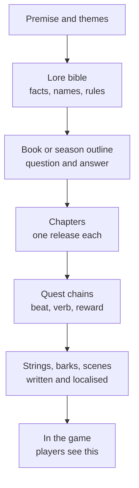

# Module 17: Narrative design for a live game

- **Goal:** design the story of an online game as a system: structure it for years of serial releases, deliver it without stopping play, keep it coherent as many people add to it, and make the game's systems say the same thing as the story.
- **Prerequisites:** [02 — Vision, pillars and loops](02-vision-pillars-loops.md), [10 — Enemies, bosses and encounters](10-enemies-encounters.md), [15 — World and level design](15-world-level.md), [16 — Quest and mission design](16-quests.md).
- **Simulation:** none
- **Facts checked:** October 2026 (prices, rules and product status change; re-check before reuse)

## In short

**Writing** produces the words. **Narrative design** decides the structure: what the player learns in what order, how story beats are paced against play, and how the story and the systems back each other up. A live online game cannot be written like a film: it is released in pieces over years, many people contribute, players skip text and a new player may start in year three. So the story is built as a **serial**: a fixed premise, a few big **arcs**, a repeatable **season** unit, **open threads** that carry on, and a **lore bible** that keeps every writer consistent. Delivery avoids stopping play: barks, environmental clues and short scenes carry most of it. The worked example gives the course game's premise, four regions as four arcs, a season model, two character sheets and one system (the world boss) driven by the story.

## 1. The concept

### 1.1 Terms

| Term | Meaning |
|---|---|
| **Narrative design** | Planning the structure, pacing and delivery of story across the whole game, including how it ties to systems |
| **Writing** | Producing the text: dialogue, item descriptions, lore entries |
| **Premise** | The story in two or three sentences: who, where, what is wrong |
| **Arc** | A story with its own question and answer, spread over several quests or releases |
| **Season** | A fixed-length release unit (for example 12 weeks) with its own arc and finale |
| **Open thread** | A question the story raises and has not yet answered |
| **Lore bible (story bible)** | The single reference for facts, names, rules and history of the world |
| **Canon** | The facts the game treats as true. **Canon management** keeps them consistent |
| **Retcon** | Changing something the story already said |
| **Bark** | A short spoken or text line during play: a shout, an idle remark, a hint |
| **Environmental storytelling** | Telling story through objects and spaces |
| **Systemic storytelling** | Telling story through rules and world state (a schedule, a changing hub) |
| **Ludonarrative harmony** | The story's message and what the player does agree; **dissonance** is when they disagree |
| **Localisation** | Adapting text and voice to other languages and regions |

### 1.2 The story stack

Each level is more detailed and changes faster than the one above. **A change at the top costs a lot; a change at the bottom is cheap.** Lock the top levels early.

## 2. The player's view

Players do not read the lore bible. They meet the story in three layers:

| Layer | What the player gets | Who uses it |
|---|---|---|
| **Glance** | Names, a character's look, barks, a smoking chimney on the horizon | Everyone, including Mira and Dev, who rarely read |
| **Quest** | Short dialogue and the quest framing (module 16) | Most players, once |
| **Lore** | A codex, item descriptions, notes in the world, long dialogue | Lena and others who dig |

The design target: **a player who reads nothing should still know the stakes** ("the furnaces are waking and the Lodge is holding them back") **and a player who reads everything should still find things to discover.** The motivations from [module 01](01-player-experience.md) it serves are Story and Discovery (Lena), Fantasy (everyone) and Community (the shared events). It supports the meta loop (module 02) by giving a reason for the next region.

Rules the player cares about, in order: **do not stop my game; let me skip; let me catch up; do not contradict yourself.**

## 3. The design space

### 3.1 Narrative design vs writing

| | **Narrative designer** | **Writer** |
|---|---|---|
| **Question** | "What should the player learn, when, and how?" | "How does this character say it?" |
| **Deliverables** | Story structure, quest outlines, beat sheets, delivery budgets, system hooks | Dialogue, barks, items, codex entries |
| **Works with** | Game, quest and level designers | Narrative designer, localisation, voice |
| **Failure** | Story on a separate track from play | Good lines that nobody sees |

In small teams one person does both. Keep the *decisions* separate from the *words*: the outline decides, the writer follows the outline.

### 3.2 Story structure options for a live game

| Structure | Shape | Public example | Strength | Risk |
|---|---|---|---|---|
| **Single campaign** | One arc, one ending, one protagonist | Single-player RPGs | Strong shape; satisfying end | A live game that finishes its story has nowhere to go |
| **Episodic** | Self-contained episodes with the same cast | Many mobile and live games | Easy to enter at any episode | Little sense of progress |
| **Serial with seasons** | A long arc split into seasons, each with a finale and open threads | *Guild Wars 2* Living World seasons; seasonal live games | Planned cadence, replaceable writers, a place to join | Needs a continuity owner |
| **Expansions and patches** | Large releases with story, plus patch-sized chapters | *Final Fantasy XIV* (a main scenario continued in each patch, as of October 2026) | Players know what to expect | Long gaps; catch-up cost |
| **Anthology** | Each season is a separate story with a theme | Some event-driven games | New players start anywhere | The world never accumulates |
| **Evergreen world** | The story is the world's history and it changes little | Games without a plot | No catch-up | Low emotional pull |

A long-lived online game is best served by the **serial with seasons** (or a mix with expansions): a stable world, a fixed premise, and a repeating unit of release. One point matters more than any other. **Do not answer the big question too early.** A live game that solves its central mystery has ended its story, and with it the reason to log in. Answer a small question each season and open a new one.

A cautionary public example: *Guild Wars 2*'s first Living World season shipped in temporary installments and much of it was unavailable for years; ArenaNet later made seasons permanent and restored the first one in 2022 (per the game's wiki and press coverage, as of October 2026). The lesson: **keep released story playable**, or newcomers meet a story with a missing beginning.

### 3.3 Delivery methods, ranked by how little they stop play

| Method | Length | Stops play? | Party-friendly? | Best for | Cost |
|---|---|---|---|---|---|
| **Barks** | 1 line, up to 8 words | No | Yes | Cues, mood, reactions, recaps | Low per line, high in volume |
| **Environmental clues** | A prop or a scene | No | Yes | Backstory, tone, a mystery | Art and level time |
| **Item and codex text** | 30–120 words | No (opt-in) | Yes | Lore, for readers | Low |
| **Quest dialogue** | 1–3 pages | Short | Solo | Beats, characters | Medium |
| **Short scene (in-engine)** | 10–30 s | Yes, brief | Skippable | Reveals | Medium |
| **Cutscene** | 60–90 s | Yes | Skippable per player | Arc finales | High |
| **Live event** | Minutes | No | Yes (shared) | Spectacle, big moments | High |

Barks are one of the cheapest and densest tools: short lines that tell the player something about the world or the next step without a menu (as the Game Developer article in Further reading describes). Cutscenes in a party game need rules: every player may skip, and the group never waits for the slowest reader.

### 3.4 Environmental and systemic storytelling

**Environmental storytelling** puts story into the arrangement of space: a cold camp with one chair turned toward the road, a tower with scorch marks that all point outward. Designers Harvey Smith and Matthias Worch described the technique in their 2010 GDC talk (see Further reading): the player is invited to work out what happened. It costs level-design time but no text, and it localises for free.

**Systemic storytelling** uses rules and state: a world boss that arrives on a schedule, a hub whose notice board changes each season, a market whose prices rise when a bridge is destroyed. The story is *in how the world behaves*. It is the form of storytelling that fits a live game best, because players meet it again and again without a cutscene.

Both need a **bible fact** behind them, so a sign in a field and a line in a quest never disagree.

### 3.5 Characters and casts: game vs fiction

| | **Fiction (a novel or a film)** | **A live online game** |
|---|---|---|
| **Cast size** | Small and tight; every character matters | Large: trainers, vendors, quest givers, bosses |
| **Why a character exists** | The story needs them | The game needs them (a service) *and* the story needs them |
| **Who the hero is** | A named protagonist | A silent or lightly written player hero |
| **Screen time** | Controlled by the author | Controlled by where the player goes |
| **Change over time** | A planned arc | An arc spread across releases, which may be years apart |

Rules for a game cast:

1. **Every named character has a function in play** (vendor, trainer, quest giver, boss, board) and a function in the story. If either is missing, merge or cut them.
2. **Use a small "face cast"**, 8–12 recurring named characters at launch, who appear across regions. Players remember a few characters well, not hundreds poorly.
3. **Give each recurring character a voice** (sentence length, favourite images) that a barks writer can copy in five lines.
4. **Cap new characters per season** so the cast does not grow beyond what the audience can follow.
5. **Fiction and game may differ on purpose.** A film adaptation may keep only the core cast of the game.

### 3.6 Lore bibles and canon management

A **lore bible** is the single source of facts. A minimal bible has:

| Section | Content |
|---|---|
| **Premise and themes** | The two-sentence story; the message |
| **Timeline** | Dated events, in order, with a clear "now" |
| **Places** | Regions, towns, dungeons with their story role |
| **Factions and characters** | Who, wants, relationships, voice |
| **Rules of the world** | What magic or machines can and cannot do |
| **Glossary and names** | The one spelling of every proper noun; words that never translate |
| **Open threads** | Questions raised, with who owns the answer |
| **Canon log** | Each fact with an ID, a status and where it first appeared |

**Canon tiers.** Not every fact is equal:

| Tier | Meaning | Change rule |
|---|---|---|
| **Locked** | Appears in shipped story or is part of the premise | Never changed; only extended |
| **Soft** | Mentioned once, lightly | May be refined if the new version fits |
| **Draft** | In planning only | Free |

**Process.** One **continuity owner** keeps the bible. Every writer reads the entry before writing and sends a note after. New facts are logged with an ID. A retcon needs the continuity owner's sign-off and an **in-world explanation** ("the old Lodge records were wrong"). Public example: *World of Warcraft* has revised parts of its lore over many years, and the books that summarise it show how much explaining that takes (as of October 2026; so plan to avoid retcons).

### 3.7 Ludonarrative harmony

If the story says one thing and the mechanics reward another, players feel the gap even if they cannot name it. Critic Clint Hocking called this **ludonarrative dissonance** in a 2007 essay about *BioShock*: its mechanics rewarded self-interest while its story argued against it (see Further reading).

A quick audit for any system:

| Question | Harmonic answer | Dissonant answer |
|---|---|---|
| What does the story say matters? | "Shared burden" | "Shared burden" |
| What does the system reward? | Participation, cooperation | Top damage, solo carry |
| Does the world react the same way the story says? | A boss that returns, as the story says it must | A boss that "dies for good" and returns next week |

Fix the system or fix the story. Do not fix the player.

### 3.8 Delivering story without stopping play

| Technique | How |
|---|---|
| **Move while talking** | Dialogue lines play as a banner while the hero keeps moving; a character walks with the player |
| **Barks for hints and mood** | An NPC says what the player should know in 8 words |
| **Skippable by default** | A skip button on every scene and a summary on skip |
| **Never in a fight** | No scene starts while enemies are alive; the player decides when to read |
| **Never wait for a slow reader** | A party moves on when everyone has skipped, or after a fixed time |
| **Rewatch** | Every scene can be replayed from the journal (for Lena) |
| **Recap** | A short "previously" for returning players |

### 3.9 Localisation-aware writing

Most online games ship in several languages. Write so that translation is easy and correct:

| Rule | Why | Example |
|---|---|---|
| **Never build a sentence from pieces** | Word order and grammar differ | Bad: `"You defeated " + n + " raiders"`. Good: one string with a placeholder |
| **Use plural and gender rules from a standard** | Languages have different plural forms | ICU message format; CLDR plural rules |
| **Leave room for expansion** | Translated text is usually longer; very short labels grow the most | Budget about 1.3× for long text and 2–3× for labels of ten characters or less (W3C summary of IBM guidance) |
| **Give context** | A translator sees one string, not the scene | Add "who speaks to whom" and where it appears |
| **Avoid idioms and puns** | They do not travel | Say "we hold the line", not a joke on the word |
| **Keep names stable** | Players search for them; art and VO use them | A glossary of names that never translate |
| **Do not put text in images** | Image text cannot be localised cheaply | Keep it as strings |
| **Plan register** | Many languages have formal or informal address | Mark how a character addresses the player |
| **Test with fake text** | Finds clipped strings early | Pseudo-localisation: expand and accent every string |

### 3.10 Keeping the story coherent across years

| Risk | Control |
|---|---|
| Writers change; nobody remembers earlier details | A bible and a canon log, with a continuity owner |
| Features contradict the story | A narrative review of each feature spec (the ludonarrative audit) |
| Threads dropped | An open-threads list, reviewed each season |
| Old story becomes unreachable | Keep all released story playable or readable (codex, replay) |
| New players are lost | A recap and a level-50 entry point for each season |
| The cast grows without limit | A cap on new characters and a "retire" rule |
| A mystery with no answer | Open only threads that someone has already planned to answer |
| Players guess your twist | Plan two seasons ahead; keep a "red herring" list |

### 3.11 How to choose

| If your game is... | Structure | Delivery | Cast |
|---|---|---|---|
| **Online RPG, years of updates** (the course game) | Serial with seasons; fixed premise | Quests, barks, environmental, a few finales | Small face cast, recurring |
| **Single-player story RPG** | Single campaign | Cutscenes, long dialogue | Large authored cast |
| **Competitive game** | Evergreen world, event lore | Skins, short videos, codex | Mascots, no arcs |
| **Mobile hero collector** | Episodic chapters with new heroes as story | Short scenes, hero bios | One story per hero |

## 4. Tuning and pitfalls

### 4.1 Budgets

Decide the amount of story per hour of play, then hold it. Invented targets for the course game:

| Item | Budget |
|---|---|
| **Barks** | Up to 8 words (about 60 characters), 3 s long; 1 per 2 minutes of field play |
| **Quest dialogue** | Up to 3 pages of up to 35 words each |
| **Short scenes** | Up to 30 s in fields, up to 15 s in dungeons, always skippable |
| **Cutscenes** | 60–90 s; only at the end of each arc and each season |
| **Codex entry** | Up to 120 words |
| **Text on screen at once** | Up to 3 lines on mobile |

Reading speed for a typical adult is roughly 200–250 words per minute on a screen (rule of thumb, inferred), so a 35-word page takes 9–11 seconds. Three pages is 30 seconds, which is the most a quest giver should ask for before the player acts.

### 4.2 Signals that something is wrong

| Signal | Likely problem |
|---|---|
| Playtesters skip every dialogue and cannot say what the stakes are | The glance layer is missing: nothing in barks or world carries the story |
| Players ask the same story question in chat | The answer is not discoverable, or the quest text is unclear |
| Lore posts by players contradict each other | The bible has holes or old content contradicts new |
| Returning players ask "what is going on?" | No recap |
| A system is described one way and behaves another | Ludonarrative dissonance |
| Translations are cut off | No expansion room; strings built from pieces |
| The cast list grows each season | No cap |

### 4.3 Classic failures

- **Lore dump.** A page of text where one bark would do.
- **The mystery box.** An open question with no planned answer. Players wait, then feel cheated.
- **The cast sprawl.** Hundreds of characters, most forgotten, many added only to sell something; the core story loses its shape.
- **The retcon spiral.** Each fix creates a new contradiction.
- **The ending that ends the game.** A live game that resolves its main story must have the next story planned.
- **Mechanics that say the opposite.** A rewards system that tells the player to ignore the theme.
- **Unreachable story.** Old chapters removed, so new players cannot follow.
- **Untranslatable writing.** Jokes, puns, built-up sentences.

## 5. Worked example

The course game's story. Names and facts are invented, and this module's story is what the [worked examples of module 15](15-world-level.md) and [module 16](16-quests.md) already use.

### 5.1 Premise and themes

> A century ago the **Hearthworks**, vast furnace-engines under the mountains that warmed a whole continent, failed in a single night called the **Long Ash**. The empire that built them fell. Snow and ash buried the old coast. The **Wayfarer Lodge**, a charter of explorers, holds the last warm valleys. Now, one by one, the dead furnaces are being relit, and no one knows who is doing it or what it will cost.

- **Theme:** *No one keeps a fire alone.* Warmth is a shared burden.
- **The player:** a **Wayfarer**, a Lodge recruit, a silent hero.
- **Book One question:** *Who is relighting the furnaces, and should they be stopped?*

### 5.2 The four regions as four arcs

| Region | Levels | Arc title | Arc question | What the player learns | Hub | Boss (module 10 style) |
|---|---|---|---|---|---|---|
| **Ashfall Vale** | 1–11 | The First Spark | Who lit the Foundry? | A hand lit it; a signet of a former Keeper is found | Kindlewick | Cinder Warden |
| **Frostmere Reach** | 12–24 | The Cold Oath | Why did the Keepers leave the furnaces dark? | A lit furnace drains the land's warmth around it; the Lodge hid this | Rimewatch | The Oath Sentinel |
| **Gloam Fen** | 25–37 | The Rotting Tide | Is the relighter right? | A relit furnace saved a village and poisoned a fen; the Lodge is blamed | Stilt Market | The Fen Condenser |
| **Skyforge Peaks** | 38–50 (cap) | The Heart Below | Can one person carry the whole fire? | The relighter is Kael Voss, and he lights the Heart | Highwatch | The Ashen Colossus (world boss) |

Each arc follows one **shape**: a question in the first hour of the region, three reversals, a dungeon boss that is the physical consequence, and a final scene that answers the question and opens the next. In each region, a **codex** collects **three of Kael's notes** (environmental storytelling, readable but never required).

At the end of Book One the Colossus rises, the player and the Lodge hold it back, and Kael walks into the Heart chamber. His fate and the signal now rising from the Heart across the sea are the two **open threads** that open the first season.

The ten dungeons, by region (names proposed for the example): Vale: Smoldering Foundry, Cinderwake Mines. Frostmere: Rimewatch Undercroft, Frozen Penstock, Garrison of the Oath. Fen: Sunken Condenser, Gloamroot Hollow, Bellows of the Bog. Peaks: Quenching Halls, Heart Chamber.

### 5.3 The season model

| Level | Unit | Length | Contents |
|---|---|---|---|
| **Book** | A major tier of the story | 1 year or more | Book One (Embers) is the launch: 4 regions, about 25 hours |
| **Season** | A release unit tied to the seasonal pass | 12 weeks | 3 chapters and a finale event |
| **Chapter** | One patch | About 4 weeks | About 40 minutes of story quests, usually at level 50 |
| **Finale** | The last week of a season | 1 week | A shared event; the season's boss |

Rules of the season:

1. **One question answered, one opened.** A season resolves a small thread and opens a new one.
2. **Up to two new named characters** per season, and **at most one** may leave or die.
3. **Every chapter stays playable forever.** No removal.
4. **An entry point at level 50**: a new player reaches the season's start after Book One through a recap quest.
5. **A recap on login**: a 90-second "Previously" screen for returning players, which Lena can replay in the journal.
6. **Plan two seasons ahead** (the outline) and **one season in detail** (the beat sheet).
7. **Each season has a mutation** for the world boss (section 5.5), so the live event echoes the story.

| Season | Title | Question it opens | Notes |
|---|---|---|---|
| **1** | Signal Fires | Who answers the signal from the Heart? | New coastal region slice; Kael's fate stays a thread |
| **2** | The Salt Court | What do the sea-faring cities want from the furnaces? | A faction story; cosmetic factions only |
| **3** | The Quiet Furnace | What is the Heart for? | Closes the Book Two question and opens a new tier |

### 5.4 Two character sheets

**Maren Holt, Marshal of the Wayfarer Lodge**

| Field | Entry |
|---|---|
| **Role in story** | The player's mentor and the Lodge's face; the first voice in the game |
| **Role in play** | Lodge Hall quest giver in Kindlewick; runs the group board; posts the "Previously" recap; her **bell** announces the Ash Tide (5.5) |
| **Age, look** | 58; grey braid, a burn scar across the left hand, a Lodge coat patched with ash-grey wool |
| **Wants** | To keep the frontier alive without another sacrifice |
| **Needs** | To admit the Lodge hid why the Keepers sealed the furnaces |
| **Flaw** | Loyalty to the Lodge over the truth |
| **Voice** | Dry, short sentences; hearth images ("Keep your back to the wall and your hands to the fire") |
| **Sample barks** | "Eyes up, Wayfarer." / "The Lodge remembers." / "That's a hot road. Walk it fast." / "Bell's ringing. Time to hold the line." |
| **Relationships** | Kael's former teacher; trusts the player slowly |
| **Arc** | Book One: from "the Lodge is right" to "the Lodge was wrong"; Season 1: faces the Council |
| **Canon facts (locked)** | Left-handed; never leaves Kindlewick before Book Two; she rings the bell herself |
| **Localisation notes** | Keep the name; "Marshal" is a title that may be translated; avoid jokes in the barks; mark her address to the player as informal-firm |

**Kael Voss, the Relighter**

| Field | Entry |
|---|---|
| **Role in story** | Antagonist with a case; the answer to Book One's question |
| **Role in play** | Never fought directly in Book One. His actions create the dungeon bosses; his **notes** appear in each region as collectibles; a signet in the Vale; a voice in the Heart chamber |
| **Age, look** | 41; former Keeper, soot-dark coat, a silver Keeper's signet on a chain |
| **Wants** | To end the Long Ash by relighting the Heart |
| **Needs** | To accept that the fire is shared |
| **Flaw** | He believes only one person can bear it, and that person is him |
| **Voice** | Gentle and precise; he asks questions in his notes ("What is a fire that no one tends?") |
| **Sample note lines** | "I counted the furnaces by the cold they left." / "A village is warm tonight. That is my argument." |
| **Relationships** | Maren's former apprentice; he left the Lodge over the Oath |
| **Arc** | Book One: shown as a threat, then as a man with a point; ends by entering the Heart. Open thread: is he alive, and is he the voice that answers? |
| **Canon facts (locked)** | Did not light the Foundry himself (the Cinder Warden woke when he opened a gate); never kills a Wayfarer; his notes are in his own handwriting |
| **Localisation notes** | Keep the questions short; avoid wordplay; notes are item text, so give each translator the speaker and the place |

### 5.5 How the story drives one system: the Ash Tide

The weekly world boss, the **Ashen Colossus** (module 10), is the course game's biggest shared event. Every rule of its schedule has a **story reason**, so the system reads as the story and not as a timer.

| System rule (module 10) | Story reason (bible entry) |
|---|---|
| The boss appears **twice a week** | The Heart **pulses** every few days, and each pulse sends a tide of ash that wakes the Colossus |
| Announced **30 minutes** ahead | Maren **rings the Lodge bell** and the notice board shows the warning |
| Up to **40 players per layer** | The Lodge organises the line into **watches**, each with its own lanterns |
| **9,000 HP per player**, clamped to 10–40 players | The Colossus is stronger when more people stand near the Heart's echo |
| **At least 5 % contribution** for rewards | Everyone who **held the line** gets a share; this is the rule, not a rank |
| The boss **leaves after 20 minutes** | The **tide ebbs** and the ash settles |
| It **returns** every time | **Locked canon:** the Heart relights it after every defeat, until the Heart is resolved |
| A **mutation each season** | The tide carries the season's threat: new mechanic, new cosmetic |

**Ludonarrative audit.** The story's theme is *no one keeps a fire alone*. The system rewards **participation** (5 % contribution) and gives no prize to the top damage dealer, so the rule and the theme agree. A "damage ranking with a unique prize" would contradict the theme and was cut. Also, players kill the Colossus twice a week, so the story **must** say that it returns; if it said "defeated forever", the weekly event would be dissonant.

**What the player sees.** The bell sound and the banner (glance), Maren's two lines in the notice (quest layer) and a codex entry titled "The Pulse" (lore layer). No cutscene.

### 5.6 Delivery plan for the course game

| Moment | Delivery | Length |
|---|---|---|
| First 10 minutes | Maren's greeting as a banner while the player moves; a smoking chimney on the horizon (module 15) | 2 barks, 0 scenes |
| Quest dialogue | Up to 3 pages, skippable | 20–30 s |
| Dungeon | A boss intro of up to 15 s, skippable by each player, and a few barks | 15 s |
| Arc finale | One in-engine scene | 60–90 s |
| Season finale | A shared event plus one scene | About 5 minutes |
| Lore | Kael's notes, item text, codex | Opt-in |
| Returning player | A "Previously" screen | 90 s |

### 5.7 What was cut

- **A named, voiced hero.** A silent Wayfarer keeps the game open to all five classes and avoids localising voice acting for the hero.
- **A branching story with player-made canon.** It would multiply content and break the shared world; choices are cosmetic or local.
- **A fixed ending.** Book One ends with open threads; a planned final book is a decision for later.
- **Full voice-over.** Barks and finales are the only candidates for audio; the rest is text.
- **Faction wars.** Season 2's factions are cosmetic, since open-world PvP is out of scope (course game scope).

### 5.8 For another kind of game

| Game type | What changes |
|---|---|
| **Single-player story RPG** | A planned arc with a real ending; cutscenes and long dialogue are fine; a named protagonist |
| **Hero-collection game** | One short story per hero, in chapters; the cast is the roster, so write a voice per hero and a cap per season |
| **Competitive game** | Lore lives in skins, short films and a codex; no quests |
| **Mobile idle** | Story in short unlockable scenes tied to progress milestones |

## Key takeaways

- **Narrative design** decides structure and delivery; **writing** fills it. Keep the decisions in an outline, and let the writers follow it.
- A live game is a **serial**: a fixed premise, arcs, a repeatable season unit, and open threads. Never answer the big question early.
- **Do not stop the play.** Prefer barks, environment and systems, with short skippable scenes and a recap for returning players.
- A game cast serves **two functions** (a service in play and a role in the story); keep a small, recurring face cast and cap new characters per season.
- A **lore bible with canon tiers and one continuity owner** is how many writers stay consistent over years; keep released story playable.
- Audit every system for **ludonarrative harmony**: what the story says matters and what the rules reward must agree.
- Write for **localisation**: whole strings, standard plural rules, room for expansion, stable names, no puns.

## Further reading

- Clint Hocking and ludonarrative dissonance (overview): https://en.wikipedia.org/wiki/Ludonarrative_dissonance
- Harvey Smith and Matthias Worch, "What Happened Here? Environmental Storytelling" (GDC 2010): https://www.gdcvault.com/play/1012647/What-Happened-Here-Environmental
- Environmental storytelling (overview): https://en.wikipedia.org/wiki/Environmental_storytelling
- Game Developer, "Adding Life to Worlds with Dialogue Barks": https://www.gamedeveloper.com/design/adding-life-to-worlds-with-dialogue-barks
- Guild Wars 2 wiki, Living World Season 1: https://wiki.guildwars2.com/wiki/Living_World_Season_1
- W3C, "Text size in translation": https://www.w3.org/International/articles/article-text-size.en.html
- ICU message format (plurals, gender): https://unicode-org.github.io/icu/userguide/format_parse/messages/
- Unicode CLDR plural rules: https://cldr.unicode.org/index/cldr-spec/plural-rules
- Pseudolocalization (overview): https://en.wikipedia.org/wiki/Pseudolocalization
- Cutscene (overview): https://en.wikipedia.org/wiki/Cutscene
