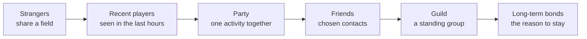
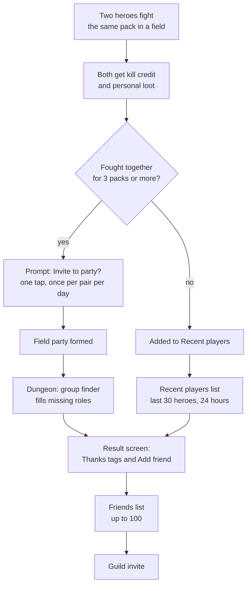

# Module 18: Social systems

- **Goal:** design the social layer of an online RPG (parties, guilds, friends, chat, trading) so that players meet, stay together and stay safe, without forcing anyone to socialise.
- **Prerequisites:** [01 — The player experience](01-player-experience.md), [02 — Vision, pillars and loops](02-vision-pillars-loops.md), [09 — One hero, a party or a roster](09-party-roster.md), [15 — World and level design](15-world-level.md).
- **Simulation:** none
- **Facts checked:** October 2026 (prices, rules and product status change; re-check before reuse)

## In short

A **social system** is any feature that lets players find each other, act together and talk. In an online RPG it is the main reason people stay for years: content gets consumed, friends do not. The tools form a ladder: **strangers** share a field, **parties** run content together, **friends** keep in touch, **guilds** give a standing group a home and shared goals. Around the ladder sit **chat**, **expression** (emotes, pings), **trading** and the safety machinery (**moderation**, **reporting**, **protection of minors**) that keeps the ladder usable. The central design choice is how much the game *requires* social play versus *rewards* it. The worked example designs the course game's guild (50 members, four ranks, a weekly goal that scales with how many members are active, a guild hall in Kindlewick), its friends and chat rules, and how shared kill credit in the fields feeds the group finder.

## 1. The concept

### 1.1 Terms

| Term | Meaning |
|---|---|
| **Party** | A short-lived group formed for one activity (module 09 defines the course game's) |
| **Group finder** | A tool that lists open parties and fills slots automatically (module 09) |
| **Guild (clan, free company)** | A standing, named group with ranks, a roster, a message of the day and usually shared goals |
| **Friend list** | A personal list of players you chose, showing whether they are online |
| **Presence** | What others can see about you: online, away, what you are doing and where |
| **Channel** | A named stream of chat: local, party, guild, whisper |
| **Whisper** | A private message to one player |
| **Emote** | A short animation or pose a hero performs on command |
| **Ping** | A one-tap signal placed in the world or sent as a preset phrase ("Help", "Wait") |
| **Block (ignore)** | A personal setting that hides another player's messages and stops their invites |
| **Report** | A message to the game's staff that a player broke the rules |
| **Moderation** | The tools and people that enforce the rules: filters, review, sanctions, appeals |
| **Toxicity** | Harassment, abuse and griefing between players; the umbrella term used in the industry |

### 1.2 The social ladder

Players do not jump from "alone" to "guild". They climb, and each step must be easy and optional.

Most of the design work is on the arrows: what gives two strangers a reason to talk, what makes a good party want to meet again, what makes friends want a shared home.

## 2. The player's view

Social systems serve the **Community** and **Relatedness** motivations of [module 01](01-player-experience.md): "I am connected to others" and "my group needs me". They are also the answer to the meta loop of [module 02](02-vision-pillars-loops.md): after the content is learned, the question "why log in tonight?" is usually answered by a person.

What players want from the social layer:

| Player need | Feature that serves it |
|---|---|
| "I want to play with someone right now" | Group finder, friends' presence, "join friend" |
| "I want to belong" | A guild with a name, a hall and a shared goal |
| "I want to be helpful and be seen as helpful" | Thanks tags, roles that matter, revive and support skills |
| "I want to say something quick" | Emotes, pings, preset phrases |
| "I want to be safe and in control" | Block, mute, report, clear rules |
| "I do not want to be forced" | Solo-viable content, no mandatory guild |

Two cautions from research and practice:

- **Many players are social only a little.** A well-known study of a large online RPG found that players often spend much of their time near others without grouping, "alone together" (Ducheneaut and others, 2006). Design for people who want company, not conversation.
- **Social pressure can become obligation.** Raid attendance rules, "be online at 20:00 or lose your slot" and public contribution rankings turn a hobby into a shift. The same features that bind players can burn them out.

## 3. The design space

### 3.1 Forming groups

Module 09 covers parties and group finders in full. The social-design point is that **the cheaper it is to form a group, the more groups form**, and each extra step (open a window, write a message, wait) loses players. Many games offer three paths at once: invite a friend, join a listed party, or press one button and be matched.

### 3.2 Guilds: size

| Size band | Feel | Used for | Cost |
|---|---|---|---|
| **Small (up to about 50)** | Everyone knows everyone; one chat is readable | Mobile and casual-leaning games; friend groups | Few members to staff large content |
| **Medium (100–200)** | A community with sub-groups | Games with 20+ player content | Needs officers and sub-channels |
| **Large (500 and up)** | A small society, often with several sub-guilds | Games with sieges and territory | Needs tools: ranks, permissions, logs, alliances |

Public examples (as of October 2026): in *Guild Wars 2* a guild starts at 50 members and can be upgraded to 500; in *Final Fantasy XIV* a Free Company holds up to 512 members. Anthropologist Robin Dunbar's famous figure of about 150 stable relationships is often quoted to justify guild sizes, but it is contested and should be read as a rough prompt, not a rule.

**How to choose:** size follows the largest activity. If the biggest shared content is a 40-player boss, a guild of 50 is enough; if it is a siege between hundreds, a guild must be large.

### 3.3 Guilds: ranks and permissions

A rank is a bundle of permissions. Most games ship a few default ranks and let leaders edit them.

| Permission | Typical default | Why it matters |
|---|---|---|
| Invite and remove members | Officer and above | Keeps the roster under control |
| Edit message of the day | Officer and above | The guild's front door |
| Start guild events | Officer and above | Protects shared goals |
| Edit ranks, transfer leadership, disband | Leader only | Prevents a coup |
| Use the guild bank or storage | Rank-based | The most abused permission (see below) |

**Succession** is the rule people forget. If the leader stops logging in, the guild is stuck. Good rule: after a set period of inactivity, the longest-serving active officer is promoted, with a notice to everyone.

**Guild banks and storage** hold shared items or currency. They create trust problems (a leader or officer can empty it) and economy problems (a bank is a channel for gold sellers and bots). Many games ship them anyway; a simple game can leave them out.

### 3.4 Guilds: progression, halls and content

A guild needs a reason to exist beyond a chat channel.

| Mechanism | What it does | Risk |
|---|---|---|
| **Guild level or reputation** | Contributions raise a guild rank that unlocks perks | Perks become power; large guilds win |
| **Weekly or seasonal goals** | The whole guild fills a bar together | Rewards must not depend on a few heavy players |
| **Guild hall or base** | A shared space: board, trophies, decorations | Space and moderation cost; can become housing |
| **Guild-only content** | A dungeon, a mission or a boss for guild groups | Splits the player base; needs scaling for small guilds |
| **Guild versus guild** | Territory, sieges, leaderboards | Needs PvP, balance and anti-cheat (module 19); excludes the casual |

Public example (as of October 2026): *Guild Wars 2* lets members cooperate to unlock a guild hall and buy upgrades, and runs cooperative **Guild Missions** that pay out commendations. Its model rewards the guild collectively rather than ranking members.

**Design rule for guild goals:** scale the target to the number of *active* members and cap each member's contribution, so that a three-person guild and a fifty-person guild can both finish, and no single heavy player carries the rest.

### 3.5 Friends and presence

| Feature | Options | Notes |
|---|---|---|
| **Friend list size** | 50–200 is typical | A cap keeps the list meaningful and the server cheap |
| **Request type** | Mutual (both accept) is standard | One-way "follow" lists exist but invite harassment |
| **Presence detail** | Online only, plus activity, plus location | More detail means more privacy risk; give a setting |
| **Appear offline** | Common and wanted | Without it, players mute notifications instead |
| **Recent players list** | Last 20–50 people you grouped with | A cheap bridge between a stranger and a friend |
| **Cross-platform friends** | One list for PC and mobile | Needed if accounts are shared |

### 3.6 Chat and channels

| Channel | Scope | Common problem |
|---|---|---|
| **Local (zone, town)** | Everyone near you | Spam in busy towns |
| **World or global** | Everyone on the server | Advertising, scams, abuse; hard to moderate |
| **Trade** | A channel for selling | Scam traffic; made redundant by a market |
| **Party and raid** | Your group | Low risk; the main place for coordination |
| **Guild** | Your guild | Low risk; needs mute and rank rules |
| **Whisper** | One to one | The main route for harassment and scams |
| **Voice** | Real-time speech | Highest value for coordination; highest moderation cost; many games rely on outside tools |

Two practical rules. **Phones make typing slow**, so offer presets and pings. **Defaults matter more than options**: public evidence shows regulators now treat risky defaults as a design fault (section 4.5).

### 3.7 Expression: emotes and pings

Emotes are cheap and loved: they let players be silly, thank someone, dance at a boss's corpse. They carry the game's tone. Design points:

- Make some **unlockable through play** (a collection goal, module 20) and some cosmetic purchases (module 14).
- Provide a **radial wheel** on touch so emotes do not need typing.
- Use **pings** for coordination ("Help", "On my way", "Wait", "Thanks"). A preset phrase is translated automatically by the client, which also helps across languages.
- Keep emotes **non-gameplay**: they must not block movement, push others or be usable to grief.

### 3.8 Trading between players

Module 13 covers the economy side. The social side is **trust**.

| Method | Social effect | Typical scam |
|---|---|---|
| **Direct trade window** | Two players swap in view of each other | Switching the item at the last moment; "I'll pay after" |
| **Mail** | Asynchronous gifts and cash on delivery | Phishing links, stolen accounts used as mules |
| **Auction house or market** | Anonymous and fast | Price manipulation, cut-and-paste fakes |
| **Party loot trade (a time window)** | Fixes a bad drop within a group | Pressure ("give it to me") |

Standard defences:

1. **Two-step confirmation.** Each side offers, then both review a locked summary and confirm. Any change cancels the confirmations. *RuneScape*'s trade screens work this way (as of October 2026).
2. **Show the whole item**: name, rarity, level and bound state, in the same form everywhere.
3. **Block links in chat** or show them as plain text.
4. **Trade restrictions on new accounts**: a minimum level and account age.
5. **A staff channel**: scammed players can report with the trade log attached, and staff can reverse proven duplication or fraud.

### 3.9 Cooperation versus competition

Social systems make a choice between three modes, and mixing them badly is the commonest design error.

| Mode | Example | Effect |
|---|---|---|
| **Cooperative** | Party dungeon with personal loot, shared field credit | Strangers are allies by default |
| **Cooperative-competitive** | Guild goals, guild leaderboards | Pride and rivalry; excludes small guilds and casual players |
| **Competitive** | Duels, arenas, sieges (module 19) | Strong feeling for a minority; needs fair rules |

The failure is competition *inside* cooperation: need-or-greed rolls on a shared chest, kill-stealing, a damage meter that names and shames, a vote to kick a player the moment the boss dies. Each makes strangers wary of each other. Personal loot and shared credit (module 09 and the example below) remove the incentive instead of policing the behaviour.

### 3.10 Toxicity, moderation and reporting

**What the evidence says.** Riot Games reported at GDC 2013 that about 1% of players in *League of Legends* were consistently toxic and produced only about 5% of the toxic behaviour: most of it came from ordinary players having a bad day (as reported by Scientific American). The Anti-Defamation League's survey of adult players in US online multiplayer games found 76% had experienced some harassment in 2023 (as of October 2026). Two lessons: toxicity is mostly situational, so **design fixes the situations**; and it is common, so **you need systems**, not just a code of conduct.

**What worked in public reports (as of October 2026):**

- Riot made all-chat with the other team opt-in. The share of games using chat stayed about the same, and measured toxicity fell.
- Riot's "reform cards" explained to sanctioned players exactly what they did, and repeat offences dropped.
- Blizzard's *Overwatch* endorsement system (positive tags after a match) plus a looking-for-group tool was reported to cut disruptive behaviour by about 40% (GDC 2019).

**A moderation stack has layers:**

| Layer | Tool | Strength | Weakness |
|---|---|---|---|
| **Prevention** | Defaults, presets, no cross-team chat | Fixes the situation | Reduces expression |
| **Automatic filters** | Word lists, link blocking, spam throttle | Fast, cheap | Evaded; false positives; language-specific |
| **Player tools** | Mute, block, kick vote | Instant, personal | Does not stop the offender |
| **Reports** | In-game report with context | Finds what filters miss | Slow; needs staff; can be abused |
| **Human review** | Trained moderators | Context and judgement | Cost and wellbeing of staff |
| **Sanctions** | Warning, mute, suspension, ban | Deters repeat offenders | Must be consistent and appealable |

**A good report flow:** one tap from a name or chat line; a short list of reasons; the last 20 chat lines attached automatically; a thank-you message; and, when action is taken, a notice back to the reporter. Without feedback, players stop reporting.

**A sanction ladder:** warning, mute for 24 hours, mute or suspension for 7 days, longer suspension, permanent ban. Skip steps for severe cases such as threats or sexual content involving minors. Allow an appeal. Publish the rules in plain language.

### 3.11 Safety for minors

Many players are under 18, and some are under 13. The rules differ by country and change often, so treat this section as a checklist and ask a lawyer.

| Rule or guidance (as of October 2026) | What it asks of a game's social features |
|---|---|
| **COPPA** (US, children under 13; the FTC's updated rule was published in April 2025, with most new requirements applying from 22 April 2026) | Parental consent before collecting a child's personal data; careful handling of chat and contact features |
| **FTC action against Epic Games** (December 2022, $275 million penalty for COPPA violations) | The FTC alleged that on-by-default text and voice chat harmed children and teens; the order requires such features to be off by default for under-13s unless a parent consents |
| **UK Age Appropriate Design Code** (ICO) | Settings "high privacy" by default; the child's best interests first in apps and games |
| **UK Online Safety Act** (children's duties in force from 25 July 2025) | Risk assessments and safety measures for services children use, including user-to-user chat |
| **EU Digital Services Act, Article 28** (Commission guidelines, July 2025) | A high level of privacy, safety and security for minors on platforms they can access |

Design implications that hold in all of them:

1. **Know the age bracket** (or assume the youngest) and set the **defaults** by it: restricted chat, private presence, no unsolicited whispers.
2. **Avoid collecting what you do not need.** Chat logs are personal data.
3. **Parents get controls** where the law requires them, and they are easy to find.
4. **No real-money pressure in social features** (module 14).
5. **Report and block must be one tap away**, in every chat and on every profile.

### 3.12 Social features on mobile

| Constraint | Design response |
|---|---|
| Typing is slow | Presets, pings, emote wheel, short guild messages |
| Sessions are 15–25 minutes | A group must form in under 2 minutes; one-tap fill |
| The phone is a notification device | Opt-in push messages with quiet hours; never nag |
| People play at odd hours | Asynchronous social: guild board, "thanks" tags, goals that fill over a week |
| Small screens | Few chat channels visible at once; auto-collapse |
| Platform rules | App stores require report and block features for user-generated content (as of October 2026, per Apple and Google store policies) |

### 3.13 How to choose

| Question | If yes | If no |
|---|---|---|
| Is the biggest content 20 or more players? | Large guilds, ranks with permissions | Small guilds, three ranks |
| Is the audience mostly mobile and casual? | Presets and pings first; goals that fill over days | Real-time chat and voice can lead |
| Does the game have PvP territory? | Guild versus guild, strong tools and logs | Keep guilds cooperative; no rankings |
| Is the audience young? | Restricted-by-default chat, parental controls | Standard defaults with block and report |
| Is trading central to the economy? | Two-step trade, restrictions, staff reversal | Binding rules, no player market |

## 4. Tuning and pitfalls

### 4.1 Signals

| Signal | Likely problem |
|---|---|
| Parties form but nobody adds friends | No bridge from "recent players" to friends; no thanks or prompt |
| Guilds are created and abandoned within a month | Goals too hard for small groups, or no reason to return to the hall |
| One member does most guild contributions | No per-member cap; the goal is not scaled to active members |
| Reports are many but staff act on few | Report reasons unclear, or players report disagreements |
| Players ask in chat "anyone for a dungeon?" every night | The group finder is slower than chat |
| New players report being ignored or insulted in the first week | No social onboarding; no "new player" tag or mentor |
| Scam reports spike after a trade rule change | The new rule opened a hole; check logs |
| Players in guilds retain better | Likely **correlation**: players who like company join guilds and also stay; test with an experiment before spending on guild features (inferred from common analytics practice) |

### 4.2 Classic failures

- **The mandatory guild.** If the best rewards require a guild, solo players and shy players are shut out. This game keeps rewards for guilds modest and solo play never blocked (pillar 3).
- **The attendance shift.** Guild goals that need members online at a fixed hour create resentment.
- **The ghost guild.** Hundreds of empty guild names clutter search. Require a small founding group and prune inactive guilds.
- **The leader trap.** One founder holds the guild hostage. Add succession and an officer majority to remove a leader.
- **The unmoderated whisper.** Most harassment and scams arrive by whisper. Provide block, and rate-limit whispers from strangers.
- **The toxic default.** Open global chat for everyone, including children, with no filter, is the setting regulators now penalise.
- **The grief loophole.** Emotes that block doors, kick votes after a kill, kill-stealing in fields. Remove the incentive, then police what is left.

## 5. Worked example

The course game: a small online fantasy RPG, parties of four with personal loot, a shared world, free to play ([the fact sheet](_course-game.md)). The social layer serves **pillar 3 ("Stronger together": groups get better rewards per hour than solo; solo is never blocked)** and **pillar 4 ("fair and respectful of time")**. All numbers are invented.

### 5.1 Intent

A player should meet others without asking, find a group in under two minutes, keep the people they like, and belong to a guild that *helps* without *demanding*. Mira (evenings, community-minded) gets a home and goals. Dev (phone, 15–25 minutes) gets one-tap groups and a guild that counts his short sessions. Lena (weekends, story) can ignore all of it and lose nothing.

### 5.2 How strangers become a group

Two features from earlier modules work together here:

- **Shared kill credit in fields** ([module 15](15-world-level.md)): anyone who damages an enemy gets full credit and their own loot. A stranger arriving at your pack is **never a thief**; they are free help.
- **The group finder** ([module 09](09-party-roster.md)): used for dungeons, with open parties, missing-role hints and one-tap fill from two players.

Rules that make it work:

1. **No kill-steal, no loot competition.** Damage tags the enemy for everyone who contributed. Loot is personal ([module 09](09-party-roster.md)); a party member can trade a gear drop within the two-hour window defined there.
2. **The "invite" prompt** appears after three shared packs, once per pair per day, and can be turned off.
3. **After every dungeon** the result screen offers **Thanks tags** (Helpful, Friendly, Skilled) and an **Add friend** button per party member.
4. **The group finder tags** a party "Guild run" when three or more members share a guild (section 5.3).

### 5.3 The guild system

| Rule | Value | Reason |
|---|---|---|
| **Founding** | Level 15; three founders sign a charter at the Guild Hall; a small soft-currency fee set by [module 13](13-economy.md) | Avoids empty "ghost" guilds |
| **Size** | 50 members, one guild per account | A guild fits one hall; everyone can know everyone |
| **Ranks** | **Leader** (1), **Officer** (up to 5), **Member**, **Recruit** (first 3 days) | Four ranks are enough for one hall |
| **Recruit limits** | Recruits play everything but cannot invite or edit | A cheap guard against abuse |
| **Permissions** | Officers: invite, remove, message of the day, start events. Leader: edit ranks, transfer, disband | Matches section 3.3 |
| **Succession** | After 30 days without a login, the longest-serving active Officer becomes Leader, with a notice to the guild | Prevents dead guilds |
| **Leader removal** | A majority of Officers can vote out an inactive or abusive Leader | Prevents hostage-taking |
| **Guild bank** | None at launch (cut) | No theft, no gold-seller channel |
| **Contribution visibility** | Each member sees their own; Officers see the roster | Management without public shaming |
| **Leaving and joining** | No cooldown; a joiner counts for goals after 3 days | Stops guild-hopping for rewards |

### 5.4 Guild goals: the Hearth Goal

Each week every guild has one shared **Hearth Goal**: a bar filled by members' normal play. It serves pillar 3 (play together, fill together) and pillar 4 (short sessions count).

| Activity (module 20 schedules them) | Kindling added to the bar |
|---|---|
| A weekly dungeon cleared | 10 |
| A weekly dungeon cleared in a **Guild run** (3+ guild members) | 20 |
| An Ash Tide kill with 5% contribution or more (module 10) | 10 |
| One day's three board bounties (module 16) | 2 |
| Cap per member per week | 60 |

Three **tiers** fill from the same bar. The target is set by the number of **active members** (members with at least one contribution in the last 7 days):

| Tier | Target per active member | Reward (all personal, no power) |
|---|---|---|
| 1 | 20 Kindling | Crafting materials and consumables for every member |
| 2 | 35 Kindling | A cosmetic for the guild banner and hall decoration (permanent) |
| 3 | 50 Kindling | A hall decoration set for the season and a cosmetic title |

Worked example. A guild has 20 members, 16 of them active that week. Targets: tier 1 = 16 × 20 = **320**, tier 2 = 16 × 35 = **560**, tier 3 = 16 × 50 = **800**. Suppose 6 players behave like Mira (about 60 each, her cap) and 10 like Dev (about 32 each: one dungeon, one Ash Tide kill and six days of bounties, see module 20). Total = 6 × 60 + 10 × 32 = **680**. The guild reaches tier 2 and misses tier 3 (800) by 120, so it is **within reach** of tier 3 on a better week, while tier 1 and tier 2 never depend on the hardcore few. If Mira-types leave and the active count drops to 10, the target drops to 350 for tier 2, so the shrunken guild is not punished twice.

**What the rules protect.** The per-member cap stops one player from carrying; the active-member target means a three-person guild can finish; rewards are materials and cosmetics, so tier 3 gives pride, not power (pillar 4).

### 5.5 The Guild Hall in Kindlewick

The hall is a **social anchor** ([module 15](15-world-level.md)): a landmark building in Kindlewick that every guild uses. Inside, each guild has its own **room** (a private instance that holds the whole guild plus visitors).

| Room feature | Purpose |
|---|---|
| **Notice board** | Message of the day, the Hearth Goal bar and tiers |
| **Trophy wall** | Season banners and first-clear marks; filled by the goal rewards |
| **Charter desk** | Founding, rank editing, roster (Officers) |
| **Recruitment board** | A listing visible in the group finder with tags: Evenings, Weekends, Mobile-friendly, Dungeons, PvP, Relaxed |
| **Practice yard** | Dummies for trying builds (module 07's free trial) |

It is **not housing**: no placement grid, no farming, no storage (all out of scope for the first release). Decorations are chosen from unlocked presets in six slots. The hall is a *place to meet*, not a thing to maintain.

**Guild content.** One guild-specific activity: the **Guild run**, which is any weekly dungeon with three or more members of one guild. It pays the doubled Kindling of section 5.4 and grants the **Bond**: +4% maximum HP for each distinct role present (tank, healer, damage), up to +12%. The Bond exists to reward a guild that fills its roles, which serves pillar 3; module 21 balances the number.

**What was cut:** guild bank, guild versus guild, public guild rankings, guild levels that unlock combat perks, and mandatory attendance.

### 5.6 Friends, presence and chat

| Rule | Value |
|---|---|
| **Friend list** | 100, mutual requests only, shared by PC and mobile |
| **Presence** | Online, Away, and "In dungeon" or "In field"; no coordinates; a setting for Appear offline |
| **Join friend** | One tap to join the friend's field channel (module 15) if there is room, or their party if it is open |
| **Recent players** | Last 30 heroes, 24 hours |
| **Block** | Hides messages, blocks whispers, invites, trades and presence; list of 200 |

| Channel | Scope | Notes |
|---|---|---|
| **Local** | Current town or field channel | Cap of 100 per town channel (module 15) keeps it readable; slow mode in busy towns |
| **Party** | Your party | Always on |
| **Guild** | Your guild | Mutable per member |
| **Whisper** | One to one | Strangers' whispers are rate-limited; block is one tap |
| **System** | Game messages | Read-only |

**Not at launch:** a global world channel (replaced by the group finder and the recruitment board), a trade channel (trading is by direct trade and the market of module 13), and in-game voice (players use external tools; the cost of moderating voice is out of scope).

**Expression.** Sixteen emotes at launch: six free at start, ten unlocked by play through the collection of module 20. A **radial wheel** on touch and PC. Four **pings** (Help, On my way, Wait, Thanks) shown as preset phrases, translated by the client.

**Chat defaults.** Chat filters on; links shown as plain text; players under 13 or of unknown age start with **preset phrases only** and need a parent's consent for free text (as of October 2026, in line with the rules of section 3.11); players 13–17 start with strangers' whispers off; adults start with whispers from friends and guildmates only, and can open them to everyone. Cross-team chat is not a concept here: PvP has no opponent chat (module 19).

### 5.7 Trading, kicking and reporting

| Rule | Value |
|---|---|
| **Direct trade** | Both players level 20 or above and at least 24 hours old; two-step confirmation; any change resets both confirmations; the item panel shows the full item |
| **Party trade window** | As in [module 09](09-party-roster.md) |
| **Links in chat** | Plain text only |
| **Kick vote** | Needs 3 of 4 party members; **unavailable once the final boss is down**; a player kicked cannot be re-kicked into the same run; a kicked player keeps their personal loot from kills already made |
| **Damage meter** | A personal summary only; no public ranking in a party |
| **Report** | One tap from a name, chat line or the result screen; reasons: Abuse, Spam or scam, Cheating, Griefing, Other; the last 20 chat lines attach automatically; a notice back when action is taken |
| **Sanction ladder** | Warning, 24 h mute, 7 days, 30 days, permanent; severe cases skip steps; one appeal |
| **Thanks tags** | Three per player per week; recipients see totals, never who sent them; **no matchmaking effect** at launch |

The thanks tags follow the *Overwatch* idea of rewarding good behaviour as well as punishing bad, in the smallest possible form.

### 5.8 What was cut

- **Mandatory guild content.** Solo play is never blocked.
- **Guild bank and guild leaderboards.** Trust and pressure problems for little gain.
- **Voice chat.** Moderation cost.
- **A global channel.** Spam; the finder and boards replace it.
- **Friend gifting.** A monetization and safety question left to [module 14](14-monetization.md).

### 5.9 How the design would differ for another kind of game

| Game type | What changes |
|---|---|
| **MMO with sieges and territory** | Large guilds (hundreds), alliances, logs and permission tools, guild versus guild |
| **Hero-collection mobile game** | Guild is the main social feature; asynchronous help (lend a hero, send stamina), guild boss with damage totals, chat is secondary |
| **Competitive team game** | Parties and friends first; guilds optional or clubs; strong reporting and behaviour scores |
| **Co-op action game for 4 players** | Friends and group finder only; no guilds; chat with pings |
| **Game for children** | Closed chat, preset phrases only, no friend search, moderated everything |

## Key takeaways

1. Social systems are the strongest long-term retention tool, but only when they are **optional and cheap**: make every step up the ladder (stranger, party, friend, guild) one tap.
2. **Remove competition inside cooperation**: personal loot, shared credit and no kill-steal beat policing.
3. Guild goals should **scale to active members and cap each member**, so small guilds finish and heavy players cannot carry the rest.
4. Plan **succession** and a way to remove a leader on day one; guild banks bring theft and gold-seller problems.
5. Trading is a trust problem: **two-step confirmation, full item display, no links and new-account limits**.
6. Moderation is layers, not one tool: defaults, filters, player tools, reports with context, human review, a sanction ladder and appeals. Most toxicity is situational, so fix situations first.
7. **Defaults protect minors**: regulators in the US, UK and EU treat on-by-default open chat for children as a design fault (as of October 2026).

## Further reading

- Ducheneaut, Yee, Nickell and Moore, "Alone Together? Exploring the Social Dynamics of Massively Multiplayer Online Games" (CHI 2006): https://nickyee.com/daedalus/archives/001539.php
- Scientific American, "Can a Video Game Company Tame Toxic Behavior?": https://www.scientificamerican.com/article/can-a-video-game-company-tame-toxic-behavior/
- Game Developer, "GDC: Riot experimentally investigates online toxicity": https://www.gamedeveloper.com/design/gdc-riot-experimentally-investigates-online-toxicity
- PC Gamer, "Overwatch's endorsement system has cut disruptive behavior by 40 percent": https://www.pcgamer.com/uk/overwatchs-endorsement-system-has-cut-disruptive-behavior-by-40-percent/
- Anti-Defamation League, "Hate Is No Game" (annual survey of harassment in online games): https://www.adl.org/resources/tools-and-strategies/bias-and-hate-online-games
- Guild Wars 2 wiki, "Guild" (sizes, ranks, missions, guild hall): https://wiki.guildwars2.com/wiki/Guild
- Final Fantasy XIV community wiki, "Free Company": https://ffxiv.consolegameswiki.com/wiki/Free_Company
- US Federal Trade Commission, Epic Games (Fortnite) settlement, December 2022: https://www.ftc.gov/news-events/news/press-releases/2022/12/fortnite-video-game-maker-epic-games-pay-more-half-billion-dollars-over-ftc-allegations
- UK Information Commissioner's Office, Age Appropriate Design Code: https://ico.org.uk/for-organisations/uk-gdpr-guidance-and-resources/childrens-information/childrens-code-guidance-and-resources/age-appropriate-design-a-code-of-practice-for-online-services/
- Ofcom, online age checks and children's safety duties (July 2025): https://www.ofcom.org.uk/online-safety/protecting-children/online-age-checks-must-be-in-force-from-tomorrow
- Dunbar's number (overview and criticism): https://en.wikipedia.org/wiki/Dunbar%27s_number
