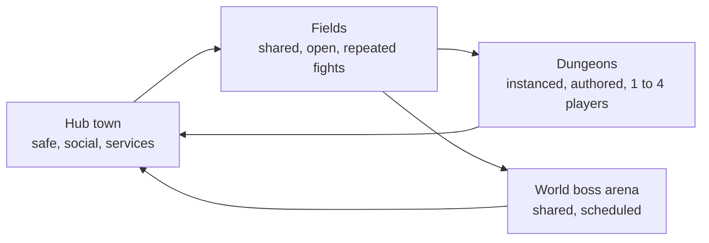
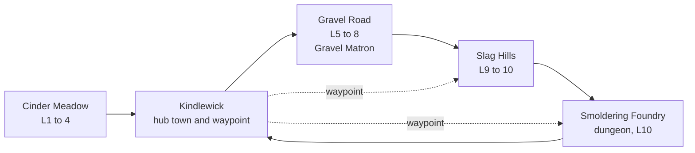
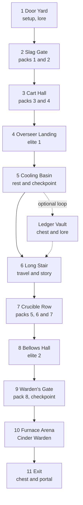

# Module 18: World and level design

- **Goal:** lay out the spaces of an online RPG (regions, fields, towns and dungeons) so that players always know where to go, the pacing alternates tension and rest, and the shared world stays alive when many players are in it.
- **Prerequisites:** [03 — Vision, pillars and loops](03-vision-pillars-loops.md), [06 — Controls, camera and game feel](06-controls-camera-feel.md), [08 — Combat design](08-combat.md), [12 — Enemies, bosses and encounters](12-enemies-encounters.md).
- **Simulation:** none
- **Facts checked:** October 2026 (prices, rules and product status change; re-check before reuse)

## In short

**Level design** decides the shape of the places the player moves through and where the fights, rewards and rests sit inside them. An online RPG has four kinds of space: **fields** (shared, open, repeated fights), **towns** (safe, social, services), **dungeons** (private, authored, a few players) and **arenas** (one big fight). The designer's tools are the **critical path** (the route the story forces), **landmarks** (so players can navigate without a map), **pacing** (alternating fight, travel and rest), and **metrics** (agreed sizes for corridors, pull distances and arenas, tested in a plain "greybox" before art). In a shared world one more problem appears: **density**, the number of players and enemies in the same place. The worked example lays out one region of the course game: a hub town, three fields and the 15-minute dungeon, with a pacing table and a room-by-room plan.

## 1. The concept

### 1.1 Terms

| Term | Meaning |
|---|---|
| **Region** | A large themed area of the world with its own level range, look and story arc. The course game has four |
| **Zone (field, map)** | A walkable piece of a region that loads as one unit and is shared by many players |
| **Hub (hub town)** | A safe place where services, quests and other players gather; the place players return to |
| **Instance** | A private copy of a space made for one party. Nobody else is in it, so it can be authored like a film set |
| **Channel (layer, shard)** | One of several parallel copies of the *same shared* space, used to cap the crowd |
| **Critical path** | The shortest route through the content that the main story requires |
| **Landmark** | A tall, distinct or lit feature that players can see from far away and navigate by |
| **Beat** | One unit of pacing: a fight, a climb, a rest, a scene |
| **Greybox (blockout)** | A level built from plain boxes with no art, only to test size, flow and fights |
| **Metrics** | The agreed sizes: corridor width, room size, pull distance, arena radius |
| **Spawn** | A place where enemies appear; **respawn** is their return after death |

### 1.2 The four kinds of space

Players loop between them: the town prepares them, the field gives the 30–90 s core loop, the dungeon gives the 20–40 minute session loop (module 03), and the town takes the rewards back. A good map makes that loop short to walk.

## 2. The player's view

Players do not see a map layout. They see whether they **know where to go**, whether **the world feels alive** and whether **the next fight is close enough**. The feelings to design (module 01):

| Feeling | What the space must do |
|---|---|
| "I know where I am heading" | Landmarks, a clear road, a quest marker that matches what the eye sees |
| "The world is big, and not empty" | Something to see or find every 30–60 s of walking |
| "I am not alone, and not crowded" | Other players visible, but enough enemies for everyone |
| "That was a good run" | A dungeon that builds up, rests once, then peaks |
| "I can come back later" | Fast travel, short trips, a town that does not waste a 15-minute session |

Spatial design supports three pillars of the course game. **Fights you can read** needs rooms big enough to dodge in. **Stronger together** needs fields and dungeons that reward grouping (module 11). **Fair and respectful of time** needs short trips: Dev, who plays 15–25 minutes on a phone, must reach a fight within about two minutes of logging in.

## 3. The design space

### 3.1 World structure

| Structure | How it works | Used by (public examples) | Strength | Cost |
|---|---|---|---|---|
| **Seamless open world** | One continuous map streamed in; no loading between areas | Open-world single-player RPGs; some online games | Immersion, free exploration | Streaming, hard to balance by level, density problems |
| **Zoned world** | Regions split into zones; a short load or a gate between them | *World of Warcraft* continents and zones; *Guild Wars 2* maps | Each zone tuned for a level range; cheaper servers | Visible seams |
| **Hub and instances** | A shared hub, private instances for all missions | *Diablo III* (town plus instanced areas); many action RPGs | Total control of pacing and difficulty | Weak sense of a living world |
| **Hybrid (shared fields, private dungeons)** | Fields and towns shared; dungeons and story scenes instanced | *World of Warcraft*, *Guild Wars 2*, *Final Fantasy XIV* | Social fields, authored dungeons | Two content types to build |

Most online RPGs are hybrids (as of October 2026). The rule is: **share what benefits from other players** (fields, towns, world bosses) and **instance what needs control** (dungeons, story fights, anything that must not be ruined by a stranger).

#### Open world as a world structure

The seamless open world deserves a closer look, because it changes how every other part of this module works. A public example is *Genshin Impact* (released September 2020; as of October 2026 in live service, status not independently re-verified), a free-to-play action RPG with a large, continuous map.

| Aspect | What it means for design |
|---|---|
| **Exploration density and points of interest** | The designer fills the map with things worth finding: puzzles, chests, camps, view points, small secrets. A common rule is that the player should see or reach something new every 30–60 seconds of travel; the "triangle rule" (a landmark, a second landmark and the hidden space between) is one way to place them. Empty space is cheap to paint but feels dead; dense space is expensive to author |
| **Traversal** | Movement is a feature, not a cost: climbing, gliding, swimming and sprinting open the space. A **stamina** bar limits them, so the designer decides where a cliff can be climbed, how far a glide reaches and how stamina recovers. Traversal needs its own collision, animation and camera work (module 06) |
| **Map reveal** | The map starts hidden and is revealed by visiting: standing on a tower or a statue unveils a region and unlocks fast travel. The reveal is a reward and a navigation aid at once. Fast-travel points also shorten return trips, which keeps short sessions possible (module 27) |
| **Gating by level and story** | The player can walk anywhere, so gates must be soft or explicit: enemies far above the player's level, a story-quest requirement, an account level that unlocks regions or content, or terrain that needs a traversal ability. Soft gates feel like choices; hard gates feel like walls. The designer must decide which |
| **Co-op in an open world** | Parties share one world, but players want to move on their own. Common choices: invite-only visits to a friend's world, a limited number of players per world, and dungeons or bosses as shared instances. Content gated by story progress needs a rule for what a guest may do in the host's world |
| **Content cost and pacing** | A large map needs a steady cadence of new regions and events, not just a big launch. Pacing is set by the player, so the designer shapes it with density, difficulty bands and rewards: quiet spaces between dense ones, a bright landmark before a hard area, daily or weekly resets to give returning players a reason to travel again |

Compared with the zoned world above, an open world gives more freedom and costs more to balance: players can arrive at any place at any level, so enemy scaling and reward tuning must tolerate that. Module 02 places the open-world action RPG on the genre map.

### 3.2 Level flow and the critical path

**Flow** is the order in which players meet places. Three shapes:

| Shape | Description | Good for | Risk |
|---|---|---|---|
| **Linear** | A → B → C; one route | Tutorials, dungeons, story | Feels like rails if every region is linear |
| **Hub and spoke** | Return to a hub, go out along one spoke at a time | Quest hubs, regions with several dungeons | Backtracking to the hub every time |
| **Branching with loops** | Several routes that rejoin, shortcuts that open | Large dungeons, big fields | Players get lost; more content to build |

The **critical path** is the route the main quests force. Everything else (side quests, optional dungeons, hidden chests) hangs off it as branches. Three rules:

1. **Move forward, not back.** Each main step should lead to a new place, not to one the player already cleared. When a chain must go back, use a fast-travel point or a scene instead of a long walk (module 19 lists this as an anti-pattern).
2. **Gate by level first, walls last.** A level range per region and a stronger enemy at the edge say "not yet" without a locked door. Use hard gates (a story flag) only where the story needs them.
3. **One new idea per place.** A field adds one enemy type or mechanic; the dungeon combines them. This is the same "teach, then test" order as a boss (module 12).

### 3.3 Sightlines and landmarks

A **sightline** is what the player can see from a point. Players who can see their goal do not need a map.

- **Landmarks.** Urban planner Kevin Lynch (*The Image of the City*, 1960) named five elements people use to read a place: paths, edges, districts, nodes and landmarks. Game levels use the same five. A tall, lit or oddly shaped landmark (a chimney with smoke, a broken tower) tells the player "go there" from far away.
- **Leading lines.** Roads, rivers, rails, lights and colour guide the eye toward the next goal. Players follow them without being told.
- **Hide and reveal.** Terrain that hides what is behind it (hills, ridges, bends) makes players curious; *The Legend of Zelda: Breath of the Wild* designers described building terrain from triangle-shaped obstacles of different sizes so that something is always half hidden (as of October 2026, see Further reading).
- **Compression and release.** A narrow passage followed by a wide vista makes the vista feel bigger.

Camera matters: with a tilted top-down view (module 06) the hero sees only about 15 m around, so the landmark must be tall enough to rise above the screen edge, and the **minimap and quest arrow** carry the rest.

### 3.4 Pacing: combat, travel and rest

**Pacing** is the rhythm of intensity. The player needs peaks (a hard fight), valleys (a quiet walk, a shop, a story scene) and variety. A map with only peaks tires players; a map with only valleys bores them.

| Beat type | Typical length | Purpose |
|---|---|---|
| **Combat** | 10–60 s per pack or elite; 2–3 minutes for a boss | The core loop |
| **Travel** | 15–60 s between beats | Anticipation; views; landmark use |
| **Rest or reward** | 10–30 s | Heal, loot, read, breathe |
| **Discovery** | 20–60 s | A hidden nook, a lore object, a chest |
| **Story** | 10–30 s | A short scene or bark (module 20) |

Rules of thumb (invented targets for tuning):

- **Dungeon:** fighting is **30–40 %** of the run (module 08); the rest is travel, regrouping, rest and story.
- **Field questing:** fighting is about **40–50 %** of the time, because quests send the player between spots.
- **Never two peaks back to back** without a valley, except at the finale.
- **Put the biggest peak last** (the boss) and a smaller peak in the middle (the second elite).

### 3.5 Field design: packs, density and respawns

A field is a place where packs repeat. Four numbers define it:

| Number | Meaning | Example rule |
|---|---|---|
| **Pack spacing** | Distance between packs | At least 3 × the aggro radius, so pulls do not chain |
| **Pack density** | Packs per area | Sets how far the player walks between fights |
| **Respawn time** | Time before a killed pack returns | Short enough that a player is never starved; long enough that it feels earned |
| **Leash and reset** | How far enemies chase before they return and heal | Consistent with module 12 |

Other field rules:

- **Respawn out of sight.** Never spawn a pack inside the area a player can see; a pack that pops into view looks like a bug.
- **Rings of difficulty.** Easier packs near the road or hub, harder ones deeper in, with an elite at the far end. Level range climbs along the path.
- **Safe lanes.** A road or river with few or no enemies, so travelling players are not forced to fight.
- **Quest spots overlap pack spots.** If a quest needs "5 Slingers", put them where Slingers already are. Do not make players hunt for a rare spawn.

### 3.6 Dungeon layout

A **dungeon** is an instanced sequence of rooms with a start, a climax and an exit. Common layouts:

| Layout | Shape | Best for | Risk |
|---|---|---|---|
| **Linear ("beads on a string")** | Room 1 → 2 → ... → boss | Short, repeatable dungeons (10–20 minutes) | Predictable; no player choice |
| **Linear with a loop or side room** | The main line plus one optional branch that returns | Same, plus a reason to explore | Optional rooms must not become mandatory |
| **Hub and spokes** | A central room with several wings, each with a mini-boss, then a final door | Long dungeons (30–60 minutes); keys or order choices | Players wander; harder to pace |
| **Branching with shortcuts** | Several paths; shortcuts open after a first clear | Large dungeons; replay | Large, costly to test |
| **Open or maze** | Free movement in a large structure | Exploration games | Poor fit for a timed party run |

For short party dungeons choose **linear with one side room**, then use these rules:

1. **A room has one job.** A pack room, a rest room, a puzzle or mechanic room, an elite room. Mixed jobs confuse pacing.
2. **Room order mirrors boss structure.** First rooms teach a mechanic, middle rooms combine it, the last room tests it (module 12).
3. **A rest room before the boss.** A safe spot with a checkpoint, so a wipe returns the party near the boss, not to the door.
4. **No long walk back.** Finish with an exit portal or a short path.
5. **Shortcuts reward repeat runs**, not first runs.

### 3.7 Towns and services

A **town** is a place of safety and services. The services of an online RPG (module 15, 16, 22 define each):

| Service | Why it is in town | Placement rule |
|---|---|---|
| **Fast-travel point (waypoint)** | The entry and exit of every trip | The centre; everything else within a short walk |
| **Quest givers and class trainers** | Story and class quests (module 19) | Next to the waypoint |
| **Vendor and crafting** | Spend gold, upgrade gear | Close to the waypoint |
| **Stash (storage)** | Free the bag | Same plaza |
| **Group board (group finder)** | Find a party for a dungeon (module 11) | A landmark building, or a menu on mobile |
| **Mailbox and trade post** | Trade between players (module 16) | Plaza |
| **Guild hall** | Social anchor (module 22) | A landmark building |

Design rule: **every service within a 40 m radius of the waypoint**, so a full town errand takes under 60 seconds. A town where Dev must run for three minutes to sell loot wastes the 15-minute session.

A town is also a **social space**: cap the crowd with channels (below), give people places to stand and talk, and show other heroes' cosmetics. Do not put fights in a town; do put the story there (a Marshal who greets you, a notice board that changes with the season).

### 3.8 Shared world: density, channels and layers

When many players are in the same field the same enemies must serve all of them. Two failures:

| Failure | Cause | Player feeling |
|---|---|---|
| **Starvation** | Too many players per pack | "I wait for a respawn", players "steal" kills |
| **Emptiness** | Too few players | "The world is dead" |

Tools, from simplest to most refined:

| Tool | How it works | Used by (public examples) | Trade-off |
|---|---|---|---|
| **Channels** | Several copies of a field, each with a player cap; players can hop or join a friend's channel | Many online RPGs | Splits the community; need "join friend" |
| **Megaserver instances** | The system places players in map instances by party, guild, language and home server and opens a new copy at capacity | *Guild Wars 2* megaserver (April 2014, per its wiki) | Players of one realm meet less often |
| **Layering (sharding)** | Parallel copies of a whole area with their own enemies, used to ease launch crowds | *World of Warcraft Classic* at launch (2019); Blizzard planned to reduce it once crowds eased | Friends can end up in different layers |
| **Dynamic spawns** | Extra enemies appear when many players are near, and disappear later | Used in many MMOs | Hard to tune; can feel fake |
| **Shared kill credit** | Every player who contributes gets full credit, so no one steals | Common in modern online RPGs | Crowded fields are very fast to clear |

**How to size a channel.** Count the packs, estimate how often each player needs one, and set the cap so supply meets demand (worked example in section 5.2).

### 3.9 Reuse of space

Space is expensive. Reuse it on purpose:

| Technique | Example |
|---|---|
| **Kits** | A dungeon built from a set of rooms (gate, hall, stairs, arena) that other dungeons recombine |
| **Re-skin** | The same layout in a new theme and with a new enemy tint (module 12: ice Brute, poison Slinger) |
| **Time state** | The same field with different content at night, in an event, or during a story arc |
| **Hard mode** | The same rooms with new mechanics and a weekly lockout (module 24) |
| **Scaled revisit** | A later quest or event brings players back to an old field at a higher level range |

Reuse works best when the player *notices* the reuse as a bridge ("I remember this place") and not as a shortcut ("this is the same dungeon").

### 3.10 How to choose

| If your game is... | Structure | Dungeons | Towns |
|---|---|---|---|
| **Online action RPG with parties** (the course game) | Zoned hybrid: shared fields, instanced dungeons | Linear with a side room, 10–20 minutes | One hub per region |
| **Open-world MMO** | Seamless or large zones, dynamic events | Instanced for groups, plus open-world bosses | A few large capitals |
| **Session-based action RPG** | Hub and instances | Procedural or authored rooms, 5–15 minutes | One hub for everything |
| **Mobile idle or auto-battle** | Stage list or map nodes | A stage is a fight, not a space | A menu, not a place |

## 4. Tuning and pitfalls

### 4.1 Metrics and greybox

Before art, build a **greybox** (plain boxes) and play it with real hero speed, real dodge and real enemies. Fix **metrics** so that every designer uses the same sizes. A metric sheet is a short table:

| Metric | Why it matters |
|---|---|
| Hero speed, dodge distance (module 06) | Sets corridor width and time per room |
| Enemy aggro radius, leash distance (module 12) | Sets pack spacing |
| Tell sizes: cone, circle, line (module 12) | Sets room size |
| Camera view: how many metres the player sees | Sets how far a landmark must be visible |

Steps of a greybox review: (1) walk it, (2) time it, (3) run a fight in each room, (4) ask a tester who has not seen it to find the exit without a map, (5) only then pass it to art.

### 4.2 Signals that something is wrong

| Signal | Likely problem |
|---|---|
| Testers ask "where do I go?" | Landmark or leading lines missing; quest marker disagrees with the view |
| A pack chains into the next one | Spacing under 3 × the aggro radius |
| Dodging a marker means running into a wall | Room too small or corridor too narrow |
| Players skip the rest room | It is too far from the path, or heals nothing |
| Clear time is 25 minutes when 15 was planned | Too much walking, or packs too long (module 08 TTK) |
| Fields are empty at off-peak and crowded at peak | Fixed channel caps; use merging and dynamic caps |
| Players wait for respawns | Too many players per pack; lower the channel cap or add spawn |
| Everybody uses the same tiny spot | One quest spot has the best XP per minute; spread the content |

### 4.3 Classic failures

- **The long walk.** Hub, field and dungeon far apart with no fast travel. Time per session is spent walking.
- **Invisible goals.** A quest says "go to the old mill" and the mill has no landmark.
- **Corridor combat.** Fights in a 3 m corridor: no room to dodge, so the pillar "Fights you can read" fails.
- **Chain pulls.** Packs too close; one mistake wakes half the room.
- **Backtracking tours.** The main quest sends the player through three zones they have cleared.
- **Maze for its own sake.** A dungeon with branches that only waste time. Branch only for a reward.
- **Dead fields.** A beautiful region nobody visits after level 11. Give it reasons to return: a daily, a weekly, a world-boss site.

## 5. Worked example

The course game's first region. All sizes and times are invented for teaching; levels and hours come from [module 14](14-progression.md), which owns the level curve. Names are in the story bible of module 20.

### 5.1 The region at a glance

**Ashfall Vale** is region 1 (levels 1–11, **2.4 hours**, about 144 minutes of play; on module 14's curve level 12 is reached at minute 145). It holds one hub town, three fields and the first dungeon.

| Place | Type | Level | Size (invented) | Time spent | What it teaches |
|---|---|---|---|---|---|
| **Cinder Meadow** | Field | 1–4 | 300 × 300 m | 32 min | Movement, the first pack, the class-pick quest |
| **Kindlewick** | Hub town | all | 150 × 150 m | stops of 1–2 min | Services, the Lodge, the story |
| **Gravel Road** | Field | 5–8 | 700 × 200 m | 56 min | Packs, the Gravel Matron elite, first group prompt |
| **Slag Hills** | Field | 9–10 | 500 × 400 m | 31 min | Brutes and Slingers together; the dungeon approach |
| **Smoldering Foundry** | Dungeon | 10 (±2) | 610 m path | 15 min | Everything, with the Cinder Warden |
| **Wrap-up** | Town and fields | 10–11 | | 10 min | Turn-ins, the level 12 skill, a region-2 hook |

**Landmark.** The **Foundry chimney**, a tall black stack with a smoke column, is visible from the Meadow's far edge, from the town square and from every point on the Gravel Road, and it grows as the player gets closer. It marks the dungeon, the story's goal and the direction of the critical path, so a first-time player can navigate without opening the map.

**Critical path.** Meadow → Kindlewick → Gravel Road → Slag Hills → Foundry → Kindlewick. After Kindlewick the main quest never returns to the Meadow. Waypoints (free, a 10 s cast out of combat) connect the town to the Slag Hills and the Foundry door.

### 5.2 Field plan and channel sizes

| Field | Area | Pack density | Packs | Respawn | Channel cap |
|---|---|---|---|---|---|
| Cinder Meadow | 90,000 m² | 1 per 6,000 m² (sparse for the tutorial) | 15 | 45 s | 10 |
| Gravel Road | 140,000 m² | 1 per 3,500 m² | 40 | 60 s ± 15 s | 25 |
| Slag Hills | 200,000 m² | 1 per 3,500 m² | 55 | 60 s ± 15 s | 35 |

Rules for all three fields:

- **Spacing:** average 55–75 m, never closer than 24 m (three times the 8 m aggro radius of module 12). A pack leashes and resets at 30 m.
- **Respawn out of sight:** never within 20 m of any player.
- **The road is a safe lane:** a 6 m strip along the Gravel Road has no packs, so travellers are not forced to fight.
- **The Gravel Matron** (elite, module 12) stands at the far end of the Gravel Road beside the road, respawns after 5 minutes and drops a small chest. Every player who deals damage gets full credit (a rule added for fields).
- **Quest-critical enemies** (for example a story boss) are **personal copies**, so no one waits for another player to leave.

**Sizing the Gravel Road.** A solo hero spends about 15 s killing a pack and 30 s walking and looting, so **1.33 packs per minute** of demand per player. A pack is unavailable for its 15 s fight plus the 60 s respawn, so each pack supplies **0.8 kills per minute**, and 40 packs supply **32 per minute**. At the cap of 25 players, demand is 25 × 1.33 = **33 per minute**, so supply and demand are about equal, with no slack. Three things give slack: parties of two to four use one pack for several players, shared kill credit means two players can use the same pack, and **dynamic spawns** add up to 25 % extra packs (10 more) with a 30 s respawn whenever more than 80 % of packs are dead or engaged. The rule used here: **channel cap ≈ packs ÷ 1.5**, rounded down to a multiple of 5 (40 ÷ 1.5 = 26.7, so 25).

Players can join a friend's channel up to 110 % of its cap, so a friend is never turned away.

### 5.3 The town: Kindlewick

| Service | Placement (from the waypoint) |
|---|---|
| Waypoint | Centre of the square |
| Lodge Hall: quests, class trainers, group board | 15 m, the tallest building |
| Vendor, crafting bench | 20 m |
| Stash, mailbox, trade post | 25 m |
| Guild hall | 35 m |
| Exit gate to Gravel Road | 60 m |

All services are inside the 40 m rule (the exit gate is not a service). A full errand (sell, stash, take quests) is about 30 s of walking and takes under 60 s. The town cap is 100 players per channel. Nothing hostile spawns. The square has a **notice board** that shows the current season's story chapter (module 20).

### 5.4 The pacing diagram for the region

Intensity runs from 1 (rest) to 5 (peak fight). Each row is about a quarter hour or one beat.

| Time | Place | What happens | Intensity |
|---|---|---|---|
| 0–10 min | Meadow | First pack at 2:00, dodge lesson, no failure possible | `██` 2 |
| 10–28 min | Meadow | Quests, packs of 2–3, the class-pick quest (module 19) | `███` 3 |
| 28–32 min | Kindlewick | Arrival: services, Marshal scene (a rest beat) | `█` 1 |
| 32–70 min | Gravel Road | Packs of 3–4, the first Slinger priority target | `███` 3 |
| 70–88 min | Gravel Road | **Gravel Matron**, the first elite and first group prompt | `████` 4 |
| 88–92 min | Kindlewick | Turn-ins, story scene opens the Slag Hills (rest) | `█` 1 |
| 92–114 min | Slag Hills | Brutes, Ground Slam, packs of 4 | `████` 4 |
| 114–119 min | Slag Hills | A quiet camp with a lore object (rest) | `█` 1 |
| 119–134 min | Foundry | The dungeon, section 5.5 | `█████` 5 |
| 134–144 min | Kindlewick | Rewards, the level 12 skill, a hook to region 2 | `█` 1 |

The times follow module 14's curve for region 1 (4.7 minutes for level 1 up to 19.8 for level 11; 200 kills and 8 quests an hour): level 5 is reached at minute 32, level 9 at minute 89, level 10 at minute 107 and level 12 at minute 145. The Foundry arrives at the level it is made for, and its XP (module 14: a 15-minute dungeon is worth about one level 10 bar) carries the player through level 10.

Peaks at 4 and 5 are always followed by a 1. The only back-to-back peaks are the Slag Hills (a field) and the Foundry, with a camp between them.

### 5.5 The dungeon: Smoldering Foundry

The first dungeon: 8 packs, 2 elites and 1 boss (module 08), recommended level 10 (group range ±3 per module 11), linear with one optional side room. It is built from a **greybox with the metrics below**:

| Space | Metric | Reason |
|---|---|---|
| Combat corridor | 6 m wide | A 4 m dodge (module 06) plus a body width |
| Pack room | 20 × 20 m minimum | The Slinger stays 10 m back (module 12) |
| Pack spacing | at least 24 m | Three times the 8 m aggro radius |
| Elite room | 24 × 24 m minimum | A 120° cone and adds |
| Boss arena | 40 m across | 5 m furnace, 10 m ring of safe floor, an outer ring that burns inward in phase 3 |
| Door | 3 m | Two heroes abreast |

**Room by room** (party of four, clean run; speed 6 m/s; fight times from module 12: 9 s per pack, 45 s per elite, 152 s for the boss).

| Room | Content | Layout idea | Path | Walk | Fight | Other | Clock at end |
|---|---|---|---|---|---|---|---|
| 1 Door Yard | Ready check, buffs, a lore wall | Safe courtyard, the chimney seen from inside | 20 m | 3 s | 0 | 40 s | 0:43 |
| 2 Slag Gate | Packs 1 and 2 | Corridor, packs 30 m apart; teaches the pull | 90 m | 15 s | 18 s | 24 s | 1:40 |
| 3 Cart Hall | Packs 3 and 4 | A wide hall with pillars; both packs visible from the door, the player chooses the order | 60 m | 10 s | 18 s | 24 s | 2:32 |
| 4 Overseer Landing | **Elite 1** (cleave, adds) | A raised platform with a ramp; teaches the cone | 40 m | 7 s | 45 s | 25 s | 3:49 |
| 5 Cooling Basin | A cool pool that heals 50 % over 10 s once; **checkpoint** | A side nook off the main line | 30 m | 5 s | 0 | 25 s | 4:19 |
| 6 Long Stair | Descent; a story bark about the Warden | A long view down the shaft that shows the furnace glow | 90 m | 15 s | 0 | 10 s | 4:44 |
| 7 Crucible Row | Packs 5, 6 and 7 | A catwalk 8 m wide, packs 30 m apart; falling is not possible | 140 m | 23 s | 27 s | 36 s | 6:10 |
| 8 Bellows Hall | **Elite 2** (mid-run peak) | A round room with two bellows that gust at intervals | 50 m | 8 s | 45 s | 25 s | 7:28 |
| 9 Warden's Gate | Pack 8, **checkpoint**, a 15 s skippable scene | Antechamber; the gate opens when pack 8 dies | 40 m | 7 s | 9 s | 42 s | 8:26 |
| 10 Furnace Arena | **Cinder Warden** (module 12) | Round, 40 m across | 30 m | 5 s | 152 s | 30 s | 11:33 |
| 11 Exit | Boss chest, portal to Kindlewick | Straight line to a portal | 20 m | 3 s | 0 | 60 s | 12:36 |
| **Total** | 8 packs, 2 elites, 1 boss | | **610 m** | 101 s | **314 s** | 341 s | **12:36** |

**Reading the table.**

- A clean run takes **12:36**. The 15-minute target is the **median** for real parties: the remaining 144 s is the margin for a death or two, a slow pull and chat.
- Fighting is 314 s, which is **35 %** of 15 minutes (target 30–40 %) and 42 % of the clean run. The module 08 plan counts 4.6 minutes (30 %) before the uptime correction.
- The **optional Ledger Vault** loop adds about 50 s (120 m round trip, a chest, a lore terminal) and no fights, so the pack and elite counts stay fixed.
- **Rest beats:** rooms 1, 5, 6 and 9. The longest stretch without one is rooms 7 and 8, 2:44 of travel and combat, which is why room 6 (the stair) sits in front of it.
- **Peaks:** elite 1 (room 4), elite 2 (room 8), boss (room 10). Never two peaks in a row; between each there is a rest or travel beat.
- **Respawn after a wipe:** at the last checkpoint (rooms 5 and 9). In the boss room a wipe resets the room and the party returns at the door with full HP in 10 s (module 12).

### 5.6 Filling the stretch between Path and Mastery

Module 14 reports that no class unlock falls between Path (level 20, hour 5.7) and Mastery (level 40, hour 17.4), a gap of 11.7 hours. Space can fill it with content the game already has, so no new system is needed. The dungeon levels and story beats below are placed against module 14's reach-hours (invented placement):

| Hour | Level | Unlock or beat | Gap since the last (h) |
|---|---|---|---|
| 5.7 | 20 | Path (module 19 chain) | |
| 7.2 | 23 | Dungeon 5: Garrison of the Oath | 1.5 |
| 8.3 | 25 | Region 3: new hub (Stilt Market), new gear wave | 1.1 |
| 9.3 | 27 | Dungeon 6: Sunken Condenser | 1.0 |
| 10.5 | 29 | Gloam Fen story reversal (arc scene) | 1.2 |
| 11.6 | 31 | Dungeon 7: Gloamroot Hollow | 1.1 |
| 12.8 | 33 | Gloam Fen story reversal (arc scene) | 1.2 |
| 14.1 | 35 | Dungeon 8: Bellows of the Bog | 1.3 |
| 16.0 | 38 | Region 4: Highwatch hub; the Mastery chain is offered | 1.9 |
| 17.4 | 40 | Mastery (module 19 pattern) | 1.4 |

The longest silence is 1.9 hours, under module 14's two-hour rule for a dead stretch. Each dungeon also brings a boss chest (module 15), and each region change brings new trainers and shops in the hub. The story beats in Gloam Fen cost writing and scene time but no new rules.

### 5.7 What was cut

- **A fourth field.** Three fields cover 11 levels; a fourth would add walking, not ideas.
- **Mounts.** Not at launch; waypoints replace them, and mount speed would rewrite every metric.
- **Dungeon keys and puzzle rooms.** A timed party run does not need them. Puzzles live in field quests (module 19).
- **Branching dungeons.** One loop is enough. The other nine dungeons reuse the same kit (Foundry rooms re-skinned into ice, fen and peak themes) so the team makes three layout kits, not ten.

### 5.8 For another kind of game

| Game type | What changes |
|---|---|
| **Open-world MMO** | Larger seamless fields, events that scale with crowds (module 11), landmark-driven exploration, dungeons as small instances |
| **Session-based action RPG** | No fields; a hub and short instanced levels built from rooms; pacing is room order |
| **Mobile auto-battle** | No spaces: a map of stages with a difficulty curve; "pacing" is the order and difficulty of stages |
| **Single-player story RPG** | Authored critical path with big set pieces; no density problem; exploration reward density matters most |

## Key takeaways

- A hybrid is the usual shape for an online RPG: **share** fields, towns and world bosses; **instance** dungeons and anything that must stay authored.
- Players navigate by **landmarks and leading lines**, not by the map. Test it by dropping a stranger in and watching.
- **Pace in waves:** fighting is 30–40 % of a dungeon, with a rest beat before every peak and the biggest peak last.
- Write the **metrics** first (speed, dodge, aggro radius, tell sizes), derive corridor widths, pack spacing and arena sizes from them, and test in a greybox before art.
- Size shared fields by **supply and demand**: packs, respawn time and a channel cap of about packs ÷ 1.5, with dynamic spawns as slack.
- Keep the critical path **moving forward**, keep every town service within 40 m of the waypoint, and let a short session always reach a fight in two minutes.
- Reuse space deliberately with kits, re-skins and hard modes, so ten dungeons cost three layouts.

## Further reading

- Kevin Lynch, *The Image of the City* (1960), overview: https://en.wikipedia.org/wiki/The_Image_of_the_City
- *The Level Design Book* (free online): https://book.leveldesignbook.com/
- Level design overview: https://en.wikipedia.org/wiki/Level_design
- "The design secrets of Breath of the Wild" (80 Level): https://80.lv/articles/the-design-secrets-of-breath-of-the-wild/
- Guild Wars 2 wiki, Megaserver: https://wiki.guildwars2.com/wiki/Megaserver
- Blizzard forum, "Addressing Population Concerns in WoW Classic" (layering): https://us.forums.blizzard.com/en/wow/t/499746/1
- Harvey Smith and Matthias Worch, "What Happened Here? Environmental Storytelling" (GDC 2010): https://www.gdcvault.com/play/1012647/What-Happened-Here-Environmental
- Genshin Impact (overview, open-world design, co-op, release): https://en.wikipedia.org/wiki/Genshin_Impact
