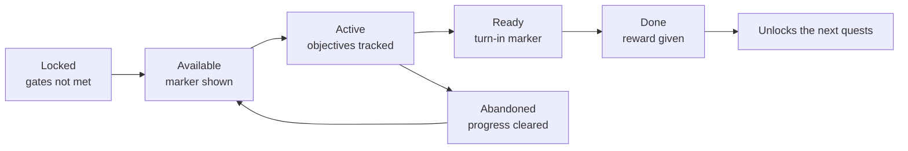
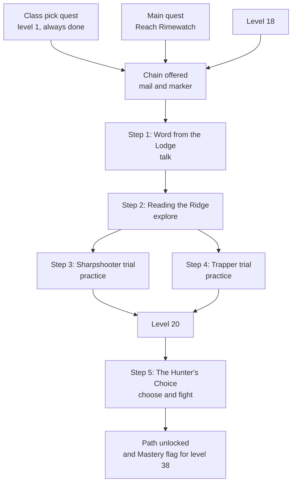

# Module 19: Quest and mission design

- **Goal:** design quests and quest chains that guide players through the content, deliver the story and pace the rewards, without hidden prerequisites, backtracking or grind.
- **Prerequisites:** [03 — Vision, pillars and loops](03-vision-pillars-loops.md), [09 — Classes and roles](09-classes-roles.md), [18 — World and level design](18-world-level.md).
- **Simulation:** none
- **Facts checked:** October 2026 (prices, rules and product status change; re-check before reuse)

## In short

A **quest** is a task the game states, tracks and rewards: an objective, a reason (the framing) and a payoff. Quests come in a handful of **types** (kill, collect, escort, talk, explore, puzzle, event) and are organised into **chains**, **arcs** and **categories** (main, side, class, daily, repeatable). Each quest has **gates** that decide when it appears: level, a prerequisite quest, a story flag or an item. The set of gates forms a **prerequisite graph**, and most quest-design disasters come from that graph: chains nobody can see, steps that send the player back to old places, and grind steps. In an online RPG quests also carry the story (module 20) and set the pace of rewards. The worked example is a five-step story chain that unlocks a class **Path** at level 20, with its gating, rewards and the anti-patterns it avoids.

## 1. The concept

### 1.1 Terms

| Term | Meaning |
|---|---|
| **Quest (mission)** | A tracked task with a start, one or more objectives, an end and rewards |
| **Objective** | One thing to do inside a quest ("kill 8 Slingers") |
| **Step** | One quest in a chain; also used for one objective set |
| **Chain** | Quests that unlock one another in order |
| **Arc** | A group of chains that tells one story (one region's main story) |
| **Giver and turn-in** | The characters (or the board) where a quest starts and ends |
| **Gate** | A condition that must be true before a quest is offered or can be finished |
| **Prerequisite graph** | The map of which quests unlock which |
| **Tracker** | The small HUD list of active quests and their progress |
| **Journal (quest log)** | The full list of quests, with history and hints |
| **Marker** | An icon over a character or on the map: available, in progress, ready to turn in |
| **Fetch quest** | A quest whose whole task is "go there, bring this back" |

### 1.2 The life of a quest

Every quest has these states. The designer's job is to make each transition **visible**: the player should always know why a quest is locked, what is active, what to do next and what they got.

## 2. The player's view

Players use quests as a **guide**. A good quest system answers four questions without any thinking:

| Question | Answered by |
|---|---|
| "What should I do now?" | The tracker and the marker on the map |
| "Why does it matter?" | A two-line framing from a character |
| "How long will it take?" | Quest size: small, medium, chain (visible in the journal) |
| "What do I get?" | A reward preview before accepting |

The motivations from [module 01](01-player-experience.md) that quests serve: **Completion** (checklist), **Story and Discovery** (Lena), **Power** (rewards), and for Dev, **short wins** (each step fits a 15-minute session). They support the session loop of [module 03](03-vision-pillars-loops.md) (choose a quest, travel, clear, turn in and upgrade). They break the loop when the next step is unclear, the route is long, or the reward feels smaller than the effort.

## 3. The design space

### 3.1 Quest types

| Type | The task | Example | Best for | Typical pitfall |
|---|---|---|---|---|
| **Kill** | Defeat N enemies or one target | "Defeat 8 Slingers" | Teaching a new enemy; levelling | The default; repeated 20 times it bores |
| **Collect** | Gather N items | "Bring 6 sealed ledgers" | Tying fights to a reason | Low drop rates: players grind for a lucky roll |
| **Escort** | Protect a character moving to a place | "Walk the surveyor to the ridge" | A shared moment with a character | Slow, fragile NPCs; players avoid or hate them |
| **Talk (deliver)** | Speak to someone or carry a message | "Report to the Marshal" | Story beats, introductions | A chain of only talking is dull |
| **Explore** | Reach a place or find things | "Reach three overlooks" | Showing off the world | Hidden items with no hint |
| **Puzzle** | Solve a small problem with rules | "Light the braziers in order" | Variety, thinking | A puzzle with one hidden answer; players look it up |
| **Event** | Take part in something shared and timed | "Hold the line at the Ash Tide" | Social peaks | Players must be online at the right time |

Escort is the type designers describe as the one most players dislike: slow or fragile partners and the loss of control over pacing are the usual complaints. If an escort is needed, let the NPC be hard to kill, as fast as the hero, and let a death mean a retry from a checkpoint, never a lost quest.

**Mix the verbs.** Do not put more than two quests of the same type back to back. A chain of "kill, kill, kill, kill" is a grind with a story label. Combine verbs inside a quest: "reach the ridge (explore), then clear the camp (kill), then bring the banner back (talk)".

### 3.2 Categories

| Category | Purpose | Gated by | Repeats? | Notes |
|---|---|---|---|---|
| **Main (story)** | The critical path ([module 18](18-world-level.md)) and the story | Level, previous main quest | No | Always in the tracker; never skippable by accident |
| **Side** | Extra stories and XP | Level, region | No | Optional; each should stand alone in 2–5 minutes |
| **Class** | Class identity and advancement | Level, class | No | The worked example below is one |
| **Chain (arc)** | A longer optional story | Level, a prerequisite | No | Adds depth; plan the reward at the end |
| **Daily** | A short reason to log in | Level | Resets every day | A small, capped list; rewards that are not power (pillar 4) |
| **Repeatable (bounty)** | Content that fills any session | Level | Any time | Used for events and endgame |
| **Event** | Seasonal or timed content | Calendar, season | During the event | Module 29 |

Public examples. In *Guild Wars 2* many tasks are **renown hearts**: a fixed area with a list of activities and a progress bar, with no quest giver to visit, which removes the "go back and talk" step (as of October 2026). In *Final Fantasy XIV*, the **Main Scenario Quests** are a long main chain, and many dungeons are unlocked by progressing it (as of October 2026). *World of Warcraft* capped daily quests at 10 per day when it introduced them in *The Burning Crusade* (patch 2.1), raised the cap to 25 in patch 2.4 and removed it in patch 5.0, which shows how designers tune daily limits over time. *Skyrim* generates "radiant" quests from templates, which gives endless variety at the cost of depth.

### 3.3 Chains and arcs

A **chain** is a sequence of linked quests. Three shapes:

| Shape | Description | Good for | Risk |
|---|---|---|---|
| **Linear** | 1 → 2 → 3 → 4 | A single story; teaching | A stuck player has no alternative |
| **Parallel** | 1 → (2a, 2b, 2c, any order) → 3 | Exploration; choice of order | More cases to test |
| **Branching** | The player's choice leads to different steps | Choices, class or path stories | Content cost multiplies |

Rules:

1. **Keep chains short.** Three to six steps, or 20–40 minutes total. Longer chains need a visible "chapter" structure and a save point every 30 minutes.
2. **Each step is worth doing alone.** A step has its own objective, a small reward and a little story, so a player who quits after step 2 did not waste time.
3. **Put the strongest reward at the end, and a small one in each step.**
4. **Make the end obvious.** The journal shows "Step 2 of 5".
5. **An arc is made of chains.** A region's main story arc is a sequence of main chains, each ending at a place or a boss (module 20).

### 3.4 Gating

A gate answers "why can't I do this yet?" Use the weakest gate that does the job.

| Gate | Typical use | Cost to the player | Notes |
|---|---|---|---|
| **Level** | Matching content to power | None, if levelling is smooth | The default. Offer a quest a little before it can be finished |
| **Prerequisite quest** | A story or tutorial order | Must do the earlier quest | Show the earlier quest in the journal |
| **Story flag** | "The player has reached or seen X" | None, if it follows the main path | Beware flags set by obscure quests |
| **Item** | A key, a ticket, a token | Can be a hunt | Avoid for the main path (see 3.5) |
| **Class** | Class quests | None | Show other classes' quests as locked |
| **Reputation or faction** | Long-term goals | Time | Fine for optional content |
| **Time or season** | Dailies, events | Calendar | Always show the countdown |
| **Party** | "Needs four players" | Waiting for a group | Never on the critical path (pillar: solo is never blocked) |

**Soft and hard gates.** A **hard gate** blocks the quest (you cannot accept it). A **soft gate** lets the player try but warns them (a red level number). Prefer soft gates for side content and hard gates only where the story or the safety of a new player demands it.

**Show locked quests.** A quest that is locked should appear in the journal with its requirement ("Requires level 18 and the Rimewatch main quest"), so no one asks, "how do I unlock this?".

### 3.5 Prerequisite graphs and how they go wrong

Draw the graph of a chain before building it: nodes are quests, arrows are gates. Then check for these failures:

| Failure | What it looks like | Why it hurts | Fix |
|---|---|---|---|
| **Hidden chain** | A quest only appears after an obscure earlier quest in another region | Players think the content is missing; they search the web | Show locked quests in the journal; keep prerequisites on the main path |
| **Long chain** | 12 steps over several zones to unlock one thing | One broken or boring step blocks everything; drop-out | Cap length; reward each step |
| **Backtracking** | Steps that send the player back to areas already cleared | Wasted time; breaks "move forward" (module 18) | Fast travel, scenes, or a hub-based design |
| **Grind step** | "Kill 200", "drop rate 2 %" | Players feel the time is wasted | Use short counts, guaranteed drops, or a time cap |
| **Item gate by luck** | The step needs a rare drop | Luck decides who progresses | Guarantee the drop, or give it as a quest reward |
| **Single point of failure** | One NPC or flag that can bug out | A player is stuck forever | Allow an abandon and restart; log a reset option |
| **Wrong order** | A later step is open before an earlier one is done | Story spoilers; confusion | Lock by prerequisite |
| **Wait gate** | "Come back in 24 hours" | A day of nothing | Use only for dailies, with a countdown |

*World of Warcraft*'s original *Burning Crusade* gave a clear public example. The first 10-player raid (Karazhan) required a long attunement chain across several zones; patch 2.4 (March 2008) removed the attunement requirements for it and two other raids, although its key was still needed, as of the Warcraft wiki's account. The lesson for a designer is to measure how many players drop out of a chain and shorten it when the answer is "many".

### 3.6 Rewards and reward pacing

| Reward | Gives | Pitfall |
|---|---|---|
| **XP** | Progress | A flat share makes every quest feel the same |
| **Gold** (soft currency) | Spending power | Inflation (module 16) |
| **Items** | Power, visible change | Items nobody can use; wrong class |
| **Unlocks** | A skill, a Path, a feature, a region | Hidden unlocks go unnoticed |
| **Story reveal** | Meaning | Spoiled by a skip |
| **Cosmetics** | Identity | Selling the same ones in the shop makes quests look cheap |
| **Reputation** | Long goals | Opaque numbers |

**Reward pacing.** Plan the **rhythm** of rewards, not just their size:

| Interval | Reward | Purpose |
|---|---|---|
| Every ~30–90 s | A kill, a drop, an XP tick | The core loop (module 03) |
| Every ~5–8 min | A quest step done, with a visible gain | A "yes, I progressed" signal for every short session |
| Every ~20–40 min | A level, a chain ending or a dungeon clear | The session loop |
| Every ~1–3 hours | An unlock the player will remember: a skill, a Path, a region | The meta loop |

**XP budget.** In a levelling game, quests give a share of the XP needed to level. A common design is that quests give most of the XP early and less later. In the course game, module 14 sets quest XP at **25 kills' worth** per quest and the share at **50 %** of income in region 1, 38 % in region 2, 37 % in region 3 and 25 % in region 4, so the story leads first and the kill loop takes over. Rewards should scale with the *time* a quest takes, not just its level: a chain step that takes 6 minutes should pay more than a 4-minute side quest, and the chain's last step pays most.

**Reward preview.** Show the reward before the player accepts. A hidden reward is a lost motivation.

### 3.7 Quest UX

| Element | Rule | Why |
|---|---|---|
| **Tracker** | Up to 3 pinned quests on mobile, 5 on PC; the main quest is always pinned; text says what to do, not what the lore is | The tracker is the compass |
| **Markers** | Three states: available, in progress, ready; objectives shown as an **area** on the map, not a point, when an exact spot would give the answer away | Players know where to go without a spoiler |
| **Journal** | Tabs for main, class, side, daily, done; a **hint** button that re-states the next step and pins it; locked quests with their requirements | Returning players ("where was I?") |
| **Dialogue** | One idea per page, at most three pages, a skip button that shows a summary | Dev's 15 minutes; localisation (module 20) |
| **Turn-in** | Remote turn-in where it makes sense (a board, a message); otherwise the turn-in character is on the way to the next step | Cuts backtracking |
| **Feedback** | A sound, a banner and a short summary on each objective and step | Reward timing |
| **Recovery** | Abandon and restart; "reset quest" in the journal | Bugs and mistakes |

*Guild Wars 2* shows a design choice here: its renown hearts show only a fill bar and no exact percentage, so players read the next step from the world and not from a number (as of October 2026). Other games use text steps in the tracker. Both work if the player can tell progress.

### 3.8 Quests as story delivery

A quest is both a task and a story beat. Author each one top-down: **beat, then verb, then reward.**

1. **Beat:** what does the story need next? ("The Lodge learns who relit the furnace.")
2. **Verb:** which task makes the player *do* that beat? ("Explore the ridge and see the signal fires.")
3. **Reward:** what does the player get that confirms the beat? ("A map of the old watch-posts.")

The task should feel like the natural way for that beat to play out. "Kill 10 wolves" for a story about a missing child is a mismatch; "follow the tracks, then fight what you find" fits. Module 20 covers narrative design; this module owns the structure that carries it.

### 3.9 How to choose

| Game type | Quest model | Tracker | Rewards |
|---|---|---|---|
| **Online RPG (the course game)** | Main + side + class chains, a few dailies | 3–5 pinned, markers, journal | XP, gold, items, unlocks |
| **Open-world action RPG** | Fewer, richer quests; many discoveries | Compass and map | Items, story |
| **MMO with dynamic events** | Quests plus hearts or events | Map overlay | Participation based |
| **Mobile idle or auto-battle** | Task lists and missions with a claim button | A list | Currency, upgrades |
| **Session-based action** | Contracts and daily objectives | A banner | Cosmetics, track progress |

## 4. Tuning and pitfalls

### 4.1 Budgeting quests

Plan the quest hours of a region as a budget. For the first region (2.4 hours, 144 minutes, module 18; module 14 assumes about 8 quests an hour, so about 20 quests):

| Content | Count | Average time | Total |
|---|---|---|---|
| Main chain steps | 8 | 6.5 min | 52 min |
| Side quests | 12 | 4.5 min | 54 min |
| Dungeon | 1 | 15 min | 15 min |
| Free play (fields, exploring, grouping) | | | 23 min |
| **Total** | | | **144 min** |

About **84 %** of the time (121 of 144 minutes) is guided by a quest; the rest is free. If every minute is guided, players feel on rails; if less than 70 % is guided, many will wander without knowing what to do.

### 4.2 Signals that something is wrong

| Signal | Likely problem |
|---|---|
| Players ask in chat "where is the NPC?" | Marker or area is unclear |
| High drop-out at one step | A grind, a backtrack or an unclear objective |
| Players look up a guide for a main quest | Hidden prerequisite or unclear text |
| Players skip all quest text | Text too long or nothing at stake |
| Levels outrun quests (red quests everywhere) | Quest XP too low, or the region is too short |
| Quests outrun levels (players cannot level fast enough) | Quest XP too high; the XP curve is flat |
| Daily quests feel like chores | Too many, or the reward is too small |
| Players abandon the same quest often | A bug, a rare enemy, or an unreasonable requirement |

### 4.3 Classic failures

- **The checklist.** Every quest is "kill N" or "collect N" with a different noun. The story is a label.
- **The long hidden chain.** A key or ability requires 10 quests across 4 zones and nothing in the game says so.
- **The grind step.** A reward gated by a rare drop or a huge count.
- **The commute.** Steps that send the player across the map and back, with no fast travel.
- **The unreadable marker.** A quest that says "in the old mill" and a map pin that points at an area of 400 m.
- **Daily pressure.** Dailies that punish a skipped day, so the game becomes a job (module 24).
- **Spoiler by markers.** A marker that shows a hidden thing the quest meant to be a discovery.

## 5. Worked example

The course game's **class advancement chain**: the quest that unlocks a **Path** at level 20 (module 09). Each class has three class quests (pick, level 20 and level 40). This one is the level 20 quest of the **Ranger**, who chooses **Sharpshooter** (single-target burst) or **Trapper** (control). The Warden, Cleric, Duelist and Arcanist chains have the same five-step structure with different places and trials. All numbers are invented.

### 5.1 Intent

- The player **tries both Paths** before choosing, in a way that feels like a story and not a menu.
- The chain takes **about 30 minutes**, fits in one session, and has a save point after step 2 and after step 4 (the second trial).
- The chain **never blocks** a player: no party, no rare drop, no backtracking.
- The reward is a **memorable unlock**: a Path trait and two changed skills (module 09), plus a story beat.

### 5.2 The chain at a glance

**Name:** "A Hunter's Choice." **Giver:** Tamsin Quill, the Ranger trainer, at the Lodge Hall of **Rimewatch**, the hub town of region 2 (Frostmere Reach, levels 12–24). **Offered:** at level 18, so a player who is levelling normally reaches level 20 during the chain.

The chain has **five steps**. Steps 3 and 4 (the two trials) can be done in either order; step 5 needs both and level 20.

### 5.3 Gating

| Gate | Value | Why |
|---|---|---|
| **Level (offer)** | 18 | The chain is offered before the player can finish it, so they never wait at a locked quest |
| **Level (final step)** | 20 | The Path unlock is a level 20 feature (module 09) |
| **Prerequisite quest** | The class pick quest (level 1) | Always done; a second character on the same account must do its own |
| **Story flag** | "Reached Rimewatch" | Set by the first quest of region 2, so a normal player always has it |
| **Item gate** | None | Items would add a hunt and a failure case |
| **Party gate** | None | Pillar 3: solo is never blocked |
| **Journal visibility** | From level 10 | The chain is listed as locked with "Requires level 18 and Rimewatch" |

**Catch-up rule.** A player who is above level 22 and never went to Rimewatch gets the chain by mail with a teleport button, so no one is stuck behind an old flag.

### 5.4 Steps, rewards and timing

| Step | Type | What the player does | Time | Reward | Why it is fun |
|---|---|---|---|---|---|
| **1. Word from the Lodge** | Talk | Speak to Tamsin. A scene explains the two Paths and opens a **Path preview** screen showing both traits and the two altered skills | 3 min | 3 % of a level (XP), the preview screen | The player sees what they are choosing |
| **2. Reading the Ridge** | Explore | Reach three overlooks on the Frostmere ridges, in any order. Each is 150–250 m from fields that the main quests already visit. The map shows an **area**, not a point | 6 min | 5 % of a level, a map of the old watch-posts, a ridge vista | A small adventure; a view; the story hook |
| **3. The Sharpshooter's trial** | Practice | In a solo Trial Grounds instance, hit 8 moving targets at 25 m or more within 40 s with the Sharpshooter versions of two skills active (the same practice facility as module 09's respec trial) | 5 min | 6 % of a level | The player *feels* the Path |
| **4. The Trapper's trial** | Practice | Lure 6 practice raiders into snare traps and finish them within 60 s, with the Trapper versions active | 5 min | 6 % of a level | The other feel |
| **5. The Hunter's Choice** | Choose and fight | Tamsin asks the player to choose. A solo story fight against **Rimefang Alpha** (an elite: 2,200 HP, defence 20; 50–85 s solo) in a personal instance. A short scene closes the step | 8 min | 20 % of a level, **the Path** (trait and two alternate skills), a Path arrow-trail cosmetic, gold equal to 3 field quests | The unlock; the cosmetic shows off the choice |
| **Total** | | | **about 27 min, plus 4 min of travel** | **40 % of a level** (about 3 ordinary quests), the Path, a cosmetic | |

**Choice and cost.** The choice is reversible: the player may change the Path through the respec rules of module 09 (first change free for 30 minutes, later changes cost soft currency scaled by level, once per day). Both trials must be done before step 5 opens, so every player makes an informed choice. The chain ends by setting a **story flag** that offers the level 40 Mastery quest at level 38. That offer comes at hour 16.0, together with the region 4 hub, and is one of the beats that fill the long stretch between Path and Mastery (module 18, section 5.6).

**XP check (module 14).** At level 20 a bar is 54,928 XP and one ordinary quest pays 25 × 291 = 7,275 XP, or 13 % of a bar. The chain's 40 % is about three ordinary quests for 27 minutes of play, so 9 minutes per quest-equivalent against about 10 minutes in the region 2 income plan (6 quests an hour): slightly richer, which is right for a class unlock.

**Reward rhythm.** A visible gain arrives every 3–8 minutes (steps 1 to 4), and the big one at the end, matching section 3.6.

**Dev's session.** The natural pauses are after step 2 (a map and a vista) and after the trials (XP and a clear idea of the choice), so a player with 15 minutes completes steps 1–2 or the two trials in one sitting. The journal remembers the step and the hint button restates it ("Go to Tamsin at the Lodge Hall").

### 5.5 The anti-patterns it deliberately avoids

| Anti-pattern (section 3.5) | How the chain avoids it |
|---|---|
| **Hidden chain** | It is shown in the journal from level 10 with its requirement. A mail and a marker offer it at 18 |
| **Long chain** | Five steps, 30 minutes, in a single hub area |
| **Backtracking** | Every location is in region 2 near Rimewatch; the final fight is an instance entered from the hub |
| **Grind step** | Counts are small (8 targets, 6 raiders) and are skill tests, not drop rolls |
| **Item gate by luck** | No items are needed; the trial gear is provided in the Trial Grounds |
| **Party gate** | The whole chain is solo |
| **Single point of failure** | A player can abandon the chain and restart it from the journal, and the Trial Grounds can be re-entered |
| **Wait gate** | None; the level 20 gate is shown with a suggestion ("three quests nearby give the XP you need") |
| **Unreadable markers** | The explore step uses area markers, and step 5 is an NPC marker |
| **Missable story flag** | The catch-up mail covers it |

### 5.6 What was cut

- **A rare-drop quest step** ("find a legendary feather"). Rare drops belong to loot (module 15), not to a class unlock.
- **Escort.** The Ranger chain walks the ridge alone.
- **Quest auto-travel.** Tapping a quest to auto-run is common on mobile, but this design relies on waypoints and landmarks (module 18); it may return with the mobile platform rules (module 27).
- **A branching story per Path.** Two Paths with a separate quest each would double the content; instead both trials are in one chain and only the last scene differs by the choice.
- **A level-20 hard gate on the whole chain.** It would make a level 20 player wait.

### 5.7 For another kind of game

| Game type | What changes |
|---|---|
| **Hero-collection game** | The "unlock" is a hero or a skill-tree node, and the chain becomes a short mission set with a claim button |
| **Open-world action RPG** | The chain is a discovery with no tracker steps: an NPC tells you where; the world holds the trials |
| **Single-player story RPG** | The chain is a mandatory story mission; there is no separate "choice" and no need for a Path preview |
| **Mobile auto-battle** | The unlock is a node in a progression list, with a requirement tooltip and a claim button |

## Key takeaways

- A quest is an **objective, a reason and a reward**; every state of it (locked, available, active, ready, done) must be visible to the player.
- **Mix the verbs** and keep chains to 3–6 steps (20–40 minutes), each worth doing alone.
- Gate with the **weakest gate that works**: level first, then a quest or story flag; avoid item, wait and party gates on the critical path.
- **Draw the prerequisite graph** and test it for hidden chains, backtracking, grind steps and single points of failure.
- **Pace rewards**: a visible gain every 5–8 minutes, a level or chain ending every 20–40, a memorable unlock every 1–3 hours.
- Quest UX is a compass: a tracker, three marker states, area markers, a journal with hints and locked quests, and a short dialogue.
- Author quests as **beat, verb, reward**, so the task is the natural way for the story to happen.

## Further reading

- Quest (video games), overview: https://en.wikipedia.org/wiki/Quest_(video_games)
- Guild Wars 2 wiki, Heart (renown hearts): https://wiki.guildwars2.com/wiki/Heart
- Warcraft wiki, Burning Crusade daily quests: https://warcraft.wiki.gg/wiki/Burning_Crusade_daily_quests
- Warcraft wiki, Instance attunement: https://warcraft.wiki.gg/wiki/Instance_attunement
- Final Fantasy XIV, Main Scenario Quests (Console Games Wiki): https://ffxiv.consolegameswiki.com/wiki/Main_Scenario_Quests
- Game Developer, "Can we fix escort mission game design?": https://www.gamedeveloper.com/design/can-we-fix-escort-mission-game-design-
- Game Developer, "Protect the moron" (escort missions): https://www.gamedeveloper.com/design/protect-the-moron-
