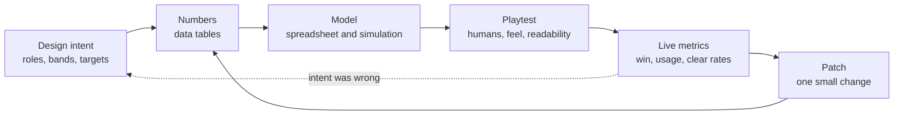

# Module 21: Balancing

- **Goal:** set, check and keep the numbers of an online RPG fair, varied and on target: build a class balance sheet, define bands, use a simulation to test one change at a time, and run balance as a live service.
- **Prerequisites:** [06 — Combat design](06-combat.md), [07 — Classes and roles](07-classes-roles.md), [11 — Progression and power curves](11-progression.md), [13 — Economy design](13-economy.md).
- **Simulation:** `examples/21-balance/` (`dotnet test examples/21-balance`)
- **Facts checked:** October 2026 (prices, rules and product status change; re-check before reuse)

## In short

"Balanced" means three things at once: **fair** (players of equal skill have equal chances), **varied** (many options are viable, so choices matter) and **intended** (the result matches what the designer meant, for example "tanks survive, mages burst"). You get there by giving every option a **power budget**, checking it first in a **spreadsheet**, then a **simulation**, then **playtests**, and finally **live metrics**, and by changing one number at a time. In a live game, balance never ends: it is a cadence of small patches, buffs before nerfs, and plain communication. The worked example is the course game's **class balance sheet**: DPS, effective HP and a utility score for five classes against target bands, the rule that the two Paths of a class stay within 5% of each other in three benchmark fights, and one balance change traced through the simulation.

## 1. The concept

### 1.1 Terms

| Term | Meaning |
|---|---|
| **Balance** | The state where the numbers produce the intended fairness, variety and difficulty |
| **Viable option** | A class, build or strategy that can succeed at the intended skill level, not only at the top |
| **Power budget** | The total strength a design may spend (a skill, an item, a class), split across damage, survivability and utility |
| **Cost curve** | How much an extra point of one stat should cost in the budget: linear, rising or flattening |
| **Value per point** | What one budget point buys (for example damage per Focus), the unit for comparing options |
| **Benchmark fight** | A fixed, simple encounter used only to compare options (one boss, one pack, one dungeon) |
| **Normalised score** | A number where 1.0 is the roster average, so classes can be compared on one line |
| **Band** | The accepted range around the target, for example a score of 0.90 to 1.10 |
| **Dominant strategy** | An option that is best (or equal) in every situation, so the others stop being choices |
| **Win rate / usage rate** | In PvP: the share of fights won. For any option: the share of players who choose it |
| **Transitive / intransitive** | Options ranked on one scale (A beats B beats C) versus a cycle (A beats B beats C beats A) |
| **Buff / nerf** | A change that raises or lowers an option's power |
| **The meta** | The mix of options the community currently believes is best |

### 1.2 Three meanings of "balanced"

| Meaning | Question | Failure |
|---|---|---|
| **Fair** | Do equal players have equal chances? | One class wins every duel; one needs twice the skill for the same result |
| **Varied** | Are many options viable? | Everyone plays the same two builds; the rest are traps |
| **Intended** | Does it match the design goal? | The "tank" kills faster than the damage class |

David Sirlin's well-known definition of a balanced multiplayer game is "a reasonably large number of options available to the player are viable", which puts variety first and fairness second. Online RPGs add a third demand: the numbers must also serve the **role fantasy** ([module 07](07-classes-roles.md)). Perfect parity is not the goal. A healer that deals exactly the same damage as a Duelist has no identity.

### 1.3 The balance loop



The loop is cheap on the left and expensive on the right. Catch problems as far left as you can, but accept that only the right half sees real players.

## 2. The player's view

Players do not read formulas; they read **outcomes and stories**: "my class can't clear the weekly dungeon", "Rangers are everywhere", "they nerfed my build and my gold went into it". Four things shape their trust.

- **Fairness of effort** (Challenge, module 01): a hard class should pay back with skill. If the 5/5-difficulty Duelist is no stronger than the 2/5 Warden at the same skill, nobody picks it.
- **Being welcome in a group** ([module 09](09-party-roster.md), pillar 3): when one class is clearly stronger, parties ask for it and the rest wait. That breaks "stronger together".
- **Investment safety** (Power, Completion): every nerf takes away something the player built or bought. Mira (the primary persona) will forgive a nerf with a reason; Dev (a phone player who has 20 minutes a day) will quietly stop if the class feels useless after a patch.
- **Identity** (Fantasy, Discovery): a balanced class that feels identical to the others is a failed class. Lena (the story player) does not care about win rates, but she notices when her tank hits like a mage.

## 3. The design space

### 3.1 Power budgets and cost curves

A **power budget** gives every option the same total to spend. A sword, a skill or a class is a way to spend it. The designer's job is to fix the **exchange rate**: how much damage one point of survivability is worth.

| Cost curve | Shape | Effect | Use |
|---|---|---|---|
| **Linear** | Each point costs the same | Easy to explain; stacking a stat is not punished or rewarded | Base stats, flat bonuses |
| **Convex (rising cost)** | Each extra point costs more | Spreads investment across stats; extremes are expensive | Crit chance, cooldown reduction, anything that multiplies |
| **Concave (falling cost)** | Each extra point costs less | **Stacking is rewarded**, so one build dominates; avoid | Rarely intended |

Two practical rules:

1. **Compare by value per point, not by raw effect.** In [module 08](08-skills.md) Aimed Shot gives 3.0× for 25 Focus (0.120 per Focus) and Volley 2.0× per target for 35 Focus (0.057 per target), so Volley breaks even at two targets and wins from three. That table is a small power budget.
2. **Cap what multiplies.** Module 08 caps damage-dealt buffs at +40% additive for exactly this reason: uncapped multipliers turn a small edge into a dominant strategy.

### 3.2 Four ways to check a number

| Method | Answers | Cost | Blind spot | Use when |
|---|---|---|---|---|
| **Spreadsheet** | "What is the expected DPS, effective HP, time-to-kill?" | Hours | Averages only; no variance, no player behaviour | First, always |
| **Simulation** | "What happens over 10,000 fights with crits, targets and interactions?" | Days | Models what you thought of | Interacting systems, random rolls |
| **Playtest** | "Is it fun, readable, fair?" | A day per round | Small sample; opinions | Before "final" |
| **Live metrics** | "What do real players pick and win?" | Needs players | Sees symptoms, not causes; skill and platform mix distort it | After launch, forever |

Order for a small team: spreadsheet, then simulation for the interesting parts, then playtests ([module 24](24-prototype-playtest.md)), then live metrics. Each stage catches what the earlier one cannot: a spreadsheet will not find "this fight is boring", and a playtest will not find a 4% edge.

### 3.3 Transitive and intransitive balance

| | **Transitive** | **Intransitive** |
|---|---|---|
| Shape | One strength scale; higher beats lower | A cycle: rock beats scissors beats paper beats rock |
| Typical game | PvE RPG progression: level, gear, difficulty | Strategy and fighting games; weapon triangles; some PvP |
| Balance question | "Is each option's number right?" | "Does each option have a counter and a victim?" |
| Strength | Clear, easy to tune and explain | Variety; no single best option |
| Risk | The best option is simply the largest number | Counter-picking, frustration, "I lost at character select" |

Online RPGs are mostly **transitive in PvE** (more power clears harder content) and **mildly intransitive in PvP** (a ranged class is strong against slow melee, weak against a fast flanker). The course game keeps PvE almost purely transitive on purpose: classes differ by **role and shape** (module 07), not by who counters whom. A little intransitivity belongs only in the opt-in PvP mode ([module 19](19-pvp.md)).

### 3.4 Class balance: DPS, survivability, utility

A class does three things: **deals damage** (DPS), **stays alive** (effective HP, often called EHP) and **helps others or controls the fight** (utility). A balance sheet scores each, weights them, and compares the total to the roster mean.

| Component | What it measures | Easy to measure? |
|---|---|---|
| **DPS** | Expected damage per second against a benchmark target | Yes (module 06 formula) |
| **Effective HP** | Health after defence and kit mitigation (blocks, shields, self-heals) | Yes |
| **Utility** | Crowd control, healing for others, buffs, mobility | **No**: it needs a checklist and judgement |

Three design choices:

| Choice | Option | Cost |
|---|---|---|
| Weights | One fixed set, or a set per fight (a pack rewards control more than a boss does) | Per-fight weights capture situations but are one more thing to defend |
| What to compare | Everyone against the roster mean, or each class against its own role | The mean is simple and shows who is out of line; role-only hides a weak role |
| Band width | Narrow (±5%) or wide (±10%) | Narrow demands a precise model; wide tolerates the model's error and rewards identity |

### 3.5 Dominant strategies and what players pick

A **dominant strategy** shows up in two numbers.

| | **Low win rate** | **High win rate** |
|---|---|---|
| **High usage** | A popular trap, or a fun but weak option; watch for frustration | Overpowered, or just easy to play at every level; nerf or buff the others |
| **Low usage** | Underpowered; buff | Strong but hard or not obvious (a high skill ceiling); do not nerf yet, teach it |

Read the metrics with care. **Skill and platform mix distort them**: an easy class gets more beginners, so its average win rate drops even if it is strong in good hands. Riot Games' public champion-balance framework (see Further reading) handles this by setting separate power bands for different skill tiers instead of one number, and by treating the pick-or-ban rate as a signal of its own. Use the same idea: look at the metric by skill bracket and platform before you act.

### 3.6 PvE versus PvP balance

| | **PvE** | **PvP** |
|---|---|---|
| Goal | Content is clearable by intended skill; differences stay within a band | Equal skill, equal chance; counterplay exists |
| What you tune | Class numbers **and** the content (an enemy can be changed instead of a class) | Class numbers only, plus rules and maps |
| Cost of an imbalance | A class is less wanted in groups | A class is unplayable or oppressive |
| Tolerance | Wider: one class may be best at one boss | Narrow: players compare directly |
| Typical tools | Bands per class, clear-time telemetry | Win rates by skill tier, ban rates, matchup tables |

When both modes share skills, a change meant for one breaks the other. The common answer is to give PvP **its own coefficients**: several games publish separate PvE and PvP values for some skills (for example Guild Wars 2, as of October 2026; check the current patch notes). The course game's single opt-in PvP mode ([module 19](19-pvp.md)) applies a mode multiplier on top of the same sheet, so the PvE sheet in this module stays the one source of truth.

### 3.7 Balancing a live game

| Practice | Rule of thumb | Why |
|---|---|---|
| **Buffs before nerfs** | If a class is weak, buff it; nerf only a true outlier | A nerf removes something players built; buffs are welcome, but if you only buff, the whole roster inflates (power creep), so pair them with content tuning |
| **Small steps** | At most about 10% on one number per patch; one lever at a time | You can see what each change did; you can undo it |
| **Fix the right layer** | A mechanic problem is not a number problem | Nerfing damage on a skill that is oppressive because it is un-dodgeable only makes it weak and still oppressive |
| **Patch cadence** | Predictable and published | League of Legends, for example, ships patches roughly every two weeks and publishes the year's schedule (as of October 2026). Players plan around a rhythm and stop expecting surprise hotfixes |
| **Hotfix only for harm** | Exploits, crashes, broken rewards | A mid-cycle balance change is a surprise and erodes trust |
| **Communicate intent** | Patch notes give the old value, the new value and one sentence of reason ("Frostbinder trailed in packs, so its freeze is longer") | Players accept a reasoned change more readily than a silent one |
| **Compensate nerfs** | Free respec, refund, or a grace period when a nerf hits a build players invested in | Time is the currency in a game where nothing sold gives power |

Which method for which situation:

| Situation | Method |
|---|---|
| New class or skill, nothing exists | Spreadsheet, then simulation |
| Many interacting buffs or random rolls | Simulation |
| "It feels strong" with no data | Playtest, then a metric to confirm |
| A live class is under- or over-used | Metrics by skill bracket, then a one-lever change |
| A change is risky or controversial | Public test environment, then metrics |

## 4. Tuning and pitfalls

**Set bands before numbers.** Decide what "acceptable" is first. A band of ±10% around the roster mean for classes and ±5% between the two Paths of a class is a good starting point: it is wide enough to hide the error of the model and narrow enough that players do not feel a gap. The 5% figure is a rule of thumb (inferred): below it, most players cannot attribute a result to the build and not to their own play.

**Change one lever at a time**, then re-run the sheet. If three numbers move together you cannot say which helped.

**Signals that the balance is wrong** (playtest and live):

| Signal | Likely cause |
|---|---|
| One class is more than ~28% of level-50 heroes | Overpowered or too easy to play at every level |
| One class is under ~12% | Underpowered, unfun or unclear |
| One Path is taken by over 70% of the class | The other has no visible reason to be picked |
| Parties wait for one role | A role is too hard, too weak or not rewarded ([module 09](09-party-roster.md)) |
| Clear time differs by more than 10% between classes in the same dungeon | A class is dominant or dragging the party |
| Players ask "which path should I pick?" in chat before level 20 | A trap option, or hidden information |

**Classic failures in long-running games:**

- **Balancing by the loudest voice.** Forum anger is not data. Check the metrics first.
- **Balancing for the top 1%.** Elite players optimise anything; a tuning pass for them can ruin the casual experience.
- **Homogenisation.** Fixing every outlier by giving each class the same tools ends in five identical classes.
- **Power creep.** Each new class or item is slightly stronger than the last to sell it. Budget new content against the same sheet.
- **Over-trusting the sheet.** A sheet shows averages; it does not know that a skill is boring or un-dodgeable. The sheet in section 5 does not value a Cleric's raise at all.
- **Hidden coupling.** A "class" change that touches shared skills changes PvP, gear tuning and the economy. Keep a list of what each number feeds.

## 5. Worked example

The course game: a small online fantasy RPG, one hero per player, five classes, Paths at level 20 ([fact sheet](_course-game.md)). All numbers are invented. This feature spec is the **class balance sheet** and the simulation behind it.

### 5.1 Intent

- **Pillar 1, "My hero, my way":** each class is different in shape, so the sheet allows spread (±10%) and checks it does not become a gap.
- **Pillar 3, "Stronger together":** no class is dominant in group content; the balanced-party bonus of [module 07](07-classes-roles.md) rewards variety.
- **Pillar 4, "Fair and respectful of time":** nothing sold gives combat power, so every nerf is only a loss of time. The live rules compensate it (section 5.8).
- A designer must be able to answer "is the roster balanced?" in under a minute: edit one number, run the tests, read a table.

### 5.2 Rules and bands

| Rule | Value |
|---|---|
| Class score | Weighted sum of DPS, effective HP and utility, each divided by the **roster mean**, per benchmark fight. 1.0 = average |
| **Class band** | The mean of the three fight scores must be **0.90 to 1.10** |
| **Path band** | The two Paths of a class differ by at most **±5%** in each benchmark fight (gap = score of Path A ÷ score of Path B − 1) |
| Effective HP | `HP × (100 + defence) / 100 / (1 − mitigation)` (module 06's ratio defence, K = 100) |
| DPS | Module 06's expected hit (crit multiplies the raw hit) × `100 / (100 + enemy defence)` ÷ interval, times an area bonus |
| Area bonus | `1 + areaShare × Path areaMult × (targets in reach − 1)`, with targets in reach capped by the class's max targets |
| Utility | A 0–10 score from the checklist in 5.4 |

### 5.3 The three benchmark fights

These are the three fights of module 07's Path rule. They reuse the enemy stats of [module 06](06-combat.md).

| Fight | Targets in the area | Enemy defence | Weight DPS | Weight survival | Weight utility | Why this mix |
|---|---|---|---|---|---|---|
| **Boss** | 1 | 30 | 0.55 | 0.20 | 0.25 | One target: damage matters most; area skills are worthless |
| **Pack** | 4 | 10 | 0.40 | 0.20 | 0.40 | Four enemies: control and area matter as much as damage |
| **Dungeon** | 2.5 | 20 | 0.45 | 0.20 | 0.35 | A mix of packs, elites and a boss; the average target count |

Each fight's weights sum to 1, so the mean of all class scores in every fight is exactly 1.0 (a test checks it).

### 5.4 The inputs and the utility checklist

The first five columns of each class equal module 06's numbers. The rest are added for the sheet.

| Class | HP | Defence | Damage per hit | Interval | Crit | Mitigation | Utility | Area share | Max targets |
|---|---|---|---|---|---|---|---|---|---|
| Warden | 1,300 | 40 | 38 | 1.0 s | 10% × 1.5 | 5% | 6 | 0.10 | 3 |
| Cleric | 1,000 | 20 | 46 | 1.4 s | 5% × 1.5 | 10% | 9 | 0.05 | 3 |
| Duelist | 900 | 15 | 22 | 0.6 s | 30% × 1.75 | 15% | 5 | 0.20 | 3 |
| Ranger | 900 | 15 | 30 | 0.8 s | 25% × 1.75 | 5% | 7 | 0.15 | 4 |
| Arcanist | 800 | 10 | 70 | 1.75 s | 15% × 2.0 | 0% | 7 | 0.28 | 5 |

**Mitigation** is the share of incoming damage the kit removes (blocks, shields, self-heals, a Duelist's recovery on dodge). **Area share** is the part of a class's damage that spreads to extra targets.

**How utility was scored.** Designers award one point for each reliable thing a class brings to the group (two for the big ones), capped at 10:

| Class | Points | Utility |
|---|---|---|
| Warden | Taunt (2), stagger or knockback (1), shield for an ally (1), gap-closing charge (1), rally buff (1) | 6 |
| Cleric | Group heal (3), single heal (2), shield (1), cleanse (1), party buff (1), faster revive (1) | 9 |
| Duelist | Dash and gap-close (2), interrupt (1), short stun (1), cooldown reset on a perfect dodge (1) | 5 |
| Ranger | Snare Trap (2), slow (1), Pinning Shot root (1), Marked Prey (1), Disengage (1), safe distance (1) | 7 |
| Arcanist | Area freeze or slow (2), knockback (1), stun (1), zone denial (1), shield bubble (1), blink (1) | 7 |

A checklist is not objective, but it is **written down**: anyone can argue a point, and the argument changes a number and a test, not a feeling.

### 5.5 A worked calculation

Ranger against the boss (defence 30, one target): average swing `30 × (0.75 + 0.25 × 1.75) = 35.625`; after defence `35.625 × 100/130 = 27.40`; per second `27.40 ÷ 0.8 =` **34.25 DPS**. Against a pack (defence 10, four targets): `35.625 × 100/110 ÷ 0.8 × (1 + 0.15 × 3) =` **58.7 DPS**.

Warden effective HP: `1,300 × 140/100 / 0.95 =` **1,915.8**.

Warden score in the boss fight (roster means: DPS 32.16, EHP 1,287.2, utility 6.8):

| Component | Value ÷ mean | × weight | Part |
|---|---|---|---|
| DPS 30.69 | 0.954 | 0.55 | 0.525 |
| EHP 1,915.8 | 1.488 | 0.20 | 0.298 |
| Utility 6 | 0.882 | 0.25 | 0.221 |
| **Score** | | | **1.043** |

### 5.6 The class balance sheet

Produced by `Sheet.Render` from `balance.json`.

| Class | Role | DPS boss / pack / dungeon | EHP | Utility | Score boss | Score pack | Score dungeon | **Overall** | In band |
|---|---|---|---|---|---|---|---|---|---|
| Warden | Tank | 30.7 / 43.5 / 38.2 | 1,916 | 6 | 1.043 | 0.973 | 1.003 | **1.006** | yes |
| Cleric | Healer | 25.9 / 33.7 / 30.2 | 1,333 | 9 | 0.981 | 0.986 | 0.983 | **0.983** | yes |
| Duelist | Damage | 34.6 / 57.2 / 48.7 | 1,218 | 5 | 0.964 | 0.907 | 0.951 | **0.941** | yes |
| Ranger | Damage | 34.3 / 58.7 / 45.5 | 1,089 | 7 | 1.012 | 1.016 | 1.001 | **1.010** | yes |
| Arcanist | Damage | 35.4 / 76.9 / 54.4 | 880 | 7 | 0.999 | 1.118 | 1.062 | **1.060** | yes |

How to read it:

- **Different shapes, similar scores.** The Warden has 1.49× the average EHP and a below-average DPS, yet scores 1.006, right on the average: durability is worth something, so the sheet treats a tank as a fair trade.
- **The Arcanist leads the pack fight** (1.118, above the 1.10 line) and trails in survivability (880 EHP). That is specialisation, so the band applies to the **overall** score, not to each fight.
- **The Duelist is the lowest** (0.941), though in band. It is the hardest class (5/5), and its cooldown reset on a perfect dodge is **not** in the model. If playtests show skilled Duelists beating 1.0, the model is fine; if not, the class needs about +5% somewhere. This is why the band is ±10%, not ±1%.
- **The Cleric's utility (9) props up a low DPS (25.9).** The sheet is only as good as the checklist: it rewards healing, but does not value how often groups lack a healer.

### 5.7 The Path benchmark: ±5% in three fights

Each Path is a set of multipliers on the base class (`damageMult`, `areaMult`, `ehpMult`, `utilityDelta`). The Path's score is measured against the **same** roster means, so Path scores and class scores live on one scale. A Path is a step up from the base kit, from +1% (Swiftblade, boss) to +17% (Stormcaller, pack) on this scale; module 11's power curve owns the size of that step. The ±5% rule compares the two Paths of one class.

| Class | Path A vs Path B | Boss gap | Pack gap | Dungeon gap | In band |
|---|---|---|---|---|---|
| Warden | Bulwark vs Avenger | −1.1% | +1.0% | −0.6% | yes |
| Cleric | Lifebinder vs Radiant | −1.3% | −0.3% | −0.8% | yes |
| Duelist | Swiftblade vs Executioner | −0.3% | +0.7% | −0.8% | yes |
| Ranger | Sharpshooter vs Trapper | +2.8% | −3.2% | −1.2% | yes |
| **Arcanist** | **Stormcaller vs Frostbinder** | +0.3% | **+7.6%** | **+5.1%** | **no** |

The default data has one deliberately broken pair. Stormcaller's `areaMult` is 1.6 (Frostbinder's is 1.2). In the pack, Stormcaller does 102.9 DPS to Frostbinder's 79.8, a 29% gap, but the **score** gap is only 7.6%, because Frostbinder offsets it with more EHP (1,012 against 880) and +1 utility. The boss gap is 0.3% because a single target has no area to exploit.

The Cleric's Lifebinder trails Radiant in all three fights (by 1.3% at most). That is in band, but it is a flag: Lifebinder's reason to exist is raise, and the sheet does not value it. [Module 07](07-classes-roles.md) rule 2 (each Path has a visible reason to be picked) is the check to run on live data.

### 5.8 One change, traced

Two ways to fix the Stormcaller pair, each by changing **one number**, both asserted in the tests:

| | Default | **Nerf:** Stormcaller `areaMult` 1.6 → 1.4 | **Buff:** Frostbinder `utilityDelta` 1 → 2 |
|---|---|---|---|
| Boss gap | +0.3% | +0.3% (unchanged) | −3.2% |
| Pack gap | +7.6% | +3.1% | +2.6% |
| Dungeon gap | +5.1% | +2.0% | +0.5% |
| Stormcaller pack DPS | 102.9 | 95.5 (−7.2%) | 102.9 |
| In band | no | yes | yes |

What the trace shows:

- **The nerf moves only the fights with several targets.** The boss gap is identical to nine decimal places, because the boss has one target. A change to an area number cannot affect single-target content.
- **The buff flips the boss gap** to −3.2%: Frostbinder now leads on the boss fight. Still in band, but the designer has moved the problem, not removed it.
- **The edge is between 1.45 and 1.50.** At `areaMult` 1.45 the pack gap is +4.2% (in band); at 1.50 it is +5.3% (out).
- **A change to one class moves the others.** Raising Duelist damage 10% lifts its overall score from 0.941 to 0.979, and **every other class falls** (Warden 1.006 → 0.998, Arcanist 1.060 → 1.047), because the roster mean moved. The mean of all scores stays exactly 1.0. Scores are relative.

**Which fix?** Before launch, nerf: nobody has chosen a Path yet, and the intent for Stormcaller ("ahead in packs, within 5%") says 1.6 overshoots. After launch, prefer the buff, or give a free Path change for seven days with the nerf (section 5.9), because players have already paid respec gold ([module 13](13-economy.md): 50 gold × level).

### 5.9 Live rules

| Rule | Value |
|---|---|
| Balance cadence | One balance patch every four weeks and at each season start; hotfixes only for exploits and broken rewards |
| Size | At most ±10% on any one number per patch; at most two numbers per class |
| Order | Buff the weak class before nerfing the strong one; nerf only an outlier above band |
| Compensation | A nerf over 5% to a Path gives a free Path change for 7 days (the respec rules of module 07 still apply otherwise) |
| Notes | Old value, new value, one sentence of intent for each change |
| Targets to watch | Class share of level-50 heroes 12–28% (expected 20%); weekly dungeon clear time within ±10% between classes; neither Path under 30% of its class |
| Freeze | No balance change in the last week of a season |

Nothing sold gives combat power ([module 14](14-monetization.md)), so a nerf never needs a refund. The compensation rule is about time, not money.

### 5.10 What was cut

- **Player-assigned stat points per level.** The reason sits in this module: with 3 free points over 49 levels into 4 stats, a single class has about **551,000** possible allocations (`C(150, 3)`). The sheet cannot cover that; players find the best one within days and the rest become traps. Fixed class growth ([module 07](07-classes-roles.md)) keeps the sheet exact and the build choice on the Paths and skills.
- **Per-class weight sets.** One weight set per fight; per-role sets would make a tank's score about the tank's own job and hide a weak role.
- **Cross-class Path comparison.** The ±5% rule holds inside a class; comparing all ten Paths on one scale is a second pass.
- **Automatic balancing** (win-rate-driven numbers). It hides intent. Metrics inform a human decision.
- **Per-skill PvP splits.** One PvP multiplier ([module 19](19-pvp.md)).

### 5.11 The simulation

`examples/21-balance/` loads `balance.json` and builds the sheet. It has no randomness: the maths is closed-form, so the tests assert exact numbers.

| File | What it does |
|---|---|
| `balance.json` | The data a designer edits: defence constant, the two bands, three fights with weights, five classes with two Paths each |
| `Model.cs` | `Dps`, `Ehp`, `Utility`, roster `Means` and `Score` |
| `Sheet.cs` | The class rows, the Path pairs with gaps and bands, a text report |
| `BalanceData.cs` | The records, the loader and `EditPath` (copy with one change) |

```bash
dotnet test examples/21-balance
```

| Test | What it asserts |
|---|---|
| Data loads | Five classes, three fights, ten Paths; every fight's weights sum to 1 |
| Hand calculation | Ranger boss DPS 34.25, pack 58.7; Warden EHP 1,915.8 |
| Roster mean | The mean score per fight is 1.0; Warden boss score 1.043 |
| Class band | All five in 0.90–1.10; Duelist lowest 0.941, Arcanist highest 1.060 |
| One flagged Path | Only Stormcaller vs Frostbinder is out: +0.3%, +7.6%, +5.1% |
| Nerf | `areaMult` 1.4: gaps +0.3%, +3.1%, +2.0%; boss gap unchanged; pack DPS 102.9 → 95.5 |
| Band edge | 1.45 in band, 1.50 out |
| Buff | Frostbinder +1 utility: gaps −3.2%, +2.6%, +0.5% |
| Relative scores | Duelist +10% damage: 0.941 → 0.979; every other class falls; the mean stays 1.0 |

Try it: raise the Duelist's `damagePerHit` until it passes 1.10, or change the pack's `targets` to 6 and watch the Arcanist leave the band.

### 5.12 How the design would differ for another kind of game

| Game type | What changes |
|---|---|
| **Hero-collection mobile game** | Balance by rarity tiers and a power budget per rarity; the sheet becomes a table of rates; new heroes are budgeted against the old ones to limit power creep |
| **Competitive arena** | Win rate and ban rate by skill tier decide changes; the sheet is only a first filter |
| **Action game with a fixed build** | The designer tunes the enemies and the difficulty curve; there are no classes to balance |
| **Single-player RPG** | No parity: the goal is that every build can finish, and the economy of difficulty is the work |
| **Classless skill pool** | The unit is the skill, not the class; every skill has a cost curve, and combinations are the main risk |

## Key takeaways

- "Balanced" means fair, varied **and** intended. Perfect parity is not the goal; identity is.
- Give every option a **power budget** and compare **value per point**. Cap whatever multiplies.
- Use the four methods in order: spreadsheet, simulation, playtest, live metrics. Each catches what the previous one cannot.
- Score classes as a **normalised weighted sum** against the roster mean, with written bands: ±10% for classes, ±5% between Paths. Scores are relative: change one class and all the others move.
- Change **one number at a time** and trace it through the sheet. An area change cannot move a single-target fight.
- In a live game, **buff before nerf**, patch on a predictable cadence in small steps, say why, and compensate players whose investment you cut.
- Treat the sheet as a model with known blind spots (utility is a judgement, skill is not modelled). Metrics by skill bracket have the last word.

## Further reading

- Ian Schreiber, *Game Balance Concepts* (free online course; cost curves, transitive and intransitive systems, spreadsheets): https://gamebalanceconcepts.wordpress.com/
- David Sirlin, *Balancing Multiplayer Games, Part 1: Definitions*: https://www.sirlin.net/articles/balancing-multiplayer-games-part-1-definitions
- Riot Games, *Champion Balance Framework* (power bands by audience, presence as a signal): https://www.leagueoflegends.com/en-us/news/dev/dev-champion-balance-framework/
- Riot Games, League of Legends patch schedule (a published cadence; checked October 2026): https://support.riotgames.com/league-of-legends/gameplay/patch-schedule-league-of-legends
