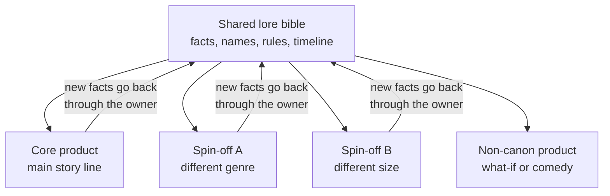

# Module 21: One story world, many games

- **Goal:** plan how one story world (its setting, history and cast) feeds several games of different genres and sizes without contradicting itself, tiring the audience or weakening the main story.
- **Prerequisites:** [03 — Vision, pillars and loops](03-vision-pillars-loops.md), [18 — World and level design](18-world-level.md), [20 — Narrative design for a live game](20-narrative.md), [29 — Designing a live game](29-live-design.md).
- **Simulation:** none
- **Facts checked:** October 2026 (prices, rules and product status change; re-check before reuse)

## In short

A story world is a **shared asset**: a setting, a history and a cast that more than one product can use. Different games tell different parts of it well. An epic arc needs a long game, a side character's tale fits a short one, a place suits an exploration or building game, a historical war suits a strategy or card game, and a mystery suits a puzzle or a series of episodes. The risks are contradictions between products, audience fatigue and a main story diluted by side projects. The controls are a **lore bible shared by all products**, **canon tiers** that say how binding each product is, and one **continuity owner**. The worked example takes the course game's world and plans three other products of different genres and sizes, with a canon tier for each.

## 1. The concept

### 1.1 Terms

| Term | Meaning |
|---|---|
| **Story world (universe, franchise setting)** | The setting, history, rules and cast that several products share |
| **Product** | One game (or film, book, series) that tells part of the world |
| **Core product** | The product whose story is the world's main line; the course game here |
| **Spin-off** | A product with a different genre or cast set in the same world |
| **Canon tier** | How binding a product's story is on the shared world (section 3.3) |
| **Shared lore bible** | The one reference for facts, names and rules that all products read and write (module 20) |
| **Continuity owner** | The person who approves new facts and retcons for the whole world |
| **Retcon** | Changing something the world already said |
| **Transmedia** | One story world told across different media (games, books, film, comics) |
| **Fatigue** | The audience losing interest because the world is told too often or too thinly |

### 1.2 The hub-and-spoke model

Facts flow **out** of the bible to every product and **back in** only through the continuity owner. Products never copy facts from each other directly. This is the whole mechanism; the rest of the module is about what to put in each spoke and what to allow back into the hub.

## 2. The player's view

Players meet a shared world in three ways:

| Situation | What the player feels | Need |
|---|---|---|
| **Fan of the core game tries a spin-off** | "More of the world I love, in a new way" | Familiar names and places; no spoilers they did not ask for |
| **Spin-off player tries the core game** | "I know this place; I want the full story" | A way in that does not require the spin-off knowledge |
| **New player of any product** | "I don't know this world, and I need not" | Each product must stand alone |

The rule players care about: **each product must be enjoyable without the others.** Cross-references reward fans but never gate the story. Motivations from [module 01](01-player-experience.md): Story and Discovery (Lena) are served by the extra material; Fantasy and Community are served by a world that feels bigger than one game; Completion pulls some players to try every product, which is the risk of fatigue.

## 3. The design space

### 3.1 What story material suits which format

| Story material | Best format | What the format can tell | What it cannot tell well |
|---|---|---|---|
| **An epic arc** (many years, many places, a changing hero) | Long single-player or serial online RPG | Change over time, large cast, scale | Anything that needs a short session |
| **A side character's tale** | Short narrative game, mobile chapter game, or a season of a live game | Voice, personal stakes, a small cast | World-wide events |
| **A place** (a city, a fortress, a wilderness) | Exploration game, city builder, survival game | Atmosphere, systems rooted in the place, player-made stories | A planned plot |
| **A historical war** | Strategy game, card game, tactics game, board game | Factions, rules of power, "what if" choices | Individual character arcs |
| **A mystery** | Puzzle or investigation game, episodic series | Clues and discovery, a clear question and answer | Large action set pieces |
| **A group of heroes** | Hero collector, party game | Many voices in short scenes, variety | One deep arc |
| **A myth or legend** | Anthology or card game with flavour text | Tone, tall tales, free invention | Facts the main line must respect |

A **format** gives a product its rules, session length and audience; the story material must fit them. A war that took ten years does not fit a ten-minute puzzle, but one turning battle of it does.

### 3.2 Public examples

Examples below are features any player can see. Product status is as of October 2026.

| World | Products across genres and formats | What it shows |
|---|---|---|
| **Warcraft** | Real-time strategy (the series that began the world), a large online RPG (*World of Warcraft*), a digital card game (*Hearthstone*), novels, a film | One world told in strategy, online RPG and cards. The card game treats lore as tall tales: its official lore is largely a "what if" version and is not fully canon to the RPG, although some of its elements were later brought into the RPG (per the community lore wiki). |
| **The Witcher** | Novels and short stories by Andrzej Sapkowski, then a series of role-playing games set after the books, a card game that began as a mini-game in the third RPG and later became its own product (*Gwent*), a single-player card-based story game (*Thronebreaker*), and a television series | A world that moved from books to games, and a side activity that grew into its own product. The games continue the world's story rather than retell the books. |
| **Pokémon** | Mainline role-playing games, a trading card game, a location-based mobile game (*Pokémon GO*, 2016), a team-battle game (*Pokémon UNITE*, 2021), photography and spin-off games, an animated series | A world with almost no fixed plot; the shared asset is the **creatures and the rules of the world**, so every product can use them in a different genre. |
| **Final Fantasy VII** | The original RPG, then a "Compilation" of games, a film and others (*Crisis Core*, *Advent Children*, *Ever Crisis*) and a remake series | A single story told again and extended in different formats, including a mobile gacha game that retells earlier products, with the risk that fans must follow many titles for the full picture. |
| **Final Fantasy (series)** | Each main game is a new world; spin-offs (tactics, rhythm, card and mobile games) reuse names and creatures | The opposite model: shared **motifs**, not a shared plot. A useful contrast for section 3.4. |

### 3.3 Canon tiers across products

[Module 20](20-narrative.md) split facts into Locked, Soft and Draft inside one game. Across products, the same idea applies to **products**:

| Tier | Meaning | Change rule | Example use |
|---|---|---|---|
| **Core canon** | The main story line; every fact in it is Locked | Only the continuity owner, and only by extension | The course game's main story |
| **Adjacent canon** | Tells part of the world, true but not essential to the main line | May add facts; may not contradict Core; never a prerequisite | A prequel game about one character |
| **Alternate (non-canon)** | A "what if", a comedy, a retelling in the world's tone | May contradict anything; says so on the box | A card game of tall tales |
| **Shared setting only** | Uses the world's look, names and rules, with no link to its plot | Free inside the rules of the world | A cooking game in the same region |

Two rules make this work:

1. **State the tier in the product's own materials** (a banner, a store page, a codex note), so a player is never surprised.
2. **Upgrade by decision, not by accident.** A fact from an Adjacent or Alternate product enters Core only when the continuity owner approves it and writes it in the bible.

### 3.4 Shared plot or shared motifs

| Model | What is shared | Strength | Risk |
|---|---|---|---|
| **One continuous plot** | The story itself; events in one product matter in the others | Rich payoffs for fans | Entry cost grows with every product; contradictions multiply |
| **Shared world, separate plots** | Setting, rules and cast; each product tells its own story | Easy to enter anywhere; products stay independent | Less payoff for fans of the whole |
| **Shared motifs only** | Names, creatures and tone | Cheapest; no continuity work | The "world" is thin |

For a small team, **shared world, separate plots** is the safest default. Choose a continuous plot only when one person owns continuity for the whole world.

### 3.5 Keeping characters consistent

A character who appears in several products is a **contract**:

| Item | Rule |
|---|---|
| **Character sheet** | One sheet in the bible per recurring character: look, voice, wants, flaw, locked facts (module 20 shows the layout) |
| **Voice sample** | Five lines a writer can copy; the same voice in a bark, a quest and a card's flavour text |
| **Locked facts** | Birth, death, relationships, signature items; changes need the continuity owner |
| **Timeline position** | Which year the character is in this product, so a young Kael and an old Kael do not meet by accident |
| **Look** | A reference sheet; a style may change by product (a card art style) but silhouette and colours stay |
| **Name and spelling** | One spelling in all languages (module 20, localisation) |
| **Fate** | Never kill a character in an Adjacent product if the core story still needs them; use a prequel timeline instead |

### 3.6 Risks

| Risk | What happens | Control |
|---|---|---|
| **Contradiction** | Two products state different facts; fans argue | Shared bible, one continuity owner, a canon log |
| **Fatigue** | Too many products too fast; each feels thin | Cap launches per year; give each product a clear reason to exist |
| **Diluting the main story** | Spin-offs answer the core game's mysteries or use up its characters | Spin-offs must not resolve the core's open threads |
| **Entry cost** | A new player thinks they must know five products | Each product stands alone; recaps in each |
| **Brand confusion** | A card game and an RPG share a name; players buy the wrong one | Clear subtitle and genre on every product |
| **Uneven quality** | A weak spin-off damages trust in the world | A quality bar and a veto for the owner |
| **Cannibalisation** | A spin-off takes the same players and time as the core game | Different genre, session length and audience; track overlap |
| **Team split** | Core and spin-off teams drift apart | A shared bible review each quarter |
| **Licensing and rights** | Unclear ownership of characters or art in the shared world | Settle who owns what before work starts (ask a lawyer; not covered here) |

### 3.7 How to choose

| If you have... | Do this | Because |
|---|---|---|
| **One live game and a small team** | Keep one product; grow the world inside seasons (module 20) | Every extra product splits the team |
| **A core game with a stable audience** | Add one **Adjacent** product in a different genre and size | Tests demand and keeps the core game safe |
| **A rich history with a famous war or event** | A strategy or card product on that event | The format fits the material |
| **A loved side character** | A short narrative game, or a season | A small cast and personal stakes |
| **A strong place** | A building or survival game in the same setting | Systems can carry the place |
| **A funny or unserious idea** | An **Alternate** product, labelled non-canon | It cannot hurt the main story |
| **No continuity owner** | Do not start a second product yet | Contradictions arrive faster than you can fix them |

## 4. Tuning and pitfalls

### 4.1 Rules of thumb

- **Build the bible before the second product**, not after.
- **One product at a time per team.** Finish and ship before starting the next.
- **Core first.** A spin-off may start only when the core game's story has an established audience.
- **Make every product stand alone**, then add references as bonuses.
- **Label canon status** on every product.
- **Leave the main story's open threads alone** in spin-offs; answers belong in the core line.
- **Reuse assets deliberately.** Shared models, music and voice save money but tie the products' schedules together.

### 4.2 Signals that something is wrong

| Signal | Likely problem |
|---|---|
| Fans post lists of contradictions between products | No shared bible or owner |
| Players ask "which one should I start with?" | The products do not stand alone |
| A spin-off's launch lowers the core game's player numbers | Cannibalisation; the audience overlaps too much |
| Writers on different products ask each other "is this canon?" | Tiers not stated |
| Spin-off players do not become core players | The core game's entry is unclear |
| The core story's mysteries are being answered elsewhere | A spin-off is diluting the main line |
| Each new product has fewer players than the last | Fatigue |

### 4.3 Classic failures

- **The tangled timeline.** Many products each add events; no one can place them in order.
- **The required reading list.** The core story needs five side products to make sense.
- **The retcon spiral.** A spin-off changes a core fact, and the core game must then explain the change (module 20).
- **The cash-in.** A spin-off made only to sell the name; players feel it.
- **The spoiler spin-off.** A prequel that reveals the core game's twist.
- **The orphan character.** A beloved character with a different voice in every product.

## 5. Worked example

The course game's world, from [module 20](20-narrative.md): the **Hearthworks** (furnace-engines), the **Long Ash**, the **Wayfarer Lodge**, **Maren Holt** and **Kael Voss**, four regions. The core product (the online RPG) has Core canon. We plan three other products. Their names and details are invented for teaching and are not decisions about the course game's release plan (section 5.5).

### 5.1 The shared bible and canon rules

| Item | Rule |
|---|---|
| **Bible** | The course game's lore bible (module 20) is the world's bible. Every product reads it and sends a note after |
| **Continuity owner** | The course game's narrative designer |
| **Canon tiers** | The four tiers of section 3.3 |
| **Stand-alone rule** | Each product is playable without the others |
| **Open threads** | Kael's fate and the signal from the Heart stay answered **only in the core game's seasons** |
| **Locked facts** | Maren is left-handed and never leaves Kindlewick before Book Two; Kael never kills a Wayfarer; the Colossus returns after every defeat |
| **Entry of new facts** | A new fact from any product enters the bible only through the owner, with a canon log ID |

### 5.2 Product A: *The Relighter's Road* (Adjacent canon, a story game)

| Field | Entry |
|---|---|
| **Material** | A side character's tale: Kael Voss's years before the Long Ash is relit |
| **Format** | A short single-player narrative game with light exploration and choices, about 6 hours, PC and mobile, a one-time purchase (invented) |
| **Why this format** | It needs a voice and a personal arc, not a large cast or a shared world |
| **Canon tier** | Adjacent. It is set **before** Book One, so it cannot change Kael's fate |
| **Rules it must obey** | Kael never kills a Wayfarer; his notes are in his own handwriting; he did not light the Foundry himself |
| **What it adds** | Three new Soft facts about Kael's apprenticeship; a first meeting with Maren; the notes in the core game gain a source |
| **What it must not do** | Reveal who answers the signal in the Heart (an open thread of the core game) |
| **Link to the core game** | An optional reward in the core game's codex for players who finished it; no gate |
| **Risk** | A player who plays it first may feel Kael's fate in Book One is a spoiler; the product ends in the middle of his story, before the core events |

### 5.3 Product B: *Ember Court* (Alternate canon, a card game)

| Field | Entry |
|---|---|
| **Material** | The legends and tall tales told in Lodge taverns |
| **Format** | A free-to-play digital collectible card game, short matches on phone (invented) |
| **Why this format** | Cards carry short flavour text, many characters in small doses, and a "what if" tone |
| **Canon tier** | Alternate. A banner on every card pack says "Tavern tales: not part of the Lodge's records" |
| **Rules it must obey** | Names and spellings follow the bible; character looks keep their silhouette |
| **What it adds** | Flavour text and jokes; an "if Kael had won" tale |
| **What it must not do** | Add facts the core game depends on; sell power in the core game (pillar 4) |
| **Link to the core game** | A cosmetic reward (an emote) for owning a set; the core game never requires cards |
| **Entry of facts** | A card's flavour line may become Soft canon only if the owner approves and the card says so |
| **Risk** | The card game's monetization could be mistaken for the core game's; the shop rules of module 17 apply to the core game only, so the card game needs its own odds page (module 11, 17) |

### 5.4 Product C: *Hearth Keepers* (Shared setting, a co-op survival game)

| Field | Entry |
|---|---|
| **Material** | A place: a Lodge outpost in the cold, with furnaces to tend |
| **Format** | A small co-op survival and base-building game for 1 to 4 players, on PC; early access in the first year (invented) |
| **Why this format** | The theme "no one keeps a fire alone" is a **system** here: a fire that needs tending by the group |
| **Canon tier** | Shared setting only. It uses the Lodge, the cold and the furnaces but has its own characters and no link to the plot |
| **Rules it must obey** | World rules (what a furnace does, why the cold is deadly); names and spellings |
| **What it adds** | Furnace types and survival gear that may be echoed as cosmetics in the core game |
| **What it must not do** | Use Maren or Kael as characters, or set events in Kindlewick's timeline |
| **Link to the core game** | None required |
| **Risk** | Systems that contradict the world: if a furnace here can be relit by a single player, it undercuts the core theme. The system must **require tending in shifts** |

### 5.5 Choosing the order

| Question | Answer |
|---|---|
| **Which first?** | **A**, the story game: smallest cast, one writer, and a team of the core game can finish it without new systems |
| **Which next?** | **B** only if A has found an audience; a card game needs its own live team |
| **Which last?** | **C**: a new genre, a new engine and a new team. Build it only if the world is already loved |
| **Cap** | One new product per year; the core game's seasons continue unchanged |
| **Gate** | Before each product starts, the bible is reviewed and the canon tier is stated in one line |

How the table maps to the module's choice guide:

| Product | Material | Format | Tier | Share model |
|---|---|---|---|---|
| A | A side character's tale | Short narrative game | Adjacent | Shared world, separate plot |
| B | Legends | Card game | Alternate | Shared motifs and names |
| C | A place | Co-op survival | Shared setting only | Shared world, separate plot |

### 5.6 What was cut

- **A continuous plot across all products.** It would need a continuity team the course game does not have.
- **A film or series.** A different medium needs its own bible adaptation (not covered here).
- **A spin-off that answers Kael's fate.** That is the core game's season-end payoff.
- **Shared accounts and currencies across products.** They would tie the economies (module 16) and the legal rules together.
- **Selling core-game power in a spin-off.** It breaks pillar 4.

### 5.7 For another kind of game

| Game type | What changes |
|---|---|
| **A single-player story RPG** | The main line ends; spin-offs may be Adjacent sequels or prequels, and the plot can be continuous |
| **A competitive game** | The world is mostly motifs and characters; products are skins, short films and side modes (module 20) |
| **A hero-collection game** | The cast is the roster; every product is "more heroes", so the continuity owner caps new characters per season |
| **A studio with many teams** | Needs a formal canon board and a written approval process, not one owner |

## Key takeaways

- A **story world** is a shared asset; the **lore bible** and one **continuity owner** are what keep many products consistent.
- Match **story material to format**: an epic arc to a long game, a side character to a short one, a place to a systems game, a war to strategy or cards, a mystery to puzzles or episodes.
- Use **canon tiers** (Core, Adjacent, Alternate, Shared setting only) and **state the tier in each product**.
- **Each product must stand alone**; cross-references are bonuses, never gates.
- A character is a **contract**: one sheet, one voice, locked facts and a position in the timeline.
- Guard the main story: spin-offs must not answer the core game's open threads or spoil its twists.
- **Finish one product before starting the next**, and cap launches so the world does not tire its audience.

## Further reading

- Warcraft Wiki, "Canon" (what counts as canon across Warcraft products): https://warcraft.wiki.gg/wiki/Canon
- Hearthstone Wiki, "Hearthstone lore": https://hearthstone.wiki.gg/wiki/Hearthstone_lore
- Wikipedia, "Gwent: The Witcher Card Game": https://en.wikipedia.org/wiki/Gwent:_The_Witcher_Card_Game
- Wikipedia, "Pokémon Go": https://en.wikipedia.org/wiki/Pok%C3%A9mon_Go
- Wikipedia, "Pokémon Unite": https://en.wikipedia.org/wiki/Pok%C3%A9mon_Unite
- Wikipedia, "Compilation of Final Fantasy VII": https://en.wikipedia.org/wiki/Compilation_of_Final_Fantasy_VII
- Wikipedia, "Final Fantasy VII: Ever Crisis": https://en.wikipedia.org/wiki/Final_Fantasy_VII:_Ever_Crisis
- Wikipedia, "Transmedia storytelling": https://en.wikipedia.org/wiki/Transmedia_storytelling
- Wikipedia, "Canon (fiction)": https://en.wikipedia.org/wiki/Canon_(fiction)
