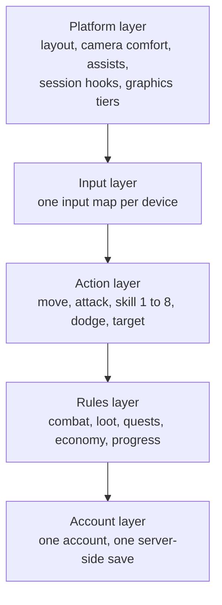

# Module 23: PC, mobile and browser

- **Goal:** compare the platforms an online RPG can ship on, decide which rules must be identical everywhere and which may differ, and write the platform rules for a game that runs on PC and phones with one shared account.
- **Prerequisites:** [02 — Vision, pillars and loops](02-vision-pillars-loops.md), [05 — Controls, camera and game feel](05-controls-camera-feel.md), [08 — Skills and abilities](08-skills.md), [14 — Monetization design](14-monetization.md).
- **Simulation:** none
- **Facts checked:** October 2026 (prices, rules and product status change; re-check before reuse)

## In short

A platform is a bundle of **input, screen, attention, hardware limits and store rules**, and each one changes what a good design looks like. The safest way to ship on several platforms is to keep the **rules of the game identical** (damage, hit windows, rewards, progress) and let the **presentation differ** (layout, assists, session hooks). The hardest design questions are how much the game may play itself on a phone, and how to keep a mixed PC and phone crowd fair in a group or a PvP match. The worked example sets the course game's platform rules: what is the same on PC and mobile, what differs, the cross-play rules for dungeons and PvP, and why there is no full auto-battle.

## 1. The concept

### 1.1 Terms

| Term | Meaning |
|---|---|
| **Platform** | The device family and its store: PC, console, mobile, or a web browser |
| **Input** | How the player commands the game: mouse and keyboard, touch, controller |
| **Session** | One sitting from start to stop. Its typical length differs by platform |
| **Performance budget** | The limits a build must stay within on the weakest supported device: frame time, memory, download size, battery and heat |
| **Store fee (platform fee)** | The share of each sale kept by the store that processes the payment |
| **Auto-play** | The game acts for the player: it moves, targets or casts without input |
| **Idle (or offline) progress** | The game grants progress while the player is away |
| **Cross-play** | Players on different platforms play in the same world, party or match |
| **Cross-progression** | One account and one save across platforms. Also called a shared account |
| **Cross-save** | A narrower form: the same character can be continued on another platform |
| **Input parity** | Different input devices give the player equal power in the same content |

### 1.2 Shared rules and platform layers

Think of the game as layers. The lower layers are rules that every platform must agree on. The upper layers adapt to the device.

Rule of thumb: **anything that affects fairness or progress lives at the rules and account layers**, and anything that affects comfort lives above. Module 05 applied this to controls, and this module applies it to the whole game.

## 2. The player's view

Players do not choose a "platform design". They pick the device that fits the moment, and expect the game to fit it back.

- **On a desk, with a mouse:** "I want depth and precision, and my full attention for an hour or two." Motivations: Challenge, Power, Community.
- **On a phone, in a gap:** "I have 15 minutes. Let me log in, do something that counts, and stop without guilt." Motivations: Completion, Power, and a little Excitement.
- **Switching:** "I started on my laptop and finished on the train. My hero, bag and quests are exactly where I left them."

The platform design supports the loops of [module 02](02-vision-pillars-loops.md) in different places: the **core loop** (seconds) depends on input and frame rate, the **session loop** (a sitting) depends on session length and interruptions, and the **meta loop** (weeks) depends on the shared account. The feeling to protect is "my device is not a second-class way to play", and the opposite one is "I am playing someone else's version".

## 3. The design space

### 3.1 Platforms side by side

| Dimension | PC | Console | Mobile | Browser |
|---|---|---|---|---|
| **Primary input** | Mouse and keyboard | Controller (limited buttons, analogue sticks) | Touch (no hover, thumbs cover the screen) | Mouse and keyboard, sometimes touch |
| **Screen** | Large, close; many windows possible | Large, far (couch); text must be bigger | Small, close; one thumb zone | Varies; a tab among other tabs |
| **Typical session** (rule of thumb, inferred) | 45–180 min | 45–120 min | 5–25 min, often interrupted | 5–30 min |
| **Attention** | High, often a second screen | High, a shared room | Fragmented: calls, messages, transit | Low to medium: tab can be hidden |
| **Install** | Launcher or store download | Store download, large | Store download, size-sensitive | None: open a link |
| **Performance limit** | Wide range of hardware; the cheapest laptop sets the floor | Fixed hardware: the easiest to target | Heat, battery and memory; many device tiers | Memory and storage quotas; the engine runs inside the browser |
| **Update path** | Own launcher or store, fast | Certification before each patch | Store review plus a download | Instant, no store |
| **Store fee** | Store share, or none on your own launcher | Platform-holder share | Store share, large | Payment-processor fee only |

These are tendencies, not laws. A tablet is "mobile" by store rules but "PC-like" by session length. A handheld PC is a PC with a controller.

### 3.2 Input and screen

- **Mouse and keyboard** supports many buttons, precise aim and fast camera control. It sets the ceiling for skill expression.
- **Controller** gives analogue movement and about 10 comfortable buttons. Games use radial menus and context-sensitive buttons to fit more.
- **Touch** supports a joystick and about 6–8 combat buttons at once, plus drag and tap gestures. It cannot hover, so every tooltip needs a tap or a long press. Targets need a minimum size (see [module 05](05-controls-camera-feel.md)).
- **Screen** size sets how many telegraphs, enemy bars and chat lines fit. A design that relies on reading small effects on a phone fails pillar 2 of the course game.

### 3.3 Session length and attention

Session length decides what a "complete" unit of play is. A design that needs 45 uninterrupted minutes for a meaningful reward fits PC and excludes the phone. A design that gives every reward in 3 minutes feels shallow on PC.

Three ways to fit both:

1. **Nested loops:** a 15-minute unit and a 40-minute unit that award the same kind of progress ([module 02](02-vision-pillars-loops.md)).
2. **Interruption tolerance:** progress saves at every step; the game survives a call (app in the background, a lost connection).
3. **Natural stopping points:** after a quest turn-in or a dungeon, not mid-fight, so stopping does not feel like a loss.

### 3.4 Performance budgets

A **budget** is a limit per frame or per session that every feature must fit. Set it on the **weakest supported device**, not the developer's.

| Budget | Typical choice | What it constrains |
|---|---|---|
| **Frame time** | 60 fps = 16.7 ms per frame; 30 fps = 33.3 ms | Effects, number of visible characters, shadows |
| **Memory** | The lowest-tier phone you support sets the cap | Texture size, how many zones are loaded |
| **Download and install size** | Keep the first download small and stream the rest | Whether players start at all |
| **Battery and heat** | A phone that gets hot throttles itself, and the frame rate drops | Frame cap, effect density, session length |
| **Network** | Mobile networks have more jitter and handovers (Wi-Fi to cellular) | Reconnect logic, latency tolerance of combat |

Design consequences:
- **Crowd cap.** A shared world with dozens of players needs a rule for how many other characters are drawn in full. Reduce detail, not rules.
- **Never cull the gameplay-critical.** Telegraphs and enemy attack effects are drawn at every quality tier, because dropping them changes who can survive.
- **Quality tiers.** Offer a "low" tier that looks plainer but plays identically.

### 3.5 Store rules and fees (as of October 2026)

Stores take a share of each sale and set rules about what you can sell and how. The details change often (several changed in 2025 and 2026 after court cases and regulation), so treat the table as a snapshot.

| Store | Standard share | Reduced rates | Notes (as of October 2026) |
|---|---|---|---|
| **Apple App Store** | 30% | 15% under the Small Business Program (up to $1 million in yearly proceeds) | In the US, a court order of April 2025 allows apps to link to outside purchases without a commission. Apple has asked the court to approve a commission on such purchases (reported August 2026), so the status is in flux. The EU has separate terms under the Digital Markets Act |
| **Google Play** | Restructured in 2026: roughly 10–20% depending on region, install type and transaction type, plus an extra 5% billing fee in some regions when using Play Billing | 15% on the first $1 million a year in markets still on the older structure, then 30% | Rollout by region through 2027. Read the current page before budgeting |
| **Steam** | 30% | 25% above $10 million per game, 20% above $50 million | A one-time $100 fee per game to publish. Revenue includes in-game purchases and community-market fees |
| **Epic Games Store** | 12% | 0% on the first $1 million per game per year | Reported; check the current terms |
| **Console stores** | Typically about 30% | Negotiated, not public in detail | Certification (a platform-holder checklist) before each release |
| **Your own web shop** | A payment processor's fee, a few percent | None | Allowed or restricted by each mobile store's anti-steering rules; see below |

**Rules that shape design, not just margin:**

- **Randomized items.** Apple and Google require odds disclosure for random paid items ([module 14](14-monetization.md)).
- **Age and parental tools.** Stores expect an age rating and honour family purchase controls.
- **One account on several platforms.** Apple's guidelines allow content bought elsewhere to be used on iOS if the same content is also offered as an in-app purchase there (Review Guideline 3.1.3(b), multiplatform services, as of October 2026).
- **Anti-steering.** Historically, mobile stores barred apps from pointing players to cheaper outside purchases. That is loosening in some regions in 2025–2026. Never design the economy around a loophole that may close.

**Worked fee example.** A 500 Crowns pack costs $4.99 on every platform in the course game. After a 30% fee the studio keeps $3.49. After 15% it keeps $4.24. After an assumed 5% processor fee on a web shop it keeps about $4.74. The price to the player is the same. **Design implication:** price parity across platforms keeps the shared account fair; the fee difference is a business decision, not a player-facing one.

### 3.6 Auto-play and idle features on mobile

Auto-play and idle features are common on mobile because a phone is used in gaps and with one thumb.

| Feature | What it does | Who uses it | When it helps | What it costs the design |
|---|---|---|---|---|
| **Auto-pathing (auto-travel)** | Walks the hero to the quest target | Many mobile online RPGs | Removes dead travel time on a small screen | Players stop looking at the world, so exploration and discovery weaken |
| **Auto-battle (auto-hunt)** | The game fights for the player | Common in mobile MMORPGs, for example Lineage 2 Revolution and MIR4 | Makes grinding playable on a phone and while half-attending | Skill expression goes away, so the game becomes a spreadsheet of numbers; telegraphs no longer matter; farming bots become hard to tell from players |
| **Auto-use of simple buffs** | Casts maintenance skills at set conditions | Many action RPGs | Saves a button on a small screen | Almost none if the skill is not a decision |
| **Idle (offline) progress** | Rewards accumulate while away | Idle and hero-collection games | Respects time; brings players back | Players feel they must log in to avoid losing value; it competes with the core loop |
| **Sweep (skip a cleared stage)** | Finish content you have already beaten, instantly | Hero-collection games | Respects time for repeated content | Skips the loop the game is built on |

**What auto-play does to the design.** Each automated action removes a decision from the core loop. When combat is automated, the game's depth moves to **build and team preparation** (module 09), which is the design of hero-collection games. When combat is the core pleasure (real-time dodging, as in the course game), automation removes the pleasure and makes pillar 2 meaningless. The question to ask for each feature: **"Is this action a decision, or maintenance?"** Automate maintenance, keep decisions.

**Fairness and trust.** If auto-play beats a skilled human, hand-played PC players feel outclassed; if a human beats auto-play, mobile players feel patronised. Auto-play is easiest to defend when its power is capped below manual play, or when it applies to content where speed, not skill, is the point.

### 3.7 Cross-play and cross-progression

| Level | What is shared | Example of use | Main risk |
|---|---|---|---|
| **None** | Nothing: separate games | Two storefronts of one title | Players leave when they change device |
| **Cross-save** | The character, continuing on another device | A single-player RPG on PC and a handheld | Players expect it everywhere |
| **Cross-progression** | Account, inventory, purchases, progress | Shared accounts across PC and mobile | Store payment rules; support complexity |
| **Cross-play** | Worlds, parties and matches together | Some games span PC, console and mobile | **Fairness between input types**, platform-holder rules on consoles, and exploits |
| **Full** | All of the above | Large live games with one population | The sum of the risks |

Public examples of one account across PC and mobile include *Genshin Impact* and *Old School RuneScape* (as of October 2026, per their public help pages). Cross-play across PC and mobile also exists in several large live games.

**Fairness between input types.** Mouse and touch differ in precision. A designer has three choices:

| Choice | How | Cost |
|---|---|---|
| **Separate pools** | PC and mobile never meet in competitive modes | Smaller queues; a split community |
| **Equalise the assists** | The same aim assist for everyone in competitive modes | PC players lose a little convenience; the rule is clear |
| **Compensate and accept** | Touch gets more assist so it can compete; the PC gets precision | Hard to measure; players argue about who has the advantage |

Cooperative content is forgiving: a phone player with large aim assist helps the group, and nobody competes. Competitive content is not. A common compromise is **mixed queues with equalised assists** and an **optional filter** by platform if the data shows a gap.

**Other cross-play issues.**
- **Voice and text chat** differ: typing on a phone is slow, so quick-chat phrases and pings matter.
- **Anti-cheat** differs: PC needs more protection against modified clients, phones against emulators and scripts.
- **One session per account.** Logging in on a second device moves the session. The server holds the single source of truth.

### 3.8 Designing one game for several platforms

| Shared everywhere | May differ per platform |
|---|---|
| Combat rules and numbers (damage, hit windows, telegraph times) | Layout, button sizes, camera comfort |
| Content: quests, dungeons, loot tables | Aim assist and targeting radius in cooperative content |
| Economy, prices and drops | Quality tiers and crowd caps |
| Account, progress, purchases | Session hooks: notifications, resume, short-session entry points |
| Matchmaking rules | Tutorial hints for each input |

Three tactics to keep the work manageable:

1. **Define the action layer once** (module 05), and write each platform as an input map.
2. **Test the weakest platform first.** The design must be playable on the phone before the PC's extras are added.
3. **Never ship a PC-only requirement.** Do not add content that only one device can finish.

### 3.9 How to choose

| If the game... | Then favour |
|---|---|
| Is built on precise real-time combat | PC first, with touch-friendly assists; no full auto-battle |
| Lives in short sessions and collection | Mobile first; auto and idle features are acceptable; depth is in team building |
| Is a competitive shooter or arena game | Separate pools by input, or equalised assists |
| Needs the biggest reach with the least friction | Browser or instant-play, accepting hardware limits |
| Has a long story and set-piece scenes | Console or PC; controller support |
| Relies on friends playing together | Cross-play and cross-progression, even at the cost of fairness work |

## 4. Tuning and pitfalls

### 4.1 Signals that something is wrong

| Signal | Probable cause |
|---|---|
| Phone players clear the same dungeon much slower, or die more often | The input map is not equivalent; the assist is too weak |
| Phone players clear faster and PC players complain | The assist is too strong or auto-use gives power |
| Phone players log in daily but leave sessions mid-fight | The unit of play is longer than their time |
| PC players stop using a feature on mobile-first updates | Updates drop PC depth (a "mobile port" feeling) |
| Frame rate drops during the world boss on phones | The crowd cap is too high |
| Support tickets about lost progress after switching devices | Save conflicts or a missing "logged in elsewhere" rule |
| Reviews in one store much lower than in another | A platform-specific bug or an unfair monetization rule |

Measure **by platform** from day one: completion rate, deaths per fight, session length, retention. A single average hides which platform is struggling (see [module 24](24-prototype-playtest.md)).

### 4.2 Classic failures of a long-running multi-platform game

- **A phone port.** The PC design is shrunk to a phone with tiny buttons. Fix: design the touch layout from the action layer, not from the keyboard.
- **Two games under one name.** PC and mobile diverge in rules, so a shared account makes no sense. Fix: lock the rules layer.
- **Auto-play creep.** First auto-travel, then auto-battle, then idle rewards; each one is "just for convenience", and in two years nobody plays the core loop. Fix: write the rule down ("auto never casts attack skills") and review it each season.
- **Platform exclusive power.** A bonus for one platform, even a small one, splits the community.
- **Store-rule shocks.** A fee or policy change breaks a revenue model. Fix: no unsellable bundle, a web shop where allowed, and a business model that works at the highest fee.
- **Device fragmentation.** Hundreds of phones. Fix: a device tier list and a lowest-supported device kept in the test lab.
- **Letting the old device fall behind.** Each season adds effects until the baseline phone cannot run it. Fix: a per-season performance budget check.

## 5. Worked example

The course game: a small online fantasy RPG for **PC and mobile with shared accounts** ([the fact sheet](_course-game.md)). All numbers are invented. This is the platform spec.

### 5.1 Intent

- **Pillar 4 (fair and respectful of time):** a 15-minute session on a phone always gives a visible reward, and a phone player is never second-class.
- **Pillar 2 (fights you can read):** the same telegraphs, the same timings, on both devices.
- **Mira (PC) and Dev (phone)** share one account, and may group in the same party.
- **Constraint:** the first release ships **PC and touch only**. Console and browser are out of scope; the action layer of [module 05](05-controls-camera-feel.md) keeps a controller map possible later.

### 5.2 What is identical and what differs

| Area | Identical on PC and mobile | Differs |
|---|---|---|
| **Combat rules** | Always-hit, defence formula, telegraph minimums, CC rules, dodge (0.35 s, 4 m, 0.25 s of i-frames, 3.0 s cooldown) | Nothing |
| **Skills** | Eight active skills per class, same numbers and cooldowns | How buffs are triggered: PC has keys 7 and 8 plus the auto-use toggle; touch has the toggle only |
| **Content** | Every quest, dungeon, boss and event | Nothing is exclusive |
| **Rewards, loot, economy** | Same drops, prices, market, caps | Nothing |
| **Account** | One account, shared heroes (two free slots), inventory, quest log, Crowns and pass progress | Notification settings are per device |
| **Camera** | Same fixed tilt of about 55 degrees and zoom range | The control for zoom (wheel or pinch) |
| **Aim assist** | Same targeting order (selected, front cone, nearest) | Ground-aim snap: 1.5 m on PC, 2.5 m on touch, in cooperative content only |
| **UI layout** | Same information, same colour language (red reserved for danger) | Layout, tracker pins (5 on PC, 3 on mobile), button sizes |
| **Session hooks** | Same 15-minute and 20–40-minute loops | Mobile resume, short-session quest cards, push notifications |
| **Graphics** | Same effects for telegraphs and enemy attacks | Quality tiers, crowd cap |
| **Payments** | Same Crown packs and prices | The store that processes the payment |

### 5.3 Mobile session hooks

These make a 15-minute session on a phone complete (module 02, pillar 4).

| Hook | Rule |
|---|---|
| **Resume** | On launch the hero is exactly where it stopped, with a one-line "last time" card and the next suggested step |
| **Short-session cards** | A card on the home screen lists three activities of 5–15 minutes: a hub bounty (about 5 min each, per [module 16](16-quests.md)), a solo quest step, a group-finder fill. Each card shows its time and reward |
| **Natural stop points** | The game never asks the player to stop mid-fight; a result screen after each activity says "you can stop here" |
| **Interruptions** | If the app goes to the background for over 10 seconds, the hero is removed from the field (no standing target). In a dungeon the slot is kept for 5 minutes ([module 09](09-party-roster.md)); the hero is untargetable and deals no damage while away, and scaling stays as set at pull time |
| **Notifications** | Opt-in only: the world boss announcement (30 minutes ahead), a party invite, a pass reminder once a week. No notification "to bring you back" and none at night by default |
| **Daily rewards** | None for logging in; the first dungeon bonus rewards play (module 13) |
| **Data use** | A Wi-Fi-only setting for large downloads |
| **Battery** | A 30 fps battery mode that changes nothing but frame rate and effect detail |

### 5.4 Auto-use and why there is no full auto-battle

**What the course game automates.** Only the **two simple buffs** of each class, through the **auto-use toggle** (on by default on touch, available on PC with key B). It casts a buff when its class rule says so (for example when an elite or boss is in range), only between player skills, and never an attack or a movement skill. This is the one place where automation applies to **maintenance, not a decision**, and it exists on both platforms so nobody gets a different rule.

**What it does not automate.** Auto-battle, auto-targeting beyond the soft target, auto-dodge, and auto-travel. [Module 16](16-quests.md) cut quest auto-travel, and fast travel is by free waypoints with a 10-second cast.

**Why: three tests.**

1. **Pillar test.** Module 02 scored an "auto-battle toggle for solo quests" as +1 for pillar 4 but **-1 for pillar 2**. Pillar 2 ranks above pillar 4 in gameplay decisions, so the idea was redesigned. It was narrowed further, from "travel and trivial fights" to "simple buffs only".
2. **Decision test.** Dodging a telegraph is the core decision of the game. An auto-battle that dodges removes the loop; an auto-battle that does not dodge dies, so players would have to watch it.
3. **Economy test.** Auto-battle can run for hours, so it would make farming bots indistinguishable from players and push the economy towards inflation ([module 13](13-economy.md)).

**What Dev gets instead of auto-battle.**
- Fights built for a thumb: auto-target, assists, six buttons ([module 05](05-controls-camera-feel.md)).
- Fifteen-minute units that end cleanly and always reward.
- Rested XP for time away: 1% of a bar per offline hour, up to 72% ([module 11](11-progression.md)). This is the only idle-style reward, and it does not give anything that play would not.

### 5.5 Cross-play rules

| Mode | Rule | Reason |
|---|---|---|
| **World and fields** | One shared population; PC and mobile together | Pillar 3: groups should form easily |
| **Parties** | Any mix, up to four. Group finder, ready check and loot are identical | Parties are the product |
| **Dungeons and world boss** | Mixed. The same scaling, telegraphs and rewards. The world boss has no platform tag | A split would shrink queues and break fairness |
| **Cooperative assists** | Touch keeps its larger snap (2.5 m) | A helper in a cooperative fight does not cost anyone else |
| **PvP (the one opt-in mode, module 19)** | One queue for both platforms. **Assists are identical for everyone**: the ground-aim snap is 2.0 m on every device (module 19's rule set), and the auto-use toggle is off; touch gets two extra small buff buttons in a drawer so both devices can cast all eight skills on demand | Competition needs the same tools; the cost is a small loss of convenience for touch players |
| **Platform filter in PvP** | Off at launch; added if the data shows a win-rate gap between input types of more than 5 points at equal rating | Do not split the queue on a guess |
| **Chat** | Shared; quick-chat phrases and pings for phones | Typing on a phone is slow |
| **Sessions** | One active session per account; logging in elsewhere moves the hero and the old device sees "logged in on another device" | A single source of truth |
| **Purchases** | Crowns follow the account; prices are identical; no platform-only items | Pillar 4 |

**Latency.** Telegraph minimums (module 06) are tuned for a round trip of about 150 ms. Above that, the server widens the hit-check window by half the round trip, so a dodge pressed on time still counts on a weak mobile connection. Combat reads server time, not the device's.

### 5.6 Performance budget

| Item | PC | Mobile |
|---|---|---|
| **Target frame rate** | 60 fps on an integrated-graphics laptop | 30 fps on a mid-range phone about three years old; 60 fps optional |
| **Players drawn in full** | Up to 40 (the world boss layer) | 12 full models; the rest as simple markers |
| **Telegraphs and enemy attacks** | Always drawn | Always drawn (never culled) |
| **Install size** | Set by the launcher | Under 300 MB for the first download; the rest streams after install |
| **Battery mode** | n/a | 30 fps cap and reduced effect density |

### 5.7 What was cut

- **Full auto-battle and idle farming.** They remove the dodge decision that pillar 2 depends on (see 5.4).
- **A platform-exclusive reward** (for example "mobile login bonus"). It splits the community and breaks parity.
- **A separate mobile server.** One world is the point.
- **Console and browser at launch.** The first release is small; the controller map stays open.
- **Auto-travel on quests.** Cut in module 16; the waypoint network is free.

### 5.8 How the design would differ for another kind of game

| Game type | Platform design would change to... |
|---|---|
| **Hero-collection RPG** | Mobile first; auto-battle as the main mode; idle rewards; depth in team building; PC as a second client |
| **Competitive arena** | Strict input parity or separate pools; one rule set; platform filters on by default |
| **Single-player story RPG** | Cross-save only; controller-first; long sessions; no cross-play problem |
| **Browser casual game** | Instant start, tiny download, 5-minute sessions, payment through the web |

## Key takeaways

- A platform is **input, screen, attention, hardware and store rules**; each one changes what a good design looks like.
- Keep the **rules layer and the account layer identical** on every platform; let layout, assists and session hooks differ.
- Set performance budgets on the **weakest supported device**, and never cull what players need to survive, such as telegraphs.
- Ask of every automated feature: **is this action a decision, or maintenance?** Automate maintenance, keep decisions.
- Cross-play is easy in cooperative content and hard in competitive content: **equalise assists in PvP**, keep them generous in cooperation, and measure before splitting queues.
- Store fees and rules change often (as of October 2026, Apple, Google and Steam all differ and two are in flux), so design a business model that works at the highest fee.
- Measure **by platform** from day one, because an average hides the platform that is struggling.

## Further reading

- Apple, App Store Small Business Program: https://developer.apple.com/app-store/small-business-program/
- Apple, App Store Review Guidelines (section 3.1.3(b), multiplatform services): https://developer.apple.com/app-store/review/guidelines/
- Google Play, service fees: https://support.google.com/googleplay/android-developer/answer/112622
- Steamworks, Steam Direct fee: https://partner.steamgames.com/steamdirect
- Epic Games Store, revenue share: https://store.epicgames.com/distribution/revenue-programs/revenue-share
- Apple, Human Interface Guidelines (touch targets and layout): https://developer.apple.com/design/human-interface-guidelines/
- Google, Material Design (touch targets, adaptive layouts): https://m3.material.io/
- W3C, Web Content Accessibility Guidelines 2.2 (target size): https://www.w3.org/TR/WCAG22/
