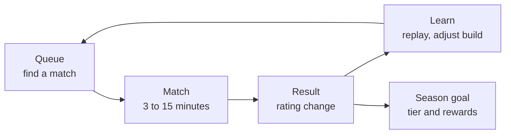
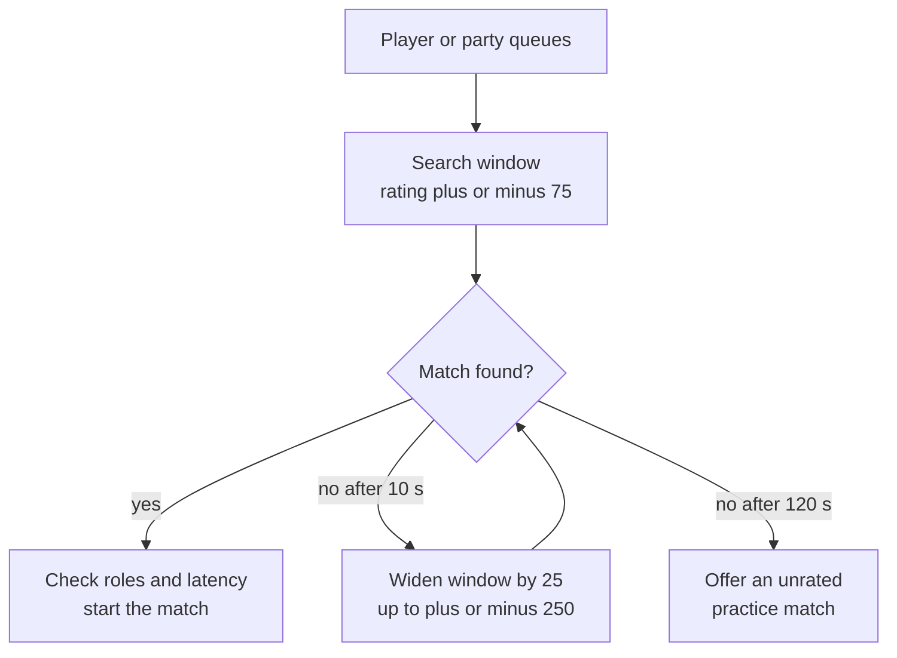

# Module 23: PvP and competitive design

- **Goal:** design a player-versus-player mode for a game that is mainly player-versus-environment: pick the mode, the matchmaking and rating, a separate balance rule set and rewards that never pull PvE players into PvP (or the reverse).
- **Prerequisites:** [06 — Controls, camera and game feel](06-controls-camera-feel.md), [08 — Combat design](08-combat.md), [10 — Skills and abilities](10-skills.md), [22 — Social systems](22-social.md).
- **Simulation:** none
- **Facts checked:** October 2026 (prices, rules and product status change; re-check before reuse)

## In short

**PvP** (player versus player) replaces scripted enemies with people. That changes everything: enemies no longer follow fixed patterns, losing is someone else's win, and one overpowered skill ruins a match instead of a boss fight. So PvP needs five things a PvE game does not: a **mode** (duel, arena, battleground, siege, open world, asynchronous), a **matchmaking and rating** system that makes matches close, a **separate balance rule set** so PvE tuning does not break PvP and the reverse, **rewards** that do not let PvP gear gate PvE, and **anti-snowball and anti-griefing** design. The worked example is the course game's single opt-in mode, the **Crucible**: 3v3, best of three rounds, normalised stats, a rating that resets softly each 12-week season, and rewards that are cosmetic and capped so that pillar 4 holds.

## 1. The concept

### 1.1 Terms

| Term | Meaning |
|---|---|
| **PvP** | Players fight players |
| **Duel** | A one-on-one fight by agreement |
| **Arena** | Small, symmetrical, short teams-versus-teams matches |
| **Battleground** | A larger objective match: capture points, carry an item, defend a base |
| **Siege or territory war** | Large groups (usually guilds) fight over a place that gives a lasting benefit |
| **Open-world PvP** | Players can attack each other in the shared world, always or in flagged zones |
| **Asynchronous PvP** | You fight another player's saved team or base while they are offline |
| **Matchmaking** | Choosing who plays whom |
| **Rating (MMR)** | A number estimating a player's skill; "match-making rating" |
| **Ladder** | A ranked list or set of tiers built from ratings |
| **Normalisation** | Setting everyone's stats to the same template so skill, not gear, decides |
| **Snowball** | An early lead that makes the next lead easier until the match is decided |
| **Griefing** | Playing to spoil others' experience rather than to win |

### 1.2 The PvP loop

PvP is a different core loop from PvE ([module 03](03-vision-pillars-loops.md)).

Its meta loop is the **rating**: "can I reach the next tier?" That is a strong pull and a strong source of frustration, which is why the rest of this module is about keeping the pull and removing the frustration.

## 2. The player's view

PvP serves **Competition**, **Challenge** and **Mastery** ([module 01](01-player-experience.md)). Competitive players want:

| Want | What delivers it |
|---|---|
| "A fair fight" | Normalised stats, a rule set tuned for PvP, close matches |
| "My skill matters" | No randomness that decides matches, readable skills (pillar 2) |
| "Progress I can see" | A rating, tiers, a season, a ladder |
| "Losing teaches me something" | Short matches, a death recap, a replay or recap screen |
| "A quick game" | Queue under a minute, matches under 10 minutes |

PvE-first players have the opposite fears: **being forced into PvP, being ganked while playing PvE, and being left behind in gear because they will not fight people**. A PvP mode inside a PvE game must make those three fears impossible.

## 3. The design space

### 3.1 PvP modes

| Mode | Team size | Match length | Needs | Good for | Cost and risk |
|---|---|---|---|---|---|
| **Duel** | 1v1 | 1–3 min | A spot, consent | Friends, showing off, practice | Class balance exposed 1v1; spam of challenges |
| **Arena** | 2v2 to 5v5 | 3–10 min | Matchmaking, rating | Competitive core; spectating | Needs a separate balance table; queue health |
| **Battleground** | 8v8 to 40v40 | 10–25 min | Objectives, many players | Casual PvP; larger teams | Weak players can hide; needs matchmaking at scale |
| **Siege or territory war** | Guild versus guild | Scheduled, 30–90 min | Guilds, a world map, owners | Long-term guild goals | Rich-get-richer; scheduling; high server load |
| **Open-world PvP** | Any | Always | A flagging system, rules | Danger, emergent stories | Griefing; loses PvE players (see 3.2) |
| **Asynchronous** | Your team vs a saved team | 1–3 min | Saved snapshots, AI | Mobile and idle games | Feels less personal; snapshot balance |

Public examples (as of October 2026): *World of Warcraft* has arenas and battlegrounds and an opt-in open-world mode; *Lineage II* made castle sieges a long-running feature; *Clash of Clans* attacks another player's saved base; *Final Fantasy XIV* has Crystalline Conflict (5v5 objective arena) and Frontline (large-scale).

### 3.2 The open-world PvP lesson

The best-known lesson is *Ultima Online*. Until 2000, the game's one world allowed player killing everywhere; reports from the time say many new players quit after being hunted. The *Renaissance* expansion (3 April 2000) added a second copy of the world, **Trammel**, with no player killing, beside the original **Felucca**. Reports say that most of the community moved to Trammel and subscriptions rose strongly afterwards. The lesson most designers take: **non-consensual PvP in the same space as PvE loses PvE players**; if it exists, make it a place players choose to enter, or a mode with a visible flag and a reward that pays for the risk (as of October 2026, per community histories).

**How to choose a mode:**

| Question | Choose |
|---|---|
| Is PvP a side feature in a PvE game? | One opt-in arena or battleground |
| Do you have strong guilds and a map? | Add siege later, not at launch |
| Is the audience mobile and short-session? | Short arena or asynchronous |
| Do players want danger in the world? | A separate, flagged zone or server rule, never the main fields |
| Do you want spectators and an esports story? | A symmetrical arena with a clean rule set |

### 3.3 Matchmaking: what it must do

A matchmaker has three jobs and they conflict:

1. **Close matches** (similar skill) for fairness.
2. **Short waits** (accept more varied skill) for speed.
3. **Good teams** (roles, parties, latency) for quality.

The standard compromise is a **search window that widens with waiting time**: start narrow, widen every few seconds, and stop widening at a limit past which the game offers an unrated match instead.

Other inputs: party size (a group of friends coordinates better than strangers and should count for more than its raw rating), connection quality, and platform.

### 3.4 Rating systems in plain words

All rating systems answer one question: *how likely is it that this player beats that one?*

| System | Idea | Used for |
|---|---|---|
| **Elo** | One number per player. Each match moves it up or down by how surprising the result was | Chess, many games; easy to explain |
| **Glicko** | Elo plus an **uncertainty** number: a new player's rating moves fast, a veteran's slowly | Games with new and returning players |
| **TrueSkill** (Microsoft) | A Bayesian model that handles teams and many players | Multiplayer matches with teams |
| **Win/loss ladder** | Points for wins, none or fewer for losses | Simple tiers; poor at matching |
| **Hidden MMR with visible tiers** | A hidden rating decides the matches; a visible rank decides the badges | Many team games |

**Elo in numbers.** A player rated 1500 meets one rated 1600. The expected score of the first is

`E = 1 / (1 + 10^((1600 − 1500) / 400)) = 1 / (1 + 10^0.25) = 1 / 2.778 = 0.36`

so the favourite wins about 64% of the time. After the match, the rating changes by `K × (result − E)`, where result is 1 for a win and 0 for a loss, and K is the **K-factor**, the maximum step. With K = 24:

- The 1500 player **wins**: 24 × (1 − 0.36) = **+15.4**.
- The 1500 player **loses**: 24 × (0 − 0.36) = **−8.6**.

An upset pays more than a win expected; a loss to a stronger opponent costs less. A higher K makes ratings move quickly (good for new players, jittery for veterans).

**Teams.** For a team match, the usual approach is to compare **team averages** and apply the same change to each member. That is simple and fair enough for small teams; TrueSkill-style models do it more carefully.

**Pitfalls.** Ratings are only meaningful if enough matches are played; a small population gives wide, slow-moving ranks. Placement matches and soft resets (below) manage this.

### 3.5 PvP balance versus PvE balance

PvE balance asks "can this class kill this boss in a reasonable time?". PvP balance asks "does any class beat the others without effort?". They are different questions with different tolerances, and a skill tuned for one often breaks the other.

| Aspect | PvE | PvP |
|---|---|---|
| **Enemy behaviour** | Scripted, telegraphed (pillar 2) | Adaptive, trying to avoid your skills |
| **Crowd control** | A short stun on an enemy is fine | Chains of stun are a "free win" (module 08) |
| **Burst damage** | Fine against a boss | Kills in under a second feel unfair |
| **Healing** | Needed | Can stall matches |
| **Tolerance for imbalance** | A class a bit weaker still clears | A weaker class is never picked |
| **Patch speed** | Slow | Fast; meta shifts quickly |

There are two approaches to avoid one breaking the other:

| Approach | How | Example (as of October 2026) | Cost |
|---|---|---|---|
| **Separate rule sets** | A PvP table of numbers that overrides skill values inside PvP, in a data file | *Final Fantasy XIV* gives each job a separate set of PvP actions, with fixed stats; equipment has no effect in PvP | Doubles the data to maintain; players must relearn |
| **Scaling and templates** | Keep the same skills but scale stats or gear for PvP | *World of Warcraft* scales PvP gear up inside PvP content (Shadowlands patch 9.1, per community reports of Blizzard's notes) | Fewer data tables; PvE changes still leak |
| **Same rules, no changes** | PvE and PvP use the same numbers | Older MMOs | Every PvE patch is a PvP patch |

**Normalisation** (everyone gets the same template) is the strongest fairness tool. It removes the "gear check" so that PvP is skill versus skill, at the cost of making PvP progress purely cosmetic or ranked.

### 3.6 Rewards, and the gear gating problem

The commonest PvP design failure is a **gear loop that couples PvP and PvE**:

- If PvP gives gear that helps in PvE, PvE players are pushed into PvP (and complain).
- If PvE gear is required to compete in PvP, PvP players are pushed into PvE and new PvP players lose to veterans because of gear, not skill.

Options:

| Reward type | Effect | Risk |
|---|---|---|
| **Cosmetics and titles** | Pride, no power | May feel empty to some; fine for a PvE-first game |
| **Separate PvP gear** | Progress inside PvP only | Gear gap; needs normalisation or templates |
| **Currency for PvP-only vendors** | A shop whose goods work only in PvP | Grinding |
| **PvE-useful items** | A strong pull for PvE players | Pushes them into PvP; must be capped (a weekly item at most) |
| **Rank rewards** | Tiers at season end | Needs fair matching |

The rule of thumb: **power from PvP stays in PvP, power from PvE stays in PvE, and shared rewards are cosmetic or capped.**

### 3.7 Griefing and anti-snowball design

| Problem | What happens | Design response |
|---|---|---|
| **Snowball** | A kill in the first minute decides the match | Short rounds; reset between rounds; comeback tools; a closing arena so stalling loses |
| **Spawn camping** | Waiting where the enemy respawns | No respawn within a round; or protected spawn zones |
| **Leaving** | A player quits when losing | A penalty ladder (queue lock), a reduced loss for the team left behind |
| **AFK or idle** | A body in the match | An idle timer that forfeits and flags |
| **Win trading** | Two accounts agree who wins | Do not match the same pair repeatedly; detect odd win patterns |
| **Smurfing and boosting** | A strong player on a new account, or a paid carry | New accounts rate fast (high K), phone-number or account-level checks, report tools |
| **Toxic chat** | Abuse at opponents | No chat with opponents at all (module 22); quick pings only |
| **Stalling** | A team hides to win on time | A soft enrage: the arena shrinks |
| **Disconnects** | A player drops | A short reconnect window and a rule for who loses |

**Anti-snowball** is a design mindset: give the losing side a chance to recover without being given the win. Cheap tools are short rounds, a full reset between rounds, and objectives that matter more than kills.

### 3.8 Seasons and ladders

A **season** is a fixed period for a ladder. At its end, players receive rewards by tier and the rating is **soft reset**: compressed toward the middle, not zeroed, so players do not spend their first weeks facing mismatched opponents.

Soft reset formula: `new = middle + (old − middle) × keep`, where `keep` is between 0 and 1 (for example 0.5). Typical season lengths are 2–4 months; the course game ties it to the 12-week season of [module 20](20-narrative.md).

A ladder has **tiers** (named bands of ratings, such as Bronze to Master in many games) and often a **top list** (the best 100 players). Tiers motivate the middle; a top list motivates the few; the risk of both is **decay and demotion**: a player who stops playing loses a rank, which pressures them to play (a retention ethics issue, module 24). A gentler option is to freeze rank during inactivity.

### 3.9 Spectating

Spectating serves learning (watch better players), community (watch a friend) and events. Options:

| Feature | Notes |
|---|---|
| **Teammate view after death** | The cheapest; keeps a player engaged while waiting |
| **Friends and guild spectate** | Needs a delay (30–120 s) to prevent stream sniping and information leaks |
| **Replay of your own match** | Learning; heavy for servers |
| **Public spectating and observer tools** | For esports; a large engineering cost |

### 3.10 How to choose, overall

| Game type | PvP shape |
|---|---|
| **PvE online RPG** (the course game) | One opt-in arena, normalised, cosmetic rewards |
| **Guild-focused MMO** | Siege or territory plus an arena |
| **Competitive-first game** | The arena is the game: ranked ladder, spectating, esports tools |
| **Mobile hero collection** | Asynchronous arena against saved teams |
| **Co-op game** | No PvP |

## 4. Tuning and pitfalls

### 4.1 Targets (rules of thumb)

| Metric | Target | Warning sign |
|---|---|---|
| **Match length** | 4–8 min | Under 2 min (a coin flip) or over 15 (too long for phones) |
| **Time to kill under focus** | 8–14 s | Under 5 s (no reaction time) or over 25 (stall) |
| **Queue time at peak** | Median under 60 s | Over 3 min |
| **Win rate per class** (in the middle tiers) | 45–55% | Any class over 55% or under 45% for two weeks |
| **Pick rate per class** | 10–30% of the roster | A class above 40% or below 5% |
| **Device parity** (win rate by input device) | Within 3 points | A device above 53% |
| **Expected win rate of favourites** | 55–65% | Over 75% (mismatches) |
| **Leaver rate** | Under 3% of matches | Over 8% |
| **PvP participation of PvE players** | Treated as opt-in; track, do not force | A PvE-only player feeling behind |

### 4.2 Signals

| Signal | Likely problem |
|---|---|
| Queue times long off-peak | Population too small for the number of tiers; merge queues or widen the window |
| Everyone plays one class | Overtuned; or the rule set has an unanswerable skill |
| Winners keep winning | Rating moves too slowly, or snowball in the rules |
| New players leave after 3 matches | They meet veterans; check placement and K |
| PvE players say PvP is mandatory | A reward is too strong; remove or cap it |
| Many reports of unfair CC chains | The DR rule is not applied in PvP |

### 4.3 Classic failures

- **PvP gear gating PvE** (and the reverse). Fixed by normalisation and cosmetic rewards.
- **No separate balance table.** Every dungeon hotfix changes PvP.
- **Rewards that outweigh play.** Players grind for the reward and hate the mode.
- **A rank that decays.** The mode becomes a job.
- **Matchmaking that waits for perfect.** Waits grow, the population shrinks, matches get worse.
- **No placement.** New players are thrown in at the median and lose, or smurfs destroy the lowest tier.
- **No answer to a skill.** If a skill can only be avoided by not being in range, it is a design bug in PvP.

## 5. Worked example

The course game: a small online fantasy RPG with one hero per player, five classes, real-time combat, parties of four and **one opt-in PvP mode**; no open-world PvP ([the fact sheet](_course-game.md)). All numbers are invented.

### 5.1 Intent

PvP is a **side track for the competitive minority**, not part of the main path. It must serve **pillar 2** ("fights you can read": every dangerous attack telegraphed), **pillar 3** ("stronger together": a team mode, played with friends), and **pillar 4** ("fair and respectful of time": a match fits a 15-minute session, and nothing earned or sold in it changes PvE power). Mira gets a ladder, Dev gets a 6-minute match, Lena never has to see it.

### 5.2 The Crucible: rules

| Rule | Value |
|---|---|
| **Mode** | The **Crucible**: 3v3, a symmetrical arena in the Foundry's old test yard |
| **Entry** | Level 20 or above (a chosen Path), via the Crucible Gate in Kindlewick; opt-in; no PvP anywhere else |
| **Teams** | A party of 1–3 queues; the matchmaker fills teams; duplicate classes allowed |
| **Round** | Last team standing wins; 5 s preparation; a round lasts at most 120 s |
| **Match** | Best of three rounds (first to two) |
| **Death** | A fallen hero stays down until the round ends and watches teammates; no ally revive in the Crucible |
| **Closing ring** | From 75 s the arena closes from 20 m to 6 m radius by 120 s; stepping outside deals 3% of max HP per second |
| **Between rounds** | Full health, full resources, all cooldowns reset |
| **Match length** | 4 minutes typical, 6 maximum |
| **Chat** | None with opponents; party chat and four pings |
| **Custom matches** | Friends and guildmates can open an unrated match with the same rules (this is the "duel") |
| **Spectating** | Dead teammates see their team; friends and guildmates can watch with a 60 s delay |

**What is not in it:** gear, potions, consumables, the Mastery trait (module 09's level-40 trait is turned off, so ten builds, not twenty, need balancing), respawns, and PvP death penalties of any kind. No gear loss, no durability, no Weakened status.

### 5.3 Normalisation and the PvP rule set

Every hero enters with the **class template**: level 50 base stats of [module 08](08-combat.md)'s class table with **no gear**, all eight skills at base values plus the player's chosen **Path** (module 09). Gear power, levels above 20 and the Mastery trait are ignored. A level-20 hero and a level-50 hero have the same stats.

A **PvP data table** overrides skill and combat values inside the Crucible only. It lives in its own file and is patched on its own schedule ([module 25](25-balancing.md) balances it).

| Rule | PvE value | Crucible value | Why |
|---|---|---|---|
| **Damage dealt to heroes** | 1.0× | **0.6×** | Gives reaction time (worked below) |
| **Crit multiplier** | Per class (1.5–2.0) | **Capped at 1.5×** | Cuts burst that decides matches in one hit |
| **Healing received** | 1.0× | **0.7×** | Stops stalls |
| **Hard CC on heroes** | Stun 2 s, root 3 s, silence 3 s | **Stun 1.0 s, root 1.5 s, silence 1.5 s** | A stun is a free win; shorter and diminishing (module 08: 100%, 50%, 25%, immune for 6 s) |
| **CC chain limit** | None | A hero cannot be hard-CC'd for more than **3 s** in any 10 s window | A guardrail on top of DR |
| **Telegraphs** | Per module 12 | Unchanged: every dangerous hit warns | Pillar 2 |
| **Dodge** | 0.35 s, 4 m, 0.25 s i-frames, 3.0 s cooldown | Unchanged | Identical on both devices |
| **Aim assist** | PC 1.5 m, touch 2.5 m snap | **2.0 m on both** | Device parity (module 06) |
| **Randomness** | Variance ±10% | **None** | A match should never turn on a roll |

**Worked example: why 0.6×.** Take the module 08 numbers: a Duelist deals 22 per 0.6 s, a Ranger 30 per 0.8 s, an Arcanist 70 per 1.75 s, using basic attacks. Their damage rates are 36.7, 37.5 and 40.0 per second, 114.2 together. Against a Ranger with 900 HP and 15 defence the ratio formula gives 100 / (100 + 15) = 0.87, so the trio deals 114.2 × 0.87 = 99.3 per second, and the Ranger lasts 900 / 99.3 = **9.1 s** with basic attacks only, about **6 s** if skills add 50% (inferred; module 25 measures it). That leaves no time to dodge or answer. At 0.6× the trio deals 59.6 per second and the Ranger lasts **15.1 s** on basics, about **10 s** with skills, inside the 8–14 s target. One Duelist alone lasts 900 / (36.7 × 0.87 × 0.6) = **47 s**, so one-on-one fights are long and a lone hero has time to run, heal or call help. Changing 0.6 to 0.5 pushes the trio's kill to about 12 s with skills; 0.8 pulls it to about 7.6 s.

**Balance targets:** each of the five classes between 45% and 55% win rate in the middle tiers; each of the ten Path builds between 40% and 60%; no class above 35% pick rate; win rate by device within 3 points. If a class is outside the band for two weeks, adjust its row in the PvP table, not its PvE skill.

### 5.4 Matchmaking

| Rule | Value |
|---|---|
| **Individual rating** | One per player, shared by all of the player's heroes and classes |
| **Team rating** | Average of members, **+50** if the team is a full trio of friends in the same party (they coordinate) |
| **Search window** | Starts at ±75; widens by 25 every 10 s; stops at ±250 (after 70 s) |
| **Fallback** | After 120 s, offer an unrated Practice match with the same rules |
| **Platform** | One queue for PC and touch |
| **Premade rule** | Full trios of friends are matched against full trios first; after 60 s of waiting they may face a mixed team (the +50 adjustment still applies) |
| **No repeat pairings** | The same opponent group cannot be matched twice in a row (win-trading guard) |
| **Target** | Median wait under 60 s at peak; matches within ±150 on average |

### 5.5 Rating, tiers and the season

The rating is Elo-style with a high K for new players.

| Rule | Value |
|---|---|
| **Start** | 1500 |
| **K-factor** | 40 for the first five matches of a season (placement), then 24 |
| **Team result** | Each member's rating changes by `K × (result − E)`, with E from the team averages |
| **Tiers** | Kindling below 1300, Ember 1300–1599, Flame 1600–1899, Blaze 1900 and up; a top list of 100 called the Pyre |
| **Soft reset** | At the start of each season: `new = 1500 + (old − 1500) × 0.5` |
| **Inactivity** | Rank is **frozen**, never decays |
| **Season** | The 12 weeks of the story season ([module 20](20-narrative.md)); the Crucible's ladder and the PvE season share dates |

**Worked example.** A team averaging 1500 meets a team averaging 1600. E = 0.36 (section 3.4). With K = 24: a win gives +15.4, a loss −8.6. In placement (K = 40): a win +25.6, a loss −14.4. A player at 1900 at the season's end restarts at 1500 + 400 × 0.5 = **1700**, still in the Flame tier. A player at 1300 restarts at **1400**.

### 5.6 Rewards (pillar 4)

| Reward | Source | Notes |
|---|---|---|
| **Crucible Marks** | Up to 12 matches per week (win or lose) | Spent on a PvP cosmetic vendor; capped at 12 matches so the grind is bounded (module 16 prices the vendor) |
| **Season rewards by tier** | Peak tier at season end | A title, a weapon glow and banner art; the Pyre gets a unique animated banner |
| **First win of the day** | One per day | A small Marks bonus; **not** a login reward, because it requires playing |
| **Losses** | Count for Marks and placement | No loss of Marks, rating only |

**Red lines.** No item earned in the Crucible raises PvE power. No PvE gear has any effect in the Crucible (normalisation). Nothing in the shop affects the Crucible beyond cosmetics ([module 17](17-monetization.md)). No decay, no demotion shaming, no daily obligation. A Dev who plays three matches a week (about 20 minutes) earns a quarter of the weekly Marks and simply reaches each cosmetic later; a Mira who plays fifty matches earns no more than the twelve-match cap. Nothing is time-gated, so no one is locked out.

### 5.7 Griefing and anti-snowball rules

| Problem | Rule |
|---|---|
| **Snowball** | Full reset between rounds; best of three; closing ring from 75 s |
| **Stalling** | The ring (3% per second outside) forces contact |
| **Leaving** | Leaving before round 1 ends voids the match (no rating change); later, the team plays on 2v3, the leaver takes the full loss and a 10-minute queue lock, the others take 50% of the loss; a 60 s reconnect window applies |
| **AFK** | 30 s without input in a round forfeits the round and warns; a second time in a match forfeits the match |
| **Win trading** | No repeat pairings; the same two accounts cannot be on opposite teams twice in a row; review of odd patterns |
| **Smurfs** | Placement at K = 40 moves new accounts fast; reports and a review of very high win rates in the first ten matches |
| **Toxicity** | No chat with opponents; the report flow of [module 22](22-social.md) applies to teammates |
| **Griefing teammates** | A teammate who deals no damage and takes no action for a round is flagged; repeated flags lead to a short queue lock |

### 5.8 What was cut

- **Open-world PvP and flagged zones.** Out of scope; the fields stay safe (pillar 4, scope).
- **Guild versus guild and sieges.** The guild is cooperative ([module 22](22-social.md)); sieges need a world map and owners and are a later decision.
- **PvP gear and a PvP stat grind.** Normalisation instead.
- **Rank decay.** A frozen rank respects time.
- **Voice chat and opponent chat.** Moderation cost and safety.
- **Public replays and observer tools.** A friend delay-view is enough for launch.
- **Duplicate-class limits.** Allowed; tracked in the data and added as a lever if one stack dominates.

### 5.9 How the design would differ for another kind of game

| Game type | What changes |
|---|---|
| **Competitive-first (esports) game** | PvP is the game: ranked ladder with visible MMR, tournaments, spectator tools, replays; no PvE reward ties |
| **Guild-focused MMO** | Add siege and territory war with scheduled windows and owner benefits; use guild versus guild rankings |
| **Mobile hero collection** | Asynchronous arena; teams as snapshots; no reaction time; balance by team power and counters |
| **Co-op action game** | No PvP; optional "versus" boards of scores instead |
| **Open-world survival game** | Open-world PvP is the premise; flags, safe zones and offline protection become the key rules |

## Key takeaways

1. A **single opt-in mode** serves a PvE-first game; open-world PvP in shared fields drives PvE players away, as *Ultima Online*'s Trammel split showed.
2. **Matchmaking** trades fairness against wait time: use a search window that widens, and offer an unrated match rather than a bad one.
3. **Elo in one line:** `change = K × (result − expected)`. Uncertainty (Glicko), teams (TrueSkill) and high K for new players are the usual refinements.
4. **PvP needs its own rule set**: a separate data table for damage, healing, crowd control and crit, so a dungeon patch never changes the arena and the reverse.
5. **Normalise stats** and keep power earned in PvP out of PvE: cosmetic and capped rewards stop gear from gating either side.
6. Design out the snowball and the grief: short rounds, resets, a closing arena, leave penalties and no opponent chat.
7. **Respect time**: soft resets, frozen ranks, capped weekly rewards and matches that fit a short session.

## Further reading

- Elo rating system (formula and K-factor): https://en.wikipedia.org/wiki/Elo_rating_system
- Mark Glickman, "The Glicko system": http://www.glicko.net/glicko/glicko.pdf
- Microsoft Research, TrueSkill ranking system: https://www.microsoft.com/en-us/research/project/trueskill-ranking-system/
- Ultima Online: Renaissance (the Trammel and Felucca split), UO Codex: https://wiki.ultimacodex.com/wiki/Ultima_Online:_Renaissance
- Final Fantasy XIV community wiki, PvP (separate PvP actions, equalised stats): https://ffxiv.consolegameswiki.com/wiki/PvP_(Ranked)
- Wowhead, Blizzard on PvP item levels in patch 9.1: https://www.wowhead.com/news=321857/blizzard-on-pvp-item-levels-in-patch-9-1-pvp-items-have-13-item-levels-in-pvp
- Game Developer, "GDC: Riot experimentally investigates online toxicity" (design fixes for behaviour in a competitive game): https://www.gamedeveloper.com/design/gdc-riot-experimentally-investigates-online-toxicity
