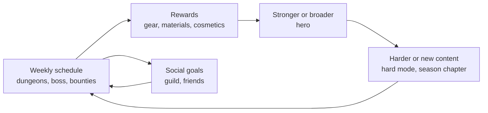

# Module 24: Endgame and retention

- **Goal:** design what players do after the leveling path ends (the endgame), keep them coming back without manipulating them, and measure whether it works.
- **Prerequisites:** [03 — Vision, pillars and loops](03-vision-pillars-loops.md), [12 — Enemies, bosses and encounters](12-enemies-encounters.md), [14 — Progression and power curves](14-progression.md), [19 — Quest and mission design](19-quests.md), [20 — Narrative design for a live game](20-narrative.md), [22 — Social systems](22-social.md).
- **Simulation:** none
- **Facts checked:** October 2026 (prices, rules and product status change; re-check before reuse)

## In short

The **endgame** is everything a player does at the maximum level: it is where an online RPG spends most of its life. It splits into **vertical** goals (stronger gear, harder bosses) and **horizontal** goals (collections, cosmetics, mastery, new builds). A weekly rhythm of **dailies, weeklies and lockouts** gives the endgame a shape, **raids and hard modes** give the best players a challenge, **seasons** give the live game a calendar, and **catch-up rules** keep returning players in the game. **Retention metrics** (D1, D7, D30, churn) show whether the loop works, but they can also tempt designers into manipulation: streaks, login rewards and false urgency raise the numbers while damaging trust. The worked example designs the course game's level-50 endgame: a weekly schedule of featured dungeons, the Ash Tide twice a week, board bounties and season chapters, with hours per week for Mira and Dev and a set of catch-up rules that never punish a missed day.

## 1. The concept

### 1.1 Terms

| Term | Meaning |
|---|---|
| **Endgame** | Content and goals available at the maximum level |
| **Vertical progression** | Becoming stronger: higher gear tiers, more power |
| **Horizontal progression** | Becoming broader: more options, looks, collections, builds, without more power |
| **Daily and weekly** | Tasks that reset every day or week |
| **Lockout** | A limit on how often a reward can be earned (for example once a week per boss) |
| **Reset** | The moment the limits refresh |
| **Raid** | Large-group content (often 8–40 players) with several bosses and a lockout |
| **Hard mode** | A harder version of existing content with better rewards |
| **Season** | A fixed period (for example 12 weeks) with its own goals, story and rewards |
| **Catch-up** | Rules that let late or returning players reach the same point faster |
| **Collection** | A list of things to gather (cosmetics, emotes, lore) with no power |
| **Retention** | The share of players who come back after N days |
| **Churn** | The share of players who stop playing in a period |
| **FOMO** | Fear of missing out: the pressure to play now so as not to lose something |

### 1.2 What the endgame loop looks like

At the maximum level the course's three loops ([module 03](03-vision-pillars-loops.md)) keep their shape, but the **meta loop** becomes the whole game.

A healthy endgame answers three questions: **what do I do this week, why does it matter, and when am I done?** The third question is the one designers forget. A schedule with no visible end turns into a second job.

## 2. The player's view

Endgame players come in two broad groups, and the design must serve both.

| Group | Wants | Fears |
|---|---|---|
| **Achievers and competitors** | The hardest content, the best gear, to be among the first | Falling behind; content that is too easy |
| **Social and relaxed players** | Time with friends, goals that fit a busy week | Being forced to grind; being left out |
| **Collectors and explorers** | Cosmetics, lore, completion | Missable items; random drops |
| **Returning players** | A way back in | A wall of missed content or a mountain of catch-up work |

The motivations of [module 01](01-player-experience.md) at work: **Completion** (collection logs, checklists), **Power** (gear), **Challenge** (hard modes), **Community** (guilds, boss nights), and **Fantasy and Story** (season chapters).

The key emotions to protect: **"I know what to do this week"**, **"I can finish my list in an evening"**, **"my break did not cost me"** and **"the hardest content is truly hard, and I earned the reward".**

## 3. The design space

### 3.1 Vertical versus horizontal endgame

| Model | What drives play | Public example (as of October 2026) | Strength | Risk |
|---|---|---|---|---|
| **Gear treadmill** | New tiers of gear every few months; each makes the last obsolete | *World of Warcraft* adds new gear levels with each season and expansion | A clear reason to run content; easy to measure | Rewards from earlier content lose value; players feel behind; a returning player faces a gap |
| **Flat gear, wide goals** | A fixed top gear tier; growth through unlocks and collections | *Guild Wars 2* has a fixed top gear tier and grows through unlocks and cosmetics (per the game's wiki) | Content never goes stale; easy to return | Needs endless new goals; "nothing to chase" feeling |
| **Resetting seasons** | Everyone restarts in a new season or league | *Path of Exile* temporary leagues of about 3–4 months start fresh characters, with a permanent league for old ones | Fresh start for all; strong community moments | Resets throw away investment; needs a permanent option |
| **Mixed** | A short gear ladder that stops, plus horizontal goals | Most long-running RPGs | A path for the climbers and a long run for the rest | Needs both designs |

Module 14 covers the power curves. The endgame's role is to decide **what is repeated and what is permanent**. A good rule: **repeat access, not power.** Let players re-run content that keeps its meaning (cosmetic rewards, materials, collections), and make power a one-way climb with an end.

### 3.2 Dailies, weeklies and lockouts

| Tool | Purpose | Good form | Risk |
|---|---|---|---|
| **Daily tasks** | A small reason to log in and a habit | Short, a small list, rewards that are not power | Becomes a chore; punishes a missed day |
| **Weekly tasks** | A rhythm that tolerates missed days | A list that fits one or two evenings | Needs a reset time that suits most regions |
| **Lockouts** | Cap the reward rate so no one out-grinds the schedule | One chest per boss per week | Players feel the rewards are rationed |
| **Weekly chest or vault** | A single reward that grows with how much you did | *World of Warcraft*'s Great Vault offers one item per week, with up to nine choices from raid, dungeon and world activities (as of October 2026) | A cap that still feels generous if the choices are good |
| **Currency caps** | A weekly cap on a bound token | *Final Fantasy XIV* caps the newest weekly token (module 16) | Players feel "capped out" |

**Reasoning.** Lockouts exist because **designers can only keep a game in balance if they know how fast players gain power.** A cap is a promise that nobody out-earns a ceiling. The player-friendly versions of the cap let a player **choose** what to do (the weekly chest picks from activities) and never **lose** progress for a missed day.

**Dailies as a design smell.** World of Warcraft capped daily quests at 10 when introduced, raised the cap to 25 and later removed it (module 19), which shows the pressure: the more dailies available, the more it feels like work. A small, fixed list, with rewards that **bank**, avoids the problem.

### 3.3 Raids and hard modes

| Type | Players | Time | Reward | Notes |
|---|---|---|---|---|
| **Dungeon hard mode** | 4 | 20–30 min | Better loot, a title | Re-uses assets; cheap to make; easy to match to the group finder |
| **Raid** | 8–40 | 1–3 h per session | Best loot; progress over weeks | Many bosses; needs scheduling; high cost per hour of content |
| **Difficulty ladder** | Same raid, several levels | Per level | Higher level, better loot | *World of Warcraft* has Raid Finder, Normal, Heroic and Mythic difficulties (as of October 2026); easy tiers let more players see the story |
| **World boss** | 10–40 | 10–20 min | Shared; no lockout in the fight itself | Social peak; low skill floor |
| **Ultimate or challenge** | A set team | Many attempts | Cosmetics, bragging rights | The skill peak; no power |

The **difficulty ladder** is the most important idea: let **more players see the content** at an easy level, and reserve the hard levels for those who want them. The cost is that every level needs tuning.

**Hard-mode rules of thumb.**

- **Reward more, not too much more.** A hard mode that pays twice as much for three times the effort is a hard mode nobody runs.
- **Hard means more mechanics, not just bigger numbers.** A boss with 3× the health is longer, not harder.
- **A way in.** Hard mode should have a clear entry (an item level or a feat requirement), so groups do not waste each other's time.
- **A cosmetic goal for the skill peak.** "Clear without a death" gives the best players a prize that does not add power.

### 3.4 Seasons and resets

| Element | Typical | Notes |
|---|---|---|
| **Length** | 8–16 weeks | The course game's 12 weeks follows [module 20](20-narrative.md) |
| **What resets** | Season goals, a ranked ladder (softly), the season track | The choice that matters |
| **What does not reset** | Level, gear, collections, story | A reset of power punishes loyalty |
| **Season pass** | A track of rewards over the season | Module 17 covers monetization and fairness |
| **Season end** | A finale event and a short break | Players need a rest as much as a goal |
| **New-season start** | A recap, a few days of new content | Returning players enter here |

A **season is a calendar, not a treadmill.** It tells players when something new will come and gives a reason to log in this week. The danger is a season that **removes** things: seasonal items that vanish create FOMO (section 3.8). Make seasonal rewards **return** later.

### 3.5 Collections, achievements and mastery

These are horizontal goals: they add reasons to play without adding power.

| Type | What | Design points |
|---|---|---|
| **Collection** | Cosmetics, emotes, titles, lore notes | Shown as a book with empty slots; hints for how to get each |
| **Bestiary** | Kill or inspect every enemy type once | Teaches the world; low effort |
| **Achievement** | A named feat with a point score | Mix of easy, skilled, and discovery; avoid pure grind ("kill 100,000") |
| **Mastery** | Per-class challenges: no-hit boss, a solo elite | Skill goals; cosmetic reward |
| **Account-wide vs per-hero** | Collections shared across the account | Fits a second character and reduces repeat work |

Rules of thumb: show **progress** (12 of 40) and not just a total; avoid **missable** entries or give them a second chance; keep **random drop collections** to a minimum (players feel the luck, not the skill); allow **partial credit** so a player is always close to something.

### 3.6 Catch-up

| Mechanism | How it works | Notes |
|---|---|---|
| **Banked dailies** | Unclaimed days store up to a limit | Removes streak pressure |
| **Rolling windows** | Weekly objectives remain claimable for a few weeks | Good for seasons |
| **Rested bonus** | A bonus that builds while you are away | *World of Warcraft* has a rested experience bonus (as of October 2026) |
| **Gear catch-up** | Last tier's gear sold for a bound token | Fast path to the current tier |
| **Bonus weeks** | Returning or new players earn faster for a while | Easy to explain; can feel like a penalty to those who stayed |
| **Level and content skips** | A quick route to the endgame | Costs the story; use a recap (module 20) |

The principle: **catch-up should shorten the road, never change the destination.** A returning player ends up with the same gear as a regular one, just sooner.

### 3.7 Retention metrics

**Retention** is measured by **cohort**: a group of players who started on the same day. **Day N retention** is the share of that cohort who play again on day N.

| Metric | Meaning | What it tells you |
|---|---|---|
| **D1** | Returned the next day | The first session and the first hour (module 26) |
| **D7** | Returned on day 7 | Whether the first week's loop works |
| **D30** | Returned on day 30 | Whether the endgame and the social layer hold |
| **Week N retention** | Active in week N | A better fit for weekly games |
| **Churn** | Active last period, not active this one | The mirror of retention; "monthly churn 30%" means three in ten left |
| **DAU/MAU (stickiness)** | Daily active players divided by monthly | How often the monthly players come |
| **Session length and count** | Time per play and plays per day | Fit to the persona |
| **Time to first group, first guild** | Minutes or days | Social onboarding |
| **Return rate after a season** | Lapsed players who return at a new season | The health of the live calendar |

**Worked example.** A cohort of 10,000 new players. On day 1, 3,800 play again: **D1 = 38%**. On day 7, 1,300: **D7 = 13%**. On day 30, 480: **D30 = 4.8%**. In the same month 20,000 players were active in September and 14,000 of them were active in October: **monthly churn = (20,000 − 14,000) / 20,000 = 30%**. With 6,000 daily actives and 20,000 monthly, stickiness = 6,000 / 20,000 = **30%**.

**Benchmarks** (as of October 2026). GameAnalytics' 2026 report on mobile games (16,262 titles with at least 1,000 monthly users) shows a median D7 just under 4% and a median D30 of 0.69–0.79%; the top quarter has D1 just above 30%, D7 of 6–7% and D30 of 1.6–1.8%; the top 10% has D1 of 40%, D7 of 11–12% and D30 of about 4%. These are for mobile games in general; a shared-account RPG, a PC game or an older game will differ, so use them as a sanity check, not a target.

**Pitfalls in reading metrics.**

- **A single number hides segments.** Look at D7 by class, platform, source and level.
- **Correlation is not cause.** Players in guilds retain better, but players who like company join guilds. Test with an experiment.
- **Averages mislead.** A few heavy players raise the average session; use medians and percentiles.
- **Retention can be bought.** A login reward raises D7 for a while and cost trust and play quality.

### 3.8 Ethics of retention

Retention features sit on a line between **a good reason to return** and **a hook that exploits**.

| Technique | Healthy form | Manipulative form |
|---|---|---|
| **Daily reward** | A small reward for playing a bounty | A chest for logging in, with a bigger one for a streak |
| **Streaks** | A free bonus for regular play with grace days | Resetting a long streak on one missed day |
| **Limited-time events** | A seasonal event that returns later | Unique power or items that never return |
| **Notifications** | One opt-in message for an event you chose | Frequent pushes designed to pull you back |
| **Scarcity** | A real cap with a reason | A countdown that resets or false urgency |
| **Sunk cost** | "Your progress is safe" | "Don't lose your 120-day streak" |
| **Social obligation** | A guild goal that scales to active members | Public shaming of members who did not contribute |

Research in psychology describes **fear of missing out** and links it to lower mood and life satisfaction in surveys (Przybylski and others, 2013). The US Federal Trade Commission's 2022 report "Bringing Dark Patterns to Light" lists manipulative designs that the agency treats as deceptive, including manufactured urgency. Neither is a ban on events or dailies; both are reasons to keep a **guardrail**.

**Practical guardrails.**

1. No reward for logging in; reward **doing**.
2. No streak that **resets**; use banked days and caps instead.
3. Any limited-time reward must **return** later, or be cosmetic only.
4. **Never sell power**, and never make a purchase the only way to keep pace with a schedule (module 17).
5. Watch an **ethics metric**: the share of endgame players who finish every daily for 7 days in a row. If most players do, the dailies are mandatory in practice.

### 3.9 Respecting time

Every endgame system has a **time cost**. State it, and design to it.

| Rule of thumb | Meaning |
|---|---|
| **A weekly list that fits 3–5 hours** | A player with an evening or two can finish it; more is optional |
| **Every task fits a session** | A 15-minute session always gives a visible reward (pillar 4) |
| **No time-gated catch-up that is longer than the schedule** | A returning player is current within two weeks |
| **No schedule that needs a precise hour** | Offer two time slots in different regions, or a recording |
| **A visible end** | The weekly list shows "done"; stop is a valid state |
| **A rest week** | The finale of a season is followed by a lighter week |

### 3.10 How to choose

| Question | If yes | If no |
|---|---|---|
| Is the game live for years with a small team? | A short gear ladder plus wide horizontal goals | A treadmill is affordable if content is plentiful |
| Do you have strong raiders? | A difficulty ladder and a raid | Dungeon hard modes and a world boss |
| Are players mostly on mobile? | Short dailies, banked, a weekly cap, a recap | A longer schedule is acceptable |
| Do players leave between seasons? | A recap, catch-up, a permanent area | A season can be shorter |
| Is the community young or sensitive to pressure? | No streaks, no limited power, strict notifications | Standard guardrails |

## 4. Tuning and pitfalls

### 4.1 Targets (rules of thumb)

| Metric | Target | Warning sign |
|---|---|---|
| **Weekly core track** | 3–5 hours | Over 8 hours to stay current |
| **Share of endgame players who finish all 7 dailies in a row** | Under 30% | Over 50% (mandatory in practice) |
| **Time to current gear tier for a new level-50 hero** | 2 weeks | Over 6 weeks |
| **Returning player (14 days or more away)** | Fully current in 2 weeks | Quit again in the first week |
| **Share of level-50 players active in a given week** | 60–70% | Under 40% |
| **Return rate at a new season** | 40% of lapsed players | Under 15% |
| **Week-1 reward visible in a 15-minute session** | 100% | Any session with nothing |
| **Guild goal completed (tier 1)** | 70% of active guilds | Under 40% |

### 4.2 Signals

| Signal | Likely problem |
|---|---|
| Players post "I'm burnt out" at week 6 | The schedule is a job; reduce or bank |
| Players log in only for the reward and log out | Login rewards; replace with play rewards |
| New level-50 players say they cannot find groups | The endgame is too fragmented; merge queues or add a featured activity |
| Top players clear the season in two weeks | The season is too short or the content too easy; add a hard mode |
| Returning players quit again within a week | Catch-up is too slow or the recap is missing |
| Everyone does the same dungeon | Rewards are not balanced across featured content |
| Players demand "more content" while the old content is empty | The rewards of old content are too low; add scaling |

### 4.3 Classic failures

- **The treadmill without a rest.** A new gear tier every six weeks makes the last tier worthless and the schedule a chore.
- **Content gated by luck.** A rare drop required for progress is a grind.
- **Mandatory dailies.** A reward so big that skipping it is a loss.
- **The dead catch-up.** Last tier's gear is so cheap that new gear loses value, or so expensive that no one can catch up.
- **The one-way reset.** A season that deletes progress.
- **The FOMO cliff.** A season item that vanishes and was the only way to get something.
- **The empty endgame.** The level path ends, and there is nothing to do but wait.

## 5. Worked example

The course game: a small online fantasy RPG, levels 1–50 in about 25 hours, four regions, ten dungeons and one world boss ([the fact sheet](_course-game.md)). All numbers are invented. The endgame has to serve **pillar 3** ("Stronger together": groups earn more per hour; solo is never blocked) and **pillar 4** ("fair and respectful of time": a 15-minute session always gives a visible reward; nothing sold gives combat power players cannot earn).

### 5.1 Intent

At level 50 the player gets a **weekly rhythm** that Mira can finish in about four hours, that Dev can mostly follow in about two and a third, and that Lena can ignore without loss. It has an end ("this week's list is done"), a calendar (the 12-week season) and horizontal goals for everyone who wants more. Gear power, the level curve and the shop are other modules' work: [module 14](14-progression.md) sets the ladder, [module 15](15-items-loot.md) the tiers, [module 16](16-economy.md) the currencies and [module 17](17-monetization.md) the shop. This module only **schedules access**.

### 5.2 The weekly schedule

The week resets **Monday at 04:00** in the server's region. All times are in region time and shown in the player's local time.

| When | What | Group | Time |
|---|---|---|---|
| **Daily** | **Board bounties**: three at the hub board of Highwatch, about 5 minutes each | Solo or party | 15 min |
| **Weekly (Monday reset)** | **Three featured dungeons** in **Ember mode** (the hard mode), chosen from the ten dungeons; one is always from the newest region | Party of 4 | 25 min each, including the queue |
| **Wednesday 20:00** | **Ash Tide**: the world boss (module 12), announced 30 minutes ahead | Up to 40 per layer | About 30 min |
| **Sunday 14:00** | **Ash Tide**, second event of the week, in an afternoon slot for phone players | Up to 40 per layer | About 30 min |
| **Weeks 1, 5 and 9** | A **season chapter**: about 40 minutes of story quests | Solo | 40 min each |
| **Week 12** | The **season finale**: a shared event with the season's boss | Open | About 1 hour |
| **Always** | The **Crucible** (module 23), the **Wayfarer's Ledger** (collections), **guild goals** (module 22) | Any | Optional |

**Ember mode.** Any of the ten dungeons can be run at level 50 with the Ember modifier: enemy health ×1.5 and damage ×1.25 on top of the party scaling of [module 11](11-party-roster.md), plus one added mechanic per boss. A clean run takes about 20 minutes. It pays the current tier's reward.

**Lockout.** The **Ember chest** of each featured dungeon opens **once per week**. More clears the same week give the normal boss chest of module 11 (personal loot, no lockout) and the usual XP, so players may keep running a dungeon for fun, practice or a friend, but not for more weekly power.

### 5.3 The Weekly Chest

Clearing featured dungeons in Ember mode fills the **Weekly Chest** at the Lodge Hall of Kindlewick or Highwatch.

| Featured dungeons cleared | Slots open | What the player gets |
|---|---|---|
| 0 | 0 | Nothing |
| 1 | 1 | **One item** from the single slot |
| 2 | 2 | **One item**, chosen from two |
| 3 | 3 | **One item**, chosen from three |

Each slot shows one piece of the current tier (or, as an alternative, crafting materials); the player takes **one**. The weekly chest also pays the bound token of module 16. The rule is simple: **more clears give more choice, not more items.** A player who clears three dungeons picks the piece that fits best, but the weekly power gain is capped at one piece for everyone. This keeps the pace of power controlled (the purpose of a lockout) and the reward generous for the group.

The Ash Tide has **its own personal rewards** from the boss's chest (module 12) for each event, so the two events are two chances, not a lockout on one.

### 5.4 Hours per week

Two personas, from [module 01](01-player-experience.md).

**Mira** plays five evenings of about 1.5 hours: **7.5 hours** a week.

| Activity | Count | Minutes | Notes |
|---|---|---|---|
| Board bounties | 5 days | 75 | Banked if she skips (5.6) |
| Ember dungeons | 3 | 75 | With a group from the finder or her guild |
| Ash Tide | 2 | 60 | Wednesday and Sunday |
| Season chapter | 1 in 4 weeks | 10 average | 40 min per chapter |
| **Core track** | | **220 min = 3.7 h** | Everything the weekly lockouts allow |
| Crucible (optional) | 6 matches | 40 | About 6 minutes each |
| **With PvP** | | **260 min = 4.3 h** | |
| Free choice | | About 3.2 h | Normal runs for gear upgrades, Ember feats, collections, helping guildmates, a second class |

**Dev** plays six days of about 25 minutes: **2.6 hours** a week.

| Activity | Count | Minutes | Notes |
|---|---|---|---|
| Board bounties | 6 days | 90 | One day missed; the bounties bank |
| Ember dungeon | 1 | 25 | A party from the one-tap fill |
| Ash Tide | 1 (Sunday afternoon) | 30 | The phone slot |
| Season chapter | 1 in 4 weeks | 10 average | |
| **Core track** | | **155 min = 2.6 h** | |

Dev's week gives him **1 weekly chest slot, one of the two Ash Tide chests, six bounty days and the season chapter**; Mira gets three slots and both chests. In the guild goal of [module 22](22-social.md), Mira adds her cap of 60 Kindling and Dev adds about 30 (10 + 10 + 6 × 2 = 32). Dev's total reward is smaller, but he is **not locked out** of anything, and his weekly power gain (one item from the chest) is the **same size** as Mira's. Mira's extra hours buy her choice, extra chances at the Ash Tide's personal chest, social time and the free-choice goals.

The target for the design is a **core track of about four hours at most**: if play-testers say the list takes longer than that, content is cut or the cap moves, not the players' evenings.

### 5.5 Season structure

A season is **12 weeks** ([module 20](20-narrative.md)).

| Weeks | What happens |
|---|---|
| **1** | Chapter 1 (story quests); new season objectives; the Ash Tide **mutation** for the season starts; the PvP rating soft-resets (module 23) |
| **2–4** | Weekly cycle; chapter 1 quests playable |
| **5** | Chapter 2 |
| **6–8** | Weekly cycle; a mid-season community goal (the whole server fills a bar by doing the weekly list) |
| **9** | Chapter 3 |
| **10–11** | Weekly cycle |
| **12** | Finale event, the season boss, and a lighter week: no new weekly objectives |

What **resets** each season: the season objectives, the season track (module 17), the PvP rating (softly) and the Ash Tide mutation. What **never resets**: level, gear, the Ledger, story progress, and the guild's hall and decorations. **Seasons do not reset power.**

**Season objectives.** Each week the Season Journal shows six objectives (for example "clear one Ember dungeon", "kill the Ash Tide twice", "finish five bounty days"). They are **claimable for three weeks** after they appear (the rolling window of section 5.6). The season track's rewards and price belong to [module 17](17-monetization.md), with the design target that **Dev completes the free track in a season at 2.6 hours a week, and Mira finishes the whole pass in about 9.4 weeks (module 17).**

### 5.6 Catch-up rules

| Rule | Value | Why |
|---|---|---|
| **Banked bounties** | Unclaimed days bank up to 3 days (9 bounties) | No streak; a missed day costs nothing |
| **Rolling season window** | Weekly objectives stay claimable for 3 weeks | A holiday does not close the pass |
| **Returning Wayfarer** | After 14 days or more away, the first week back opens **all three chest slots** after one Ember clear, and a 90-second "Previously" recap plays | Fast re-entry (module 20) |
| **Gear catch-up** | Last tier's gear for the bound token of module 16 | A new level-50 hero reaches entry gear in about two weeks |
| **Entry at level 50** | A season recap quest brings a new player to the season's start (module 20) | New players join the current story |
| **Seasonal cosmetics return** | Cosmetics earned in a season return through the Lodge Archive two seasons later | No cliff (see 5.8) |
| **No limited-time power** | Only cosmetics are time-limited | Pillar 4 |

### 5.7 Collections and mastery: the Wayfarer's Ledger

The **Ledger** is an account-wide book that holds all horizontal goals. It gives every player something to do at the end of a weekly list, and it feeds the emotes and titles of [module 22](22-social.md).

| Section | What it holds | Launch size (invented) |
|---|---|---|
| **Looks** | Armour looks and weapon glows | 80 |
| **Emotes** | The 10 emotes unlocked by play | 10 |
| **Codex** | Kael's notes and lore entries ([module 20](20-narrative.md)) | 40 |
| **Bestiary** | One entry per enemy type, filled by defeating it | 60 |
| **Feats** | Achievements: skill, discovery, group | 50 |
| **Mastery** | Per-class challenges, such as clearing an Ember dungeon without a death, or a solo elite | 10 per class |

Rules: every entry shows a **hint**; there are **no missable entries** (seasonal entries return); feats mix easy, skilled and discovery goals, with no grind above a few hundred repeats; and the Ledger gives **no power**, only looks, titles and pride.

### 5.8 Retention targets and guardrails

**Live targets** after launch (invented, set against the benchmark in section 3.7; they are **top-decile** marks, so treat them as ambitions). They are not the closed-beta gates of [module 28](28-prototype-playtest.md): a beta cohort is small and self-selected, so the beta must clear its own gates before launch, and these targets then judge the live game:

| Metric | Target |
|---|---|
| D1 | 40% |
| D7 | 12% |
| D30 | 4% |
| Level-50 players active in a given week | 60–70% |
| Return rate at a new season | 40% of lapsed players |
| Time to first group | Under 2 minutes (module 11) |

**Guardrails** (to check next to the targets):

| Guardrail | Limit | If broken |
|---|---|---|
| Endgame players who complete all 7 daily days in a row | Under 30% | Reduce the daily rewards or the banking limit |
| Hours per week of the top 10% | Under 12 | The schedule is a job; add a cap |
| Players who log in and log out within 2 minutes | Under 5% | A login-only reward exists somewhere; remove it |
| Push notifications | At most one per event, opt-in | Cut |

### 5.9 What was cut

- **Daily login rewards** and **streaks**: rejected in [module 03](03-vision-pillars-loops.md); bounties pay for play instead.
- **A raid at launch**: the Ash Tide is the one large-group event; a 12-player raid is a candidate for season 2.
- **PvE leaderboards and damage rankings** (they contradict the story's theme of module 20).
- **A gear reset each season.**
- **Limited-time power** and any item sold for combat power.
- **Rank decay** in PvP (module 23).
- **Mandatory guild attendance** (module 22).

### 5.10 How the design would differ for another kind of game

| Game type | What changes |
|---|---|
| **Gear-driven action RPG** | A seasonal treadmill with resets; leagues; build experiments are the horizontal layer |
| **Raid-focused MMO** | A raid tier every few months with difficulty ladders and lockouts; the weekly vault is the core |
| **Mobile idle or hero collection** | Daily and offline rewards are central; ethics guardrails matter more; shorter seasons |
| **Competitive game** | The ranked season is the endgame; no PvE schedule |
| **Co-op or story game** | A short post-game and downloadable chapters; no weekly schedule |

## Key takeaways

1. The endgame answers three questions: **what do I do this week, why does it matter, and when am I done?**
2. **Repeat access, not power**: a short gear ladder that ends, plus horizontal goals (collections, mastery, cosmetics) that keep the long run fresh.
3. **Lockouts keep balance, choice keeps them generous**: cap how much power a week can give, and let players choose what to do.
4. **Seasons are a calendar**, not a reset of power; everything seasonal should return later.
5. **Catch-up shortens the road, never changes the destination**: banked days, rolling windows, last tier's gear for tokens, a recap.
6. Read **D1, D7, D30 and churn** by cohort and segment, treat benchmarks as sanity checks, and remember that retention can be bought with tricks that cost trust.
7. **Respect time**: a weekly list that fits about four hours, no login rewards, no resetting streaks, no limited-time power, and a guardrail that tells you when dailies have become mandatory.

## Further reading

- GameAnalytics, mobile and PC game benchmarks 2026 (retention by percentile): https://gamedevreports.substack.com/p/gameanalytics-mobile-and-pc-game
- Przybylski, Murayama, DeHaan and Gladwell, "Motivational, emotional, and behavioral correlates of fear of missing out" (2013): https://centaur.reading.ac.uk/34846/
- US Federal Trade Commission, "Bringing Dark Patterns to Light" (September 2022): https://www.ftc.gov/reports/bringing-dark-patterns-light
- Warcraft wiki, Great Vault (a weekly choose-one reward): https://warcraft.wiki.gg/wiki/Great_Vault
- Warcraft wiki, Raid Finder (the difficulty ladder): https://warcraft.wiki.gg/wiki/Raid_finder
- Path of Exile wiki, League (temporary leagues and the permanent league): https://pathofexile.fandom.com/wiki/League
- Guild Wars 2 wiki, Ascended and Legendary equipment (a fixed top gear tier): https://wiki.guildwars2.com/wiki/Ascended_equipment
