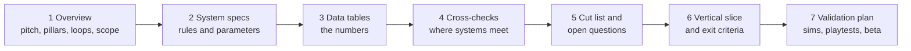
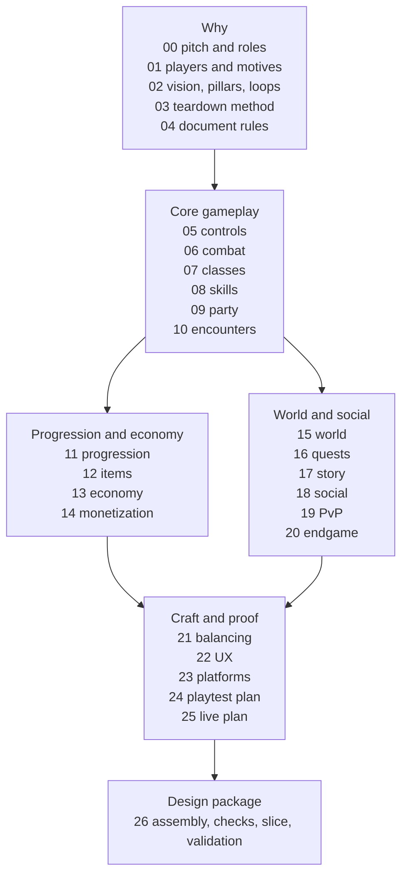

# Module 26: Capstone: the design package

- **Goal:** assemble the parts of a design into one consistent package that producers, engineers, artists, QA and a live team can each use, and check that the numbers of different systems agree before anyone builds.
- **Prerequisites:** every earlier module; in particular [04 — Design documents that stay alive](04-design-documents.md) and [02 — Vision, pillars and loops](02-vision-pillars-loops.md).
- **Simulation:** none
- **Facts checked:** October 2026 (prices, rules and product status change; re-check before reuse)

## In short
A **design package** is the complete, indexed set of documents that says what a game is, how every system works, which numbers belong to whom, what was cut, and how the design will be proved. Its value is not volume but **consistency**: every fact lives in one place, every number has one owner, and the places where systems meet are checked on purpose. This module assembles the course game's package from modules 00 to 25: a one-page overview, a document map, twenty system summaries, a number-ownership table, eight cross-checks (all pass after five conflicts found by the first pass were ruled on and logged), the cut list, the vertical slice and the validation plan. The conflicts found are kept in a reconciliation log because finding them is what the exercise is for.

## 1. The concept

### 1.1 What a design package is
A design package is the **whole set** of design documents for a game at one moment, plus the index and rules that keep them together. Module 04 described the individual documents. The package is the next level up: the map between them, the shared fact sheet, and the evidence that the parts fit.

A package is **not** one big file. It is a short overview that links to specs, data tables, decision records and test plans. If a publisher asks for one "game design document", generate it from the pieces (module 04).

### 1.2 Who reads it
Each reader opens a different part first.

| Reader | Opens first | Needs from the package |
|---|---|---|
| **Producer** | Overview, scope, cut list, vertical slice | Size, dependencies, what is out, exit criteria |
| **Engineers** | System specs, data schemas, number ownership | Exact rules, edge cases, which file holds each number |
| **Artists and animators** | Controls, combat, encounters, UX | State lists, telegraph rules, readability constraints |
| **QA** | Specs with test cases, validation plan | Expected values for every rule |
| **Live team** | Live plan, balancing, economy, monetization | Tunable numbers and their safe ranges |
| **Investors and partners** | Overview, pillars, business model, roadmap | The pitch, the risks, the plan to prove them |

### 1.3 The parts and their order
Write and read the package from why to how, then to proof.

| Part | Question it answers | Typical owner |
|---|---|---|
| **Overview** | What is this, for whom, and how big? | Lead designer |
| **System specs** | How exactly does each system work? | System owners |
| **Data tables** | What are the numbers? | Balance designer |
| **Cross-checks** | Do two systems promise the same thing? | Lead designer with the balance designer |
| **Cut list and open questions** | What did we decide against, and what is unresolved? | Lead designer |
| **Vertical slice** | What is the smallest playable proof? | Producer and lead designer |
| **Validation plan** | How will we know the design works? | Design and production |

## 2. The player's view
Players never read the package, but they meet its mistakes. A death rule that differs between a dungeon and a world boss, or a reward promised in one document and priced in another, reaches the player as a game that feels arbitrary.

The package therefore has to guarantee one telegraph rule that art, combat and encounter documents all quote (pillar 2), class numbers in one table balanced by one method (pillar 1), party scaling and reward rates that match the pillar 3 test, and a shop with written red lines plus a schedule whose hours add up (pillar 4).

The test of a good package is the same as in module 04: **every player-facing rule exists in exactly one place, in plain words, with a number.**

## 3. The design space

### 3.1 How teams keep a package
| Approach | Strength | Weakness | Fits |
|---|---|---|---|
| **One long document** | Easy to start | Rots, cannot be searched, many editors collide | Small prototypes, publisher submissions |
| **Index plus linked specs in a repository** | Reviewed, versioned, changes ride with the build | Needs basic tooling | Small and mid-sized teams |
| **Wiki with an owner per page** | Easy to edit and share | Weak history, drifts silently | Large teams with a documentation owner |
| **Spreadsheets and data files as the source of numbers** | Numbers and formulas stay together, sims can read them | Poor for prose | Almost every RPG |
| **Generated documents** | A publisher or investor view built from the pieces | Needs a build step | Teams with external audiences |

### 3.2 How to choose
| Situation | Use |
|---|---|
| Team under 10, one game | Index plus specs in the repository, numbers in data files |
| Team over 30 or several studios | Add a documentation owner, an ownership matrix and a review calendar |
| External funding or a live service | Generate a pitch from the pieces; add the live plan, patch rules and a change log |

## 4. Tuning and pitfalls

### 4.1 Keeping the package consistent
Three habits do most of the work.

| Habit | How it works |
|---|---|
| **One fact sheet** | A short list of fixed facts (identity, scope, key numbers). Every module that decides something new adds it there in the same change |
| **Number ownership** | Each number has exactly one owning document. Other documents link to it and never copy it |
| **A change log** | Each document ends with dated changes. A change to an owned number lists the documents that quote it |

A fourth habit is the **cross-check pass**: before a milestone, list the places where two systems meet and recompute each side from the owners' numbers (section 5.5).

### 4.2 Common failures
| Failure | What it looks like | Guard |
|---|---|---|
| **Contradictions between documents** | Two documents give different values for one rule | Number ownership, cross-check pass |
| **Numbers without an owner** | A value appears in prose with no table behind it | Every number gets a table row and an owner |
| **No cut list** | Old ideas return in every meeting | Keep a list of what was cut and why |
| **No validation plan** | "We will playtest" with no pass bands | Write thresholds before the first session |
| **Stale provisional values** | An early estimate is quoted after a later module replaced it | Mark values provisional, and name the module that supersedes them |
| **An ownerless overview** | Nobody updates the summary | A named owner and a date in the header |

## 5. Worked example

The course game: a small online fantasy RPG for PC and mobile, one hero per player, class-based, real-time combat, player parties, a shared world, free to play. All numbers are invented for teaching. The sources are the earlier modules and [the fact sheet](_course-game.md).

### 5.1 The one-page overview

**Pitch.** A small online fantasy RPG where you play one hero from a class you choose, fight in real time, team up with other players and explore a shared world. Free to play on PC and mobile, with one account across both.

**Player fantasy.** "I am a hero with a clear role in a living frontier, and my friends and I are the reason it holds together."

**Vision.** Be a hero with a clear role on a dangerous frontier, and discover that the best fights are the ones you win together.

**Audience** ([module 01](01-player-experience.md)). **Mira** (primary: PC, evenings, 1–2 h; Community, Power, Challenge), **Dev** (phone, 15–25 minutes daily; Completion, Power, Excitement) and **Lena** (PC, weekends; Story, Discovery, Fantasy). Trade-offs favour Mira; Dev and Lena must not break.

**Pillars, ranked 2 > 1 > 3 > 4 for gameplay** (pillar 4 is a hard rule for the shop, [module 02](02-vision-pillars-loops.md)).

| Rank | Pillar | Test |
|---|---|---|
| 1st | **2. Fights you can read** | Players on PC and phone can say what killed them |
| 2nd | **1. My hero, my way** | Players name their class's role within 10 minutes |
| 3rd | **3. Stronger together** | A group clears the first dungeon at least 25% faster than solo |
| 4th | **4. Fair and respectful of time** | A 15-minute session always gives a visible reward; nothing sold gives unearnable power |

**Loops.** Core 30–90 s (engage a pack, skills and dodging, loot and XP). Session 20–40 min (quest or dungeon, group up, clear, turn in and upgrade). Meta, weeks (levels and gear, harder content, weekly dungeons and the world boss, guild goals).

**Business model.** Free to play. Cosmetics, a Convenience Pass (500 Crowns for 30 days) and a Seasonal Pass (1,000 Crowns for 12 weeks). No sale of unearnable combat power ([module 14](14-monetization.md)).

**Scope of the first release.**

| Item | Size |
|---|---|
| Classes | 5, with 8 active skills each |
| Parties | Up to 4 players, simple matchmaking |
| World | 4 regions, 10 dungeons, 1 world boss |
| Levels | 1–50, about 25 hours solo |
| Items | Gear drops, upgrades, player trading |
| Endgame | A weekly schedule of dungeons and a world boss |
| PvP | One opt-in mode |
| Not in release | Open-world PvP, housing, farming, play of more than one hero at a time |

### 5.2 The document map

Module 03 is the method for studying other games before design starts. Sections 5.4 and 5.5 give the number owners and the checks between them.

### 5.3 System summaries

Each summary lists the key numbers. The linked module owns them.

#### Controls ([module 05](05-controls-camera-feel.md))
- Direct movement (WASD or floating joystick), soft target plus ground-aimed area skills, no click-to-move.
- Camera: fixed-rotation tilted top-down at about 55°, zoom 10–16 m, follows the hero.
- Universal dodge: 0.35 s, 4 m, 0.25 s of invulnerability, 3.0 s cooldown, free.
- Input buffer 0.15 s; animation starts within 100 ms on the client; targeting range 25 m, else nearest in a 120° front cone.
- Touch sizes: joystick 120 dp, attack 72 dp, skills and dodge 56 dp, gaps of at least 8 dp.

#### Combat ([module 06](06-combat.md))
- Always hit, one defence stat: damage = hit × 100 ÷ (100 + defence), variance ±10%, crit multiplies the raw hit.
- Threat: 1 per damage point, Warden damage ×2.0, healing 0.5 per point, taunt 4 s.
- Crowd control: stun 2 s, root 3 s, silence 3 s, slow 40% for 4 s; diminishing returns 100% → 50% → 25% → immune 6 s; bosses use a stagger bar (4 s, +25% damage taken).
- Time-to-kill bands, solo / party of four: trash 10–18 s / 6–10 s, elite 50–85 s / 30–50 s, boss 170–260 s / 100–160 s.
- A 15-minute dungeon is 8 packs, 2 elites and 1 boss, with 30–40% of the time spent fighting.

#### Classes ([module 07](07-classes-roles.md))
- Five classes: Warden (tank), Cleric (healer), Duelist (melee damage), Ranger (ranged damage and control), Arcanist (area damage and control).
- Skills unlock at levels 1, 2, 4, 6, 9, 12, 15 and 18; a **Path** at level 20 (1 of 2); a **Mastery** at level 40.
- Light trinity with fallbacks; no dungeon is gated by class; every hero can revive a downed ally.
- Balanced party bonus: +10% XP and gold with 3 or more distinct classes.
- Respec: free trial on a practice target, first change free for 30 minutes, then gold, at most once a day, never sold.

#### Skills ([module 08](08-skills.md))
- Eight slots per class, no global cooldown, damage as multiples of the basic attack (1.0×).
- Damage buffs add and are capped at +40%; red is reserved for enemy danger.
- Elites take half duration of roots; bosses ignore roots and take a 20% slow.
- Ranger resource Focus 0–100, starts at 60, +4 per second, +6 per basic hit.
- PC: all eight skills on keys; touch: attack, dodge and six skill buttons, with the two simple buffs on auto-use toggles.

#### Party ([module 09](09-party-roster.md))
- Parties of 1–4, no role lock, recommended 1 tank, 1 healer and 2 damage; group finder shows missing roles.
- Level range ±3 of the dungeon's recommended level; a disconnected player keeps the slot for 5 minutes.
- Scaling for 1 / 2 / 3 / 4 players: enemy HP ×1 / 1.5 / 2 / 2.5, enemy damage ×1 / 1.1 / 1.2 / 1.3, group XP and drop bonus 1 / 1.05 / 1.10 / 1.15.
- Reward per hour per player: 1 / 1.40 / 1.65 / 1.84 (×1.1 more with the balanced party bonus).
- Loot is personal, with its own boss chest; no need or greed.

#### Encounters ([module 10](10-enemies-encounters.md))
- Units: one trash enemy (120 HP, defence 10) and its hit (30 damage, 3% of a 1,000 HP hero).
- Telegraph minimums by hit size: up to 5% of HP 0.4 s, up to 20% 0.8 s, up to 45% 1.2 s, above 45% 1.5 s with a cast name.
- Named content: the Ashfang pack, the Gravel Matron elite, the Cinder Warden boss (three phases at 65% and 30%, hard enrage at 6 minutes) and the Ashen Colossus world boss.
- World boss: twice a week, announced 30 minutes ahead, 9,000 HP per player (10–40 players), at least 5% contribution for rewards, gone after 20 minutes.
- Stun, silence or knockback cancel an elite's cast; bosses cannot be interrupted.
- Death in dungeons and boss rooms: revive by an ally, or wait 15 s and respawn at the room door at 50% HP; a wipe resets the room with the party back at the door at full HP within 10 s; no repair cost. The open world uses the spec of [module 04](04-design-documents.md) (respawn delay 10–30 s, Weakened for 180 s).

#### Progression ([module 11](11-progression.md))
- XP to next level = round(250 × L^1.8); kill XP = round(8 × L^1.2); a quest pays 25 kills of XP.
- Regions by hours: levels 1–11 in 2.4 h, 12–24 in 5.9 h, 25–37 in 7.8 h, 38–50 in 9.0 h; **25.1 h solo**, about 13.6 h in a full party.
- Path at hour 5.7, Mastery at hour 17.4; level power = 1 + 0.12 × (L − 1).
- Rested XP: 1% of a bar per offline hour, cap 72%, +50% XP while it lasts; alt bonus +50% XP to level 30.
- Cap raises are limited to 10 levels per expansion.

#### Items ([module 12](12-items-loot.md))
- Eight slots with weights; stat budget = round(10 × (1 + 0.12 × (ilvl − 1))); rarity Common to Epic with 0–3 affixes.
- **Tempering** +0 to +10: 100% for steps 1–3, then 85 / 75 / 65 / 55 / 45 / 35 / 25%; failure at steps 8–10 drops one level unless a 400-gold Charm is used; never destroyed.
- Expected cost to +10: 16,298 gold, or 8,186 with Charms.
- Smoldering Foundry table: trash 8% gear, elite 40%, boss chest 100% with a Rare floor and 15% Epic; a set piece at 1.875% a run with bad-luck protection (guaranteed at run 100).
- Gear score is shown, never a gate; crafting makes Rares only.

#### Economy ([module 13](13-economy.md))
- Gold (soft, tradeable, cap 10,000,000), Frontier Marks (bound, cap 1,000), Crucible Marks (bound, cap 1,000) and Crowns (premium, never convertible to gold).
- No repair cost, no gold loss on death, no stamina bar.
- A regular player earns about 1,300 gold an hour at stage 1.0 (level 30) and about 2,000 at level 50.
- Market: 5% sale fee, price band 25–400% of the 7-day median, 20 listings, 100,000 gold a day transfer cap.
- Day-90 simulation: 8,502 gold per active player (3.9 days of income), sink ratio 91.4% against a target of 85–95%.

#### Monetization ([module 14](14-monetization.md))
- Cosmetics, Convenience Pass (500 Crowns, 30 days, no auto-renew) and Seasonal Pass (1,000 Crowns, 12 weeks, 50 tiers of 500 points, returns 300 Crowns).
- Crown packs 500 / 1,000 / 2,500 / 5,000 with no bonus Crowns; 100 Crowns = $1 nominal; 500 = $4.99.
- Red lines: no stats, gear, materials, boosts, gold, respec, entries or queue priority, nothing that changes hitboxes or danger colours, and no random draw that could return them.
- No ads, no subscription, no random boxes, no gifting, no tier skips.
- Revenue model per 10,000 monthly players: 4% pay, about $5,240 a month. Minors: age declaration, parent approval under 16, default spend cap.

#### World ([module 15](15-world-level.md))
- Region 1 Ashfall Vale: Cinder Meadow (levels 1–4, 32 min), hub Kindlewick, Gravel Road (5–8, 56 min), Slag Hills (9–10, 31 min), the Smoldering Foundry (recommended level 10 ± 2, 15 min), wrap-up 10 min.
- Ten dungeons at levels 10, 15, 19, 23, 27, 31, 35, 41 and 47, plus an optional one near level 12.
- Metrics: run 6 m/s, corridor 6 m, pack room at least 20 × 20 m, pack spacing at least 24 m, boss arena 40 m.
- Field respawn 60 ± 15 s, elite 5 min; shared kill credit in fields, loot personal; free waypoints with a 10 s cast; no mounts.
- Foundry: 11 rooms, clean run 12:36, 314 s of fighting (35% of 15 minutes), checkpoints at rooms 5 and 9.

#### Quests ([module 16](16-quests.md))
- Region 1 inventory: 8 main steps (6.5 min), 12 side quests (4.5 min), the Foundry and 23 min free play = 144 min, 84% guided.
- Class quest template: 5 steps, about 30 minutes; the Ranger's level-20 chain "A Hunter's Choice" ends at a solo elite of 2,200 HP.
- Quest share of XP by region: 50% / 38% / 37% / 25%.
- Tracker pins 3 (mobile) or 5 (PC); dailies are 3 board bounties per hub, about 5 minutes each.

#### Story ([module 17](17-narrative.md))
- Premise: a century after the Long Ash, the Wayfarer Lodge holds the last warm valleys while someone relights the furnaces; the player is a silent Wayfarer.
- Theme: "No one keeps a fire alone." Four arcs, one per region, each ending at a dungeon or the world boss.
- Season model: Book, then 12-week Season, then 3 chapters and a finale; one question answered and one opened per season.
- At most 2 new named characters per season; the world boss event is the Ash Tide.

#### Social ([module 18](18-social.md))
- Guilds founded at level 15 by 3 founders, at most 50 members, one per account; ranks Leader, Officer (up to 5), Member, Recruit.
- Weekly **Hearth Goal**: a Kindling bar with a cap of 60 per member, tiers at 20 / 35 / 50 per active member, non-power rewards.
- Guild run Bond: +4% max HP per distinct role, up to +12%.
- Friends 100, block list 200; channels Local, Party, Guild, Whisper, System; no global channel, no voice.
- Direct trade from level 20 and 24 hours of account age; sanction ladder warning, 24 h, 7 d, 30 d, permanent.

#### PvP ([module 19](19-pvp.md))
- One mode, the **Crucible**: 3v3, best of three, level 20 or higher with a chosen Path, normalised templates (no gear, consumables or Mastery).
- Rounds up to 120 s with a closing ring from 75 s; heroes take ×0.6 damage, crit cap ×1.5, healing ×0.7, hard CC at most 3 s per 10 s.
- Rating starts at 1500, K 40 for 5 matches then 24; four tiers and the top 100; seasonal soft reset ×0.5.
- Targets: class win rate 45–55%, no class above 35% pick rate, device win rates within 3 points.
- Rewards are cosmetic; a leaver takes a full loss and a 10-minute lock.

#### Endgame ([module 20](20-endgame-retention.md))
- Weekly reset Monday 04:00; Ash Tide on Wednesday 20:00 and Sunday 14:00.
- **Ember mode** at level 50: enemy HP ×1.5, damage ×1.25, one extra boss mechanic, about 20 minutes; three featured dungeons a week.
- Weekly Chest: slots equal featured dungeons cleared (1–3), the player picks one item; more clears give more choice, not more items.
- Hours a week: Mira 3.7 h core (plus 40 minutes of PvP), Dev 2.6 h; core track at most about 4 h. Play days: Mira 5 evenings × 1.5 h = 7.5 h, Dev 6 days of about 25 minutes.
- Live retention targets after launch: D1 40%, D7 12%, D30 4% (the beta gates are in module 24); no login rewards, no streaks, no raid at launch.

#### Balancing ([module 21](21-balancing.md))
- Class score = weighted damage, effective HP and utility, each divided by the roster mean, over three benchmark fights.
- Bands: class score 0.90–1.10; Path pairs within ±5% in each fight.
- Live rules: one balance patch every 4 weeks, at most ±10% on a number, at most 2 numbers per class, buff before nerf.
- Live targets: class share of level-50 heroes 12–28%; neither Path below 30% of its class.

#### UX and onboarding ([module 22](22-ux-onboarding.md))
- First hour (Ranger): control within 90 s of creation, first hit under 60 s, first pack at 2:00 with a 1.0 s red tell, level 2 at 4:42, level 5 at 31:36, Kindlewick at about 40:00, level 7 at 57:42.
- The hero cannot die before level 3; the shop is only an icon in the first hour.
- HUD: six menu icons, tracker 5 pins (PC) or 3 (touch), centre 40% of the screen kept clear.
- Accessibility: text 80–150%, contrast at least 4.5:1, three colour-blind modes, telegraphs always hatched, outlined and audible.

#### Platforms ([module 23](23-platforms.md))
- PC and touch at launch, one world, cross-play everywhere; rules, numbers, drops and prices are identical.
- Only the two simple buffs auto-use; no auto-battle, auto-target, auto-dodge or auto-travel.
- A backgrounded app for more than 10 s removes the hero from the field; a dungeon slot is held for 5 minutes.
- Performance: PC 60 fps on integrated graphics, mobile 30 fps on a phone about 3 years old, first download under 300 MB.
- Latency assumption: telegraph minimums hold at about 150 ms round trip.

#### Live plan ([module 25](25-live-design.md))
- Year one: 4 launch weeks, then four 12-week seasons (S1 Signal Fires, S2 The Salt Court, S3 The Quiet Furnace, S4 The Long Thaw).
- Chapter patches in season weeks 1, 5 and 9; balance patches in weeks 3, 7 and 11; finale in week 12.
- One new dungeon per season (two in S4) and one 2-week event per season.
- Level cap stays 50 until S4, then 60 only if the week-28 data gate passes; gear budget grows at most 8% per season.
- No new class or currency in year one; versions are `Season.Chapter.Patch`.

### 5.4 Number ownership

A number is **owned** by the module that decides it. Everyone else links.

| Numbers | Owner | Quoted by |
|---|---|---|
| Pillars, personas, loops, scope | [02](02-vision-pillars-loops.md), [01](01-player-experience.md) | All |
| Dodge, input timings, camera, touch sizes | [05](05-controls-camera-feel.md) | 06, 08, 22, 23 |
| Damage formula, threat, CC durations, TTK bands | [06](06-combat.md) | 08, 10, 21, 24 |
| Death and respawn: open world | [04](04-design-documents.md) | 07, 10 |
| Class list, unlock levels, Paths, respec rules | [07](07-classes-roles.md) | 08, 11, 13, 16, 21 |
| Skill kits, buff cap, skill bar layout | [08](08-skills.md) | 05, 21, 22 |
| Party size, scaling, loot sharing | [09](09-party-roster.md) | 06, 11, 12, 20, 24 |
| Telegraph bands, boss phases, world boss, death inside instances | [10](10-enemies-encounters.md) | 04, 06, 15, 20, 22 |
| XP formulas, region hours, level power | [11](11-progression.md) | 13, 15, 16, 22, 25 |
| Gear, Tempering, drop tables, binding | [12](12-items-loot.md) | 09, 13, 20 |
| Currencies, prices, market, sinks | [13](13-economy.md) | 07, 12, 14, 18, 20 |
| Crowns, passes, shop catalogue, red lines | [14](14-monetization.md) | 13, 20, 24 |
| Region layout, dungeon levels, field metrics | [15](15-world-level.md) | 10, 16, 17, 22 |
| Quest budgets, class quest template | [16](16-quests.md) | 11, 22 |
| Arcs, season model, characters | [17](17-narrative.md) | 20, 25 |
| Guild, chat, trade, sanctions | [18](18-social.md) | 13, 20 |
| PvP rules and rating | [19](19-pvp.md) | 13, 21 |
| Weekly schedule, Ember mode, persona play days, live retention targets | [20](20-endgame-retention.md) | 13, 14, 18, 24 |
| Balance bands, class score, live balance rules | [21](21-balancing.md) | 07, 25 |
| First-hour timings, HUD, accessibility | [22](22-ux-onboarding.md) | 24 |
| Platform rules, performance, latency | [23](23-platforms.md) | 05, 06 |
| Playtest pass bands, closed-beta gates, stage gates | [24](24-prototype-playtest.md) | 20, 25 |
| Season calendar, patch rules, cap decision | [25](25-live-design.md) | 17, 20 |

Two rules keep the table honest. A value quoted in a second document is a link or a labelled copy, never a new decision. If a later module changes an owned value, its change log names the modules that quote it.

### 5.5 Cross-checks

Each check recomputes both sides from the owners' numbers. Eight were run for this package.

| # | Where systems meet | Result |
|---|---|---|
| 1 | Party scaling vs the pillar 3 test | **Pass** |
| 2 | First-hour timings vs the XP curve | **Pass** |
| 3 | Region hours vs the level curve | **Pass** |
| 4 | Region 1 quest budget vs region 1 hours | **Pass** |
| 5 | Tempering cost vs gold income | **Pass** |
| 6 | Economy income vs the persona's hours | **Pass** |
| 7 | Weekly schedule vs hours per week and the guild goal | **Pass** |
| 8 | Season pass and Marks vs the personas | **Pass** (after the play-day ruling) |

#### Check 1: party scaling vs the pillar 3 test
Pillar 3 requires a group clear at least 25% faster than solo ([module 02](02-vision-pillars-loops.md), [24](24-prototype-playtest.md)).

| Players | Party power | Enemy HP | Kill speed (power ÷ HP) | Clear time vs solo |
|---|---|---|---|---|
| 1 | 1 | ×1 | 1.00 | 100% |
| 2 | 2 | ×1.5 | 1.33 | 75% |
| 3 | 3 | ×2 | 1.50 | 67% |
| 4 | 4 | ×2.5 | 1.60 | 62.5% |

- A party of four clears in 62.5% of the solo time, which is 37.5% shorter, above the 25% pass line.
- Boss bands agree: solo 170–260 s against party 100–160 s gives ratios 1.70 and 1.63, close to 1.6.
- Reward rate agrees: kill speed × group bonus gives 1.6 × 1.15 = 1.84 for four, 1.5 × 1.10 = 1.65 for three and 1.33 × 1.05 = 1.40 for two, which are the table values of module 09.
- A pair is exactly at the line (25% shorter), so the pillar test should be run with four players, as module 24 specifies.

#### Check 2: first-hour timings vs the XP curve
Cumulative XP to reach a level is the sum of round(250 × L^1.8) from level 1.

| Reach | Time ([22](22-ux-onboarding.md)) | XP needed | Minutes per level in this stretch | XP per minute |
|---|---|---|---|---|
| Level 2 | 4:42 | 250 | 4.7 | 53 |
| Level 5 | 31:36 | 5,958 | 9.0 | 212 |
| Level 7 | 57:42 | 16,777 | 13.1 | 415 |
| End of region 1 (level 12) | 144 min | 83,183 | 17.3 | 770 |

- Minutes per level rise smoothly (4.7, 9.0, 13.1, 17.3), matching the 4.7 to 19.8 minute range of module 11.
- Level 5 at 31:36 matches the end of Cinder Meadow at 32 minutes ([module 15](15-world-level.md)). The Foundry invitation at level 7 fits an entry level of 8 (recommended 10 ± 2).

#### Check 3: region hours vs the level curve
| Check | Computation | Result |
|---|---|---|
| Hours add up | 2.4 + 5.9 + 7.8 + 9.0 | 25.1 h, inside 25 ± 1 |
| Group pace | 25.1 ÷ 1.84 | 13.6 h |
| Region starts | 2.4, 8.3 and 16.1 h | The region 3 hub at 8.3 h and the Mastery offer at level 38 (16.0 h) agree within 0.1 h |
| Path | Level 20 at hour 5.7 | Inside region 2, which spans hours 2.4–8.3 |
| Dungeon levels | 10, 15, 19, 23 / 27, 31, 35 / 41, 47 plus one optional | Each sits inside its region's level range; nine plus the optional dungeon make ten |

- Region 1 stages add up: 32 + 56 + 31 + 15 + 10 = 144 minutes = 2.4 h.
- Region 1 holds 1.7% of the 4.96 million XP to level 50 but 9.6% of the hours: early levels are cheap, and time goes to quests and travel.

#### Check 4: region 1 quest budget vs region hours
| Content | Computation | Minutes |
|---|---|---|
| 8 main steps | 8 × 6.5 | 52 |
| 12 side quests | 12 × 4.5 | 54 |
| The Foundry | 1 × 15 | 15 |
| Free play | | 23 |
| **Total** | | **144** |

- 144 minutes equals the 2.4 h region budget, and (52 + 54 + 15) ÷ 144 = 84% guided, inside the 70–90% band of module 16.
- Quest XP agrees with the stated 50% share: 20 quests at an average level of 7 pay 20 × 25 × 83 = 41,500 XP, which is 49.9% of region 1's 83,183 XP (the quest levels are an assumption, so this is an estimate).

#### Check 5: Tempering cost vs gold income
- A +10 piece costs 8,186 gold with Charms ([module 12](12-items-loot.md)). At 1,300 gold an hour (stage 1.0) that is 6.3 hours of income.
- Prices and income both scale with stage ([module 13](13-economy.md)): at level 50 the stage is 1.54 and income is 2,000 an hour, so the ratio stays 6.3 hours if the price scales with stage (inferred for Tempering, which module 12 states at one item level).
- Day-90 simulation: Tempering sinks 1,328 gold a day, or 9,296 a week, which is 1.14 pieces taken to +10 each week, against one new piece a week from the Weekly Chest.
- A full set of eight pieces to +10 costs 65,488 gold, about 7 weeks of that sink, which suits a long-term goal.
- Overall sink ratio: 2,010 ÷ 2,198 = 91.4%, inside the 85–95% target.

#### Check 6: economy income vs the persona's hours
- Day-90 faucet: 2,198 gold a day. At 2,000 gold an hour that is 1.10 hours a day, or 7.7 hours a week.
- Mira plays five evenings of 1.5 hours = 7.5 hours a week ([module 20](20-endgame-retention.md)).
- The two differ by 3%, so the economy simulation and the endgame schedule describe the same player.
- Only 3.7 of those 7.5 hours are the core track; the rest is free choice (normal runs, collections, helping guildmates), which pays gold but no capped tokens.

#### Check 7: weekly schedule vs hours per week and the guild goal
| Persona | Bounties | Ember | Ash Tide | Chapter | Core track |
|---|---|---|---|---|---|
| Mira | 75 min | 3 × 25 = 75 | 2 × 30 = 60 | 10 | 220 min = 3.7 h |
| Dev | 6 × 15 = 90 | 1 × 25 = 25 | 1 × 30 = 30 | 10 | 155 min = 2.6 h |

- Both stay under the "about four hours at most" target of module 20.
- An Ember run is "about 20 minutes" of play and 25 minutes with the queue, so the two figures in module 20 agree.
- Kindling ([module 18](18-social.md)): Mira's three Guild runs alone give 3 × 20 = 60, her cap. Dev gives 10 (one dungeon) + 10 (one Ash Tide) + 12 (six bounty days at 2) = 32, which is the "about 30" of module 18's example.

#### Check 8: season pass and Marks vs the personas
The ruling is **Mira plays 5 evenings a week, Dev plays 6 days a week**. Each module keeps its own formula.

| Quantity | Computation | Result |
|---|---|---|
| Mira, season points a week ([14](14-monetization.md)) | 5 × 150 + 1,500 + 400 | 2,650 |
| Mira, time to finish 25,000 points | 25,000 ÷ 2,650 | 9.4 weeks of 12 ([20](20-endgame-retention.md) quotes the same) |
| Dev, season points a week | 6 × 150 + 750 + 200 | 1,850 |
| Dev, points by week 12 | 12 × 1,850 | 22,200, which is tier 44 (the same value in 14) |
| Mira, Frontier Marks a week ([13](13-economy.md)) | 5 × 10 + 60 + 2 × 40 | 190 |
| Dev, Frontier Marks a week | 6 × 10 + 60 + 40 | 160 |

- Mira's 9.4 weeks leaves 2.6 weeks to spare; Dev ends at tier 44 of 50, so neither is blocked and the pass is paced for the regular player, as module 14 requires.

#### Reconciliation log
The first pass over the package found five conflicts between owners. Each has a ruling and the quoting modules were updated.

| Conflict | Ruling | Changed |
|---|---|---|
| Telegraph minimums: [06](06-combat.md) had two bands, [10](10-enemies-encounters.md) four (a 30% hit needed 0.8 s in one, 1.2 s in the other) | Module 10 owns the bands: up to 5% of HP 0.4 s, up to 20% 0.8 s, up to 45% 1.2 s, above 45% 1.5 s, always avoidable | 06 now points to 10 |
| Death rules: [04](04-design-documents.md) had a shared pool of 5 revives and an entrance return, 10 had a 15 s wait and a door respawn | 04 is the open-world rule; inside dungeons, boss rooms and the world boss, 10 applies | 04 scope, R9 and R10, one parameter, test cases T8 to T10 |
| Play days: Mira "4 days" (01), seven days in 13 and 20, Dev five or six days | Mira 5 evenings × 1.5 h; Dev 6 days of about 25 minutes | 01, 13 (Marks 190 and 160), 14, 20 (Dev 2.6 h; Mira finishes the pass in 9.4 weeks) |
| Retention numbers in [24](24-prototype-playtest.md) and [20](20-endgame-retention.md) | Both kept: 24's are closed-beta gates, 20's are live targets after launch | One sentence in each |
| Vertical slice scope | Warden, Cleric, Ranger; levels 1–8 plus the Foundry | 24 stage 4 |

### 5.6 The consolidated cut list and open questions

#### What was cut and why
| Area | Cut | Why | Module |
|---|---|---|---|
| Scope | Housing and farming | Pulls toward a life simulation, doubles content | [00](00-what-game-design-is.md) |
| Scope | Open-world PvP, guild vs guild, sieges | Needs its own balance and moderation budget | 00, [19](19-pvp.md) |
| Scope | Playing several heroes at once | A different design | 00, [09](09-party-roster.md) |
| Controls and combat | Click-to-move, free-orbit camera, parry, controller map; hit chance, split defence, hard CC on bosses | Conflicts with dodge and touch; readability | [05](05-controls-camera-feel.md), [06](06-combat.md) |
| Classes | Classless skills, third advancement, dual class, sixth class | Cost and identity | [07](07-classes-roles.md) |
| Party and encounters | Role lock, need or greed, cross-class bonuses; unannounced instant kills, split-up mechanics, hidden gear checks | Slow queues, forced compositions; pillars 2 and 3 | 09, [10](10-enemies-encounters.md) |
| Progression | Prestige levels, level boost, player-assigned stat points | Fairness, and about 551,000 allocations cannot be balanced | [11](11-progression.md), [21](21-balancing.md) |
| Items | Sockets, destruction on failure, gear-score gates, auction house | Layers of randomness, harshness | [12](12-items-loot.md) |
| Economy | Gold-for-money exchange, repair, listing deposit, stamina | Pillar 4 | [13](13-economy.md) |
| Monetization | Random boxes, subscription, tier skips, gifting, ads | Cost spread, fairness, safety | [14](14-monetization.md) |
| World | Mounts, dungeon keys, puzzle rooms, branching dungeons | Metrics and scope | [15](15-world-level.md) |
| Quests and story | Escort, rare-drop steps, auto-travel; named hero, fixed ending, faction wars, full voice-over | Pacing, parity, openness, cost | [16](16-quests.md), [17](17-narrative.md) |
| Social | Guild bank, global channel, voice chat | Trust, spam, moderation | [18](18-social.md) |
| Endgame | Login rewards and streaks, raid at launch, damage rankings, seasonal gear reset | Pillar 4, scope | [20](20-endgame-retention.md) |
| Platforms and live | Auto-battle, platform-exclusive rewards, separate mobile server; new class or currency in year one | Pillar 2, parity, scope | [23](23-platforms.md), [25](25-live-design.md) |

#### Open questions
1. **Weakened duration.** Is 180 s long enough to be felt on mobile? (module 04, goes to the first playtest)
2. **Daily first-dungeon bonus.** If it needs a full 15-minute dungeon run, Dev's six bonuses need about 90 minutes beyond his 155-minute core track. Module 13 or 20 should say what counts as the "first dungeon" for the daily bonus (for example a bounty that includes a run).
3. **Raid and controller map.** A 12-player raid is a season-2 candidate and needs its own death and revive rule first; the controller map is deferred.

### 5.7 The vertical slice

A **vertical slice** is a thin piece of the finished game at final quality, playable end to end. It proves the design before the full build ([module 24](24-prototype-playtest.md), stage 4). The scope below is decided: Warden, Cleric and Ranger, levels 1–8 plus the Foundry.

#### Contents
| Part | Included | Why |
|---|---|---|
| **World** | Cinder Meadow, Kindlewick, Gravel Road to the Gravel Matron (levels 1–8, about 88 minutes) | Covers the first-hour flow of module 22 |
| **Dungeon** | The Smoldering Foundry (11 rooms, Cinder Warden, entry level 8) | The pillar 3 test and the boss rules |
| **Classes** | Three: Warden, Cleric, Ranger | A full trinity for a party of four, with the first-hour class (Ranger) included; the Duelist (difficulty 5/5) and Arcanist wait |
| **Skills** | The first four skills of each class (unlocked at levels 1, 2, 4 and 6) | Matches the levels reachable in the slice |
| **Systems** | Combat, dodge, party and group finder, personal loot, quests (8 main steps, a few side quests), tracker, first-hour UX | The core and session loops |
| **Both platforms** | PC and one phone model | Pillar 2 gap measured between devices |
| **Shop** | An icon only | Pillar 4 in the first hour |
| **Not included** | Regions 2–4, market, guilds, PvP, endgame, seasons | Later stages |

#### Exit criteria
The slice is accepted when all rows pass.

| Area | Criterion | Source |
|---|---|---|
| Pillar 1 | At minute 10, at least 9 of 12 testers name their class's role | [24](24-prototype-playtest.md) |
| Pillar 2 | "What killed you" correct for at least 80% of deaths, PC and phone within 10 points; the dodge succeeds at least 70% on second sight | 24, [05](05-controls-camera-feel.md) |
| Pillar 3 | Every tester finishes every first-hour quest alone (12 of 12); the group clear of the Foundry is at least 25% faster than solo in 3 of 3 runs | 24, [09](09-party-roster.md) |
| Pillar 4 | A reward in every 15-minute block for every tester; no purchase prompt in the first hour | 24 |
| First hour | Control within 90 s, first hit under 60 s, level 5 near 31:36 (the pacing plan) | [22](22-ux-onboarding.md), [11](11-progression.md) |
| Combat | Time-to-kill inside the bands (trash 10–18 s solo, elite 50–85 s, boss 170–260 s) and 30–40% of dungeon time in combat | [06](06-combat.md) |
| Balance | The three classes inside the 0.90–1.10 band | [21](21-balancing.md) |
| Performance | PC 60 fps on integrated graphics; mobile 30 fps on a phone about 3 years old | [23](23-platforms.md) |

### 5.8 The validation plan

Order matters: cheap checks come first, and each stage gates the next.

| Stage | Tool | What it checks | Pass bands |
|---|---|---|---|
| Design time | `06-ttk` simulation ([06](06-combat.md)) | Time-to-kill for five classes and three enemy types | Trash 10–18 s solo, elite 50–85 s, boss 170–260 s; party bands lower |
| Design time | `11-curves` ([11](11-progression.md)) | Level curve and region hours | 25 ± 1 h total, each region within 0.4 h of target; 13.6 h in a full party |
| Design time | `12-loot` ([12](12-items-loot.md)) | Tempering and drop odds | Expected +10 cost 16,298 gold, 8,186 with Charms; set piece 1.875% a run with protection |
| Design time | `13-economy` ([13](13-economy.md)) | A 90-day economy | Sink ratio 85–95% (91.4% on day 90); 3.9 days of income held |
| Design time | `14-gacha-odds` ([14](14-monetization.md)) | Why random boxes were cut, and revenue per 10,000 players | Cost spread wide even with protection, so no random draw ships |
| Design time | `21-balance` ([21](21-balancing.md)) | Class score and Path pairs | Classes 0.90–1.10, Paths within ±5% |
| Paper | Paper prototype ([24](24-prototype-playtest.md)) | Readability, rhythm, roles, group speed | Dodge at least 70% on second sight; pack in 10–18 beats; Warden is the target in at least 60% of attacks; party faster by at least 25% |
| Rough digital | One class on a phone and a PC | Dodge feel at 100 ms | Dodge success at least 70%; platform gap at most 10 points |
| Greybox | One 15-minute dungeon, four players | Pillar 3 | Group at least 25% faster in 3 of 3 runs |
| Vertical slice | First-hour test, 12 strangers (6 PC, 6 phone) | All four pillars (section 5.7) | The exit criteria above |
| Closed beta | Telemetry funnels cut by platform | Retention and pillars at scale | Closed-beta gates D1 35%, D7 15%, D30 6% (placeholders), funnel within 80% of target to pass the stage; after launch the live targets of module 20 (D1 40%, D7 12%, D30 4%) take over |
| Live | Balance and data gates | Class share and the level-60 gate | Class share of level-50 heroes 12–28%; the week-28 gate ([25](25-live-design.md)) |

Each simulation runs with `dotnet test examples/NN-topic` and reads the same data file a designer edits, so a number changed in the table is re-checked by the next run.

### 5.9 How the package would differ for another kind of game
| Kind of game | Difference |
|---|---|
| **Hero-collection game** | The data tables are most of the package; the ownership table has hundreds of rows and the cross-checks cover rarity rates and currency flow |
| **Competitive game** | Rules need exact definitions and a public patch-note format; validation centres on win-rate data |
| **Single-player narrative game** | Story and level documents lead; economy and social sections shrink |
| **Small prototype or large live service** | A prototype needs a one-pager, a page of rules and a playtest plan; a large service adds an ownership matrix by team, a review calendar and a release checklist |

## Key takeaways
- A design package is an index and a set of linked parts, ordered from why to how to proof, not one long document.
- Each reader opens a different part first; the overview must work for the producer and the investor in one page.
- Keep one fact sheet, give every number one owner, and keep a change log. Other documents link to a number and never copy it.
- Cross-checks recompute both sides of every place where systems meet. In this package the first pass found five conflicts, among them numbers that assumed different play days for the same persona; each was ruled on and logged.
- Write the cut list and the open questions into the package; ideas that were rejected will return in meetings otherwise.
- Prove the design in stages: simulations first, then paper, then a greybox, then a vertical slice, then a closed beta, each with pass bands written in advance.
- The vertical slice is the smallest build that can fail every pillar test; scope it from the tests, not from the feature list.

## Further reading
- [Stone Librande: One-Page Designs (GDC 2010)](https://gdcvault.com/play/1012356/One-Page)
- [Tim Ryan: The Anatomy of a Design Document, Part 1 (Gamasutra, 1999)](https://www.gamedeveloper.com/design/the-anatomy-of-a-design-document-part-1-documentation-guidelines-for-the-game-concept-and-proposal)
- [Michael Nygard: Documenting Architecture Decisions (2011)](https://www.cognitect.com/blog/2011/11/15/documenting-architecture-decisions)
- [Malte Ubl: Design Docs at Google](https://www.industrialempathy.com/posts/design-docs-at-google/)
- [Write the Docs: Docs as Code](https://www.writethedocs.org/guide/docs-as-code/)
- [Hunicke, LeBlanc, Zubek: MDA, a formal approach to game design and game research (2004)](https://users.cs.northwestern.edu/~hunicke/MDA.pdf)
- [Wikipedia: Single source of truth](https://en.wikipedia.org/wiki/Single_source_of_truth)
