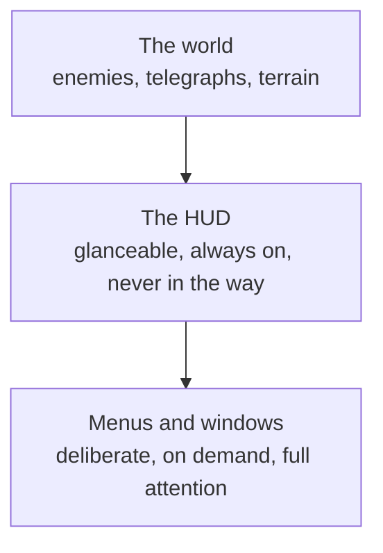
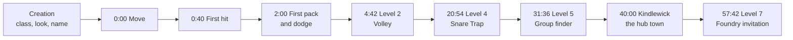

# Module 26: UX, UI and onboarding

- **Goal:** design what the player sees and how they find their way: a readable HUD, usable menus and inventory, accessibility options, and a first hour that teaches by doing and can be measured.
- **Prerequisites:** [06 — Controls, camera and game feel](06-controls-camera-feel.md), [08 — Combat design](08-combat.md), [14 — Progression and power curves](14-progression.md), [18 — World and level design](18-world-level.md), [19 — Quest and mission design](19-quests.md).
- **Simulation:** none
- **Facts checked:** October 2026 (prices, rules and product status change; re-check before reuse)

## In short

**UX** (user experience) is how the whole interaction feels and works; **UI** (user interface) is the screens, icons and text that carry it. In an online RPG the hardest UI is the **HUD**, which must show a fight's information in the right order without hiding the world. The hardest UX problem is the **first-time user experience (FTUE)**: most players who leave do so in the first minutes, so the opening hour must teach by playing, unlock systems one at a time, and be measured step by step. Accessibility (colour-blind-safe danger signals, readable text, remappable controls, subtitles) is cheaper to build in than to add later and helps everybody. The worked example is the course game's first hour, minute by minute, with the HUD for PC and touch and the list of what unlocks when.

## 1. The concept

### 1.1 Terms

| Term | Meaning |
|---|---|
| **UX (user experience)** | The whole experience of using the game: flow, clarity, effort, feeling |
| **UI (user interface)** | What is on screen: layout, icons, text, colours, sounds |
| **HUD (heads-up display)** | The information layer drawn over the world during play: health, skills, map, quests |
| **Menu** | A screen that pauses or covers play: inventory, map, settings |
| **Information hierarchy** | Ranking information by how fast the player needs it, and sizing and placing it to match |
| **Affordance / signifier** | What a thing can do, and the visible hint that tells the player so (a glowing button) |
| **Feedback** | The game's immediate answer to an action (module 06's list of cues) |
| **Diegetic UI** | Information shown inside the world (a glowing weapon) rather than on an overlay |
| **Safe area** | The screen region not covered by notches, rounded corners or system gestures |
| **dp (density-independent pixel)** | A touch-screen size unit; the same physical size on every phone |
| **FTUE (first-time user experience)** | The first minutes to hours of play, designed to teach and hook |
| **Onboarding** | Everything that brings a new player to competence: tutorial, quests, tips, unlocks |
| **Progressive disclosure** | Showing systems only when the player can use them |
| **Funnel / drop-off** | The ordered steps players pass through, and the share who leave at each |

### 1.2 Three layers of screen



The lower the layer, the more attention it takes and the less often it should interrupt. The HUD answers "what do I do right now?"; a menu answers "what do I want?".

## 2. The player's view

A player judges the game's UX in three moments.

- **The first minute.** "Do I know what to do, and does it feel good to do it?" If not, they leave quietly (pillar 4: respect the player's time).
- **A hard fight.** "Can I read what is happening and answer it?" This is pillar 2, "Fights you can read": if the HUD hides a telegraph, the fight fails however well it is balanced.
- **A chore.** "How many taps to equip, sell, or find the quest?" Mira (PC, evenings) wants density and speed; Dev (phone, 15–25 minutes) wants every action reachable with a thumb; Lena (weekends, story) wants to be left alone while she reads.

The FTUE works with the core loop ([module 03](03-vision-pillars-loops.md)): the first minutes must run the **core loop** (fight, loot, grow) once, quickly, so the player knows what the game is before any system is explained.

## 3. The design space

### 3.1 HUD density

| Style | Looks like | Good for | Cost |
|---|---|---|---|
| **Minimal / diegetic** | Almost nothing on screen; health on the character, hints in the world | Cinematic and single-player games | Hard to show cooldowns, party state and buffs; poor for a group fight |
| **Classic full** | Bars, a skill bar, a minimap, a tracker, chat, always visible | PC online RPGs with many systems | Clutter; can cover the fight; scales badly to a phone |
| **Adaptive** | Elements fade or hide when not needed (chat in combat, tracker in a dungeon) | Mixed PC and mobile | Needs rules so nothing the player needs disappears |
| **Customisable** | The player moves, resizes and hides elements | Long-lived PC games | Players make a mess; always keep a "reset" |

The course game uses **adaptive with presets**: a fixed default layout per device, the player can move and scale touch buttons, and low-priority elements fade in combat.

### 3.2 The information hierarchy

Rank everything by "how fast does the player need it?" and let the rank set size, contrast, place and behaviour.

| Tier | Question | Examples | Treatment |
|---|---|---|---|
| **1. Act now** | "What do I do this second?" | Telegraphs on the ground, hero HP, skill cooldowns and resource, cast warnings | Largest, highest contrast, closest to the eyes or thumb; never hidden |
| **2. Decide soon** | "What is my situation?" | Target frame, party HP, buffs and debuffs, minimap, XP | Medium; always visible but quiet |
| **3. Reference** | "What else exists?" | Quest tracker, chat, loot feed, menu icons | Small; fades to about 40% opacity in combat; never blocks a tier 1 element |

Three rules go with it:

1. **Telegraphs outrank the HUD.** Nothing but a skill preview may be drawn over the middle 40% of the screen in combat (module 08, rule 3).
2. **One colour, one meaning.** Red is reserved for enemy danger ([module 10](10-skills.md)); blue means safe; yellow means help ([module 08](08-combat.md)).
3. **Group by action, not by type.** The skill bar sits where the right hand is (bottom centre on PC, right thumb on touch); health sits where the eyes rest (top left).

### 3.3 Feedback and readability

Link to [module 06](06-controls-camera-feel.md) (the feedback list: every action has a visual and an audio cue within 100 ms) and [module 08](08-combat.md) (telegraphs are visible, consistent and longer than reaction time). The UX work is the **budget**: how many things may flash at once. A rule that works: at most one tier-1 alert at a time in the centre of the screen, and an effect that covers a telegraph is a bug, not a style.

### 3.4 Menus and inventory

| Design choice | Options | Trade-off |
|---|---|---|
| **Inventory layout** | Grid of slots; list with columns; a paper-doll plus grid | Grids show many items; lists compare stats better; paper dolls teach where things go |
| **Item comparison** | Hover or long-press shows "equipped vs this" with green and red arrows | Prevents mistakes; costs UI work |
| **Sorting and filtering** | Auto-sort, filters by type and quality, search | Essential once a bag has 40 or more slots |
| **Depth** | Any common action within two taps or clicks | Deeper menus lose phone players |
| **Equip and sell** | One-tap equip a clearly better item; sell-all of the lowest quality | Saves minutes per session (pillar 4); needs undo for sells |
| **New-item hints** | A dot on the icon and the item; cleared on view | Cheap and effective |
| **Mobile form** | Bottom sheets and large rows (48 dp or more); no hover | Hover tooltips do not exist on touch: long-press or a detail panel |

Do **the same flows on PC and touch**; only the input changes. A menu is also a promise: if you put a feature in it, the player expects it to work the same everywhere.

### 3.5 Accessibility

Accessibility means a game people with different senses, abilities and devices can play. It is also good UX for everyone (nobody objects to subtitles on a noisy bus). About 1 in 12 men (8%) and 1 in 200 women have some colour-vision deficiency (as stated by Colour Blind Awareness; see Further reading), so a game that says "red means danger" and nothing else fails millions of players.

| Area | Do | Why |
|---|---|---|
| **Colour** | Never use colour alone: add shape, pattern, outline, animation or sound. Offer a danger-colour setting | Red and green can look the same to a red-green deficient player; luminance and shape still read |
| **Contrast** | Text at least 4.5:1 against its background; large text at least 3:1 (WCAG 2.2) | Readable on a bright phone outdoors, too |
| **Text size** | A readable default; let the player scale it (80–150%) | Phones are small; many players squint |
| **Remapping** | Every key and button remappable; hold-versus-toggle options; a touch layout editor | Motor needs and handedness differ |
| **Subtitles** | On by default for all speech, with speaker names and a background panel, size adjustable | Hearing, noise, silent play, translation |
| **Effects** | Options to reduce screen shake, flashing and damage numbers | Motion sickness, photosensitivity, clutter |
| **Audio to visual** | Every important sound has a visual cue (module 06's list) | Hearing |
| **Difficulty and assist** | Assist options in a single-player game; in an online game, grouping and clear tells do this job | Fairness online; parity of PvP is covered in module 23 |

The Game Accessibility Guidelines state the basics plainly: "Ensure no essential information is conveyed by a fixed colour alone", "Allow controls to be remapped / reconfigured" and "Provide subtitles for all important speech". The Xbox Accessibility Guidelines add a structure for each area. Both are in Further reading.

### 3.6 Teaching the player: the FTUE design space

| Approach | How it works | Strength | Weakness | Used by |
|---|---|---|---|---|
| **Forced tutorial** | A separate, linear lesson before the game | Everyone learns everything | Boring for veterans; looks different from the real game | Older games, strategy games |
| **Guided first zone ("teach by doing")** | The first area is the real game with the dangers and prompts turned down | Learning is play; the core loop starts at once | Costs level and scripting work | Many modern online RPGs |
| **Contextual tips** | A short hint the first time a situation appears | Cheap; just in time | Easy to ignore; can interrupt a fight | Nearly all games |
| **Optional codex or help** | A searchable page of how things work | Players re-read it | Not for the first minute | Everywhere |
| **Skip option** | Veterans or alts skip or fast-forward | Respects experienced players | Skippers miss controls | Many long-lived games |

A public example: World of Warcraft's **Exile's Reach** (introduced with the Shadowlands pre-patch, October 2020) starts new players in a guided island zone for levels 1 to 10, while a veteran can pick a normal starting area or skip to level 10 (see Further reading; checked October 2026).

### 3.7 Gating systems

Showing everything at the start overwhelms; hiding everything loses the veteran who wants to look.

| Gate | How | Cost |
|---|---|---|
| **None** | Every menu from minute 0 | Overload; most players never open most of it |
| **Level-gated** | A system unlocks at a level | Predictable; surprises returning players |
| **Story- or quest-gated** | Unlocks when a quest introduces it | Best teaching; needs authored content |
| **Progressive disclosure** | Icons appear when unlocked; locked ones are hidden | Clean HUD; players miss that the feature exists |
| **Shown locked** | The icon is visible and greyed with "Unlocks at level N" | Tells players what is coming; adds clutter |

A good rule is to **introduce a system when the player first needs it, in the place they need it**, and to **show locked systems** with their requirement once the player is close (as quests do in module 19).

### 3.8 Tutorial anti-patterns

| Anti-pattern | What goes wrong | Fix |
|---|---|---|
| **A wall of text** | Nobody reads it; it is out of date after the next patch | One line and one action |
| **An unskippable long scene** | The first minute is a video | 30 seconds, skippable, control early |
| **A fake tutorial mode** | Different from the real game; skills do not transfer | Teach in the real game |
| **Teaching everything at once** | Ten prompts in a minute; none is remembered | One idea at a time, practised before the next |
| **Prompts that cover the fight** | The player cannot read the telegraph | Prompts at the edge; pause nothing |
| **"Press X to continue"** | The player is waiting for the game | Advance on the action itself |
| **Prompts for the wrong device** | "Click" on a phone | Detect the device and show its own prompt |
| **Wait gates** | "Come back in 4 hours" in the first hour | No timers in the first hour (module 17: nothing sold touches it) |
| **Early asks** | Rating, push-notification permission, shop offer in the first minutes | Ask after the first success, or not in the first session |
| **No way back** | A tip seen once cannot be found again | A help page and a "replay tips" option |

### How to choose

| If the game... | Use |
|---|---|
| Has one core mechanic that needs a lesson | A guided first zone |
| Has many systems | Staged unlocks tied to quests, shown locked when close |
| Has many returning players or alts | A skip, and shorter lessons for the second hero |
| Is mobile with 5 to 10 minute sessions | Rewards inside the first minute and a natural stop every few minutes |

## 4. Tuning and pitfalls

**The first minute.** A rule of thumb (inferred, from public onboarding guides): get the player into the core action within about a minute of pressing Play, and keep the first reward within the first few minutes. Roblox's onboarding guidance (see Further reading) also advises low thresholds for the first levels, so that a player feels progress at once. The course game's level curve ([module 14](14-progression.md)) already does that: level 2 arrives at 4.7 minutes.

**Measure the funnel.** Add an event for every step of the FTUE and plot completion at each. The step with the largest absolute drop is the one to fix first (a case in Meta's analytics guidance found one tutorial step responsible for a 6% loss of new users; see Further reading).

| Measure | Definition | Reading |
|---|---|---|
| **Step conversion** | Players who finish step N ÷ players who reached step N | A step well below its neighbours is a leak |
| **Time per step** | Median seconds from start to finish | A long median is confusion; a very short one is a skipped lesson |
| **Retries and deaths** | Failures per player in a step | A tutorial fight that kills people is too hard |
| **Quit point** | The last event before a session ends for good | Where players give up |
| **Day-1 retention** | Share of a day's new players who return the next day | The outcome the FTUE is for; compare to your own previous builds |
| **Cohorts** | The same funnel split by platform, class and country | A leak on touch only is a layout problem |

Common **pitfalls**:

- **Averages hide splits.** A funnel that looks fine overall can hide a 20% drop on small phones.
- **Designing for the first session only.** The first hour is the **session** and the first week is the **retention**; systems introduced and never revisited are forgotten.
- **Tooltips at 12 pt.** Unreadable on a phone; the minimum body text must be tested on the smallest supported device.
- **Thumb on the HUD.** A button under the palm, or a tracker where the thumb rests.
- **Fixing every drop with a prompt.** More prompts do not teach; a simpler first encounter does.
- **Leaving out accessibility until late.** Colour-blind modes and text scaling touch every screen; adding them after launch is expensive.

## 5. Worked example

The course game: a small online fantasy RPG, one hero per player, five classes, PC and touch ([fact sheet](_course-game.md)). This feature spec is the **first hour**, the **HUD** and the **unlock schedule**. All numbers are invented. It supports pillar 2 (readable fights), pillar 4 (a 15-minute session always gives a visible reward, nothing sold touches the first hour) and the three personas.

### 5.1 Intent and targets

- A new player **hits something within a minute** of getting control, and levels up within five minutes.
- They **learn move, attack, dodge, skills, gear and grouping by doing**, one idea at a time.
- By the end of hour one they have **four of the eight skills**, understand a telegraph, have visited the hub town and have been **invited to the first dungeon**.
- No wait gates, no shop pop-ups, no permission prompts in the first hour.

| Target | Value |
|---|---|
| Character creation (median) | Under 90 seconds |
| First hit after control | Under 60 seconds |
| Level 2 | 4:42 (module 14) |
| A level-up or gear reward | At least every 10 minutes in the first 30 |
| Skill unlocks in hour one | 4 (levels 1, 2, 4, 6) |
| First-session completion of the hour | 55% of those who start creation (funnel in 5.6) |

### 5.2 Level and time checkpoints

Times come from the level curve of [module 14](14-progression.md) (the time to complete level *L* is `4.69 × L^0.6` minutes at region 1's solo income), accumulated.

| Reach level | At | Skill unlocked (Ranger) |
|---|---|---|
| 2 | 4:42 | Volley |
| 3 | 11:48 | — |
| 4 | 20:54 | Snare Trap |
| 5 | 31:36 | — |
| 6 | 43:54 | Disengage |
| 7 | 57:42 | — |
| 8 | 72:42 | (Foundry entry level) |

### 5.3 The first hour, minute by minute

The clock starts at **0:00 = the first frame the player controls the hero**. Creation comes before. The sample hero is a Ranger; other classes swap the skill names.



| Clock | Level | What happens | What the player learns | Unlocks and HUD |
|---|---|---|---|---|
| **−1:30** | — | **Creation:** five class cards (role icon, difficulty stars, a 10 s loop; a **Try** button gives 30 s on a practice dummy), six look presets and sliders, name suggestions. One **comfort screen**: text size, colour mode, subtitles (all on sensible defaults, skippable) | Choice with a preview | Nothing |
| 0:00 | 1 | A 25 s skippable scene ends at the Cinder Meadow camp. A marker 30 m away | Move (WASD or joystick) | HP bar, quest tracker (one quest), minimap |
| 0:40 | 1 | One lone Scrapper | Attack, soft target, hold to repeat | Attack button glows (touch); enemy frame |
| 1:20 | 1 | First kill: loot sparkle, auto pickup, XP bar fills a little | Reward feedback | XP bar appears |
| 2:00 | 1 | **First pack of two.** One lunges with a **1.0 s red tell** (3% of HP). A prompt on the dodge button: "Dodge". No second prompt | Read a telegraph, dodge | Dodge button |
| 2:30 | 1 | Same pack, tell without prompt; the hero **cannot die before level 3** (a Lodge scout drags you back, no penalty) | Skill, not fear | — |
| 3:30 | 1 | Quest 1 "Scrap and Smoke" (200 XP) turns in; reward: a starter item with an **Equip** highlight | Equip | Equipment, bag |
| **4:42** | **2** | **Level 2.** Volley unlocks; a cone preview teaches ground aim | Skill 2, ground aiming | Skill slot 2 lights; slots 3–6 shown as dim rings |
| 6:00 | 2 | Class quest "Your Calling" (the class-pick quest of module 19): the Ranger's Focus mechanic | Resource | Resource bar tip, once |
| 8:00 | 2 | Quests 2 and 3; packs of 2 to 3; a hidden camp to discover | The field loop | Tracker shows 2 |
| **11:48** | **3** | **Level 3.** Gear reward, first potion | Potions | Journal, world map, potion slot, chat typing |
| 12:00–20:00 | 3 | Quests 4 to 6; one pack with a long tell (1.2 s) | Priorities, spacing | — |
| **20:54** | **4** | **Level 4.** Snare Trap, taught by the quest "Hold the Gate" | A second ground skill, control | Friends list |
| 25:00 | 4 | A rest beat: a ridge view with the Foundry chimney (the landmark of module 18) | Where the story goes | — |
| **31:36** | **5** | **Level 5.** The **Group Finder** and party frames unlock. One tip: "Groups earn more per hour." No prompt to join | Grouping exists, optional (pillar 3) | Group finder, party frames |
| 40:00 | 5 | **Kindlewick** (the hub): a 5-minute visit. The waypoint attunes by walking in; the Marshal scene; a short errand to the vendor, the stash and the Lodge Hall | Services, waypoint | Vendor, stash, mailbox, waypoint, notice board. Trade post greyed: "Level 10, account age 3 days" |
| 43:54 | 6 | **Level 6.** Disengage | Repositioning | Skill slot 4 |
| 45:00 | 6 | Gravel Road: packs of 3 to 4; the first **Slinger** (ranged) as a priority target | Target priority | — |
| 55:00 | 6 | A natural stop; Dev's session would end here: level 6, two gear pieces and a visited hub | — | — |
| **57:42** | **7** | **The Foundry invitation.** A mail and a map marker from the Marshal: "Smoldering Foundry, recommended level 11, entry from 8, about 15 minutes." The Group Finder lists it, locked, with "Level 8, about 15 minutes of quests away" | A goal | Dungeon entry in the finder |

At each stop (minutes 5, 12, 21, 32, 44, 58) there is a level-up or a reward and an obvious pause, so a 15-minute session ([pillar 4](03-vision-pillars-loops.md)) always ends on something. Nothing in the hour is a timer.

### 5.4 The HUD, PC

A 16:9 screen, 3% safe margin. The centre is clear for the fight.

```text
+--------------------------------------------------------------------------+
| [Hero frame]  HP / Focus                         [Minimap]  [Menu strip]  |
| [Buffs row]                                                [Tracker x5]   |
| [Ally 1] [Ally 2] [Ally 3]                                                |
|                                                                          |
|                 [Boss bar + stagger bar]  (only in a boss fight)         |
|                 [Target frame + cast bar]                                |
|                                                                          |
|             clear zone: world, telegraphs, damage numbers               |
|                                                                          |
| [Chat]                                                    [Loot feed]    |
| [XP bar, thin, full width]                                               |
|            [Potion] [1][2][3][4][5][6] [7][8] [Basic][Dodge]             |
+--------------------------------------------------------------------------+
```

| Element | Tier | Place | Notes |
|---|---|---|---|
| Hero frame: HP, Focus or Mana, buffs | 1 | Top left | The player's eyes rest here |
| Skill bar: keys 1–6, buffs 7–8, basic, dodge, potion | 1 | Bottom centre | Cooldown sweep, a flash on ready (module 06) |
| Target frame, cast bar, boss bar | 1–2 | Top centre | The boss bar appears only in a boss fight |
| Ally frames (up to 3) | 2 | Under the hero frame | HP and a downed icon |
| Minimap and menu strip | 2 | Top right | Six icons: Hero, Bag, Journal, Map, Social, Shop; Settings in the Hero menu |
| Quest tracker (5 pins) | 3 | Under the minimap | Fades in combat |
| Chat, loot feed | 3 | Bottom left and right | Chat collapses in combat; the feed lists items for 6 s |

### 5.5 The HUD, touch

A landscape phone. Sizes follow [module 06](06-controls-camera-feel.md): joystick 120 dp, attack 72 dp, skills and dodge 56 dp, gaps at least 8 dp. A 24 dp inset for notches, 16 dp from the screen edge.

```text
+--------------------------------------------------------------------------+
| [Hero frame, compact]                          [Minimap o] [Menu button]  |
| [Ally chips]                                       [Tracker, 3 pins]      |
| [Chat icon]                                                              |
|                  clear zone: world, telegraphs                           |
|                                                                          |
|   (  floating joystick         [Auto-use switch]        [S4] [S5] [S6]   |
|     appears under the thumb  )              [Dodge]    [S3]  [ATTACK 72]  |
|                                      [Potion]  [S1] [S2]                  |
+--------------------------------------------------------------------------+
```

- **Left thumb:** the left 35% of the screen, lower 60%, is the joystick zone. Nothing else is placed there.
- **Right thumb:** the six skills sit in an arc around the attack button, the dodge above the arc, the potion left of the attack button, and the auto-use switch for the two buffs beside the arc. Locked slots stay as **dim rings** so the layout never shifts under the thumb.
- **Top:** hero frame and ally chips at the left, a round minimap and **one** menu button (opens the six-icon grid) at the right, a tracker of 3 pins that collapses to one line in combat.
- **Editable:** the player can move and resize each button between 80% and 130% in a layout editor, and **Reset** restores the default.

### 5.6 What unlocks when, and the funnel

| System | Unlocks | How it is introduced |
|---|---|---|
| Move, attack, dodge, tracker, minimap, auto pickup | Level 1 | The opening beats |
| Skill slots 2, 3, 4 | Levels 2, 4, 6 | A glow and a quest that uses the new skill |
| Equipment and bag | Level 2 | The first gear reward, with an Equip highlight |
| Journal, world map, potions, chat typing | Level 3 | A short beat; chat is readable from the start |
| Friends list | Level 4 | A tip |
| Group finder and party frames | Level 5 | A tip with no prompt |
| Hub services, waypoint | On entering Kindlewick | The Marshal scene and a three-stop errand |
| Trade post | Level 10 and 3 days of account age ([module 16](16-economy.md)) | Shown greyed with its requirement |
| Dungeon entry | Level 8 | The invitation at level 7 |
| Shop | Visible as an icon; **no pop-ups, offers or pass prompts in the first hour** | [Module 17](17-monetization.md) |

The funnel to instrument (one event per step; targets are for the design, and the real values come from a soft launch):

| Step | Target conversion from the step before |
|---|---|
| Creation started → finished | 95% |
| Finished → control (0:00) | 98% |
| First hit (0:40) | 97% |
| Dodge lesson (2:00) | 96% |
| Level 2 (4:42) | 95% |
| Level 3 (11:48) | 88% |
| Level 5 (31:36) | 85% |
| Kindlewick (40:00) | 95% |
| Invitation (57:42) | 95% |

Multiplying the steps gives about **55%** of those who started creation reaching the invitation. The largest step losses are expected at levels 3 and 5 (long stretches), so those get the closest watch. Cut the funnel by platform, class and device size.

**Not measured by a single number:** the first-session playtest ([module 28](28-prototype-playtest.md)) watches five to eight new players think aloud through the same hour and writes down every hesitation.

### 5.7 Accessibility in the course game

| Option | Default | Range |
|---|---|---|
| Text size | 100% (body 16 px at 1080p on PC, 14 sp on phone) | 80–150% |
| Text contrast | At least 4.5:1 | Fixed minimum |
| Subtitles | On, with speaker name and a panel | Off; size small, medium, large |
| Colour mode | Standard | Deuteranopia, protanopia, tritanopia |
| Danger colour | Red | Red, orange, magenta |
| Telegraphs | Filled shape, bright outline, fill edge that moves, a **hatched** damage zone and a warning sound | The pattern and the sound stay in every colour mode |
| Remapping | Every key and button | Presets; hold or toggle |
| Touch layout | Default | Move and scale; reset |
| Effects | Full | Reduce shake, reduce flashes, hide damage numbers |

Red stays reserved for enemy danger ([module 10](10-skills.md)), and a skill recolour sold in the shop is never danger red ([module 17](17-monetization.md)). A hatched fill and a bright edge mean a deuteranope reads the telegraph by **luminance and pattern**, not by hue.

### 5.8 What was cut

- **A separate tutorial instance.** The Meadow is the tutorial.
- **A spoken, unskippable intro.** One 25-second skippable scene.
- **Quest auto-travel** and **a mini-game for the hub** (module 19 and 18 cut them).
- **A paper-doll with an equipment preview in 3D** at launch; a flat grid and a paper-doll icon list.
- **An "AI helper" companion** that comments on every action: too intrusive; hints are one line.
- **A full controller map** ([module 06](06-controls-camera-feel.md)).

### 5.9 How the design would differ for another kind of game

| Game type | What changes |
|---|---|
| **Hero-collection mobile game** | The FTUE is a scripted first battle and first pulls; the shop appears early; the HUD is battle-only with big buttons |
| **Single-player story RPG** | A diegetic, minimal HUD; the tutorial is level 1's story; a pause is allowed |
| **Competitive arena** | A separate practice mode; ranked unlocks after N games; a training range |
| **MMO with many systems** | A longer staged unlock and a codex; a "returning player" path |
| **Controller game** | A radial menu for skills and button-hint prompts per device |

## Key takeaways

- **UX is the whole experience; UI is what carries it.** The HUD answers "what do I do now?" and gets the best place; menus answer "what do I want?".
- Rank information by **how fast the player needs it** (act now, decide soon, reference), and keep the centre of the screen for the fight and its telegraphs.
- **Never rely on colour alone.** Shape, pattern, outline and sound make the danger readable to the roughly 1 in 12 men with a colour-vision deficiency. Offer text scaling, remapping and subtitles.
- **Teach by doing, one idea at a time,** in the real game: a guided first zone, contextual tips, a skip for veterans, a help page for the rest.
- **Introduce each system at the moment it is needed**, and show locked systems with their requirement.
- The first hour needs **a reward every few minutes**, no waiting, and no shop or permission asks.
- **Measure the funnel step by step**: fix the largest leak first, split by platform and class, and let a think-aloud playtest explain why.

## Further reading

- Game Accessibility Guidelines (a reference for inclusive game design): https://gameaccessibilityguidelines.com/full-list/
- Xbox Accessibility Guidelines (Microsoft Learn, version 3.2 as of October 2026): https://learn.microsoft.com/en-us/gaming/accessibility/guidelines
- W3C, Web Content Accessibility Guidelines 2.2 (contrast minimums): https://www.w3.org/TR/WCAG22/
- Colour Blind Awareness, prevalence of colour blindness: https://www.colourblindawareness.org/colour-blindness/
- Nielsen Norman Group, 10 usability heuristics: https://www.nngroup.com/articles/ten-usability-heuristics/
- Roblox Creator Docs, onboarding and Day-1 retention: https://create.roblox.com/docs/en-us/production/game-design/onboarding
- Meta developer blog, funnel events for the first-time user experience: https://developers.meta.com/horizon/blog/build-faster-earn-more-how-to-get-started-with-in-game-analytics/
- Blizzard, the Shadowlands pre-expansion patch and Exile's Reach: https://news.blizzard.com/en-us/article/23523206/explore-the-updates-arriving-with-the-shadowlands-pre-expansion-patch
