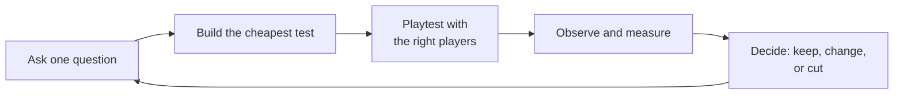
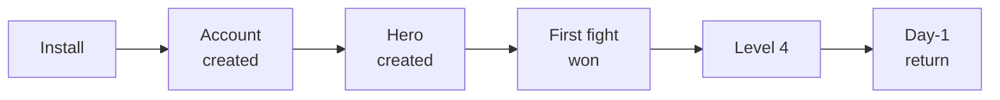

# Module 28: Prototyping, playtesting and metrics

- **Goal:** find out cheaply whether a design is fun and readable, run a playtest that produces trustworthy findings, choose what to log once a game is live, and turn what you learn into changes.
- **Prerequisites:** [03 — Vision, pillars and loops](03-vision-pillars-loops.md), [08 — Combat design](08-combat.md), [10 — Skills and abilities](10-skills.md), [26 — UX, UI and onboarding](26-ux-onboarding.md).
- **Simulation:** none
- **Facts checked:** October 2026 (prices, rules and product status change; re-check before reuse)

## In short

A prototype is a cheap, disposable way to answer one question before you pay for the answer in production. A playtest is how you watch real people answer it. Early on, paper and greybox prototypes test whether the core loop is fun and readable. Later, a vertical slice proves quality, and a closed beta with telemetry shows what thousands of players actually do. The skill is to decide **before** the test what you are asking, what result would change the design, and what the thresholds are. The worked example is a paper prototype of the course game's combat (modules 08 and 10) and a playtest plan for the first hour (module 26) with questions, metrics and pass/fail thresholds tied to the pillar tests of module 03.

## 1. The concept

### 1.1 Terms

| Term | Meaning |
|---|---|
| **Prototype** | A rough, disposable build that answers one question |
| **Paper prototype** | A prototype made of cards, dice, a grid and tokens, played by hand |
| **Digital prototype** | A quick playable build with placeholder art |
| **Greybox (blockout)** | Levels or encounters built from plain grey shapes to test layout, scale and pacing |
| **Vertical slice** | A small piece of the real game at final quality: art, audio, feel and systems, over a narrow slice of content |
| **MVP (minimum viable product)** | The smallest release that lets real players test the core value |
| **Playtest** | Watching players use the game to learn what works and what does not |
| **Think-aloud** | The player speaks their thoughts while playing |
| **Telemetry** | Events the game records about what players do |
| **Funnel** | A series of steps with the share of players who reach each one |
| **Cohort** | A group of players who started in the same period, followed over time |
| **Retention (D1, D7, D30)** | The share of a cohort that returns on day 1, 7 or 30 after install |
| **A/B test** | Showing two versions to random groups and comparing a metric |

### 1.2 The cycle

Every prototype and playtest follows the same loop. The faster it turns, the more you learn.

### 1.3 The cost of a mistake

A change costs more at each stage. A rule changed on paper takes minutes. The same rule after the content is built can take weeks. After launch it can break players' trust. That is why you test the **riskiest assumption first**: the one that, if wrong, makes the rest worthless.

## 2. The player's view

The player never sees a prototype. They feel its result: a fight that reads clearly, a first hour that does not confuse, a first dungeon that rewards friends. A playtest tests whether the **feelings promised by the pillars** (module 03) are real. If a pillar cannot be tested, it is a slogan. Pillar tests are the bridge between design and playtest, and in this module they are the pass or fail lines.

## 3. The design space

### 3.1 Finding the fun

"Find the fun" means answering early: **is the core loop (30–90 seconds) pleasant to repeat?** A rule of thumb used in many studios: if the basic loop is not fun with grey boxes and placeholder sounds, polish will not save it. The signal is not "players say it is good" but **players keep playing after the test ends**, ask for another round, or start inventing their own goals.

### 3.2 Types of prototype

| Type | Best for | Strength | Weakness |
|---|---|---|---|
| **Paper** | Rules, resource flow, readability of attacks, party roles, economy loops | Hours to build; anyone can change a rule mid-test | Slow turns; cannot test reflexes or feel |
| **Spreadsheet or simulation** | Numbers: time-to-kill, curves, drop tables (modules 08, 14–17, 25) | Thousands of runs in seconds | No player; says nothing about fun |
| **Digital (rough)** | Controls, camera, timing, feel (module 06) | Tests real-time input | Takes days to weeks; art is a distraction |
| **Greybox level** | Layout, scale, pacing, wayfinding (module 18) | Exposes a room that is too big or a path that is unclear | Not final lighting or readability |
| **Vertical slice** | Quality, art direction, "does the whole thing feel good", pitching | Proves the target quality | Expensive; do it after the loop is proven |
| **Playable MVP** | Whether the business works: acquisition, retention, spend | Real players and data | A weak first impression is hard to undo |

### 3.3 Vertical slice versus MVP

| | Vertical slice | MVP |
|---|---|---|
| **Question** | "Can we make the game at this quality, and is it fun?" | "Will real players come, stay and pay?" |
| **Content** | One narrow, polished path | A thin but complete game, with all core loops |
| **Audience** | The team, publishers, investors, small tests | Real players |
| **Typical sequence** | After paper and greybox | After the slice, usually as a soft launch or closed beta |

For an online game the slice should include **one multiplayer moment** (two players in the same fight), because social loops fail in ways a solo slice hides.

### 3.4 Playtest types

| Type | Who | Usually when | What it finds | Watch out for |
|---|---|---|---|---|
| **Internal** | The team and colleagues | All the time | Crashes, obvious confusion, rule bugs | Everyone knows the game: they never see it as new |
| **Friends and family** | People you know | Early prototypes | First reactions; clear confusion | They are polite; they will not say it is boring |
| **Recruited target players** | Strangers matching your personas | Prototype to beta | Honest reactions, learning and confusion | Costs money and time; needs screening |
| **Closed beta** | An invited group, often under an agreement | Months before launch | Behaviour at scale, funnels, retention, balance | Small and self-selected; not the same as launch |
| **Open beta** | Anyone who signs up | Weeks before launch | Load, server limits, wide feedback | Players treat it as release; first impressions stick |
| **Soft launch** | Real release in a few markets | Before global launch | Retention and spend with real money | Local differences; leaks |

### 3.5 How many testers?

- **Usability problems:** five users find about 85% of the problems in one design, because on average each user finds about 31% of them, so after n users the share found is 1 − 0.69^n (n = 5 gives 0.84). Use several small rounds (fix, then test again) instead of one large one. The exception is a test with several different groups: test five from each. Source: Nielsen Norman Group.
- **Preference and balance** need far more players than five. Use telemetry for those.
- **Small samples are an indication, not proof.** With 12 testers, "9 of 12 got it" has a 95% confidence interval of about 47–91%. A result close to a threshold calls for another round.

### 3.6 Running a playtest

**Before.**
1. **Goal:** one to three questions, each tied to a pillar or a feature ("can players tell what killed them?").
2. **Hypothesis and threshold:** write down what you expect and what result would make you change the design. Do this before the test, or you will explain away the result afterwards.
3. **Participants:** recruit by persona and screen out friends and heavy fans unless they are the target. Recruit a few more than you need, because some will not show up.
4. **Script and tasks:** give the player a goal, not instructions ("clear this room", not "press 3 to cast"). Prepare the same wording for every session.
5. **Setup:** record the screen, the player's face or voice (with consent), and the input device. Pilot the test once with a colleague.

**During.**
- **Observe silently.** Do not help, hint or explain unless the player is stuck for a set time (say 2 minutes), and then log it as a **blocker**.
- **Think-aloud** for the first part of a session ("say what you are thinking and why"). Stop it if it changes how they play (a precise fight needs focus). Moderate it with neutral prompts: "What are you looking at?", "What did you expect?"
- **Note, do not interpret:** write what the player did and said ("died to the slam, said 'where did that come from?'"), with a timestamp. Interpretation comes after.
- **Measure what is measurable:** time to a goal, deaths, errors, which buttons.

**After.**
- **Short survey** right after play (before they discuss it), with fixed questions and the same scale for everyone.
- **Interview:** open questions that start from what you saw. Ask "tell me about the moment you died" rather than "was the fight fair?"
- **Debrief and triage:** the team groups the notes, counts how many testers hit each issue, and rates each by severity and frequency.

### 3.7 Question wording and biases

| Bias | What happens | Defence |
|---|---|---|
| **Leading questions** | "Did you like the clear telegraphs?" invites yes | Ask open, neutral questions; "What did you notice about the enemy attacks?" |
| **Politeness (friendly) bias** | Friends and acquaintances praise | Use strangers for opinion; judge by behaviour |
| **Observer effect** | Players try harder or play differently when watched | Keep the setting natural; supplement with telemetry |
| **Selection bias** | Beta volunteers are not typical players | State who tested; compare with telemetry at launch |
| **Expert contamination** | Team members play differently | Do not count internal sessions as player evidence |
| **Hindsight and confirmation** | You notice only what supports your view | Write hypotheses and thresholds first; have two people code the notes |
| **Novelty effect** | Everything is exciting the first hour | Test a second and a third session for retention |
| **Stated versus revealed preference** | Players say they want one thing and do another | Trust what they do; use what they say to find reasons |
| **Loud minority** | A few vocal players stand for all | Combine feedback with metrics (module 29) |
| **Survivorship bias** | You hear only from those who stayed | Study drop-off points and ask those who left |

### 3.8 Telemetry and metrics

**Telemetry** is a stream of **events**: a name, a time, a player, and some details. Log events that answer questions you already have, not everything.

| What to log | Examples | Answers |
|---|---|---|
| **Session** | login, logout, duration, platform, device tier | How long and where do they play? |
| **Progress** | tutorial step, level up, quest accept and complete, dungeon enter and clear | Where do they get stuck? |
| **Combat** | fight start and end, deaths with the killing attack, skill uses, dodge success | Are fights readable and fair? |
| **Economy** | currency gained and spent by source and sink | Is the economy healthy (module 16)? |
| **Social** | party formed, party size, time to form, chat use | Does pillar 3 work? |
| **Shop** | views, purchases, price points | Does monetization behave (module 17)? |
| **Technical** | crashes, frame rate, load time, latency, disconnects | Is the game running well on each platform (module 27)? |
| **Funnel and survey** | step reached, survey answer | Where do players leave and why? |

Rules for good logging: give every event a **schema** (a fixed list of fields) and a **version**; record the **platform and build**; keep **personal data out** (log an anonymous id; follow local privacy law and store rules on consent, as of October 2026); and **test the events** before the beta, because an untested event is usually a broken one.

### 3.9 Funnels, retention and cohorts

**Funnel.** A funnel lists the steps from first contact to a goal and the share of players reaching each. The largest drop is where to look first.

**Retention.** D1, D7 and D30 retention measure whether the game earns a return. Public industry reports (for example from analytics firms) suggest typical mobile games keep roughly 25–30% of players on day 1, around 10% on day 7 and a few percent on day 30, with large differences by genre and market. Treat those as a rough orientation, and compare your own cohorts with each other.

**Cohorts.** Compare cohorts by install week and by platform. If the cohort that saw the new tutorial retains 4 points better, the tutorial matters. If every cohort drops the same way, the problem is elsewhere.

**Other signals.** Average session length, sessions per day, **time to first reward**, **time to first group**, **deaths per fight**, and **churn points** (the last action before a player leaves).

### 3.10 A/B tests and their limits

An **A/B test** splits players randomly into two groups, changes one thing, and compares one pre-chosen metric.

**Sample size.** A rule of thumb for a test of a rate (80% power, 5% significance) is about 16 × p × (1 − p) ÷ d² players **per group**, where p is the baseline rate and d is the smallest change you care about. Example: baseline tutorial completion 40% (p = 0.40) and a target gain of 3 points (d = 0.03) gives 16 × 0.24 ÷ 0.0009, about 4,270 players per group. To detect 5 points from 35% needs about 1,460 per group.

**Limits.**
- **Network effects.** In a social game, a player in group A is playing with players in group B. The effects leak. Split by whole guilds, servers or regions when you can.
- **Novelty and learning.** A change often looks good for a week. Run it long enough for the effect to settle.
- **Peeking and many comparisons.** Stopping when the result "looks significant", or checking twenty metrics, gives false wins. Choose one primary metric and the duration up front.
- **Small effects need big samples.** A small beta cannot answer subtle questions; use playtests instead.
- **Averages hide groups.** A change can help phone players and hurt PC players. Cut the result by platform and by player type.
- **Ethics.** Testing prices or odds on players is sensitive and may break platform or legal rules. Do not run tests that hide the cost of a purchase or target minors ([module 17](17-monetization.md)).
- **Metrics are not goals.** Optimising session length or spend alone can harm the pillars. Pair every metric with a **guardrail** (for example, "do not raise spend if it lowers D7").

### 3.11 Turning findings into changes

1. **Collect** observations and numbers in one list.
2. **Group** them by cause, not by symptom ("players missed the slam" and "players blamed lag" may be one problem: the telegraph).
3. **Rate** each by **frequency** (how many players), **severity** (does it block or annoy) and **cost** to fix.
4. **Choose** the smallest change that addresses the cause, and state the **expected effect** as a number.
5. **Retest** with the same script, and compare against the same threshold.
6. **Record** the decision (module 05): what was found, what changed, what the retest showed.

Distinguish **a problem** (players cannot do or understand X) from **a solution** (a player suggests button Y). Players are expert at finding problems and poor at designing fixes.

### 3.12 How to choose

| If the question is... | Use |
|---|---|
| Is the rule set interesting, are roles clear? | Paper prototype |
| Are the numbers in range? | Simulation (modules 08, 25) |
| Does it feel good to control? | Rough digital prototype on real devices |
| Is the level layout clear and well paced? | Greybox with 5 testers |
| Will the first hour hold a new player? | Moderated playtest with target strangers |
| Where do many players leave? | Telemetry funnel in a closed beta |
| Does version B beat version A? | A/B test, if the sample and the effect size allow it |

## 4. Tuning and pitfalls

### 4.1 Setting thresholds

A threshold is a promise you make before seeing the result. Use three bands:

| Band | Meaning | Action |
|---|---|---|
| **Pass** | At or above the target | Keep; move on |
| **Inconclusive** | Between the fail line and the target | Fix the likeliest cause and retest with new players |
| **Fail** | Below the fail line | Change the design or the pillar |

Set thresholds from the **pillar tests** and from industry orientation, then adjust after the first few rounds. For small samples keep the fail line well below the target, so one lucky or unlucky tester does not decide.

### 4.2 Signals that the test is wrong

| Signal | Probable cause |
|---|---|
| All testers pass everything | The tasks are too easy or the test coaches the players |
| Testers answer differently from how they played | Leading questions; politeness |
| One tester dominates the notes | Too few testers per round; no counting of frequency |
| Results change a lot between rounds | Different participants; the script changed |
| The team argues about what was seen | No recording; no timestamps |

### 4.3 Classic failures

- **Testing too late.** The first outside player sees the game a month before launch, and nothing can change.
- **Testing the wrong people.** Colleagues and fans. They are not new players.
- **Testing everything at once.** A test with ten questions answers none.
- **Explaining the game.** A person at the shoulder ruins a first-hour test: the real player will not have one.
- **Collecting data, not decisions.** A dashboard with 200 charts and no question.
- **Chasing the metric.** A change that raises D1 by pushing rewards in the first hour and lowers D30.
- **Fixing the solution a player proposed** instead of the problem they showed.
- **Ignoring platform.** One average for PC and phone hides the platform that fails.

## 5. Worked example

The course game ([the fact sheet](_course-game.md)). All numbers are invented. Two parts: a **paper prototype of combat** (rules from [module 08](08-combat.md) and [module 10](10-skills.md)), then a **playtest plan for the first hour** (the flow of [module 26](26-ux-onboarding.md)).

### 5.1 Part A: the paper prototype of combat

**Questions (the riskiest assumptions).**
1. **Readable:** does the "telegraph card and dodge token" rhythm let a player avoid a heavy attack? (pillar 2)
2. **Rhythm:** is a pack fight in the 10–18 second band for a solo Ranger, and does it feel like a fight rather than a wait? (module 08)
3. **Roles:** does the Warden hold the enemies' attention when others deal more damage? (pillar 1, module 08 threat)
4. **Together:** does a party of four clear faster than a solo player? (pillar 3)

**What it uses.** A grid of 3 × 5 squares for the arena, a deck of **telegraph cards**, a pile of **pips** (one pip is 10 HP), a **beat** counter (one beat is one second of game time), and a phone timer that rings every 2 seconds in real time to keep the beat. Printed numbers already include the defence formula of module 08 (damage = hit × 100 ÷ (100 + defence)).

**Setup: the Ashfang pack** (module 12): two Scrappers (6 pips each), a Brute (24 pips, Ground Slam) and a Slinger (12 pips). Total 48 pips = 480 HP, as in module 08.

| Piece | Paper rule | Derived from |
|---|---|---|
| **Ranger** | 90 pips of HP; basic attack: 3 pips of damage each beat | 30 × 100 ÷ 110 = 27 damage per hit, one hit every 0.8 s, so about 34 a second, rounded down to 30 |
| **Scrapper** | Attacks every 2 beats for 3 pips; its telegraph card shows 1 beat ahead | A 30-damage hit is 3% of 1,000 HP: minimum 0.4 s (module 12) |
| **Slinger** | Attacks every 3 beats for 3 pips from range, 1-beat card | Same band |
| **Brute: Ground Slam** | A card shows 2 beats ahead, hits a marked 2 × 2 area for 20 pips | A hit between 20% and 45% of HP needs a warning of at least 1.2 s (module 12); 20 pips is 22% of 90, and 2 beats is 2 s on the paper clock |
| **Dodge** | A token: step out of a marked square at any time before the card resolves; the token returns after 3 beats | 0.35 s dodge, 3.0 s cooldown (module 06) |
| **Skills** | Aimed Shot costs 20 Focus, deals 6 pips; Focus regains 4 per beat | A cut-down of module 10's Ranger kit (Focus 0–100, +4 a second) |

**The run.** A tester plays the Ranger, a second person plays the enemies, flipping cards and moving tokens. Two tests:

1. **Solo, 3 runs each.** Count the beats to clear and the pips of damage taken. Expected: 48 pips ÷ 3 per beat = 16 beats (a little slower than the 14.1 s of module 08 because of the rounding; inside the 10–18 band).
2. **Party of four, 3 runs.** Add the Warden, Cleric and Duelist as quick cards. Per module 11, field packs add one Scrapper per extra player (maximum +3), so the pack is 48 + 18 = 66 pips. Four players deal about 12 pips a beat: about 6 beats against the solo 16.

The party number shows the direction (pillar 3: the party is much faster here), not the dungeon figure. Pillar 3's own test is a **dungeon** clear at least 25% faster than solo, which depends on the boss's HP scaling (2.5× for four) and is measured in the greybox stage (see 5.4).

| Question | Paper measure | Pass | Fail |
|---|---|---|---|
| **1. Readable** | Share of Ground Slam cards (second time seen) that the tester dodges | at least 70% | below 40% |
| **1. Readable (cause)** | Tester can say "what hit me and when" after a death | at least 80% of deaths | below 50% |
| **2. Rhythm** | Beats to clear the pack, solo | 10–18 | below 8 or above 22 |
| **2. Rhythm (feel)** | Tester says "waiting" or "nothing to do" | under 25% of testers | over 50% |
| **3. Roles** | Enemies' target on average is the Warden when one is present | at least 60% of enemy attacks | below 40% |
| **4. Together** | Party beats versus solo beats | party faster by at least 25% | party not faster |

**Expected learnings.** The first run usually shows testers who do not look at the card (a layout problem: put the card above the enemy). The Slinger often goes unnoticed. The Warden holds attention only if the threat tokens are visible. Each of these changes is a card or a layout, which is what paper is for.

**What paper cannot tell you.** Whether the dodge feels good with a 100 ms response (module 06), whether it works on touch, and whether 0.8 s is enough on a phone. Those go to a rough digital prototype on real devices.

### 5.2 Part B: the first-hour playtest plan

**Purpose.** Learn whether a new player, in their first hour, gets a role, reads the fights, can progress alone and finds the game respectful of their time. These are pillars 1, 2, 3 and 4 as tested in [module 03](03-vision-pillars-loops.md). The steps of the first hour are those of [module 26](26-ux-onboarding.md); this plan measures them.

**Participants.** 12 strangers, screened to match the personas: 4 like Mira (PC, plays online RPGs in the evening), 4 like Dev (phone, short sessions, collection games), 4 like Lena (PC, weekends, story). Six play on PC and six on a phone. Each person plays once for 60 minutes. Why twelve: it gives at least four per persona and six per platform, so a platform problem appears twice or more, and Nielsen's finding says each group reveals most of its main problems with about five.

**Setup.** A moderated session, with the screen and the input recorded and consent given. The moderator says only the opening script and does not help unless a player is stuck for 2 minutes (log a blocker). Think-aloud for the first 20 minutes only; silent play for the rest, to protect fight focus. Telemetry events (section 5.3) run alongside. The builds are identical on PC and phone.

**Script.**

| Minute | What the player does | What is observed |
|---|---|---|
| 0–3 | Opening, pick a class (a blind pick, no recommendation) | Which class, why, any confusion |
| 3–10 | First fights and the first skills | Role understood? First dodge? |
| 10 | **Question card:** "In one sentence, what is your class for in a group?" | Pillar 1 |
| 10–30 | Quests in the starting field, first level-ups | Fights readable, quest clarity |
| 30–50 | The hub town, first elite or mini-boss, group finder offered | Deaths and what players say killed them, group board use |
| 50–60 | A reward and a stop point; the moderator says "you can stop whenever you like" | Natural stop? A visible reward? |
| After | Survey (5 min), then interview (10 min) | See below |

**Questions and thresholds.** Each row is tied to a pillar test of module 03.

| Pillar and test | Question or metric | Pass | Fail |
|---|---|---|---|
| **1. My hero, my way**: players name their class's role within 10 minutes | At minute 10, the share of testers who describe their class's role correctly in group terms | at least 9 of 12 (75%) | fewer than 6 of 12 (50%) |
| **2. Fights you can read**: players on PC and on a phone can say what killed them | After each death: "what killed you?" correct | at least 80% overall and the PC and phone gap at most 10 points | below 60% on either platform |
| **2. (second-seen)** | Share of telegraphed attacks that were avoided the second time the same attack appears | at least 70% | below 50% |
| **2. (blame)** | Deaths where the tester says "I did not see it" | at most 15% of deaths | over 30% |
| **3. Stronger together**: solo is never blocked | Every tester finishes every first-hour quest alone | 12 of 12 | any blocked |
| **3. (invite)** | Testers who try the group finder when it is offered, and say why or why not | at least 50% try it | below 25%, or a "scary" reason |
| **4. Fair and respectful of time**: a 15-minute session always gives a visible reward | Every 15-minute block has at least one reward event (loot, level-up, quest turn-in, new skill) | 100% of blocks for every tester | any empty block |
| **4. (natural stop)** | Phone testers who say they could stop "at a good point" at minute 15, 30 or 45 | at least 80% | below 50% |
| **4. (shop)** | Purchase prompts shown in the first hour | 0 | any in the core loop |
| **Flow** | Testers reaching the hub and level 4 in the hour (placeholder: set from module 14's pacing plan) | at least 10 of 12 | fewer than 8 of 12 |

With 12 testers these are indications. For example, 9 of 12 has a 95% interval of about 47–91%, so a result of 8 of 12 on a pillar-1 row triggers a second round, not a conclusion. A fail on any pillar-1 or pillar-2 row changes the design of the class opening or the telegraph. A fail on pillar 3 or 4 changes the tutorial flow or the reward schedule.

**Survey (after play).** Same five questions for everyone, with a five-point scale and one free comment each:
1. "I understood what my class is good at."
2. "When I lost health, I knew why."
3. "I could have stopped at any time without feeling I was missing out."
4. "I would play with other people in this game."
5. "I felt the game wanted my money."

Questions 1 to 4 map to the four pillars. Question 5 is a guardrail on pillar 4: it should score low.

**Interview (10 minutes, open).** "Tell me about the moment you died." "What was your class for?" "What did you want to do next, and could you?" "When would you stop playing today?" The moderator asks follow-ups from what they saw.

**Bias controls.** Strangers, not friends; neutral wording; hypotheses and thresholds written down before the first session; a second person codes the recordings blind to the first person's notes; identical scripts on both platforms; a separate session with five fresh testers after the first fixes, to test the fix on people who have not seen the old version.

### 5.3 Telemetry for the closed beta

After the paper and moderated stages, a closed beta with telemetry checks the same questions at scale. Targets are teaching placeholders, to be recalibrated against genre benchmarks and the studio's own cohorts. These are **closed-beta gates**: a small, self-selected cohort must clear them before launch, and after launch the **live targets** of [module 24](24-endgame-retention.md) (D1 40%, D7 12%, D30 4%) take over.

| Funnel step | Event | Target |
|---|---|---|
| Install to account | `account_created` | at least 85% |
| Account to hero | `hero_created` | at least 90% |
| Hero to first fight won | `fight_won` (first) | at least 95% |
| First fight to level 4 | `level_up` (level 4) | at least 80% |
| Level 4 to day-1 return | `session_start` (day 1) | D1 at least 35% |
| Week 1 | `session_start` (day 7) | D7 at least 15% |
| Month 1 | `session_start` (day 30) | D30 at least 6% |

Events carry the platform, the build and an anonymous id. Combat events carry the killing attack's name, so "what killed you" is also measured at scale. All funnels are cut by **platform**, because a phone and a PC can differ.

**Pillar 3 at scale.** The dungeon clear time of a party of four versus a solo run: target at least 25% faster, measured on the same dungeon in the closed beta.
**Pillar 4 at scale.** The share of 15-minute windows with at least one reward event: target 100%. Players who reach level 50 with no purchase: a share, not zero.

**A/B candidates, and what to leave alone.** Candidates: the order of tutorial steps (outcome: level 4 reached), the wording of the group prompt (outcome: group finder use). Not candidates: prices, drop odds and anything that hides a cost. These are design decisions covered by the red lines of [module 17](17-monetization.md), not experiments on players.

### 5.4 Playtest stages and gates

| Stage | Build | Question | Gate to continue |
|---|---|---|---|
| **1. Paper** | Cards, pips, a timer | Is the readable-fight rhythm right? | The 5.1 table passes |
| **2. Rough digital** | One class, one pack, placeholder art, on a phone and a PC | Does the dodge feel good at 100 ms? | Dodge success at least 70% on the second sight; no platform gap over 10 points |
| **3. Greybox dungeon** | One 15-minute dungeon, grey rooms, four players | Pillar 3: group clear 25% faster than solo | At least 25% faster in 3 of 3 runs |
| **4. Vertical slice** | Levels 1–8 of the first region plus the Smoldering Foundry, with Warden, Cleric and Ranger, at final quality | Does the first hour pass 5.2? | All pillar rows pass |
| **5. Closed beta** | The MVP | Funnels and retention at scale | The 5.3 targets within 80% |

### 5.5 What was cut

- **A full simulation of the paper rules in code.** Module 08's simulation already does the numbers; paper tests readability.
- **A 30-person first-hour test.** Twelve with two rounds beats thirty with one.
- **An "NPS" question.** A single recommend score tells you nothing about which pillar failed.
- **Testing the shop in the first hour.** The shop must not be in the first hour (pillar 4); a separate test covers it later.

### 5.6 How the design would differ for another kind of game

| Game type | Prototype and playtest would change to... |
|---|---|
| **Hero-collection RPG** | Prototype the team-building choice on paper; test the first ten minutes of collecting and the first gacha moment; heavier telemetry on retention and spend |
| **Competitive arena** | Digital prototype first (feel and fairness); many small matches; metrics on win rate by input device and match length |
| **Single-player story RPG** | Greybox and vertical slice early; test the pacing of scenes and the clarity of goals; few telemetry events |
| **Idle or casual game** | Spreadsheet and telemetry first; the first minute and the first return are everything |

## Key takeaways

- A prototype answers **one question** cheaply. Test the riskiest assumption first, and expect to throw the prototype away.
- Write the **hypothesis and the pass, inconclusive and fail thresholds before** the test, and tie them to the pillar tests.
- Paper tests rules and readability, a rough digital build tests feel, a greybox tests layout, a vertical slice proves quality, and a beta with telemetry shows behaviour at scale.
- Five testers per group reveal most of the main usability problems (about 85%). Run small rounds and retest fixes. A small sample is an indication, not proof.
- Watch what players do, not only what they say. Do not help, ask neutral questions, and beware friends, volunteers and the loud minority.
- Log events that answer a question, with a schema and a platform tag. Read funnels and cohorts by platform.
- A/B tests need big samples, one primary metric and a guardrail, and they leak in social games. They are not a way to test prices or odds on players.

## Further reading

- Nielsen Norman Group, "Why You Only Need to Test with 5 Users": https://www.nngroup.com/articles/why-you-only-need-to-test-with-5-users/
- Nielsen Norman Group, "Thinking Aloud: The #1 Usability Tool": https://www.nngroup.com/articles/thinking-aloud-the-1-usability-tool/
- Kohavi, Tang and Xu, *Trustworthy Online Controlled Experiments* (A/B testing): https://experimentguide.com/
- Drachen, Mirza-Babaei and Nacke (eds.), *Games User Research* (Oxford University Press): https://global.oup.com/academic/product/games-user-research-9780198794844
- Fullerton, *Game Design Workshop*, book excerpt (paper prototyping and playtesting): https://gamedeveloper.com/design/book-excerpt-game-design-workshop
- Game Developers Conference, GDC Vault (search "playtesting" and "paper prototype"): https://gdcvault.com/
