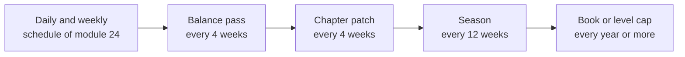
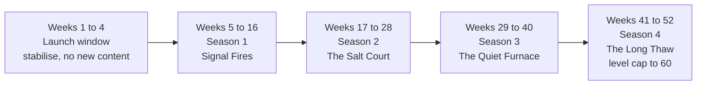

# Module 29: Designing a live game

- **Goal:** plan how an online RPG keeps changing after launch: a content cadence and roadmap, patches and hotfixes, events, balance passes, honest communication with players, handling backlash, controlling power creep, and a team rhythm that can sustain it.
- **Prerequisites:** [03 — Vision, pillars and loops](03-vision-pillars-loops.md), [14 — Progression and power curves](14-progression.md), [16 — Economy design](16-economy.md), [17 — Monetization design](17-monetization.md), [20 — Narrative design for a live game](20-narrative.md), [24 — Endgame and retention](24-endgame-retention.md), [25 — Balancing](25-balancing.md).
- **Simulation:** none
- **Facts checked:** October 2026 (prices, rules and product status change; re-check before reuse)

## In short

A live game is not a product that ships once. It is a **service with a promise**: the world keeps changing, and the rules stay fair while it does. Designing it means choosing a **cadence** (how often something new arrives), a **roadmap** (what and when, with honest confidence), a **patch discipline** (what changes how fast), and a **voice** (how you tell players what you did and why). The two long-term dangers are **power creep** (each release makes the last one obsolete) and **trust loss** (changes players feel were done to them). The worked example is the course game's first year after launch: four 12-week seasons with chapters, events, balance passes and a level-cap decision, plus its patch-note and dev-note conventions.

## 1. The concept

### 1.1 Terms

| Term | Meaning |
|---|---|
| **Live game (live service)** | A game that keeps receiving content, balance changes and events after launch |
| **Cadence** | The regular rhythm of releases ("a content patch every four weeks") |
| **Roadmap** | A plan of upcoming content, shown to the team or to players |
| **Patch** | A scheduled update to the game |
| **Hotfix** | An urgent, small fix released outside the schedule |
| **Maintenance window** | A planned time when servers are down for an update |
| **Season** | A fixed-length release unit with its own story, rewards and finale |
| **Event** | Limited-time content, often with its own rewards |
| **Balance patch** | A change to numbers (damage, costs, drops) to keep options fair |
| **Patch notes** | The official list of what changed |
| **Dev note (dev blog)** | A longer post where designers explain a decision or a plan |
| **Power creep** | Each release gives players more power than the last, so older content and gear stop mattering |
| **Sunsetting** | Retiring content, items, a mode, or the whole game |
| **Live ops** | The team and tools that run the game day to day |

### 1.2 The release rhythm

A live game has several clocks running at once. Players should be able to guess when the next one ticks.



The shorter the clock, the smaller and safer each change. The longer the clock, the bigger the promise.

## 2. The player's view

A player of a live game asks four things, often without saying so:

- **"Is it worth logging in?"** There is something new, and something to finish this week (module 24).
- **"Will my effort last?"** The gear and levels I worked for are not wiped by the next patch.
- **"Is it fair?"** The rules change for reasons I can understand, and the company does not take advantage of me.
- **"Do they listen?"** When many of us say a thing is broken, someone answers.

These serve the motivations of [module 01](01-player-experience.md): **Completion** (finish a season), **Community** (events everyone shares), **Discovery** (new places) and **Power** (growth). The live design supports the **meta loop** of module 03 by giving it a new horizon every few weeks. It threatens pillar 4 ("fair and respectful of time") whenever it creates pressure to log in, a missable reward or a surprise change.

## 3. The design space

### 3.1 Cadence models

| Model | How it works | Public examples (as of October 2026, approximate) | Strength | Cost |
|---|---|---|---|---|
| **Expansions** | A large paid or free release every 1–2 years, with small patches between | *World of Warcraft*, *Final Fantasy XIV* (major patches every few months, expansions every few years) | Big marketing moments; deep content | Long quiet periods; the old game feels abandoned before the expansion |
| **Seasons** | A fixed-length unit (8–16 weeks) with a theme, a pass and a finale | *Fortnite*, *Destiny 2* (seasons and episodes) | Predictable; a clear point to join or return | Constant content pressure; "season fatigue" |
| **Leagues (fresh start)** | A new world with a reset economy every few months | *Path of Exile* (leagues every few months) | Everyone starts equal; economy and power creep reset | Players lose progress each time; needs a permanent mode too |
| **Continuous drip** | Frequent small updates (every 1–4 weeks) | *Warframe*, *League of Legends* (a patch about every two weeks) | Always something new; fast fixes | Many small pieces; hard to build a story peak |

Most successful live games combine them: a steady **drip** of small patches and balance changes, a **season** as the unit of story and rewards, and an **expansion or book** as the unit of big change.

### 3.2 Roadmaps

A **roadmap** is a promise, so label how firm each part is.

| Horizon | Detail | Confidence label | Rule |
|---|---|---|---|
| **This chapter** (about 4 weeks) | Exact content and approximate dates | **Committed** | Change only for serious problems, and tell players |
| **This season** (12 weeks) | Themes and features | **Planned** | May move by a chapter |
| **Next season and beyond** | Direction only | **Exploring** | No dates; may be dropped |

**Rules for a public roadmap.**
1. **Dates are windows, not days** ("Chapter 2, week of 12 March").
2. **Never show what you are not ready to commit to** as a firm date. An announced feature that is cut costs more trust than one that was never announced.
3. **Slips are announced early.** A delay told at week 6 is a small problem. A delay discovered at week 12 is a trust problem.
4. **Show a recap of what shipped** next to what is coming, so the roadmap proves the team delivers.

Internally plan **one season in detail** (the beat sheet), **two seasons in outline**, and **one year as themes**, as in [module 20](20-narrative.md).

### 3.3 Patches and hotfixes

| Type | Content | Typical rhythm | Testing |
|---|---|---|---|
| **Content patch** | New chapter, dungeon, event | Every 4 weeks in the course game | Full test pass; a closed test of new systems |
| **Balance patch** | Numbers only | Every 4 weeks, offset from content | Simulation (module 25), a test on a test server |
| **Hotfix** | One urgent fix | As needed | Smallest possible test; a rollback plan |
| **Maintenance** | Planned downtime for any of the above | A fixed weekly slot | Announced in advance |

**Severity ladder for hotfixes.**

| Level | Example | Response |
|---|---|---|
| **S0** | An exploit that creates currency or items, a data loss, a login failure | Immediately, even by taking the game down; compensate |
| **S1** | A bug that blocks story progress, a dungeon that cannot be cleared | Within about 24 hours |
| **S2** | A common bug that does not block | Next scheduled patch |
| **S3** | Cosmetic issues | When convenient |

**Mobile means store review.** A client update on mobile goes through store review, which can take from hours to days, so a mobile game is built so that **numbers, schedules and events are data on the server**. Then most balance and event changes need no new client, and a patch day does not depend on the store ([module 27](27-platforms.md)).

### 3.4 Seasonal events and limited-time content

| Event type | Purpose | Example in the course game |
|---|---|---|
| **Seasonal (calendar)** | A shared celebration | A midwinter festival at the Lodge |
| **Story finale** | The shared peak of a season | The season's world boss mutation and a one-time scene |
| **Anniversary** | Thank players, bring lapsed ones back | A week of returning rewards |

**Event rules.**
- **Reward time-limited items that players can earn, never power.** Pillar 4 applies: no event gives combat power that is not earnable later.
- **Give the economy a budget.** An event is a faucet and a sink; set both on the economy model ([module 16](16-economy.md)). Event tokens are bound, capped and expire.
- **Do not create daily chores.** An event that asks for 45 minutes a day for two weeks punishes the player who cannot.
- **Bring old events back.** Missable cosmetics return, as in the pass rule of [module 17](17-monetization.md).

### 3.5 Balance patches

The mechanics of balancing (spreadsheets, benchmarks, power budgets) are in [module 25](25-balancing.md). The live rules are about **how and when**:

1. **Scheduled, not random.** Numbers change on set days, except for emergencies.
2. **Small and explained.** Change a few things at a time so you can tell what worked.
3. **Buff before nerf.** Raise the weak instead of lowering the strong, where the game's power budget allows.
4. **Compensate nerfs.** If a skill that players built on is weakened, give them a way to change (a free respec for a week).
5. **Tell the truth.** Every number change appears in the notes. A "stealth" nerf teaches players to distrust notes.
6. **Preview big changes.** A dev note a few days before a large change gives players time to respond.
7. **Check after.** Compare the benchmark results (module 25) and the player counts by class one week later.

### 3.6 Communicating with players

| Channel | Audience | Content | Rhythm |
|---|---|---|---|
| **Patch notes** | Every player | What changed, with numbers | Every patch |
| **Dev notes** | Engaged players | Why we did it; what we learned; what is next | Monthly or per chapter |
| **Roadmap** | Everyone | What is coming, with confidence labels | Updated every chapter |
| **Post-incident report** | Everyone | What went wrong, who was affected, what changed | Within days of a serious incident |

**Principles.**
- **Numbers over adjectives.** "Barrage damage 1.0× → 0.9× per tick" beats "Barrage was slightly reduced."
- **Give the reason.** One sentence per change: what was wrong, what is the effect.
- **Say what you do not know.** "We are investigating" is acceptable. A guess presented as a fact is not.

Some live games involve players in decisions directly. *Old School RuneScape* publishes proposed updates and lets players vote, and a proposal needs 75% approval to pass (as of October 2026, per the game's public wiki). That is the strongest form of the "do they listen" promise, and it limits what the designers can do.

### 3.7 Handling backlash

Backlash is a signal. Treat it in four steps:

1. **Triage (hours).** What kind of problem is it? A **bug**, a **design decision players dislike**, a **communication failure** (the change was fine, the notes were not), or a **trust issue** (players feel cheated, usually about money).
2. **Acknowledge (within a day).** Say what you heard, in specifics. Do not defend yet.
3. **Decide (within a few days).** Revert, change, hold or compensate. State the reason, and the date of the next update.
4. **Follow up (about a week).** Report what changed and the data after.

**Do and do not.**

| Do | Do not |
|---|---|
| Fix the cause, then apologise in plain words | Apologise without a change |
| Admit a mistake once, with what changes | Argue each complaint in public |
| Compensate for lost time or items, in the same kind of reward | Pay back a harm with premium currency that pushes spending |
| Revert fast when a rule is clearly harmful | Defend a decision by stating the player "does not understand" |

A public example: in 2017 a large publisher turned off real-money purchases in a big game just before launch after a wave of criticism of its progression design. The lesson is that an early, clear reversal costs less than a sustained dispute.

### 3.8 Reading community signals

Different sources show different things, and each has a bias.

| Source | Shows | Bias |
|---|---|---|
| **Support tickets** | Real problems, in volume | Only people who write; skews to bugs and payments |
| **Store reviews and ratings** | Mood of casual players, platform bugs | Extreme opinions; review bombing |
| **Forums and chat channels** | Detailed opinions and discussions | A loud, engaged minority |
| **Social media and streamers** | Reach and mood; trends | Fast, emotional, short-lived |
| **Surveys** | Representative views, if sampled well | Wording and response bias |
| **Telemetry** | What everyone actually does | Cannot say why |

**Signal ladder.** Treat a claim in four levels: **anecdote** (one post), **pattern** (three or more independent sources), **measured** (telemetry confirms), **decided** (a design change). Do not act on level one, and do not wait for level four on a serious harm.

**Weekly voice-of-player report.** Five topics ranked by volume, with the ticket count per 1,000 daily players, the store rating trend and one representative quote for each. It is a summary for the design team, not a vote.

**Loud minority and silent majority.** The players who post are a few percent of the audience. Compare what they say with what everyone does (module 28). When they disagree, ask why before choosing a side.

### 3.9 Power creep and sunsetting

**Power creep** is the slow rise of power across releases. Each new gear tier must beat the old one to be worth chasing, and new enemies grow to match it. After several releases, old content is trivial, old gear is trash, and new players cannot catch up. [Module 14](14-progression.md) gives the model: if each of three expansions raises the gear ceiling by 20% and old content is never retuned, old content sits at about 2.2 times its original power ratio.

| Tool | How it limits creep | Public example (as of October 2026) | Cost |
|---|---|---|---|
| **Small steps** | Each tier adds a few percent | Common in seasonal games | Needs many releases to feel growth |
| **Horizontal growth** | New options, not new power | Module 14 | Needs design-heavy content |
| **Level or stat squish** | Compress numbers back down | *World of Warcraft* levels 1–120 compressed to 1–50 in 2020 | Large one-time cost; players are unhappy for a while |
| **Rotation** | Old items leave a mode | *Hearthstone*'s yearly rotation of its standard mode | Players lose items; needs a permanent mode |
| **Scaling old content** | Old dungeons adjust to the player | Common | Removes the feeling of growing stronger |

**Sunsetting.** Retire in the least harmful order: **rewards** (old tiers become cheaper or lower value) before **content** (rarely removed), before **modes** or **items** (announced early), before **the game itself**. For an end of service, announce far ahead, stop selling premium currency at once, refund or convert unspent premium currency where the law or the store requires it, and let players keep access to what they own as long as possible (laws differ by region; check them).

### 3.10 Team rhythm

A live team is a **pipeline**, not a project. At any moment it works on three seasons: one live, one in production, one in the outline.

| Practice | Why |
|---|---|
| **Fixed cadence** | The team can plan; players can predict |
| **Content freeze before release** | Time for testing and store review; reduces crunch |
| **A weekly live review** | Metrics and community topics reach the design team every week |
| **No deploys at the end of the week** | Problems found on a Friday should not cost a weekend |
| **Capacity split** | Part of the team is protected for live work, tech debt and experiments, so content never eats all of it |

## 4. Tuning and pitfalls

### 4.1 Signals that something is wrong

| Signal | Probable cause |
|---|---|
| Returning players say they do not know what to do | No recap, no entry point (module 20) |
| Daily active players fall in weeks 8–12 of each season | Content ran out; the pass is a chore |
| Complaints that "you did not tell us" | Stealth changes; patch notes that skip numbers |
| The same class tops the charts for several patches | Balance passes are too small or too slow (module 25) |

### 4.2 Classic failures of a long-running live game

- **Cadence you cannot keep.** A promise of weekly content collapses into months of silence. Choose a cadence you can sustain through the worst month.
- **Content treadmill.** Players consume a month's content in a weekend. Fix: depth and repeatable content, not only new content.
- **Fear-of-missing-out design.** Missable rewards and daily streaks make players feel they owe the game their time. Fix: let rewards return.
- **Power creep spiral.** Each season needs a bigger number. Fix: a written power budget and horizontal growth.
- **Unannounced changes.** Players discover a nerf in play. Fix: the notes list every number.

## 5. Worked example

The course game ([the fact sheet](_course-game.md)). All numbers are invented. The first release is level 50, five classes, ten dungeons and one world boss. This is the plan for the **first year after launch**, and the conventions that go with it.

### 5.1 Intent

- **Predictable rhythm:** the same days, every month, for both PC and phone.
- **Pillar 4:** nothing in the live plan creates pressure to log in daily, a missable power reward or a surprise.
- **Pillar 3:** each season adds group content and a shared finale.
- **Story serial** ([module 20](20-narrative.md)): each season answers one question and opens one, with at most two new named characters.
- **Constraint:** a small team: about 40 minutes of story per chapter, and one new dungeon a season.

### 5.2 The year at a glance

Weeks count from launch. A season is **12 weeks: three chapters (patches in weeks 1, 5 and 9) and a finale in week 12**, as in module 20. Balance patches go in weeks 3, 7 and 11 of each season, offset from the content patches so the two do not blur.



| Weeks | Block | Story and content | Events and world boss | Balance and systems |
|---|---|---|---|---|
| **1–4** | **Launch window** | None new. Hotfixes only, server capacity, first reads of the data | Launch welcome event (week 1); first Ash Tide of the live schedule | A first balance read at week 3 (no changes unless S0/S1) |
| **5–16** | **Season 1: Signal Fires** | New coastal slice at level 50; Kael's fate stays open; dungeon 11 (week 9); finale week 16 | Season mutation of the Ash Tide: *Brine Tide* (waves push heroes back); a 2-week mid-season event (weeks 10–11) | Balance weeks 7, 11, 15; the season pass starts (module 17) |
| **17–28** | **Season 2: The Salt Court** | A faction story with cosmetic factions only; dungeon 12 (week 21); finale week 28 | *Court Tide* (two watches must break separate limbs); a 2-week event (weeks 22–23) | Balance weeks 19, 23, 27; **level-cap go or no-go at week 28** |
| **29–40** | **Season 3: The Quiet Furnace** | Closes the Book Two question and opens a new tier; dungeon 13 (week 33); finale week 40 | *Quiet Tide* (silence zones); a 2-week event (weeks 34–35) | Balance weeks 31, 35, 39; first **gear tier retune** of old content |
| **41–52** | **Season 4: The Long Thaw** | **Book Three** begins; **level cap 50 to 60**; a fifth region slice at levels 50–60; dungeon 14 with the new region (week 41) and dungeon 15 (week 49); finale week 52 | *Thaw Tide*; a 2-week event (weeks 46–47); **first-anniversary week** together with the finale (week 52) | Balance weeks 43, 47, 51; the cap raise brings class retunes |

**Constants for the year.**
- One new named dungeon about every 8 to 12 weeks (five in the year: 11 to 15).
- At most two new named characters per season, at most one leaves or dies (module 20).
- Every chapter stays playable for ever. Old events return once a year with the same rewards.
- No new class and no new currency in the first year. A sixth class is a year-two decision (reviewed at week 40).
- The season pass is the 12-week pass of [module 17](17-monetization.md). Its cosmetics return to the shop 12 weeks after the season ends.

### 5.3 What a season contains

| Season week | Content | Notes |
|---|---|---|
| **1** | **Chapter 1 patch**: story quests (about 40 minutes), season pass opens, recap quest | Entry point at level 50 for new and returning players |
| **2** | Live review; hotfixes | Not a content week |
| **3** | **Balance patch** | At most 8 number changes |
| **5** | **Chapter 2 patch**: story and the season's new dungeon | |
| **6–7** | **Mid-season event** (two weeks) | Event tokens, cosmetics |
| **7** | **Balance patch** | |
| **9** | **Chapter 3 patch**: story, the finale's setup | |
| **11** | **Balance patch** | The last of the season |
| **12** | **Finale**: a shared event, the world boss mutation at its peak, one scene of about 5 minutes (module 20) | Pass ends; preview of the next season's question |

### 5.4 The level-cap decision

Level 50 is the cap at launch. Raising it is one of the biggest choices in a live RPG: it resets the feeling of growth for everybody and costs a region of content. The course game decides it with a **gate**, not a date.

**Options.**

| Option | What it means | For | Against |
|---|---|---|---|
| **A. Raise now** (season 1) | Cap 60 within a quarter of launch | Quick novelty | Content for 50 is untested; no data; the launch audience is still arriving |
| **B. Hold, grow horizontally** | Keep 50; add gear tiers, dungeon tiers and path options | No loss of effort; cheaper | Risk of stagnation; players ask for "something to level" |
| **C. Raise by 5** | Cap 55 | Smaller content cost | Two raises in a short time; a 5-level step feels cheap |
| **D. Hold through Book Two, raise with Book Three** (chosen) | Cap 60 at the start of season 4, if the gate passes | Time to learn from data; the story's new tier matches the new level range | A year of waiting; needs a fallback |

**Gate (data, at week 28).** Go only if, among active players:
- at least 40% are at the cap (the audience has run out of levels),
- the median time at the cap is at least 6 weeks and the share of capped players with a full set of Epic-rarity gear is above 25% (the horizontal growth is used up),
- the new-player journey stays healthy: a raise must not push the time to the cap far beyond the 25 hours of [module 14](14-progression.md).

If the gate fails, the fallback is **option B** for another season, announced at week 28.

**Why it is not a surprise.** The roadmap says "cap raise: **Exploring**" from week 16, "**Planned**" from week 28 if the gate passes, and "**Committed**" from week 29 (twelve weeks before ship), following the roadmap rules of 3.2. Production of the new region slice starts at week 17 as a hedge, because the slice is also useful as horizontal content if the gate fails.

**Numbers (module 14).** Level power is 1 + 0.12 × (L − 1), so a level-60 hero is 8.08 against 6.88 at level 50: about 17% more power. The XP to leave level 50 is round(250 × 50^1.8), about 286,000. A cap raise of 10 levels is one region of about 9 hours (like the last region of module 14), within the rule of at most 10 levels per raise. A recap quest brings level-50 heroes into Book Three at once, and new content is tuned to a power ratio of 1.0 to 1.3 for a hero in last season's gear (module 14).

### 5.5 Balance passes

Rules (extending [module 25](25-balancing.md)):
- **Cadence:** a scheduled balance patch in weeks 3, 7 and 11 of each season (about every 4 weeks), none in finale weeks.
- **Size:** at most 8 number changes, and none more than 10% from the old value unless an emergency (S0/S1) justifies it.
- **Direction:** buff the weak before nerfing the strong, at roughly 2 buffs to 1 nerf.
- **Benchmarks:** the three benchmark fights (single boss, pack, group dungeon). Paths and classes stay within 5% of the class median (module 09). A class outside 10% for two patches in a row is retuned.
- **Compensation:** a hero whose class or path was changed gets a **free respec** for 7 days (still at most one a day), because respec never costs real money.
- **Preview:** any change above 10%, or any economy change, is announced in a dev note at least 3 days before.
- **After:** a one-week review against the same benchmarks and the class pick rate, published in the next dev note.

### 5.6 The power budget

The aim is to avoid the spiral of [module 14](14-progression.md) while still giving players something to chase.
- **Each season's new gear tier raises the best stat budget by at most 8%** (about 1.36 times over four seasons). New content is tuned for a power ratio of 1.0 to 1.3 for a hero in the previous tier.
- **Catch-up path:** Frontier Marks at the weekly vendor buy the previous tier, and tempering (module 15) remains the sink. A new player at the start of a season should reach last tier's gear within a few weeks, and not need the first tiers.
- **Old dungeons keep their meaning** by feeding crafting materials and trophy items, and by hosting the weekly schedule of [module 24](24-endgame-retention.md), not by being retuned to every new tier.
- **Retune only with data.** Old content is retuned at week 29 only if the clear time for the previous tier has fallen more than 40% against the launch benchmark.

### 5.7 Events

| Rule | Value |
|---|---|
| **Frequency** | One 2-week event per season, plus the finale, the launch week and the anniversary |
| **Currency** | Event tokens: bound, capped (for example 300 a week), expire when the event ends, spent at an event vendor |
| **Rewards** | Cosmetics, emotes, crafting materials. No gear above the current tier and no combat power that cannot be earned later |
| **Time** | No daily minimum; a full set takes about 4 hours across the 2 weeks, and it can be done in 15-minute sessions |
| **Missable rewards** | Return once a year with the same rules |
| **Economy** | The faucet and sink for each event are set on the model of module 16 before the event ships |

### 5.8 Patch-note conventions

**Naming.** `Season.Chapter.Patch`: `1.2.0` is the season-1 chapter-2 content patch, `1.2.1` the scheduled balance patch, `1.2.2` and later are hotfixes. Server-side changes are tagged `[server]` in the notes.

**Days.** All patches release in the weekly maintenance slot of [module 24](24-endgame-retention.md), published four weeks ahead. Hotfixes may be released at any time, and are announced when they begin and when they end.

**Structure of every note.**

1. **Title, date, version, maintenance window, download size.**
2. **Highlights** (three lines at most).
3. **New** (content and features).
4. **Balance**: a table, one row per change: `Area | Old | New | Why`.
5. **Economy**: any change to a source, sink, price or cap, with the number.
6. **Shop**: what enters or leaves.
7. **Fixes**: grouped by area.
8. **Known issues** and the workaround.

**Rules.**
- **Every number change is listed.** A change not in the notes did not happen.
- **One sentence of reason for every balance change.**
- **No adjectives for numbers** ("slightly", "a bit").
- **All languages and both platforms at the same time.**
- **Notes are never edited afterwards** except to fix an error, and the correction is labelled.

**Example (invented).**

```text
Patch 1.2.1: Balance (Season 1, week 7)
Maintenance: weekly slot, about 90 minutes. Download: 40 MB. [server] items need no download.

Highlights
- Ranger pack damage lowered; Warden Avenger buffed.
- Tempering Charm price lowered.

Balance
| Area                    | Old       | New       | Why                                             |
|-------------------------|-----------|-----------|-------------------------------------------------|
| Ranger: Barrage         | 1.0x tick | 0.9x tick | Pack benchmark 12% above the class median       |
| Warden: Avenger Path    | 3% armour | 4% armour | Boss benchmark 7% below the Bulwark Path        |

Economy
- Tempering Charm: 400 gold to 360 gold. Why: players at +8 to +10 held back.

Known issues
- The "Previously" recap can show a blank line on tablets. Workaround: reopen the journal.
```

### 5.9 Dev-note conventions

| Type | When | Length | Content |
|---|---|---|---|
| **Roadmap note** | At each chapter patch | 600–900 words | The next 12 weeks, with labels **Committed / Planned / Exploring**, and what shipped |
| **Design note** | Before a big change, or after a surprise | 800–1,200 words | **Problem, data, decision, expected result, how we will check**, and what we considered and rejected |
| **Balance note** | After each balance patch | 400–600 words | The benchmark results, what we saw, what is next |
| **Post-incident report** | Within 5 working days of S0 or a long outage | 400–800 words | What happened, who was affected, what we did, how we compensated, what changes |

**Voice rules.** Plain and specific, in the first person plural. One idea per paragraph. Show the number, not only the conclusion. Admit a mistake in one sentence and move to what changes. No promises about "Exploring" items. No blame of players or of teams.

### 5.10 Incident and backlash playbook

| Time | Action | Owner |
|---|---|---|
| **Within 1 hour (S0)** | Confirm; stop the harm (take the feature or server down if needed); open a status notice | On-call engineer and producer |
| **Within 4 hours** | Triage: bug, design, communication or trust; pick the response | Live design lead |
| **Within 24 hours** | Public acknowledgement with what we know and the next update time | Community lead |
| **Within 72 hours** | Decision: revert, fix, hold or compensate, with the reason | Design lead and producer |
| **Within 5 working days** | Post-incident report | Producer |
| **After 1 week** | Follow-up with data; the lessons added to the checklist | Live design lead |

**Compensation rule.** Compensate in the same kind of reward that was lost (gold for gold, materials for materials). If real money was spent on something that failed, refund in the original form. Never compensate with random items or with offers that push further spending.

### 5.11 Team rhythm

- **Pipeline:** season N is live, season N+1 is in production (beat sheet and content in progress), season N+2 is an outline ([module 20](20-narrative.md)).
- **Content-complete** three weeks before each chapter patch; the build goes to store review at least a week before.
- **Weekly live review** (Monday): ten metrics, the top five community topics, ticket volume per 1,000 daily players.
- **Balance decisions** two days before each balance patch; **no deploys at the end of the week**.
- **Capacity:** about 60% season content, 20% live work and balance, 10% tech debt, 10% experiments.
- **Finale week:** no balance patch; the team prepares the next season's first chapter. After each season, a retrospective updates the roadmap.

### 5.12 What was cut

- **Daily login rewards and streaks.** They contradict pillar 4.

### 5.13 How the design would differ for another kind of game

| Game type | Live design would change to... |
|---|---|
| **Hero-collection RPG** | New heroes every few weeks; banners and events are the cadence; power creep is the main danger and is handled by rotation or resets |
| **Competitive arena** | A balance patch every one or two weeks; a ranked season each quarter; a public test realm; esports calendar |
| **Single-player story RPG** | Post-launch patches, then paid expansions; few events; no live ops |
| **Sandbox or survival** | Large content updates a few times a year; player-made content; world resets or new maps |

## Key takeaways

- A live game is a **service with a promise**: new content and fair rules. Choose a cadence the team can keep through its worst month.
- Use the **season** as the unit of story and rewards, the **chapter** as the patch, and a **book or level cap** as the unit of big change.
- Label every roadmap item **Committed, Planned or Exploring**, give dates as windows, and announce slips early.
- Change numbers on a **schedule**, in **small steps**, with **every change in the notes and a reason for each**, and compensate nerfs.
- Handle backlash by triage, acknowledgement within a day, a decision within days and a follow-up with data. Read community signals by source and confirm them with telemetry.
- Control **power creep** with a written budget, small steps, horizontal growth and catch-up paths, and retire rewards before content.
- Build a **pipeline** (one season live, one in production, one in outline), with freezes, no end-of-week deploys and protected capacity.

## Further reading

- Riot Games, League of Legends patch notes (a public, long-running example of numbered, reasoned notes): https://www.leagueoflegends.com/en-us/news/tags/patch-notes/
- Old School RuneScape wiki, the poll system: https://oldschool.runescape.wiki/w/Update:Dev_Blog:_The_Poll_System
- Path of Exile, league and patch news (a public example of a league cadence): https://www.pathofexile.com/forum/view-forum/news
- Guild Wars 2 wiki, Living World Season 1 (keeping released story playable): https://wiki.guildwars2.com/wiki/Living_World_Season_1
- Warcraft Wiki, Level squish (public example of a level squish): https://warcraft.wiki.gg/wiki/Level_squish
