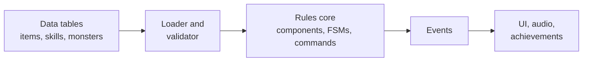
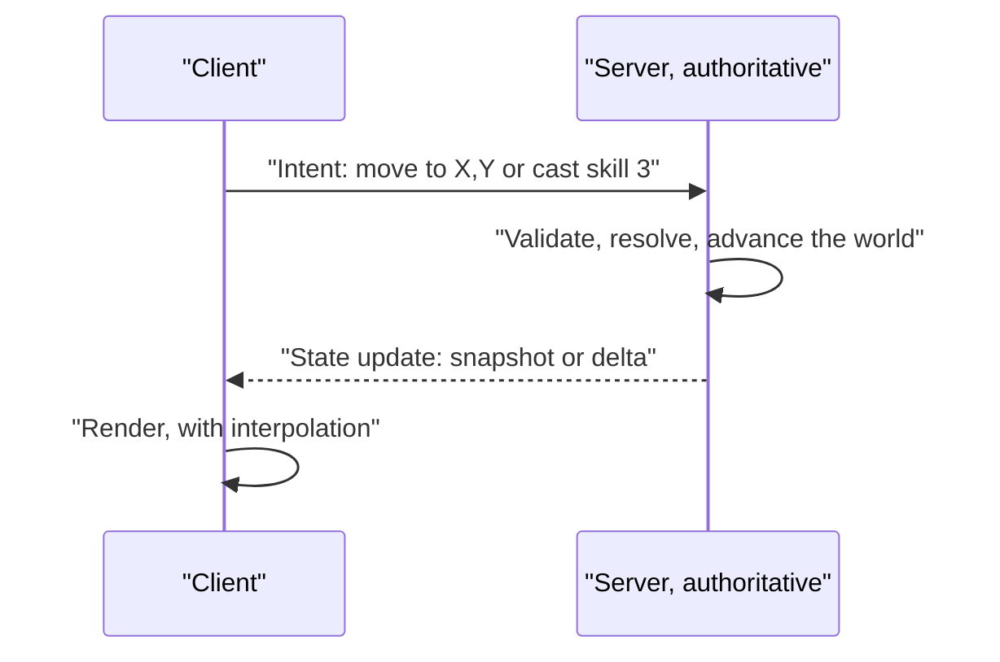
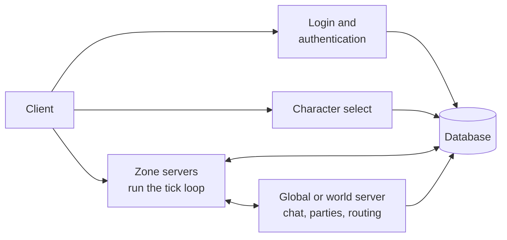
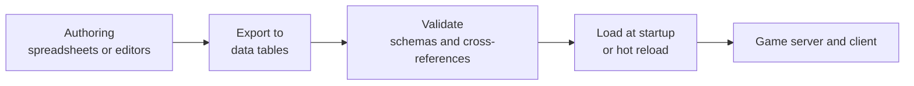

# Module 00: Game development fundamentals

- **Goal:** hold a map of the core ideas behind real-time and online games (the loop, common code patterns, server authority, state sync, persistence, content and testing), so that each deeper module has a place to attach.
- **Prerequisites:** none. You should know ordinary application development (HTTP, databases, a typed language).
- **Facts checked:** October 2026 (prices, licences and product status change; re-check before reuse)
- **Example:** none. This module is an overview; the examples start at module 01.

## In short

A web app waits for a request and answers it. A game is a **continuous simulation**: a loop keeps advancing the world whether or not anyone is doing anything. Almost every other difference follows from that: updating is separated from drawing, time moves in fixed steps, and code is organised as components, state machines and commands rather than request handlers. An online game adds one rule on top: the **server owns the truth**, clients send intent, and the server tells everyone what happened, while hiding network delay with interpolation and, only when the genre demands it, prediction. Persistence is split in two: fast in-memory state for what is happening this second, and a database for anything a player would be upset to lose, with items and currency handled transactionally. Content lives in data tables, and a deterministic core makes replays, headless balance runs and tests possible.

## 1. How a game differs from an app

### 1.1 Continuous simulation

A web app is **request/response**: nothing happens until a user acts. A game keeps moving: monsters walk, cooldowns count down, projectiles fly. The program therefore cannot be organised around handlers. It is organised around a **loop** that never stops while the game runs.

```
while (running) {
    input = pollInput()
    update(input, dt)     // advance the simulation
    render()              // draw the current state
}
```

Robert Nystrom's *Game Programming Patterns* calls this the heartbeat of a game: it decouples the progress of game time from user input and processor speed. A request handler runs once and returns; a game loop runs for the whole session.

### 1.2 Frame versus tick

| Term | One pass of | Driven by | Exists on |
|---|---|---|---|
| **Frame** | rendering (redrawing the screen) | the display's refresh rate | the client only |
| **Tick** | simulation (one step of game logic) | a configured rate, for example 10 or 20 per second | server, and the client if it simulates |

A headless server has ticks and no frames: there is nothing to draw, so its rate is a design choice, not a monitor's.

### 1.3 The update/render split

Game code keeps two steps apart: **updating state** and **drawing state**. The renderer must be able to draw without changing the simulation, otherwise two draws of "the same instant" disagree. A server often has no renderer at all. A client may draw more often than it receives updates, so rendering keeps its own notion of time.

### 1.4 Fixed timestep

If `update(dt)` receives whatever time the last iteration took, the simulation depends on how fast the machine ran. Behaviour differs between 30 and 144 frames per second, replays drift, and a long frame can push a fast object through a wall. The standard cure, from Glenn Fiedler's "Fix Your Timestep!", is a **fixed delta** with an accumulator:

```
accumulator += frameTime
while (accumulator >= FIXED_DT) {
    update(FIXED_DT)
    accumulator -= FIXED_DT
}
render(accumulator / FIXED_DT)   // blend for smoothness
```

This is why server tick rates are quoted as fixed numbers. A cap on catch-up steps stops a stall from snowballing (the "spiral of death").

Depth: [module 03, the game loop and time](03-game-loop.md) covers timers, determinism and a runnable fixed-tick loop.

## 2. Patterns inside a game

Games have recurring designs distinct from the layered patterns of business software. Nystrom's free book is the best catalogue; the patterns below follow it.

### 2.1 Game object and component

A naive design gives every game object a big class with `if (isPlayer)` branches, or a deep inheritance tree. It turns brittle quickly. The **component pattern** makes an entity a thin shell that holds parts (health, movement, AI, appearance), so behaviour is composed, not inherited. It is the same advice as composition over inheritance anywhere else.

### 2.2 ECS

**Entity-Component-System** goes further and inverts control:

- **Entity:** just an ID.
- **Component:** plain data attached to an entity, for example `Position` or `Health`.
- **System:** logic that runs over every entity holding a given set of components.

Components of one type sit contiguously in arrays, so CPU caches behave well and thousands of entities are processed uniformly. The cost is indirection: relationships such as "this pet follows that character" are less natural, and the style is unfamiliar to object-oriented programmers.

| Situation | Plain components | Full ECS |
|---|---|---|
| Hundreds of entities, hand-authored logic (typical RPG zone) | Good fit | Indirection tax outweighs the gain |
| Tens of thousands of similar entities (swarms, armies, particles) | Struggles | Good fit |
| Many designers adding behaviour as data | Fine | Fine |

The rule: reach for ECS when many homogeneous entities are updated every tick, not by default. Depth: [module 01](01-engine-build-or-buy.md) builds a minimal entity and system loop; [module 04](04-entities-world.md) covers entities and the world.

### 2.3 State machines

A **finite state machine (FSM)** keeps an entity in exactly one of a known set of states (`Idle`, `Moving`, `Attacking`, `Stunned`, `Dead`) with explicit transitions. Compared with a pile of booleans, illegal combinations cannot be represented and transitions are testable. FSMs are the oldest, most reliable tool for character control and simple AI. Behaviour trees and utility scoring are the usual upgrades when a state machine starts to explode in size; see [module 12](12-ai.md).

### 2.4 Commands for input

Instead of input handlers calling game logic directly, input becomes **command objects** (`Move`, `UseSkill`) that can be queued, logged, validated, sent over a network and replayed. This is exactly the shape of an online client: it never says "I am now at (x, y)"; it sends an intent ("move toward (x, y)", "cast skill 3 on target T") and the server decides. [Module 03](03-game-loop.md) builds a sequenced command queue.

### 2.5 Events and observer

Systems are naturally decoupled: a hit lands, then damage, user interface, audio and achievements each react. Games use the **observer pattern**, usually as an event bus per scene or zone. It is the same idea as domain events in a business backend, applied every tick.

### 2.6 Data-driven design

Hardcoding "this sword deals 120 damage" makes every balance change a code change. In a **data-driven** design the numbers, and often the formulas, live in tables that designers edit, and code is a generic interpreter of them. Nystrom's "Type Object" is the object-oriented form. Depth: [module 05](05-data-properties.md) covers data tables and derived properties.



## 3. Online games in one page

An online game is a simulation that many clients watch and steer at once. HTTP has no equivalent, so this is the least familiar territory for application developers.

### 3.1 Server authority

**The server owns the truth.** Clients send inputs; the server simulates and reports outcomes. A client cannot lie about state it does not own, which is what stops most cheating. The price is latency and the work of making the game still feel responsive. Gabriel Gambetta's *Client-Server Game Architecture* series is the standard introduction.



### 3.2 Snapshots and deltas

| Strategy | What is sent | Strength | Weakness |
|---|---|---|---|
| **Snapshot** | the full relevant state every update | simple; a lost packet heals itself on the next one | wastes bandwidth resending what did not change |
| **Delta** | only what changed since a state the client is known to have | much smaller | needs per-client tracking and a plan for lost updates (periodic full snapshot or a known baseline) |

Small worlds can use snapshots of "what is near this player" for a long time. Deltas are an optimisation for when bandwidth is measured, not guessed. Many MMOs instead send events: "entity entered view", "entity left view", "entity moved".

### 3.3 Interpolation

Updates may arrive every 100 ms while the screen redraws every 16 ms. Snapping to the newest position looks jerky. With **interpolation** the client renders slightly in the past and blends between the last two known states. A small constant delay buys smooth motion. It is used for every entity the player does not control.

### 3.4 Prediction and reconciliation

For the player's own character, even 100 ms of delay can feel wrong. With **client-side prediction** the client applies its own input immediately and sends it to the server; when the authoritative result arrives, **reconciliation** corrects any difference. Prediction is essential for precision games (shooters, fighters) and costly to build and debug. Click-to-move RPGs with cooldown-paced skills tolerate latency far better, and usually settle for instant local feedback (start the animation, show the cooldown) with the server confirming.

| Genre | Typical choice |
|---|---|
| Competitive shooter | prediction and reconciliation, plus lag compensation |
| Action RPG with direct control | light prediction of movement |
| Click-to-move, cooldown-paced RPG | local feedback plus interpolation; no full prediction |

### 3.5 Tick rate

The **tick rate** is how many simulation steps per second the server runs. Higher means more precise and responsive, at more CPU and bandwidth. Competitive shooters run 64 to 128 per second; many MMOs run world simulation at roughly 10 to 20 per second (or even less when idle) and smooth motion on the client. The right rate is set by how quickly the gameplay can punish a late answer.

### 3.6 Interest management

A server should not describe the whole world to every client. **Interest management** (area of interest, AOI) sends each client only what is near its character. It saves bandwidth and prevents leaks such as seeing hidden enemies through walls. Typical implementations are a spatial grid or a "sight range" check; in a small instance, "everything in this instance" is the area of interest. Depth: [module 18](18-state-sync.md).

### 3.7 Zones, instances and channels

| Concept | What it is | Why it exists |
|---|---|---|
| **Zone** | a distinct map with its own entities and simulation | the unit of simulation and of server assignment |
| **Instance** | a private copy of a zone for one player or party | fights and loot do not interact with anyone else |
| **Channel** | a parallel copy of a shared zone | caps population per copy and scales horizontally |

### 3.8 How MMO servers are usually split

Most MMO backends divide into roles that can be scaled and restarted separately:



- **Login and authentication** verifies credentials and issues a session token; it has no game loop.
- **Character selection** lists characters and hands the player to a zone.
- **Zone servers** hold the live, ticking simulation for one or more zones.
- **A global or world service** carries what crosses zones: chat, parties, friends, routing between zones.
- **The database** is the durable source of truth.

Depth: [module 19](19-server-architecture.md).

### 3.9 Transport and wire format

| Choice | Option A | Option B | Rule of thumb |
|---|---|---|---|
| Protocol | **TCP or WebSocket**: reliable, ordered, simple, works through browsers; a lost packet stalls the ones behind it | **UDP**: unordered and unreliable by default, so you build what you need; no stalls | cooldown-paced RPGs do well on TCP; twitch games need UDP-style transports |
| Encoding | **Text (JSON)**: readable, easy to debug, larger and slower to parse | **Binary** (hand-rolled or a schema format): compact and fast, harder to read | start text while the protocol changes; go binary for frequent per-tick messages |

Reliability, ordering and encoding are separate decisions. A game often uses a reliable channel for chat and inventory, and a lighter one for movement. Depth: [module 17](17-networking.md); security of the wire is in [module 21](21-security.md).

## 4. Persistence, content and testing basics

### 4.1 Memory versus database

Rule of thumb: **the database is the durable source of truth; memory holds the hot state of whatever is active now.**

| Mostly in the database | Mostly in memory while a zone or session is active |
|---|---|
| Character sheet, levels, base stats | Current HP, position and animation state |
| Inventory contents, currency balances | Buffs, cooldowns, aggro tables |
| Quest and story progress, unlocks | AI state (current FSM state, current path) |
| Definitions of items, skills, monsters (or loaded from data files) | Per-zone entity list and spatial index |

The in-memory zone state may be the only copy of "what is happening this exact tick". It must never be the only copy of anything a player would be upset to lose.

### 4.2 Checkpointing

Writing to the database on every tick would crush it. **Write-behind** persistence changes memory immediately and flushes at checkpoints:

- after meaningful events (an item picked up, a quest completed),
- on a periodic interval as a safety net,
- when a session ends, the player changes zone, or the server shuts down gracefully.

The trade-off is that a crash can lose the last few seconds of ordinary state. That is acceptable for position or health, not for items and currency.

### 4.3 Items and currency need transactions

A lost write unfairly costs a player an item. A **double-applied** write (a retry that grants the same drop twice, or a race between two actions) gives one away, which is a **duplication exploit**, the most damaging bug in an economy. Practices:

- Treat each item or currency change as one database transaction, never as "read the balance, compute in code, write it back".
- Give retryable operations an **idempotency key**, so repeating a grant is a no-op.
- Keep an append-only **ledger** of changes that can rebuild the correct balance.
- Never trust the client's claim about what it holds.

Depth: [module 20](20-persistence.md).

### 4.4 The content pipeline

Content is produced by designers and consumed by servers and clients, so it needs a small pipeline:



Validation matters most: a mistyped reference should fail at load time with a clear message, not as a mystery mid-game. Text shown to players belongs in a string table keyed by ID, so localisation does not touch code. Depth: [module 24](24-pipeline-testing.md).

### 4.5 Determinism, replays and headless simulation

Games are hard to test because behaviour unfolds over time and depends on randomness and, online, on other players. One design choice unlocks most of the cure: make the rules core **deterministic**, so that the same starting state, seed and commands always produce the same result. That means the core takes time as a tick count and randomness as an injected, seeded generator, rather than reading a clock or an ambient random source.

- **Replays:** a replay is just the seed plus the recorded command log, run again. It is also the best bug report a player can send.
- **Headless simulation:** run the core with no graphics and no network, driven by scripted bots, to play a boss fight ten thousand times and read off win rate and duration. This is standard for balancing.
- **Ordinary unit tests:** "given this seed, this stat block and this skill, the damage is exactly N."
- **Debug overlays:** a toggle in the client that draws hidden state (hit areas, aggro ranges, AI state, current tick and round-trip time). Text logs are weak for spatial, timed bugs.

Depth: [module 03](03-game-loop.md) shows a deterministic loop with a replay test, and [module 24](24-pipeline-testing.md) covers data checks and replay testing at scale.

## 5. Design space at a glance

Every later module opens with the options that exist across game types. The table is the map: it names the main choice of each area and points to the module that develops it.

| Area | Typical options | Deciding factor | Module |
|---|---|---|---|
| Control | click-to-move, direct (WASD) control, a single character, a party of several | genre and pace of combat | [13](13-party-control.md) |
| Combat | tab-target with cooldowns, action combat with hit detection | how much latency the gameplay tolerates | [08](08-stats-combat.md), [09](09-action-combat.md) |
| Time | variable step, fixed tick, event-driven | need for replay and determinism | [03](03-game-loop.md) |
| Network model | authoritative server with interpolation, plus prediction for precision genres | cheating risk and responsiveness | [17](17-networking.md), [18](18-state-sync.md) |
| World | one big map, zones, instances, channels | population per area | [04](04-entities-world.md), [19](19-server-architecture.md) |
| Content | code, data tables, scripts | who authors content and how often it changes | [05](05-data-properties.md), [06](06-scripting.md) |
| Engine | adopt Unreal, Unity or Godot, or build a custom core | whether the game needs a persistent, sharded server | [01](01-engine-build-or-buy.md) |

## 6. Build or buy, in one paragraph

A full engine (Unreal, Unity, Godot) gives you rendering, an editor, input, audio and session-based multiplayer. None of them gives you a persistent, authoritative, zone-sharded world with transactional items. A small team can build the headless rules core and server itself with open tools and AI assistance, and should buy or adopt the narrow, deep parts (a production 3D renderer, client anti-cheat if the market needs it). [Module 01](01-engine-build-or-buy.md) develops the method.

## Glossary

| Term | Meaning |
|---|---|
| **Tick** | One step of simulation logic, at a rate independent of rendering. |
| **Frame** | One rendered image on screen, driven by the display's refresh rate. |
| **Game loop** | The never-ending cycle of input, update and render (or, on a server, input and update). |
| **Fixed timestep** | Running `update()` with a constant `dt` regardless of real elapsed time, for determinism. |
| **Accumulator** | Leftover real time carried between loop iterations so whole fixed steps can be run. |
| **Spiral of death** | A stall makes the loop owe many ticks, catching up makes it slower, and it never recovers; prevented by capping catch-up. |
| **Authoritative server** | The server, not the client, decides all gameplay outcomes; clients send intent, not results. |
| **Snapshot** | A full copy of the relevant world state sent to a client. |
| **Delta** | Only the changes since a known earlier state, sent instead of a snapshot. |
| **Interpolation** | Blending between two known past states so remote entities move smoothly despite infrequent updates. |
| **Client-side prediction** | The client simulates the likely result of its own input before the server confirms it. |
| **Server reconciliation** | Correcting a client's predicted state when the authoritative result arrives. |
| **Lag compensation** | The server taking a client's latency into account when judging an action such as a hit. |
| **Tick rate** | Simulation steps per second on the server. |
| **Interest management (AOI)** | Sending each client updates only for entities relevant to it. |
| **Zone** | A distinct simulated map with its own entities. |
| **Instance** | A private per-player or per-party copy of a zone. |
| **Channel** | A parallel copy of a shared zone, used to cap population. |
| **Entity** | A game object; in ECS, only an ID. |
| **Component** | A part of an entity that adds data or behaviour. |
| **ECS** | Entity-Component-System: entities as IDs, components as plain data, systems as logic over matching entities. |
| **FSM** | Finite state machine: an entity is always in exactly one of a fixed set of states. |
| **Behaviour tree** | A tree of selector, sequence and leaf nodes re-evaluated each tick to choose AI actions. |
| **Utility AI** | AI that scores candidate actions numerically and picks the best. |
| **Aggro (hate) list** | A monster's ranked list of who it is angry at, deciding its target. |
| **Navmesh** | A mesh of walkable polygons used for pathfinding in non-grid spaces. |
| **Command** | An object representing an intent, such as a move or a skill use, that can be queued, logged and replayed. |
| **Data-driven design** | Gameplay numbers and rules held in data tables, not code. |
| **Derived property** | A stat computed from other stats, cached, and invalidated when its inputs change. |
| **Content pipeline** | The path from authored content to validated data loaded by the game. |
| **Hot reload** | Replacing data or scripts in a running process without a restart. |
| **Write-behind persistence** | Changing memory immediately and flushing to the database at checkpoints. |
| **Ledger** | An append-only record of changes from which a balance can be rebuilt. |
| **Idempotency key** | A token that makes repeating an operation harmless. |
| **Duplication exploit** | A bug that lets a player create more of an item or currency than they earned. |
| **Determinism** | The same seed and the same inputs always give the same result. |
| **Replay** | Re-running a recorded seed and command log to reproduce what happened. |
| **Headless** | Running the game logic with no graphics, for servers, tests and balance runs. |
| **Scene graph** | A tree of drawable objects whose transforms compose from parent to child. |
| **Middleware** | Licensed third-party libraries for a specialised problem, such as pathfinding or audio. |

## Key takeaways

- A game is a continuous simulation driven by a loop; a tick is one step of simulation, a frame is one render pass, and updating is kept apart from drawing.
- A fixed timestep with an accumulator and a catch-up cap makes simulation repeatable and survives stalls.
- Compose entities from components, model behaviour with state machines, express input as commands, and keep tunable numbers in data; use full ECS only when many similar entities demand it.
- In an online game the server is authoritative. Clients send intent; remote entities are interpolated; prediction is a costly tool for precision genres, not a default.
- Scale by limiting what each client sees (interest management) and by splitting the world into zones, instances and channels served by separate login, character, zone and global processes.
- Memory holds the hot state and the database holds what players cannot lose. Checkpoint most state, but make items and currency transactional, idempotent and ledgered.
- A deterministic core (tick counts, seeded randomness, command logs) gives replays, headless balance runs and cheap unit tests.
- Decide build vs buy part by part: build the plumbing tied to your gameplay, buy or adopt only the narrow, specialised parts, and drive content from data tables (and scripts where they pay off).

## Further reading

- Robert Nystrom, [*Game Programming Patterns*](https://gameprogrammingpatterns.com/), free online. Start with "Game Loop", "Update Method", "Component", "State", "Command", "Observer" and "Type Object".
- Glenn Fiedler, [*Fix Your Timestep!*](https://gafferongames.com/post/fix_your_timestep/) and the rest of [Gaffer On Games](https://gafferongames.com/), the canonical material on timesteps and networked physics.
- Gabriel Gambetta, [*Client-Server Game Architecture*](https://www.gabrielgambetta.com/client-server-game-architecture.html), with the linked articles on client-side prediction and server reconciliation, entity interpolation and lag compensation.
- Valve Developer Community, [*Source Multiplayer Networking*](https://developer.valvesoftware.com/wiki/Source_Multiplayer_Networking) and [*Lag Compensation*](https://developer.valvesoftware.com/wiki/Lag_Compensation).
- Sander Mertens, [*ECS FAQ*](https://github.com/SanderMertens/ecs-faq), practical answers on when entity-component-system is and is not worth adopting.
- GameDev.net, [*MMO Server Design*](https://www.gamedev.net/forums/topic/423190-mmo-server-design/), a long-running forum discussion of the usual server split.
