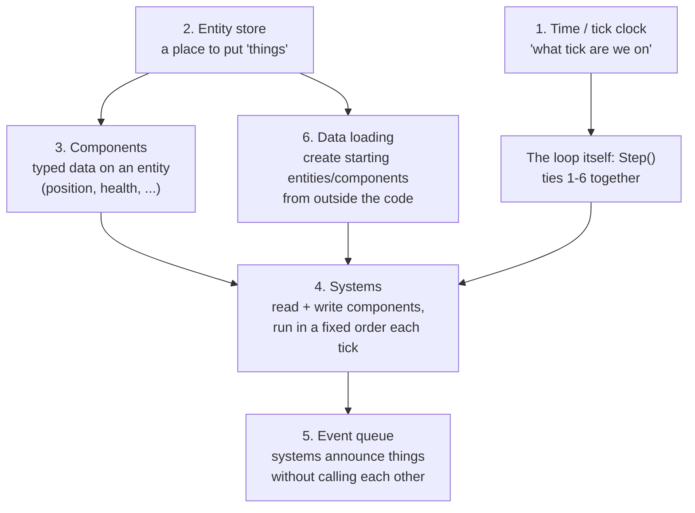
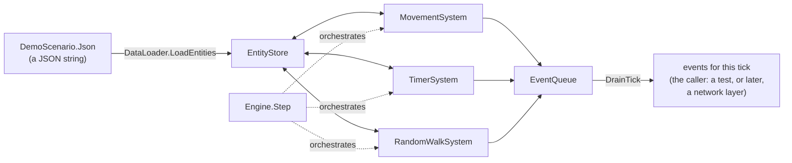

# Module 01: What a game engine is, and build vs buy

- **Goal:** know the subsystems every engine is built from, which ones an online RPG's server and client each need, what Unreal, Unity and Godot solve for you (and don't, for an MMO), and a method for deciding what to build and what to buy.
- **Prerequisites:** [module 00](00-fundamentals.md).
- **Example:** `examples/01-mini-engine/` (`dotnet test examples/01-mini-engine`)
- **Facts checked:** October 2026 (prices, licences and product status change; re-check before reuse)

## In short

A game engine is the reusable machinery that turns a game's rules and assets into a running, interactive loop: a clock, a place to hold "things in the world," ways to draw, hear and control them, and ways to move and save data. Every engine, free or in-house, is built from the same dozen subsystems. What changes is which ones you build, which you buy as middleware, and which a full engine (Unreal, Unity, Godot) already solves. A server and a client need almost disjoint subsets: the server owns the world and the simulation, the client only shows it. In 2026, open engines, open components and AI-assisted coding push the line further toward "build," but a production 3D renderer and its editor remain what nobody reasonably builds alone. The example builds the smallest real engine and proves it by test: a fixed-tick loop, an entity/component store, systems in a fixed order, an event queue and JSON-driven data, with exact positions after N ticks and a replay that matches from the same seed.

## 1. The concept

### 1.1 The subsystems every engine has

| Subsystem | What it does | Typical shape |
|---|---|---|
| **Main loop** | Drives everything forward in discrete steps ("ticks" or "frames"); decides what runs, in what order, how often | fixed-timestep accumulator (deterministic) vs. variable-timestep wall clock |
| **Entity/scene model** | Represents "things in the world," and (on a client) how they're arranged for rendering/culling | entity-component store (server-side); scene graph / node tree (client-side) |
| **Resources/assets** | Loads, caches and frees textures, meshes, sounds, data tables | a resource manager, usually reference-counted |
| **Rendering** | Turns the scene model into pixels | a camera + renderer abstraction over a graphics API |
| **Input** | Reads keyboard/mouse/gamepad and maps it to game actions | a rebindable action/hotkey table |
| **Audio** | Plays and mixes sound effects and music | an audio engine/driver wrapper |
| **Physics/collision** | Resolves overlaps, applies forces, validates movement | a physics engine, or — for simpler games — shape/grid collision checks only |
| **Navigation** | Finds a path for an agent across the world, avoiding obstacles | a navmesh + pathfinder (A* or similar) |
| **Scripting** | Lets content (not just engine programmers) define behaviour without a recompile | an embedded VM bound to engine functions |
| **Networking** | Moves game state between processes (client↔server, server↔server) | a message protocol over TCP/UDP/WebSocket |
| **Tools/editor** | Lets people author data instead of writing code | a visual editor, or a text/data pipeline + a validator |
| **Build/packaging** | Turns source + assets into something that runs/ships | compilers, asset bundlers, patchers/updaters |

### 1.2 What the server needs vs. what the client needs

An online RPG's server and client are really two different programs that happen to share a genre. Most subsystems above belong almost entirely to one side:

| Subsystem | Server (authoritative simulation) | Client (presentation + input) | Why |
|---|---|---|---|
| Main loop | **Yes** — ideally a fixed tick, so the same inputs always produce the same outputs | **Yes** — tied to the display, naturally variable | different jobs: "when does gameplay logic run" vs. "when do we draw the next picture" |
| Entity/scene model | **Yes** — entities + component data, no graphics | **Yes** — a scene representation that *mirrors* the server's entities for drawing | the client's scene nodes are a *view*, never a second source of truth |
| Resources/assets | Minimal — data tables only (stats, drop tables) | **Yes** — textures, meshes, animations, sounds, fonts | the server never draws or plays anything |
| Rendering | No | **Yes** | — |
| Input | No — only receives already-validated commands | **Yes** — raw device input | — |
| Audio | No | **Yes** | — |
| Physics/collision | **Yes**, usually simplified — movement validation, hit detection; the server is authority on "did this hit land" | Optional/cosmetic only — a client-side result is never authoritative | if the client's physics result mattered, the server couldn't enforce fairness |
| Navigation | **Yes** — authoritative pathing for AI agents, move-destination validation | Optional — a local preview path helps responsiveness, but the server has the final say | — |
| Scripting | **Yes** — most gameplay content (abilities, quests, loot) is cheaper as data+script than compiled code | Optional — UI behaviour, VFX triggers | — |
| Networking | **Yes** | **Yes** | — |
| Tools/editor | **Yes** — content is usually authored against the same data the server loads | often shared with the server's tools | — |
| Build/packaging | **Yes** — server binaries + content | **Yes** — client binaries + content, usually with a patcher | — |

Navigation shows the pattern: the server needs it for authority, the client only for a local preview.

### 1.3 Building a minimal engine from scratch: the smallest pieces, in order

You don't need all twelve subsystems to have a real engine. The smallest useful core is six pieces, and the dependency order between them is fixed — each one needs the ones before it to exist first:



1. **Time/tick clock** — a counter, not a wall-clock reading. Everything else needs a notion of "when."
2. **Entity store** — a place to create and look up "things," even before anything acts on them.
3. **Components** — typed data attached to an entity (a position, a velocity, a health value).
4. **Systems** — units of logic that read and write components once per tick, run in a fixed order, so the same starting data and the same number of ticks always produce the same result.
5. **Event queue** — lets a system announce "something happened" (a timer fired, a death occurred) without calling other systems' methods directly, which would hard-wire their order and make testing one system in isolation harder.
6. **Data loading** — creates the *initial* entities/components from something outside the code (JSON, a database row, a design tool's export), so adding content never requires a recompile.

The loop (often called `Step()`, `Tick()` or `Update()`) is the seventh piece only in the sense that it's what calls the other six in order — it has no logic of its own beyond "advance the tick, run the systems, drain the events." section 5 builds exactly this, nothing more.

## 2. The design space

There are four common ways to get an engine. They are not exclusive; most shipped games mix them.

| Option | What it means | Typical users | Strength | Weakness |
|---|---|---|---|---|
| **Adopt a full engine** | Build the game inside Unreal, Unity or Godot | Most single-player, co-op and session-based games | Renderer, editor, input, audio and physics on day one | The engine's model of the world and of networking becomes yours; a persistent sharded server is not included |
| **Engine for the client, custom server** | Use a full engine for presentation; write your own authoritative server | Many online RPGs and survival games | Best of both; the server can be headless and deterministic | Two codebases and a protocol between them; shared rules must be kept in sync |
| **Custom core on open components** | Own the loop, world and protocol; adopt libraries for navigation, physics, audio, fonts | Small teams, browser games, 2D games | Full control, small footprint, easy tests | You maintain the glue and the tools |
| **Fully in-house** | Write nearly everything, including renderer and editor | Large studios with a long product horizon | Total control; no vendor risk | Very high cost; only sensible if the engine is itself an asset |

### How to choose

| If your game... | Lean towards |
|---|---|
| is a session-based match of a few dozen players | adopt a full engine and its replication |
| is a persistent world with thousands of players per shard | engine for the client (or a thin client), custom authoritative server |
| is 2D or runs in a browser | custom core on open components |
| has one or two engineers and a short deadline | adopt as much as possible; build only what defines the game |
| has a decade-long product plan and its own tooling culture | a custom core, with a deliberate list of adopted parts |

## 3. Trade-offs and pitfalls

- **Building what you could adopt.** Every "free" part of an adopted engine (editor, asset pipeline, localisation, crash reporting) must be built and maintained forever if you skip it, with no outside community sharing fixes.
- **Adopting what fights your design.** Built-in replication assumes sessions and a client that predicts. Bending it to a persistent authoritative world often costs more than writing the server.
- **Vendor and platform risk.** Products get discontinued or reprice. Scaleform, a Flash-based UI middleware common in the Xbox 360/PS3 era, was discontinued by Autodesk in 2017, forcing studios that built on it to migrate ([Wikipedia](https://en.wikipedia.org/wiki/Scaleform_GFx)).
- **A wall-clock main loop.** A loop that sleeps for whatever time is left each frame is simple, but it is hard to replay or test deterministically. A fixed-tick loop with time as a counter avoids this (module 03).
- **No physics at all.** Collision that rides on navigation sliding is cheap, but it rules out physics-driven gameplay such as knockback with real mass or projectile arcs.
- **A custom protocol grows.** It stays flexible, but each new feature adds message types and work that a mature network layer might partly absorb.
- **Then versus now.** In the mid-2000s some online RPGs shipped on licensed engines (Lineage II on Unreal Engine 2, TERA on Unreal Engine 3) while others wrote their own. The calculus has shifted since: engines and navmesh libraries are cheap or free, but an authoritative persistent zone-sharded simulation is still not something an adopted engine solves.

## 4. Build or buy

### 4.1 What Unreal, Unity and Godot give you — and what none of them solve for an MMO

Licensing, one line each (as of October 2026): **Unreal Engine 5/6** is free up to **$1M lifetime gross revenue per product**, then a **5% royalty** above that (3.5% if launched day-and-date on the Epic Games Store) ([pcgamer.com](https://www.pcgamer.com/unreal-engine-games-no-longer-owe-royalties-on-their-first-dollar1m-in-revenue/)). **Unity 6**: the Personal tier is free under **$200K/yr** revenue+funding; **Pro** (~$2,310/seat/yr as of January 2026) is required above that, **Enterprise** above $25M/yr ([unity.com/products/pricing-updates](https://unity.com/products/pricing-updates)). **Godot 4**: **MIT license**, fully open source, free regardless of revenue, no royalty, ever ([godotengine.org — FAQ](https://docs.godotengine.org/en/stable/about/faq.html)).

| Subsystem | Unreal 5/6 | Unity 6 | Godot 4 |
|---|---|---|---|
| Main loop | Built-in `Tick()`, fixed or variable | Built-in `Update()`/`FixedUpdate()` | Built-in `_process`/`_physics_process` |
| Entity/scene model | Actor/Component + World Partition | GameObject/Component | Node tree (the scene graph *is* the entity model) |
| Resources/assets | Full pipeline + cooking + Nanite virtualized geometry | Full pipeline + Addressables | Import pipeline + resource system |
| Rendering | AAA-grade (Nanite, Lumen) | High-end (HDRP/URP) | Vulkan-based; capable, behind UE/Unity for AAA visuals |
| Input | Enhanced Input system | Input System package | Built-in input map |
| Audio | Built-in + MetaSounds (Wwise/FMOD integration common) | Built-in (FMOD/Wwise integration common) | Built-in audio bus system |
| Physics/collision | Chaos (built-in) | Built-in (historically PhysX-based) | Built-in (Godot Physics, Jolt option in 4.x) |
| Navigation | Built-in NavMesh | Built-in NavMesh | Built-in NavigationServer (Recast-based) |
| Scripting | C++ / Blueprints / Verse (UE6) | C# | GDScript / C# / C++ GDExtension |
| Networking | Built-in replication (+ Iris for larger scale) | Netcode for GameObjects, or Mirror/Photon | High-level multiplayer API (ENet-based) |
| Tools/editor | Full visual editor | Full visual editor | Full visual editor (lightweight, <100MB) |
| Build/packaging | Built-in cooker + mature console certification | Built-in builder + mature console certification | Built-in exporter; weaker console certification support |

**What none of the three solve for an MMO**, specifically:
- **Authoritative server simulation at scale.** Their built-in networking (replication, Netcode for GameObjects, Godot's multiplayer API) is designed for **session-based** multiplayer — lobbies that start, play and end — not a persistent world with thousands of entities ticking forever, sharded across processes.
- **Persistence.** None include a database or save-data service. Optional backend add-ons exist (PlayFab, GameLift) but those are rented services bolted on, not a solved engine subsystem.
- **Economy/transaction integrity.** "This trade/craft/drop must be server-authoritative and transactional" is pure gameplay-layer work in all three, regardless of engine.
- **Zone/world topology** — how a huge persistent world splits across processes, and how a character crosses the seam. Not an engine feature in any of the three; every MMO studio still designs this itself. Typical answers split login, world and zone processes (see [module 19](19-server-architecture.md)).

### 4.2 A build-vs-buy method

| Criterion | Leans build | Leans buy/adopt |
|---|---|---|
| Core to the game's identity? | Yes — an off-the-shelf piece will fight your design | No |
| A hard, generic research problem? | No — cheap enough to build yourself (an event queue, a hotkey table) | Yes — decades of prior art exist and a small team won't out-engineer it (navmesh pathfinding, a production renderer, anti-cheat) |
| A fitting open-source component exists? | Build *on top of* it rather than paying or reinventing it (Recast/Detour, Jolt) | — |
| Team skill and available time | Matches build | Doesn't match → buy/adopt, or the timeline slips |
| Cost at your expected scale | Free/cheap to build and maintain | Model against the vendor's own threshold (section 4.1) before committing |
| Vendor/platform risk | None — nothing can be discontinued out from under you | Real: Scaleform (a Flash-based UI middleware once common in the Xbox 360/PS3 era) was discontinued by Autodesk in 2017, forcing studios that built on it to migrate ([Wikipedia — Scaleform GFx](https://en.wikipedia.org/wiki/Scaleform_GFx)) |

### 4.3 How AI-assisted development in 2026 shifts the line

The criteria above don't change, but some answers have moved since 2006, and AI-assisted coding moves a few more:

- **Boilerplate engine plumbing leans toward "build."** An entity/component store, a hotkey table, a data loader, a small grid A* pathfinder or a basic WebSocket transport are mechanical, well-represented problems that an AI pair-programmer drafts quickly. These are exactly the things a small team once reached for a library to avoid writing.
- **Navmesh pathfinding moved from "license it" to "use a free library,"** independent of AI. Navmesh generation plus agent sliding is a non-trivial geometry problem, which is why studios used to license it. Recast/Detour is, as of 2026, a mature open-source equivalent and the basis of Unreal's and Godot's built-in navigation, so for a new project the answer is to adopt it. AI mainly speeds up the glue code around it.
- **What stays hard, AI or not: a production-grade real-time 3D renderer and its editor.** Correct shadows, PBR materials and asset-pipeline performance at AAA scale take deep, specialized expertise and years of accumulated edge-case handling. An assistant can help write one shader or one editor panel, but assembling a coherent, performant, artist-usable whole is still a multi-year, multi-specialist effort. That is why the three big engines remain the default for 3D fidelity.
- **Net effect:** the "does a fitting open-source component exist?" row resolves to "yes" more often than in 2006, and AI lowers the cost of building the glue layer around a chosen component. It does not remove the force of the "hard, generic problem" row for the few subsystems that remain specialist domains.

## 5. The example

### 5.1 Design

The six pieces from section 1.3, built as six small types plus a loader, with nothing else:



`Engine.Step()` is the whole loop: advance `Tick`, clear the event queue for the new tick, run every system once in the order the caller gave at construction, then drain and return the events. There is no wall-clock call anywhere in the project — "when" is only ever the `Tick` counter, following the rule of no `DateTime.Now`, no `Random.Shared`, time as ticks and an injected RNG.

### 5.2 Walkthrough

| File | Piece from section 1.3 | What it does |
|---|---|---|
| `EntityId.cs` | entity store (id) | a `readonly record struct` wrapping an `int`, assigned in creation order |
| `EntityStore.cs` | entity store + components | `CreateEntity`, `Set<T>`/`TryGet<T>`/`Has<T>`/`Remove<T>`, and `EntitiesWith<T>()` — one `Dictionary<EntityId, object>` per component type, iterated in stable creation order (not raw dictionary order) so results are reproducible |
| `Position.cs`, `Velocity.cs`, `Timer.cs`, `RandomWalker.cs` | components | four plain `readonly record struct`s; `RandomWalker` is an empty marker component |
| `ISystem.cs`, `MovementSystem.cs`, `TimerSystem.cs`, `RandomWalkSystem.cs` | systems | `MovementSystem` adds `Velocity` to `Position`; `TimerSystem` counts `Timer` down and publishes a `GameEvent` at zero, then removes it; `RandomWalkSystem` takes an injected `Random` (never `Random.Shared`) and nudges `Position` by -1/0/+1 per axis |
| `GameEvent.cs`, `EventQueue.cs` | event queue | `EventQueue` holds only the current tick's events; `BeginTick()` clears it, `DrainTick()` returns a copy |
| `DataLoader.cs` | data loading | parses a JSON array with `System.Text.Json`, creates one entity per element, attaches whichever components that element's JSON names |
| `DemoScenario.cs` | — | the module's worked JSON: two linear movers, one 3-tick timer ("Bell"), one random walker |
| `Engine.cs` | the loop | `Step()` ties the above together, as in section 5.1 |
| `MiniEngineTests.cs` | proof | four xUnit tests, below |

**Key tests, with their exact numbers** (`MiniEngineTests.cs`):

- `Step_TwoLinearMovers_ExactPositionsAfterThreeTicks`: mover A starts at `(0,0)` with velocity `(1,0)`; after 3 ticks it's at exactly `(3,0)`. Mover B starts at `(10,5)` with velocity `(0,-2)`; after 3 ticks it's at exactly `(10,-1)`.
- `Step_TimerEntity_FiresEventOnceOnTickThreeThenNeverAgain`: a `Timer(TicksRemaining: 3, EventName: "Bell")` produces no event on ticks 1–2, exactly one `GameEvent("Bell", Tick: 3, Source: <its id>)` on tick 3, and nothing afterward (`Has<Timer>` is `false` once it has fired).
- `Step_RandomWalkerSameSeed_ReplaysTheExactSamePath`: running the random walker for 5 ticks with `new Random(42)` twice produces two identical 5-position arrays; running it with `new Random(7)` produces a different array — the deterministic-replay proof.
- `Step_FullDemoScenario_RunsAllSystemsInFixedOrderEachTick`: all three systems together for 3 ticks reproduce both exact positions above *and* the tick-3 "Bell" event in the same `Step()` call, confirming the fixed system order (movement, then timer, then random walk) doesn't interfere between systems.

Run them with:

```bash
dotnet test examples/01-mini-engine
```

### 5.3 What this example deliberately leaves out

- **No archetypes or sparse-set storage.** `EntityStore` boxes every component into `object` inside a plain `Dictionary` — simple to read, fine for a classroom-sized world, not how a production ECS stores millions of components. That performance work is out of scope for a module about the *shape* of an engine, not its throughput.
- **No networking or persistence.** `GameEvent`s are returned to whoever called `Step()` — a test, here — exactly where a real server would instead hand them to a network layer ([module 17](17-networking.md)) or a save-checkpoint ([module 20](20-persistence.md)).
- **No multi-threading.** Systems run one after another in a fixed order inside a single `Step()` call, matching the rule that one simulation loop runs single-threaded per zone or instance.
- **Entities are never fully deleted**, only their components are (`Remove<T>`) — the demo never needed whole-entity removal, so it isn't built.

## Key takeaways

- An engine is a dozen subsystems (loop, entities, assets, rendering, input, audio, physics, navigation, scripting, networking, tools, packaging); a server and a client each need an almost disjoint subset.
- The smallest real engine is six pieces in a fixed order: tick clock, entity store, components, systems, event queue and data loading, tied together by one `Step()`.
- Unreal, Unity and Godot solve rendering, editor and session-based multiplayer, but none solves an authoritative, persistent, zone-sharded MMO world.
- Choose by what defines your game: build the core that encodes your rules, adopt generic hard parts (navmesh, renderer, anti-cheat).
- Watch the costs of building (tools forever, no community) and of adopting (a model that fights your design, vendor risk).
- Build-or-buy call as of 2026: build the game-specific core, adopt open components such as Recast/Detour and Jolt, and leave the production 3D renderer and editor to the big engines.
- The example proves a fixed-tick loop by test: exact positions after 3 ticks, a timer firing once on tick 3, and an identical replay from the same seed.

## Further reading
- [Unreal Engine royalty model (PC Gamer)](https://www.pcgamer.com/unreal-engine-games-no-longer-owe-royalties-on-their-first-dollar1m-in-revenue/)
- [Unity 6 pricing updates](https://unity.com/products/pricing-updates)
- [Godot FAQ: licensing](https://docs.godotengine.org/en/stable/about/faq.html)
- [Scaleform GFx (Wikipedia)](https://en.wikipedia.org/wiki/Scaleform_GFx)
- [Recast and Detour navigation](https://github.com/recastnavigation/recastnavigation)
- [Fix Your Timestep (Glenn Fiedler)](https://gafferongames.com/post/fix_your_timestep/)
