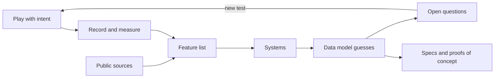

# Module 02: Studying a reference game from public information

- **Goal:** learn a repeatable method for working out how a game you admire is built and tuned when you have no source code, keep what you observed apart from what you guessed, stay on the right side of the legal and ethical line, and turn the result into specs and proofs of concept.
- **Prerequisites:** [00 — Game development fundamentals](00-fundamentals.md).
- **Example:** none
- **Facts checked:** October 2026 (prices, licences and product status change; re-check before reuse)

## In short

Every team starts a new game by looking at an existing one. The useful version of that habit is a **teardown**: a structured study that goes from what a player can see, to the systems that must exist to produce it, to a guess at the data model, to a list of questions you cannot yet answer. You gather evidence by playing with intent, recording, measuring, and reading public sources such as developer talks, patch notes and community wikis. You never use leaked source code, and you are careful with client data mining. The most important habit is to label every statement **observed**, **documented** or **inferred**. A teardown ends in specs and small proofs of concept, not in a copy of the other game.

## 1. The concept

### 1.1 What a teardown is

A **teardown** (or reverse design study) asks "what must be true under the hood for the game to behave this way?" The player sees outputs: a hit lands, a number floats up, a quest completes. The team infers the machinery: a rule, a table, a timer.

You do not need the source to do this well. A fighting-game community has documented frame data for decades from play alone, and speedrunners and wiki editors have mapped drop tables and damage formulas by repeated measurement.

### 1.2 Three kinds of evidence

| Label | Meaning | Example |
|---|---|---|
| **Observed** | You or a teammate saw it, and it can be repeated | "This skill hits targets up to about 5 metres away" |
| **Documented** | A first-hand public source states it | "The developers said in a talk that the server ticks at 20 Hz" |
| **Inferred** | A guess that explains the observations | "Damage is probably `attack * (1 - defense / (defense + K))`" |

Write the label next to every claim. A teardown that mixes the three becomes a myth within a month, because the next reader cannot tell a measurement from a hunch.

### 1.3 The pipeline



The loop on the right matters: open questions become the next play session.

## 2. Gathering evidence

### 2.1 Playing with intent

Playing for fun and playing for study are different activities. Before a session, write down one question ("how long is the delay between pressing a skill key and the first damage?"). Then change one variable at a time: same target, same skill, different distance.

Keep a notebook with the game version, character level, gear and date. Online games change often; a measurement without a version is useless a month later.

### 2.2 Recording and frame stepping

Video is the cheapest instrument. Screen-capture at 60 frames per second or higher, then step through frame by frame in a player that supports it. With a known frame rate, a frame count becomes a time: 12 frames at 60 fps is 200 ms.

What video can answer:

- Animation length, windup, and when an effect appears.
- Cooldowns and cast times, from a visible timer or a repeated action.
- Camera rules, movement speed (distance over time), turn rate.
- Interface flow: which screens open in which order, what is clickable when.

What video cannot answer: anything the client does not show. Server rules, hidden rolls and true tick rates are inferred, not seen.

Caveats: the display may run at a different rate than the simulation, video compression smears fast effects, and the client may play an animation before the server has confirmed the result.

### 2.3 Observation without packet capture

You can learn a lot about the network model without touching the network traffic:

- **Latency tests.** Act while your connection is slow or fast (a network conditioner is a standard developer tool) and note what the client does before the server answers. Does your character move at once (prediction)? Does a hit show immediately and then get taken back?
- **Two clients side by side.** Watching the same event from two accounts shows what is synchronised and how late.
- **Edge cases.** Walk into a wall, use a skill while stunned, change zone mid-cast. The corner cases reveal the rules.

Capturing and decoding the game's own traffic is a different matter, and falls under the legal section below.

### 2.4 Measuring

Measure with samples, not single events.

| What | How | Watch out for |
|---|---|---|
| **Timings** | Frame-count video, or log timestamps from a stopwatch tool | Rounding to display frames |
| **Ranges and areas** | Stand targets at marked distances and find where hits stop | Target size changes the apparent range |
| **Damage** | Record 30 to 100 hits with the same setup; note min, max, mean | Random spread, crits, defence of the dummy |
| **Drop and success rates** | Many trials; report the count and the rate | Small samples lie: 1 in 100 needs hundreds of tries to tell from 1 in 50 |
| **Progression curves** | Record experience needed per level | Rounding in the displayed numbers |

**Curve fitting.** Put the samples in a spreadsheet and try simple shapes: linear, quadratic, exponential, a power law `a * level^b`, or a lookup table. A good model predicts the next level before you reach it. If three simple shapes all fail, the real data is probably a hand-edited table, which is itself a finding.

**Isolating variables.** To find the effect of defence, change only defence. To find whether damage depends on level difference, use two characters of different levels against the same target. Write the experiment down so someone else can repeat it.

### 2.5 Public sources

| Source | Good for | Reliability |
|---|---|---|
| **Official site, manuals, patch notes** | Feature lists, formula hints, balance changes with numbers | High for what it says; incomplete |
| **Developer interviews and postmortems** | Intent, trade-offs, history | High, but filtered by memory and marketing |
| **Conference talks** (GDC and similar) | Real architecture and tool details | High; check the date |
| **Community wikis** | Aggregated measurements, tables | Variable: look for sample sizes and version tags |
| **Community databases** (items, skills, maps) | Large datasets | Check how the data was collected; see section 3 |
| **Forums and videos by experts** | Edge cases, techniques | Treat as leads, then verify yourself |
| **Job postings and engine vendor case studies** | Technology stack hints | Weak, but useful for what middleware a team uses |

Always record the date and the game version a source describes. Cite sources inside your notes the same way you would in a paper: title, author, date, link.

## 3. The legal and ethical line

This section is general information, not legal advice. Ask a lawyer before you do anything near the boundary.

### 3.1 What is safe

- Playing the game and recording your own play, within its terms.
- Reading public material and citing it.
- Measuring behaviour you can see.
- Writing your own implementation from your own specs.

### 3.2 What needs care

| Activity | The concern |
|---|---|
| **Terms of service and end-user licence** | Most online games forbid reverse engineering, data mining, automation and traffic interception. Breaking them can end your account and, in some places, support a contract claim |
| **Reading client files** | The files on your disk are the publisher's copyrighted material. Some countries allow limited decompilation for interoperability, others do not |
| **Packet capture and decoding** | May be treated as circumventing protection or as accessing a computer service in ways the operator did not allow |
| **Community databases built from client data** | The data may have been extracted in violation of the terms; using it can carry the same risk, and it may be copyrighted |
| **Anti-cheat systems** | Tools that look inside the client can be flagged as cheats and lead to bans |

Laws differ by country. For example, in the United States the DMCA restricts circumventing technical protection with limited, periodically renewed exemptions; in the European Union the software directive allows decompilation only for interoperability under narrow conditions. Check the rules where you work.

### 3.3 What never to do

- **Never use leaked or stolen source code**, even "just to look". It contaminates your project: you can no longer prove your work is independent, and the legal exposure is severe.
- Never copy assets, text, code or exact data tables into your product.
- Never publish credentials, private server addresses or exploit details you discovered.
- Never pass off a study as affiliation with, or endorsement by, the original publisher.

### 3.4 Ideas, expression and a clean room

Copyright protects expression (code, art, text, a specific table of numbers), not ideas or game rules in the abstract. Studying how a mechanic feels and then building your own version from your own spec is normal practice in the industry.

When the legal risk is real, use a **clean room**: one group studies and writes a behavioural specification; a separate group that never saw the original writes the implementation from the spec only. Even without that formality, keep a written trail showing that your numbers came from your own tuning.

## 4. The teardown template

Use the same template for every game, so teardowns can be compared.

| Step | Question | Output |
|---|---|---|
| **1. Feature list** | What can the player do? | A flat list, one line each, tagged observed or documented |
| **2. Systems** | What subsystems must exist for those features? | Names and responsibilities, grouped by area |
| **3. Data model guesses** | What records and fields would feed each system? | Sketches of tables, with a confidence mark |
| **4. Open questions** | What do we not know, and how could we test it? | A prioritised list, each with a proposed experiment |

A small example for one feature:

```text
Feature: Charged shot (observed)
  Holding the key for 1.5 s fires a larger projectile (observed, video)
System: skill timeline + projectile
Data guess (inferred): skill { id, chargeMaxMs: 1500, damageScale: [1.0 .. 2.0] }
Open question: does damage scale linearly with charge time? Test: 5 hold lengths x 30 shots
```

## 5. Mapping teardown areas to course modules

| Teardown area | What to look at | Course module |
|---|---|---|
| Main loop, tick rate, update order | Input delay, how time-based effects behave under lag | [03 — The game loop and time](03-game-loop.md) |
| Characters, maps, zones, instances | Zone loading, population per area, entity types | [04 — Entities, world and zones](04-entities-world.md) |
| Data tables and stat formulas | Spreadsheets of skills, items, monsters | [05 — Data-driven design and property systems](05-data-properties.md) |
| Scripting of quests and events | Quest flow, triggers, cutscenes | [06 — Scripting](06-scripting.md) |
| Movement and pathfinding | Click-to-move routes, obstacle behaviour | [07 — Navigation and pathfinding](07-navigation.md) |
| Stats and damage | Damage samples, defence curves | [08 — Stats and combat resolution](08-stats-combat.md) |
| Hit detection and skill timing | Frame data, hit shapes, dodge windows | [09 — Action combat](09-action-combat.md) |
| Progression, classes, levels | Experience curve, class tree | [11 — Character progression](11-progression.md) |
| Networking and sync | Latency behaviour, what other players see | [17 — Networking](17-networking.md) and [18 — State sync and interest management](18-state-sync.md) |

## 6. Trade-offs and pitfalls

- **Survivorship in what you see.** You observe the behaviours the designers chose to show. Hidden systems (server-side caps, anti-abuse rules) leave no visible trace.
- **Mistaking tuning for design.** A number you measured today may change next patch. Record the version, and prefer the shape of a system over its constants.
- **Copying the symptom.** A feature may exist to solve a problem you do not have (an old hardware limit, a business model). Ask why before you copy what.
- **Over-trusting community data.** Wikis mix versions and regions. Check dates and look for the original measurement.
- **Confirmation bias.** Once you have a theory, every sample looks like proof. Write the prediction before the test.
- **Never finishing.** A teardown has no natural end. Time-box it and stop when the open questions no longer change a decision.

## 7. Build or buy

Here the question is about tools, not engines.

| Need | Common tools (as of October 2026) | Build it? |
|---|---|---|
| **Capture** | OBS Studio (free, open source), the platform's built-in capture; a video player with frame stepping; ffmpeg to extract frames | No: use them |
| **Analysis** | A spreadsheet for samples and curve fitting; a notebook environment (Python with standard data libraries) for larger sets | No for the basics. A small script that turns a log into a table is worth writing |
| **Notes and evidence** | A wiki or markdown repository with a fixed teardown template, with each claim tagged | Build the template; use an existing wiki |
| **Analytics** | Game analytics services collect play data in your own game; they do not apply to someone else's | Not relevant to a teardown, but vital for your own game later (module 25) |
| **Input automation for repeatable tests** | Only where the terms allow it, and never against a live service | Avoid on live games |

AI-assisted tools help in two places: summarising long interviews and patch notes (always check the quotes against the source), and writing the small scripts that turn your measurements into tables and fitted curves. They cannot see the game for you, and they will happily invent a plausible formula. Treat a model's suggested formula as an *inferred* claim that still needs a test.

**Verdict: use existing tools, build only the template and a few scripts.** The expensive resource is disciplined observation, not software.

## 8. Turning a teardown into specs and proofs of concept

1. **Pick the features that matter to your game,** not everything you found.
2. **Rewrite each one as your own spec:** inputs, outputs, data fields, edge cases, in your words and with your own numbers.
3. **Mark the uncertain parts** and decide how much they matter.
4. **Build a proof of concept (PoC)** for the riskiest guess. A PoC is a small program that answers one question, for example "can a server resolve 200 hits per tick?" or "does this experience curve feel right between level 1 and 30?".
5. **Playtest against the original's feel,** not its numbers. If your version feels different, tune your own data.
6. **Keep the evidence trail:** which source or experiment supports each rule. When a rule is later challenged, you can say where it came from.

Modules 08, 09 and 11 each end with a data-driven example that fits step 4: change the data, not the code, until it feels right.

## Key takeaways

- A teardown goes from visible features to systems, data model guesses and open questions, in a fixed template.
- Label every claim observed, documented or inferred, and never mix them.
- Measure with samples and one changed variable at a time; fit simple curves and check them on the next data point.
- Video with frame stepping, plus latency and edge-case tests, reveals more than most people expect, without touching the network.
- Public talks, patch notes and wikis are leads; check date, version and sample size.
- Respect the terms of service and local law; never use leaked source, and never copy assets or exact data. A clean room is the safe pattern when risk is real.
- The teardown ends in your own specs and small proofs of concept. Build the template and scripts; use existing capture and spreadsheet tools.

## Further reading

- [Game Developer (formerly Gamasutra): postmortems and design articles](https://www.gamedeveloper.com/)
- [GDC Vault: conference talks, many free](https://www.gdcvault.com/)
- [Gabriel Gambetta: Fast-Paced Multiplayer](https://www.gabrielgambetta.com/client-server-game-architecture.html)
- [Valve Developer Community: Source Multiplayer Networking](https://developer.valvesoftware.com/wiki/Source_Multiplayer_Networking)
- [OBS Studio](https://obsproject.com/)
- [FFmpeg documentation](https://ffmpeg.org/documentation.html)
- [US Copyright Office: Section 1201 rulemaking](https://www.copyright.gov/1201/)
- [EU Directive 2009/24/EC on the legal protection of computer programs](https://eur-lex.europa.eu/eli/dir/2009/24/oj)
- [Electronic Frontier Foundation: Coders' Rights Project, reverse engineering FAQ](https://www.eff.org/issues/coders/reverse-engineering-faq)
