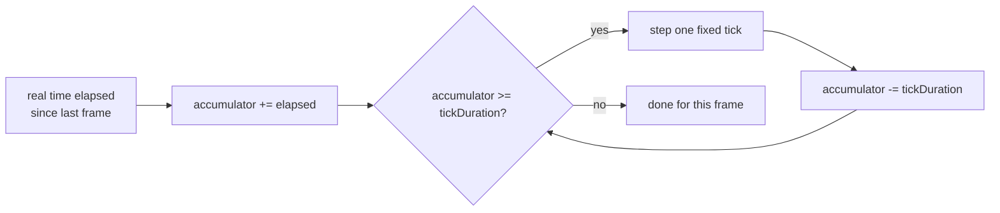
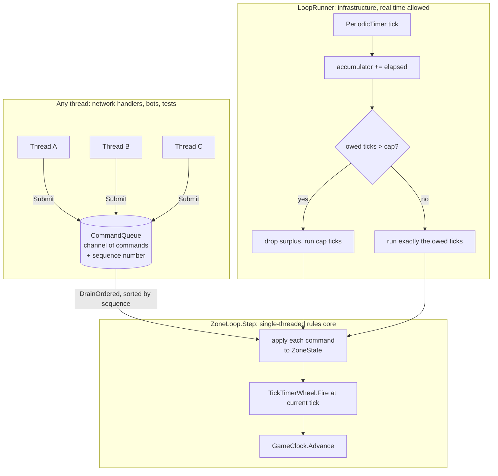

# Module 03: The game loop and time

- **Goal:** understand the frame/tick distinction, why a fixed timestep matters, the main ways to pace a game server, and how to build a small, deterministic, replayable tick loop in C#.
- **Prerequisites:** [Module 01](01-engine-build-or-buy.md) (what an engine's main loop is for).
- **Example:** `examples/03-game-loop/` (`dotnet test examples/03-game-loop`)
- **Facts checked:** October 2026 (prices, licences and product status change; re-check before reuse)

## In short

A game server does not wait for requests. It runs a **loop** that keeps simulating the world whether or not anyone sends it anything. The main choices are how the loop is paced (a fixed rate, a variable rate, or a rate that adapts to load) and what "time" means inside the simulation (a clock reading or a tick count). A fixed timestep with tick-based timers makes a simulation deterministic, so it can be tested and replayed. The example builds such a loop from three ideas: time is a tick counter, randomness is seeded and injected, and input from many threads goes through a sequenced command queue. It proves them with tests: a timer fires on exactly tick 3, the same seed and command log give an identical state hash, 400 concurrent commands apply in strict order, and a catch-up cap stops a stall from spiralling.

## 1. The concept

### 1.1 Frame vs. tick

A **frame** is one pass of *rendering*: redrawing the screen, normally driven by the display's refresh rate (60 Hz, 144 Hz and so on). A **tick** is one pass of *simulation*: one step of game logic (move things, check cooldowns, run AI). A client has both (render every frame, simulate when a tick is due). A headless server has only ticks. There is nothing to draw, so its loop runs at whatever rate it is configured for, independent of anyone's monitor.

### 1.2 Fixed vs. variable timestep

If `Update(deltaTime)` is handed whatever `deltaTime` the last iteration happened to take, the simulation becomes **non-deterministic**. It behaves differently depending on how fast the loop ran, a slow frame can let a fast object tunnel through a wall, and two runs of "the same" input never produce the same output.

The standard fix, from Glenn Fiedler's ["Fix Your Timestep!"](https://gafferongames.com/post/fix_your_timestep/), is a **fixed delta** per update. Leftover real time is accumulated, and as many fixed steps as are owed run before moving on:

### 1.3 What a timer means

Once you have ticks, a timer (a cooldown, a buff duration, a respawn delay) can be stored two ways:

- **Wall-clock deadline:** store `now + delayMs` from a real clock (`DateTime.Now`, the OS tick count) and compare against the clock later.
- **Tick deadline:** store `currentTick + delayTicks` from the simulation's own counter and compare against the counter later.

Both are "store a deadline, check it later". The difference is what kind of clock "later" is measured against. A wall-clock deadline reads real time from inside the simulation, which makes it untestable without a live clock and unreplayable (real time never repeats). A tick deadline compares integers the simulation already owns, so a test, a replay log or a real clock all give identical results.

### 1.4 Who may change the world

A simulation stays deterministic only if **one thread** changes it, in a known order. Network handlers, bots, timers and tools all want to change the world, so they must hand their requests to the loop instead of touching state directly. A thread-safe **command queue** is the usual hand-off point.

## 2. The design space

### 2.1 How the loop is paced

| Option | How it works | Fits | Weakness |
|---|---|---|---|
| **Variable timestep** | Pass real elapsed time into every update | Single-player games with no replay or networking | Different results on different machines and runs |
| **Fixed timestep, accumulator** | Run whole fixed steps until real time is used up | Competitive multiplayer, physics, deterministic simulations | Needs a catch-up cap, or a stall causes a spiral |
| **Fixed rate with sleep** | Do one tick, sleep for the rest of the budget | Server-only loops, simple hosts | Drifts if a tick overruns; sleep precision varies by OS |
| **Adaptive rate** | Tick rate rises and falls with load (for example, a slow idle rate and a faster busy one) | Many instances, most of them empty | Responsiveness depends on load; not a fixed timestep |
| **Event-driven** | No loop; react to messages and timers | Turn-based and idle games, chat | Hard to simulate continuous movement and AI |

### 2.2 Single-threaded or multi-threaded simulation

| Option | Fits | Cost |
|---|---|---|
| **One thread per zone or world** (single writer) | Most online RPGs | Needs many zones or processes to use many cores |
| **Job system / parallel systems** | Large simulations on one world (shooters, big battles) | Ordering and determinism are much harder |
| **Actor model** (one mailbox per entity or room) | Rooms, matches, services | Message overhead; harder to reason about global order |

### 2.3 What time means inside the simulation

| Option | Fits | Cost |
|---|---|---|
| **Wall-clock deadlines** | Calendar events, daily resets, real-time rewards | Not replayable; needs a mocked clock to test |
| **Tick deadlines** | Cooldowns, buffs, AI timers, anything gameplay | Needs conversion at the edge (seconds to ticks) |
| **Hybrid** | Most live games | Two clocks to keep apart; a calendar scheduler for long timers, ticks for short ones |

### 2.4 How to choose

| If your game... | Choose |
|---|---|
| must be replayable, spectated or rolled back | Fixed timestep, tick timers, seeded RNG |
| is a persistent world with many mostly empty zones | Fixed or adaptive rate per zone, and sleep empty zones |
| runs fast action combat (tens of ms matter) | Fixed timestep at 20 to 60 Hz, tick timers |
| is slow, cooldown-paced and click-driven | A lower tick rate is fine (5 to 10 Hz); wall-clock timers may be tolerable |
| has daily resets and timed world events | A separate coarse calendar scheduler that feeds the tick loop |

## 3. Trade-offs and pitfalls

- **Non-determinism from wall-clock timers.** Every comparison against the OS clock depends on exactly when the scheduler ran, so the same input can play out slightly differently each time.
- **No replay, hard testing.** If "now" is read inside a method, every class with a deadline needs a live or mocked clock to test.
- **Load-dependent responsiveness.** With an adaptive rate, the worst-case delay before the server notices a finished cooldown changes with load.
- **The spiral of death.** After a stall (a garbage-collection pause, a debugger break), a fixed-timestep loop owes many ticks. If each catch-up tick is slow, it falls further behind. Cap the ticks per advance and drop the surplus.
- **Hidden global state.** Calling `Random.Shared`, `DateTime.Now` or a static counter inside the simulation breaks replay. Inject them.
- **Sleeping precision.** `Thread.Sleep(1)` can sleep far longer than 1 ms on some systems. Use a periodic timer and an accumulator instead of sleeping a computed amount.
- **Ordering of concurrent input.** Many threads submitting commands arrive in an order the OS chooses. Give every command a sequence number at submission time and apply them sorted.
- **Allocation in the hot loop.** A tick that allocates lists every time will trigger garbage collections at the worst moment. Reuse buffers once the loop carries a real payload.

## 4. Build or buy

**What Unreal, Unity and Godot give you.** Each ships a per-frame callback (`Tick`, `Update`, `_process`) driven by the engine's render loop, plus a separate, fixed-rate callback for simulation (Unreal's substepped physics tick, Unity's `FixedUpdate`, Godot's `_physics_process`). All three encode the frame/tick split from section 1.1 because they are primarily client rendering engines. None is designed to run headless, with no rendering, as a horizontally scaled authoritative server. You can run each in a dedicated-server mode, but you then work around a renderer-shaped main loop and an editor and licence footprint a pure simulation does not need (as of October 2026).

**What the standard library gives you.** The .NET standard library already has the two pieces that matter: `System.Threading.Channels` for handing work from many threads to one consumer, and `PeriodicTimer` with `BackgroundService` for a fixed-cadence host loop.

**Could a small team build it?** Yes, cheaply. A first working version (fixed tick, command queue, tick timers, catch-up cap) is about a day of work, as the example shows. The risk is low for the loop itself. The real risk grows with the game: anything that changes simulation state from outside the tick must go through the queue, with no exceptions, or determinism quietly breaks.

**What a proof of concept must prove:**
1. A timer fires on exactly the tick it was scheduled for, not one early or late.
2. The same seed and the same command log reproduce the same state, including through random rolls.
3. Commands submitted from several threads apply in one well-defined, reproducible order.
4. A stall does not make the loop spiral.

**Verdict: build, on the standard library.** No engine or middleware sells "a deterministic authoritative tick loop for your gameplay", because it is inseparable from the gameplay code it drives. The only live choice is how to build it, and `Channel<T>` with `PeriodicTimer` is the idiomatic .NET answer.

## 5. The example

### 5.1 Design

Three ideas keep the simulation deterministic:

1. **Time is a tick count, never a clock read.** `GameClock` holds a `long CurrentTick` and a `TickDuration` (used only to translate real time into ticks at the host boundary). Every timer deadline is `someTick + delay`.
2. **Randomness is seeded and injected.** `SeededRng` wraps a `System.Random` built from an explicit seed and is passed into every command that needs it. Nothing reads `Random.Shared`.
3. **Cross-thread input is an ordered command log.** `CommandQueue` wraps a `Channel<T>` and stamps every command with a sequence number from `Interlocked.Increment` at submission time. It sorts by that number before handing commands to the loop, so the applied order is reproducible even though arrival order is not.

### 5.2 Walkthrough

All files are in `examples/03-game-loop/` (project `M03.GameLoop.csproj`).

**Rules core (no real time, no I/O):**
- `GameClock.cs`: the tick counter. Throws on a non-positive tick duration.
- `SeededRng.cs`: wraps `System.Random(seed)` and exposes `RollDie(sides)`.
- `TickTimerWheel.cs`: `ScheduleAt(fireAtTick, timerId)` and `Fire(currentTick)`, a dictionary bucketed by absolute tick. `Fire` removes the bucket it returns, so a timer fires exactly once.
- `ICommand.cs` and its implementations (`DepositCommand`, `RollDiceCommand`, `ScheduleTimerCommand`): the Command pattern applied to a deliberately tiny `ZoneState` (a balance and a running dice total). `RecordSequenceCommand` is a diagnostic command used to prove ordering.
- `ZoneState.cs`: the simulated state, plus `ComputeHash()` for replay comparison. It avoids `string.GetHashCode()`, which .NET randomises per process, in favour of a stable character-sum hash.
- `CommandQueue.cs` and `CommandEnvelope.cs`: the sequenced channel wrapper.
- `ZoneLoop.cs`: `Step()` drains ordered commands, applies each, fires due timers and advances the clock. One call is exactly one tick; no accumulator lives here.

**Host (real time allowed, not part of the rules core):**
- `LoopRunner.cs`: `Advance(TimeSpan elapsed)` is the pure, testable half. It accumulates elapsed time, runs owed ticks, caps them at `DefaultMaxTicksPerAdvance = 5` and drops the surplus. `RunAsync` wraps it with a real `PeriodicTimer` and `Stopwatch`, the shape of a `BackgroundService.ExecuteAsync`. It is not tested, by design, because all its logic is in `Advance`.

### 5.3 Key tests, with concrete numbers

- **A timer fires on the exact tick** (`ZoneLoopTests`): a `ScheduleTimerCommand(DelayTicks: 3, "boss-respawn")` submitted at tick 0 gives an empty result from `Step()` on ticks 0, 1 and 2, fires `["boss-respawn"]` on the call that processes tick 3, and never again.
- **Same seed and command log give identical state** (`ReplayTests`): a 5-command log (two deposits totalling **125**, two dice rolls, one 2-tick timer) run twice from `SeededRng(1234)` for 3 ticks gives, both times, `Balance == 125`, `FiredTimers == ["evt-a"]`, `RollTotal == 21` and `ComputeHash() == 210712323449`.
- **Concurrent commands apply in sequence order** (`CommandQueueTests`): 8 threads submit 50 commands each (400 total), then one `Step()` drains them. The applied order is exactly `[1, 2, ..., 400]`, with no gaps or duplicates.
- **A catch-up cap limits ticks per frame** (`LoopRunnerTests`): with a 100 ms tick and a cap of 5, `Advance(TimeSpan.FromSeconds(10))` owes 100 ticks but runs **5**. A following `Advance(TimeSpan.Zero)` runs **0**. The surplus was dropped, not queued.

**Reconfiguring it.** The tick length, the cap and the seed are parameters. A slow, cooldown-paced game might use a 200 ms tick and a cap of 3; a fast action game might use 25 ms and a cap of 8. Commands are plain types, so a different game adds its own `ICommand` implementations over its own state.

### 5.4 What the example leaves out

- **No real entities or gameplay.** `ZoneState` is a balance and a dice total so the tests can assert exact numbers. [Module 04](04-entities-world.md) builds the entity and world shapes this loop would drive.
- **No allocation pooling.** `DrainOrdered()` allocates fresh lists every tick; a production hot path should reuse a buffer.
- **No persistence, network or multiple zones.** Those layers sit around the loop in a real server.
- **`RunAsync` is untested.** All of its logic lives in the tested `Advance`.

## Key takeaways

- A server runs a loop that simulates the world whether or not anyone sends input. A tick is one simulation step; a frame is one render pass.
- A fixed timestep (accumulate real time, run whole fixed steps) makes a simulation deterministic. A variable timestep does not.
- Choose the pacing to fit the game: fixed rate for action and replay, adaptive or slower rates for large worlds of mostly empty zones.
- Tick-based timers can be replayed and unit-tested. Wall-clock timers are for calendar events at the edge of the simulation.
- Keep one writer: other threads submit commands to a sequenced queue and never touch state.
- Cap the catch-up ticks per advance, or one stall can spiral.
- Build this on the standard library (`Channel<T>`, `PeriodicTimer`). No engine or middleware sells it.

## Further reading

- Glenn Fiedler, [*Fix Your Timestep!*](https://gafferongames.com/post/fix_your_timestep/), Gaffer On Games.
- Robert Nystrom, [*Game Loop*](https://gameprogrammingpatterns.com/game-loop.html), Game Programming Patterns.
- Microsoft Learn, [*Background tasks with hosted services in ASP.NET Core*](https://learn.microsoft.com/en-us/aspnet/core/fundamentals/host/hosted-services).
- Microsoft Learn, [*System.Threading.Channels*](https://learn.microsoft.com/en-us/dotnet/core/extensions/channels).
