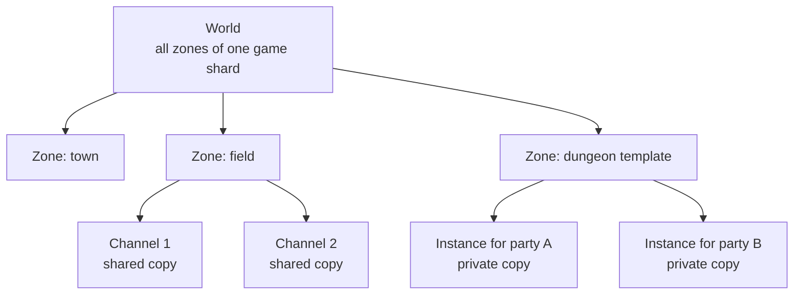
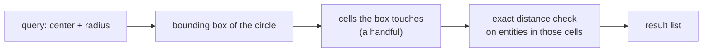
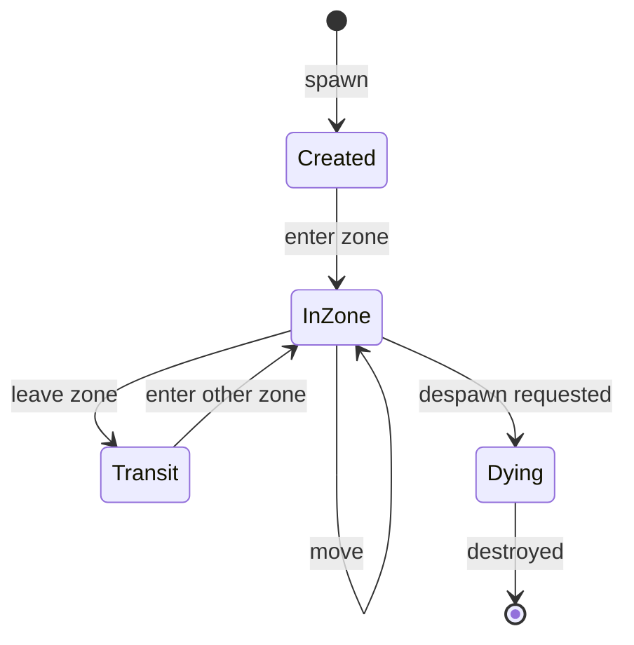
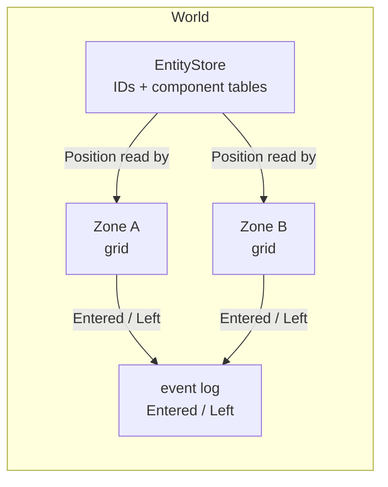

# Module 04: Entities, world and zones

- **Goal:** understand the main ways to model game entities, how an online game splits its world into zones and instances, how a spatial grid answers "who can see whom", and how an entity is spawned, moved, transferred and destroyed safely.
- **Prerequisites:** [Module 00](00-fundamentals.md) (components, ECS, interest management, zones), [Module 01](01-engine-build-or-buy.md) (a minimal entity store), [Module 03](03-game-loop.md) (one single-threaded loop per zone).
- **Example:** `examples/04-world/` (`dotnet test examples/04-world`)
- **Facts checked:** October 2026 (prices, licences and product status change; re-check before reuse)

## In short

Everything the server simulates is an **entity**, and every entity lives in exactly one **zone**. The big choices are how to shape entities (an inheritance tree, components, or a full entity-component-system), how to cut the world into zones and instances, how to answer visibility queries cheaply, and how other code refers to an entity safely. For an RPG zone with hundreds of hand-authored entities, plain components, a uniform grid and generational handles are a strong default. The example builds exactly that: an entity store whose IDs go stale cleanly after reuse, component tables, grid zones, and a zone transfer that emits "left" then "entered" events, which is what a network layer needs.

## 1. The concept

### 1.1 What an entity is

An **entity** is anything the simulation tracks: a player character, a monster, a dropped item, a warp pad, an invisible trigger. The server must create it, update it, show it to the right clients, save it if it matters, and destroy it. How you *shape* that thing in code is the entity model.

### 1.2 Three entity models

| Model | How it works | Strength | Weakness |
|---|---|---|---|
| **Deep inheritance** | `Object → FieldObject → Character → Player / Monster` | Easy to start; shared code lives in base classes | Every new kind must fit the tree; base classes grow; behaviour gets hard-coded |
| **Components** | An entity is a thin shell holding parts (`Position`, `Health`, `Name`); behaviour is composed | New kinds are new combinations; data-driven | Needs a lookup for each part; some discipline |
| **ECS** | Entity is just an ID; components are arrays of plain data; systems loop over matching entities | Cache-friendly, scales to tens of thousands of similar entities | Indirection; relationships are awkward; unfamiliar |

The decision rule for an RPG server: a zone holds **hundreds** of hand-authored entities, not millions. Plain components fit. Full ECS pays off only for swarms of homogeneous things (see [Module 00](00-fundamentals.md)). Deep inheritance fits only when the set of kinds is small and will not change, which an online game never is.

### 1.3 World, zone, instance, channel



- A **zone** is one map with its own entities and its own simulation loop. It is the unit you assign to a server process or thread.
- A **channel** is a parallel copy of a shared zone, used to cap population.
- An **instance** is a private copy for one party or one mission.

To the code they are the same thing: a zone object with an ID. The difference is who can enter. This is why the example has just `Zone`.

### 1.4 Spatial partitioning and the area of interest

A visibility query ("who is within sight of this player?") must not compare the player against every entity in the zone. A **uniform grid** cuts the map into square cells. Each entity is filed in one cell. A radius query only visits the cells that the circle's bounding box touches, then does an exact distance check inside them.



The **area of interest** (AOI) is the set of entities a client should know about. When something enters the set, the server sends a "spawn" message; when it leaves, a "despawn" message. Choosing the cell size is a trade-off: about the size of the sight range is a good default, because a query then touches at most a 3×3 block of cells.

Alternatives exist (quadtrees, spatial hashing, k-d trees), but a uniform grid wins for entities that move constantly and are spread fairly evenly, which describes an RPG zone.

### 1.5 Handles, not pointers

Other systems need to refer to an entity: a monster's target, a party member, a queued skill. If they hold a raw pointer or reference, the entity may be destroyed while the reference lives on (a **dangling reference**), or kept alive forever by it (a leak).

A **handle** is a small value that names the entity without owning it. The simplest handle is a number. A **generational handle** adds a counter that goes up each time a slot is reused, so "slot 7, generation 2" stops matching after the slot is recycled as "slot 7, generation 3". Looking up a stale handle fails cleanly instead of returning someone else's entity.

### 1.6 Entity lifecycle



The rule that keeps this safe: **entering and leaving a zone are events**, and the same code path produces them for spawn, despawn and transfer. The network layer listens to them and tells clients who appeared or vanished.

## 2. The design space

### 2.1 Entity models

Section 1.2 compares the three models. The choice also depends on what the player controls:

| Situation | Fits | Why |
|---|---|---|
| Small, fixed set of kinds (a puzzle or card game) | Inheritance | Simple, and the set will not grow |
| Single-character action RPG, many kinds of world object | Components | A new kind is a new combination of parts, often driven by data |
| A **party**: one player controls several characters, plus pets and summons | Components, with a player-session object that owns several entity IDs | The session is not an entity; the characters are, and each can be targeted, buffed and saved separately |
| Swarms of similar things (thousands of projectiles, crowd NPCs) | ECS with dense arrays | Cache-friendly loops over the same data |

### 2.2 How to divide the world

| Option | How it works | Fits | Cost |
|---|---|---|---|
| **Zones (maps)** | Each map is its own simulation, often its own process or thread | Most online RPGs | Moving between maps is a handoff |
| **Channels** | Parallel copies of a shared zone, to cap population | Popular towns and fields | Players on different channels cannot meet |
| **Instances** | A private copy per party or mission, made on demand | Dungeons, missions, story rooms | Lifecycle (create, fill, empty, destroy) must be managed |
| **Seamless world with cells** | One continuous map split into cells owned by servers | Open-world MMOs | Hard: cell borders, handoffs and load balancing |
| **Match rooms** | A room per match, no persistent world | Shooters, MOBAs | Not a persistent world |

### 2.3 Spatial structures for visibility

| Option | Fits | Weakness |
|---|---|---|
| **Uniform grid** | Entities that move constantly and spread fairly evenly (RPG zones) | Wasteful if everything clusters in a few cells |
| **Quadtree or octree** | Uneven density, mostly static objects | Rebuilding on movement costs more |
| **Spatial hash** | Huge or unbounded maps, sparse worlds | Needs a good hash and cell size |
| **Sweep and prune / k-d tree** | Physics broad phase, static queries | Not ideal for many moving entities |
| **Nothing (check everyone)** | Tiny zones (under about 50 entities) | Cost grows with the square of the population |

### 2.4 Referring to an entity

| Option | Safe against reuse? | Fits |
|---|---|---|
| Raw pointer or reference | No (dangling or leaking) | Short-lived local use only |
| Plain numeric ID | Only if IDs are never reused | Network messages, saved data |
| **Generational handle** (index plus generation) | Yes, a stale handle fails cleanly | In-memory references: targets, party links, queued skills |
| Reference counting with a "dead" flag | Yes, with care | Environments with manual memory |

### 2.5 Changing zone

| Option | How it works | Trade-off |
|---|---|---|
| **Reconnect** | Save, tell the client the new address, client reconnects and re-authenticates | Simple servers; slow and failure-prone transfers |
| **Server-to-server handoff** | Servers pass the entity and the client keeps its connection (often through a gateway) | Faster and smoother; more infrastructure |
| **Same process, move between zones** | Pure data move | Only works when zones share a process |

### 2.6 How to choose

| If your game... | Choose |
|---|---|
| is an RPG with a few hundred entities per map | Components, uniform grid, generational handles, zones plus instances |
| has huge battles or crowds | ECS storage for the crowd, components for the rest |
| is an open world | Cells or spatial hash, and a handoff protocol between servers |
| has fixed-size matches | A room per match; skip persistence of the world |
| lets one player control several characters | A session object that owns several entity handles |

## 3. Trade-offs and pitfalls

- **Behaviour baked into a base class.** A hard-coded method on a base class is a decision nobody can change by editing data. Prefer data and components.
- **Everything is a character.** If triggers, doors and pickups inherit hit points, buffs and state machines they never use, every new kind carries baggage or breaks the tree.
- **Reads through a bag.** A keyed lookup per stat read is flexible but slower than a field read in hot paths ([Module 05](05-data-properties.md)).
- **Updating everything everywhere.** Ticking every entity in a zone, near a player or not, is wasteful at scale. Sleep zones or regions with no players, and filter only what you *broadcast* by area of interest.
- **Dangling references.** A target that points at a destroyed entity can crash the server or hit the wrong thing. Use generational handles, or a two-phase removal (mark dead, release later).
- **Cell size.** Too small and queries touch many cells; too large and each cell holds too many entities. About one sight range is a good start.
- **Half-done transfers.** An entity must never be in two zones, or none, even when the target is invalid. Validate first, then change state.
- **Events out of order.** If "entered" can arrive before "left" for the same entity, a client sees ghosts or duplicates.

## 4. Build or buy

**What the engines give you.**

| Engine | Entity model | World model | What it does *not* give a server |
|---|---|---|---|
| **Unreal** | `Actor` with `Component`s; replication built in | Levels, plus World Partition to stream a large map in cells | A persistent multi-zone world, zone transfer between processes, your save format |
| **Unity** | `GameObject` and `MonoBehaviour` components; DOTS/ECS for large counts | Scenes | The same: no zone orchestration, no area of interest across servers |
| **Godot** | Scene tree of nodes (inheritance of node types plus composition by children) | Scenes, with multiplayer synchronisation nodes | The same |

All three give composition-style entities and a scene concept. Unreal's replication graph and Unity's netcode packages even include interest management, but they assume the engine's own scene is the world, and they are tuned for matches of tens or hundreds of players, not a persistent shard with many zones and a database behind it (as of October 2026).

**Why a server usually owns its world model.** The entity store is the server's database in memory: what it saves, what a client may see, how it migrates between processes and what a GM tool can inspect. Those rules are the game. An engine's scene graph is shaped for rendering and editing, and its objects carry far more than a headless server needs.

**Could a small team build it today?** Yes, and it is small. An entity store with generational handles, component tables, a grid and transfer events is a few hundred lines (the example is about 400 with tests). AI-assisted development is good at well-defined data structures; the risk is in edge cases, which tests pin down. Beyond a few hundred entities per zone, swap dictionaries for dense arrays (a sparse set or archetype storage), or adopt an open-source ECS library, without changing the design.

**What a proof of concept must prove.**
1. A zone with the target population (for example 2000 entities, 200 moving every tick) answers visibility queries for every player within the tick budget, with no per-query allocation.
2. A stale handle is always rejected, including after thousands of spawn and despawn cycles.
3. A zone transfer never leaves an entity in two zones or in none, even when the target is invalid.
4. Enter and leave events arrive in the order the state changed, so a client cannot see a ghost.

**Verdict: build.** Use plain components, a uniform grid, generational handles and your own zone orchestration. Consider an open-source ECS library only if a profile shows component lookup is the bottleneck.

## 5. The example

### 5.1 Design

Four pieces, each with one job:



- `EntityStore` is the single source of truth for what exists and what each entity has.
- `Zone` is only an index: it files entity IDs into cells and answers radius queries. It reads positions from the store, so there is nothing to keep in sync.
- `World` is the only code that spawns, despawns, moves and transfers. Nobody else touches a zone's membership, so the store and the grids cannot disagree.
- Every membership change produces an event in a log that the caller drains once per tick (the network layer would turn them into spawn and despawn messages).

### 5.2 Walkthrough

**`EntityId`** is a `readonly record struct` of `Index` and `Generation`. It is two ints, copied by value, safe to put in a command or a packet.

**`EntityStore`** keeps a generation per slot and a free list. The key lines:

```csharp
_alive[id.Index] = false;
_generations[id.Index]++;     // every old handle to this slot is now stale
_free.Push(id.Index);
```

`IsAlive` compares the handle's generation with the slot's. Every other method (`Set`, `TryGet`, `Has`, `Despawn`) starts with that check, so a stale handle returns `false` rather than throwing or touching the wrong entity. Despawn also clears the slot from every component table, so a recycled slot never inherits old data. Components (`Position`, `Health`, `Name`) are small structs, one table per type.

**`Zone`** is an array of cell lists plus a map from entity to its cell. `Update` is the interesting call:

```csharp
var newCell = CellIndex(p);
if (newCell == oldCell) return false;   // the common case costs one comparison
_cells[oldCell].Remove(id);
_cells[newCell].Add(id);
```

`Query` computes the circle's bounding box in cells, clamps it to the zone, checks squared distance inside those cells, and sorts the result by slot index. Sorting makes the answer deterministic, which makes tests and replays simple. The caller supplies the result list so a hot loop can reuse it.

**`World`** ties them together. `Spawn` creates the entity with its components and enters it. `Move` writes the new `Position` and calls `Zone.Update`. `Transfer` validates everything first, then leaves, repositions and enters:

```csharp
Leave(_zones[current], id);   // emits Left
Store.Set(id, at);
Enter(to, id);                // emits Entered
```

If the target zone is unknown or the destination is out of bounds, nothing changes and no events are emitted.

### 5.3 Key tests

| Test | What it proves |
|---|---|
| `Query_Radius10At5_5_ReturnsExactlyTheEntitiesInRange` | Entities at distance 0, 9, exactly 10 and about 9.9 are returned; those at 20 and 25 are not |
| `Query_DiagonalCornerOutsideCircle_IsExcludedEvenInsideBoundingBox` | The bounding box is only a filter; the exact check rejects a point at distance about 12.7 |
| `Move_AcrossCellBoundary_UpdatesGrid` | Moving from x=9 to x=11 with 10-unit cells moves the entity from cell (0,0) to (1,0) |
| `Move_WithinSameCell_LeavesGridUntouched` | A move inside a cell does no re-filing |
| `Spawn_ReusingSlot_StaleIdDoesNotHitNewEntity` | The recycled slot has generation + 1, and the old handle is rejected |
| `Move_WithStaleId_IsRejected` | A world-level command with an old handle fails and leaves the new entity untouched |
| `Transfer_BetweenZones_EmitsLeaveThenEnter` | Events are `Left(town)` then `Entered(field)`; counts are 0 and 1; the entity lands in cell (7,7) |
| `Transfer_ToOutOfBoundsPosition_ChangesNothing` | A failed transfer is atomic: same zone, no events |

### 5.4 What the example leaves out

- **Dense storage.** Components sit in dictionaries for readability. A production store would use arrays indexed by slot.
- **Systems.** The example has no per-tick update; [Module 03](03-game-loop.md) shows the loop that would call it.
- **Sight enter/leave diffs.** A real client view remembers which entities it already knows and diffs two queries each tick. The query primitive here is all that needs.
- **Cross-process transfer.** Moving between *processes* needs save, handoff and a ticket; here, zones share one process.
- **Instances.** An instance is a `Zone` created on demand for a party and destroyed when empty.

## Key takeaways

- An entity model is a decision about **change**: inheritance trees are quick to start and slow to extend; components stay flexible; full ECS is for huge counts of similar things.
- Zones, channels and instances are the same structure with different entry rules. The zone is also the unit of simulation and of scaling.
- A **uniform grid** is a good default for visibility: re-file only on cell change, query only touched cells, then check exact distance.
- Refer to entities by **generational handles**, never raw pointers, so a stale reference fails cleanly.
- Make spawn, despawn and transfer one code path that emits **Entered / Left** events; the network layer builds on them.
- A player who controls several characters needs a session object that owns several entity handles, not a bigger entity.
- Build this yourself: it is small, central to your game rules, and engines do not provide a persistent multi-zone server model.

## Further reading

- Robert Nystrom, *Game Programming Patterns*: "Component" and "Spatial Partition" chapters (gameprogrammingpatterns.com).
- Andre Weissflog, "Handles are the better pointers" (floooh.github.io).
- Sander Mertens, "ECS FAQ" (github.com/SanderMertens/ecs-faq).
- Unreal Engine documentation: "World Partition" and "Replication Graph".
- Unity documentation: "Entities" (DOTS) package.
- Godot documentation: "Nodes and Scenes".
