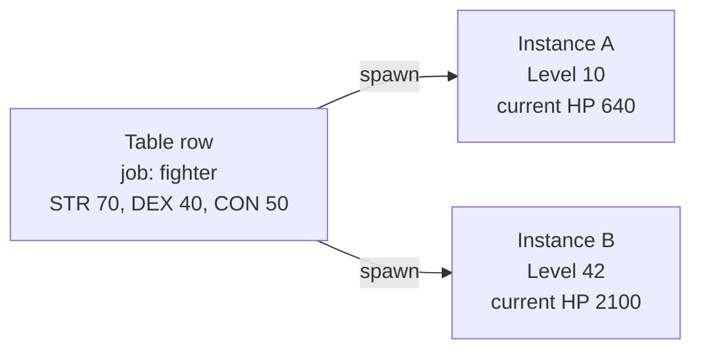
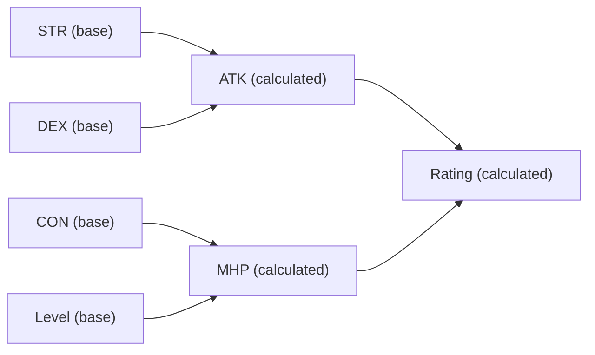
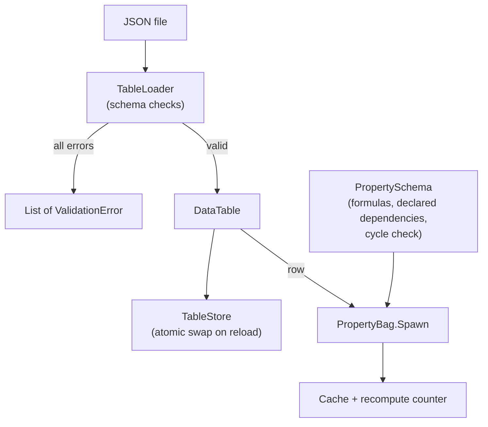

# Module 05: Data-driven design and property systems

- **Goal:** explain why an online RPG keeps its content in data tables instead of code, how to load and validate those tables safely, and how a property system turns a few base values into many cached, derived stats that are recomputed only when something they depend on changes; then build both in a small runnable example.
- **Prerequisites:** [Module 00](00-fundamentals.md), [Module 03](03-game-loop.md) (recalculation must fit inside a tick), [Module 04](04-entities-world.md) (entities that carry properties).
- **Example:** `examples/05-properties/` (`dotnet test examples/05-properties`)
- **Facts checked:** October 2026 (prices, licences and product status change; re-check before reuse)

## In short

A live RPG has thousands of items, skills and monsters, and designers must change them every week without a programmer and without a rebuild. So content lives in **data tables**, and code only interprets them. Two problems follow. First, data is written by hand, so it must be **validated when it loads**, with errors a designer can act on. Second, a character's stats are a web of derived numbers (max HP depends on CON and level, attack on STR and weapon, and so on), so the game needs a **property system** that computes each derived value lazily, caches it, and invalidates exactly the values affected by a change. The main choices are how dependencies are learned (declared or discovered), where formulas live (code or script), and how strict the loader is. The example builds a JSON table loader that reports every problem at once, and a property bag with declared dependencies, a lazy cache, recursive invalidation, a recompute counter, cycle detection at registration and a strict mode that catches forgotten dependencies.

## 1. The concept

### 1.1 Data-driven design: tables versus code

A game is **data-driven** when behaviour that designers tune lives in data files, not in compiled code. A sword's damage, a monster's hit points and a skill's cooldown are rows in a table. The code knows how to *use* a cooldown, never what the cooldown of a given skill is.

| | Hard-coded in code | Data table |
|---|---|---|
| Who changes it | A programmer | A designer |
| Cost of a change | Edit, build, test, deploy | Edit the file, validate, reload |
| Risk | Compile errors are caught by the compiler | Typos survive until something checks them |
| Scale | Hundreds of values at most | Hundreds of thousands of rows |
| Review | Code review | Diffs of data, plus automated checks |

The trade is clear: data gives speed and scale to the people who tune the game, and costs you the compiler's safety net. The rest of this module is about buying that safety back.

### 1.2 Type objects: one row, many instances

Most games separate a **definition** from an **instance**. A table row such as "fighter" or "iron sword" describes a *kind* of thing; each character or item in the world is an instance that points at its row and carries only its own changing state (current HP, enchant level). This pattern is often called the **type object** pattern. It keeps memory small (one row, many instances) and makes balance changes instant: edit the row and every instance follows.



### 1.3 Schemas and validation at load

A **schema** states what a table may contain: its columns, their types, which are required and the allowed ranges. **Validation at load** checks the whole file against the schema before the game uses it. Good validation has four habits:

- **Fail early.** Reject a bad file at load, not when a player first meets the broken monster.
- **Report everything.** List every problem in one run, with table, row and column, so a designer fixes them in one pass.
- **Catch typos.** An unknown column (`strr` instead of `str`) is an error, not something silently ignored.
- **All or nothing.** Never half-load. A table either replaces the old one completely or not at all.

### 1.4 Base values, calculated values and the dependency graph

A character's numbers fall into two groups. **Base values** are stored: STR, CON, level. **Calculated values** are derived: max HP, attack, hit rate. A calculated value is a function of other values, some base and some themselves calculated.

If you recompute every derived stat every time anyone reads it, you waste time. If you cache them, you must know when a cache entry is no longer true. The standard solution has three parts:

1. **Lazy evaluation.** Compute a derived value only when someone reads it.
2. **Caching.** Remember the result and return it on later reads.
3. **Invalidation through a dependency graph.** Each derived value lists what it depends on. When a base value changes, the system walks the graph in reverse and discards the cached values of everything downstream.



In this graph, changing STR invalidates ATK and, through it, Rating. MHP is untouched and keeps its cache.

### 1.5 Declared versus discovered dependencies

There are two ways to learn the graph. The system can **discover** dependencies by watching which properties a formula reads while it runs (this is how reactive frameworks in UI libraries and spreadsheets work). Or a person can **declare** them in data next to the formula.

Discovery cannot be forgotten, but it costs bookkeeping on every evaluation and can miss reads hidden behind an `if`. Declaration is free at run time and easy to read in a diff, but it is only as correct as the person who wrote it. Section 3 weighs this.

### 1.6 Hot reload

**Hot reload** means replacing data while the server keeps running. The safe recipe is the one from 1.3: parse and validate the new file off to the side, and swap it in only if it is fully valid. Anything derived from the old table (cached stats, spawned instances) must then be refreshed, which is where the invalidation machinery earns its keep a second time.

## 2. The design space

### 2.1 Where content lives

| Option | Fits | Cost |
|---|---|---|
| **Code constants** | Prototypes, a handful of values | Every change is a build and a deploy |
| **Spreadsheet or CSV tables** | Designer-friendly lists of items, skills and monsters | Weak types; needs a validator |
| **JSON or YAML files** | Nested data, version control diffs | Easy to mistype; needs a schema |
| **Engine assets** (Data Tables, ScriptableObjects, Resources) | Client content edited in the engine editor | Tied to the editor; awkward for a headless server |
| **Database tables** | Live-editable content, tooling and audit trails | Needs an admin tool and a deploy path for data |
| **Authoring text, compiled to a compact runtime format** | Huge tables and fast loads | Needs a converter and version discipline |

### 2.2 Where formulas live

| Option | Fits | Cost |
|---|---|---|
| **Typed code in the server language** | Small teams, strong tests | A formula change is a deploy |
| **Embedded script** (Lua, a custom language) | Balance changes without a rebuild; large formula sets | A second language, harder debugging and static checking |
| **Expressions in data** (a small formula string per row) | Simple arithmetic tuned by designers | Limited power; needs a parser and a sandbox |
| **Effect or modifier graphs** (additive and multiplicative layers) | Buff-heavy games | More machinery; best when stacking rules are complex |

### 2.3 How derived values are kept fresh

| Option | How it works | Fits | Weakness |
|---|---|---|---|
| **Recompute on every read** | Evaluate the formula each time | Rarely read stats | Wasteful in hot paths |
| **Recompute on every change** | Eagerly rebuild all derived stats when anything changes | Small stat sets | Wasteful with many derived values |
| **Lazy cache with declared dependencies** | A person lists what each formula reads; writes invalidate dependents | Large stat sets, predictable cost | A forgotten declaration goes stale silently |
| **Lazy cache with discovered dependencies** | The system records what the formula read while it ran | Reactive UI, spreadsheets, safety first | Bookkeeping on every evaluation; can miss reads behind an `if` |
| **Dirty flag, recompute all on read** | One flag per object | Few derived values | All-or-nothing recomputation |

### 2.4 How strict the loader is

| Option | Fits | Cost |
|---|---|---|
| **Trust the file** | Throwaway prototypes | Bad data reaches players |
| **Fail on the first error** | Small tables | A designer fixes problems one run at a time |
| **Collect every error, all or nothing** | Production content | A little more code; the best designer experience |
| **Validate in the editor as the designer types** | Large teams with custom tools | Tooling cost |

### 2.5 How to choose

| If your game... | Choose |
|---|---|
| has a few dozen stats and a small team | Typed code formulas, declared dependencies, strict mode in tests |
| has hundreds of formulas tuned weekly by balance designers | Script or expressions, plus a validator and a test harness |
| is buff-heavy with complex stacking | A modifier layer on top of the property system |
| edits content live | Atomic hot reload of validated tables |
| runs a headless server | Plain files the server loads without an editor |

## 3. Trade-offs and pitfalls

- **A forgotten dependency is a silent bug.** If a formula reads CON but its declaration omits CON, the stat keeps its cached value after CON changes. Nothing crashes. A player sees a wrong number until something else invalidates it. It depends on the order of reads and writes, so it is very hard to find.
- **Declarations drift.** Formulas and their dependency lists live in two places. Every formula edit must update the list, and nothing forces it unless you add a check.
- **Strings everywhere.** Property names are text, so a typo in a dependency list is a missing edge, not a compile error.
- **Cycles.** Nothing in a naive design prevents a declared loop, which causes unbounded recursion.
- **Slow script formulas.** Untyped scripts with limited tooling are harder to unit-test and profile than ordinary code.
- **Late data errors.** If mistakes are caught only by a batch tool that someone must remember to run, they reach the server.
- **Half-loaded tables.** A reload that fails in the middle leaves the game with a mix of old and new rows.
- **Stale derived state after a reload.** Everything computed from a table (cached stats, spawned instances) must be refreshed when the table changes.

## 4. Build or buy

### 4.1 What engines give you

| Need | Unreal | Unity | Godot |
|---|---|---|---|
| Tables of rows | **Data Tables** (rows from CSV or JSON, typed by a struct) | **ScriptableObjects** (assets holding data, editable in the Inspector) | **Resources** (typed data files, saved as text or binary) |
| One definition per kind | **Data Assets** | A ScriptableObject per kind | A Resource per kind |
| Derived stats with modifiers | **Gameplay Ability System** attributes and effects (base and current values, modifiers, a rich effect model) | No built-in stat system; asset-store or custom code | No built-in stat system; custom code |
| Validation | Editor-side validation hooks | `OnValidate` and custom editors | Editor plugins and setters |
| Hot reload | Editor reimports on change | Editor reimports on change | Editor reimports on change |

Two points matter for a server. First, these are **editor-centred** tools: they assume designers work inside the engine and that data is baked into the shipped game. A headless server for an online RPG usually wants plain files it can load without an editor. Second, the reactive "derived stat with a dependency graph" is only really provided by Unreal's attribute system, which is built around abilities and effects. Unity and Godot give you the storage and leave the derived-stat logic to you (as of October 2026).

### 4.2 Could a small team build it today?

Yes, and this is one of the cheaper "build" decisions in the course.

| Piece | Effort | Risk |
|---|---|---|
| Table loader with schema validation | Low, a few hundred lines on a standard JSON library | Low; the main risk is under-specifying the schema |
| Property bag with lazy cache and declared dependencies | Low, about 150 lines | Medium; subtle ordering bugs, forgotten dependencies |
| Cycle detection and strict-mode read checks | Low | Low |
| Hot reload with atomic swap | Low to medium | Medium; everything derived from the old table must refresh |
| Formulas in a scripting language | Medium to high (embedding, sandboxing, debugging) | Medium; see [Module 06](06-scripting.md) |
| Editor tooling for designers | Medium; a spreadsheet plus a validator covers most needs | Low |

AI-assisted development changes the economics. Schema code, validators and cycle detection are textbook, and an assistant can draft them from a precise spec in an afternoon. What stays human is deciding the schema and writing the *tests with real numbers* that pin the stat rules down.

**What a proof of concept must prove:**
1. A realistic table set (tens of thousands of rows) loads and validates within an acceptable startup time, and a hot reload of one table does not stall a tick.
2. Invalidation cost stays small when a base stat changes on a character with a few hundred derived properties.
3. Strict mode (or an equivalent test) reliably catches a forgotten dependency in the real formula set, which closes the main weakness of declared dependencies.

### 4.3 Verdict

**Build**, using standard open components: a JSON or CSV table format, a standard JSON parser, and a small property system in the server language. Do not adopt an engine's data-asset system as the server's source of truth, because it ties data to an editor; use the engine's tools on the client for presentation data. Keep formulas **in the same language as the server** (ordinary typed code) until a real need for live-patchable script appears. That removes the second language, gives the compiler back, and makes every formula unit-testable. Keep the dependency list **declared**, but verify it automatically.

## 5. The example

### 5.1 Design



There are two independent halves, joined by a spawn step. The loader and store handle data; the schema and bag handle properties.

### 5.2 The data half

- **`FieldSpec` and `TableSchema`** describe columns: name, type (number or text), required or not, optional minimum and maximum.
- **`TableLoader.Load`** parses JSON and checks every row. It never stops at the first problem, so a designer sees the full list. Each error is a `ValidationError` that prints as `table[row].field: message`.
- **`DataTable`** is the immutable result, with rows looked up by id. These rows are the type objects of section 1.2.
- **`TableStore`** holds the live table. `Reload` validates the new text and swaps only on success, bumping a version number so dependants know to refresh.

The key tests show the behaviour with concrete data:

```csharp
// A wizard row without "con":
Assert.Equal("job[wizard].con: required field is missing", error.ToString());
```

A second test feeds one file with an out-of-range value (`str: 999` against a range of 1 to 200), a wrong type, a misspelled column and a duplicate id, and expects exactly four errors in one run. A reload test confirms that an invalid edit leaves the old table, and the version, untouched.

### 5.3 The property half

- **`PropertyDefinition`** is either `Base(name)` or `Calculated(name, formula, dependsOn...)`. The dependency list is written by hand next to the formula.
- **`PropertySchema`** registers definitions, builds the reverse map (property to its dependents) once, and checks for a cycle at each `Add`. A rejected definition is removed, so the schema stays usable. `FindUnknownDependencies` reports declared names that were never registered, which catches typos.
- **`PropertyBag`** is the per-object store. `Set` writes a base value and invalidates; `Get` returns the cache or computes and caches.

The key lines of invalidation:

```csharp
private void Invalidate(string changed)
{
    foreach (var dependent in _schema.DependentsOf(changed))
        if (_cache.Remove(dependent))
            Invalidate(dependent);
}
```

The recursion stops at any property that is already uncached. That is safe because a cached dependent can only exist if its inputs were read, and so were cached, when it was computed.

The model uses three teaching formulas (a real game puts its own here):

| Property | Formula | Depends on |
|---|---|---|
| MHP | CON * 10 + Level * 5 | CON, Level |
| ATK | STR * 2 + DEX | STR, DEX |
| Rating | ATK + MHP / 10 | ATK, MHP |

For a fighter with STR 70, DEX 40, CON 50 at level 10: MHP = 500 + 50 = 550, ATK = 140 + 40 = 180, Rating = 180 + 55 = 235.

### 5.4 The tests that matter

| Test | What it proves | Numbers |
|---|---|---|
| `Get_ReadTwice_ComputesOnce` | The cache works | MHP computed once after two reads |
| `Set_Str_InvalidatesOnlyStatsThatDependOnIt` | Precise, recursive invalidation | First read of Rating costs 3 recomputes. After STR 70 to 80, reading Rating gives 255 and the total is 5: ATK and Rating again, MHP still 1 |
| `Set_PropertyNobodyHasReadYet_ComputesNothing` | Laziness | Counter stays 0 |
| `Set_SameValue_DoesNotInvalidate` | No pointless work | ATK computed once across a no-op write |
| `Add_LongerCycle_IsDetected` | Cycles caught at registration | Message `dependency cycle: C -> A -> B -> C` |
| `FindUnknownDependencies_TypoInDeclaration_IsReported` | Misspelled declaration is found | `DEXX` reported |
| `Get_ForgottenDependency_GoesStaleWhenNotStrict` | The bug itself | CON 50 to 60 still reads 501 instead of 601 |
| `Get_ForgottenDependency_ThrowsWhenStrict` | The mitigation | Throws, naming `MHP` and `CON` |

The last two are the heart of the evaluation. In strict mode, the bag records which properties a formula reads while it computes and compares them to the declaration. Production can run non-strict for speed, while tests and development run strict. That keeps the declared graph's speed and explicitness and removes most of its danger.

### 5.5 What the example leaves out

- No modifiers or buffs (additive and multiplicative layers). A real stat system adds a modifier list per property.
- No string properties, no per-class schemas, no inheritance between schemas.
- Only numbers and text in tables; no cross-table references (item row naming a skill row). A real loader checks that referenced ids exist.
- No file watching. `TableStore.Reload` is the hook; wiring it to a file watcher or an admin command is a host concern.
- No formula language. Formulas are C# lambdas; a script layer is the subject of module 06.
- Single-threaded by design, like a zone's simulation loop.

## Key takeaways

- Put tunable content in **data tables**; keep code for rules. This speeds up designers and scales to hundreds of thousands of rows.
- Data loses the compiler's safety, so **validate at load**, report every error with table, row and column, and never half-load.
- **Hot reload** is safe only as an atomic swap of a fully validated table.
- A **property system** computes derived stats lazily, caches them, and invalidates through a reverse dependency map, so a change touches only what depends on it.
- Declared dependencies are fast and explicit, but a forgotten entry gives a silently stale stat, and a loop recurses forever unless you guard against it.
- Mitigate with **cycle checks at registration** and a **strict mode** that compares what a formula reads with what it declares.
- Build-or-buy verdict: **build**. Engine data assets are editor-centred, and the property system is small enough to own and test with concrete numbers.

## Further reading

- Robert Nystrom, *Game Programming Patterns*: the "Type Object" chapter, https://gameprogrammingpatterns.com/type-object.html
- Unreal Engine documentation: Data Tables and the Gameplay Ability System (attributes and gameplay effects), https://dev.epicgames.com/documentation/en-us/unreal-engine
- Unity Manual: ScriptableObject, https://docs.unity3d.com/Manual/class-ScriptableObject.html
- Godot documentation: Resources, https://docs.godotengine.org/en/stable/tutorials/scripting/resources.html
- Microsoft documentation: System.Text.Json overview, https://learn.microsoft.com/dotnet/standard/serialization/system-text-json/overview
- Jason Gregory, *Game Engine Architecture* (data-driven design and resource management chapters), CRC Press.
