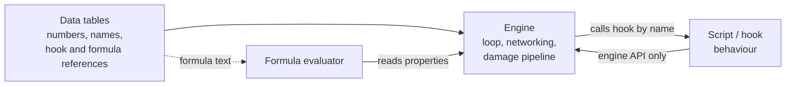
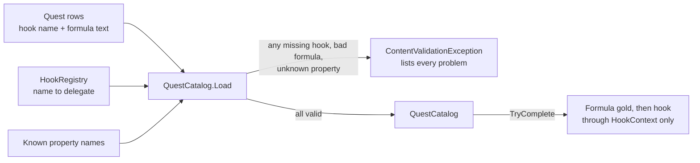

# Module 06: Scripting, the engine/script boundary

- **Goal:** understand why games script their content, what belongs in engine code, in script and in data, and how an embedded language is bound to the engine; then build a small content-hook registry and a safe formula evaluator that fail at load time instead of in front of a player.
- **Prerequisites:** [00 — Game development fundamentals](00-fundamentals.md), [03 — The game loop and time](03-game-loop.md). [05 — Data-driven design and property systems](05-data-properties.md) is a natural companion (formulas live next to the property system).
- **Example:** `examples/06-scripting/` (`dotnet test examples/06-scripting`)
- **Facts checked:** October 2026 (prices, licences and product status change; re-check before reuse)

## In short

A game engine changes slowly and carefully; game content changes daily. **Scripting** is the seam between the two: the engine exposes a bounded set of operations, and content (quests, skills, buffs, monster behaviour, formulas) is written on the other side of that seam, in a form that is faster to edit. There are several ways to build that seam, from a full embedded language to plain data with a tiny formula language, and the right one depends on who edits content and how often. The most important question is not which language you pick but **when mistakes are found**: at edit time, at load time, or only when a player triggers the path. This module builds the cheap, safe end of the spectrum: a registry of C# delegates whose names are verified when content loads, and a small expression evaluator that parses a formula such as `STR * 2 + LV` once and evaluates it deterministically against a property lookup.

## 1. The concept

### 1.1 Why games script

Three pressures push gameplay logic out of the engine's main language:

- **Iteration speed.** Compiling and restarting a large server to change a number in a quest takes minutes. Reloading a script takes seconds, or none.
- **Who edits.** Designers and content writers change quests, skills and monster behaviour far more often than programmers change the engine. A smaller, safer language lets them do it without being able to corrupt memory.
- **Live operation.** A running online game cannot restart every time a reward is wrong. Hot-reloading content into a running process is a major operational tool (module 25).

Scripting also has costs: a second language, a binding layer to maintain, slower execution, harder debugging and a risk that logic hides where nobody looks.

### 1.2 Engine, script, data: three places for a rule

Not everything that changes belongs in a script. A useful test is to ask what the rule *is*:

| Place | Holds | Example | Edited by |
|---|---|---|---|
| **Engine** (compiled code) | Mechanisms: loops, networking, collision, the order of the damage pipeline, anything performance-critical or security-critical | "Apply a buff to a target", "move this entity" | Programmers |
| **Data** (tables, JSON) | Facts and numbers: tuning values, costs, names, which hook a row uses | `Cost = 400`, `Cooldown = 6000` | Designers |
| **Script** (a language the engine can call) | Behaviour that data cannot express: sequences, conditions, one-off rules | "On completion, grant the pelts, then open the door" | Designers and programmers |

The rule of thumb: **prefer data over script, and script over engine changes**. Every rule that can be a number in a table never needs a program, a reviewer or a debugger. Formulas sit between data and script: they are data (a string in a table) but they compute. A small formula language, with no loops or side effects, gives designers arithmetic without the risks of a full language (§5).

### 1.3 Embedding a language

To embed a language, the engine hosts an **interpreter** (or a just-in-time compiler) inside its process and gives it a **state**: a sandbox with its own variables and call stack. Two directions of calls must work:

- **Engine to script:** the engine looks up a function by name in the state and calls it with arguments (a quest completes, a skill resolves).
- **Script to engine:** the engine registers native functions under names the script can call (`GrantItem`, `GetNearbyEnemies`). This registration is the **binding**. Writing it by hand is repetitive, so many projects use a **binding generator** that reads C++ declarations and emits the glue.

Lua is the classic choice: small, fast, designed to be embedded, with a simple C API. Others you will meet are Python (heavy), JavaScript engines (V8, QuickJS), and the engine-native languages: Unreal's Blueprints and Verse, Godot's GDScript, and plain C# in Unity.

### 1.4 The design questions every boundary answers

- **What is the calling convention?** By name (string lookup), by registered delegate, by interface, or by an ID stored in data.
- **What may a script touch?** Everything, or only a narrow context object. A narrow API is both a safety measure and documentation.
- **When are mistakes found?** At edit time, at load time, or only when a player triggers the path. This is the single most important question, and §3 and §5 return to it.
- **How does it fail?** A script error should log and abort that one call, not crash a zone with hundreds of players.
- **How is it reloaded and debugged?** Hot reload, breakpoints and logs decide whether designers can really work alone.

## 2. The design space

Games draw the engine/script boundary in several places. The options below can be combined; most shipped games use two or three.

### 2.1 Options

| Option | How it works | Typical users |
|---|---|---|
| **No scripting: data only** | Behaviour is picked from a fixed menu of engine-coded types; rows in tables choose the type and its numbers | Small action games, many mobile RPGs; the cheapest and safest |
| **Data plus formulas** | Rows carry formula text evaluated by a sandboxed expression language | Stat systems, drop tables, damage tuning in nearly every RPG |
| **Visual graphs and behaviour trees** | Designers wire nodes (conditions, actions) in an editor; the engine interprets the graph | Unreal Blueprints, quest and AI editors in many studios |
| **Embedded general language** | An interpreter (Lua, a JavaScript engine, Python) hosted in the process with a binding layer | Long-running online games with large content teams, modding-friendly games |
| **Engine-native language** | Scripts are written in the engine's own language, compiled with the game | Unity (C#), Godot (GDScript or C#), Unreal (C++ and Blueprints) |
| **Typed hooks in the server language** | The server is written in a managed language; content hooks are ordinary typed code registered by name | Small teams who want one toolchain and real tests |

### 2.2 Where the game type matters

- **Single-character action RPGs** put most behaviour in animation-driven skills and level scripts. Scripting concentrates on encounters, cutscenes and quests, usually through engine-native tools, because the designers sit inside the editor.
- **Online RPGs with parties and long live service** need content changes without a client or server release, so they lean towards an embedded language or hot-reloadable hooks, and invest in load-time validation.
- **Server-authoritative games** must run script on the server, which makes sandboxing (time budgets, narrow APIs) a security topic, not a convenience.
- **Single-player and offline games** can accept the engine-native option, because a crash only hurts one player.

### 2.3 How to choose

| If... | Prefer |
|---|---|
| Content is mostly numbers and fixed types | Data only, plus data formulas |
| Designers edit inside an engine editor | The engine's native tools (Blueprints, GDScript, C#) |
| Non-programmers must change live behaviour without a build | An embedded language, with a small API and load-time checks |
| A small team writes everything in one language | Typed hooks in the server language, plus data formulas |
| Modders will extend the game | An embedded, sandboxed language |
| You need to unit-test every rule | Typed hooks and pure formulas; avoid logic that needs a live world |

## 3. Trade-offs and pitfalls

- **Scattered logic.** If a rule has no single home (for example a buff's effect is a few `if buff is active` checks spread through many damage scripts), adding the buff means finding and editing every formula that should care. Give each concept one place: a modifier layer, a hook, a data row.
- **String-named hooks fail at run time.** A function name built from strings (an object type, a tag, a trigger name) is only resolved when that path executes. A typo becomes a silent no-op, found by a player doing a rare thing. Put the name in data and resolve it when content loads.
- **Hard to test.** Scripts that depend on a live world cannot be called in isolation with fake inputs. Prefer hooks that take a context object, so a test can build a small one.
- **A frozen or forked interpreter.** An embedded runtime copied into your tree stays at the version you copied. Plan for upgrades, or use a maintained package.
- **A large API with weak boundaries.** Hundreds of functions that can create objects, push UI and read items are a lot of surface to keep consistent, and a hard thing to security-review. Mutations that matter (items, currency) should go through a few validated entry points.
- **Performance.** An interpreted formula in a hot loop costs more than compiled code. Cache computed values until an input changes (see module 05).
- **Error isolation.** One bad script must not take down a zone. Catch exceptions per call, log the hook name, and abort only that call.
- **Hot reload and live state.** Swapping content while players are connected needs a plan: build the new registry, validate it, then swap between ticks.

## 4. Build or buy

### What engines give you

| Engine | Scripting you get as of October 2026 | Notes |
|---|---|---|
| **Unreal** | C++, Blueprints (visual scripting, compiled to a VM), and Verse (a newer language used mainly in the Fortnite/UEFN ecosystem) | Designers work in Blueprints; hot reload and live coding exist but are not seamless for large C++ changes. |
| **Unity** | C# for everything, compiled by the editor, with domain reload on edit | The "script" and the "engine glue" are one language. No sandbox: any script can do anything. |
| **Godot** | GDScript (Python-like, native), C# support, and GDExtension for native code | Scripts are first-class nodes; hot reload of scripts in a running game is a core feature. |

All three give a **debugger, hot reload and a binding layer for free**. None of them is a server architecture, though: an authoritative MMO server with thousands of entities per zone is typically your own code, with the engine used, if at all, for the client or as a headless simulation host.

### What we would embed instead

If we want a script language on our own server, the usual options as of October 2026:

| Option | Strengths | Risks |
|---|---|---|
| **Lua through a .NET binding** (for example MoonSharp, a managed interpreter, or NLua/KeraLua over the native Lua runtime) | Small, widely known, sandboxable. Designers can learn it quickly. | A managed interpreter is slower and its maintenance status needs checking before adoption; a native binding adds per-platform libraries and interop costs. You own the binding layer. |
| **C# itself, hot-reloaded** (collectible `AssemblyLoadContext`, or Roslyn scripting) | One language and one toolchain; debugger, tests and refactoring work. Content hooks are ordinary typed code. | Hot reload needs care (unloading, state migration). No sandbox: hooks are fully trusted code, so only your own team writes them. |
| **Data-only formulas** (an expression language like §5's) | Safe by construction: no loops, no side effects, parsed once, trivially testable and diffable. | Cannot express sequences or branching behaviour. Needs a hook escape hatch. |

### Could we build it ourselves?

Yes, at a modest scale. An expression evaluator is a day of work (the example is about 200 lines). A hook registry with load-time checking is a few hours. Embedding Lua is a matter of days for a working proof of concept, but the *ongoing* cost is the binding layer, the sandbox policy, error handling and debugging support, and that grows with every function you expose. AI-assisted development helps with the glue and with drafting a binding, but each exposed function is still a security and consistency decision a human must own.

A proof of concept for the scripting boundary must prove: (1) a typo in a hook or property name is caught before the server accepts players; (2) a bad script cannot hang or crash a zone (time and instruction budgets, exception isolation); (3) a hook can be unit-tested with fake inputs; (4) reloading content does not lose live state; (5) the per-call cost fits the tick budget from module 03 for the hottest hook.

### Verdict

**For a small team: build, and keep the surface small.** Start with **C# content hooks** registered by name and verified at load, plus **data and data formulas** for everything numeric. Add an embedded language, most likely Lua, **only if non-programmers must author behaviour without a build step**. If you do, bind a few dozen functions, not hundreds, expose a narrow context object instead of the whole world, and apply the same load-time checks to its entry points. Do not assemble function names from strings at run time: put the name in data and look it up in a registry when content loads.

## 5. The example

### Design

Two small mechanisms carry the lesson:

1. **A content-hook registry.** Hooks are C# delegates registered under names that follow a convention (`QUEST_DONE_WOLVES`). Content (here, quest rows) refers to hooks by name only. When content loads, every reference is resolved and every formula parsed, **all problems are collected and reported together**, and the server refuses to start if any exist.
2. **A safe expression evaluator.** A formula such as `STR * 2 + LV` is parsed once into a tree of delegates. Evaluating it reads named properties through a lookup and does arithmetic. It has no loops, no assignment, no calls out and a nesting limit, so it cannot hang or change state.

The hook never sees the player object directly. It gets a `HookContext`, the **binding surface**: `GrantGold`, `GrantItem` and read-only properties. This is a handful of bound functions rather than hundreds, and every mutation goes through methods that validate their arguments.

### Walkthrough

- **`ContentHook.cs`**, **`HookContext.cs`**, **`PlayerState.cs`**: the delegate type, the narrow API and the state it can change. `PlayerState`'s setters are `internal`, so a hook cannot bypass `HookContext`.
- **`HookRegistry.cs`**: `Register(name, hook)` enforces the naming convention (a regular expression requiring `UPPER_SNAKE_CASE` with a prefix) and rejects duplicates. `TryGet` is the only way to resolve a name.
- **`QuestDef.cs`**, **`QuestCatalog.cs`**: a quest row is just `(Id, CompleteHook, GoldFormula)`. `QuestCatalog.Load` resolves the hook, compiles the formula, checks that every property the formula reads exists in the schema, and throws a single `ContentValidationException` that lists all problems. `TryComplete` evaluates the gold formula, then runs the hook.
- **`ExpressionParser.cs`**, **`CompiledExpression.cs`**, **`IPropertyLookup.cs`**, **`MapProperties.cs`**, **`ExpressionException.cs`**: a recursive-descent parser supporting numbers, property names, `+ - * / %`, unary minus, parentheses and `min`, `max`, `abs`, `floor`, `ceil`, `clamp`. Parsing records which names the formula reads (`Variables`), so a loader can check them against the data schema before any player is involved. Errors state what is wrong and the character position.

### Key tests and their numbers

| Test | What it proves |
|---|---|
| `Load_MissingHook_FailsAtLoadNamingQuestAndHook` | A typo (`QUEST_DONE_WOLFES`) fails at load with the message `Quest 'wolves': hook 'QUEST_DONE_WOLFES' is not registered.` |
| `Load_SeveralProblems_ReportsAllAtOnce` | A missing hook, a truncated formula and an unknown property (`LUCK`) are reported together: 3 problems, one load. |
| `TryComplete_QuestWithHook_GrantsFormulaGoldThenHookRewards` | With STR 12 and LV 5, `STR * 2 + LV` grants 29 gold; the hook adds 100 gold and 2 pelts: gold 129. |
| `Evaluate_ValidFormula_ReturnsExactValue` | Precedence and functions: `2 + 3 * 4 = 14`, `(STR + LV) * 2 = 34`, `STR / 5 = 2.4`, `floor(STR / 5) = 2`, `clamp(STR * 10, 0, 100) = 100`. |
| `Parse_InvalidFormula_ThrowsClearError` | `STR * ` reports "Unexpected end of formula", `(STR + 1` reports "Expected ')'", `sqrt(4)` names the unknown function; each includes the position. |
| `Evaluate_SameInputRepeated_GivesIdenticalResults` | 1,000 evaluations of the same formula and inputs return the same value; no hidden state or randomness. |
| `Parse_DeeplyNestedParentheses_IsRejected` | 100 nested parentheses are refused: a hostile or accidental formula cannot exhaust the stack. |

The example touches no clock, random number generator or file, so it is deterministic in the sense module 03 requires.

### Using it for a different game

The code knows nothing about quests in particular. A different game registers other hooks (`SKILL_RESOLVE_HEAL`, `ITEM_USE_POTION`), declares other property names in its schema, and loads rows from its own tables. The rules stay the same: names live in data, and every reference is checked when content loads.

### What the example leaves out

- **A real script language.** The hooks are compiled C#. Embedding Lua would add a state per zone, instruction budgets, a binding layer and a debugger story; the load-time checks and narrow context would carry over unchanged.
- **Hot reload.** The registry is built at startup. Reloading means building a new registry and catalog, validating them, then swapping them in between ticks.
- **Hook arguments and results.** One context type serves every hook; a real game has typed contexts per event (a hit, a death, an item use).
- **Error isolation at run time.** A production host would catch exceptions per hook call, log the hook name and quest, and abort only that call.
- **Fixed-point numbers.** Formulas use `double`, which is deterministic on one machine and runtime. If server and client must agree bit for bit, use integers or fixed point.

## Key takeaways

- A script layer buys content velocity: designers and live operations change behaviour without rebuilding the engine. Put numbers in data, mechanisms in the engine, and only genuine behaviour in script.
- The design space runs from data-only through formulas, visual graphs and engine-native languages to an embedded language; most games combine two or three.
- The key question is when mistakes are found. Name hooks by convention, store the name in data, and verify every reference when content loads.
- Unreal, Unity and Godot give you a script language, hot reload and a debugger, but none of them is your server architecture.
- For a small team, C# hooks plus data formulas are enough; add Lua only if designers need to author behaviour without a build.
- Keep the engine-to-script API small and narrow (a context object, validated mutations), not hundreds of functions with raw access.
- The example shows it: a typo in a hook name fails at load with a precise message, `STR * 2 + LV` evaluates to exactly 29 for STR 12 and LV 5, bad formulas fail with a position, and everything is deterministic.

## Further reading

- [Lua 5.4 reference manual](https://www.lua.org/manual/5.4/) and [Programming in Lua](https://www.lua.org/pil/)
- [tolua: binding generator for Lua](https://www.tecgraf.puc-rio.br/~celes/tolua/)
- [MoonSharp: a Lua interpreter for .NET](https://www.moonsharp.org/)
- [NLua: .NET bindings for Lua](https://github.com/NLua/NLua)
- [Robert Nystrom: Game Programming Patterns, Bytecode](https://gameprogrammingpatterns.com/bytecode.html)
- [Robert Nystrom: Crafting Interpreters](https://craftinginterpreters.com/)
- [Unreal Engine: Blueprints visual scripting](https://dev.epicgames.com/documentation/en-us/unreal-engine/blueprints-visual-scripting-in-unreal-engine) and [Verse language reference](https://dev.epicgames.com/documentation/en-us/uefn/verse-language-reference)
- [Godot: GDScript reference](https://docs.godotengine.org/en/stable/tutorials/scripting/gdscript/gdscript_basics.html)
- [Microsoft: AssemblyLoadContext and collectible assemblies](https://learn.microsoft.com/en-us/dotnet/standard/assembly/unloadability)
