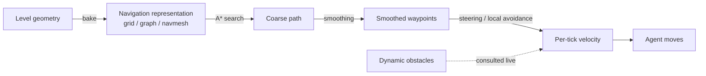
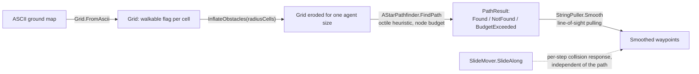

# Module 07: Navigation and pathfinding

- **Goal:** explain how a game decides where an agent can walk and how it gets from A to B around obstacles, compare the common designs, then build a small server-side pathfinder (grid A*, agent-size handling, path smoothing and a sliding move step) that shows a middleware-free approach is workable.
- **Prerequisites:** [03 — The game loop and time](03-game-loop.md) (a path search has to fit inside a tick budget), [06 — Scripting: the engine/script boundary](06-scripting.md).
- **Example:** `examples/07-navigation/` (`dotnet test examples/07-navigation`)
- **Facts checked:** October 2026 (prices, licences and product status change; re-check before reuse)

## In short

A character needs to know two things to move intelligently: what ground is walkable (**navigation**) and what specific route avoids obstacles right now (**pathfinding** plus **local avoidance**). Games represent walkable space as a **grid**, a **waypoint graph**, or a **navigation mesh (navmesh)**; the search algorithm over any of them is **A\***. Because a real character has a footprint, not a point, that footprint has to be accounted for, either by **eroding** the navmesh inward by a fixed radius (Recast/Detour, and therefore Unreal, Unity and Godot) or by **exactly expanding** every obstacle by the agent's precise shape (the approach of the commercial middleware **PathEngine**). Which design fits depends on the game: a click-to-move online RPG needs authoritative server paths, while a direct-control action game may need no pathfinding for the player at all. The example does the job for a grid world (A* with an octile heuristic, agent-size handling by obstacle inflation, line-of-sight smoothing, a vector-projection slide and a hard per-query node budget) in about 350 lines of plain C#, with no middleware and no navmesh compiler.

## 1. The concept

### 1.1 Navigation vs. pathfinding vs. local avoidance

These three jobs get used loosely as synonyms; keep them separate:

- **Navigation (representation).** A static(-ish) description of where an agent can be at all — a grid, a waypoint graph, or a navmesh. Built ("baked") ahead of time from level geometry.
- **Pathfinding (global planning).** Given that representation plus a start and a goal, compute an ordered route between them, ideally the cheapest one. **A\*** (§1.3) solves this.
- **Local avoidance / steering (reactive movement).** Given the next few meters of a path, decide the agent's actual velocity *this tick*, so it doesn't walk into a wall edge, another agent, or something that wasn't in the baked data. This runs far more often (every tick) than pathfinding (only when the destination changes), and is usually much cheaper per call.

### 1.2 Representations: grid, waypoint graph, navmesh

| Representation | What it is | Strengths | Weaknesses |
|---|---|---|---|
| **Grid** | Uniform cells (squares/hexes); each walkable cell is a node connected to its 4/8 neighbours. | Trivial to build and update at runtime; natural for flow fields. | Memory grows with map size × resolution; blocky for angled walls. |
| **Waypoint graph** | Hand-placed points connected by designer-marked edges. | Tiny memory footprint; easy to author and debug. | Agents glued to lines; no natural crowding or off-path movement. |
| **Navmesh** | The walkable surface decomposed into convex polygons; shared edges are the graph. | Covers 100% of walkable surface; the modern default in every major engine. | More expensive to build (voxelization/boundary extraction); must be rebuilt when geometry changes. |

A grid is a uniform special case of a graph; a navmesh's polygon-adjacency graph is a graph too, so A* (next) works unmodified over any of the three once nodes and edge costs are defined.

### 1.3 A\* search

**A\*** finds the lowest-cost path between a start and a goal in a weighted graph. For each node `n`: `g(n)` is the best known cost from the start, `h(n)` is a **heuristic** estimate of the cost still to go, and `f(n) = g(n) + h(n)` is A*'s priority. If `h` never overestimates the true remaining cost it is **admissible**, and A* is guaranteed optimal. For 8-directional grid movement with diagonal cost `√2`, the standard admissible heuristic is the **octile distance**: `h = straightSteps + diagonalSteps·√2`, where `diagonalSteps = min(|dx|,|dy|)` and `straightSteps = |dx-dy|`.

Algorithm: keep an **open set** ordered by lowest `f` and a **closed set** of finalized nodes. Repeatedly pop the lowest-`f` open node, finalize it, and relax each neighbour's tentative `g`; if improved, record it and (re-)add it to open. Stop when the goal is popped (or open is empty — no path). Dijkstra (`h(n)=0` everywhere) is the special case with no heuristic — still optimal, but explores in all directions equally and is slower in practice.

On a navmesh the "nodes" are polygons and edge cost is usually the distance between portal midpoints, so A* gives a **sequence of polygons**, not yet a walking line — the next step exists for that reason.

### 1.4 Path smoothing: string pulling / the funnel algorithm

A* over a navmesh returns a corridor of polygons; connecting their centers zig-zags unnaturally. **String pulling**, best known as the **funnel algorithm**, threads a taut string through the corridor's shared edges ("portals") from start to goal; the string pulls straight, hugging every corner — the shortest path *through that specific corridor*.

Mechanically: keep a **funnel** (an apex, plus a left and right bounding ray). For each next portal, tighten whichever side narrows; if a new point would cross the *opposite* boundary, the funnel has collapsed — the apex moves to that boundary's point (emitted as a waypoint) and the funnel reopens from there. The goal point closes the funnel at the end.

A grid has no polygon corridor or portals, so this course's rewrite (§5) uses the grid analogue instead: **greedy line-of-sight pulling** — walk forward from the current anchor to the farthest waypoint still visible in an unobstructed straight line, emit it, and repeat from there. It solves the same problem (remove the zig-zag a cell-by-cell path leaves behind) without needing portals.

### 1.5 Agent shape: erosion vs. exact expansion

A navmesh (or grid) built from raw geometry describes where a **mathematical point** can stand, not where a character with a real footprint can stand without clipping a wall. Two standard answers, both really computing the same Minkowski-sum obstacle growth, just at different places:

1. **Erode the navmesh by the agent's radius** (Recast/Detour, and therefore Unreal, Unity, Godot): shrink the walkable surface inward at bake time by (roughly) the agent's radius. Cheap and simple for circular/capsule agents, but one fixed radius per baked mesh — several agent sizes need **one baked mesh per size class** ("agent types" in Unreal/Unity).
2. **Expand every obstacle by the agent's exact shape before pathing** (PathEngine): grow every obstacle boundary by the agent's precise convex shape and search for a path for a point-agent against the *expanded* obstacles. Exact for non-circular shapes, and many different agent shapes can query the *same* base ground data — the expansion is a separate per-shape preprocessing pass over one shared mesh.

### 1.6 Local avoidance: steering and RVO/ORCA

A global path assumes a static world at the moment it was searched. Re-planning on every bump between moving agents would be far too expensive. The standard layered fix is **local avoidance**: every tick, nudge the agent's *velocity* away from nearby moving obstacles without touching the path. **Steering behaviors** (Craig Reynolds' boids, 1987) are simple additive force rules — cheap, but can oscillate in crowds. **RVO/ORCA** (van den Berg, Lin & Manocha, 2008) model each nearby agent as a circle, compute the half-plane of velocities that avoids a collision within a short horizon, intersect all such half-planes, and pick the closest velocity to the agent's desired one that still satisfies every constraint — each agent takes half the responsibility for avoiding the other, so two agents walking straight at each other both sidestep instead of one freezing.

### 1.7 Server vs. client pathfinding in an online game

In a **server-authoritative** online game there is a real design choice. **Server-side pathfinding** keeps the server the single source of truth (it can reject an impossible move), but competes for the same fixed per-tick CPU budget as everything else — the cost driver is the number of **concurrent searches per tick**, not the number of moving agents (advancing an already-found path is cheap; the search itself is not). **Client-side pathfinding** is cheap for the server and gives instant feedback, but the server must still validate the result, so it only saves CPU if validation is cheaper than computing the path itself. A common pragmatic split: the server computes and owns the authoritative path for infrequent player-click moves and for (batched) monster AI, while the client only interpolates already-approved positions — avoiding ever needing client and server pathfinding to agree bit-for-bit.

## 2. The design space

### 2.1 How the player moves

The movement model decides how much pathfinding the server needs.

| Model | How it works | Pathfinding need | Typical games |
|---|---|---|---|
| **Direct control** (keys or stick) | The client sends a direction each tick; the server moves the character and resolves collisions | None for the player; the server only slides the body along walls. Navigation is still needed for monsters, pets and followers | Most action RPGs and shooters |
| **Click-to-move** | The player clicks a point; the game finds a route and walks it | A full path query per click, usually on the server | Isometric action RPGs, many MMORPGs and mobile RPGs |
| **Click-to-interact / auto-move** | Clicking an NPC, quest marker or target triggers a walk to it | Paths over long distances, sometimes across zones | Quest-driven RPGs, mobile games |
| **Follow / formation** | Companions follow a leader and keep spacing | One query per follower, plus avoidance between them | Party games with pets, fellows or henchmen |

A **single-character action RPG** often skips player pathfinding and lets the physics engine do the work. A **multi-character party** needs it for every character the player does not steer directly, because those characters must find their own way to the leader or the target.

### 2.2 Who computes the path

| Option | For | Against |
|---|---|---|
| **Server only** | One source of truth; the server can reject impossible moves | CPU cost grows with concurrent searches; the client waits for the answer |
| **Client predicts, server validates** | Instant feedback; server only checks the result | The server still needs navigation data and a cheap validation; client and server can disagree |
| **Both run the same search** | The client can show the path immediately and the server confirms it | Two copies of the navigation data and algorithm to keep identical |

A common compromise is for the server to own the path for clicks and monster AI, while the client interpolates positions the server has approved.

### 2.3 Representation and obstacles

| Choice | Fits |
|---|---|
| **Grid** | Tile-based worlds, 2D and 2.5D maps with simple collision, worlds that change at runtime |
| **Waypoint graph** | Small hand-authored areas, on-rails encounters, debugging-friendly prototypes |
| **Navmesh** | Large 3D terrain and buildings; the default in every major engine |
| **Flow field** | Many agents heading for the same goal (crowds, swarms) |

Static obstacles are baked into the representation. Dynamic obstacles (doors, other characters, destructible walls) either re-bake a tile, mark an area with a cost, or are handled by local avoidance only.

### 2.4 Agent size classes

| Strategy | Notes |
|---|---|
| **One size for everyone** | Simplest; large monsters clip walls |
| **A few fixed size classes** (small, medium, large, huge) | One baked or inflated representation per class; the usual choice |
| **Arbitrary shapes** | Exact, but needs a library built for it (the expansion approach in §1.5) |

### 2.5 How to choose

| If... | Prefer |
|---|---|
| The player steers directly and maps are 3D | Engine navmesh for AI only; physics for the player |
| Click-to-move on a flat or tiled map | Grid A* on the server, line-of-sight smoothing |
| Large 3D terrain with many agent sizes | Recast/Detour (or the engine's built-in navmesh), one mesh per size class |
| Hundreds of agents chasing one goal | A flow field, or hierarchical search |
| Crowds that must not overlap | Add RVO/ORCA local avoidance on top of any of the above |
| A tight server CPU budget | Cap the nodes per query, spread searches over ticks, cache paths |

## 3. Trade-offs and pitfalls

- **Search cost spikes.** One pathological query (a goal that is unreachable, a huge open map) can stall a tick. Cap the work per query and treat "budget exceeded" as a distinct failure from "no path".
- **Unreachable goals.** Searching to a blocked goal explores the whole reachable area. Check reachability first, or move the goal to the nearest walkable cell.
- **Corner cutting.** Diagonal steps between two blocked cells let agents slip through walls. Forbid diagonals unless both neighbouring cells are open.
- **Footprint bugs.** If the agent is treated as a point, wide characters clip walls; if the inflation is too generous, they refuse to enter gaps they could use. Test with a gap exactly as wide as one size class and not the next.
- **Stale data.** Baked navigation does not know about dynamic obstacles. Decide which changes trigger a re-bake and which are left to local avoidance.
- **Client/server disagreement.** If both run a search, small numeric differences produce different paths. Make the server's answer authoritative.
- **Followers piling up.** Many agents choosing the same path overlap. Add spacing, formations or local avoidance.
- **Retry storms.** An agent whose path fails and retries every tick wastes the budget. Back off for a few ticks.

## 4. Build or buy

### What the engines and middleware give you

| Dimension | PathEngine (commercial middleware) | Unreal (Recast/Detour) | Unity (AI Navigation) | Godot 4 (NavigationServer) |
|---|---|---|---|---|
| Core approach | Points-of-visibility search; obstacles **exactly expanded** by the agent's shape (§1.5) | Voxel to region to polygon navmesh, **eroded** by a fixed radius at bake time; Detour does A* plus funnel at runtime | Same Recast-style erosion baking (`com.unity.ai.navigation`) | Own navmesh generator or imported mesh; same erosion-style philosophy |
| Agent sizes | Arbitrary shapes against one shared mesh | One baked mesh **per agent-size "type"** | Same per-agent-type baked surfaces | Radius handled by the separate RVO avoidance layer, not multiple baked meshes |
| Dynamic obstacles | Static obstacles baked at load; live agent-versus-agent collision available in the SDK | `NavModifierVolume`/`NavArea` cost overrides at runtime; tiled rebuild in "Dynamic" mode; Detour Crowd avoidance | `NavMeshObstacle` carved or avoided at runtime | Avoidance obstacles and RVO agents are independent of the baked mesh |
| Licensing (as of October 2026) | Commercial, per-project fee ([pathengine.com](https://pathengine.com/)) | Free, zlib-licensed core | Free Unity package | Free, MIT-licensed |
| Vendor risk | Closed binary; the algorithm cannot be patched | Forkable source | Forkable Recast core; package otherwise Unity-maintained | Fully forkable |
| Server-side use | Supported as a library | Primarily engine-side; headless server use possible | Primarily client or single-process | Same |

**PathEngine as of October 2026.** Still sold and maintained; its homepage lists recent SDK releases and well-known licensees, pitched against baked navmeshes on the strength of its exact-shape expansion.

### Could we build it ourselves?

Yes, and the pieces are not evenly hard:

| Piece | Effort | Risk |
|---|---|---|
| Grid A* with an admissible heuristic | Low: a well-understood, small algorithm (§1.3) | Low |
| Agent-size handling (inflation or erosion) | Low to medium for a grid approximation (§5); medium to high for exact navmesh erosion or Minkowski-sum expansion | Medium: easy to get an off-by-one or corner-cutting bug that only shows up on specific maps |
| Navmesh generation from raw geometry | Medium to high if hand-rolled; **low if we use Recast** (zlib, open source) | Low if we reuse Recast; high if hand-rolled |
| Path smoothing (funnel or line-of-sight pulling) | Low: a few dozen lines once the path exists (§1.4, §5) | Low |
| Dynamic obstacles and live agent collision | Medium: needs a context that can add and remove live agents and a policy for how often to re-check them | Medium: easy to leave half-built without anyone noticing in testing |
| Crowd and local avoidance (RVO/ORCA) | Medium: the geometry is well documented, but tuning takes iteration | Medium |

**What AI-assisted development changes.** The textbook pieces (A*, octile and Euclidean heuristics, Bresenham line of sight, vector-projection sliding, even a from-scratch RVO/ORCA) are exactly the kind of widely documented code an AI coding assistant can draft quickly from a clear specification, with the human reviewing for the project's conventions (determinism, no per-tick allocation, budget semantics). Effort shifts from "can we write this at all" to "did we specify the right behaviour and test it with real numbers". The weaker spot is full 3D navmesh generation from arbitrary geometry (voxelization, region partitioning), which has subtle correctness and performance pitfalls; that is the part to take from **Recast** rather than reimplement.

**What a proof of concept must prove:**

1. A realistic map (tens of thousands of grid cells, or the navmesh equivalent) pathfinds within the server's tick budget for the worst case the game will hit, such as many monsters re-targeting in the same tick (§1.7).
2. Agent-size handling behaves correctly at the size classes the game needs: a gap exactly as wide as one class and not the next (§5 has this test).
3. A node or time budget reliably turns "too expensive" into a clean failure instead of a stalled tick, and the game recovers gracefully (fall back, retry next tick, or queue).

### Verdict

**Build**, for a small team making a click-to-move online RPG on grid-like maps. Use grid A* with our own obstacle inflation and line-of-sight smoothing where a grid suffices. Reach for **Recast/Detour** (or the engine's built-in navmesh) rather than a hand-rolled navmesh generator if a map genuinely needs navmesh-quality terrain. Treat exact obstacle expansion and RVO/ORCA crowd avoidance as later, optional upgrades once the simpler pipeline's limits are actually felt.

## 5. The example

### Design

`PathfindingService` composes B to E behind one call, caching one inflated grid per agent radius. It is the server-side query a zone would call when a character is told to move.

### Walkthrough

- **`GridCell.cs`**: a `readonly record struct GridCell(int X, int Y)`, the node type for every data structure below.
- **`Grid.cs`**: `FromAscii` parses `'#'`/anything-else into a `bool[,]`. `InflateObstacles(radiusCells)` runs a multi-source breadth-first search from every obstacle cell and blocks any cell within `radiusCells` (Chebyshev distance), a square approximation of the circular Minkowski-sum growth that both erosion and exact expansion compute precisely (§1.5); good enough to teach the idea and to prove a size-class gap test, not a production-quality distance field. `Neighbors(cell)` yields 8-directional moves with octile cost (`1.0` straight, `√2` diagonal) and forbids diagonal corner cutting: a diagonal step is only offered if both orthogonal cells beside it are also walkable.
- **`AgentSizes.cs`**: four sample size classes (`Small = 10`, `Medium = 20`, `Large = 40`, `XLarge = 80` world units) and `ToCells(radiusUnits, cellSizeUnits)` (ceiling division) to turn a world-unit radius into grid cells. A different game supplies its own classes.
- **`AStarPathfinder.cs`**: A* per §1.3, using `System.Collections.Generic.PriorityQueue<GridCell,double>` with lazy deletion (a popped node already in the closed set is skipped) instead of a decrease-key operation. `FindPath(grid, start, goal, maxExpandedNodes)` returns a `PathResult` with one of three `PathStatus` values: `Found`, `NotFound`, or `BudgetExceeded` once the expanded-node count exceeds the caller's budget.
- **`StringPuller.cs`**: `Smooth(grid, rawPath)`: from the current anchor, find the farthest waypoint still in an unobstructed straight line (a Bresenham walk checking every cell it touches), emit it, and continue from there. The grid analogue of the funnel algorithm (§1.4).
- **`SlideMover.cs`**: `SlideAlong(wallStart, wallEnd, attemptedDelta)`: keep only the component of the attempted delta parallel to the wall (a vector projection).
- **`PathfindingService.cs`**: the facade in the design diagram: pick (or build and cache) the ground grid already inflated for the requesting agent's radius, run budgeted A*, then smooth the result.

### Tests and their concrete numbers

All in `examples/07-navigation/Tests/` (22 tests, all passing):

- **Path length on a known map** (`FindPath_DetourMap_PathLengthMatchesTheExpectedDetourCost`). A 10x5 map with a wall column at `x=4` solid for `y=0..3`, open only at `y=4`; start `(0,0)`, goal `(9,0)`. The raw A* path visits **11 cells** (7 diagonal steps and 3 straight steps around the gap), expanding **21 nodes**, for a total length of `7·√2 + 3 ≈ 12.899`.
- **A large agent can't fit a gap a small one can** (`PathfindingServiceTests`). A 9x11 map with one horizontal wall at `y=5`, open only at `x=3..5` (3 cells wide), at 10 world units per cell. Inflating by `AgentSizes.Small` (10 units, 1 cell) leaves the gap's centre column open (its distance to the nearest obstacle is 2 cells, more than the 1-cell inflation) and the path is `Found`. Inflating by `Medium` (20 units, 2 cells) or `Large` (40 units, 4 cells) closes it and the query returns `NotFound`, so this map separates "small fits, medium and large don't".
- **Smoothing reduces waypoints** (`Smooth_DetourMapPath_ReducesElevenRawWaypointsToThree`). The same 11-cell raw path smooths to exactly **3 waypoints**: `(0,0) → (4,4) → (9,0)`.
- **Slide vector result** (`SlideAlong_WallFromOriginTo10x10_AttemptedDeltaIntoTheWall_ProjectsAlongIt`). Wall from `(0,0)` to `(10,10)`, attempted delta `(8,-2)`: `dot((8,-2),(10,10)) = 60`, `dot((10,10),(10,10)) = 200`, `ratio = 0.3`, result `(10,10)·0.3 = (3,3)`.
- **Budget exceeded is not "no path"** (`FindPath_BudgetSmallerThanNeeded_ReturnsBudgetExceededNotNotFound`). The same detour query with `maxExpandedNodes: 3` returns `PathStatus.BudgetExceeded` with `ExpandedNodeCount = 4` and an empty waypoint list.
- **A 256x256 query stays inside a node budget** (`FindPath_256x256Grid_FindsAPathWithinAnExpandedNodeBudget`). A 256x256 grid with 20% seeded random obstacles but a guaranteed clear lane, corner to corner: the search expands exactly **20,313** of the 65,536 cells (about 31%) to find a 340-waypoint path, comfortably inside a 50,000-node budget standing in for "fits a server tick".

### Using it for a different game

Change the size classes in `AgentSizes` and the cell size passed to `PathfindingService`, load a different ASCII (or tile) map, and set the node budget from your tick budget. Nothing else changes.

### What the example leaves out

- **No navmesh.** A navmesh generator (voxelization, region partitioning, polygon extraction) is a much bigger undertaking and is the piece to take from Recast.
- **No local avoidance.** §1.6 explains RVO/ORCA; implementing and tuning it is later work.
- **No live agent-versus-agent collision** in the pathfinder. A real game would add it deliberately, with a policy for how often to re-check nearby agents.
- **The obstacle inflation is a square (Chebyshev) approximation**, not an exact circular or polygonal expansion.

## Key takeaways

- Keep three jobs apart: navigation (the walkable representation), pathfinding (a global route, solved by A*) and local avoidance (per-tick steering).
- The movement model decides the need: direct control needs almost no player pathfinding, click-to-move needs authoritative path queries, and party followers need paths plus spacing.
- Agent footprint is handled either by eroding the navmesh (Recast/Detour, and so Unreal, Unity and Godot) or by exactly expanding obstacles (PathEngine).
- Cap the work per query and report "budget exceeded" separately from "no path", so a bad query cannot stall a tick.
- Build-or-buy call: build grid A*, size inflation, line-of-sight smoothing and sliding yourself; use Recast/Detour rather than a hand-rolled navmesh generator if terrain needs one; treat exact expansion and RVO/ORCA as later upgrades.
- The example (about 350 lines of C#, no middleware) proves it by test: an 11-cell detour of about 12.899 length, a 1-cell agent passing a gap that a 4-cell agent cannot, smoothing from 11 waypoints to 3.
- A 256x256 corner-to-corner query expands 20,313 nodes, inside a 50,000-node budget.

## Further reading

- [PathEngine](https://pathengine.com/) and [PathEngine on Wikipedia](https://en.wikipedia.org/wiki/PathEngine)
- [Recast Navigation documentation](https://recastnav.com/md_Docs_2__1__Introduction.html)
- [Unreal Engine: modifying the navigation mesh](https://dev.epicgames.com/documentation/en-us/unreal-engine/overview-of-how-to-modify-the-navigation-mesh-in-unreal-engine)
- [Unity: NavMesh Surface manual](https://docs.unity3d.com/Packages/com.unity.ai.navigation@1.1/manual/NavMeshSurface.html)
- [Godot 4: using NavigationAgents](https://docs.godotengine.org/en/stable/tutorials/navigation/navigation_using_navigationagents.html)
- [Reciprocal Velocity Obstacles](https://gamma.cs.unc.edu/RVO/) and [ORCA](https://gamma.cs.unc.edu/ORCA/)
- [Amit Patel: Introduction to A*](https://www.redblobgames.com/pathfinding/a-star/introduction.html)
