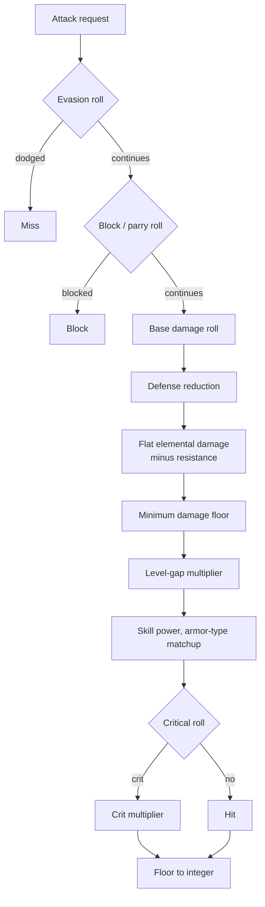
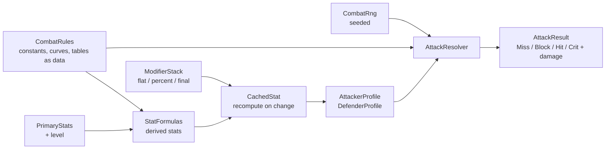

# Module 08: Stats and combat resolution

- **Goal:** understand how an online RPG turns a handful of attributes into health, accuracy and speed, how one attack is resolved step by step on the server in a tab-target (target-and-roll) game, compare the common designs, and build a small deterministic attack resolver whose every formula and constant is data.
- **Prerequisites:** [03 — The game loop and time](03-game-loop.md) (seeded randomness and replay), [05 — Data-driven design and property systems](05-data-properties.md).
- **Example:** `examples/08-combat/` (`dotnet test examples/08-combat`)
- **Facts checked:** October 2026 (prices, licences and product status change; re-check before reuse)

## In short

A character has a few **primary stats** (strength, agility and so on). Everything the combat code needs, such as max HP, attack power or hit rate, is a **derived stat** computed from the primaries, the level and a stack of **modifiers** from gear and buffs. In a **tab-target** game (select a target, then an attack is resolved by numbers) an attack is a fixed **pipeline** of steps: early-outs (evade, block), mitigation (defense), additive and multiplicative bonuses, and one final rounding. In an **action** game the same stats feed a different front end: hit detection by geometry (module 09). The server runs the pipeline with its own seeded random generator, so clients cannot cheat and fights can be replayed. The example implements the tab-target pipeline in about 400 lines of plain C#, with every constant, curve and table in a data object, a layered modifier stack, and a resolver whose 100-attack log is identical for the same seed.

## 1. The concept

### 1.1 Primary and derived stats

**Primary stats** are the numbers the player or the class data sets directly: strength, agility, vitality, intellect. **Derived stats** are computed from them: max HP, attack power, hit rate, attack interval. The split matters for design. Primaries are the player's choices; derived stats are the balance designer's levers. Keep the formulas in one place, as pure functions of their inputs, so a designer can read and test them.

### 1.2 Modifier layers

Gear, buffs and passives change a stat. If each one just edits the number, you cannot remove it again or reason about order. Use a **modifier stack**: each effect is a record with a source, a layer and a value, and the final value is evaluated from the base every time.

A common layering:

1. **Flat** bonuses added to the base.
2. **Percent-add**: all percentages in this layer are summed, then applied once (+10% and +10% is +20%).
3. **Percent-mult**: each one multiplies separately (+50% and +50% is x2.25).
4. **Final flat** added at the end.

Order matters: +100 flat before a +100% bonus gives 400 from a base of 100; after it, 300. Percent-add is easy to balance; percent-mult compounds and is how stats explode. Because every modifier knows its source, unequipping an item is one `RemoveSource` call.

### 1.3 When to recompute

Do not recompute every stat every tick. Compute when an **input changes** (level up, equip, buff on or off) and cache the result; combat reads the cache. The alternative, lazy evaluation with a dirty flag, is the same idea. The risk is a missed invalidation, which shows up as a stat that stays wrong until the next change.

### 1.4 The attack pipeline

An attack is a sequence of steps whose order you fix once:



The standard ingredients:

- **Hit and evade.** Either an explicit to-hit roll, or an evade chance on the defender.
- **Block and parry.** A defender-side chance that cancels the whole attack.
- **Defense.** Flat subtraction or, more usual in MMOs, a percentage reduction, so damage never goes negative.
- **Level gap.** A multiplier that makes over-levelled fights trivial and under-levelled ones brutal.
- **Elements and armor types.** Matchup tables: fire against an ice-resistant target, or a "pierce" weapon against light armor.
- **Critical.** A chance for a bigger multiplier.

Keep the number of independent multiplicative layers small. Every extra `x` term multiplies every other and makes balance a guessing game.

### 1.5 Randomness, determinism and authority

All rolls come from a **seeded generator injected into the simulation**, never from the clock or a global. Same seed and same inputs give the same fight, which gives you replays and reproducible bug reports (see module 03). Use a small algorithm you control, not the runtime's default generator, whose output may change between versions.

In an online game the **server is authoritative**: the client sends an intent ("attack that target with that skill"); the server checks range, cooldown and state, rolls, applies damage and tells everyone the result. The client may predict an animation but never decides damage. A client that computed damage would hand every cheater a damage dial.

## 2. The design space

### 2.1 How an attack finds its target

| Model | How it works | Where stats matter | Typical games |
|---|---|---|---|
| **Tab-target** (target and roll) | The player selects a target; the server checks range and cooldown, then rolls hit, block, damage | Everywhere: accuracy, evasion, defense and damage are all numbers | Classic MMORPGs, many mobile RPGs |
| **Hit-scan / projectile with aim** | The player aims; the server traces a ray or moves a projectile | Mostly damage and rate of fire; hit is geometry | Shooters, some action RPGs |
| **Action combat** (hitboxes, animation-driven) | Skills have timed hit volumes tied to animation; contact is detected geometrically | Damage, speed and defense; hit and miss come from positioning | Action RPGs and hack-and-slash games |

This module covers the first row in depth. Module 09 covers action combat: hit detection, animation-driven skills and lag compensation. The stat layer (primaries, derived stats, modifiers) is the same in both; only the "did it connect" step changes.

### 2.2 How stats grow

| Model | Idea | Strength | Weakness |
|---|---|---|---|
| **Fixed class base plus level terms** | Each class has a fixed row; formulas carry explicit level terms | Easy to balance per class | Little player choice |
| **Free point allocation** | Every level grants points the player spends | Strong build identity | Easy to build a "wrong" character; respec economy needed |
| **Class-based growth plus a few free points** | The class sets default growth; a few points cover weaknesses | Safer for new players, still some choice | More rules to explain |
| **Gear-driven** | Stats come almost entirely from equipment | Constant progression loop | Level matters little; item inflation |

### 2.3 How damage is mitigated

| Formula family | Example | Behaviour |
|---|---|---|
| **Flat subtraction** | `damage - defense` | Simple, but defense can make damage zero or negative; needs a floor |
| **Percentage reduction** | `damage * (1 - def / (def + K))` | Never reaches 100%, diminishing returns; the usual MMO choice |
| **Ratio** | `damage * attack / (attack + defense)` | Smooth and symmetric; scales with both sides |
| **Level-gap curve** | A multiplier by the level difference | Makes mismatched fights one-sided on purpose |

Whatever the family, keep a **minimum damage** so chip damage always lands, and keep the number of independent multipliers small.

### 2.4 Single character or party

- **One character per player** (most action RPGs): one stat sheet, one buff list, threat and aggro are simple.
- **A party of several characters per player**: each member has its own stat sheet and modifiers; the resolver is unchanged because it takes two frozen profiles. The new questions are shared buffs, who the enemy targets (threat per member) and how much per-character tuning the designers can afford.
- **Companions and pets**: usually a reduced stat sheet derived from the owner's.

### 2.5 How to choose

| If... | Prefer |
|---|---|
| Most players are on mobile with auto-attack | Tab-target with percentage mitigation and a few big numbers |
| Combat is skill and positioning | Action combat (module 09); keep stats simple and damage-focused |
| You want strong build identity | Free points, with a respec path |
| You want a fast, balanced start | Class-based growth, a few free points |
| Balance must stay tractable for years | Few multiplicative layers, one modifier mechanism, formulas in data |

## 3. Trade-offs and pitfalls

- **Stacked multipliers.** Every independent `x` term multiplies every other. Ten of them make balance a guessing game and invite compounding exploits. Aggregate bonuses into a few layers.
- **Hidden inputs.** If a total stat is the sum of lists that each consumer assembles itself, nobody can answer "what feeds this number?". Compute it in one place and cache it.
- **Duplicated pipelines.** Separate paths for skills, normal attacks and player-versus-player drift apart. Keep one pipeline and vary the data.
- **Special cases in shared formulas.** An `if` for one item or event inside a shared formula is a trap. Put the special case in data (a modifier, a flag on a profile).
- **Rounding drift.** Rounding between steps changes results. Round once, at the end.
- **Stale caches.** A cached stat that misses an invalidation shows a wrong number until the next change. Tie invalidation to a version counter.
- **Client-side damage.** A client that computes damage hands every cheater a damage dial. The server alone resolves.
- **Dead data.** Stats computed and propagated everywhere but read nowhere cost memory and confuse designers.

## 4. Build or buy

| Engine | What you get for stats and combat |
|---|---|
| Unreal | The **Gameplay Ability System**: attribute sets, gameplay effects (instant, duration, infinite) with modifier operations (add, multiply, override), tags and replication support. Powerful but heavy, and C++-centric. |
| Unity | Nothing built in. You write your own stats and combat, or use third-party assets. |
| Godot | Nothing built in either. |

**Could we build it?** Yes, and it is one of the easiest modules to build well.

| Piece | Effort | Risk |
|---|---|---|
| Primary and derived formulas as pure functions | Low | Low, if every formula has a test with concrete numbers |
| Modifier stack with layers and sources | Low (about 60 lines) | Medium: layering and stacking rules need agreement with designers |
| Cache and invalidation | Low | Medium: a missed invalidation shows as a stale stat |
| Attack pipeline with seeded RNG | Low | Medium: step order and rounding rules |
| Data-driven items and skills | Medium | Medium: this is where special cases creep in |

AI-assisted development helps most here by writing the many small formula tests and the table-driven data loaders. It helps least with the design decisions: how many multiplier layers are allowed, which stats are live in which stance.

**What a proof of concept must prove.**

1. Every formula is reproducible from the spec with the same numbers.
2. A thousand fights with one seed produce byte-identical logs.
3. A designer can add a new item bonus by adding a data row, with no change to the resolver.
4. Recomputing a character with 40 modifiers is cheap enough to do on every equipment change.

**Verdict: build.** Unreal's Gameplay Ability System is worth studying even if you do not use it: its separation of attributes, effects and tags is the clean version of what many games grow by accretion. If we were on Unreal we would use it. Otherwise we write our own, small and data-driven.

## 5. The example

### Design



The resolver is a pure function of two frozen profiles, a ruleset and a random stream. Profiles are snapshots taken when the swing starts, so a buff arriving mid-resolution cannot change the result.

### Walkthrough

- **`CombatRules.cs`**: one record holding every constant, weight, curve and table: stat caps, HP and mana coefficients, the weapon-scaling weights per category, the defense constants, the level-gap curve, the weapon-versus-armor table and the crit multiplier. The defaults are one generic sample ruleset. `CombatRules.FromJson` loads another from JSON, with omitted properties keeping the defaults.
- **`PrimaryStats.cs`** is a `readonly record struct` of four attributes (Strength, Agility, Vitality, Intellect) with `+`. **`StatWeights.cs`** is a row of per-stat weights.
- **`StatFormulas.cs`** holds the derived-stat formulas as pure methods reading the rules: `MaxHp`, `HpRegenPerTick`, `MaxMana`, `AttackRank`, `DefenseRank`, `WeaponScaling`, `Attack`, `HitRate`, `AttackIntervalMs`, `CastTime` and `EffectiveStat` (class base plus allocated points, capped).
- **`ModifierLayer.cs`, `StatModifier.cs`, `ModifierStack.cs`** implement the layered stack from section 1.2: `(base + flat) * (1 + sum percentAdd) * product(percentMult) + finalFlat`, with `RemoveSource` for unequipping and a `Version` counter.
- **`CachedStat.cs`** wraps a base formula and a stack, recomputes only when the version changed or `MarkDirty()` was called, and counts recomputes so tests can prove the cache works.
- **`CombatFormulas.cs`** holds the pipeline pieces: `GradeFix` (the level-gap curve lookup), `EffectiveAvoid`, `DefensePercent`, `ArmorTypeFix` (the matchup table), `CritMultiplier`.
- **`AttackerProfile.cs`, `DefenderProfile.cs`** are immutable records. Whether an attacker can crit is just a crit rate above zero: a data decision, not a code branch.
- **`CombatRng.cs`** is SplitMix64, a few lines whose output is defined by the algorithm, not the runtime.
- **`AttackResolver.cs`** is the pipeline in the order of section 1.4, one method, one final floor. The central lines:

```csharp
if (rng.Next(1, 100) < _f.EffectiveAvoid(d.Block, a.AttackRank, d.DefenseRank))
    return new(AttackOutcome.Block, 0);
double damage = a.HitRate >= 100 ? a.Atk : rng.Next(a.Atk * a.HitRate / 100, a.Atk);
damage *= (100 - _f.DefensePercent(d.Def, a.AttackRank)) / 100;
```

### Tests and their concrete numbers

All in `examples/08-combat/` (49 tests, all passing). The numbers are from the sample ruleset.

- **Stats** (`StatFormulasTests`): max HP at level 20 with Vitality 30 is **490** (50 + 240 + 200); regeneration is **12**; max mana at level 20, Intellect 25 is **175**; attack rank at level 60 with a level-10 weapon is **30**; a melee weapon of attack 100 with Strength 50 and Agility 30 has scaling **2.3** and attack **230**; physical hit rate with Agility 40 is **50**; the attack interval for a 1000 ms base at Agility 40 is **800 ms**, never below the 500 ms floor; cast time at Intellect 20 is **1.0 s**; class base 15 plus 10 points is **25**, capped at **100**.
- **Modifier order** (`ModifierStackTests`): base 100 with +20 flat, +10% and +10% percent-add, and +500 final flat evaluates to **644**; two +50% percent-adds give **200** but two percent-mults give **225**; +100 flat before +100% gives **400**, after it **300**; the 490 max HP with +10% and +100 gives **639**. A cached stat read 1000 times computes **once**, and again only after a modifier or `MarkDirty()`.
- **Pipeline** (`CombatFormulasTests`, `AttackResolverTests`): defense 300 against attack rank 20 removes **50%**, so a 200 hit does **100**; adding 60 fire against a 25% resist gives **145**; a weapon-versus-armor match makes it **181**; a guaranteed crit doubles it to **290**; a defender 5 ranks ahead halves the 100 hit to **50**; an attacker 5 ranks ahead raises it to **150**. A block stat of 40 against a 5-rank advantage blocks about **29%** of 20,000 attacks. Huge defense is capped at 75% reduction, and a tiny hit still deals **1**.
- **Determinism**: a 100-attack log with misses, blocks, hits and crits is **identical** for the same seed and different for another seed.
- **Data** (`CombatRulesTests`): the same attack does 100 damage under the sample rules and **125** under a JSON ruleset that only changes one defense constant. No code changes.

### Using it for a different game

Everything a designer would tune is in `CombatRules`. A different game supplies a different JSON file: other stat caps and weights, a steeper level-gap curve, another matchup table, a bigger crit multiplier. If a game needs new stats or new pipeline steps, those are code changes; the layering, caching and determinism machinery stays.

### What the example leaves out

- Stances, skill levels and a skill-ratio table; the example takes a ready skill ratio.
- Long chains of buff and gear multipliers (by design: one aggregated term is the recommendation).
- Player-versus-player dampeners and monster-attacker variants.
- Knockdown, threat (aggro), life drain and reflection.
- Action-combat hit detection (module 09).
- The network side of authority: the example is the resolver the server would call after validating range and cooldown.

## Key takeaways

- Stats are two layers: a few primaries the player chooses, and derived stats computed by pure formulas.
- Use a modifier stack with explicit layers and sources, and recompute on change, not every tick.
- An attack is a fixed pipeline: early-outs, mitigation, bonuses, one final floor. Fix the order and test it with numbers.
- Tab-target and action combat share the stat layer; only the "did it connect" step differs.
- Randomness comes from an injected seeded generator, and the server alone decides the result.
- Put every constant, curve and table in data, so a different game is a different file, not different code.
- Build-or-buy call: build. Unreal's Gameplay Ability System is the polished reference; Unity and Godot give you nothing built in.

## Further reading

- [Unreal Engine: Gameplay Ability System](https://dev.epicgames.com/documentation/en-us/unreal-engine/gameplay-ability-system-for-unreal-engine)
- [GAS Documentation by tranek (community)](https://github.com/tranek/GASDocumentation)
- [SplitMix64 and the xoshiro generators](https://prng.di.unimi.it/splitmix64.c)
- [Game Programming Patterns: Component and Event Queue](https://gameprogrammingpatterns.com/)
- [Gaffer On Games: Deterministic Lockstep](https://gafferongames.com/post/deterministic_lockstep/)
