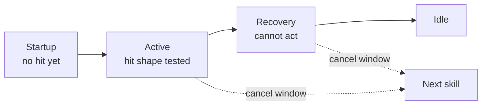
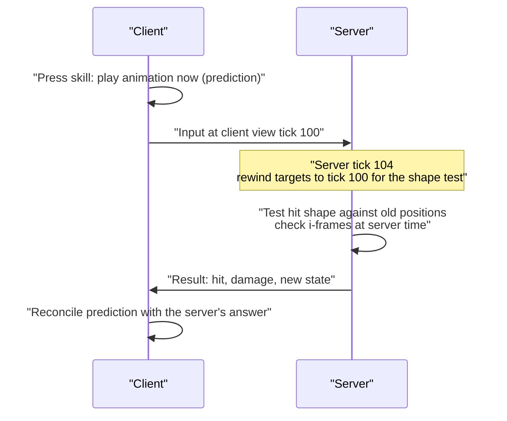
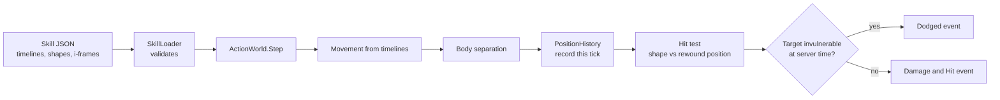

# Module 09: Action combat

- **Goal:** understand how an action game decides that an attack connected, using hit volumes and animation-timed skills instead of a target and a roll, and how an authoritative server keeps that fair for players with different latency. Then build a small data-driven version: skill timelines in ticks, shape overlap tests, a position history with rewind, and invulnerability frames.
- **Prerequisites:** [03 — The game loop and time](03-game-loop.md), [08 — Stats and combat resolution](08-stats-combat.md).
- **Example:** `examples/09-action-combat/` (`dotnet test examples/09-action-combat`)
- **Facts checked:** October 2026 (prices, licences and product status change; re-check before reuse)

## In short

In an **action combat** game, an attack hits because a **hitbox** (a volume attached to the attacker) overlaps a **hurtbox** (the volume where the target can be hurt) while the skill is in its **active frames**. Each skill is a timeline: startup, active, recovery, with optional movement, cancel windows and invulnerability. Because the world moves while a packet travels, a fair online game needs three tools: the server is **authoritative**, the client **predicts** its own actions so controls feel instant, and the server **rewinds** targets to what the shooter saw (lag compensation). The damage numbers still come from the stat pipeline of module 08; only the question "did it connect?" changes. The example runs the timeline in ticks, tests cones, rectangles, circles and capsules against circular targets, keeps a ring buffer of past positions, and shows an i-frame window cancelling a hit.

## 1. The concept

### 1.1 Hitboxes and hurtboxes

- A **hitbox** is the area an attack can damage, active only for a few moments.
- A **hurtbox** is the area on a character that can be damaged. It is often simpler than the visible model: a circle or capsule.
- A **collision body** (or pushbox) stops characters walking through each other. It is separate from the hurtbox in many games.

Keep the three apart. A big hurtbox makes a character easy to hit; a big pushbox makes crowds jam.

### 1.2 Shapes

| Shape | Typical use | Overlap test with a circular target |
|---|---|---|
| **Circle** | Explosions, ground slams, auras | Distance between centres is at most the sum of the radii |
| **Cone** (sector) | Sword sweeps, shotgun-like blasts | Within the range, and the angle to the target is within the half-angle (widened by the target's size) |
| **Rectangle** (oriented box) | Thrusts, beams, charges | Move the target into the box's local space, clamp to the box, compare the distance with the radius |
| **Capsule** | Spears, whips, swings along a line | Distance from the target to the nearest point of a line segment is at most the capsule radius plus the target radius |

Games in 3D use spheres, boxes and capsules with the same ideas. Most action RPGs flatten hit detection to the ground plane and check height separately or ignore it.

### 1.3 Skills as timelines

An **animation-driven skill** is a script on a timeline of **ticks** (server update steps; see module 03):



- **Startup:** the windup. The attacker is committed and can be hit.
- **Active frames:** the hit shape is tested. A skill can hit on one tick or several (multi-hit).
- **Recovery:** the cooldown of the animation. The attacker cannot act yet.
- **Cancel window:** a range of ticks in which another skill may start early. This is how combos and dodge-cancels are made.
- **Movement during skills:** a lunge or a roll moves the caster along its facing for some ticks. It is part of the timeline data, so designers tune distance and timing together.

Fighting-game communities describe the same thing as **frame data**: a move that is "3 frames startup, 2 active, 5 recovery" is exactly this timeline, counted in display frames.

### 1.4 Invulnerability frames and dodges

**I-frames** (invulnerability frames) are ticks during which a hit that overlaps is ignored. A dodge roll is a skill with movement and an i-frame window, typically covering the first part of the animation. The design lever is the ratio: long i-frames make dodging safe and the game easy, short ones make it demanding.

### 1.5 Where the animation clock lives

In a client-only game the animation drives the timeline: an animation event says "the blade is out now, test the hit". In an online game the **server** cannot play your animations (a dedicated server usually has no renderer), so it must hold the timeline as data in ticks, and the client's animation is matched to it. The example does exactly that: the tick numbers are the truth, the animation is a presentation of them.

## 2. Authority, prediction and lag

### 2.1 The problem

A client with a 100 ms round trip sees the world as it was 50 ms or more ago, and its commands arrive 50 ms or more late. At 20 server ticks per second (50 ms per tick) that is one to several ticks. Without care, you shoot at where a target *was*, and on the server it has already moved.

### 2.2 Three techniques

| Technique | What it does | Who is affected |
|---|---|---|
| **Server authority** | Only the server decides damage, position and state; clients send inputs ("use skill 2 facing 40 degrees") | Everyone; stops cheating |
| **Client-side prediction** | The client applies its own input at once and reconciles when the server's answer arrives | The player's own character; makes controls responsive |
| **Lag compensation** (server rewind) | When resolving a hit, the server tests against where targets were at the client's view time | The shooter; makes hits feel fair |



### 2.3 Rewinding

The server keeps a short **history buffer** of each entity's position for the last N ticks. When a hit command arrives, it works out how many ticks behind the client's view was (one-way latency plus the client's interpolation delay), looks up the targets' positions at that tick, and runs the shape test on those. Valve's Source engine documents the original design: the server uses the player's latency to rewind time while processing the command. The Source article also gives the limit: about one second of history is kept.

Rules that keep it sane:

- **Clamp the rewind** (for example to 6 ticks, 300 ms at 20 Hz). Otherwise a player with a bad connection hits targets far in the past.
- **Rewind positions, not decisions.** The common choice, used in the example, is to check invulnerability and similar state at *server* time. Rewinding that too makes a successful dodge fail "around the corner", a well-known complaint in shooters.
- **The attacker is not rewound.** Their position is what the server has.
- **Hit confirmation.** The client may show a spark at once ("predicted hit") but the damage number and the target's reaction come from the server. If the server disagrees, the client corrects quietly.

### 2.4 Favour the shooter, or the victim

Lag compensation helps the attacker, and the cost lands on the victim: a player may be hit just after reaching cover on their own screen. This is the "I was behind the wall" effect. Designs differ:

| Policy | Effect |
|---|---|
| **Favour the attacker** (rewind with a clamp) | Attacks feel responsive; defenders sometimes complain about late hits |
| **Favour the defender** (no rewind) | Fair to the defender; high-latency attackers miss moving targets |
| **Rollback or lockstep** | Both sides simulate the same ticks and correct; used in fighting games with two players, hard for many players |

For PvE-heavy RPGs, many teams use a small clamp, and for PvP they also keep skills slow enough that a tick or two of error does not decide a fight.

### 2.5 What the server tick rate means

The tick is the smallest unit of time the server can distinguish. At 20 Hz it is 50 ms, so an active window of 2 ticks is 100 ms, and a hit cannot be placed more finely than that. Consequences:

- **Fast skills need a higher rate,** or the timeline will be rounded to coarse steps. Fighting games run at 60 per second for this reason.
- **Cost grows with the rate.** Twice the ticks is about twice the CPU and bandwidth per player.
- **Clients interpolate** between server snapshots, so lower rates look smooth but add input-to-effect delay.
- **Define timelines in ticks, not seconds,** so a change of rate is a deliberate data change.

Typical figures (as of October 2026): many MMORPGs and mobile RPGs run 10 to 20 Hz, action RPGs 20 to 30 Hz, shooters 60 to 128 Hz. Check the current figure of any game you compare against.

## 3. The design space

### 3.1 Tab-target or action

| | Tab-target (module 08) | Action combat (this module) |
|---|---|---|
| **Hit decision** | Roll against accuracy and evasion | Geometry and timing |
| **Player skill** | Choosing skills and timing cooldowns | Positioning, dodging, reading animations |
| **Latency tolerance** | High: no aiming | Lower: needs prediction and rewind |
| **Server cost** | Low per attack | Higher: shape tests every tick, history buffers |
| **Content cost** | Numbers and effects | Animations tuned to timelines, plus hit-volume authoring |
| **Crowds** | Easy | Many overlapping volumes: needs spatial partitioning (module 04) |

A **hybrid** is common: aim a skill's area with the mouse, then resolve damage with the stat pipeline, and keep a hit roll or evasion stat for flavour.

### 3.2 How to choose

| If... | Prefer |
|---|---|
| Players mostly on mobile with a touch interface and auto-attack | Tab-target or hybrid, with simple area skills |
| The fantasy is skill and dodging | Action combat, with a higher tick rate and prediction |
| Many characters per player, controlled partly by AI | Tab-target resolution with area shapes; fewer rewinds |
| A small team | Few shapes, one timeline format, no per-limb hurtboxes |
| Strong anti-cheat requirement | Server owns timelines and hit tests; client only requests |

## 4. Trade-offs and pitfalls

- **Client-driven hit tests.** If the client says "I hit him", cheaters will always hit. Clients send intent; the server tests.
- **Timelines that disagree with animations.** The hit lands before the blade moves. Build tools that show the server timeline over the animation.
- **Unbounded rewind.** A hacked or laggy client rewinding 2 seconds is a free hit machine. Clamp it.
- **Per-frame real-time instead of ticks.** Timers based on wall-clock time make behaviour depend on server load. Count ticks.
- **Hurtbox bloat.** Per-limb hurtboxes multiply tests and rarely improve play in an RPG.
- **Wide cones against crowds.** An area skill tested against every entity in the zone is quadratic. Query a spatial grid first.
- **Hidden state in the hit step.** Damage, i-frames, statuses and knockback decided in one place, in a fixed order, avoid disputes. Document the order.
- **Tuning by feel without data.** Keep durations in data and show them in an editor, so designers can adjust a window by one tick and replay it.

## 5. Build or buy

| Engine | What you get for action combat |
|---|---|
| **Unreal** | The Gameplay Ability System runs abilities with ability tasks such as `PlayMontageAndWait`, which plays an animation montage and calls back when it ends or is cancelled, and gameplay tags and events for hits. Animation notifies and notify states in a montage mark the active window. Collision is built in (sweeps, overlaps, collision channels). The character movement component includes client prediction and server correction. Rewind for hit scans is usually written by the game team. |
| **Unity** | Physics queries (overlap and cast), animation events, and a networking stack with prediction. Netcode for Entities documents prediction and a physics history for lag compensation. Skill timelines are usually written or bought as assets. |
| **Godot** | Area nodes and physics queries for overlaps, animation tracks that call methods or toggle hitboxes, and high-level multiplayer. No built-in lag compensation or ability framework. |

**Could we build it?** Yes, for the server side of a modest game.

| Piece | Effort | Risk |
|---|---|---|
| Shape overlap tests (circle, cone, box, capsule) | Low: a few dozen lines each | Low with unit tests; watch edge cases at shape borders |
| Skill timeline data and validation | Low | Medium: designers need tooling and a replay view |
| Movement during skills and body collision | Low to medium | Medium: interaction with navigation (module 07) |
| History buffer and rewind | Low | Medium: the policy decisions (clamp, what is rewound) matter more than the code |
| Client-side prediction and reconciliation | Medium to high | High: this is where most netcode bugs live |
| Animation sync (client side) | Medium | Medium: depends on the engine |

AI-assisted development helps with the geometry tests and boundary cases, and with data validators. It is weaker at judging how a skill *feels*; that takes playtesting.

**What a proof of concept must prove.**

1. A skill's hit lands on exactly the ticks in its data, on the server, regardless of frame rate.
2. A client with 150 ms of simulated latency can hit a target running across the screen, within a clamp.
3. A dodge's i-frames reliably cancel hits, and one tick after they end the hit lands.
4. The server handles the expected crowd (say 50 entities in range of a sweep) inside the tick budget.

**Verdict: build the server side, buy the client side.** The rules core is small enough to write in a week. Use the engine for animation, physics queries on the client and its prediction framework where it has one; keep the authoritative timelines and hit tests on your own server.

## 6. The example

### Design



Everything is counted in ticks. The world is deterministic: no clock, no random numbers.

### Walkthrough

- **`Vec2.cs`** is a small vector with dot, cross and a unit vector from an angle in degrees.
- **`ShapeDef.cs`** is one data record that describes a circle, cone, rectangle or capsule. **`ShapeOverlap.cs`** has the four overlap tests against a circular hurtbox. The cone widens its half-angle by the angle the target's radius covers, so a large target is still hit by its edge.
- **`SkillDef.cs`** is the timeline: startup, active and recovery ticks, the hit ticks (which must lie in the active window), a shape, damage, a cancel window, movement segments and an i-frame window. `Validate()` returns plain-text errors. **`SkillLoader.cs`** loads a JSON list and refuses invalid data.
- **`PositionHistory.cs`** is a ring buffer of one entity's positions by tick. A tick older than the capacity is gone, and the lookup says so.
- **`LagCompensation.cs`** holds `ActionRules` (tick rate, maximum rewind, history size) and the helper that turns latency and interpolation delay into a clamped number of ticks.
- **`Combatant.cs`** is the entity: team, position, facing, hurtbox radius, HP, and the rewind its client needs.
- **`ActionWorld.cs`** is the loop. The order inside one `Step` is movement, body separation, record positions, hit tests, finish skills, advance the tick. The central lines:

```csharp
int viewTick = Tick - Math.Min(attacker.ViewLagTicks, rules.MaxRewindTicks);
Vec2 seen = _history[target.Id].TryGet(viewTick, out var old) ? old : target.Position;
if (!ShapeOverlap.Hits(skill.Shape, attacker.Position, attacker.FacingDeg, seen, target.Radius)) continue;
if (IsInvulnerable(target)) { /* Dodged event */ continue; }
```

### Tests and their concrete numbers

All in `examples/09-action-combat/` (21 tests, all passing).

- **Shapes:** a cone with range 5 and half-angle 40 degrees hits a target 4 units away at **30 degrees** and misses at **50 degrees** (target radius 0.3); it misses at distance 6 and behind the caster; it follows the facing (facing 90 degrees hits a target at 100 degrees, not at 0). A rectangle 4 long and 2 wide hits at lateral offset 0.9 and misses at 1.5. A capsule's rounded end reaches 3.5 units along a length-3 segment.
- **Timeline:** with startup 3, active 2, recovery 5, a skill with hit tick 3 hits **once, on tick 3**, for 10 damage (HP 100 to 90); with hit ticks 3 and 4 it hits on **ticks 3 and 4** (HP 80); nothing lands during ticks 0 to 2. A cancel window of ticks 5 to 7 refuses a new skill at tick **4** and accepts it at tick **5**. A lunge with half a unit per tick on ticks 1 and 2 moves the caster **1.0** units.
- **Collision:** two bodies of radius 0.5 started 0.5 apart end **1.0** apart, each pushed 0.25.
- **Lag compensation:** a target runs along the x axis at one unit per tick. At tick 10 it is at x=10; a rectangle skill 8 long misses it. With a **rewind of 3 ticks** the server tests the position at tick 7 (x=7) and the hit lands (HP 100 to 90). 40 ms one-way plus 100 ms interpolation at 20 Hz is **3 ticks**; 300 ms plus 100 ms would be 8 ticks and is clamped to **6**. A history of 32 slots keeps ticks 8 to 39 after 40 writes and has dropped tick 7.
- **I-frames:** a dodge with i-frames on ticks 0 to 2 turns a simultaneous poke into a **Dodged** event with no damage. If the poke is timed to hit at tick **3**, after the window, it lands (HP 90).
- **Data:** a JSON skill set loads; a hit tick outside the active window is rejected with a clear message; changing only the cone's half-angle from 40 to 20 degrees turns a hit on a target at 30 degrees into a miss.

### Using it for a different game

A slower game sets `TickRate` to 10 and gives skills longer timelines. A faster one raises the rate and shortens windows. Different shapes and damage are data. If a game needs hurtboxes that are not circles, or a vertical axis, those are changes to `ShapeOverlap`; the timeline, history and rewind logic stay.

### What the example leaves out

- Client-side prediction and reconciliation. It is the other half of the netcode and belongs with the networking modules.
- Interpolation on the client and how it chooses the view tick.
- Knockback, hit stun and projectiles (module 10 covers skills and effects more broadly).
- Per-hit uniqueness (one hit per target per skill) and hit-stop effects.
- Spatial partitioning for crowds.
- The stat pipeline: damage is a plain number here; module 08 shows how to compute it.

## Key takeaways

- Action combat replaces the hit roll with geometry: a hitbox overlapping a hurtbox during a skill's active frames.
- A skill is a timeline in ticks: startup, active, recovery, plus movement, cancel windows and i-frames, all in data.
- The server owns the timeline and the hit test; the client predicts its own feedback.
- Lag compensation rewinds target positions (not decisions) by the client's view delay, clamped, using a short history buffer.
- Tick rate sets the finest timing the server can express. Define timelines in ticks and pick the rate for your fastest skill.
- The stat layer from module 08 is unchanged; only "did it connect" is different.
- Build the server rules, buy the animation and client-side prediction from the engine.

## Further reading

- [Valve Developer Community: Source Multiplayer Networking (prediction and lag compensation)](https://developer.valvesoftware.com/wiki/Source_Multiplayer_Networking)
- [Gabriel Gambetta: Fast-Paced Multiplayer, client-side prediction and server reconciliation](https://www.gabrielgambetta.com/client-side-prediction-server-reconciliation.html)
- [Gabriel Gambetta: Entity interpolation](https://www.gabrielgambetta.com/entity-interpolation.html)
- [Unreal Engine: Understanding the Gameplay Ability System](https://dev.epicgames.com/documentation/en-us/unreal-engine/understanding-the-unreal-engine-gameplay-ability-system)
- [Unreal Engine API: UAbilityTask_PlayMontageAndWait](https://dev.epicgames.com/documentation/unreal-engine/API/Plugins/GameplayAbilities/UAbilityTask_PlayMontageAndWait)
- [Unity: Netcode for Entities documentation](https://docs.unity3d.com/Packages/com.unity.netcode@latest)
- [Godot: Area2D and physics queries](https://docs.godotengine.org/en/stable/classes/class_area2d.html)
- [Gaffer On Games: Networked physics and state synchronization](https://gafferongames.com/)
