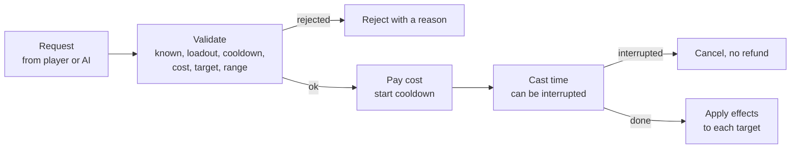
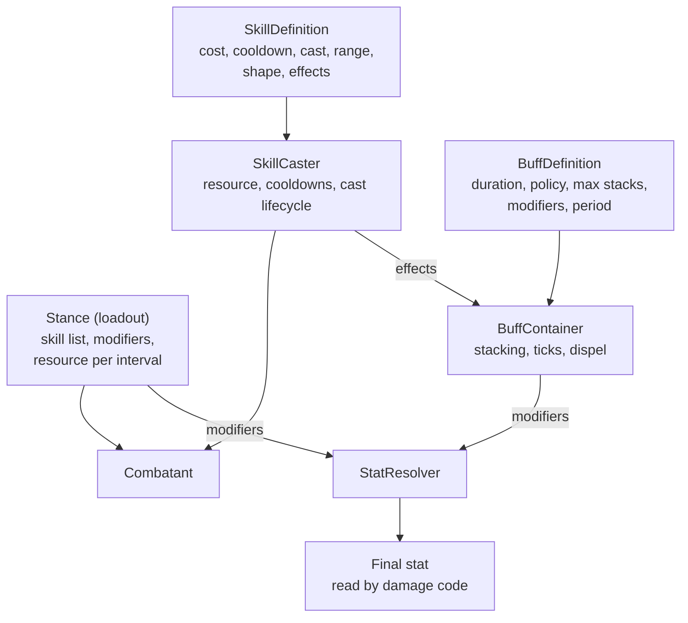

# Module 10: Skills, abilities and buffs

- **Goal:** understand how an online RPG models "do something with a cost, a delay and a lasting effect" (skills, loadouts, buffs), why buffs written as scattered if-checks rot, and build a small tick-based skill and buff system whose buffs contribute declared modifiers instead of being looked up by name.
- **Prerequisites:** [03: The game loop and time](03-game-loop.md) (everything here is counted in ticks), [05: Data-driven design and property systems](05-data-properties.md) (skills and buffs are data rows), [08: Stats and combat resolution](08-stats-combat.md) (the final stats that skills read).
- **Example:** `examples/10-skills/` (`dotnet test examples/10-skills`)
- **Facts checked:** October 2026 (prices, licences and product status change; re-check before reuse)

## In short

A skill is a data row (cost, cooldown, cast time, range, target shape, effects) run through a fixed lifecycle: request, validate, cast, apply, cooldown. A loadout (a stance, a class kit, a weapon set, a hotbar page) decides which skills are usable and which modifiers are always on. A buff is a timed effect with an explicit stacking rule. The common failure is writing each buff's meaning as an `if buff is active` check inside the damage code: every new buff then touches many formulas. The cure is a **modifier pipeline**: buffs declare stat modifiers, one resolver reads them, and no formula ever needs a buff's name. The example is a small tick-based implementation of exactly that, with exact-number tests.

## 1. The concept

### 1.1 The skill data model

A skill definition is static data. The fields almost every RPG needs:

| Field | Meaning |
|---|---|
| Cost | Resource spent per use (mana, stamina, health, sometimes an item) |
| Cooldown | Ticks before the same skill can be used again |
| Cast time | Ticks between starting and the effect landing (0 means instant) |
| Range | Maximum distance to the chosen target |
| Target shape | Self, single target, circle around the target, cone, line |
| Effects | An ordered list: damage, heal, apply buff, dispel, move... |
| Level scaling | How power changes with the skill's level |

Keeping the effects as a list of small typed pieces means a new skill is new data, not new code.

### 1.2 The cast lifecycle

Three rules keep this honest in an online game. Validation is on the server, and a rejection is a value (a reason code), not an exception. Cost and cooldown are committed in one step so a second request on the same tick cannot slip through. And time is counted in ticks, not wall-clock seconds, so a cooldown ends on an exact tick and replays identically.

### 1.3 Loadouts

A loadout bundles a build into one switchable thing. Depending on the game it is called a stance, a class kit, a weapon set or a skill page. It can decide: the usable skills, a set of always-on stat modifiers, the shape of the basic attack, and how the resource pool behaves (regenerates, drains, recharges after a delay). Switching should cost the player something (a cancelled cast, a delay), which is what makes the choice meaningful.

### 1.4 Buffs and debuffs

A buff is a timed effect on a unit. The questions every buff system must answer, as data and not as convention:

- **Duration.** When does it end? Define the expiry tick exactly.
- **Stacking rule.** What if it is applied again?
  - *Refresh*: one instance, the timer resets.
  - *Stack to max*: one instance with a counter up to N, each application adds one and resets the timer.
  - *Independent*: every application has its own timer.
- **Periodic effects.** Damage or healing every P ticks (poison, regeneration). The total over the duration must be exact.
- **Dispel.** Which buffs can be removed, and which kind (buff or debuff)?
- **Contribution.** How does it change the unit?

### 1.5 The anti-pattern, and the alternative

The tempting way to implement "Rage: +20% attack" is to write, inside the damage formula, `if the attacker has Rage then damage *= 1.2`. It works for one buff. At fifty buffs, every formula grows a branch per buff, the order of branches silently changes results, a designer cannot add a buff without a programmer, and a bug fix in one place is missed in another.

The alternative is a **modifier pipeline**. A buff declares what it changes (`Atk +20%`). One place collects the active modifiers and computes the final stat. Formulas read only final stats, so they never learn that buffs exist. Unreal's Gameplay Ability System, Path of Exile and most modern ARPGs work this way.

## 2. The design space

### 2.1 How skills are triggered

| Style | How it works | Typical games |
|---|---|---|
| **Tab-target / hotbar** | Pick a target, press a key; the server validates range and cost and applies effects at cast end | Classic MMORPGs, most mobile RPGs |
| **Action / aimed** | The skill is an animation with hit windows or projectiles; the effect applies when the hitbox overlaps (see [module 09](09-action-combat.md)) | Action RPGs, MMOs with direct combat |
| **Auto-cast / rotation** | Skills fire from a priority list or on cooldown; the player chooses the loadout | Idle and auto-battle games, many mobile titles |

The data model in section 1 serves all three; only the "when does the effect land" step changes.

### 2.2 How a character's skill set is chosen

| Model | What the player chooses | Notes |
|---|---|---|
| **Fixed class kit** | Class at creation; skills unlock by level | Simplest to balance; little build variety |
| **Loadout / stance** | Which kit is active now, often tied to equipment | Cheap to build, legible build lever |
| **Skill tree with points** | Where to spend points; some skills maxed, others skipped | Deep builds; needs respec rules and balance care |
| **Equipped skill slots** | Any N learned skills on a bar | Flexible; hardest to balance combinations |

### 2.3 How buffs combine

| Approach | Behaviour | Cost |
|---|---|---|
| **Name-keyed checks** | Formulas ask "does the unit have X" | Fast to start, rots quickly |
| **Modifier pipeline** | Buffs declare flat and percent modifiers on stats | Small up-front design; scales to hundreds of buffs |
| **Tags and effects (GAS-style)** | Buffs also grant tags (immunity, stun) that abilities check | Most powerful; most concepts to learn |

### 2.4 How to choose

| If your game... | Choose |
|---|---|
| Is small and has under twenty buffs | A modifier pipeline is still cheap; do it from the start |
| Needs many crowd-control rules (stun, silence, immunity) | Add tags to the modifier pipeline |
| Has a single class kit with automatic casting | Skills as data, a simple loadout, a minimal buff container |
| Lets players mix skills freely | Equipped slots plus strict validation and an exact stacking rule |
| Has action combat | The same data, with the apply step triggered by hit detection |

## 3. Trade-offs and pitfalls

- **Name-keyed buff checks.** Fast now, painful at scale. Every new buff touches unrelated formulas, and the effective formula is the sum of dozens of branches whose order matters.
- **Opaque numeric slots.** Rows with "value 1 to value 5" columns mean something different for every buff and are defined only by the code that reads them. They cannot be validated or shown in a tool. Name the fields.
- **Implicit stacking.** If the stacking rule lives in code or in magic group numbers, designers cannot read or change it. Make refresh, stack and independent fields on the buff.
- **Per-skill special cases.** Skills that bypass the formula by ID are the exceptions a data model should make impossible.
- **Dead data.** Wide tables accumulate fields nothing reads. Validate that every column is used.
- **Client prediction.** Showing a cast instantly and surviving a server rejection is the hardest part of ability systems, not the data model.
- **Cost that scales with level.** Levels that make skills both stronger and more expensive confuse players and the economy. Many games make cost flat and power scale.

## 4. Build or buy

**What the engines give you.**

| Engine | Out of the box (as of October 2026) |
|---|---|
| Unreal | The **Gameplay Ability System** (GAS): abilities with cost and cooldown as effects, attribute sets, gameplay effects with duration, periodic ticks and stacking policies, gameplay tags for state and immunity, prediction and replication for client-server play. It is the reference design for this module. |
| Unity | Nothing built in. Animation, input and ScriptableObjects for data; abilities and buffs are code you write or an asset-store package. |
| Godot | Nothing built in. Resources and signals help author data; the ability layer is yours. |

**Could we build it ourselves?** Yes, and this is a module where building is the normal answer, because abilities are game design, not infrastructure. The pieces are small and well understood.

| Piece | Effort | Risk |
|---|---|---|
| Skill data and cast lifecycle | Low: a few hundred lines | Low, if validation and payment are one atomic step |
| Cooldowns and cost in ticks | Low | Low |
| Buff containers with stacking policies | Low to medium | Medium: the edge cases (refresh during a tick, expiry vs periodic order) need tests |
| Modifier pipeline | Low | Low, if it is the only path to a stat |
| Client prediction of casts | Medium to high | High: the hard part of GAS is replication and prediction |
| Authoring tools and validation | Medium | Medium: designers need to see stacking and total damage |

AI-assisted development is strong here: the code is routine, so effort shifts to specifying the edge cases and writing tests with concrete numbers.

**What a proof of concept must prove.** (1) A hundred units each carrying ten buffs tick within the budget of a server tick. (2) Cooldown and expiry boundaries are exact and replay-identical. (3) A designer can add a new buff using data only, with no formula changes. (4) A client can show a predicted cast and survive the server rejecting it.

**Verdict: build**, borrowing the *concepts* of Unreal's GAS (effects with duration and stacking, attributes changed through modifiers, tags) rather than its code. In an Unreal project, use GAS and spend the effort on content. For a custom server, build the small version in section 5, and add client prediction later.

## 5. The example

### Design

The key line is the last one: damage code asks the combatant for a final `Atk`, and only the resolver sees buffs and loadouts.

### Walkthrough

- **`SkillDefinition`, `TargetShape`, `ISkillEffect`.** A skill is cost, cooldown, cast ticks, range, shape, radius and a list of effects. Effects are `DamageEffect` and `ApplyBuffEffect`; adding "heal" means adding another implementation.
- **`DamageEffect`.** `attack * power% * (100 + level * perLevel%) / 100`, in integers. Both percentages are data on the effect, so a different game changes numbers, not code.
- **`SkillCaster`.** Owns the resource pool, known skills and ready-at ticks. `TryBegin` validates in a fixed order (known, loadout, already casting, cooldown, resource, target, range) and returns a `CastStatus`. If everything passes, it pays the cost, sets the ready tick to `now + cooldown`, and either applies effects (cast time 0) or stores a pending cast that `Tick` completes. `Interrupt` drops the pending cast without a refund.
- **`Stance`.** The loadout: skill ids, modifiers and a signed resource change per interval. Positive regenerates, negative drains, so one number covers both.
- **`BuffDefinition` and `StackingPolicy`.** Duration, policy (`Refresh`, `StackToMax`, `Independent`), max stacks, buff or debuff, dispellable, modifiers per stack, and an optional period and damage. Every rule that could stay implicit is a field.
- **`BuffContainer`.** `Apply` implements the three policies. `Tick(now)` fires periodic effects due at or before `now` and not after expiry, then removes buffs whose expiry tick is reached. `Dispel` removes up to N dispellable buffs of one kind. `CollectModifiers` yields each buff's modifiers once per stack.
- **`StatResolver` and `Combatant.Stat`.** `(base + sum of flat) * (100 + sum of percent) / 100`, over loadout and buff modifiers. No code reads a buff name.

### Tests and their concrete numbers

`dotnet test examples/10-skills` runs 22 tests, all passing:

- **Cooldown.** Cast at tick 100 with a 50-tick cooldown: tick 149 returns `OnCooldown` with 1 tick remaining, tick 150 starts.
- **Resource.** With 30 and a cost of 40: rejected, the pool stays 30, no cooldown started. With exactly 40: accepted, the pool is 0.
- **Level scaling.** Attack 100, power 200%, +15% per level: 230 damage at level 1 and 530 at level 11.
- **Cast time.** Cast of 20 ticks begun at tick 10: no damage at 29, damage at 30. An interrupt cancels the damage and does not refund the cost.
- **Circle.** Radius 50 around the target: a unit 50 away is hit, one 51 away is not.
- **Stack to max.** Max 3 stacks, five applications: 3 stacks, and `Atk` is 130 for a +10% buff.
- **Refresh.** Applied at 0 for 100 ticks, re-applied at 60: still active at 159, gone at 160, one stack.
- **Independent.** Two copies expire on their own timers; a full set replaces the soonest to expire.
- **Damage over time.** 10 damage every 20 ticks for 100 ticks: exactly 50 total (ticks at 20, 40, 60, 80, 100). With two stacks and a 40-tick duration: 40 total.
- **Expiry.** A +50 attack buff for 30 ticks: 150 at tick 29, 100 at tick 30.
- **Modifier math.** +20 flat and two +10% buffs on 100 attack: 144.
- **Dispel.** Removes the oldest dispellable debuff first and respects the limit and the flag.
- **Loadouts.** A skill outside the loadout gets `NotInStance`; switching changes both the allowed skills and the loadout modifier (+20% gives 120), cancels a cast, and a regen loadout of +5 per 60 ticks then a drain loadout of -8 take the pool from 50 to 60 to 52.

### Configuring it for another game
Change the skill rows, the two damage percentages, the stacking policy per buff and the loadout list. A game with action combat keeps everything and calls the apply step from hit detection instead of from the cast timer.

### What the example deliberately leaves out

- No client prediction or network messages.
- No hit or miss rolls, resistance, or success-chance formulas for debuffs.
- No basic-attack shape for loadouts, and no switch cooldown.
- No buff rank or exclusivity groups, and no "expire after N hits".
- No channeled or child-skill queues, and no tags for immunity.

## Key takeaways

- A skill is data (cost, cooldown, cast, range, shape, effects) pushed through a fixed lifecycle; failures are values, and time is in ticks.
- Pay cost and start the cooldown in the same step as validation, so one tick cannot spend a skill twice.
- A loadout (stance, kit, weapon set) bundles usable skills, always-on modifiers and the resource flow into one switchable object.
- Buff rules (duration, refresh, stack to max, independent, dispel) must be fields on the buff, not conventions in code.
- Buffs should declare modifiers that a single resolver reads; formulas never learn a buff's name.
- Build or buy: build, using Unreal's Gameplay Ability System as the design reference. Budget for client prediction, not the data model.
- The example proves it with exact numbers: 230 and 530 damage at levels 1 and 11, 130 attack at three stacks, 50 damage over a poison, and a modifier gone on its expiry tick.

## Further reading

- [Unreal Engine: Gameplay Ability System](https://dev.epicgames.com/documentation/en-us/unreal-engine/gameplay-ability-system-for-unreal-engine)
- [GASDocumentation, a community guide to GAS](https://github.com/tranek/GASDocumentation)
- [Game Programming Patterns: Type Object](https://gameprogrammingpatterns.com/type-object.html)
- [Game Programming Patterns: Component](https://gameprogrammingpatterns.com/component.html)
- [Godot documentation: Resources](https://docs.godotengine.org/en/stable/tutorials/scripting/resources.html)
