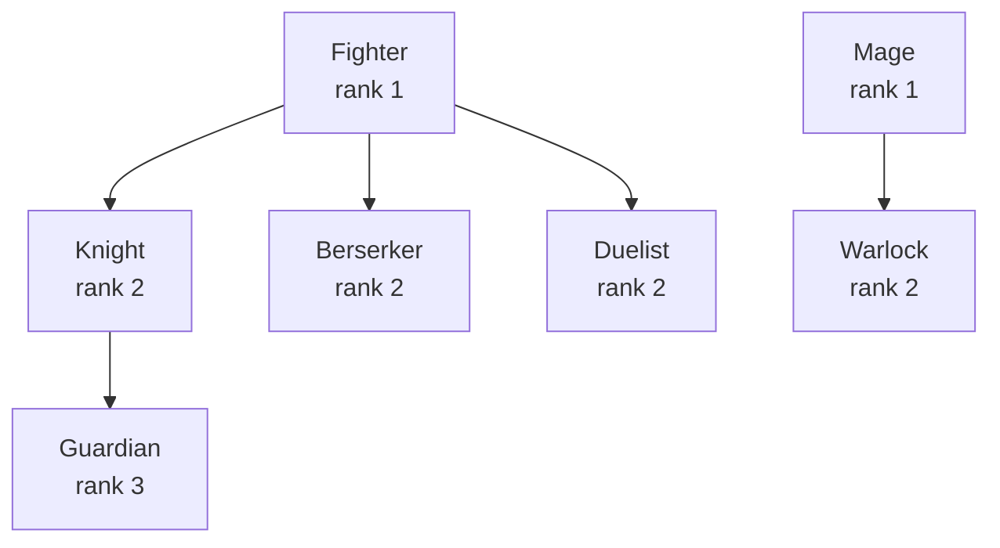
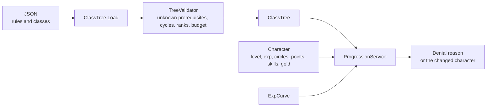

# Module 11: Character progression: levels, classes and advancement trees

- **Goal:** understand the common ways an RPG makes a character grow (levels, stats, classes, skill points), how to shape an experience curve, how to model a class tree as data and keep it valid, and build a small rules service for advancement, point spending and respec.
- **Prerequisites:** [05 — Data-driven design and property systems](05-data-properties.md), [08 — Stats and combat resolution](08-stats-combat.md).
- **Example:** `examples/11-progression/` (`dotnet test examples/11-progression`)
- **Facts checked:** October 2026 (prices, licences and product status change; re-check before reuse)

## In short

Progression is the promise that the character you play tomorrow is stronger or more interesting than the one you play today. It has four levers: **levels** (driven by an experience curve), **stats** (fixed growth, free points, or a mix), **classes** (a tree of choices, with prerequisites and limits), and **skills** (points spent on abilities). All four are data, so a designer can reshape the game without a programmer. The risk is not code, it is balance and bad data: a cycle in the tree, a branch that is strictly stronger, or a respec that is too cheap or too painful. The example loads a class tree from JSON, validates it, and implements advancement, free-point and skill-point spending, derived stats and three kinds of respec, with the rules as numbers in the same file.

## 1. The concept

### 1.1 The four levers

| Lever | What changes | Typical player feeling |
|---|---|---|
| **Level** | A number that gates content and unlocks points | "I am getting stronger" |
| **Stats** | Strength, agility and so on, which feed combat (module 08) | "I am building my character" |
| **Class** | The role and the abilities you can reach | "I am choosing who I am" |
| **Skills** | Individual abilities and their levels | "I am tuning how I play" |

A game rarely needs all four to be deep. Pick where the depth is, and keep the rest simple.

### 1.2 Experience curves

The **experience (exp) curve** says how much exp each level takes. Its **shape** sets the pacing.

| Shape | Formula idea | Effect |
|---|---|---|
| **Linear** | `a * level` | Constant pace per level; levels feel the same, grind feels flat |
| **Polynomial** (power) | `a * level^b`, b between 1.5 and 3 | Early levels fly, later ones slow; the most common |
| **Exponential** | `a * r^level` | Very steep; needs a hard level cap soon |
| **Table** | A hand-made list | Total control, including plateaus and spikes; more data to maintain |
| **Piecewise** | Different formulas per range | Fast tutorial, long middle, a final climb |

Good design questions: how long should level 1 to 10 take (minutes), what is the target time to the cap, and where do you want players to spend a week. Compute **cumulative exp** and **time per level** in a spreadsheet before shipping. A **level cap** is a design decision as much as a number: it sets where content gives way to other progression such as gear.

### 1.3 Stat growth

| Model | Idea | Strength | Weakness |
|---|---|---|---|
| **Fixed growth per class** | Each class has a fixed gain per level or circle | Easy to balance; no "wrong" build | Little player choice |
| **Free points** | Every level grants points the player spends | Strong identity; theorycrafting | New players make bad builds; needs respec |
| **Hybrid** | Class growth plus a smaller pool of free points | Safe base, some choice | More rules to explain |
| **Gear-driven** | Stats come mostly from equipment | Constant reward loop | Level matters less; item inflation |

The example uses the hybrid: fixed growth per circle from the class, plus free points per level with a per-stat cap.

### 1.4 Classes, jobs and advancement trees

A **class** (or **job**) is a package of growth, skills and role. Games combine classes in several ways:

- **Single class for life** (most action RPGs): choose at the start.
- **Advancement** (class change): a starting class branches into more specialised ones at set levels. The tree is a directed graph with prerequisites.
- **Multiclassing**: the character holds several classes at once, either by switching between them or by taking levels in each.
- **Free-form trees** (passive trees): nodes connected on a graph, no classes at all.

The data model for a class tree is small:



Each node has an id, a **rank** (its tier), **prerequisites** (class and minimum number of steps), a **maximum number of steps**, a growth block, and skills. The **circle** in the example is one step inside a class.

Terms used from here on:

- **Rank:** the tier of a class in the tree. Higher ranks come later.
- **Circle:** one advancement step within a class. A class may allow, say, three circles.
- **Rank slots:** how many different classes of a rank a character may hold at once. They create branching choices without letting everyone have everything.

### 1.5 Skill points and skill levels

A **skill point** is spent to learn a skill or raise its **skill level**. Common rules: skills unlock after some class progress, each skill has a maximum level, and points come from class steps or character levels. Deriving "points available" as *earned minus spent* means you never store a counter that can drift.

### 1.6 Respec

A **respec** (respecialisation) undoes choices. The design question is how much it costs, in gold, items or time. Free respec makes every decision cheap and tuning to every fight possible. A very costly respec makes players afraid to experiment and pushes them to read guides before choosing. Many games separate the cost by lever: skills cheap, stats moderate, classes expensive.

## 2. The design space

### 2.1 Vertical and horizontal progression

| | Vertical | Horizontal |
|---|---|---|
| **Meaning** | You get strictly more powerful | You get more options, not more power |
| **Examples** | Levels, gear tiers, stat growth | New classes, side skills, cosmetic builds |
| **Strength** | Clear sense of progress | Longevity without power creep |
| **Weakness** | Old content becomes trivial; the cap makes players leave | Players may feel less reward |

Long-running online games lean vertical early and horizontal late: a short level climb, then breadth such as extra classes, alternate builds and collections.

### 2.2 Power budget

A **power budget** says how much total power a character should have at a given point. Everything that grants power (levels, class circles, free points, gear, buffs) draws from it. Without a budget, designers add "a little more" in ten places and the sum explodes.

Practical rules:

- Give every class the **same total growth per step**, and differ only in how it is distributed. The example validator checks this: each class grows by 6 points per circle.
- Gate total advancement by level (a cap on circles per level) and by an absolute cap.
- Put a **per-stat cap** on free points so players cannot pour everything into one number.
- Keep a **spreadsheet** of the expected total power at each level and compare it against the content you are building.

### 2.3 How to choose

| If... | Prefer |
|---|---|
| New players and mobile | Fixed class growth, few free points, cheap respec |
| Build identity and community theorycrafting | Free points or passive trees; plan a respec economy |
| Many roles, long game | Advancement tree with ranks and rank slots |
| Very small team | Single class with skill choices, one curve |
| You expect to add classes every year | Data-defined classes, validated at load, with the power budget enforced in the validator |

## 3. Trade-offs and pitfalls

- **Strictly dominant branches.** One class that is better at everything makes the tree a trap. Enforce a budget and playtest.
- **Cycles and orphan nodes.** A prerequisite loop makes classes unreachable; a node with no path is dead content. Validate at load.
- **Hidden gates.** If the rules are spread over the quest scripts, the UI and the server, nobody can tell why a button is greyed out. Return a **reason** (the example's `Denial`) and show it.
- **Stored derived counters.** Storing "points left" in addition to what was spent invites drift and duplication bugs. Compute it.
- **Respec exploits.** Free instant respec plus a buff that depends on the build lets players swap in the middle of a fight. Restrict respec in combat or add a cooldown.
- **Curve cliffs.** A smooth curve with one sudden spike at the cap drives players away. Plot it.
- **Content tied to levels.** If every zone assumes one level range, over-levelled players skip content. Consider scaling or horizontal rewards.
- **Migrating live characters.** Changing a class tree after launch breaks saved characters unless there is a version and a migration or a free respec. Plan for it.

## 4. Build or buy

| Engine | What you get for progression |
|---|---|
| **Unreal** | Curve tables and the Gameplay Ability System's attribute and effect model can carry level scaling. Class trees and advancement rules are yours to write. |
| **Unity** | Nothing built in. Scriptable objects hold the data; you write the rules. |
| **Godot** | Nothing built in. Resources and a `Curve` type help with data. |

Engines give nothing for the rules that matter here, so **build it**. The work is data modelling and balance.

| Piece | Effort | Risk |
|---|---|---|
| Exp curve and level lookup | Low | Low: unit-test the table |
| Class tree data and validator | Low | Medium: designers will find new ways to make bad data |
| Advancement service with reasons | Low | Medium: rule order; keep it in one place |
| Free points, skill points, respec | Low | Medium: economy and exploits |
| Tools for designers (tree editor, spreadsheet export) | Medium | Medium: where most of the time actually goes |
| Persistence and migration of live characters | Medium | High: see module 20 |

AI-assisted development is useful for writing the validator's edge cases and the table of tests, and for generating first-draft balance spreadsheets. The balance itself is a design task and needs play.

**What a proof of concept must prove.**

1. The whole tree lives in a data file; adding a class is a new entry and nothing else.
2. A broken file is rejected at load with a message that names the problem.
3. Every refused action returns a reason the client can show.
4. A designer can print total power per level for any build path and compare branches.

**Verdict: build.** Keep one rules service on the server (module 19) that is the only code allowed to change a character's progression.

## 5. The example

### Design



The service never mutates a character when it refuses, and it returns a **reason** instead of a bare false.

### Walkthrough

- **`StatBlock.cs`** is four primary stats with `+` and scalar `*`, used for growth, free points and totals.
- **`ClassTree.cs`** holds the records: `ClassDef` (rank, prerequisites, maximum circles, growth, skill points per circle, skills), `SkillDef` (maximum level, unlock circle), `ProgressionRules` (every number: curve, circle limits, free points, rank slots, budget, respec prices) and `ClassTree.Load` which parses JSON and fails on any validation error.
- **`TreeValidator.cs`** checks duplicate ids, unknown prerequisites, prerequisites that need more circles than exist, a prerequisite of the same or a higher rank, rank 1 classes with prerequisites, higher ranks without any, growth off the budget, skills unlocking outside the class, and prerequisite **cycles** by depth-first search with a "currently on the path" marker.
- **`ExpCurve.cs`** gives exp to the next level (`round(base * level^power)`), cumulative exp, and the level for a total.
- **`Character.cs`** is plain state: level, exp, gold, base stats, circles per class, free points spent, skill levels.
- **`ProgressionService.cs`** has the rules. The advancement check, in order:

```csharp
if (have >= cls.MaxCircles) return Denial.MaxCircles;
if (c.TotalCircles >= Rules.MaxTotalCircles) return Denial.TotalCircleCap;
if (c.TotalCircles + 1 > c.Level / Rules.LevelsPerCircle) return Denial.LevelTooLow;
// ... prerequisites, then rank slots for a class the character does not hold yet
```

### Tests and their concrete numbers

All in `examples/11-progression/` (21 tests, all passing). The sample tree has Fighter and Mage at rank 1; Knight, Berserker and Duelist at rank 2 (each needs 3 Fighter circles); Guardian at rank 3 (needs 2 Knight circles). Every class grows 6 points per circle.

- **Exp curve** (base 100, power 1.5): level 1 to 2 takes **100**, 2 to 3 **283**, 3 to 4 **520**, 4 to 5 **800**, 9 to 10 **2,700**. Reaching level 4 needs **903** exp in total: 903 gives level 4, 902 gives level 3. The level never exceeds the cap of 50.
- **Validation:** the sample tree is valid. An unknown prerequisite, a two-class cycle, a prerequisite that needs 3 circles when the class has 2, a prerequisite of the same rank, and a class growing 9 points against a budget of 6 are each reported with a message naming the class.
- **Advancement:** at level 4 no circle is allowed (4 / 5 = 0); at level 5 one is; a second needs level 10. Knight is refused with 2 Fighter circles and accepted with 3. At level 30, Knight and Berserker are both allowed, a third rank-2 class (Duelist) is refused as **RankFull**, and so is Mage (rank 1 already holds Fighter). With a total cap of 8, a level-50 character stops at **8** circles even though the level would allow 10.
- **Stats:** 3 Fighter circles give (9, 3, 6, 0), one Knight circle adds (3, 0, 3, 0), and base (5, 5, 5, 5) gives **(17, 8, 14, 5)**. At level 20 a character has **38** free points (2 per level-up, 19 level-ups); spending 39 is refused; 10 on strength makes strength **27**; the per-stat cap of 40 refuses 41 points.
- **Skills:** the first Fighter circle grants **3** skill points; "whirl" is locked until circle 2; a 4th point in the same session finds the pool empty; after the second circle 6 points earned and 4 spent leave **2**. A skill of maximum level 5 refuses a sixth point.
- **Respec:** 10 free points cost **1,000** gold to take back; with 500 gold the respec is refused and nothing changes. A skill respec is free and returns every point. Resetting 4 circles costs **2,000** gold (500 each), clears the skills, and lets the character pick a different branch.

### Using it for a different game

All the numbers are in `ProgressionRules`. A mobile game might set `LevelsPerCircle` to 1, drop free points to 0, and make respec free. A hardcore game raises respec prices and adds a class per rank slot. A new class is a new JSON entry; if it breaks the budget or loops back on a prerequisite, the loader refuses the file.

### What the example leaves out

- Passive trees as a graph (the validator would grow adjacency and reachability checks).
- Gear and buffs (module 08's modifier stack applies on top of `TotalStats`).
- Per-skill costs that grow with level, and skill prerequisites between skills.
- Saving, versioning and migrating live characters (module 20).
- Respec in combat rules and cooldowns.
- Server messages and the UI that shows `Denial` reasons.

## Key takeaways

- Progression has four levers: levels, stats, classes and skills. Decide where the depth is and keep the rest simple.
- Shape the exp curve on purpose: plot cumulative exp and time per level before choosing the formula.
- Stat growth can be fixed, free or hybrid; every free-point system needs a cap and a respec.
- A class tree is a validated directed graph: ranks, prerequisites, circle limits and rank slots, all in data.
- Give every class the same power budget per step, and let a validator enforce it.
- Return a reason for every refusal and compute "points available" instead of storing it.
- Engines give nothing here: build the rules, and spend the time on data tools and balance.

## Further reading

- [Ian Schreiber and Brenda Romero: Game Balance Concepts (free course)](https://gamebalanceconcepts.wordpress.com/)
- [Game Developer: articles on RPG progression and game balance](https://www.gamedeveloper.com/)
- [Unreal Engine: Understanding the Gameplay Ability System (attributes and gameplay effects)](https://dev.epicgames.com/documentation/en-us/unreal-engine/understanding-the-unreal-engine-gameplay-ability-system)
- [Unreal Engine: Data Driven Gameplay Elements (curve tables)](https://dev.epicgames.com/documentation/en-us/unreal-engine/data-driven-gameplay-elements-in-unreal-engine)
- [Godot: Curve resource](https://docs.godotengine.org/en/stable/classes/class_curve.html)
- [Path of Exile: the passive skill tree (an example of a free-form tree)](https://www.pathofexile.com/passive-skill-tree)
