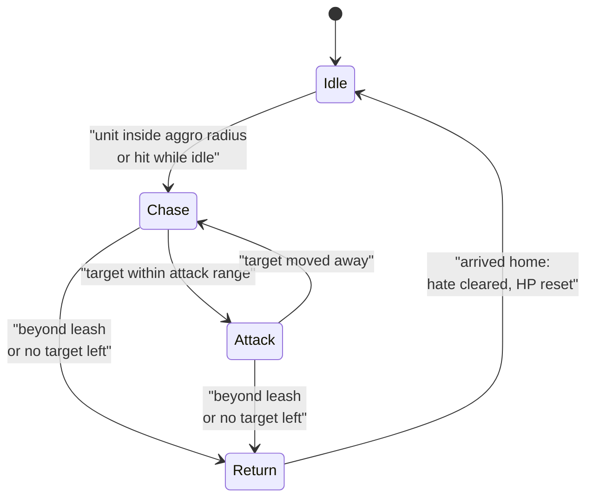
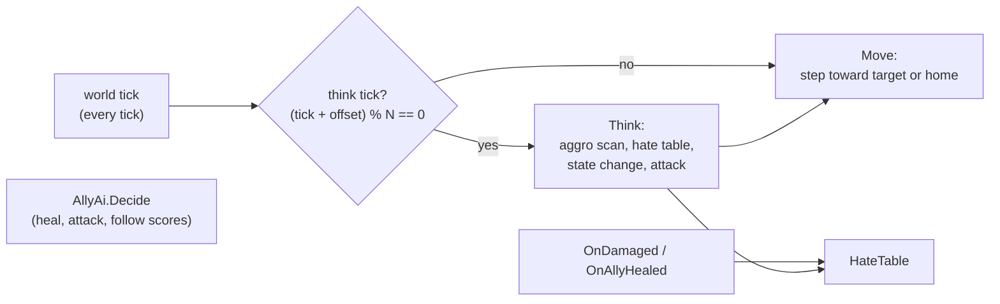

# Module 12: Game AI

- **Goal:** understand finite state machines, behaviour trees and utility AI and when each fits, how aggro, hate (threat) tables and leashing work, how companions decide what to do, and how to build a small, testable server-side AI in C#.
- **Prerequisites:** [03: The game loop and time](03-game-loop.md) (ticks and the single-threaded simulation), [07: Navigation and pathfinding](07-navigation.md) (how an AI unit gets from A to B), [10: Skills, abilities and buffs](10-skills-buffs.md).
- **Example:** `examples/12-ai/` (`dotnet test examples/12-ai`)
- **Facts checked:** October 2026 (prices, licences and product status change; re-check before reuse)

## In short

Server-side game AI is mostly small and boring on purpose: a few states, a table of who the monster hates, a leash, and a cheap scoring rule for allies. A monster is a state machine with an aggro radius and a leash. Its target comes from a threat table with damage, healing, decay and taunt. A companion is a set of weights in a utility score. The most important cost lever is to separate the **think rate** from the **tick rate**: the world moves every tick, but decisions run every few ticks and are staggered. The example implements all of it as plain deterministic code with exact-number tests.

## 1. The concept

### 1.1 Three ways to organise decisions

A **finite state machine (FSM)** has a small set of named states and rules for moving between them ("Idle, then Chase when a target is seen"). It is the simplest model, easy to debug and easy to run cheaply. Its weakness is growth: every new behaviour adds states and transitions, and the transition count grows faster than the state count.

A **behaviour tree (BT)** organises decisions as a tree that is re-evaluated from the root. Inner nodes are *selectors* (try children until one succeeds) and *sequences* (run children until one fails); leaves are conditions and actions. Priorities are explicit (left to right) and parts are reusable, which is why BTs suit bosses with many conditional behaviours.

**Utility AI** scores every possible action with a number, usually 0 to 1 times a weight, and takes the best. There are no hand-drawn transitions. Behaviour emerges from the formulas, which suits "which of these five things matters most right now" choices such as a companion deciding between healing, attacking and following.

| Approach | Fits when | Costs |
|---|---|---|
| FSM | Few modes, clear triggers (most monsters) | State explosion; hard to share parts |
| Behaviour tree | Many prioritised, conditional behaviours (bosses, scripted raids) | Needs tooling to author and debug; re-evaluation cost |
| Utility AI | Many competing options, role presets by weights (companions) | Tuning numbers; harder to explain a surprising choice |

They combine well: an FSM for coarse mode, a utility score to pick inside a mode.

### 1.2 Perception, aggro and leashing

A monster has to *notice* someone. The cheapest perception is an **aggro radius**: any valid unit inside the circle is a candidate. Real games add line of sight, facing and noise, but a radius covers most of an MMO field.

Once engaged, a monster keeps a **hate table** (also called a threat or aggro table): a number per enemy. The monster attacks the highest entry. Typical sources of threat are damage dealt, healing done to someone the monster is fighting, and special taunt skills. Typical safeguards are:

- **Decay**, so old fights fade.
- A **switch threshold** (often "110%"): a challenger must beat the current target by a margin, or the monster flips back and forth.
- A **taunt** that forces the target for a fixed time.

A **leash** stops monsters being dragged across the map. When the monster is too far from home, it gives up: it walks back, **clears its hate table** and usually heals. While returning it should ignore damage (the "evade" state), or players can exploit it.

### 1.3 Think rate versus tick rate

The simulation **ticks** at a fixed rate ([module 03](03-game-loop.md)), say 20 per second. Movement must integrate every tick or it looks jerky. Decisions do not: picking a target, scoring actions or scanning for enemies is the expensive part, and a monster that re-decides 4 times a second is indistinguishable from one that decides 20 times. The **think rate** is how often an AI decides; the **tick rate** is how often the world advances. Common techniques:

- Think every N ticks (here 5, so 20 Hz ticks give 4 Hz thinks).
- **Stagger** thinks by giving each AI a different offset, so the work spreads evenly instead of all 1,000 monsters thinking on the same tick.
- Do not think at all when no player is nearby.

## 2. The design space

### 2.1 What kinds of AI an online RPG needs

| Kind | Job | Typical approach |
|---|---|---|
| **Field monster** | Notice players, chase, fight, give up | FSM with aggro radius, threat table, leash |
| **Boss** | Phases, scripted mechanics, conditional moves | Behaviour tree or phase-based state machine plus script hooks |
| **Companion / follower** | Support the player without taking control | Utility scoring with role presets, plus a rule that the player's command wins |
| **Ambient NPC / crowd** | Make the world look alive | Schedules, wandering, no combat; often disabled when no player is near |
| **Auto-play for the player** | Fight on the player's behalf | A priority list or utility rules over the player's own skills |

### 2.2 How a monster picks its target

| Model | Behaviour | Fits |
|---|---|---|
| **Nearest** | Attack whoever is closest | Simple fodder monsters |
| **First sighting** | Keep the first target until it dies or leaves | Casual games; no tanking |
| **Threat table** | Damage, healing and taunts add threat; highest wins above a switch margin | Group content with tank and healer roles |
| **Scored target** | Weigh level, health, distance, casting; pick the best, optionally with randomness | Bosses and smart enemies |

### 2.3 How to choose

| If your game... | Choose |
|---|---|
| Has solo play and light grouping | FSM monsters, nearest or first-sighting targets |
| Needs tank/healer roles in groups | A threat table with a switch threshold and taunts |
| Has bosses with many phases | A behaviour tree or a data-driven phase list |
| Gives the player AI party members | Utility scoring with role presets; player commands always pre-empt |
| Must run thousands of monsters per zone | Low think rate, staggered thinks, no thinking where no player is near |
| Is a single-character action RPG | FSM monsters with a short leash and telegraphed attacks; simple threat or none |

## 3. Trade-offs and pitfalls

- **No threat model players can use.** If only a taunt adds threat, there is no real tanking, and healers never matter. Add damage and heal threat if you want party roles.
- **A single crude leash.** A cap on distance to the target alone lets a fast player drag a monster far from its spawn. Leash on distance from home and reset the monster fully.
- **Wall-clock timing.** AI that sleeps for real seconds cannot be replayed or tested. Count ticks.
- **An opaque core.** If the key decisions live in code designers cannot see, they cannot tune them. Put numbers in data.
- **Flip-flopping targets.** Without a switch margin, two players with similar threat make the monster alternate every think.
- **Leash exploits.** A returning monster must ignore damage and heal, or players farm it from outside its reach.
- **Reactive-only support AI.** A healer that heals the first ally under a threshold, with no weighing against other options, behaves badly under pressure.
- **Dead experiments.** Unused scoring models left in data confuse readers. Delete what you do not run.

## 4. Build or buy

**What the engines give you (as of October 2026).**

| | Behaviour trees | Other tools | Server use |
|---|---|---|---|
| Unreal | Built-in Behavior Trees and Blackboards | StateTree (state machine plus tree), Environment Query System (EQS) for "find a good spot or target", AI Perception component | Tied to Unreal actors; fine for an Unreal dedicated server |
| Unity | None built in; Asset Store and packages (for example Unity's Behavior package, as of October 2026) | NavMesh agents only | Code-first; DOTS if you need scale |
| Godot | None built in; community add-ons | `NavigationAgent`, state machines by hand | Hand-written in GDScript or C# |

Nobody sells "hate tables" or "companion presets"; those are game rules and every engine leaves them to you.

**Could we build it ourselves?** Yes, and it is one of the cheapest modules in the course.

| Piece | Effort | Risk |
|---|---|---|
| Monster FSM with aggro and leash | Hours | Low; edge cases around returning and dead targets |
| Hate table with decay, threshold, taunt | Hours | Low; tuning numbers is the real work |
| Utility scoring for allies | Hours | Medium; weights need playtesting |
| Behaviour tree runtime | A day or two | Low code risk; the authoring and debugging tools cost far more |
| Think scheduling and staggering | Hours | Low |

AI-assisted development is strong here: these are small, well-documented patterns, and AI writes the boilerplate and the tests quickly. The human work is deciding what behaviour you *want* and tuning it with real play.

**What a PoC must prove:** (1) a monster aggroes only inside its radius; (2) a target switch needs the threshold, not just a higher number; (3) the leash always brings the monster home with a clean state; (4) a healer chooses sensibly under competing priorities; (5) the AI cost scales with think rate, and a zone of a thousand monsters fits the tick budget (measure it).

**Verdict: build.** A small FSM per monster type, a hate table, and utility scoring for allies cover what most online RPGs need. Add a behaviour tree only when boss scripting actually needs it, and then write the small runtime yourself or adopt a tested open-source library rather than buying a framework.

## 5. The example

### Design

Everything is plain simulation code: no clock, no random numbers, and positions advance by a fixed amount per tick, so every test can assert exact outcomes.

### Walkthrough

- **`Vec2.cs`, `Unit.cs`**: a point with `DistanceTo` and `MoveToward`, and a minimal fighter with hit points.
- **`HateTable.cs`**: threat per unit id. `AddDamage` adds the damage, `AddHeal` adds half the healed amount, `Decay(rate)` shrinks every entry and drops those under 1. `SelectTarget` takes the highest entry (ties go to the lowest id, so the result never depends on dictionary order), keeps the current target unless the challenger exceeds `SwitchRatio` (1.1), and returns the taunted unit while a taunt is active. `Taunt` lifts the taunter to the current top threat and forces the target for a number of ticks.
- **`MonsterConfig.cs`**: aggro radius 10, attack range 2, leash 30, speed 1 per tick, think interval 5 ticks.
- **`Monster.cs`**: the FSM. `Tick` thinks only when `(tick + offset) % interval == 0` and moves on every tick. Idle gives the nearest unit inside the radius 20 initial threat; a hit while idle also counts. Engaged states check the leash against **distance from home**, drop dead units from the table, decay, select a target, and attack when in range and off cooldown. `EnterReturn` clears hate; arrival home resets hit points. `OnDamaged` is ignored while returning.
- **`AllyPreset.cs`, `AllyAi.cs`**: the preset is a record of weights and ranges. `Decide` scores heal (`HealWeight * (1 - hp fraction)` for the weakest ally below the threshold 0.7 inside heal range), attack (`AttackWeight * 0.6` if an enemy is in range) and follow (zero inside 6 units, rising to `FollowWeight` at 12), then takes the best; ties go to heal, then attack, then follow.

### Key tests and their numbers

All in `examples/12-ai/Tests/` (20 tests).

- **Aggro radius** (`MonsterTests`). A unit at 9.9 units starts a chase and gets 20 threat; at 10.1 the monster stays idle with an empty table.
- **Threshold** (`HateTableTests`). With 100 threat on A, B at 105 does not take the target; B at 111 does (110 is the line).
- **Heal threat.** Healing 200 adds 100 threat.
- **Taunt.** After A reaches 500 and B taunts for 5 ticks, B stays the target at tick 14 even after A adds 1,000; at tick 15 it flips back to A.
- **Leash.** A kited unit stays 8 units ahead of the monster. The monster crosses 30 units from home, and the first think after that (tick 40) sends it into Return with an empty hate table. It then walks home, ends Idle at (0,0) with 100 hit points. Damage taken while returning is ignored.
- **Healer.** An ally at 40% gives a heal score of 0.6 (attacker with the same scene: attack 0.6, because its heal weight is 0). With everyone above 70% the healer attacks at 0.2 * 0.6 = 0.12. With the leader 20 units away, follow scores 0.8: it beats a heal at 40% (0.6) but loses to a heal at 10% (0.9).
- **Think rate.** 100 ticks at interval 5 give exactly 20 thinks. A unit appearing on tick 1 is first noticed on tick 5. Ten monsters with offsets 0 to 4 think exactly twice per tick.

**Cost model.** 1,000 monsters thinking every tick at 20 Hz is 20,000 decisions per second; every 5th tick it is 4,000, and with staggering it is a flat 200 per tick.

### What the example leaves out

- No line of sight or facing; perception is a radius.
- No behaviour tree runtime and no boss phases; add them when content needs them.
- No pathfinding; the monster walks in a straight line (see module 07).
- No call-for-help hate spreading, no run-away, no skill selection.
- No multi-zone scheduling or "sleep when no player is near"; the per-monster offset is the cost lever demonstrated.

## Key takeaways

- Use an FSM for monster modes, a behaviour tree for deep boss logic, and utility scores to pick among competing companion actions; they combine.
- Aggro is an aggro radius; staying engaged is a threat table with decay, a switch threshold and a taunt; ending an engagement is a leash that returns home, clears threat and resets.
- Companion AI should be presets of weights over one scoring function, and the player's own command must always pre-empt it.
- The usual failure modes are no real threat model, a leash that measures the wrong distance, wall-clock timing and a core designers cannot see.
- Build or buy: build. Engines offer behaviour trees (Unreal) or nothing (Unity, Godot), and none sells game rules like threat tables.
- Think rate lower than tick rate, plus staggering, is the main server cost lever: the example thinks exactly 20 times in 100 ticks and spreads ten monsters at two thinks per tick.
- Everything in the example is deterministic (no clock, no random numbers), so every behaviour is pinned by an exact-number test.

## Further reading

- [Unreal Engine: Behavior Trees](https://dev.epicgames.com/documentation/en-us/unreal-engine/behavior-trees-in-unreal-engine)
- [Unreal Engine: StateTree](https://dev.epicgames.com/documentation/en-us/unreal-engine/overview-of-state-tree-in-unreal-engine)
- [Unreal Engine: Environment Query System](https://dev.epicgames.com/documentation/en-us/unreal-engine/environment-query-system-in-unreal-engine)
- [Unity Behavior package](https://docs.unity3d.com/Packages/com.unity.behavior@1.0/manual/index.html)
- [Godot: navigation and agents](https://docs.godotengine.org/en/stable/tutorials/navigation/index.html)
- [Game AI Pro (free chapters online)](http://www.gameaipro.com/)
- [Dave Mark: Behavioral Mathematics for Game AI (utility AI)](https://www.gdcvault.com/play/1012410/Improving-AI-Decision-Modeling-Through)
