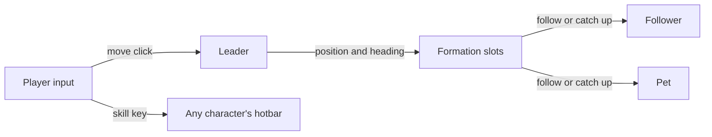
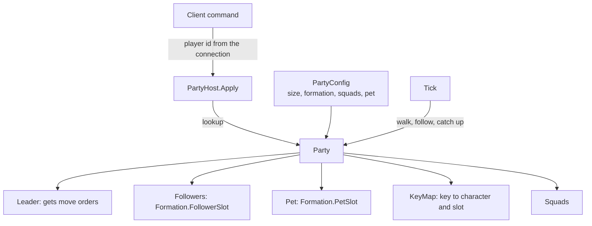

# Module 13: Party and companion control

- **Goal:** understand the ways a player can control more than one unit (several characters at once, one character with AI companions, or one character alone), and build a small server-side party model: leader switching, a rotating formation, follow with catch-up, per-character hotkeys, saved line-ups and a non-combat pet.
- **Prerequisites:** [03: The game loop and time](03-game-loop.md), [07: Navigation and pathfinding](07-navigation.md), [12: Game AI](12-ai.md) (the combat brains of the units the player is not driving).
- **Example:** `examples/13-party/` (`dotnet test examples/13-party`)
- **Facts checked:** October 2026 (prices, licences and product status change; re-check before reuse)

## In short

Most online RPGs give a player one character. Some give a party of several, and some give one character plus companions that fight alongside. Each choice answers one design question: **who is the player actually steering at any moment?** The common answers are direct control of everything, one leader plus AI companions, or a hybrid in which a leader takes clicks and any unit can be commanded on demand. No engine ships a party model, so you build it. The example is a server-side `Party` whose size, formation, squad slots and pet stamina come from configuration: a leader switch, a formation whose offsets rotate with the leader's heading, follow with a catch-up snap, per-character hotbars, saved line-ups and a pet. Set the size to 1 and it is a single-character game with a companion.

## 1. The concept

### 1.1 Terms

- **Roster:** every character the player owns. **Party:** the characters currently in the field.
- **Leader:** the character that receives movement clicks and sets the group's heading.
- **Formation:** a set of slots, each an **offset in the leader's local frame**. Rotating the offsets by the leader's heading turns the shape toward wherever the leader faces.
- **Follow:** each non-leader chases its slot every tick. **Catch-up:** if it is too far away, it snaps to the slot instead of walking.
- **Squad (saved line-up):** a stored copy of the leader choice, who is in the field and each character's loadout, recalled with one key.
- **Companion or pet:** an owned entity that helps but is not a full character. It may fight (a mount or fighting companion) or only loot and buff.

### 1.2 Formation maths in one paragraph

Define each slot as a vector `(forward, left)` for a leader facing east. For a leader at position `P` facing angle `a`, the slot is `P + rotate(offset, a)`. With a slot of `(-3, 2)` (three behind, two to the left) and a heading of 90 degrees (north), the rotation `(x, y) -> (-y, x)` gives `(-2, -3)`. The slot stays "behind-left" however the leader turns.

### 1.3 What the server must hold

Even if the client shows one group, the server simulates **separate entities**: each character has its own position, stats, cooldowns and target. A "player" owns several of them. The server needs an ownership link on every unit, a leader index per player, and a rule that commands name a slot **inside the sender's own party** rather than a global id. That keeps one player from ever addressing another player's characters.

## 2. The design space

### 2.1 Three ways to put more than one unit in the player's hands

| Model | Who the player steers | Strength | Weakness |
|---|---|---|---|
| **One character alone** | The one character | Simplest to learn, build, balance and put on a server | No party roles; the player needs other players for them |
| **One character + AI companions** | One character; companions act on their own, often with a few commands | Easy to learn; low input load; companions add flavour and collectable content | Companion AI must be good, and the player can feel like a passenger |
| **Direct control of all** | Every unit, by selection (RTS style) | Maximum tactical freedom | Highest input load; poor fit for action combat |
| **Hybrid party** | A leader by default; any unit on demand through its own hotkeys | Depth when you want it, automation when you do not | Two control paths to design, test and teach; four or more entities per player on the server |

Single-player party RPGs usually sit at the second or third rows (pause and tactics menus soften them). RTS games sit at the third. Several action RPGs and mobile RPGs sit at the second, with companions as collectable content. A hybrid party is the rarest and the most costly to build.

### 2.2 How companions are controlled

| Level of control | Examples of commands | Notes |
|---|---|---|
| **None** | Companion follows and fights by AI preset | Cheapest; works when the companion is a buff or a pet |
| **Stance commands** | "Attack", "Defend", "Hold", "Follow" | A few buttons; players feel in charge |
| **Skill triggers** | The player triggers companion skills on cooldown | Good for ultimate-style abilities |
| **Full control** | Switch to the companion and drive it | The hybrid party above |

Whatever the level, one rule keeps it playable: **the player's explicit command always pre-empts the AI.** A companion that fights the player is worse than a dumb one.

### 2.3 Switching the leader

| Style | Behaviour |
|---|---|
| **Hot-swap** | One key makes another character the leader at once (the previous leader goes to AI) |
| **Tag-in / tag-out** | Only one is on the field; the others wait and come in with a cooldown |
| **Fixed leader** | The player always drives the same character; the rest are companions |

### 2.4 How to choose

| If your game... | Choose |
|---|---|
| Is a single-character action RPG that sells companions | Party size 1 plus companions (pet and AI followers), fixed leader |
| Wants tactics and many roles but low input load | One leader, AI followers with role presets, a few stance commands |
| Wants deep tactics and has a PC audience | A hybrid party with per-character hotkeys and saved line-ups |
| Targets mobile | One leader or tag-in; automate the rest |
| Is a long-lived live game | Prefer designs where extra characters are content you can keep adding |

## 3. Trade-offs and pitfalls

- **Input burden.** Reaching several hotbars, retargeting and managing loadouts is a lot of keystrokes. It is the main reason players ask for automation.
- **UI load.** Portraits, hotbars, buff icons and formation buttons crowd the screen.
- **Server cost.** Every player is several simulated entities instead of one, so a zone with N players has roughly (party size + pet) times N entities to tick, path, broadcast and persist. Plan capacity and sight range for it.
- **Unfinished options.** Five formation buttons with one working shape make controls feel untrustworthy. Ship fewer options that work.
- **AI quality is load-bearing.** If the followers' brains are weak, the party is a liability, not a feature.
- **Slots in walls.** Formation slots can land inside obstacles; follow slots must be resolved to legal ground.
- **Jitter.** Followers that chase a slot that moves every tick oscillate when the leader stops and turns. Use a stop radius or a catch-up snap.
- **Auto-play erodes the premise.** Once characters hunt by themselves, tactical depth is optional.
- **Pets with no growth** give players little reason to care beyond feeding.

## 4. Build or buy

**What engines give you.** Unreal, Unity and Godot give you input mapping, a way to select objects, navigation and steering for each agent ([module 07](07-navigation.md)), animation and a networking layer. Unreal's gameplay framework has a *Controller possessing a Pawn*, which models one-player-one-body well. A party where one player owns several simultaneously active units is not a built-in concept in any of them. RTS-style box selection and move-to-formation are samples and marketplace assets, not engine features, and none is aware of a server-authoritative rule set. You write the party model yourself.

**Could we build it ourselves?** Yes, and it is one of the cheaper modules in the course.

| Piece | Effort | Risk |
|---|---|---|
| Party aggregate, leader switch, ownership | Low | Low |
| Formation with rotation, follow, catch-up | Low | Low to medium: slots that land in walls, or oscillation when a slot moves each tick |
| Hotkey table and per-character bars | Low | Low |
| Squad save and recall | Low | Low |
| Follower combat brains | Medium to high ([module 12](12-ai.md)) | The real risk of the whole design |
| Persistence of several characters plus pet per player | Medium ([module 20](20-persistence.md)) | Medium |
| Cost of several entities per player | Medium | Needs measurement |

AI-assisted development suits the shell: it is small, vector-based and easy to pin down with exact-number tests. It does not remove the need for human design on the part that matters, which is how good the companions are.

**What a proof of concept must prove.** (1) A zone with the target player count, each with the full party, holds its tick budget including follow and path queries. (2) Formation slots resolve to legal ground and followers do not jitter when the leader stops and turns. (3) The control feels playable: a tester can switch leader and use every hotbar at normal APM, or the design needs an assist mode. (4) The server rejects commands for units the sender does not own.

**Verdict: build.** The party model is design, not technology, and nothing off the shelf fits it. Keep it a small data-driven module and spend the effort on companion AI and on cutting the input burden.

## 5. The example

### Design

A `Party` owns its characters and a pet, all `Unit` objects stamped with the same owner id. The server holds one `Party` per player in a `PartyHost`, and clients send a small `PartyCommand` that names a slot in their own party, never a global unit id. A `PartyConfig` supplies the size, squad slots, catch-up and loot distances, formation and pet stamina.

### Walkthrough

- **`Vec2.cs`.** Position and vector maths. `Rotate(degrees)` is the only non-trivial method.
- **`Unit.cs`.** One world entity: id, owner, kind (character or pet), position, heading, destination, active flag, loadout name and a four-slot skill bar. `FollowsLeader` is false while the player drives that unit directly.
- **`PartyConfig.cs`.** Size, squad slots, catch-up distance, loot radius, an optional formation and the pet stamina numbers. Defaults are a size of 3, three squads, 20 and 5 units, and a pet pool of 1000 with a cost of 10 and a floor of 100.
- **`Formation.cs`.** Offsets in the leader's local frame. `WedgeOf(n)` builds a V of rows of two: followers at `(-3, 2)` and `(-3, -2)`, a third at `(-5, 2)`, and the pet one step behind the last row. `FollowerSlot` and `PetSlot` add the rotated offset to the leader's position, as in section 1.2.
- **`Party.cs`.** The aggregate. `TrySwitchLeader` rejects an out-of-range or inactive character and cancels every pending order. `Move` sends a click to the leader only. `TryMoveUnit` detaches one follower for direct control and `Regroup` re-attaches everyone. `Tick` walks the leader and any detached units to their destinations, then each follower either steps toward its slot or, past `CatchUpDistance`, snaps to it. The slot order follows roster order and skips the leader, so a slot does not change because another character is detached.
- **`KeyMap.cs`.** A table from key to (character, slot), with default rows `QWER`, `ASDF`, `ZXCV` and `1234`. `Bind` rebinds at runtime, so the keys are data.
- **`Squad.cs`.** A record of the leader index, the active flags and the loadouts. `TrySaveSquad` and `TryRecallSquad` use the configured slots; recall also re-attaches any detached characters.
- **`PetActivity.cs` and `GroundItem.cs`.** The stamina pool and a pick-up target. `TryPetLoot` takes the nearest item within the loot radius, and only spends stamina if something was taken.
- **`PartyCommand.cs`, `CommandKind.cs`, `CommandResult.cs` and `PartyHost.cs`.** The wire-level layer. Commands are looked up by the connection's player id and validated by the party. A skill key press becomes a queued `SkillCast` for the combat simulation; the example does not resolve damage.

### Key tests and their numbers

All in `examples/13-party/Tests/` (44 tests, all passing):

- **Leader switching changes who receives move commands.** After `TrySwitchLeader(1)` and `Move((20, 0))`, character 1 has the destination and characters 0 and 2 have none. Index `-1` and `3` are refused and the leader stays 0. A switch also cancels a pending order.
- **Formation at heading 90 degrees.** Leader at `(10, 10)` facing north: follower 1's slot is `(8, 7)` and follower 2's is `(12, 7)`, from rotating `(-3, 2)` to `(-2, -3)` and `(-3, -2)` to `(2, -3)`. The pet slot is `(10, 6)`. At heading 0 the same party gets `(7, 12)` and `(7, 8)`. With character 1 as leader, characters 0 and 2 take the first and second slot.
- **Heading follows travel.** A leader sent from `(0, 0)` to `(0, 10)` at speed 5 is at `(0, 5)` after one second of ticks, heading 90, and follower 1's slot has become `(-2, 2)`.
- **Follow and catch-up.** A follower 10 units from its slot, inside the 20-unit leash, moves 5 in one second and ends at `(-3, 7)`. A follower at `(500, 500)` snaps to `(-3, -2)` in one tick, and a pet at `(-100, 0)` snaps to `(-4, 0)`.
- **Direct control.** A detached character sent to `(0, -10)` walks to `(0, -5)` on its own. After `Regroup` its slot `(-3, -2)` is only about 4.24 away, under one 5-unit step, so it arrives exactly.
- **Hotkeys.** With character 0 leading, key `S` casts character 1's second skill (`A2`). After switching leader to character 2, key `Q` still means character 0's `Q1`. An unbound key, an empty slot or a benched character returns false.
- **Squads.** Save with loadouts Sword, Guard and Bow, then change leader to 2, bench character 1 and reset two loadouts: recall gives leader 0, all active and the three loadouts back. Slots 0 and 4 are refused and an empty slot cannot be recalled.
- **Pet.** One action takes 1000 to 990. At 100 the pet refuses, and after `Feed(20)` it acts and ends at 110. With items at distances 4, 2 and 9 and a radius of 5, it takes the one at 2 and spends 10.
- **Party size.** With size 1 there is no follower, leader switching is refused and the pet slot is `(-2, 0)`. With size 4 the third follower stands at `(-5, 2)` and the pet at `(-6, 0)`. A character list of the wrong length is rejected.
- **Server representation.** Two players produce 8 entities, 4 owned by each. Player 1's move leaves all of player 2's units without a destination. An unknown player id returns `UnknownPlayer`, a bad leader index returns `Rejected`, and key `X` queues `SkillCast(2, "Z2")`.

### Configuring it for another game
A single-character game with a pet and one AI follower sets `Size = 1` (the pet is the companion) or `Size = 2`. A three-character game keeps the defaults. A game with a rectangular escort formation passes its own `Formation` offsets in the config.

### What the example deliberately leaves out

- **No combat or follower AI.** Followers only follow; their decision logic belongs to [module 12](12-ai.md).
- **No collision or navigation.** Slots are not checked against walls. Passing a slot through the navigation slide of [module 07](07-navigation.md) is the obvious next step.
- **No multi-select or loadout effects.** Group selection and bonuses attached to line-ups are not modelled.
- **No persistence, party buffs or archive features.**
- **One formation family.** The data structure allows more shapes.

## Key takeaways

- A party needs a control model. The options are one character alone, one character plus AI companions, direct control of all, or a hybrid, and each trades depth against input load.
- A formation is a set of offsets in the leader's frame, rotated by the leader's heading. A follower walks to its slot and snaps to it when too far away.
- The player's explicit command always pre-empts companion AI.
- Saved line-ups (leader, who is in the field, loadouts) are cheap and make the depth usable; automation is the usual answer to input burden.
- On the server a player owns several entities and commands should name a slot in the sender's own party, never a global id.
- Build, do not buy. No engine models a one-player-many-units party, the shell is small, and the real risk is companion AI.
- The example is configured by data: change `Size`, the formation and the pet numbers, and the same code serves a one-character game with a pet or a multi-character party, pinned by exact tests such as slots `(8, 7)` and `(12, 7)` at heading 90.

## Further reading

- [Unreal Engine: gameplay framework, controllers and pawns](https://dev.epicgames.com/documentation/en-us/unreal-engine/gameplay-framework-in-unreal-engine)
- [Unity: Input System manual](https://docs.unity3d.com/Packages/com.unity.inputsystem@1.8/manual/index.html)
- [Godot 4: using NavigationAgents](https://docs.godotengine.org/en/stable/tutorials/navigation/navigation_using_navigationagents.html)
- [Craig Reynolds: Steering Behaviors for Autonomous Characters](https://www.red3d.com/cwr/steer/)
- [Game Programming Patterns: Command](https://gameprogrammingpatterns.com/command.html)
