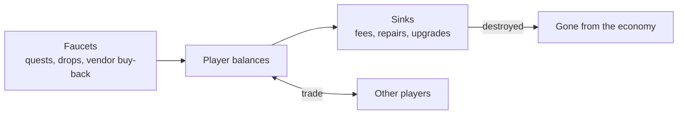
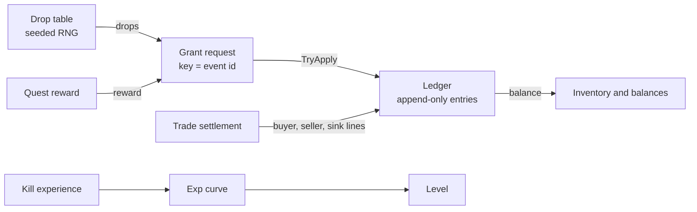

# Module 14: Items, economy and rewards

- **Goal:** understand how an online RPG models items, inventories, drops, experience and money so that the economy survives millions of players and retries, then build a small server-side core: item definitions and instances, a stacking inventory, a seeded drop table, an experience curve and an append-only ledger with idempotency keys.
- **Prerequisites:** [03 - The game loop and time](03-game-loop.md) (seeded RNG, determinism), [05 - Data-driven design and property systems](05-data-properties.md) (item tables are data).
- **Example:** `examples/14-economy/` (`dotnet test examples/14-economy`)
- **Facts checked:** October 2026 (prices, licences and product status change; re-check before reuse)

## In short

An online RPG economy is a set of **faucets** (things that create items and money), **sinks** (things that destroy them) and a **ledger** that must never lose or invent a coin. Items split into **definitions** (shared table rows) and **instances** (individual objects with their own state). Drops are weighted picks or "1 in N" rolls, and experience is a table of thresholds. The design choices that matter most are not mechanical: how steep the level curve is, how much random power gear carries, and where money leaves the world. The example is about 400 lines of C# with no middleware. Its key property is that applying the same grant twice changes nothing, so retries and crashes cannot duplicate money.

## 1. The concept

### 1.1 Definition vs. instance

An item **definition** is a row in a table: id, name, max stack size, equip slot, sell price. Every potion in the world shares one. An item **instance** is a particular object a player owns. A potion needs only a count, so a stack of 30 potions is one definition id plus a number. A sword may carry its own state (upgrade level, random bonus options, who bound it), so it needs a unique **instance id**.

Rule of thumb: stackable items are counts, unique items are objects. Giving every potion an id wastes memory and database rows; making a sword a count loses its state.

### 1.2 Stacking, inventory and equipment

An **inventory** is a fixed number of slots. Adding items fills partial stacks first, then empty slots. Two rules prevent bugs: adding is **all-or-nothing** (if 16 potions do not fit, add none), and the capacity check happens before any change. **Equipment** is a second small container with one slot per body part. Equipping swaps the worn item into the inventory slot that was just freed, so a swap can never fail for lack of room.

### 1.3 Drop tables

| Shape | How it works | Good for |
|---|---|---|
| **Weighted pick** | One roll chooses one entry; chance = weight / total weight | "Choose one reward from a chest" |
| **Independent 1-in-N rolls** | Each entry has a **denominator** N and is rolled on its own with chance 1/N | Monster loot: a kill can drop nothing, one item or several |

Designers like denominators because "1 in 1000" is easy to say and to scale. A denominator of 1 means guaranteed. Two multipliers usually adjust N at roll time: a **level penalty** (kill something far below you and N grows, to stop farming) and an **event rate** (a double-drop weekend halves N).

### 1.4 Experience and levels

A level is a function of total experience. The usual storage is a table of "cost to reach the next level". Cumulative totals, and the level for a given total, are derived with integer arithmetic so thresholds are exact. Experience from a kill is usually the monster's base value times a multiplier chosen by the level difference, which stops very weak monsters from being an efficient source. The curve's shape is a design decision: smooth exponential growth feels fair, sudden jumps feel like walls.

### 1.5 Currencies, faucets and sinks

A **currency** is a number per account. **Faucets** create it (quest rewards, vendor sales, drops). **Sinks** destroy it (vendor purchases, repairs, market fees, upgrade costs). If faucets outrun sinks, prices rise: **inflation**. If sinks outrun faucets, players cannot progress. Most MMO balance work is keeping those two flows roughly level over years.



### 1.6 Trading and markets

Players can trade directly, through a shop, or through an **auction house** (a market). Any market charges fees, and fees are the most reliable sink because they scale with activity. A trade must be **atomic**: either the buyer pays and the seller delivers, or nothing happens.

### 1.7 Duplication exploits and idempotency

The costliest bugs in online games are **duplication exploits**: a way to get an item twice. They almost always come from one of three causes: a request processed twice (network retry, double click, replay), two requests racing on the same item, or a crash between "take from A" and "give to B". The cures are:

- **Atomic multi-step changes:** all lines of a transfer commit together.
- **Server authority:** the client says "I want to buy"; the server decides.
- **Idempotency keys:** every business event (a quest reward, a trade) has a unique key. The first request with that key is applied; later ones are recognised and ignored, so a retry is always safe.
- **An append-only ledger:** every change is a row that is never edited, so you can always answer "where did this come from?" and recompute a balance from history.

## 2. The design space

### 2.1 Where power comes from

| Source | Examples | Economy effect |
|---|---|---|
| **Gear drops** | Action RPGs, MMORPGs | Strong faucet of items; needs sinks (salvage, repair, upgrade) |
| **Crafting** | Sandbox MMOs, survival games | Turns materials into items; a natural sink for materials |
| **Upgrade rolls** | Enhancement levels, random bonus lines, gem sockets | Sinks items and money; random outcomes frustrate players if stacked |
| **Gacha or boxes** | Mobile RPGs | Monetisation first; the economy is a store |
| **Levels and skill trees** | Almost all RPGs | No items needed; keeps item economy small |

### 2.2 Single character vs. party

In a single-character action RPG, one inventory and one equipment set serve one avatar, and drops can be tuned to that avatar's build. In a **party of several characters** the economy multiplies: each member has equipment slots, each needs gear, and a shared bag competes with per-character bags. Decide early whether inventory is **per account**, **per character**, or both (a shared stash plus personal bags). Per-account storage makes swapping gear between characters cheap but needs bind rules so one account cannot funnel gear between throwaway characters.

### 2.3 Tradable or bound

| Model | Pros | Cons |
|---|---|---|
| Fully tradable | Lively player market | Real-money trading, bots, inflation pressure |
| Bind on pickup or account-bound | Few exploits, simple | No market, so gear must be obtainable by play |
| Mixed (materials tradable, gear bound) | Market exists but cannot buy power directly | Needs clear rules per item class |

### 2.4 Drop models

| Model | Idea | Used for |
|---|---|---|
| Per-kill rolls | Each monster rolls its own table | Open-world grinding |
| Loot tables with pity | Chance rises after each miss until a drop | Rare items in mobile and live-service games |
| Personal loot | Each player rolls separately | Avoids party fights over loot |
| Fixed rewards | No randomness | Quests, story, daily rewards |

### 2.5 How to choose

| If your game is... | Prefer |
|---|---|
| Solo or small party, session-based | Personal loot, bound gear, few currencies |
| Persistent world with a player economy | Tradable materials, fee sinks, an audited ledger |
| Monetised through random boxes | Pity counters and published odds; check local regulation |
| Long-running live service | Plan sinks for each new gear generation from day one |

## 3. Trade-offs and pitfalls

- **The level wall.** One level costing as much as the previous ninety-nine combined is an authoring cliff, not a curve. It is the point where players quit or pay.
- **Stacked random power.** Upgrade levels, random bonus lines and sockets multiply: gear that needs several independent lucky rolls can cost many copies of the base item.
- **Non-monotonic "protection".** A purchase that can make the outcome worse teaches players not to trust the system.
- **Power creep and inflation.** Each new gear generation makes the old one vendor trash. If field income does not rise with prices, newcomers cannot afford the next tier.
- **Pay-to-win pressure.** Premium currencies, protection items and boxes make progress feel gated by spending. It is easier to prevent than to fix.
- **Currency sprawl.** One token item per event is easy to add and hard to ever retire.
- **Idempotency by convention.** Retry protection added later next to older code paths leaves old holes. Make it a property of the ledger, not of each caller.
- **Drops are not testable by eye.** Only large seeded simulations show whether a 1-in-1000 drop really behaves like one.

## 4. Build or buy

**What engines give you.** Unreal, Unity and Godot give **nothing** for an economy. They have asset and data-table tools (Unreal data tables, Unity ScriptableObjects, Godot resources) that help you author item definitions, and UI toolkits for drawing an inventory. They provide no authoritative inventory, no ledger, no drop logic and no anti-duplication guarantees. In an online game those must live on the server anyway.

**Backend services.** Economy-as-a-service products exist (for example PlayFab Economy and Unity's Economy service) and, as of October 2026, offer virtual currencies, catalogs, player inventories, receipts for store purchases and live configuration. They are strong at **storefronts**: validating Apple and Google purchases, entitlements and promotions. They are weaker for an MMO's hot path: per-kill drops, hundreds of item changes a minute per zone, custom trade rules, and joins with your own character data would all put a remote call on the tick path.

**Could we build it?**

| Piece | Effort | Risk | What a PoC must prove |
|---|---|---|---|
| Definitions, stacking inventory, equipment | Low (days) | Low | Rules tested at limits: full bag, exact max stack |
| Drop tables with seeded RNG | Low | Medium: balance, not code | Distribution matches design over 100,000 rolls; replay reproduces a drop |
| Experience curve and level function | Low | Low | Exact thresholds; no overflow at the cap |
| Ledger with idempotency keys on PostgreSQL | Medium | **High if wrong**: it is the money | A unique constraint on the key; retries and concurrent duplicates yield one effect |
| Market and trade | Medium | High: races, fees, fraud | Two simultaneous buys of one listing: exactly one wins |
| Economy tuning (faucet and sink rates) | Ongoing | High | Telemetry dashboards and a simulation of a year of play |

AI-assisted development makes the mechanical code quick. The hard part moves to **specifying invariants** (supply sums to zero, balances equal history, no negative stacks) and testing races against a real database.

**Verdict: build the core, consider services only for storefronts.** Inventory, drops, progression and ledger are small, game-specific and must sit next to the simulation. Use a service, if at all, for real-money purchase validation and a web shop, feeding grants into your own ledger with the purchase receipt as the idempotency key.

## 5. The example

### Design



Two layers. **Local rules** (inventory, equipment, drop rolls, experience) decide what happens in memory during a tick. The **ledger** is the durable record: every grant, spend and trade becomes a group of lines applied atomically under an idempotency key. In production the ledger is a PostgreSQL table with a unique constraint on the key; the example keeps the same contract in memory.

### Walkthrough

- **`ItemDefinition.cs`, `ItemCatalog.cs`:** the static table row (`MaxStack`, `Slot`, `SellPrice`) and its lookup. A max stack of 1 means unique.
- **`ItemStack.cs`, `InstanceIdGenerator.cs`:** what lives in a slot. Only unique items get an instance id, and it is never reused.
- **`Inventory.cs`:** `TryAdd` computes total room first (partial stacks plus empty slots times max stack) and rejects with `NoSpace` before touching anything. Then it tops up partial stacks and opens new slots. `TryRemove` is also all-or-nothing.
- **`Equipment.cs`:** `TryEquip` lifts the stack out of its slot, then puts any previously worn item back into that same slot.
- **`SplitMixRng.cs`:** a 12-line seeded generator written out so a seed gives identical numbers on every machine and runtime version.
- **`WeightedTable.cs`:** integer weights; one roll in [0, total) walks the entries.
- **`DropEntry.cs`, `DropContext.cs`, `DropTable.cs`:** the denominator style. `Effective` scales N by penalty and rate with integer math; N of 1 never consumes a random number.
- **`ExpCurve.cs`, `KillXp.cs`:** a table of step costs, derived cumulative totals, `LevelFor`, a `Geometric` helper, and a data-driven table of experience multipliers by level difference (`KillXp.Sample`).
- **`Ledger.cs`, `LedgerLine.cs`, `LedgerEntry.cs`, `ApplyStatus.cs`:** `TryApply(key, reason, lines)` returns `Duplicate` for a known key, validates projected balances for the whole group (players cannot go negative; `system:` accounts such as the faucet and the sink can), then appends rows. A rejected request does not consume its key, so a corrected retry works. Items use the same mechanism with assets like `item:potion`.
- **`MarketFees.cs`, `TradeSettlement.cs`:** fee rates as data (sample: 0.5% listing, 2% sale), and a sale expressed as three lines (buyer pays, seller receives net, the fee goes to the sink).

The core calls look like this:

```csharp
// Idempotent grant: the key is the business event, so a retry changes nothing.
ledger.TryApply("quest:7:reward", "quest",
    [new("system:faucet", "gold", -500), new("alice", "gold", 500)]);

// Denominator drop: 1000 with a near-level bonus (0.8) is rolled as 1 in 800.
var drops = table.Roll(rng, new DropContext(PenaltyPermille: 800, RateMultiplier: 1));
```

**Configuring it for a different game.** Every number above is data: item rows, the step table of `ExpCurve`, the bands of `KillXp`, the rates of `MarketFees` and the denominators of each `DropEntry`. A game with bound gear would skip the market; a game with a gear-score drop model would replace `DropTable` and keep the ledger.

### Tests and their concrete numbers

All in `examples/14-economy/Tests/` (41 tests, all passing):

- **Stacking.** With max stack 10, adding 10 then 3 potions gives slots of 10 and 3; adding 5 then 5 more tops up first.
- **Full inventory.** Two slots holding 10 potions and a sword reject one more potion and an axe with `NoSpace`, and nothing changes. Adding 16 when room is 15 is rejected whole; 15 succeeds.
- **Drop distribution.** Weights 70/25/5 over 10,000 rolls with seed 42 land within 68-72%, 23-27% and 3-7%; the same seed repeats the exact counts, a different seed does not. A 1-in-50 entry over 10,000 kills drops between 140 and 260 times (expected 200). A denominator of 1 always drops and leaves the generator untouched.
- **Denominator scaling.** 1000 with penalty 0.8 becomes 800; with penalty 3.0 becomes 3,000; with a double-drop event becomes 500.
- **Level thresholds.** For a curve with steps 100, 150, 225: level 1 at 99 experience, level 2 at exactly 100, level 3 at exactly 250, level 4 at exactly 475, and it stays 4 at 1,000,000. Kill experience for a level-50 player and a base of 400: 280 for a monster 6 levels below, 480 for one 10 above, 120 for 20 below, 440 for 30 above.
- **Duplicate grant.** Applying `quest:7:reward` twice leaves the balance at 500 and two ledger rows.
- **Balance equals history.** After grants, a payment and a retried grant, every cached balance equals the sum of its entries (alice 750, bob 550).
- **Atomicity.** An overdraft of 101 against a balance of 100 is rejected with no rows for the receiving side; the corrected 100 then succeeds under the same key.
- **Supply invariant and sinks.** After a 10,000 gold grant and a sale, all entries sum to 0, the faucet has created 10,000, and the sink holds 200; the seller nets 9,800 and the listing fee is 50.
- **Idempotent trade.** Settling trade `t1` twice charges the buyer once.

### What the example leaves out

- **No database.** The in-memory ledger holds the contract; real durability needs PostgreSQL transactions, a unique index on the key and row locking for concurrent requests (see [20 - Persistence and transactions](20-persistence.md)).
- **No upgrade system, random item options or crafting:** they are more weighted rolls and ledger lines of the same kind.
- **No concurrency.** The example is single-threaded, like a zone loop; cross-process races are a persistence topic.
- **No balance tuning or telemetry**, which are the real long-term work of an economy.

## Key takeaways

- Separate item definitions (shared table rows) from instances (unique objects with state); stackable items are just counts.
- Inventory operations must be all-or-nothing and check capacity before changing anything.
- Drops are seeded random rolls, either weighted picks or independent 1-in-N denominators; a seed makes any drop reproducible.
- An economy is faucets versus sinks; fees and costs are the sinks, and the balance between them decides inflation.
- The common failures are design, not code: level walls, stacked random power, power creep and pay-to-win pressure.
- Duplication is prevented by atomic groups of changes, server authority and idempotency keys over an append-only ledger.
- Engines give nothing here; build the core yourself and use a service only for store purchases.

## Further reading

- [Idempotency keys (Stripe API documentation)](https://docs.stripe.com/api/idempotent_requests)
- [Martin Fowler: Event Sourcing](https://martinfowler.com/eaaDev/EventSourcing.html)
- [PlayFab Economy v2 documentation](https://learn.microsoft.com/en-us/gaming/playfab/features/economy-v2/)
- [Unity Gaming Services: Economy](https://docs.unity.com/ugs/manual/economy/manual)
- [Edward Castronova: Virtual Worlds, a first-hand account of market and society](https://papers.ssrn.com/sol3/papers.cfm?abstract_id=294828)
- [Red Blob Games: probability and weighted choice](https://www.redblobgames.com/articles/probability/damage-rolls.html)
- [PostgreSQL: INSERT ... ON CONFLICT](https://www.postgresql.org/docs/current/sql-insert.html)
