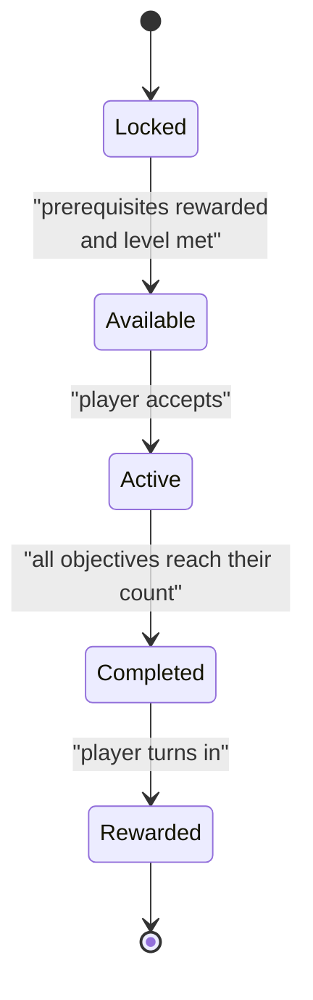
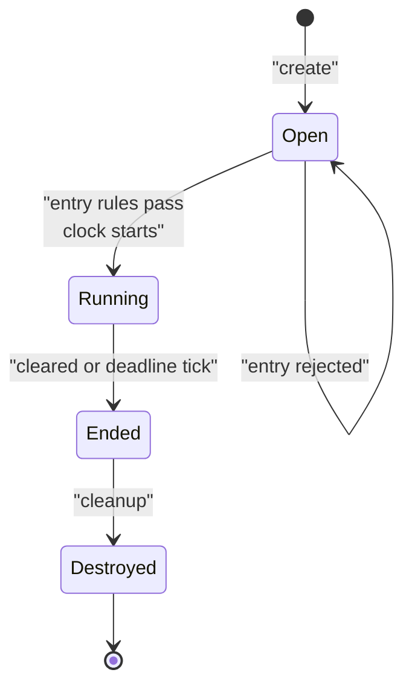
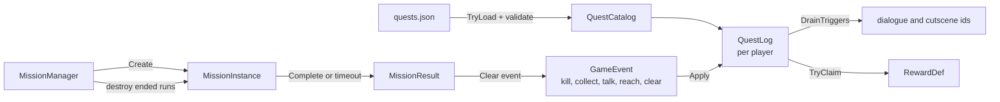

# Module 15: Quests, missions and instances

- **Goal:** understand how an online RPG stores quests, tracks progress from game events, gates a story chain, and runs instanced missions with entry rules, timers and scoring, then build a small version of each.
- **Prerequisites:** [03 - The game loop and time](03-game-loop.md) (mission timers count ticks), [05 - Data-driven design and property systems](05-data-properties.md), [06 - Scripting: the engine/script boundary](06-scripting.md)
- **Example:** `examples/15-quests/` (`dotnet test examples/15-quests`)
- **Facts checked:** October 2026 (prices, licences and product status change; re-check before reuse)

## In short

A **quest** is a small state machine per player (locked, available, active, completed, rewarded) driven by **game events** such as "a wolf died". A **mission** is a different animal: a private, timed copy of a map (an **instance**) that a party enters, plays and leaves, and that the server must create and destroy cleanly. Quests can be authored as scripts, as validated data, or as a mix. Data is easier to check; scripts are faster to write and easier to turn into a tangle. The example keeps definitions in validated data, feeds objectives from events, and gives missions an explicit lifecycle whose timer ends on an exact tick.

## 1. The concept

### 1.1 Quest data, state and events are three separate things

| Piece | What it holds | Changes at runtime? |
|---|---|---|
| **Definition** | Id, title, prerequisites, level gate, objectives, reward, dialogue and cutscene ids | No. Authored by designers, loaded once. |
| **State** | Per player: one state per quest and one counter per objective | Yes. This is what gets saved. |
| **Events** | Facts the simulation publishes: killed, picked up, talked, arrived, cleared | Transient. |

Keeping them apart is the whole trick. Combat code never knows quests exist; it publishes "wolf died". The quest system listens.

### 1.2 The quest state machine



Two details matter. Transitions only move forward, so a bug cannot silently re-open a finished quest. And follow-up quests unlock on **Rewarded**, not **Completed**, so the player cannot skip the turn-in scene that often carries the story.

### 1.3 Objectives and event-driven tracking

An objective is a kind (kill, collect, talk, reach, clear a mission), a target and a count. When an event arrives, the tracker looks at every active quest and advances only the objectives whose kind **and** target match. The quest completes when every objective has reached its count.

Why events rather than polling? Polling ("does the player have 3 pelts?") needs the quest system to read inventory, combat and position code. Events invert the dependency and make the quest system testable with nothing but a list of events. The one caveat is *state-like* objectives (carry 5 pelts): either also listen for "item removed" or check the inventory at turn-in.

### 1.4 Chains, gating and story triggers

A **chain** is just prerequisites: quest B lists quest A. The same mechanism gates a **recruitable character** (the last quest's reward names the character), a **dungeon** (entry requires a quest stage), and **cutscenes** (a quest names a dialogue or cutscene id that the presentation layer plays when the quest is accepted or completed). The quest system emits ids; it does not play anything.

Chains form a graph, so two data bugs are possible: a prerequisite that does not exist, and a cycle where nothing can ever unlock. Both are cheap to detect at load time and expensive to discover in a live game.

### 1.5 Missions (instances)

A **mission** or **instance** is a private run of a map for one party. It has a lifecycle with real costs: allocate it, check who may enter, start a clock, collect a result, then destroy it so memory and spawned monsters do not leak.



Typical **entry rules**: minimum and maximum party size, minimum level, a daily-attempt counter or a currency cost, and sometimes a required quest stage. A **timer** gives a hard cap per run. **Scoring** turns the run into a number and a grade, used for ranking and reward tiers. Story missions usually skip scoring and are one-off; repeatable missions score, cost something to enter, and reset daily.

## 2. The design space

### 2.1 How quests are authored

| Approach | How it works | Strengths | Weaknesses |
|---|---|---|---|
| **Pure data** (JSON or tables) | Fixed objective kinds, rewards and prerequisites | Validatable, tool-friendly, easy to save | Unusual logic needs new engine code |
| **Scripts per quest or NPC** | A script holds dialogue, checks and rewards | Very flexible, fast for designers | Hard to validate; gates and side effects hide in code |
| **Visual graphs** | Nodes for conditions and actions (Unreal, Unity and Godot all have graph or plugin options) | Designers see the flow | Large graphs get unreadable; needs a runtime |
| **Hybrid** | Data for structure, small hooks for odd cases | Best of both | Needs discipline about what goes where |

### 2.2 Quest structure across game types

| Type | Typical shape | Example features |
|---|---|---|
| Single-character action RPG | Few, hand-crafted quests, strong cutscenes, often linear | One main story line plus side quests |
| Open-world RPG | Many quests with parallel tracks and tagged regions | Quest log, map markers |
| MMORPG | Chains, dailies, repeatables, level gates | Reset timers, shared world state |
| Party-based RPG | Quests may care about **who is in the party** (a required companion, a character-specific recruit line) | Quest checks the roster, rewards unlock a new party member |

For a party-based game, decide whether quest progress belongs to the **account**, to a **character**, or both. Account-level progress is simple to explain; character-level progress needs a rule for what happens when a quest-giving companion is not in the active party.

### 2.3 How missions are entered

| Model | Description | Fits |
|---|---|---|
| **Walk-in dungeon** | Enter from a door in the world; a private copy spawns | Classic MMORPG dungeons |
| **Lobby or queue** | Pick a mission in a menu, queue, get placed (see [16 - Matchmaking](16-matchmaking.md)) | Raids, arenas, repeatables |
| **Story trigger** | A cutscene or dialogue sends the party in | Story missions |

### 2.4 How to choose

| If you need... | Choose |
|---|---|
| A small team, a validated pipeline, a saveable state | Data-first quests with a validator |
| A narrative-heavy game with unique set pieces | Hybrid: data structure plus scripted beats |
| A fast prototype with a few designers | Scripts, but keep gates in data from day one |
| Repeatable content with ranks | Mission rows with tiers, entry costs and score thresholds |

## 3. Trade-offs and pitfalls

- **Hard to validate.** When definition and logic are tangled in scripts, nothing checks that stage 13 can be reached from stage 12, that a mission's reward target exists, or that two chains do not wait on each other. Broken chains are found by stuck players.
- **Opaque prerequisites.** Gates hidden in code cannot be shown in the interface. Players reverse-engineer the order from forums, and a "daily checklist" feature needs every gate re-implemented.
- **Central dispatch tables.** "Which mission advances which quest" as one huge if/else keyed by a string means every new mission edits the same file, and a typo fails silently.
- **Content proliferation.** One row and one script per difficulty tier multiplies the maintenance surface; a balance change touches every tier. Prefer tiers as rows of the same shape.
- **Instance lifecycle costs.** Each run is a real zone with spawned monsters and timers. Leaks, half-finished teardown and "stuck inside a dead instance" are classic failure modes, and re-entry rules (resurrection, continuable runs) add states.
- **Hidden side effects.** If the step that grants a character or unlocks a dungeon is not visible in the quest definition, nobody reading it can tell what finishing the chain does.
- **Double turn-in.** Rewards must be idempotent (see [14 - Items, economy and rewards](14-items-economy.md)); a retry of "turn in" must pay once.

## 4. Build or buy

| Need | Unreal | Unity | Godot | Open component |
|---|---|---|---|---|
| Quest system | None built in. Marketplace/Fab plugins exist (quality varies) | None built in. Asset Store packages exist | None built in | Few good ones; write your own |
| Dialogue | Not built in; plugins | Not built in | Not built in | **Yarn Spinner** (Unity, Godot and C# runtimes), **Ink** (runtime in C#, JS and others) |
| Instance / session | Dedicated server and level streaming, but no party or lifecycle rules | Netcode and relay products, no game rules | Multiplayer API only | Write your own |

As of October 2026 none of the three engines ships a quest system, and engine plugins are almost always single-player and save to local files. They do not fit a server-authoritative game where state lives in a database. Instance management in engines is about processes and scenes, not about "party of up to four, 100-tick timer, score and grade".

**Could we build it today?** Yes, and it is one of the easier modules.

| Piece | Effort | Risk |
|---|---|---|
| Definitions as JSON with a validator (unknown ids, cycles, empty objectives) | Low | Low. Often the biggest win. |
| State machine and event tracker | Low | Low. Small, easily unit-tested. |
| Persistence of state (per-quest state and counters) | Low to medium | Medium. Needs idempotent turn-in (see [20 - Persistence](20-persistence.md)). |
| Instance lifecycle, party gate, timer, score | Medium | Medium. Leaks and double-entry races only show under load. |
| Authoring tools and a quest graph viewer | Medium | Low. Optional but pays back quickly. |
| Dialogue/cutscene authoring | Use **Yarn Spinner** or **Ink** for branching dialogue; quests only store dialogue ids | Low |

AI-assisted development helps most with the validator, the tracker and exhaustive tests. It helps least with design: deciding what a good chain feels like is still a human job.

**What a PoC must prove:** (1) a 500-quest chain loads and validates in milliseconds and reports every broken link; (2) a thousand simulated players fed a realistic event stream stay inside the tick budget; (3) an instance created and destroyed ten thousand times leaves no live objects; (4) a server restart mid-quest restores exact counters.

**Verdict: build**, with data-first definitions. **Use an open component** (Yarn Spinner or Ink) only for dialogue, and keep the quest system itself small and ours.

## 5. The example

### Design



The quest side and the mission side meet only through events: a cleared mission publishes a `Clear` event and the quest log does the rest.

### Walkthrough

- **`QuestDef.cs`, `ObjectiveDef.cs`, `RewardDef.cs`** are immutable records, the data a designer writes. A reward can name a character to unlock; the quest system never grants it itself.
- **`QuestCatalog.cs`** parses JSON and validates. `TryLoad` returns every problem at once: duplicate ids, empty objectives, unknown prerequisites, and cycles (a depth-first search with three colours).
- **`QuestLog.cs`** is the per-player state. Key lines:

```csharp
var open = Level >= q.MinLevel
    && (q.Prerequisites ?? []).All(p => _state[p] == QuestState.Rewarded);
if (open) _state[q.Id] = QuestState.Available;
```

```csharp
if (o.Kind == e.Kind && o.Target == e.Target)
    counters[i] = Math.Min(o.Count, counters[i] + e.Amount);
```

  `TryClaim` pays once and then calls `Refresh`, which unlocks follow-ups. `DrainTriggers` returns dialogue and cutscene ids for the presentation layer.
- **`MissionDef.cs`** holds the rules (party limits, level, time limit in ticks, points, grade thresholds). Tiers are rows of the same shape.
- **`MissionInstance.cs`** has the lifecycle. Entry checks run before any state change, and success starts the clock:

```csharp
if (party.Count > Def.MaxPlayers) return EnterResult.PartyTooLarge;
...
DeadlineTick = nowTick + Def.TimeLimitTicks;
```

  `Tick` ends the run when `nowTick >= DeadlineTick`. `Complete` scores kills plus one bonus point per 10 ticks left.
- **`MissionManager.cs`** is the only owner. Every tick it advances instances, collects results, destroys ended runs and removes them, so a finished run cannot leak.
- **`SampleQuests.cs`** is a two-quest chain in JSON: wolves, then a cave quest that needs level 2 and unlocks a character.

**Configuring it for a different game.** The party limit is a field of `MissionDef` (the sample uses 4). A single-character game sets it to 1 and can drop the `PartyMember` list to one entry. A party game with required companions would add a "required member" check to `TryEnter`; the quest log would stay unchanged.

### Tests and their concrete numbers

`dotnet test examples/15-quests` runs 21 tests, all passing.

- **Prerequisite gate.** `Claim_PrerequisiteCompletedButNotRewarded_FollowUpStaysLocked`: after finishing the wolf quest the cave quest is still Locked; after `TryClaim` it is Available. A level-1 player stays Locked until `SetLevel(2)`.
- **Right objective only.** Boar kills (5) and a Collect event for wolves (5) leave the kill counter at 0; a Kill event for 2 wolves moves it to 2 and the talk objective stays 0. Ten wolf kills cap at 3.
- **Completion.** Three wolves alone leave the quest Active; adding the talk event completes it and triggers `dialogue:elder.intro` then `cutscene:gate.relief`, and a second drain is empty.
- **Single payout.** The second `TryClaim` returns null; the first returns 200 exp.
- **Data validation.** An unknown prerequisite reports `quest 'a' requires unknown quest 'ghost'`; a two-quest cycle is rejected.
- **Party limit.** With a limit of 4, a party of 5 gets `PartyTooLarge`, the instance stays Open with no members, and a party of 4 can still enter.
- **Exact timer.** Entering at tick 10 with a 100-tick limit gives deadline 110. `Tick(109)` returns nothing; `Tick(110)` returns `TimedOut`.
- **Cleanup.** After the timeout `LiveCount` is 0, the state is Destroyed, members are empty and a new entry returns `NotOpen`.
- **Score.** Four kills at 100 points plus a clear at tick 50 of 100 gives 4 x 100 + 50 / 10 = 405, grade A (A starts at 300, S at 500).

### What it leaves out

Persistence, daily reset counters and costs, the dialogue and cutscene players themselves, spawning monsters inside an instance, multi-party matchmaking, re-entry after disconnect, and state-like Collect objectives that read the inventory. Each is a small extension of the same shapes.

## Key takeaways

- Split **definition, state and events**. Definitions are validated data; state is the only thing saved; events decouple quests from combat.
- A quest is a **forward-only state machine**; unlock follow-ups on **Rewarded**, not Completed.
- **Validate chains at load time**: unknown links and cycles are cheap to find in data and costly to find in a live game.
- Scripts are fast to author but hard to validate; hidden gates, central dispatch tables and one script per difficulty tier are the usual costs.
- A mission is an **instance with a lifecycle**: entry rules first, clock from entry, exact-tick expiry, and one owner that always destroys it.
- Engines give no quest system; **build** it, and use **Yarn Spinner or Ink** only for dialogue.
- The example proves the pieces with 21 deterministic tests; quests and missions meet only through events.

## Further reading

- [Yarn Spinner documentation](https://docs.yarnspinner.dev/)
- [Ink, inkle's narrative scripting language](https://github.com/inkle/ink)
- [Game Programming Patterns: Observer and State](https://gameprogrammingpatterns.com/)
- [Robert Nystrom, Event Queue](https://gameprogrammingpatterns.com/event-queue.html)
