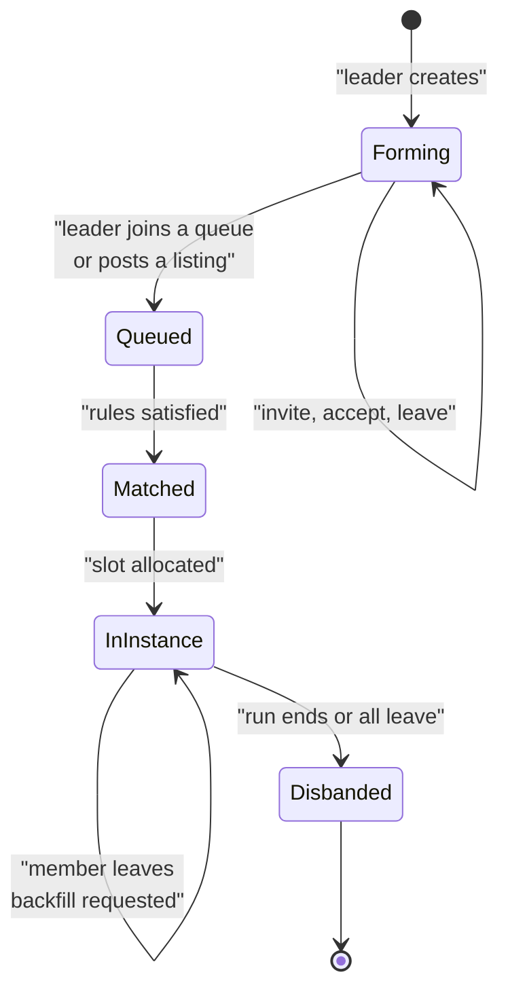
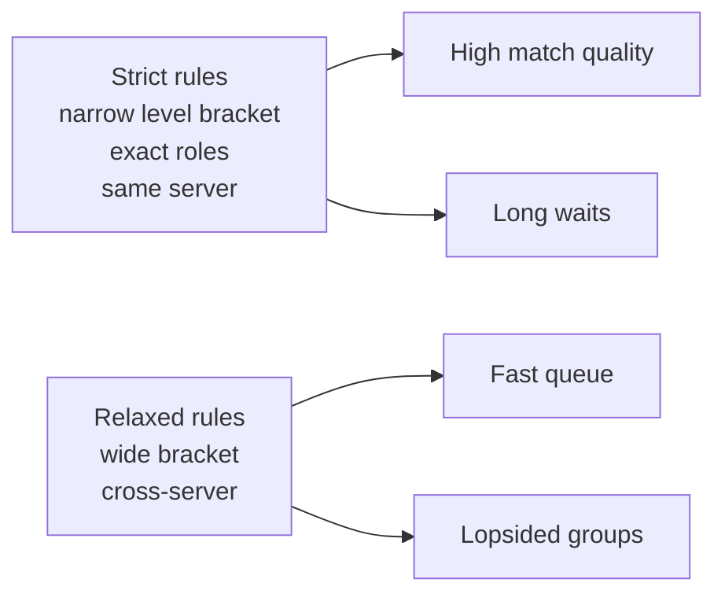
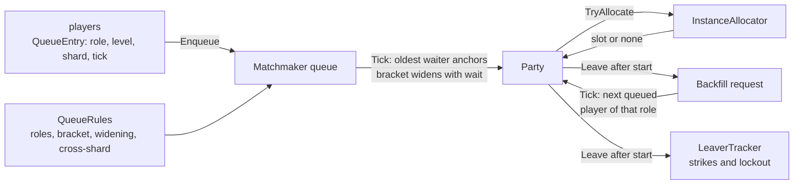

# Module 16: Party finder, matchmaking and instance queues

- **Goal:** understand how an online RPG groups players into parties and runs instances for them (listings, automatic queues, brackets, backfill, hand-off, abuse control), and build a small role-based queue.
- **Prerequisites:** [13 - Party and companion control](13-party-control.md), [15 - Quests, missions and instances](15-quests-missions.md), [03 - The game loop and time](03-game-loop.md)
- **Example:** `examples/16-matchmaking/` (`dotnet test examples/16-matchmaking`)
- **Facts checked:** October 2026 (prices, licences and product status change; re-check before reuse)

## In short

Players want to do group content without spending an hour shouting in chat. A **party finder** lets people post and browse groups; an **automatic queue** builds the group for them. Queues trade **wait time against match quality**: a strict rule set gives good groups slowly, so good queues start strict and relax with waiting. A queue is a **separate service** that decides who plays together, then hands the group to an instance allocator and forgets it, except for **backfill** when someone leaves. The example is a role-based queue (tank, healer, damage) configured by data. It widens a level bracket as the wait grows, allocates an instance slot, punishes leavers and refills the empty seat.

## 1. The concept

### 1.1 Three words that are easy to mix up

| Term | Meaning |
|---|---|
| **Party** (group) | A small set of players acting together, with a leader. It exists in the open world too. |
| **Match** | The result of a queue: a set of players the system chose, to be placed in one instance. |
| **Instance** | A private copy of a map or dungeon for that group (module 15). |

A party can exist without a match (friends walking together). A match can contain several parties, or strangers who only become a party when the match forms.

### 1.2 The party lifecycle



Decisions every game has to make:

- **Leader:** who may invite, kick and start a queue? When the leader leaves, the oldest member usually inherits.
- **Size and composition:** a flat cap (4 or 5), or required roles.
- **Loot rules:** free-for-all, round robin, need-before-greed, master looter, or personal loot (everyone gets their own). Personal loot ends most arguments and many designs now default to it.
- **Persistence:** does the party survive logout, a zone change, or the end of an instance?

### 1.3 Roles

Many group games use the **trinity**: a **tank** (absorbs attacks and holds enemy attention), a **healer** and **damage dealers**. A queue then asks for counts per role, for example 1 / 1 / 2. Roles are an input chosen by the player, not something the server can always infer. Games without roles (action RPGs, extraction games) queue by count alone.

### 1.4 The queue's core trade-off



No setting is right for every hour of the day. A weekday evening has many players in every role; four in the morning does not. The standard answer is **time-based relaxation**: start strict, then widen the allowed level gap, loosen the server restriction and finally accept smaller groups as a player's wait grows.

## 2. The design space

### 2.1 Open listings vs automatic queues

| Approach | How it works | Strengths | Weaknesses |
|---|---|---|---|
| **Open party listing** | Players post "Dungeon X, need healer" and others apply | Social, flexible, lets players pick companions | Slow; gatekeeping; needs chat or a UI to browse |
| **Automatic queue** | Pick a role and content; the system forms the group | Fast, fair to newcomers | Strangers, little communication, griefing is easier |
| **Hybrid** | A queue for the base group, a listing for extras, or a queue that fills a partial party | Keeps parties together | Two systems to build |
| **Pre-made only** | The server only provides the instance | Trivial to build | Locks out players without friends |

Games with a strong social layer tend to keep listings; games that want short sessions tend to use queues. Many have both, which is why queue code must accept **a party as one unit** and not only single players.

### 2.2 What the queue matches on

| Dimension | Common choice | Note |
|---|---|---|
| Roles | Counts per role | Shortage of tanks and healers is the usual cause of long damage-dealer waits; many games give a bonus for filling a scarce role |
| Level | A **bracket** (a window around the anchor's level) | Wide brackets in endgame, narrow in levelling zones |
| Gear or rating | Item level, rank or a skill rating | Skill-based rating (Elo, Glicko, TrueSkill) matters in competitive modes; PvE queues usually use gear thresholds |
| Language / region | Often a soft preference | Mixed into the relaxation steps |
| Latency | Prefer a region with a good ping | A hard cap for action combat (module 09) |
| Server (shard) | Same shard first, then cross-server | See 2.3 |

### 2.3 Cross-server queues

Many online RPGs run **shards** (several copies of the world, module 19). Small shards leave queues empty, so queues are often **cross-server**: the match service sees all shards, and the instance is placed on a neutral host. Two consequences: the instance must not depend on one shard's world state, and rewards must flow back to the player's home shard through the persistence layer (module 20).

### 2.4 Backfill

**Backfill** means refilling an empty seat in a run already in progress. It is cheap for the system (the instance exists) and valuable for players (a leaver does not kill the run). Rules to decide: a time window after the start (so nobody joins a boss fight already lost), whether the newcomer gets a share of the rewards, and the same level or gear check as the original match.

### 2.5 Abuse

| Problem | Typical countermeasure |
|---|---|
| **Leavers** | A queue lockout that grows with repeat leaves (the example does this), reward loss, a "vote to abandon" only after a timer |
| **Griefing** (intentional failing, AFK) | Vote kick, idle detection, reports with review; avoid auto-punishing from a single report |
| **Queue dodging** (declining after a match) | Ready check with a timeout; decliners lose their place |
| **Role cheating** (queue as tank, do not tank) | Role-specific checks at the start; kick votes; a visible role in the roster |
| **Boosting and smurfing** | Rating logic and account-level rules (module 21) |

Punishments need a **cool-off** and an appeal path: a server crash or a disconnect should not be treated as a leave.

### 2.6 How to choose

| If you have... | Choose |
|---|---|
| A small player base | Listings plus a cross-server queue that relaxes fast |
| Strict role needs (trinity) | Role-count queue with a bonus for scarce roles |
| Competitive modes | Skill rating and a separate, stricter queue |
| Short-session mobile play | Automatic queue, personal loot, aggressive backfill |
| Few instance hosts | A queue that holds matched parties until a slot is free |

## 3. Trade-offs and pitfalls

- **Starvation.** If the queue always serves the best matches first, an unusual player (rare level, off-peak role) waits forever. Anchor on the **oldest waiter** and relax the rules for them.
- **Over-relaxed matching.** A cap on relaxation matters: a level 10 and level 60 in one party is an unfun run for both. Cap the bracket.
- **Non-determinism.** If a tie between two equally old players is broken by hash order, bugs cannot be reproduced. Sort by a stable key.
- **Hand-off races.** Two services both think they own the match: the queue forgets the party while the allocator has no slot yet. Keep a holding state (the example's "awaiting instance") and retry.
- **Zombie reservations.** A player in a queue who logs out or joins another queue still holds a place. Every queue entry needs a heartbeat or a disconnect hook.
- **Leaver punishment errors.** Punishing disconnects as leaves drives players away. Distinguish a clean leave from a lost connection with a reconnect window.
- **Scarce-role economics.** Players avoid tanking and healing. Incentives (bonus loot, priority queue) often work better than rules.
- **Cross-server assumptions.** Code that reads world state of "the player's server" fails in a neutral instance.

## 4. Build or buy

| Need | Unreal | Unity | Godot | Service or component (as of October 2026) |
|---|---|---|---|---|
| Matchmaking | Nothing built in. Online Subsystem plugins talk to platform services | None in the engine. Unity Gaming Services has a Matchmaker | Nothing built in | **Amazon GameLift FlexMatch** (JSON rule sets, backfill), **PlayFab Matchmaking** (queues with rule sets), **Nakama** (open-source server with a matchmaker, self-hosted or hosted), **Open Match** (open-source framework from Google for Games, a Kubernetes-based, bring-your-own-logic design) |
| Instance hosting | Dedicated server builds; no fleet management | Unity ended support for its Multiplay Hosting on 31 March 2026 and licensed it to Rocket Science, so check the current hosting options | Headless export; no fleet management | **Agones** (open source, Kubernetes), GameLift, other hosts |
| Party and friends | Platform session APIs | Lobby services | None | Your own database-backed service |

Status notes: the Open Match repository is maintained under Google for Games, but its last tagged release (1.8.1) dates from December 2023, so judge its activity before adopting it. Services priced per match hour or per player-hour change often; re-read the current pricing page.

**Could we build it today?** Yes, and for a role-and-bracket queue it is a modest job.

| Piece | Effort | Risk |
|---|---|---|
| Rule data and a pure matching function | Low | Low. Deterministic and testable. |
| Party service (invite, leader, loot rules) | Medium | Medium. Many edge cases when players log out. |
| Queue plus relaxation | Low to medium | Low. Tuning is the hard part and needs live data. |
| Instance allocator and hand-off | Medium | Medium. Races and leaks show up under load. |
| Backfill and leaver penalties | Low | Low to medium. Player-experience tuning. |
| Skill rating | Medium | Medium. Only needed for competitive modes. |

AI-assisted development helps with the matching function, the simulations of thousands of fake players and the test matrix. It cannot replace tuning against real player behaviour.

**What a PoC must prove:** (1) a simulated population with a realistic role mix (many damage, few tanks) matches within a target time at peak and off-peak; (2) no player waits forever; (3) a thousand matches formed per second do not leak slots; (4) a service restart mid-queue loses nobody.

**Verdict: build** the queue and party service (they hold your game rules), **buy or self-host** the instance fleet (Agones or a managed host). A hosted matchmaker is reasonable for competitive skill-based play, where the algorithm is the product.

## 5. The example

### Design



### Walkthrough

- **`QueueRules.cs`** is the whole configuration: required tanks, healers and damage dealers, the base bracket, how often and by how much it widens, a cap, the wait after which other shards are allowed, and the lockout per strike. The party size is derived.
- **`QueueEntry.cs`** is one waiting player. The wait is `now - EnqueuedTick`, so there is no timer per player.
- **`Matchmaker.cs`** runs one pass per tick:
  1. Parties waiting for a slot retry the allocator.
  2. Open backfills take the oldest compatible queued player.
  3. New parties are formed with the **oldest waiter as anchor**.
- Forming uses the anchor's wait to compute the bracket and keeps the anchor in the party:

```csharp
var bracket = _rules.BracketAt(wait);
var pool = _queue.Where(q => Math.Abs(q.Level - anchor.Level) <= bracket
                             && (q == anchor || ShardOk(anchor, q, wait)))
                 .OrderBy(q => q.EnqueuedTick).ThenBy(q => q.PlayerId).ToList();
```

  The `ThenBy(PlayerId)` is the stable tie-break that keeps runs reproducible.
- **`InstanceAllocator.cs`** is a fixed pool of slots standing in for a fleet manager. If none is free the party stays "awaiting instance" and retries each tick.
- **`LeaverTracker.cs`** adds a strike for each leave from a started run and locks the player out for `strikes x cooldown` ticks.
- **`Matchmaker.Leave`** differs by phase. Before the instance is allocated, the others return to the queue with their original wait and the leaver gets no strike. After the start, the leaver gets a strike and a backfill request for that role is opened.

**Configuring it for a different game.** A battle-royale squad queue sets 0 / 0 / 4 (no roles) and a bracket by rating instead of level. A raid sets 2 / 4 / 14. A competitive mode sets `CrossShardAfterTicks` to 0 and uses a tiny `MaxBracket`.

### Tests and their concrete numbers

`dotnet test examples/16-matchmaking` runs 15 tests, all passing. Rules: 1 tank, 1 healer, 2 damage; bracket 2, +2 every 100 ticks, cap 10; cross-shard after 300 ticks; 600 ticks of lockout per strike.

- **Composition.** One tank, one healer and two damage dealers at tick 0 form one party of 4 on `inst-1`. Four damage dealers and a tank never form, even at tick 5000.
- **Bracket widening.** A level gap of 5 does not match at tick 0, 99 (bracket 2) or 100 (bracket 4), and matches at tick 200 (bracket 6). The bracket is 10 at wait 400 and stays 10 at wait 100000.
- **Fairness.** Of two tanks, the one enqueued at tick 5 gets the party, the one at tick 20 stays queued.
- **Cross-shard.** A damage dealer on another shard is rejected at tick 299 and accepted at tick 300.
- **Hand-off.** With one slot and two formed parties, the second has no instance until the first calls `Finish`; on the next tick it receives `inst-1`.
- **Lockout.** After leaving at tick 50 the player cannot queue at tick 649 and can at tick 650. A second strike at tick 1000 locks until 2200 (1000 + 2 x 600).
- **Backfill.** After a damage dealer leaves at tick 50, a level 11 damage dealer enqueued at tick 60 refills the party to 4 without forming a new party. A candidate 10 levels away is refused at tick 449 (wait 399, bracket 8) and accepted at tick 450 (bracket 10). A damage dealer cannot fill a healer seat.
- **Cleanup.** If every member leaves a started run, the slot returns to the pool and four strikes are recorded.

### What it leaves out

Premade parties queued as a unit, ready checks, a rating system, latency and region, persistence of the queue across a restart, multiple queues, a vote kick, reconnect windows (a lost connection treated as a leave), and any real network transport. Each extends the same shapes: more fields on the entry, more rules in the data, and more states in the party.

## Key takeaways

- A **party** is a social unit, a **match** is the queue's decision, an **instance** is the place; keep the three apart.
- Queues trade **wait time against match quality**; start strict and relax with waiting, with a hard cap.
- Anchor each match on the **oldest waiter** and use stable tie-breaks, so nobody starves and tests are reproducible.
- Roles shape queue times: scarce roles need incentives, not only rules.
- **Backfill** saves runs; **leaver penalties** that grow with repeats keep the system healthy, as long as disconnects are not punished like leaves.
- The matchmaker is a **separate service** that hands a match to an instance allocator and holds it until a slot exists.
- Engines give almost nothing here. **Build** the rules, **buy or self-host** the instance fleet (Agones, GameLift or similar).

## Further reading

- [Amazon GameLift FlexMatch documentation](https://docs.aws.amazon.com/gamelift/latest/flexmatchguide/gamelift-match.html)
- [PlayFab Matchmaking documentation](https://learn.microsoft.com/en-us/gaming/playfab/multiplayer/matchmaking/)
- [Nakama matchmaker documentation](https://heroiclabs.com/docs/nakama/concepts/multiplayer/matchmaker/)
- [Open Match](https://github.com/googleforgames/open-match)
- [Agones, game server hosting on Kubernetes](https://agones.dev/)
- [Unity Matchmaker documentation](https://docs.unity.com/ugs/en-us/manual/matchmaker/manual/matchmaker-landing)
- [Glicko rating system, Mark Glickman](http://www.glicko.net/glicko.html)
