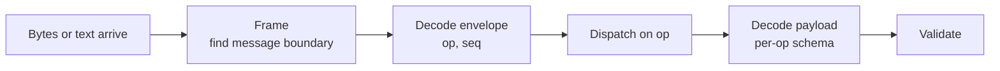
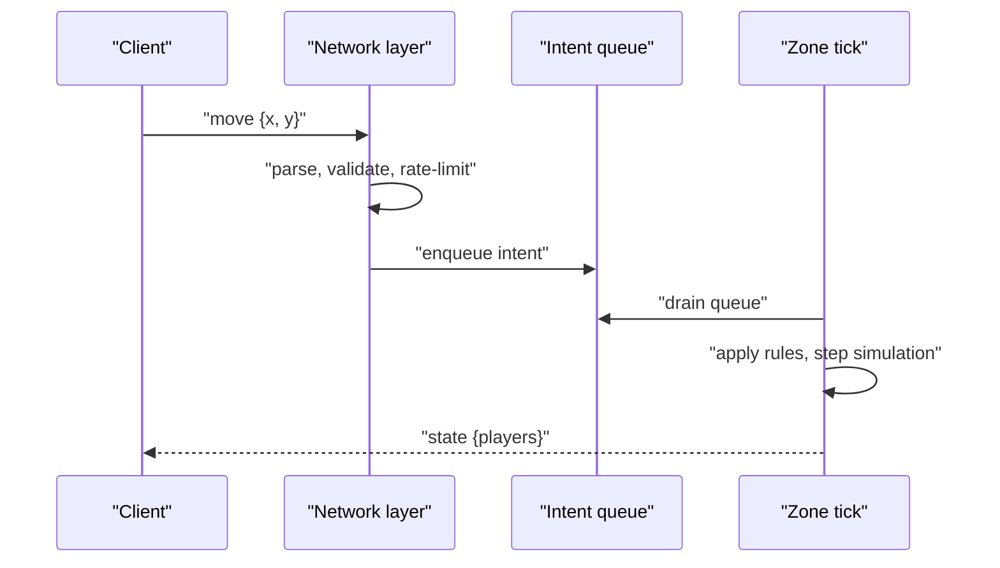
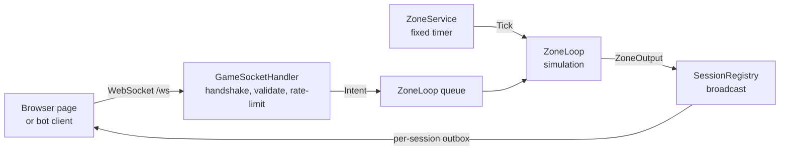

# Module 17: Networking: protocol and client-server interaction

- **Goal:** understand how an online game's client and server talk (transport, framing, opcodes, handshake, authority, rate limiting), choose a transport and an encoding for your kind of game, decide build vs buy, and run a small client-server demo you can open in a browser.
- **Prerequisites:** [03: The game loop and time](03-game-loop.md) (requests are queued into the tick), [00: Game development fundamentals](00-fundamentals.md).
- **Example:** `examples/17-net/` (`dotnet test examples/17-net`, and `dotnet run` to play with it)
- **Facts checked:** October 2026 (prices, licences and product status change; re-check before reuse)

## In short

An online game is a conversation: the client sends **intents** ("I want to move there"), and the server answers with **results** ("you are now here"). Everything else in this module is about making that conversation reliable, cheap, safe and able to grow for years. The main choices are the **transport** (TCP, UDP or WebSocket), the **encoding** (text or binary, with or without a schema) and how much **reliability** each message needs. A small team's best default is a plain WebSocket, a small JSON envelope `{op, seq, payload}`, a hello/welcome handshake, validation and a token-bucket rate limiter at the edge, and a fixed-tick zone that is the only thing allowed to change state. The example is exactly that, with 24 tests and a one-page browser client.

## 1. The concept

### 1.1 Transports

A **transport** carries bytes between two machines. Games use three.

| Transport | What it gives you | Typical use |
|---|---|---|
| **TCP** | A reliable, ordered **byte stream**. No message boundaries. | MMO command channels, login, chat |
| **UDP** | Unreliable, unordered **datagrams** (each one is a message). | Fast action games, voice, position streams |
| **WebSocket** | Reliable, ordered **messages** over TCP, started from an HTTP request. Works in browsers. | Browser games, web tools, easy-to-deploy servers |

TCP's reliability has a price: one lost packet delays everything behind it (**head-of-line blocking**). Action games accept loss and use UDP, rebuilding only the reliability they need. A turn-based or click-to-move RPG, where a 100 ms delay is invisible, is comfortable on TCP. WebSocket is TCP with message boundaries and browser support, so it is the pragmatic default for anything that must also run in a browser.

### 1.2 Framing

TCP is a stream, so the receiver must find where one message ends. The common answer is a **length prefix**: every message starts with a small header saying how long it is. The receiver buffers bytes until it has a whole message, then hands it on. WebSocket already does this for you.

### 1.3 Opcodes and message schemas

Every message needs a name the receiver can dispatch on. In a binary protocol this is a number, the **opcode**. In a text protocol it is a string. Each opcode has a **schema**: the fields and their types.



A good envelope also carries a **sequence number** (`seq`) so a client can match a reply or an error to the request that caused it.

### 1.4 Text versus binary

| | Text (JSON) | Binary |
|---|---|---|
| Size | Larger (field names repeated) | Compact (often 3 to 10 times smaller) |
| Debugging | Read it in a browser console | Needs tools |
| Schema evolution | Easy: add a field, old readers ignore it | Needs discipline: field order, versions, tag numbers |
| Parse cost | Higher | Low |

Start with text while the protocol changes daily. Move hot messages (movement, state updates) to binary when bandwidth or CPU measurably hurts. Schema-based binary formats (Protocol Buffers, MessagePack with a schema, FlatBuffers) give you binary size and an evolvable schema.

### 1.5 Versioning, handshake and session

Clients and servers are never updated at the same instant, so the first exchange must settle compatibility. In a **handshake** the client says hello with its protocol version, and the server either replies **welcome** with a **session id** or refuses and closes. The session id names this connection for the rest of its life (logs, reconnect, support). Evolve a protocol by adding optional fields and new opcodes; bump the version only for breaking changes.

### 1.6 Server authority: intents in, results out

The client is untrusted: players run modified clients. So the client never says "my position is X"; it says "I want to go to X". The server checks the request, simulates, and publishes the outcome. This is **server authority**.



Two consequences. First, **network threads never touch game state**: they only validate and enqueue, and the single-threaded tick (module 03) applies requests in a fixed order, which also makes replays and tests possible. Second, **every limit is enforced at the edge**: maximum message size, parse failures, field ranges, and how many messages per second a connection may send. A **token bucket** (a burst allowance that refills at a steady rate) is the standard rate limiter.

### 1.7 Back-pressure

Each connection has an outgoing queue. If a client cannot keep up (slow network, frozen tab), that queue grows. Bound it and disconnect the client when it overflows. Unbounded queues turn one slow client into a server out-of-memory event.

## 2. The design space

### 2.1 Transport and reliability by game type

| Game type | Typical choice | Why |
|---|---|---|
| Click-to-move or tab-target MMO RPG | TCP or WebSocket, one reliable channel | Latency of 100 to 200 ms is tolerable; every message must arrive; simple |
| Browser game | WebSocket (or WebTransport where supported) | The only reliable duplex channel a browser page can open freely |
| Action RPG or shooter with direct control | UDP with a thin reliability layer, or a reliable and an unreliable channel side by side | A late position is worthless; a lost position is replaced by the next one; head-of-line blocking hurts feel |
| Turn-based or card game | HTTPS requests or WebSocket | Few messages, no timing pressure |
| Mobile game on flaky networks | Reliable channel plus reconnect and resume | Connections drop when the phone changes network |

**Channels.** A common hybrid gives each message a delivery class: *reliable ordered* (chat, inventory, quest updates), *unreliable sequenced* (positions: only the newest matters), and sometimes *reliable unordered*. Libraries such as ENet, LiteNetLib or Steam's networking layer provide these on top of UDP; QUIC and WebTransport offer multiple streams without head-of-line blocking between them (as of October 2026, browser support for WebTransport is still uneven, so check before relying on it).

### 2.2 Encoding

| Option | Fits when |
|---|---|
| JSON text | Prototypes, low-rate messages, tools, web clients |
| Hand-written binary | Hot messages with a fixed layout, after measurement |
| Schema-based binary (Protocol Buffers, FlatBuffers, MessagePack with a schema) | Long-lived protocols that must evolve and have generated client and server types |
| Raw struct copy | Avoid: ties both sides to one compiler layout and one build |

### 2.3 What the client sends: intents, inputs or commands

| Style | The client sends | Good for |
|---|---|---|
| **Destination intents** | "Walk to P", "use skill 3 on target T" | Click-to-move and tab-target RPGs; few messages, easy to validate |
| **Input stream** | Each frame's key state, with a sequence number | Direct-control action games; needed for prediction (module 18) |
| **Authoritative-client reports** | "I am at P" | Only for trusted or co-op settings; invites speed and teleport cheats |

Whichever you choose, the server validates and simulates. Input streams cost more bandwidth and tick-rate discipline, but they are what makes responsive action play possible.

### 2.4 Party games: one connection, many characters

If a player controls several characters (a party), keep **one connection per player** and address characters by id inside the messages. One socket per character multiplies handshakes, rate limits and failure cases for no benefit.

### 2.5 How to choose

| If your game is... | Transport | Encoding | Client sends |
|---|---|---|---|
| Browser, click-to-move RPG | WebSocket | JSON, then binary for hot paths | Intents |
| Desktop or mobile MMO, tab-target | TCP/WebSocket (or QUIC) | Schema-based binary | Intents |
| Action RPG, shooter, co-op | UDP-based with channels | Binary with generated schema | Input stream |
| Turn-based | WebSocket or HTTPS | JSON | Commands |

## 3. Trade-offs and pitfalls

- **Custom binary without a schema.** Compact and fast, but it ties client and server to the same build; any change risks silent corruption instead of a clean error. Add a schema layer before the message count grows.
- **Growth by accretion.** Hundreds of opcodes with no registry, tooling or generated documentation make "who sends this and who handles it" an archaeology job. Keep one machine-readable list.
- **Weak edge defence.** A hand-parsed stream that trusts lengths and fields is an attack surface. Cap message size, validate ranges, and rate-limit in one place, not in each handler.
- **Wall-clock timestamps in gameplay messages** make correctness depend on clock agreement and latency. Prefer server ticks as the time base, or sync a clock explicitly.
- **Obscurity as security.** A homemade cipher with a key in the client binary slows casual tampering but is not protection. Use TLS (`wss://`).
- **Unbounded queues.** One slow client must not be able to exhaust server memory.
- **Doing work on network threads.** Game state touched from I/O threads leads to locks and non-reproducible bugs.
- **No reconnect story.** Mobile and Wi-Fi drop constantly; decide early whether the session survives a drop.

## 4. Build or buy

### 4.1 What engines give you

| Engine | What it offers | Shape |
|---|---|---|
| **Unreal** | Property replication and RPCs (remote procedure calls) between client and server | Built for sessions of tens to a few hundred players with a dedicated server per match |
| **Unity** | Netcode for GameObjects and for Entities; community libraries such as Mirror; hosted services such as Photon | Session-oriented rooms; authority and replication helpers |
| **Godot** | High-level multiplayer API with RPCs and a replication node | Session-oriented, simple to start |

All of them are **session-oriented**: one match, one authoritative server process, objects replicated automatically. That is excellent for matches and co-op. An MMO-style server, with a persistent world, tens of thousands of accounts, a protocol you must extend for a decade and your own persistence, usually **owns its protocol**. Replication frameworks decide what is sent, when and to whom, and that is exactly the part an MMO needs to control (interest management is module 18).

### 4.2 Could we build it now?

Yes, and it is the cheapest "build" in this course. The platform gives us the hard parts: TLS, WebSockets, JSON, channels and rate-limiting primitives. A small team with AI-assisted development can produce the pieces in this module in days.

| Piece | Effort | Risk | What a PoC must prove |
|---|---|---|---|
| WebSocket host, envelope, handshake | Days | Low | Hello/welcome, error replies, clean close |
| Validation and rate limiting | Days | Low | A flooder is limited without affecting others |
| Binary encoding for hot messages | 1 to 2 weeks | Medium | Measured bandwidth win over JSON |
| Schema tooling and docs generation | 1 to 2 weeks | Medium | One source of truth for client and server types |
| Reliability layer over UDP | Weeks | High | Correct ordering, resend and congestion behaviour; prefer an existing library |
| Load behaviour (thousands of connections) | Ongoing | Medium | Memory per connection, queue limits, tick time under load |

SignalR is worth a sentence: it is a convenience layer over WebSocket (with fallbacks, hubs and automatic reconnect) and a reasonable choice for web-style apps. A game loop that needs control over framing, back-pressure and message cost is simpler to reason about with a raw socket, which is why this module uses one.

### 4.3 Verdict

**Build the protocol, use the platform's transport.** Own the message vocabulary, handshake, validation and limits; take TCP/WebSocket/TLS from the framework. If you need UDP, use an existing reliability library rather than writing one. Use an engine's networking only for session-based game modes, not for a persistent world.

## 5. The example

### 5.1 Design



The protocol is one JSON object per text message:

```json
{ "op": "move", "seq": 4, "payload": { "x": 60, "y": 50 } }
```

Client to server: `hello`, `ping`, `move`, `chat`. Server to client: `welcome`, `pong`, `state`, `error`, and `chat` broadcasts. Replies echo the request's `seq`; broadcasts use `seq` 0. Limits are configuration (`ServerOptions`): burst, refill rate, strikes before disconnect, outbox size, tick length. Different games change the ops and payloads, not the structure.

### 5.2 Project walkthrough

| File | Role |
|---|---|
| `Envelope.cs`, `Ops.cs`, `ErrorCodes.cs`, `*Payload.cs` | The protocol vocabulary and schemas |
| `MessageCodec.cs` | Parse and serialize; missing fields stay `null` so they can be rejected |
| `TokenBucket.cs` | Rate limiter with an injected clock |
| `Intent.cs`, `IntentKind.cs` | What the network layer hands to the zone |
| `ZoneLoop.cs` | The authoritative simulation: queue in, `Tick()` out |
| `ZoneService.cs` | A hosted service that calls `Tick()` every 50 ms and broadcasts the results |
| `GameSocketHandler.cs` | Handshake, read loop, validation, rate limit, dispatch |
| `ClientSession.cs`, `SessionRegistry.cs` | Per-connection outbox (bounded) and broadcast |
| `GameServer.cs`, `Program.cs` | Host wiring: `/ws` endpoint plus static files |
| `wwwroot/index.html` | Plain JavaScript client |
| `BotClient.cs`, `BotRunner.cs` | C# client used by the tests, and a runnable wandering bot |

### 5.3 Key lines

The zone is the only code that changes state. Network threads only enqueue:

```csharp
public bool Enqueue(Intent intent) => _queue.Writer.TryWrite(intent);   // any thread
public IReadOnlyList<ZoneOutput> Tick()                                  // zone thread only
{
    while (_queue.Reader.TryRead(out var intent)) { /* apply in arrival order */ }
    /* then step movement and build the outputs */
}
```

The edge validates and rate-limits before anything reaches the zone:

```csharp
if (!bucket.TryTake())           // burst 20, refill 10 per second
{
    if (++strikes >= options.MaxStrikes) { await CloseAsync(socket, PolicyViolation, "rate limit"); return; }
    if (strikes == 1) session.TrySend(MessageCodec.Error(0, ErrorCodes.RateLimited, "slow down"));
    continue;
}
Dispatch(session, read.Text);
```

Only the first violation gets a reply, so a flooder cannot make the server do extra work. Thirty violations close the connection. Outgoing messages go through a bounded outbox of 256, and a full outbox disconnects the slow client.

Movement is a request, not a position: `move` sets a target, and each tick the zone steps at most 2 units toward it (the world is 0 to 100 on both axes; targets outside are clamped, and the edge rejects values outside the range).

### 5.4 Tests

| Test | Concrete check |
|---|---|
| Handshake | hello gets welcome with `seq` 1, an 8-character session id and `tickMilliseconds` 50 |
| Wrong version | protocol 99 gets `version_mismatch` and the connection closes |
| Move | a client at (50, 50) sending `move {60, 50}` receives a non-full `state` with x = 52 on the next tick |
| Chat | a message from `ann` reaches `bob` with `from` = `ann` |
| Unknown op | `teleport` returns `unknown_op` with the same `seq` |
| Bad payload | `move {5000, 1}` returns `bad_payload` |
| Flooding | 60 pings in a burst produce `rate_limited` and then a close |
| Zone unit tests | spawn at (50, 50); a 1-unit move arrives in one tick then the zone goes quiet; chat is cut to 200 characters |
| Token bucket | burst 3, the 4th is denied; after 1000 ms at 1 per second one more is allowed; a long idle never exceeds 3 |

The server tests start the real host on port 0 (the OS picks a free port) and talk to it with `ClientWebSocket`, so they exercise the actual handshake and socket code, not mocks.

### 5.5 Run it

From the course folder, with the .NET 10 SDK installed:

```
dotnet test examples/17-net            # 24 tests
cd examples/17-net && dotnet run       # server on http://localhost:5080
```

Open `http://localhost:5080` in two browser tabs. Press **Connect**; you get a red dot for yourself and blue dots for others. Click the map to send a `move`; type in the box to send `chat`. The log shows every message in both directions, which is the best way to learn the protocol. In another terminal, `dotnet run bot ws://localhost:5080/ws` (from the same folder) adds a bot that wanders and chats.

### 5.6 What it leaves out

- **Binary encoding** and a schema generator (add when bandwidth is measured).
- **Encryption**: use `wss://` behind TLS in any real deployment.
- **Authentication**: hello carries only a name. A real handshake verifies a token issued by a login service (module 19).
- **Reconnect and resume** using the session id.
- **Client prediction and interpolation**, and **interest management** (module 18), and **multiple zones** (module 19).
- **Clock sync**: this example avoids wall-clock timestamps; results carry the server tick.

## Key takeaways

- Clients send **intents** (or numbered inputs); the server owns state and sends **results**. Never trust a client position.
- Network code **validates and enqueues**; one fixed-tick loop applies requests in order.
- A message needs a **frame**, an **op**, a **seq** and a **schema**; WebSocket gives framing for free.
- Pick the transport by game type: reliable streams for click-to-move and tab-target RPGs, UDP-based channels for fast action.
- Handshake first: protocol version, then a session id; evolve by adding optional fields.
- Enforce limits at the edge: size, parse errors, ranges, **rate limit**, bounded outboxes.
- Engine networking suits sessions; a persistent online world should **own its protocol** and take only the transport from the platform.

## Further reading
- RFC 6455, The WebSocket Protocol: https://datatracker.ietf.org/doc/html/rfc6455
- Microsoft Learn, WebSockets support in ASP.NET Core: https://learn.microsoft.com/aspnet/core/fundamentals/websockets
- Gabriel Gambetta, Fast-Paced Multiplayer: https://www.gabrielgambetta.com/client-server-game-architecture.html
- Glenn Fiedler, Gaffer On Games (networking articles): https://gafferongames.com/
- Token bucket algorithm: https://en.wikipedia.org/wiki/Token_bucket
- Protocol Buffers overview: https://protobuf.dev/overview/
- ENet: http://enet.bespin.org/ and LiteNetLib: https://github.com/RevenantX/LiteNetLib
