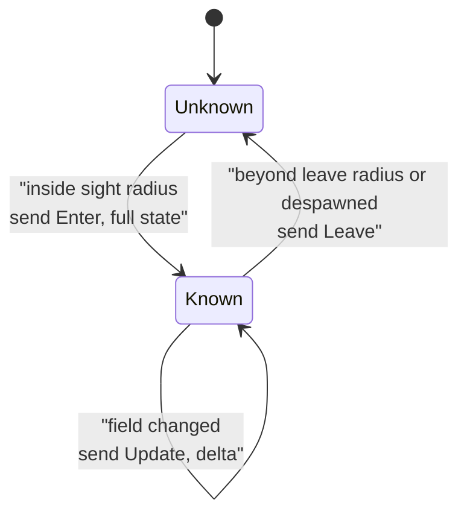
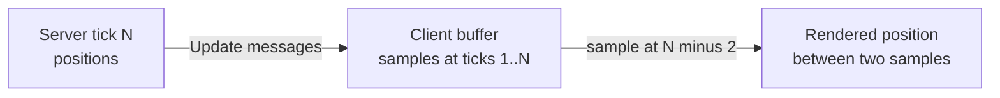
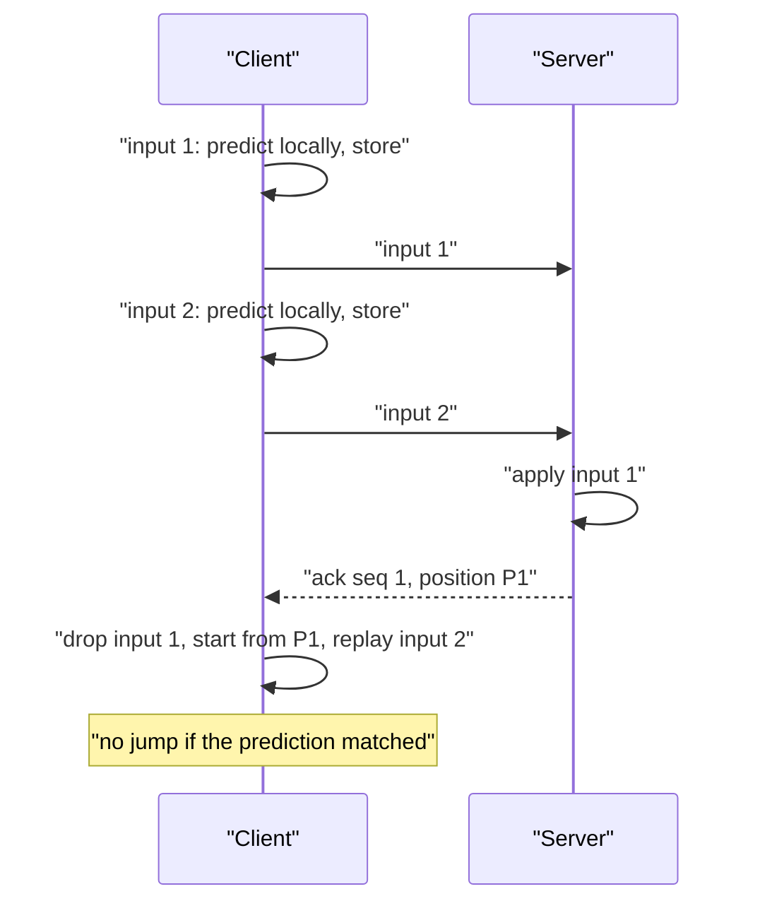
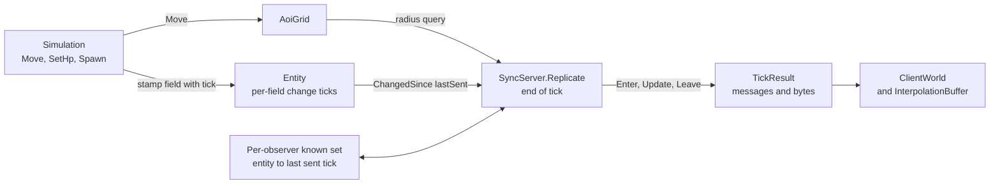

# Module 18: State sync and interest management

- **Goal:** understand how a server tells each player what is happening around them without sending the whole world to everyone, compare event, delta and snapshot replication, understand client prediction and reconciliation and when a game needs them, and build a small area-of-interest replication layer with enter/update/leave messages, delta encoding and a byte budget.
- **Prerequisites:** [03: The game loop and time](03-game-loop.md) (replication runs at the end of a tick), [04: Entities, world and zones](04-entities-world.md) (what an entity and its fields are), [17: Networking](17-networking.md) (how messages travel).
- **Example:** `examples/18-sync/` (`dotnet test examples/18-sync`)
- **Facts checked:** October 2026 (prices, licences and product status change; re-check before reuse)

## In short

A server owns the truth; each client holds a **replica** of the part of the world that player can see. **State synchronisation** is the job of keeping those replicas right at a bounded bandwidth. Two ideas do most of the work: **interest management** (send a player only what is near them, found with a spatial grid) and **delta encoding** (send only what changed since the last thing that player was told). Beyond that, the design space has three axes: how state travels (events, deltas or snapshots), how remote entities are drawn (interpolation, extrapolation or dead reckoning), and how the player's **own** character is handled (wait for the server, or **predict** locally and **reconcile** later). Click-to-move RPGs can wait; action games cannot. The example derives enter/update/leave messages from **per-field change ticks** and a **per-observer known set**, adds a prediction and reconciliation client, and proves it by test: 100 idle entities cost 2,100 bytes on the first tick and 0 bytes afterwards, and a client with three unacknowledged inputs shows no visible jump when the server confirms the first.

## 1. The concept

### 1.1 Replicas, and why not send everything

The server simulates the whole zone. A client needs only a picture of what its player can see. Sending every entity to every player costs `players × entities × rate`: a zone with 500 players and 2,000 entities at 10 updates per second is millions of entity-updates per second, almost all of them invisible to the receiver. It is also a cheating risk: a client that receives hidden entities can show them (a "map hack").

So the server keeps, for each player, an **observer view**: the set of entities that player's client currently knows about.

### 1.2 Snapshots, deltas and events

| Style | What is sent | Strengths | Weaknesses |
|---|---|---|---|
| **Full snapshot** | The complete state of everything visible, every update | Self-healing: one lost or late packet is fixed by the next | Bandwidth grows with entity count and field count, even when nothing moves |
| **Delta** | Only fields that changed since the last state the client is known to have | Tiny when the world is calm | The client must hold the previous state; a lost delta leaves it wrong until repaired |
| **Event** | A message per happening ("A moved to P", "B took 12 damage") | Smallest, maps to game logic and to animation | Every code path must emit its event; a missed event is a silent desync |

Real systems mix them: a full snapshot at enter, deltas afterwards, and a periodic or on-demand resync. Over a reliable ordered connection (TCP or WebSocket, as in this course) a delta is never lost in transit, so the remaining risk is a **logic** mistake, not a network one.

### 1.3 Dirty tracking

To build deltas the server must know **what changed**. The usual tool is a **dirty flag** (or a bit mask of dirty fields) set when a setter changes a value and cleared after replication. Two traps:

- Setting a field to the value it already has must not mark it dirty.
- A single cleared-after-send flag only works for one reader. With many observers, each needing changes since *its own* last send, store the **tick of the last change per field** instead. "Changed since tick T" then works for every observer, including ones that were skipped for a while.

### 1.4 Area of interest (AOI) with a grid

**Area of interest** means "the set of things this observer should know about", usually everything within a **sight radius**. Testing every entity against every observer is quadratic. A **uniform grid** (spatial hash) divides the map into square cells; each entity is in one cell; a radius query inspects only the cells overlapping the query box, then does an exact distance test. Moving within a cell costs nothing; crossing a border moves the entity between two lists.

### 1.5 Enter and leave, with hysteresis

The observer view changes shape as things move:

- **Enter (appear):** entity was unknown and is now in sight. Send its **full** state, once.
- **Update:** entity is known and a replicated field changed. Send the delta.
- **Leave (disappear):** entity was known and is no longer visible (moved away, died, despawned, teleported). Send its id so the client frees it.

If entering and leaving use the same radius, an entity walking along the border enters and leaves every tick. The fix is **hysteresis**: enter at the sight radius, leave only at a somewhat larger radius.



### 1.6 Update frequency per distance, and a bandwidth budget

Not everything needs the same freshness. A monster 5 metres away needs an update every tick; one at the edge of sight can be refreshed every fourth tick, and the client blends over the gap. This is **level of detail for networking** (Unreal calls it net update frequency and priority).

A **bandwidth budget** caps the bytes per observer per tick. When a crowd gathers, the server sends the most important messages first (nearest) and defers the rest. With per-field change ticks, a deferred update is not lost: it is still "changed since last sent" next tick.

### 1.7 Drawing other entities: interpolate, extrapolate or dead-reckon

Updates arrive in bursts, a tick apart, plus jitter. Drawing each position as it arrives looks jerky. Three remedies:

| Technique | How it works | Cost |
|---|---|---|
| **Entity interpolation** | Draw the world at `now − delay` (one to three ticks), always blending between two received samples | A small constant visual delay for other entities; never overshoots |
| **Extrapolation** | Guess forward from the last velocity when no new sample has arrived | No delay, but overshoots and snaps back when the guess is wrong |
| **Dead reckoning** | The server sends start, destination and speed once; the client computes positions in between | Almost no bandwidth; works only for movement the client can compute exactly |



### 1.8 Prediction and reconciliation: the player's own character

The remedies above handle *other* entities. For the player's **own** character a different problem appears: with a 100 ms round trip, waiting for the server before moving makes every key press feel 100 ms late. **Client-side prediction** removes the wait: the client applies the input locally at once, using the same movement rules as the server. Because the server is still the authority, the client must later **reconcile** with the server's answer.

The classic scheme has four steps:

1. Number every input (`seq`), apply it locally, and keep it in a **pending list**. Send it to the server.
2. The server applies inputs in order and replies with the **last sequence number it applied** and the authoritative state after it.
3. On each reply the client discards the pending inputs up to that number, **resets its state to the server's**, and **replays** the remaining pending inputs on top.
4. If the prediction was right, the replay lands exactly where the client already was and nothing is visible. If not (the server applied a slow effect, a wall, a stun), the client is pulled to the corrected position.



Prediction needs three things: **shared, deterministic movement code** (a pure function from state and input to state, identical on both sides), **numbered inputs** (so the client is an input stream, not a destination, see module 17), and a **correction policy** (snap for large errors, smooth blend for small ones). Predicting only movement is common; predicting hits, damage or loot is dangerous because a wrong guess is visible and cannot be quietly undone. Those usually wait for the server, with a local animation to hide the delay.

Action games add **lag compensation** on the server so that a shot fired at what the shooter saw still hits (module 09).

## 2. The design space

### 2.1 How state travels

| Option | Bandwidth | Robustness | Fits |
|---|---|---|---|
| **Events only** | Lowest | Weak: a forgotten event desyncs until the next enter | Small teams with strict discipline; one-shot happenings |
| **Snapshots** (full state at a fixed rate) | Highest | Strongest: self-healing | Small player counts, fast action games with delta compression, replays |
| **Deltas from generic change tracking** | Low | Strong: features just change fields | Persistent worlds with many entities and fields |
| **Hybrid**: state via deltas, one-shots (a hit, a sound) as events | Low | Strong | The usual best answer for online RPGs |

### 2.2 Interest management

| Option | Idea | Fits |
|---|---|---|
| **None** (everyone sees everything) | Send all | Matches of a few dozen players on a small map |
| **Radius on a grid** | Everything within sight range | Open-world RPGs; simple and cheap |
| **Zones and rooms** | Everyone in the same zone | Instanced or small-zone games; coarse |
| **Visibility sets, line of sight** | Radius plus occlusion | Shooters, stealth; costs more CPU |
| **Priority and relevancy scoring** | Radius plus importance (party members, bosses, targets) | Large crowds; combine with a byte budget |

Add a special rule for what must **always** be known regardless of distance: your own party, your target, a raid boss.

### 2.3 Prediction: how responsive must your character be?

| Game type | Control | What to do | Why |
|---|---|---|---|
| Click-to-move or tab-target RPG | Destination clicks | **No prediction.** Optionally play a local "walk starts" animation at once and let the server's reply set the path | A 100 to 200 ms delay before the walk starts is tolerable; skills have cooldowns anyway |
| Hybrid MMO with dodge or aimed skills | Direct movement, targeted abilities | **Predict movement; wait for the server on damage** | Movement feel matters; combat outcomes are authoritative |
| Single-character action RPG | Direct movement plus animation-driven skills | **Full prediction of movement and skill start**, server-side lag compensation | Latency is felt in every dodge and swing (module 09) |
| Party of several characters under one player | Leader driven, others by AI | Predict the **driven** character only; the others are interpolated like remote entities | Predicting AI behaviour is pointless: it is the server's decision |
| Turn-based | Commands | None | No real-time feel to protect |

### 2.4 How to choose

| Question | If yes |
|---|---|
| Do players steer their character every frame? | Use an input stream and prediction with reconciliation |
| Is a 150 ms delay before a click takes effect acceptable? | Skip prediction; spend the effort elsewhere |
| Are there thousands of entities per zone? | Grid interest management, deltas from change ticks, a byte budget |
| Is the team small and the feature list growing? | Generic change tracking, not one packet per feature |
| Are some happenings one-shot (hit, sound, effect)? | Keep those as events beside state deltas |

## 3. Trade-offs and pitfalls

- **Desync by omission.** In an event-only design, every feature that changes visible state needs its own packet and its own broadcast call. Forget one (a buff icon, an equipment change) and clients silently disagree until the next enter: the "ghost monster" and "wrong gear" bugs of older online games.
- **No resync path.** A snapshot design self-heals; a delta or event design needs a deliberate "re-send everything" tool, and discipline to call it.
- **Lag felt on every click.** Without prediction, every action waits one round trip. Fine for click-to-move on regional servers; poor for intercontinental play or action combat.
- **Prediction without determinism.** If client and server movement code differ (floating-point order, different collision data, different speed modifiers), the client is corrected constantly and the character rubber-bands. Share one implementation and cover it with tests.
- **Prediction of things the client cannot know.** Slows, stuns, knock-backs and other players' pushes arrive only from the server. Reconciliation must handle them, and the correction should be smoothed rather than snapped when small.
- **Edge flicker.** Equal enter and leave radii make entities pop in and out; use hysteresis.
- **Crowd floods.** A fixed radius floods a busy square. Add a byte budget and priority so important entities are not starved.
- **Cache coupling.** If the client keeps a cache of entity appearance that the server must also track, that cache is another thing that can drift.
- **Wall-clock timestamps** for interpolation make results depend on clock agreement; use ticks.

## 4. Build or buy

| | Unreal | Unity | Godot 4 |
|---|---|---|---|
| Replicated state | Property replication with change detection, plus RPCs; Iris, the newer replication system, adds filtering and prioritisation at scale (as of October 2026) | Netcode for GameObjects syncs variables and RPCs; Netcode for Entities (ECS) uses snapshots with ghosts | `MultiplayerSynchronizer` replicates listed properties; `MultiplayerSpawner` handles spawn and despawn |
| Interest management | Relevancy, net cull distance, dormancy, replication graph or Iris filters | Visibility per network object, and relevancy and importance in Netcode for Entities | Per-peer visibility on the synchronizer, with callbacks you write |
| Priority and frequency | Net priority and per-actor update frequency | Importance scaling in Netcode for Entities | Per-synchronizer interval |
| Prediction | Character movement is predicted and reconciled out of the box | Client prediction in Netcode for Entities | Not built in |
| Fit for a persistent-world server | Strong but tied to the Unreal server process | Tied to the Unity runtime | Light, but you write the scale-out |

**Could we build it ourselves?** Yes, with moderate effort for the world-replication part and high effort for prediction. The pieces are well known:

| Piece | Effort | Risk |
|---|---|---|
| Change tracking per field | Low | Low |
| AOI grid | Low | Low |
| Enter/update/leave per observer | Low-medium | Medium: edge cases at borders and despawns |
| Budget and priority | Medium | Medium: tuning, starvation of far entities |
| Binary encoding (quantise, varints) | Medium | Low |
| Client interpolation | Low | Low |
| Prediction and reconciliation for movement | Medium | Medium: needs shared deterministic code and good correction smoothing |
| Prediction of combat, rollback | High | High |

Open components help: a spatial hash is a few dozen lines; MessagePack or a hand-written binary writer covers encoding. Code generation (an AI-assisted pass that turns a field list into the diff and serialiser code) removes the main drawback of hand-written event packets, the forgotten send.

**What a proof of concept must prove.** (1) With a realistic crowd, say 200 players and 5,000 entities per zone at the chosen tick rate, replication per tick stays within a small fraction of the tick budget. (2) A crowded square stays under the per-player budget without starving distant entities for long. (3) A client that applies the message stream ends with exactly the server's visible state, checked by a replay test. (4) Interpolation looks smooth at your jitter. (5) If you predict: with 150 ms of latency and 5 percent jitter, corrections stay rare and small.

**Verdict: build** world replication with a generic change-tracking core and events only for one-shots. Build prediction for movement only if your game needs direct control. Use an engine's replication only if you already run that engine's server; its relevancy model is a good source of ideas either way.

## 5. The example

### Design



Mutations happen during the tick and are stamped with the current tick. `Replicate` runs once at the end, and for each observer: (1) emits `Leave` for known entities that vanished or passed the leave radius; (2) queries the grid out to the leave radius, nearest first; (3) for each candidate decides Enter (unknown and within sight), Update (known, its turn by distance, changed fields non-empty) or nothing; (4) skips anything that would overflow the budget, leaving it for next tick; (5) records the tick as `lastSent`.

Everything tunable is in `SyncConfig`: sight and leave radii, the "near" radius, the far update interval, the byte budget and the grid cell size. A different game changes those numbers and the entity fields, not the algorithm.

### Walkthrough

- **`Entity.cs`**: position, hp, appearance, each with a last-changed tick. Setting an identical value changes nothing. `ChangedSince(tick)` returns a `FieldMask`; `IsDirtyAt(tick)` is the classic per-tick dirty flag, shown for comparison.
- **`AoiGrid.cs`**: a spatial hash. `Query` scans only the cells overlapping the radius box, then does a circle test; `Move` touches cell lists only on a border crossing.
- **`SyncServer.cs`**: owns entities, grid and per-observer known sets. `Replicate` is the algorithm above. Ordering is deterministic (distance, then id).
- **`EnterMessage` / `UpdateMessage` / `LeaveMessage`**: records. An update carries a `FieldMask`, and only masked fields are counted on the wire.
- **`WireSize.cs`**: the byte estimate: 5-byte header, Enter 21 bytes, Update 6 plus the masked fields, Leave 5.
- **`SyncConfig.cs`**: sight 100, leave 120 (hysteresis), near 50, far interval 4 ticks, optional byte budget.
- **`ClientWorld.cs`, `ClientEntity.cs`**: apply messages to a replica.
- **`InterpolationBuffer.cs`**: timed position samples; `TrySample` blends linearly and clamps at the newest sample.
- **`Prediction.cs`**: `MoveRules` (the shared pure movement function), `AuthoritativeMover` (server side: applies numbered inputs and acknowledges), `PredictedClient` (applies inputs at once, keeps the pending list, reconciles on each ack).

The key lines, in `SyncServer.Replicate`, for a known entity:

```csharp
var interval = d2 <= near2 ? 1 : _config.FarInterval;
if ((tick + id.Value) % interval != 0) continue;   // not this entity's turn
var mask = e.ChangedSince(lastSent);
if (mask == FieldMask.None) continue;               // nothing new: send nothing
```

Adding `id.Value` spreads far entities across ticks so they do not all update on the same one.

And the whole of reconciliation, in `PredictedClient`:

```csharp
_pending.RemoveAll(i => i.Seq <= ack.LastSeq);        // the server has applied these
(X, Y) = (ack.X, ack.Y);                              // start from the server's truth
foreach (var input in _pending)                       // replay what is still in flight
    (X, Y) = MoveRules.Step(X, Y, input, _speed);
```

### Tests and their concrete numbers

29 tests, all passing (`dotnet test examples/18-sync`):

- **Enter** (`Replicate_EntityEntersSight_ExactlyOneEnterWithFullState`): an entity at (30, 40), distance 50, yields exactly one `EnterMessage` with hp 77 and appearance 5.
- **No change, no message** (`Replicate_UnchangedEntity_ProducesNoUpdate`); writing the same value again is also not a change.
- **Delta** (`Replicate_MovingEntity_UpdateCarriesOnlyPosition`): mask is `Position` only, 14 bytes against 21 for a full Enter. An HP change is 10 bytes.
- **Leave** (`Replicate_EntityWalksOutOfSight_ExactlyOneLeave`): moving to x = 500 gives one `Leave`, then silence.
- **Hysteresis**: at x = 110 (sight 100, leave 120) the entity stays known and gets an Update; at x = 130 it leaves.
- **100 idle entities** (`Replicate_HundredIdleEntities_BytesAreZeroAfterFirstTick`): 2,100 bytes on tick 1, 0 on ticks 2 and 3.
- **Distance frequency**: an entity at distance 80 that moves every tick is updated only on ticks 4 and 8, carrying its latest position (87), not every step.
- **Budget** (`Replicate_BudgetTooSmall_...`): with 42 bytes per tick and three new entities, the two nearest enter on tick 1, the third on tick 2, nothing is lost.
- **Interpolation**: samples at ticks 1 to 5, rendering at tick 3 (two ticks in the past) gives x = 30; samples (0, 0) at time 10 and (40, 20) at time 14, sampled at time 11, give (10, 5); past the newest sample it holds.
- **Replica consistency**: a client applying the stream of a 12-tick scripted scene ends with the same visible state as the server.
- **Prediction is immediate** (`Predict_MovesTheClientImmediately...`): at speed 2, one input moves the client from x = 50 to 52 before any reply.
- **Right prediction, no correction**: after the ack the correction distance is 0.
- **Inputs in flight** (`Reconcile_WithInputsStillInFlight_...`): three inputs predict x = 56; the server acknowledges only the first (x = 52); the client replays inputs 2 and 3 and stays at 56, with a correction of 0 and 2 inputs still pending.
- **Server disagrees** (`Reconcile_WhenServerDisagrees_...`): the server applies speed 1 where the client assumed 2. After the first ack the client is pulled from 56 to 55 (correction 1); once every input is acknowledged it equals the server's x = 53.
- **World edge**: both sides clamp at 100, so no correction.

### What the example deliberately leaves out

- **No real network.** Messages are objects; a host would serialise them (see `WireSize` for the layout idea).
- **Quantisation and varints.** Real positions use 16-bit fixed point; the estimate uses 32-bit floats.
- **Smooth correction.** `PredictedClient` snaps to the reconciled position; a real client blends small errors over a few frames.
- **Prediction of anything but movement**, and server-side lag compensation (module 09).
- **No resync message.** Over an ordered reliable transport it is not needed for network reasons; a production system adds one for bug recovery.
- **No shared-cell batching.** Each observer's list is computed separately; at large scale you would encode a shared update once per group.
- **Single zone, single thread**, like the course's other examples.

## Key takeaways

- Replication keeps per-player replicas right: interest management decides *who* hears about an entity, delta encoding decides *what* they hear.
- A uniform grid makes area-of-interest queries cheap; use a larger leave radius than enter radius to stop flicker.
- Store the tick of each field's last change instead of one dirty flag; every observer can then ask "what changed since I last told you?".
- Events are smallest but cause desync by omission; generic change tracking for state plus events for one-shots is the robust hybrid.
- Prediction with reconciliation (numbered inputs, replay of unacknowledged inputs on the server's state) is essential for direct-control action games and optional for click-to-move RPGs; it needs one shared, deterministic movement function.
- Build, do not buy, the world replication layer: change tracking, a grid and per-observer known sets are small, testable code; engine systems are a good source of ideas (relevancy, priority, frequency).
- The example proves the contract by test: one Enter with full state, no Update when nothing changed, a position-only delta of 14 bytes, one Leave, 100 idle entities costing 2,100 bytes once and 0 afterwards, and no visible jump when a prediction was right.

## Further reading
- Glenn Fiedler, ["Snapshot Interpolation"](https://gafferongames.com/post/snapshot_interpolation/) and ["State Synchronization"](https://gafferongames.com/post/state_synchronization/).
- Gabriel Gambetta, ["Client-Side Prediction and Server Reconciliation"](https://www.gabrielgambetta.com/client-side-prediction-server-reconciliation.html) and ["Entity Interpolation"](https://www.gabrielgambetta.com/entity-interpolation.html).
- Valve, ["Source Multiplayer Networking"](https://developer.valvesoftware.com/wiki/Source_Multiplayer_Networking) (entity interpolation, lag compensation).
- Unreal Engine documentation: [Networking Overview](https://dev.epicgames.com/documentation/en-us/unreal-engine/networking-overview-for-unreal-engine) (relevancy, priority, Iris).
- Unity: [Netcode for GameObjects](https://docs-multiplayer.unity3d.com/netcode/current/about/) and [Netcode for Entities](https://docs.unity3d.com/Packages/com.unity.netcode@latest).
- Godot: [High-level multiplayer](https://docs.godotengine.org/en/stable/tutorials/networking/high_level_multiplayer.html).
